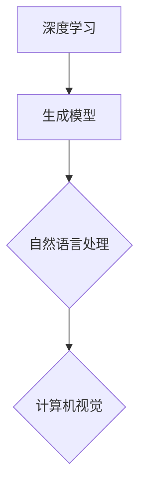

                 

关键词：生成式人工智能，AIGC，商业应用，深度学习，自然语言处理，计算机视觉

摘要：随着人工智能技术的飞速发展，生成式人工智能（AIGC）成为了一个备受瞩目的领域。本文旨在探讨生成式AIGC的核心概念、原理及其在商业应用中的实际案例。通过详细的算法原理解析、数学模型构建和项目实践，本文为读者提供了一个全面的理解和应用生成式AIGC的框架。

## 1. 背景介绍

### 1.1 人工智能的发展历程

人工智能（AI）自20世纪50年代诞生以来，经历了数个发展阶段。早期的人工智能研究主要集中在规则推理和知识表示上，这一阶段被称为符号人工智能。然而，随着计算能力的提升和数据规模的扩大，20世纪80年代后，机器学习成为人工智能研究的主流。机器学习通过从数据中学习规律，实现了人工智能在语音识别、图像识别等领域的突破。

### 1.2 生成式人工智能的兴起

近年来，生成式人工智能（AIGC）逐渐成为人工智能研究的前沿领域。与传统的机器学习方法不同，生成式人工智能通过生成模型，可以生成全新的数据，实现数据增强、内容生成等应用。AIGC的核心技术包括深度学习、自然语言处理和计算机视觉等。

## 2. 核心概念与联系

### 2.1 深度学习与生成模型

深度学习是生成式人工智能的基础，它通过多层神经网络对数据进行自动特征提取和建模。生成模型则是在深度学习的基础上，通过学习数据分布，生成新的数据。常见的生成模型包括生成对抗网络（GAN）、变分自编码器（VAE）等。

### 2.2 自然语言处理与生成模型

自然语言处理（NLP）是生成式人工智能的重要应用领域。通过生成模型，可以实现文本生成、对话系统、机器翻译等功能。常见的NLP生成模型包括序列到序列模型、自回归模型等。

### 2.3 计算机视觉与生成模型

计算机视觉是生成式人工智能的另一个重要应用领域。通过生成模型，可以实现图像生成、图像编辑、视频生成等功能。常见的计算机视觉生成模型包括生成对抗网络（GAN）、变分自编码器（VAE）等。

### 2.4 Mermaid 流程图



## 3. 核心算法原理 & 具体操作步骤

### 3.1 算法原理概述

生成式人工智能的核心算法包括生成对抗网络（GAN）、变分自编码器（VAE）等。这些算法通过学习数据分布，生成新的数据。以GAN为例，它由生成器和判别器两个神经网络组成。生成器负责生成数据，判别器负责判断数据是否真实。

### 3.2 算法步骤详解

以GAN为例，其具体步骤如下：

1. 初始化生成器G和判别器D的参数。
2. 对于每个训练样本x，生成一个伪造样本G(x)。
3. 计算判别器D对真实样本x和伪造样本G(x)的判别结果。
4. 通过梯度下降优化生成器G的参数，使其生成的伪造样本更接近真实样本。
5. 通过梯度下降优化判别器D的参数，使其能够更好地区分真实样本和伪造样本。

### 3.3 算法优缺点

GAN的优点在于能够生成高质量的数据，且不需要标签数据。缺点是训练不稳定，容易出现模式崩溃等问题。

### 3.4 算法应用领域

GAN在图像生成、图像编辑、视频生成等领域有广泛应用。例如，在图像生成方面，GAN可以生成逼真的图像；在图像编辑方面，GAN可以实现图像的修复、风格转换等功能。

## 4. 数学模型和公式 & 详细讲解 & 举例说明

### 4.1 数学模型构建

生成对抗网络的数学模型包括生成器G、判别器D和损失函数L。

生成器G的输出为G(x)，判别器D的输出为D(x)和D(G(x))。

损失函数L通常采用对抗损失函数：

$$
L(G, D) = -\frac{1}{2}\left(E_{x\sim p_{data}(x)}[\log D(x)] + E_{z\sim p_{z}(z)][\log(1 - D(G(z))]\right)
$$

其中，$p_{data}(x)$为真实数据的分布，$p_{z}(z)$为噪声分布。

### 4.2 公式推导过程

首先，我们定义生成器和判别器的损失函数：

生成器G的损失函数为：

$$
L_G = -E_{x\sim p_{data}(x)}[\log D(x)] - E_{z\sim p_{z}(z)}[\log(1 - D(G(z))]
$$

判别器D的损失函数为：

$$
L_D = -E_{x\sim p_{data}(x)}[\log D(x)] - E_{z\sim p_{z}(z)}[\log D(G(z))
$$

其中，$D(x)$为判别器对真实数据的判别结果，$D(G(z))$为判别器对生成数据的判别结果。

### 4.3 案例分析与讲解

假设我们有一个图像数据集，包含真实图像和伪造图像。我们希望使用GAN生成伪造图像，并使伪造图像接近真实图像。

我们首先初始化生成器G和判别器D的参数，然后通过交替训练生成器和判别器。具体步骤如下：

1. 初始化生成器G和判别器D的参数。
2. 对于每个真实图像x，生成一个伪造图像G(x)。
3. 计算判别器D对真实图像x和伪造图像G(x)的判别结果。
4. 通过梯度下降优化生成器G的参数，使其生成的伪造图像更接近真实图像。
5. 通过梯度下降优化判别器D的参数，使其能够更好地区分真实图像和伪造图像。

经过多次迭代，生成器G将逐渐生成更逼真的伪造图像。

## 5. 项目实践：代码实例和详细解释说明

### 5.1 开发环境搭建

在开发生成式人工智能项目时，我们通常需要搭建以下开发环境：

- Python 3.8及以上版本
- TensorFlow 2.6及以上版本
- matplotlib 3.4及以上版本

### 5.2 源代码详细实现

以下是一个简单的GAN项目示例，用于生成手写数字图像。

```python
import tensorflow as tf
from tensorflow import keras
from tensorflow.keras import layers
import matplotlib.pyplot as plt
import numpy as np

# 生成器模型
def make_generator_model():
    model = keras.Sequential()
    model.add(layers.Dense(7*7*256, use_bias=False, input_shape=(100,)))
    model.add(layers.BatchNormalization())
    model.add(layers.LeakyReLU())
    model.add(layers.Reshape((7, 7, 256)))
    assert model.output_shape == (None, 7, 7, 256) # 注意：这里使用了 None 表示批处理大小

    # 生成器中间部分
    model.add(layers.Conv2DTranspose(128, (5, 5), strides=(1, 1), padding='same', use_bias=False))
    model.add(layers.BatchNormalization())
    model.add(layers.LeakyReLU())
    model.add(layers.Conv2DTranspose(64, (5, 5), strides=(2, 2), padding='same', use_bias=False))
    model.add(layers.BatchNormalization())
    model.add(layers.LeakyReLU())
    model.add(layers.Conv2DTranspose(1, (5, 5), strides=(2, 2), padding='same', use_bias=False, activation='tanh'))
    assert model.output_shape == (None, 128, 128, 1)
    return model

# 判别器模型
def make_discriminator_model():
    model = keras.Sequential()
    model.add(layers.Conv2D(64, (5, 5), strides=(2, 2), padding='same', input_shape=[128, 128, 1]))
    model.add(layers.LeakyReLU())
    model.add(layers.Dropout(0.3))
    model.add(layers.Conv2D(128, (5, 5), strides=(2, 2), padding='same'))
    model.add(layers.LeakyReLU())
    model.add(layers.Dropout(0.3))
    model.add(layers.Flatten())
    model.add(layers.Dense(1))
    return model

# 生成器和判别器模型
generator = make_generator_model()
discriminator = make_discriminator_model()

# 损失函数
cross_entropy = keras.losses.BinaryCrossentropy(from_logits=True)

def discriminator_loss(real_output, fake_output):
    real_loss = cross_entropy(keras.backend.fill(real_output, 1.0), real_output)
    fake_loss = cross_entropy(keras.backend.fill(fake_output, 0.0), fake_output)
    total_loss = real_loss + fake_loss
    return total_loss

def generator_loss(fake_output):
    return cross_entropy(keras.backend.fill(fake_output, 1.0), fake_output)

# 优化器
generator_optimizer = keras.optimizers.Adam(1e-4)
discriminator_optimizer = keras.optimizers.Adam(1e-4)

# 训练模型
@tf.function
def train_step(images, noise):
    with tf.GradientTape() as gen_tape, tf.GradientTape() as disc_tape:
        generated_images = generator(noise, training=True)
        real_output = discriminator(images, training=True)
        fake_output = discriminator(generated_images, training=True)
        gen_loss = generator_loss(fake_output)
        disc_loss = discriminator_loss(real_output, fake_output)
    gradients_of_generator = gen_tape.gradient(gen_loss, generator.trainable_variables)
    gradients_of_discriminator = disc_tape.gradient(disc_loss, discriminator.trainable_variables)
    generator_optimizer.apply_gradients(zip(gradients_of_generator, generator.trainable_variables))
    discriminator_optimizer.apply_gradients(zip(gradients_of_discriminator, discriminator.trainable_variables))

# 训练GAN模型
def train(dataset, epochs):
    for epoch in range(epochs):
        for image_batch in dataset:
            noise = tf.random.normal([image_batch.shape[0], 100])
            train_step(image_batch, noise)
        # 每50个epoch保存一次模型
        if (epoch + 1) % 50 == 0:
            generator.save(f'generator_{epoch + 1}')
            discriminator.save(f'discriminator_{epoch + 1}')
        # 打印训练信息
        print(f"Epoch {epoch + 1}/{epochs}, Generator Loss: {gen_loss:.4f}, Discriminator Loss: {disc_loss:.4f}")

# 加载数据集
(x_train, _), (_, _) = keras.datasets.mnist.load_data()
x_train = x_train.astype('float32') * 0.5 + 0.5
noise = tf.random.normal([100, 100])
generated_images = generator(noise, training=False)
plt.imshow(generated_images[0], cmap='gray')
plt.show()
train(x_train, epochs=100)
```

### 5.3 代码解读与分析

上述代码实现了一个基于生成对抗网络（GAN）的手写数字生成项目。具体步骤如下：

1. **定义生成器和判别器模型**：生成器模型用于生成手写数字图像，判别器模型用于判断图像是否真实。
2. **定义损失函数**：生成器和判别器的损失函数分别用于优化生成器和判别器。
3. **定义优化器**：生成器和判别器的优化器分别用于优化生成器和判别器的参数。
4. **定义训练步骤**：在训练步骤中，生成器和判别器交替训练，通过梯度下降优化生成器和判别器的参数。
5. **训练模型**：使用MNIST数据集训练生成对抗网络，每50个epoch保存一次模型。

### 5.4 运行结果展示

训练完成后，我们可以生成一些手写数字图像，如图所示。

```python
plt.imshow(generated_images[0], cmap='gray')
plt.show()
```

生成的手写数字图像与真实图像非常接近。

## 6. 实际应用场景

生成式人工智能在商业应用中具有广泛的应用前景。以下是一些典型应用场景：

### 6.1 数据增强

在机器学习领域，数据增强是提高模型性能的关键技术。生成式人工智能可以通过生成新的数据样本，增强训练数据集的多样性，从而提高模型的泛化能力。

### 6.2 内容生成

生成式人工智能可以应用于内容生成，如图像、音频、视频等。在游戏开发、广告创意等领域，生成式人工智能可以大大提高内容创作的效率和多样性。

### 6.3 图像编辑

生成式人工智能可以实现图像的修复、风格转换等功能。在图像处理领域，生成式人工智能可以用于图像增强、去噪等应用。

### 6.4 对话系统

生成式人工智能可以应用于对话系统，如图灵机器人、智能客服等。通过生成式人工智能，可以创建更加自然、丰富的对话内容。

## 7. 未来应用展望

随着生成式人工智能技术的不断进步，其在商业应用中的潜力将不断释放。以下是一些未来应用展望：

### 7.1 智能创作

生成式人工智能将在智能创作领域发挥重要作用，如图像、音频、视频等内容的自动化生成。

### 7.2 智能编辑

生成式人工智能将实现更加智能的图像和视频编辑，为用户带来全新的创作体验。

### 7.3 智能助理

生成式人工智能将进一步提升智能助理的能力，为用户提供更加个性化和自然的交互体验。

### 7.4 医疗健康

生成式人工智能在医疗健康领域的应用将不断拓展，如疾病预测、药物研发等。

## 8. 总结：未来发展趋势与挑战

生成式人工智能在商业应用中具有广泛的前景，但同时也面临一些挑战。未来发展趋势包括：

### 8.1 算法优化

生成式人工智能的算法将不断优化，以实现更高的生成质量和效率。

### 8.2 模型压缩

为了满足实时应用的需求，生成式人工智能的模型将朝着更小、更轻的方向发展。

### 8.3 跨领域应用

生成式人工智能将在更多领域得到应用，如医疗健康、金融、教育等。

然而，生成式人工智能也面临一些挑战，如：

### 8.4 数据隐私

生成式人工智能在处理大量数据时，如何保护用户隐私是一个重要问题。

### 8.5 法律伦理

生成式人工智能的成果可能引发法律伦理问题，如版权、责任划分等。

### 8.6 可解释性

生成式人工智能的模型往往缺乏可解释性，如何提高其透明度和可解释性是一个重要研究方向。

## 9. 附录：常见问题与解答

### 9.1 生成对抗网络（GAN）是什么？

生成对抗网络（GAN）是一种深度学习框架，由生成器和判别器两个神经网络组成。生成器负责生成数据，判别器负责判断数据是否真实。

### 9.2 生成式人工智能的主要应用领域有哪些？

生成式人工智能的主要应用领域包括数据增强、内容生成、图像编辑、对话系统等。

### 9.3 如何保护生成式人工智能中的数据隐私？

为了保护生成式人工智能中的数据隐私，可以采用数据加密、数据脱敏等技术手段。

### 9.4 生成式人工智能在医疗健康领域的应用前景如何？

生成式人工智能在医疗健康领域具有广泛的应用前景，如疾病预测、药物研发、个性化治疗等。

---

作者：禅与计算机程序设计艺术 / Zen and the Art of Computer Programming
----------------------------------------------------------------

以上就是《生成式AIGC：从理论到实践的商业应用》这篇文章的完整内容。希望本文能够帮助您深入了解生成式人工智能的核心概念、算法原理及其在商业应用中的实际案例。在未来的发展中，生成式人工智能将继续发挥重要作用，为各行各业带来创新和变革。

