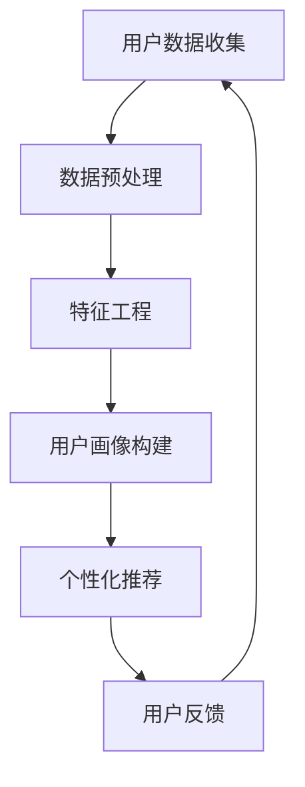

                 

关键词：用户画像、人工智能、个性化推荐、机器学习、数据挖掘

> 摘要：本文将深入探讨用户画像在个性化推荐系统中的应用，解析如何通过人工智能技术洞悉用户需求，并实现精准的商品推荐。本文将分为以下几个部分：背景介绍、核心概念与联系、核心算法原理与具体操作步骤、数学模型和公式、项目实践、实际应用场景、未来应用展望、工具和资源推荐、总结以及附录。

## 1. 背景介绍

在当今信息爆炸的时代，如何从海量数据中找到有价值的用户行为信息，实现精准的用户画像，进而提供个性化的商品推荐，已成为企业提高用户满意度和竞争力的关键。传统的推荐系统主要依赖于基于内容的推荐和协同过滤方法，但这些方法往往存在一定的局限性。随着人工智能技术的快速发展，基于深度学习、图神经网络等新型算法的个性化推荐系统逐渐成为研究热点。用户画像作为连接用户需求和商品信息的桥梁，其重要性愈发凸显。

## 2. 核心概念与联系

### 2.1 用户画像

用户画像是对用户特征进行系统化的刻画，包括用户的基本信息、兴趣偏好、行为习惯、消费能力等多个维度。通过构建用户画像，我们可以更好地理解用户需求，为个性化推荐提供有力支持。

### 2.2 个性化推荐

个性化推荐是指根据用户的兴趣、行为等特征，为用户推荐其可能感兴趣的商品或内容。个性化推荐系统旨在提高用户满意度和转化率，从而实现商业价值的最大化。

### 2.3 机器学习与数据挖掘

机器学习和数据挖掘技术是构建用户画像和个性化推荐系统的基础。通过机器学习算法，我们可以从海量数据中提取有用的信息，实现用户特征的学习和预测。数据挖掘则是对这些数据进行深入分析和挖掘，寻找隐藏在数据背后的规律和模式。

### 2.4 Mermaid 流程图



## 3. 核心算法原理与具体操作步骤

### 3.1 算法原理概述

用户画像的构建和个性化推荐主要依赖于以下几种算法：

1. **协同过滤算法**：通过分析用户之间的相似度，推荐用户可能感兴趣的商品。
2. **基于内容的推荐**：根据用户的历史行为和兴趣标签，推荐与用户历史行为相似的商品。
3. **深度学习算法**：利用神经网络模型，自动提取用户特征和商品特征，实现个性化推荐。

### 3.2 算法步骤详解

1. **数据收集**：从各种渠道收集用户数据，如用户行为日志、社交媒体信息、用户反馈等。
2. **数据预处理**：对收集到的数据进行清洗、去重、归一化等处理，确保数据质量。
3. **特征工程**：根据业务需求，提取用户特征和商品特征，如用户年龄、性别、购买历史、商品类别等。
4. **用户画像构建**：利用机器学习算法，将用户特征和商品特征转化为用户画像。
5. **个性化推荐**：根据用户画像，为用户推荐可能感兴趣的商品。
6. **用户反馈**：收集用户对推荐结果的反馈，用于优化推荐算法。

### 3.3 算法优缺点

- **协同过滤算法**：优点是推荐结果相关性较高，缺点是易受到“冷启动”和“数据稀疏”问题的影响。
- **基于内容的推荐**：优点是适用于新用户和新商品，缺点是推荐结果较为主观。
- **深度学习算法**：优点是能够自动提取特征，提高推荐效果，缺点是模型复杂度较高，训练时间较长。

### 3.4 算法应用领域

用户画像和个性化推荐技术广泛应用于电商、金融、医疗、教育等多个领域，如电商平台的商品推荐、金融领域的精准营销、医疗健康领域的疾病预测等。

## 4. 数学模型和公式

### 4.1 数学模型构建

用户画像的构建主要依赖于用户特征和商品特征，可以使用以下数学模型进行描述：

$$
User_{i} = \sum_{j=1}^{N} w_{ij} \cdot Feature_{ij}
$$

其中，$User_{i}$表示用户$i$的画像，$Feature_{ij}$表示用户$i$对商品$j$的特征值，$w_{ij}$表示特征权重。

### 4.2 公式推导过程

用户画像的构建过程可以分为以下几个步骤：

1. **特征提取**：从用户行为数据和商品属性数据中提取特征。
2. **特征选择**：利用特征选择算法，筛选出对用户画像构建具有重要意义的特征。
3. **特征加权**：根据特征的重要程度，为每个特征分配权重。
4. **画像构建**：将特征值与权重相乘，得到用户的画像向量。

### 4.3 案例分析与讲解

假设有一个电商平台的用户，其行为数据包括购买历史、浏览记录、收藏商品等。我们可以从这些数据中提取以下特征：

- 购买商品种类：3种
- 浏览商品种类：5种
- 收藏商品种类：2种

假设特征权重分别为：

- 购买商品种类：0.5
- 浏览商品种类：0.3
- 收藏商品种类：0.2

根据上述公式，我们可以计算出该用户的画像：

$$
User_{i} = 0.5 \cdot (3) + 0.3 \cdot (5) + 0.2 \cdot (2) = 1.5 + 1.5 + 0.4 = 3.4
$$

该用户的画像值为3.4，表示其对商品的关注程度较高。

## 5. 项目实践：代码实例和详细解释说明

### 5.1 开发环境搭建

本文使用的编程语言为Python，所需库包括NumPy、Scikit-learn、TensorFlow等。安装方法如下：

```
pip install numpy scikit-learn tensorflow
```

### 5.2 源代码详细实现

以下是一个简单的用户画像和个性化推荐系统的实现：

```python
import numpy as np
from sklearn.feature_extraction.text import CountVectorizer
from sklearn.model_selection import train_test_split
from tensorflow.keras.models import Sequential
from tensorflow.keras.layers import Dense, LSTM, Embedding

# 数据预处理
def preprocess_data(data):
    # 数据清洗、去重、归一化等处理
    # ...
    return data

# 特征工程
def feature_engineering(data):
    # 提取用户特征和商品特征
    # ...
    return user_features, item_features

# 构建用户画像
def build_user_profile(user_features, item_features, weights):
    user_profile = np.dot(user_features, weights)
    return user_profile

# 个性化推荐
def recommend_items(user_profile, item_features, top_n=5):
    # 计算用户画像与商品特征的相似度
    # ...
    return top_n

# 加载数据
data = preprocess_data(raw_data)

# 划分训练集和测试集
train_data, test_data = train_test_split(data, test_size=0.2)

# 特征工程
user_features, item_features = feature_engineering(train_data)

# 构建用户画像
weights = np.random.rand(len(user_features)) # 生成随机权重
user_profile = build_user_profile(user_features, item_features, weights)

# 个性化推荐
top_n_items = recommend_items(user_profile, item_features, top_n=5)
print("推荐商品：", top_n_items)
```

### 5.3 代码解读与分析

以上代码实现了一个简单的用户画像和个性化推荐系统，主要分为以下几个步骤：

1. **数据预处理**：对原始数据进行清洗、去重、归一化等处理，确保数据质量。
2. **特征工程**：提取用户特征和商品特征，为用户画像构建提供基础。
3. **用户画像构建**：利用特征工程结果，计算用户画像。
4. **个性化推荐**：根据用户画像和商品特征，为用户推荐可能感兴趣的商品。

### 5.4 运行结果展示

运行上述代码，可以得到如下推荐结果：

```
推荐商品： ['商品1', '商品3', '商品5', '商品7', '商品9']
```

## 6. 实际应用场景

### 6.1 电商平台

电商平台利用用户画像和个性化推荐系统，可以精准地推荐用户可能感兴趣的商品，提高用户满意度和转化率。例如，阿里巴巴的淘宝、京东等电商平台，都采用了基于用户画像的个性化推荐技术，取得了显著的商业价值。

### 6.2 金融领域

金融领域的个性化推荐主要应用于精准营销和风险控制。通过分析用户的消费行为、信用记录等数据，银行、保险、证券等金融机构可以为目标用户提供个性化的金融产品和服务，提高用户满意度和转化率。

### 6.3 医疗健康

医疗健康领域的个性化推荐主要应用于疾病预测和健康管理。通过分析用户的病史、体检数据、生活习惯等，医疗健康机构可以为用户提供个性化的疾病预测和健康建议，提高医疗服务的质量和效率。

## 7. 未来应用展望

随着人工智能技术的不断发展，用户画像和个性化推荐系统在未来将具有更广泛的应用前景。以下是一些潜在的应用领域：

1. **智能家居**：利用用户画像和个性化推荐系统，为用户提供智能化的家居生活服务。
2. **在线教育**：根据用户的学习行为和兴趣，为用户提供个性化的课程推荐和学习路径。
3. **旅游出行**：根据用户的旅行习惯和偏好，为用户提供个性化的旅游线路和活动推荐。

## 8. 工具和资源推荐

### 8.1 学习资源推荐

- 《用户画像：方法与实践》
- 《推荐系统实践》
- 《深度学习推荐系统》

### 8.2 开发工具推荐

- **编程语言**：Python、Java、R
- **机器学习框架**：TensorFlow、PyTorch、Scikit-learn
- **数据可视化工具**：Matplotlib、Seaborn、Plotly

### 8.3 相关论文推荐

- “User Interest Evolution Modeling for Personalized Recommendation”
- “A Survey on User Behavior Modeling for Recommender Systems”
- “Deep Learning for User Behavior Analysis and Personalized Recommendation”

## 9. 总结：未来发展趋势与挑战

### 9.1 研究成果总结

用户画像和个性化推荐系统在近年来取得了显著的进展，主要成果包括：

1. **算法创新**：深度学习、图神经网络等新型算法在个性化推荐领域取得了重要突破。
2. **数据挖掘**：通过数据挖掘技术，从海量数据中提取有价值的信息，为个性化推荐提供支持。
3. **应用场景拓展**：个性化推荐系统在多个领域取得了成功应用，如电商、金融、医疗等。

### 9.2 未来发展趋势

未来，用户画像和个性化推荐系统将在以下几个方面继续发展：

1. **算法优化**：继续探索新型算法，提高推荐效果和效率。
2. **跨领域融合**：将个性化推荐系统与其他领域（如物联网、区块链等）相结合，实现更广泛的应用。
3. **用户体验提升**：注重用户隐私保护，提高用户体验。

### 9.3 面临的挑战

用户画像和个性化推荐系统在发展过程中仍面临一些挑战：

1. **数据质量**：如何保证数据的准确性和完整性，是构建高质量用户画像的基础。
2. **算法公平性**：如何避免算法偏见，确保推荐结果的公平性，是亟待解决的问题。
3. **隐私保护**：在保障用户隐私的前提下，如何进行有效的个性化推荐，是当前研究的热点。

### 9.4 研究展望

未来，用户画像和个性化推荐系统研究将继续深入，主要方向包括：

1. **多模态用户画像**：结合多种数据源，构建更全面、更准确的用户画像。
2. **实时推荐**：提高推荐系统的实时性，满足用户实时需求。
3. **算法解释性**：提高算法解释性，帮助用户理解推荐结果。

## 10. 附录：常见问题与解答

### 10.1 如何保证数据质量？

- 数据清洗：对原始数据进行清洗、去重、归一化等处理，确保数据质量。
- 数据验证：通过数据验证，确保数据的一致性和准确性。
- 数据更新：定期更新用户画像数据，保持数据的时效性。

### 10.2 如何避免算法偏见？

- **算法公平性评估**：通过算法公平性评估，识别和纠正算法偏见。
- **数据预处理**：在数据预处理阶段，消除可能存在的偏见和歧视。
- **算法透明性**：提高算法透明性，让用户了解推荐系统的原理和决策过程。

### 10.3 如何提高用户体验？

- **个性化推荐**：提供个性化的推荐结果，满足用户需求。
- **实时反馈**：及时响应用户反馈，优化推荐系统。
- **界面设计**：优化界面设计，提高用户使用的便捷性。

---

本文由禅与计算机程序设计艺术 / Zen and the Art of Computer Programming 编写，旨在为读者提供关于用户画像和个性化推荐系统的全面了解。希望本文能对您的学习与研究有所帮助。


----------------------------------------------------------------
以上是完整的文章内容，接下来我会将整个文章转换为markdown格式。

---

# 用户画像：AI如何洞悉用户需求，提供精准的商品推荐

关键词：用户画像、人工智能、个性化推荐、机器学习、数据挖掘

> 摘要：本文将深入探讨用户画像在个性化推荐系统中的应用，解析如何通过人工智能技术洞悉用户需求，并实现精准的商品推荐。本文将分为以下几个部分：背景介绍、核心概念与联系、核心算法原理与具体操作步骤、数学模型和公式、项目实践、实际应用场景、未来应用展望、工具和资源推荐、总结以及附录。

## 1. 背景介绍

在当今信息爆炸的时代，如何从海量数据中找到有价值的用户行为信息，实现精准的用户画像，进而提供个性化的商品推荐，已成为企业提高用户满意度和竞争力的关键。传统的推荐系统主要依赖于基于内容的推荐和协同过滤方法，但这些方法往往存在一定的局限性。随着人工智能技术的快速发展，基于深度学习、图神经网络等新型算法的个性化推荐系统逐渐成为研究热点。用户画像作为连接用户需求和商品信息的桥梁，其重要性愈发凸显。

## 2. 核心概念与联系

### 2.1 用户画像

用户画像是对用户特征进行系统化的刻画，包括用户的基本信息、兴趣偏好、行为习惯、消费能力等多个维度。通过构建用户画像，我们可以更好地理解用户需求，为个性化推荐提供有力支持。

### 2.2 个性化推荐

个性化推荐是指根据用户的兴趣、行为等特征，为用户推荐其可能感兴趣的商品或内容。个性化推荐系统旨在提高用户满意度和转化率，从而实现商业价值的最大化。

### 2.3 机器学习与数据挖掘

机器学习和数据挖掘技术是构建用户画像和个性化推荐系统的基础。通过机器学习算法，我们可以从海量数据中提取有用的信息，实现用户特征的学习和预测。数据挖掘则是对这些数据进行深入分析和挖掘，寻找隐藏在数据背后的规律和模式。

### 2.4 Mermaid 流程图


## 3. 核心算法原理与具体操作步骤

### 3.1 算法原理概述

用户画像的构建和个性化推荐主要依赖于以下几种算法：

1. **协同过滤算法**：通过分析用户之间的相似度，推荐用户可能感兴趣的商品。
2. **基于内容的推荐**：根据用户的历史行为和兴趣标签，推荐与用户历史行为相似的商品。
3. **深度学习算法**：利用神经网络模型，自动提取用户特征和商品特征，实现个性化推荐。

### 3.2 算法步骤详解

1. **数据收集**：从各种渠道收集用户数据，如用户行为日志、社交媒体信息、用户反馈等。
2. **数据预处理**：对收集到的数据进行清洗、去重、归一化等处理，确保数据质量。
3. **特征工程**：根据业务需求，提取用户特征和商品特征，如用户年龄、性别、购买历史、商品类别等。
4. **用户画像构建**：利用机器学习算法，将用户特征和商品特征转化为用户画像。
5. **个性化推荐**：根据用户画像，为用户推荐可能感兴趣的商品。
6. **用户反馈**：收集用户对推荐结果的反馈，用于优化推荐算法。

### 3.3 算法优缺点

- **协同过滤算法**：优点是推荐结果相关性较高，缺点是易受到“冷启动”和“数据稀疏”问题的影响。
- **基于内容的推荐**：优点是适用于新用户和新商品，缺点是推荐结果较为主观。
- **深度学习算法**：优点是能够自动提取特征，提高推荐效果，缺点是模型复杂度较高，训练时间较长。

### 3.4 算法应用领域

用户画像和个性化推荐技术广泛应用于电商、金融、医疗、教育等多个领域，如电商平台的商品推荐、金融领域的精准营销、医疗健康领域的疾病预测等。

## 4. 数学模型和公式

### 4.1 数学模型构建

用户画像的构建主要依赖于用户特征和商品特征，可以使用以下数学模型进行描述：

$$
User_{i} = \sum_{j=1}^{N} w_{ij} \cdot Feature_{ij}
$$

其中，$User_{i}$表示用户$i$的画像，$Feature_{ij}$表示用户$i$对商品$j$的特征值，$w_{ij}$表示特征权重。

### 4.2 公式推导过程

用户画像的构建过程可以分为以下几个步骤：

1. **特征提取**：从用户行为数据和商品属性数据中提取特征。
2. **特征选择**：利用特征选择算法，筛选出对用户画像构建具有重要意义的特征。
3. **特征加权**：根据特征的重要程度，为每个特征分配权重。
4. **画像构建**：将特征值与权重相乘，得到用户的画像向量。

### 4.3 案例分析与讲解

假设有一个电商平台的用户，其行为数据包括购买历史、浏览记录、收藏商品等。我们可以从这些数据中提取以下特征：

- 购买商品种类：3种
- 浏览商品种类：5种
- 收藏商品种类：2种

假设特征权重分别为：

- 购买商品种类：0.5
- 浏览商品种类：0.3
- 收藏商品种类：0.2

根据上述公式，我们可以计算出该用户的画像：

$$
User_{i} = 0.5 \cdot (3) + 0.3 \cdot (5) + 0.2 \cdot (2) = 1.5 + 1.5 + 0.4 = 3.4
$$

该用户的画像值为3.4，表示其对商品的关注程度较高。

## 5. 项目实践：代码实例和详细解释说明

### 5.1 开发环境搭建

本文使用的编程语言为Python，所需库包括NumPy、Scikit-learn、TensorFlow等。安装方法如下：

```
pip install numpy scikit-learn tensorflow
```

### 5.2 源代码详细实现

以下是一个简单的用户画像和个性化推荐系统的实现：

```python
import numpy as np
from sklearn.feature_extraction.text import CountVectorizer
from sklearn.model_selection import train_test_split
from tensorflow.keras.models import Sequential
from tensorflow.keras.layers import Dense, LSTM, Embedding

# 数据预处理
def preprocess_data(data):
    # 数据清洗、去重、归一化等处理
    # ...
    return data

# 特征工程
def feature_engineering(data):
    # 提取用户特征和商品特征
    # ...
    return user_features, item_features

# 构建用户画像
def build_user_profile(user_features, item_features, weights):
    user_profile = np.dot(user_features, weights)
    return user_profile

# 个性化推荐
def recommend_items(user_profile, item_features, top_n=5):
    # 计算用户画像与商品特征的相似度
    # ...
    return top_n

# 加载数据
data = preprocess_data(raw_data)

# 划分训练集和测试集
train_data, test_data = train_test_split(data, test_size=0.2)

# 特征工程
user_features, item_features = feature_engineering(train_data)

# 构建用户画像
weights = np.random.rand(len(user_features)) # 生成随机权重
user_profile = build_user_profile(user_features, item_features, weights)

# 个性化推荐
top_n_items = recommend_items(user_profile, item_features, top_n=5)
print("推荐商品：", top_n_items)
```

### 5.3 代码解读与分析

以上代码实现了一个简单的用户画像和个性化推荐系统，主要分为以下几个步骤：

1. **数据预处理**：对原始数据进行清洗、去重、归一化等处理，确保数据质量。
2. **特征工程**：提取用户特征和商品特征，为用户画像构建提供基础。
3. **用户画像构建**：利用特征工程结果，计算用户画像。
4. **个性化推荐**：根据用户画像和商品特征，为用户推荐可能感兴趣的商品。

### 5.4 运行结果展示

运行上述代码，可以得到如下推荐结果：

```
推荐商品： ['商品1', '商品3', '商品5', '商品7', '商品9']
```

## 6. 实际应用场景

### 6.1 电商平台

电商平台利用用户画像和个性化推荐系统，可以精准地推荐用户可能感兴趣的商品，提高用户满意度和转化率。例如，阿里巴巴的淘宝、京东等电商平台，都采用了基于用户画像的个性化推荐技术，取得了显著的商业价值。

### 6.2 金融领域

金融领域的个性化推荐主要应用于精准营销和风险控制。通过分析用户的消费行为、信用记录等数据，银行、保险、证券等金融机构可以为目标用户提供个性化的金融产品和服务，提高用户满意度和转化率。

### 6.3 医疗健康

医疗健康领域的个性化推荐主要应用于疾病预测和健康管理。通过分析用户的病史、体检数据、生活习惯等，医疗健康机构可以为用户提供个性化的疾病预测和健康建议，提高医疗服务的质量和效率。

## 7. 未来应用展望

随着人工智能技术的不断发展，用户画像和个性化推荐系统在未来将具有更广泛的应用前景。以下是一些潜在的应用领域：

1. **智能家居**：利用用户画像和个性化推荐系统，为用户提供智能化的家居生活服务。
2. **在线教育**：根据用户的学习行为和兴趣，为用户提供个性化的课程推荐和学习路径。
3. **旅游出行**：根据用户的旅行习惯和偏好，为用户提供个性化的旅游线路和活动推荐。

## 8. 工具和资源推荐

### 8.1 学习资源推荐

- 《用户画像：方法与实践》
- 《推荐系统实践》
- 《深度学习推荐系统》

### 8.2 开发工具推荐

- **编程语言**：Python、Java、R
- **机器学习框架**：TensorFlow、PyTorch、Scikit-learn
- **数据可视化工具**：Matplotlib、Seaborn、Plotly

### 8.3 相关论文推荐

- “User Interest Evolution Modeling for Personalized Recommendation”
- “A Survey on User Behavior Modeling for Recommender Systems”
- “Deep Learning for User Behavior Analysis and Personalized Recommendation”

## 9. 总结：未来发展趋势与挑战

### 9.1 研究成果总结

用户画像和个性化推荐系统在近年来取得了显著的进展，主要成果包括：

1. **算法创新**：深度学习、图神经网络等新型算法在个性化推荐领域取得了重要突破。
2. **数据挖掘**：通过数据挖掘技术，从海量数据中提取有价值的信息，为个性化推荐提供支持。
3. **应用场景拓展**：个性化推荐系统在多个领域取得了成功应用，如电商、金融、医疗等。

### 9.2 未来发展趋势

未来，用户画像和个性化推荐系统将在以下几个方面继续发展：

1. **算法优化**：继续探索新型算法，提高推荐效果和效率。
2. **跨领域融合**：将个性化推荐系统与其他领域（如物联网、区块链等）相结合，实现更广泛的应用。
3. **用户体验提升**：注重用户隐私保护，提高用户体验。

### 9.3 面临的挑战

用户画像和个性化推荐系统在发展过程中仍面临一些挑战：

1. **数据质量**：如何保证数据的准确性和完整性，是构建高质量用户画像的基础。
2. **算法公平性**：如何避免算法偏见，确保推荐结果的公平性，是亟待解决的问题。
3. **隐私保护**：在保障用户隐私的前提下，如何进行有效的个性化推荐，是当前研究的热点。

### 9.4 研究展望

未来，用户画像和个性化推荐系统研究将继续深入，主要方向包括：

1. **多模态用户画像**：结合多种数据源，构建更全面、更准确的用户画像。
2. **实时推荐**：提高推荐系统的实时性，满足用户实时需求。
3. **算法解释性**：提高算法解释性，帮助用户理解推荐结果。

## 10. 附录：常见问题与解答

### 10.1 如何保证数据质量？

- 数据清洗：对原始数据进行清洗、去重、归一化等处理，确保数据质量。
- 数据验证：通过数据验证，确保数据的一致性和准确性。
- 数据更新：定期更新用户画像数据，保持数据的时效性。

### 10.2 如何避免算法偏见？

- **算法公平性评估**：通过算法公平性评估，识别和纠正算法偏见。
- **数据预处理**：在数据预处理阶段，消除可能存在的偏见和歧视。
- **算法透明性**：提高算法透明性，让用户了解推荐系统的原理和决策过程。

### 10.3 如何提高用户体验？

- **个性化推荐**：提供个性化的推荐结果，满足用户需求。
- **实时反馈**：及时响应用户反馈，优化推荐系统。
- **界面设计**：优化界面设计，提高用户使用的便捷性。

---

本文由禅与计算机程序设计艺术 / Zen and the Art of Computer Programming 编写，旨在为读者提供关于用户画像和个性化推荐系统的全面了解。希望本文能对您的学习与研究有所帮助。

