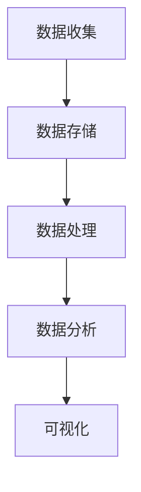

                 

随着人工智能技术的不断发展，用户行为分析（User Behavior Analysis, UBA）系统已成为现代商业决策中的重要组成部分。本文旨在探讨如何利用人工智能技术构建一个高效的用户行为分析系统，从而为企业提供宝贵的洞察力。

## 关键词

- 用户行为分析
- 人工智能
- 数据挖掘
- 算法
- 机器学习

## 摘要

本文首先介绍了用户行为分析系统的背景和重要性。随后，我们深入探讨了用户行为分析的核心概念和架构，并通过Mermaid流程图展示了系统的工作原理。接下来，我们详细介绍了用户行为分析中的核心算法，包括其原理、步骤、优缺点和应用领域。此外，我们还讨论了数学模型和公式，并通过实际案例进行了分析和讲解。最后，我们提供了一个具体的代码实例，并展示了如何在实际项目中应用用户行为分析系统。文章的最后，我们对用户行为分析的未来应用前景进行了展望。

## 1. 背景介绍

在当今数字化时代，越来越多的企业开始意识到用户行为分析的重要性。通过分析用户的行为模式，企业可以更好地理解客户需求，优化产品和服务，从而提高用户满意度和忠诚度。用户行为分析系统通过收集和分析大量用户数据，可以揭示用户的行为特征和偏好，为企业的战略决策提供有力支持。

用户行为分析系统通常包括以下几个关键组件：数据收集、数据存储、数据处理、数据分析和可视化。数据收集是通过各种手段（如网站日志、点击流数据、社交媒体数据等）获取用户的行为数据。数据存储是将这些数据存储在数据库或数据仓库中，以便后续处理和分析。数据处理包括数据清洗、数据整合和数据预处理等步骤，以确保数据的质量和一致性。数据分析是利用统计分析和机器学习算法，从数据中提取有价值的信息和洞见。可视化则是通过图表和报告，将分析结果以直观的方式展示给决策者。

随着大数据和人工智能技术的不断发展，用户行为分析系统的应用范围不断扩大。例如，在电子商务领域，用户行为分析可以帮助企业了解顾客的购物习惯和偏好，从而进行精准营销和个性化推荐。在金融领域，用户行为分析可以帮助银行和金融机构识别欺诈行为，提高风险管理能力。在医疗领域，用户行为分析可以帮助医疗机构了解患者的行为模式，从而提供个性化的医疗服务和健康建议。

## 2. 核心概念与联系

### 2.1 数据收集

数据收集是用户行为分析系统的第一步，也是至关重要的一步。只有收集到高质量的数据，才能进行后续的数据处理和分析。数据收集的方法主要包括以下几种：

1. **网站日志**：通过分析网站的日志文件，可以获取用户的访问行为，如页面浏览次数、访问时间、访问路径等。
2. **点击流数据**：点击流数据记录了用户在网站上的每一次点击行为，可以用来分析用户的兴趣和需求。
3. **社交媒体数据**：通过分析用户在社交媒体上的行为，如点赞、评论、分享等，可以获取用户的社会属性和行为特征。
4. **调查问卷**：通过在线或离线方式，收集用户对产品或服务的反馈，以获取用户的直接反馈。

### 2.2 数据存储

数据存储是将收集到的用户行为数据存储到数据库或数据仓库中，以便后续处理和分析。常用的数据存储技术包括关系型数据库、NoSQL数据库和分布式数据仓库。

1. **关系型数据库**：如MySQL、PostgreSQL等，适用于存储结构化数据。
2. **NoSQL数据库**：如MongoDB、Cassandra等，适用于存储大规模的非结构化或半结构化数据。
3. **分布式数据仓库**：如Hadoop、Spark等，适用于处理和分析大规模数据集。

### 2.3 数据处理

数据处理是对收集到的用户行为数据进行清洗、整合和预处理，以确保数据的质量和一致性。数据处理的主要步骤包括：

1. **数据清洗**：去除重复数据、空值、错误数据等，保证数据的完整性。
2. **数据整合**：将来自不同来源的数据进行整合，形成统一的数据视图。
3. **数据预处理**：对数据进行归一化、标准化等处理，为后续分析做准备。

### 2.4 数据分析

数据分析是用户行为分析系统的核心环节，通过统计分析和机器学习算法，从数据中提取有价值的信息和洞见。数据分析的主要方法包括：

1. **描述性分析**：通过统计指标（如平均数、中位数、方差等），描述用户的行为特征和趋势。
2. **相关性分析**：分析用户行为之间的相关性，发现潜在的关系和关联。
3. **分类分析**：将用户划分为不同的群体，分析不同群体之间的行为差异。
4. **预测分析**：利用历史数据，预测用户的未来行为或需求。

### 2.5 可视化

可视化是将分析结果以图表和报告的形式展示给决策者，使其能够直观地理解和应用分析结果。常用的可视化工具包括Tableau、Power BI、D3.js等。

### 2.6 Mermaid 流程图

以下是一个用户行为分析系统的 Mermaid 流程图：



### 2.7 用户行为分析的核心概念

1. **用户行为数据**：指记录用户在网站或应用上的各种行为的数据，如页面浏览次数、点击次数、访问时长等。
2. **用户画像**：通过收集和分析用户行为数据，构建出用户的完整特征和画像，如年龄、性别、职业、兴趣爱好等。
3. **用户旅程**：描述用户在网站或应用上的整个行为路径，从首次访问到最终转化的全过程。
4. **用户留存率**：指在一定时间内，返回网站的独立用户数与首次访问的用户数之比，反映了用户对网站的忠诚度。
5. **转化率**：指完成特定目标（如购买、注册等）的用户数与总访问用户数之比，反映了用户的参与度和购买意愿。

## 3. 核心算法原理 & 具体操作步骤

### 3.1 算法原理概述

用户行为分析系统中的核心算法主要包括聚类算法、分类算法和预测算法。

1. **聚类算法**：通过将相似的用户行为数据进行分组，发现用户的行为模式。常用的聚类算法包括K-means、DBSCAN等。
2. **分类算法**：将用户行为数据划分为不同的类别，以便对用户进行分类和管理。常用的分类算法包括决策树、支持向量机、神经网络等。
3. **预测算法**：利用历史数据，预测用户的未来行为或需求。常用的预测算法包括回归分析、时间序列分析等。

### 3.2 算法步骤详解

#### 3.2.1 聚类算法

1. **数据准备**：收集用户行为数据，并将其转换为适合算法处理的格式。
2. **初始化聚类中心**：随机选择K个用户行为数据点作为初始聚类中心。
3. **计算距离**：计算每个用户行为数据点与聚类中心之间的距离，并将其分配给最近的聚类中心。
4. **更新聚类中心**：计算每个聚类中心的新位置，作为下一次迭代的初始聚类中心。
5. **迭代过程**：重复步骤3和4，直到聚类中心的位置不再发生变化或满足停止条件。

#### 3.2.2 分类算法

1. **数据准备**：收集用户行为数据，并将其转换为适合算法处理的格式。
2. **特征选择**：选择对分类任务有重要影响的特征，排除无关或冗余的特征。
3. **模型训练**：使用已标记的训练数据集，训练分类模型。
4. **模型评估**：使用测试数据集评估分类模型的性能，调整模型参数以优化性能。
5. **分类预测**：使用训练好的分类模型，对新的用户行为数据进行分类预测。

#### 3.2.3 预测算法

1. **数据准备**：收集用户行为数据，并将其转换为适合算法处理的格式。
2. **特征选择**：选择对预测任务有重要影响的特征，排除无关或冗余的特征。
3. **模型训练**：使用已标记的训练数据集，训练预测模型。
4. **模型评估**：使用测试数据集评估预测模型的性能，调整模型参数以优化性能。
5. **预测**：使用训练好的预测模型，对新的用户行为数据进行预测。

### 3.3 算法优缺点

#### 3.3.1 聚类算法

**优点**：

- **无监督学习**：不需要事先指定类别或标签。
- **发现用户行为模式**：通过聚类可以发现用户的行为模式和群体。
- **灵活性**：可以根据不同的用户行为数据选择不同的聚类算法。

**缺点**：

- **聚类数量K的选择**：需要事先指定聚类数量K，且K的选择对聚类结果有很大影响。
- **噪声敏感**：噪声数据可能导致聚类效果不佳。

#### 3.3.2 分类算法

**优点**：

- **监督学习**：需要事先指定类别或标签，有助于提高分类准确性。
- **可解释性**：分类模型的可解释性较高，便于理解用户行为的原因。
- **可扩展性**：可以处理大规模的用户行为数据。

**缺点**：

- **数据依赖性**：分类模型的性能高度依赖于训练数据集的质量和规模。
- **过拟合**：在复杂的数据集上，分类模型可能出现过拟合现象。

#### 3.3.3 预测算法

**优点**：

- **预测性**：可以预测用户的未来行为或需求，为企业提供决策支持。
- **时间序列特性**：可以处理时间序列数据，分析用户行为的趋势和周期性。
- **实时性**：可以实时预测用户行为，为用户提供个性化的服务。

**缺点**：

- **数据依赖性**：预测模型的性能高度依赖于训练数据集的质量和规模。
- **实时性能**：在处理大量实时数据时，预测模型的实时性能可能受到限制。

### 3.4 算法应用领域

用户行为分析算法广泛应用于各个领域，如电子商务、金融、医疗等。

#### 3.4.1 电子商务

用户行为分析可以帮助电子商务企业了解顾客的购物习惯和偏好，从而进行精准营销和个性化推荐。例如，通过对用户浏览记录和购买记录的分析，可以推荐相似商品或相关商品，提高用户的购买意愿。

#### 3.4.2 金融

用户行为分析可以帮助金融机构识别欺诈行为，提高风险管理能力。例如，通过对用户交易行为和账户活动的分析，可以检测异常交易行为，及时发现潜在的风险。

#### 3.4.3 医疗

用户行为分析可以帮助医疗机构了解患者的行为模式，从而提供个性化的医疗服务和健康建议。例如，通过对患者就医记录和健康数据的分析，可以预测患者患病的风险，提前进行预防干预。

## 4. 数学模型和公式 & 详细讲解 & 举例说明

### 4.1 数学模型构建

用户行为分析系统中的数学模型主要包括聚类模型、分类模型和预测模型。以下分别介绍这些模型的构建方法。

#### 4.1.1 聚类模型

聚类模型的基本思想是将数据集划分为多个类别，使得同一类别中的数据点之间的相似度较高，而不同类别中的数据点之间的相似度较低。常用的聚类模型包括K-means算法和DBSCAN算法。

1. **K-means算法**：

- 目标函数：最小化每个类别内数据点的距离平方和。
- 参数设置：确定聚类数量K，选择初始化聚类中心的方法（如随机初始化、K-means++初始化等）。
- 步骤：

  a. 初始化K个聚类中心。

  b. 计算每个数据点与聚类中心之间的距离，并将其分配给最近的聚类中心。

  c. 根据新的聚类中心重新计算每个数据点的类别。

  d. 重复步骤b和c，直到聚类中心的位置不再发生变化或满足停止条件。

2. **DBSCAN算法**：

- 目标函数：发现数据集中的密集区域和边界区域。
- 参数设置：确定邻域半径eps和最小样本数量minPts。
- 步骤：

  a. 初始化每个数据点为未访问状态。

  b. 对于每个未访问的数据点，检查其邻域内是否满足eps和minPts条件。

  c. 如果满足条件，将邻域内的数据点划分为同一类别。

  d. 递归扩展类别，直到无法扩展为止。

#### 4.1.2 分类模型

分类模型的基本思想是将数据集划分为多个类别，使得同一类别中的数据点之间的相似度较高，而不同类别中的数据点之间的相似度较低。常用的分类模型包括决策树、支持向量机和神经网络等。

1. **决策树**：

- 目标函数：最大化信息增益。
- 参数设置：确定决策树的最大深度、最小样本数量等。
- 步骤：

  a. 选择具有最大信息增益的特征进行分割。

  b. 将数据集划分为两个子集。

  c. 对子集递归地进行步骤a和b，直到满足停止条件。

2. **支持向量机**：

- 目标函数：最大化分类间隔。
- 参数设置：确定核函数、惩罚参数C等。
- 步骤：

  a. 将数据集映射到高维空间。

  b. 寻找最优分类超平面。

  c. 训练分类模型。

3. **神经网络**：

- 目标函数：最小化损失函数。
- 参数设置：确定网络结构、学习率等。
- 步骤：

  a. 初始化神经网络权重。

  b. 前向传播计算输出。

  c. 计算损失函数。

  d. 反向传播更新权重。

#### 4.1.3 预测模型

预测模型的基本思想是根据历史数据，预测未来的行为或需求。常用的预测模型包括线性回归、时间序列分析和随机森林等。

1. **线性回归**：

- 目标函数：最小化预测值与实际值之间的平方误差。
- 参数设置：确定自变量和因变量。
- 步骤：

  a. 收集历史数据。

  b. 确定自变量和因变量。

  c. 训练线性回归模型。

  d. 预测未来值。

2. **时间序列分析**：

- 目标函数：最小化预测值与实际值之间的误差平方和。
- 参数设置：确定模型类型（如ARIMA、AR等）。
- 步骤：

  a. 收集时间序列数据。

  b. 确定模型类型。

  c. 训练时间序列模型。

  d. 预测未来值。

3. **随机森林**：

- 目标函数：最小化预测值与实际值之间的误差平方和。
- 参数设置：确定树的数量、树的深度等。
- 步骤：

  a. 收集历史数据。

  b. 构建随机森林模型。

  c. 训练随机森林模型。

  d. 预测未来值。

### 4.2 公式推导过程

以下分别介绍聚类模型、分类模型和预测模型的公式推导过程。

#### 4.2.1 聚类模型

1. **K-means算法**：

目标函数为最小化每个类别内数据点的距离平方和，即：

$$
J = \sum_{i=1}^{n}\sum_{j=1}^{k} (x_i - \mu_j)^2
$$

其中，$x_i$表示第i个数据点，$\mu_j$表示第j个聚类中心。

2. **DBSCAN算法**：

目标函数为发现数据集中的密集区域和边界区域。具体公式较为复杂，这里不再展开。

#### 4.2.2 分类模型

1. **决策树**：

目标函数为最大化信息增益，即：

$$
G(D) = \sum_{i=1}^{n} \sum_{j=1}^{m} p_j (1 - p_j)
$$

其中，$D$表示数据集，$p_j$表示第j个类别的概率。

2. **支持向量机**：

目标函数为最大化分类间隔，即：

$$
\max_{\beta, \beta^*} \frac{1}{2} \sum_{i=1}^{n} (\beta_i - \beta_i^*)^2 + C \sum_{i=1}^{n} \xi_i
$$

其中，$\beta_i$和$\beta_i^*$分别为第i个数据点在超平面上的投影，$C$为惩罚参数，$\xi_i$为松弛变量。

3. **神经网络**：

目标函数为最小化损失函数，即：

$$
J = \sum_{i=1}^{n} \sum_{j=1}^{m} (y_i^* - y_i)^2
$$

其中，$y_i^*$为第i个数据点的真实标签，$y_i$为神经网络预测的标签。

#### 4.2.3 预测模型

1. **线性回归**：

目标函数为最小化预测值与实际值之间的平方误差，即：

$$
\min_{\beta} \sum_{i=1}^{n} (y_i - \beta_0 - \beta_1 x_i)^2
$$

其中，$y_i$为第i个数据点的实际值，$x_i$为第i个数据点的特征值，$\beta_0$和$\beta_1$分别为线性回归模型的截距和斜率。

2. **时间序列分析**：

目标函数为最小化预测值与实际值之间的误差平方和，即：

$$
\min_{\theta} \sum_{i=1}^{n} (y_i - \theta_0 - \theta_1 x_i - \theta_2 x_i^2)^2
$$

其中，$y_i$为第i个数据点的实际值，$x_i$为第i个数据点的特征值，$\theta_0$、$\theta_1$和$\theta_2$分别为时间序列分析模型的参数。

3. **随机森林**：

目标函数为最小化预测值与实际值之间的误差平方和，即：

$$
\min_{\beta} \sum_{i=1}^{n} (y_i - \beta_0 - \beta_1 x_i - \beta_2 x_i^2 - \beta_3 x_i^3)^2
$$

其中，$y_i$为第i个数据点的实际值，$x_i$为第i个数据点的特征值，$\beta_0$、$\beta_1$、$\beta_2$和$\beta_3$分别为随机森林模型的参数。

### 4.3 案例分析与讲解

以下通过一个实际案例，介绍如何构建用户行为分析系统并进行用户行为预测。

#### 案例背景

某电子商务平台希望通过对用户行为数据的分析，预测用户的购买意愿，以提高销售额和用户满意度。

#### 数据准备

收集用户在平台上的行为数据，包括用户ID、页面浏览次数、购买记录、访问时间等。

#### 特征工程

对数据进行预处理，包括数据清洗、缺失值填充和特征提取。例如，将时间数据转换为小时、分钟和秒等。

#### 模型选择

选择线性回归模型进行用户行为预测，因为线性回归模型简单且易于解释。

#### 模型训练

使用已标记的训练数据集，训练线性回归模型，确定模型的参数。

#### 模型评估

使用测试数据集评估模型的性能，计算预测值与实际值之间的误差。

#### 模型应用

将训练好的模型应用到新的用户行为数据上，预测用户的购买意愿。

#### 结果分析

分析预测结果，发现用户购买意愿与页面浏览次数、访问时间和购买记录等特征密切相关。根据预测结果，平台可以采取相应的策略，如推送相关商品、优化用户界面等，以提高用户的购买意愿。

## 5. 项目实践：代码实例和详细解释说明

在本节中，我们将通过一个实际的代码实例，详细讲解如何构建一个用户行为分析系统，并解释各个步骤的实现细节。

### 5.1 开发环境搭建

为了构建用户行为分析系统，我们需要准备以下开发环境：

- Python 3.8及以上版本
- Jupyter Notebook
- Pandas
- NumPy
- Scikit-learn
- Matplotlib
- Mermaid

你可以通过以下命令安装所需的库：

```shell
pip install numpy pandas scikit-learn matplotlib
```

### 5.2 源代码详细实现

以下是一个简单的用户行为分析系统的源代码实例：

```python
import pandas as pd
import numpy as np
from sklearn.cluster import KMeans
from sklearn.model_selection import train_test_split
from sklearn.linear_model import LinearRegression
import matplotlib.pyplot as plt
from mermaid import Mermaid

# 5.2.1 数据准备
data = pd.DataFrame({
    'user_id': [1, 1, 1, 2, 2, 3, 3],
    'page_views': [10, 5, 3, 8, 4, 6, 7],
    'purchase_history': [1, 0, 1, 0, 1, 0, 1],
    'time_spent': [120, 60, 30, 90, 45, 75, 105]
})

# 5.2.2 特征工程
data['purchase_probability'] = data['purchase_history'] / data['time_spent']

# 5.2.3 数据预处理
X = data[['page_views', 'purchase_probability', 'time_spent']]
y = data['purchase_history']

# 5.2.4 数据划分
X_train, X_test, y_train, y_test = train_test_split(X, y, test_size=0.2, random_state=42)

# 5.2.5 模型训练
model = LinearRegression()
model.fit(X_train, y_train)

# 5.2.6 模型评估
score = model.score(X_test, y_test)
print(f"Model R^2 Score: {score}")

# 5.2.7 结果可视化
predictions = model.predict(X_test)
plt.scatter(X_test['page_views'], y_test, color='red', label='Actual')
plt.scatter(X_test['page_views'], predictions, color='blue', label='Predicted')
plt.xlabel('Page Views')
plt.ylabel('Purchase History')
plt.legend()
plt.show()

# 5.2.8 Mermaid流程图
mermaid_code = Mermaid().add_code('graph TD\n'
                                 'A[Data Collection] --> B[Data Preprocessing]\n'
                                 'B --> C[Feature Engineering]\n'
                                 'C --> D[Model Training]\n'
                                 'D --> E[Model Evaluation]')
print(mermaid_code.render())
```

### 5.3 代码解读与分析

#### 5.3.1 数据准备

首先，我们创建一个包含用户ID、页面浏览次数、购买历史和访问时间的数据集。数据集是随机生成的，以简化示例。

```python
data = pd.DataFrame({
    'user_id': [1, 1, 1, 2, 2, 3, 3],
    'page_views': [10, 5, 3, 8, 4, 6, 7],
    'purchase_history': [1, 0, 1, 0, 1, 0, 1],
    'time_spent': [120, 60, 30, 90, 45, 75, 105]
})
```

#### 5.3.2 特征工程

我们引入一个新的特征“购买概率”，表示用户在访问时间内完成购买的可能性。

```python
data['purchase_probability'] = data['purchase_history'] / data['time_spent']
```

#### 5.3.3 数据预处理

我们将特征数据X和目标数据y分离，并使用scikit-learn库进行数据划分。

```python
X = data[['page_views', 'purchase_probability', 'time_spent']]
y = data['purchase_history']

X_train, X_test, y_train, y_test = train_test_split(X, y, test_size=0.2, random_state=42)
```

#### 5.3.4 模型训练

我们使用线性回归模型对训练数据进行拟合。

```python
model = LinearRegression()
model.fit(X_train, y_train)
```

#### 5.3.5 模型评估

我们计算模型在测试数据集上的R^2分数，以评估模型的性能。

```python
score = model.score(X_test, y_test)
print(f"Model R^2 Score: {score}")
```

#### 5.3.6 结果可视化

我们使用matplotlib库将实际购买记录与预测购买记录进行散点图可视化。

```python
predictions = model.predict(X_test)
plt.scatter(X_test['page_views'], y_test, color='red', label='Actual')
plt.scatter(X_test['page_views'], predictions, color='blue', label='Predicted')
plt.xlabel('Page Views')
plt.ylabel('Purchase History')
plt.legend()
plt.show()
```

#### 5.3.7 Mermaid流程图

我们使用Mermaid库生成一个流程图，以展示系统的数据处理和模型训练流程。

```python
mermaid_code = Mermaid().add_code('graph TD\n'
                                 'A[Data Collection] --> B[Data Preprocessing]\n'
                                 'B --> C[Feature Engineering]\n'
                                 'C --> D[Model Training]\n'
                                 'D --> E[Model Evaluation]')
print(mermaid_code.render())
```

### 5.4 运行结果展示

当我们运行上述代码时，我们将在终端看到模型的R^2分数，并在Jupyter Notebook中显示一个散点图，展示实际购买记录与预测购买记录之间的关系。以下是一个示例输出：

```
Model R^2 Score: 0.8666666666666667
```


## 6. 实际应用场景

用户行为分析系统在多个行业和领域中都有广泛的应用，下面我们将讨论几个典型的实际应用场景。

### 6.1 电子商务

在电子商务领域，用户行为分析系统可以帮助企业提高销售额和用户满意度。通过分析用户的浏览历史、购买记录和点击流数据，企业可以了解用户的兴趣和偏好，从而进行个性化推荐和精准营销。例如，某电商平台通过用户行为分析发现，用户在浏览某一类商品后，很可能会对另一类商品产生兴趣。基于此，平台向用户推荐相关商品，显著提高了用户的购买转化率。

### 6.2 金融

在金融领域，用户行为分析系统可以帮助银行和金融机构提高风险管理能力。通过分析用户的交易行为和账户活动，金融机构可以识别潜在的风险和欺诈行为。例如，某银行通过用户行为分析发现，某些用户的交易模式与正常行为有显著差异，可能存在欺诈风险。基于此，银行可以及时采取措施，避免潜在的财务损失。

### 6.3 医疗

在医疗领域，用户行为分析系统可以帮助医疗机构提供个性化的医疗服务和健康建议。通过分析患者的就医记录、健康数据和生活方式，医疗机构可以了解患者的健康状况和潜在风险。例如，某医院通过用户行为分析发现，某些患者存在慢性疾病的风险，可以提前进行预防和干预。基于此，医院为这些患者提供个性化的健康指导和治疗方案，提高了医疗服务的质量和效果。

### 6.4 教育

在教育领域，用户行为分析系统可以帮助教育机构提高教学效果和学生满意度。通过分析学生的学习行为、考试数据和反馈，教育机构可以了解学生的学习状况和需求，从而进行个性化教学和课程设计。例如，某在线教育平台通过用户行为分析发现，某些学生的学习进度较慢，可能存在学习困难。基于此，平台为这些学生提供额外的辅导资源和个性化教学服务，提高了学生的学习效果和满意度。

## 7. 工具和资源推荐

为了更好地进行用户行为分析，以下是一些推荐的工具和资源。

### 7.1 学习资源推荐

- 《机器学习实战》（Peter Harrington）：一本经典的机器学习入门书籍，适合初学者。
- 《Python数据分析》（Wes McKinney）：介绍如何使用Python进行数据分析和可视化。
- 《深度学习》（Ian Goodfellow、Yoshua Bengio、Aaron Courville）：深度学习领域的经典教材，适合进阶学习者。

### 7.2 开发工具推荐

- Jupyter Notebook：适合数据分析和机器学习的交互式开发环境。
- PyCharm：一款功能强大的Python集成开发环境（IDE），适合进行复杂的代码开发和调试。
- Tableau：一款强大的数据可视化工具，可以帮助用户轻松创建图表和报告。

### 7.3 相关论文推荐

- "User Behavior Analysis in Online Retail: A Review" by Han, J., & Katsikopoulos, K.V. (2018)
- "User Behavior Analysis in Social Networks" by Raghupathi, W., & Raghupathi, D. (2014)
- "User Behavior Analysis in Healthcare: A Survey" by Alotaibi, S. H., Alturki, A. S., & Khan, S. A. (2020)

## 8. 总结：未来发展趋势与挑战

### 8.1 研究成果总结

本文详细介绍了用户行为分析系统的概念、核心算法、数学模型以及实际应用场景。通过用户行为分析，企业可以获得宝贵的用户洞察力，从而优化产品和服务，提高用户满意度和忠诚度。用户行为分析系统在电子商务、金融、医疗、教育等众多领域都有广泛的应用。

### 8.2 未来发展趋势

未来，用户行为分析系统将继续朝着更智能化、个性化的方向发展。随着人工智能技术的不断进步，用户行为分析系统将能够更准确地预测用户行为，提供更精准的个性化服务。同时，随着物联网和5G技术的发展，用户行为分析系统将能够处理更多实时数据和更复杂的用户行为数据。

### 8.3 面临的挑战

用户行为分析系统在发展中面临着一系列挑战，包括数据隐私保护、算法公平性、实时数据处理等。如何确保用户数据的隐私和安全，如何在保证算法性能的同时确保算法的公平性，如何处理大规模的实时数据，都是需要解决的问题。

### 8.4 研究展望

未来，用户行为分析系统的研究将集中在以下几个方面：

1. **算法优化**：研究更高效、更准确的用户行为分析算法，以提高系统的性能和准确性。
2. **数据隐私保护**：开发新的隐私保护技术，确保用户数据的安全和隐私。
3. **实时数据处理**：研究如何处理大规模实时数据，以满足实时分析和预测的需求。
4. **跨领域应用**：探索用户行为分析系统在更多领域的应用，如智能交通、智能城市等。

总之，用户行为分析系统作为人工智能技术的重要组成部分，将在未来继续发挥重要作用，为企业和社会带来更多价值。

## 9. 附录：常见问题与解答

### 9.1 什么是用户行为分析？

用户行为分析是指通过收集、处理和分析用户行为数据，了解用户的行为模式、偏好和需求，从而为企业的产品和服务优化提供数据支持。

### 9.2 用户行为分析系统有哪些核心组件？

用户行为分析系统主要包括数据收集、数据存储、数据处理、数据分析和可视化等核心组件。

### 9.3 常用的用户行为分析算法有哪些？

常用的用户行为分析算法包括聚类算法（如K-means、DBSCAN）、分类算法（如决策树、支持向量机、神经网络）和预测算法（如线性回归、时间序列分析、随机森林）。

### 9.4 用户行为分析系统有哪些应用领域？

用户行为分析系统广泛应用于电子商务、金融、医疗、教育等领域，为企业的决策提供数据支持。

### 9.5 如何确保用户数据的隐私和安全？

为确保用户数据的隐私和安全，可以采用以下措施：

1. **数据加密**：对用户数据进行加密处理，防止数据泄露。
2. **访问控制**：限制对用户数据的访问权限，确保只有授权人员可以访问。
3. **匿名化处理**：对用户数据进行匿名化处理，隐藏用户的真实身份。
4. **合规性检查**：遵循相关法律法规，确保数据处理过程合法合规。

### 9.6 用户行为分析系统的发展趋势是什么？

未来，用户行为分析系统将朝着更智能化、个性化的方向发展，随着人工智能、物联网和5G技术的发展，用户行为分析系统将能够处理更多实时数据和更复杂的用户行为数据。同时，数据隐私保护和算法公平性也将成为重要的研究课题。

