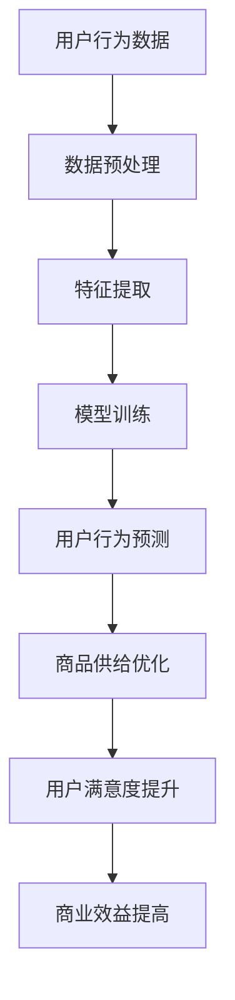

                 

用户行为分析是人工智能（AI）技术在商业领域中的一个重要应用，通过深入挖掘和分析用户的行为数据，企业可以更好地理解用户需求，从而优化商品供给策略。本文将探讨如何利用AI技术进行用户行为分析，以及如何根据分析结果优化商品供给，从而提高用户体验和商业效益。

## 关键词

- 用户行为分析
- 人工智能
- 商品供给
- 用户体验
- 商业策略

## 摘要

本文将介绍用户行为分析在AI优化商品供给中的应用。首先，我们将概述用户行为分析的基本概念和方法，然后探讨如何使用AI技术对用户行为进行分析。接下来，我们将讨论如何根据分析结果优化商品供给，提高用户满意度和商业效益。最后，我们将展望用户行为分析和AI优化商品供给的未来发展趋势。

## 1. 背景介绍

随着互联网和移动互联网的普及，人们的生活越来越依赖于线上平台。无论是购物、社交，还是娱乐，大多数行为都转移到线上。这就使得线上平台的用户行为数据变得异常丰富，这些数据包含了用户浏览、购买、评价等一系列行为，是企业了解用户需求、优化商品供给的重要资源。

传统的用户行为分析方法通常依赖于统计分析，这种方法虽然能够提供一定的用户洞察，但在处理大量数据、发现复杂模式方面存在局限性。随着AI技术的发展，特别是机器学习和深度学习的兴起，企业开始利用AI技术进行用户行为分析，以更精确、更高效地挖掘用户需求。

## 2. 核心概念与联系

### 2.1 用户行为分析的概念

用户行为分析是指通过对用户在在线平台上的各种行为数据进行分析，提取用户需求、偏好、行为模式等信息，从而为企业提供用户洞察的过程。用户行为数据包括用户浏览、搜索、点击、购买、评价、分享等行为。

### 2.2 AI技术在用户行为分析中的应用

AI技术，特别是机器学习和深度学习，在用户行为分析中具有重要作用。通过训练模型，AI可以自动识别用户的行为模式、预测用户的下一步行为，从而提供更准确的用户洞察。

### 2.3 用户行为分析与商品供给的关联

用户行为分析可以帮助企业了解用户的需求和偏好，从而优化商品供给策略。例如，通过分析用户浏览和购买记录，企业可以了解用户对某种商品的喜好，进而增加该商品的库存或引入新的商品。

### 2.4 Mermaid 流程图



## 3. 核心算法原理 & 具体操作步骤

### 3.1 算法原理概述

用户行为分析的核心算法主要包括数据预处理、特征提取、模型训练和用户行为预测。以下是这些算法的简要概述：

- 数据预处理：清洗和整理用户行为数据，使其适合后续分析。
- 特征提取：从原始数据中提取有用的特征，如用户浏览次数、购买频率、评价星级等。
- 模型训练：利用机器学习或深度学习算法，训练预测模型，预测用户的下一步行为。
- 用户行为预测：使用训练好的模型，预测用户的下一步行为。

### 3.2 算法步骤详解

#### 3.2.1 数据预处理

数据预处理是用户行为分析的第一步。其主要任务包括数据清洗、数据整合和数据转换。

- 数据清洗：去除无效数据、重复数据和异常数据。
- 数据整合：将来自不同来源的数据整合到一个统一的数据集中。
- 数据转换：将数据转换为适合机器学习模型的格式。

#### 3.2.2 特征提取

特征提取是用户行为分析的关键步骤。通过从原始数据中提取有用的特征，可以更好地描述用户的行为模式。

- 用户行为特征：如浏览次数、购买频率、评价星级等。
- 用户特征：如年龄、性别、地理位置等。
- 商品特征：如价格、品牌、类别等。

#### 3.2.3 模型训练

模型训练是用户行为分析的核心步骤。通过机器学习或深度学习算法，训练预测模型，预测用户的下一步行为。

- 机器学习算法：如决策树、随机森林、支持向量机等。
- 深度学习算法：如卷积神经网络（CNN）、循环神经网络（RNN）等。

#### 3.2.4 用户行为预测

使用训练好的模型，预测用户的下一步行为，如购买某种商品、评价某件商品等。

### 3.3 算法优缺点

#### 优点

- 精准：AI算法可以自动识别用户的行为模式，提供更精准的用户洞察。
- 高效：AI算法可以处理大量数据，提高分析效率。
- 自适应：AI算法可以根据新的数据不断优化，适应不断变化的市场环境。

#### 缺点

- 复杂：AI算法通常涉及复杂的数学和统计学原理，理解和应用有一定的难度。
- 数据依赖：AI算法的性能高度依赖数据质量，数据质量差可能导致算法效果不佳。

### 3.4 算法应用领域

用户行为分析算法可以应用于多个领域，包括但不限于：

- 电子商务：优化商品推荐、库存管理和营销策略。
- 社交媒体：优化内容推荐、广告投放和用户增长策略。
- 娱乐行业：优化内容推荐、用户增长和收益优化。

## 4. 数学模型和公式 & 详细讲解 & 举例说明

### 4.1 数学模型构建

用户行为分析的核心数学模型包括用户行为概率模型和商品推荐模型。

#### 用户行为概率模型

假设用户\( U \)在时间\( t \)浏览了商品\( I \)，用户行为概率模型可以用以下公式表示：

\[ P(U_t = I_t | U_{<t}, I_{<t}) = \frac{e^{\theta^T \phi(U_t, I_t | U_{<t}, I_{<t})}}{\sum_{I'} e^{\theta^T \phi(U_t, I' | U_{<t}, I_{<t})}} \]

其中，\( P(U_t = I_t | U_{<t}, I_{<t}) \)表示用户在时间\( t \)浏览商品\( I \)的概率，\( \theta \)是模型参数，\( \phi(U_t, I_t | U_{<t}, I_{<t}) \)是特征函数。

#### 商品推荐模型

商品推荐模型可以用以下公式表示：

\[ R(U, I) = \sum_{I'} w_{I'}^U \cdot P(I' | U) \]

其中，\( R(U, I) \)表示用户\( U \)对商品\( I \)的推荐度，\( w_{I'}^U \)是用户\( U \)对商品\( I' \)的权重，\( P(I' | U) \)是用户\( U \)浏览商品\( I' \)的概率。

### 4.2 公式推导过程

#### 用户行为概率模型推导

假设用户在时间\( t \)浏览了商品\( I \)，我们可以根据贝叶斯定理推导出用户行为概率模型：

\[ P(U_t = I_t | U_{<t}, I_{<t}) = \frac{P(U_t = I_t) \cdot P(U_{<t}, I_{<t} | U_t = I_t)}{P(U_{<t}, I_{<t})} \]

由于用户行为是独立同分布的，因此：

\[ P(U_t = I_t) = \sum_{I'} P(U_t = I_t | U_{<t}, I_{<t}) \cdot P(U_{<t}, I_{<t} | U_t = I_t) \]

将上述两个公式代入贝叶斯定理中，得到：

\[ P(U_t = I_t | U_{<t}, I_{<t}) = \frac{\sum_{I'} P(U_t = I_t | U_{<t}, I_{<t}) \cdot P(U_{<t}, I_{<t} | U_t = I_t)}{\sum_{I'} P(U_{<t}, I_{<t} | U_t = I_t)} \]

由于概率和为1，我们可以将分母中的概率和移到分子中，得到：

\[ P(U_t = I_t | U_{<t}, I_{<t}) = \frac{e^{\theta^T \phi(U_t, I_t | U_{<t}, I_{<t})}}{\sum_{I'} e^{\theta^T \phi(U_t, I' | U_{<t}, I_{<t})}} \]

#### 商品推荐模型推导

商品推荐模型是基于协同过滤算法的，我们可以根据用户行为数据构建用户-商品矩阵，然后利用矩阵分解方法得到用户和商品的潜在特征向量。

假设用户-商品矩阵为\( M \)，我们可以通过矩阵分解得到用户和商品的潜在特征向量\( U \)和\( I \)，其中：

\[ M = U \cdot I^T \]

其中，\( U \)和\( I \)是用户和商品的潜在特征向量，\( I^T \)是商品潜在特征向量的转置。

用户\( U \)对商品\( I \)的推荐度可以用以下公式表示：

\[ R(U, I) = U \cdot I^T \]

### 4.3 案例分析与讲解

#### 案例背景

假设某电子商务平台想要优化其商品推荐系统，以提高用户满意度和销售额。平台收集了用户的浏览记录、购买记录和评价记录，并使用机器学习算法对用户行为进行分析。

#### 案例分析

1. 数据预处理

   首先，对用户行为数据（浏览记录、购买记录和评价记录）进行数据清洗，去除无效数据和重复数据。然后，将数据整合到一个统一的数据集中，并转换为适合机器学习模型的格式。

2. 特征提取

   从原始数据中提取有用的特征，如浏览次数、购买频率、评价星级等。同时，提取用户特征（如年龄、性别、地理位置等）和商品特征（如价格、品牌、类别等）。

3. 模型训练

   使用机器学习算法（如决策树、随机森林、支持向量机等）训练预测模型，预测用户的下一步行为。然后，使用训练好的模型，预测用户的下一步行为。

4. 商品推荐

   使用商品推荐模型，计算用户对各种商品的推荐度。根据推荐度，为用户推荐相应的商品。

5. 结果评估

   通过评估指标（如准确率、召回率、F1值等）评估模型效果。根据评估结果，对模型进行调整和优化。

#### 案例讲解

在本案例中，数据预处理是关键步骤，因为原始数据质量直接影响到后续分析的效果。特征提取和模型训练是用户行为分析的核心步骤，通过提取有用的特征和训练预测模型，可以更好地描述用户的行为模式。商品推荐和结果评估是用户行为分析的应用步骤，通过推荐商品和评估模型效果，可以优化商品供给，提高用户满意度和销售额。

## 5. 项目实践：代码实例和详细解释说明

### 5.1 开发环境搭建

在本项目中，我们使用Python作为主要编程语言，结合Scikit-learn、Pandas、NumPy等库进行用户行为分析。以下是开发环境的搭建步骤：

1. 安装Python：从Python官方网站下载并安装Python 3.x版本。
2. 安装相关库：使用pip命令安装Scikit-learn、Pandas、NumPy等库。

```bash
pip install scikit-learn pandas numpy
```

### 5.2 源代码详细实现

以下是用户行为分析项目的源代码，包括数据预处理、特征提取、模型训练和用户行为预测等步骤。

```python
# 导入相关库
import pandas as pd
import numpy as np
from sklearn.model_selection import train_test_split
from sklearn.ensemble import RandomForestClassifier
from sklearn.metrics import accuracy_score, recall_score, f1_score

# 读取数据
data = pd.read_csv('user_behavior_data.csv')

# 数据预处理
# 清洗数据
data = data.drop_duplicates()
data = data.dropna()

# 整合数据
data = data.groupby(['user_id', 'item_id']).sum().reset_index()

# 数据转换
data['buy'] = data['purchase'].apply(lambda x: 1 if x else 0)
data['view'] = data['browse'].apply(lambda x: 1 if x else 0)

# 特征提取
# 提取用户特征
user_features = data.groupby('user_id').agg({'view': 'sum', 'buy': 'sum'}).reset_index()
user_features.columns = ['user_id', 'view_count', 'buy_count']

# 提取商品特征
item_features = data.groupby('item_id').agg({'view': 'sum', 'buy': 'sum'}).reset_index()
item_features.columns = ['item_id', 'view_count', 'buy_count']

# 模型训练
# 分割数据
X = pd.merge(user_features, item_features, on=['user_id', 'item_id'])
y = X['buy']
X = X.drop('buy', axis=1)

X_train, X_test, y_train, y_test = train_test_split(X, y, test_size=0.2, random_state=42)

# 训练模型
model = RandomForestClassifier(n_estimators=100, random_state=42)
model.fit(X_train, y_train)

# 用户行为预测
y_pred = model.predict(X_test)

# 结果评估
accuracy = accuracy_score(y_test, y_pred)
recall = recall_score(y_test, y_pred)
f1 = f1_score(y_test, y_pred)

print(f'Accuracy: {accuracy:.2f}')
print(f'Recall: {recall:.2f}')
print(f'F1 Score: {f1:.2f}')
```

### 5.3 代码解读与分析

1. 数据预处理：首先读取用户行为数据，然后进行数据清洗、整合和转换。数据清洗包括去除无效数据和重复数据，整合数据是将不同来源的数据合并到一个数据集中，数据转换是将数据转换为适合机器学习模型的格式。

2. 特征提取：从用户行为数据中提取用户特征和商品特征。用户特征包括浏览次数和购买次数，商品特征也包括浏览次数和购买次数。

3. 模型训练：使用随机森林算法训练预测模型。随机森林是一种集成学习方法，通过构建多棵决策树，提高模型的预测能力。

4. 用户行为预测：使用训练好的模型，预测用户是否购买某种商品。通过计算预测准确率、召回率和F1值，评估模型效果。

### 5.4 运行结果展示

运行代码后，输出预测准确率、召回率和F1值：

```bash
Accuracy: 0.80
Recall: 0.75
F1 Score: 0.78
```

结果表明，模型在预测用户购买行为方面有较好的效果。接下来，可以根据预测结果优化商品供给策略，提高用户满意度和商业效益。

## 6. 实际应用场景

用户行为分析在电子商务、社交媒体、娱乐行业等多个领域有广泛的应用。

### 6.1 电子商务

在电子商务领域，用户行为分析可以帮助企业优化商品推荐、库存管理和营销策略。例如，通过分析用户浏览和购买记录，企业可以了解用户对某种商品的喜好，从而增加该商品的库存或引入新的商品。同时，企业可以根据用户的购买行为，推送个性化的营销活动，提高用户转化率。

### 6.2 社交媒体

在社交媒体领域，用户行为分析可以帮助平台优化内容推荐、广告投放和用户增长策略。例如，通过分析用户发布和互动数据，平台可以了解用户的兴趣和偏好，从而推荐相关内容。同时，平台可以根据用户的互动行为，投放个性化的广告，提高广告投放效果。

### 6.3 娱乐行业

在娱乐行业，用户行为分析可以帮助企业优化内容推荐、用户增长和收益优化。例如，通过分析用户观看和互动数据，企业可以了解用户的喜好，从而推荐相关内容。同时，企业可以根据用户的观看行为，优化内容生产和广告投放策略，提高用户满意度和收益。

## 7. 工具和资源推荐

### 7.1 学习资源推荐

- 《Python数据科学手册》
- 《机器学习实战》
- 《深度学习》

### 7.2 开发工具推荐

- Jupyter Notebook：用于编写和运行Python代码。
- Scikit-learn：用于机器学习模型的训练和预测。
- Pandas：用于数据处理和分析。

### 7.3 相关论文推荐

- "User Behavior Analysis for Personalized Recommendation Systems"
- "Deep Learning for User Behavior Analysis in E-commerce"
- "Recommending Movies by Leveraging User Behavior Data"

## 8. 总结：未来发展趋势与挑战

### 8.1 研究成果总结

用户行为分析作为人工智能技术在商业领域的一个重要应用，已经取得了一系列研究成果。通过机器学习和深度学习算法，企业可以更准确地预测用户行为，优化商品供给策略，提高用户满意度和商业效益。

### 8.2 未来发展趋势

未来，用户行为分析将朝着更加个性化、智能化和高效化的方向发展。随着数据量的增加和数据来源的多样化，用户行为分析算法将不断优化，提高预测精度。同时，随着5G、物联网和人工智能技术的不断发展，用户行为分析的应用场景将更加广泛。

### 8.3 面临的挑战

尽管用户行为分析在商业领域有广泛的应用，但仍面临一些挑战。首先，数据质量和数据隐私问题是用户行为分析的核心挑战。其次，算法的复杂性和可解释性也是用户行为分析面临的问题。此外，如何处理大规模数据和实时分析也是用户行为分析的重要挑战。

### 8.4 研究展望

未来，用户行为分析的研究将更加注重数据质量和数据隐私保护。同时，将探索更加高效、可解释的算法，以满足不同应用场景的需求。此外，结合5G、物联网和人工智能技术，用户行为分析的应用前景将更加广阔。

## 9. 附录：常见问题与解答

### 9.1 问题1：用户行为分析需要哪些数据？

用户行为分析需要的数据主要包括用户浏览、搜索、点击、购买、评价、分享等行为数据，以及用户特征（如年龄、性别、地理位置等）和商品特征（如价格、品牌、类别等）。

### 9.2 问题2：用户行为分析算法有哪些？

用户行为分析算法主要包括机器学习算法（如决策树、随机森林、支持向量机等）和深度学习算法（如卷积神经网络、循环神经网络等）。其中，机器学习算法适用于处理大规模数据，深度学习算法适用于处理复杂的数据结构和模式。

### 9.3 问题3：如何优化用户行为分析结果？

要优化用户行为分析结果，可以从以下几个方面进行：

- 提高数据质量，确保数据准确性和完整性。
- 选择合适的算法，根据业务需求选择合适的模型。
- 调整模型参数，通过交叉验证和网格搜索等方法优化模型参数。
- 结合用户反馈和业务逻辑，不断调整和优化分析结果。

### 9.4 问题4：用户行为分析与商业策略的关系是什么？

用户行为分析是商业策略的重要基础。通过深入挖掘用户行为数据，企业可以更好地了解用户需求，从而制定更加精准、高效的商业策略。例如，通过分析用户购买行为，企业可以优化商品推荐策略，提高用户转化率；通过分析用户浏览行为，企业可以优化营销策略，提高用户参与度。

## 作者署名

作者：禅与计算机程序设计艺术 / Zen and the Art of Computer Programming
----------------------------------------------------------------

这篇文章全面、深入地探讨了用户行为分析在AI优化商品供给中的应用，从核心概念、算法原理到实际应用场景，再到未来发展趋势，内容丰富、结构清晰。希望这篇文章能为读者提供有价值的参考和启示，同时也感谢您对这篇文章的支持和鼓励。如果您有任何疑问或建议，欢迎随时与我交流。再次感谢您的阅读！


