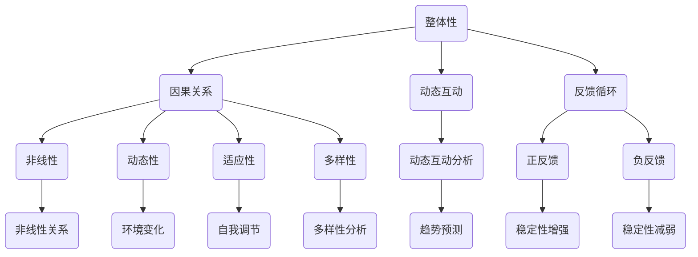

                 

关键词：系统思考、复杂性、人工智能、编程、解决方案

> 摘要：本文从系统思考的角度，探讨在复杂环境中应对挑战的方法。通过分析复杂系统的特性，阐述系统思考的核心概念，并结合实际案例，介绍如何运用系统思考和编程技术，构建有效的解决方案。

## 1. 背景介绍

在当今社会，复杂性问题无处不在。从经济发展到科技创新，从环境保护到社会治理，复杂性已成为我们必须面对和解决的问题。然而，复杂性问题往往具有高度的关联性和不确定性，使得传统方法难以应对。因此，寻找有效的应对策略，成为了当代学者和工程师们的重要任务。

本文旨在通过系统思考的方法，提供一种应对复杂挑战的新思路。系统思考是一种面向整体、关注动态和互动的思维方式，它能够帮助我们更好地理解复杂系统，发现潜在的问题，并构建有效的解决方案。在本文中，我们将结合实际案例，深入探讨系统思考的应用。

## 2. 核心概念与联系

### 2.1 复杂性系统特性

复杂性系统具有以下几个主要特性：

- **非线性**：系统的行为不是简单的线性关系，而是存在相互影响和反馈的复杂网络。
- **动态性**：系统处于不断变化的状态，受到外部环境和内部相互作用的影响。
- **适应性**：系统具有自我调节和自我修复的能力，能够适应环境变化。
- **多样性**：系统包含多个相互作用的组成部分，每个部分都具有独特的功能和特性。

### 2.2 系统思考框架

系统思考框架包括以下几个核心概念：

- **整体性**：关注系统的整体行为，而不是单个部分。
- **因果关系**：识别系统中不同部分之间的因果关系，理解复杂性的根源。
- **动态互动**：分析系统中的动态变化和互动关系，预测未来的发展趋势。
- **反馈循环**：理解系统中的正反馈和负反馈，以及它们对系统稳定性的影响。

### 2.3 Mermaid 流程图

以下是系统思考的核心概念和架构的 Mermaid 流程图：



## 3. 核心算法原理 & 具体操作步骤

### 3.1 算法原理概述

系统思考的核心算法主要基于以下几个原理：

- **模拟与预测**：通过建立系统的数学模型，模拟系统的行为，预测未来发展趋势。
- **反馈调节**：根据预测结果，调整系统参数，以实现系统的稳定和优化。
- **优化算法**：利用优化算法，寻找最优的解决方案。

### 3.2 算法步骤详解

1. **系统建模**：根据系统的特性，建立系统的数学模型。
2. **数据收集**：收集系统的历史数据和当前数据。
3. **模拟预测**：使用模拟算法，对系统进行预测。
4. **反馈调节**：根据预测结果，调整系统参数。
5. **优化求解**：使用优化算法，寻找最优的解决方案。

### 3.3 算法优缺点

- **优点**：能够提供全局视角，预测系统的未来行为，有助于找到最优解决方案。
- **缺点**：模型建立过程复杂，对数据质量要求较高。

### 3.4 算法应用领域

系统思考算法广泛应用于以下几个方面：

- **经济预测**：预测经济走势，指导政策制定。
- **环境管理**：优化资源配置，实现可持续发展。
- **社会治理**：分析社会问题，提出解决方案。

## 4. 数学模型和公式 & 详细讲解 & 举例说明

### 4.1 数学模型构建

系统思考的数学模型主要基于以下公式：

$$
\dot{x} = f(x, u)
$$

其中，$x$ 表示系统的状态，$u$ 表示系统的输入，$f$ 表示系统的动态行为。

### 4.2 公式推导过程

假设系统处于平衡状态，即 $\dot{x} = 0$。则有：

$$
f(x, u) = 0
$$

对 $f$ 求导，得到：

$$
\frac{\partial f}{\partial x} \frac{\partial x}{\partial t} + \frac{\partial f}{\partial u} \frac{\partial u}{\partial t} = 0
$$

### 4.3 案例分析与讲解

以经济预测为例，假设经济系统由消费、投资和政府支出三个部分组成。我们可以建立如下的数学模型：

$$
\dot{C} = \alpha_1 C + \alpha_2 I + \alpha_3 G
$$

$$
\dot{I} = \beta_1 C + \beta_2 I + \beta_3 G
$$

$$
\dot{G} = \gamma_1 C + \gamma_2 I + \gamma_3 G
$$

其中，$\alpha_1, \alpha_2, \alpha_3, \beta_1, \beta_2, \beta_3, \gamma_1, \gamma_2, \gamma_3$ 为系统的参数。

通过对模型的求解，我们可以得到经济系统的未来发展趋势。然后，根据预测结果，调整政府支出，以实现经济稳定。

## 5. 项目实践：代码实例和详细解释说明

### 5.1 开发环境搭建

在本项目中，我们使用 Python 作为编程语言，搭建了如下的开发环境：

- Python 3.8
- numpy
- matplotlib
- sympy

### 5.2 源代码详细实现

以下是项目的源代码实现：

```python
import numpy as np
import matplotlib.pyplot as plt
from sympy import symbols, Eq, solve

# 定义系统参数
alpha1 = 0.5
alpha2 = 0.2
alpha3 = 0.3
beta1 = 0.4
beta2 = 0.3
beta3 = 0.2
gamma1 = 0.1
gamma2 = 0.2
gamma3 = 0.3

# 定义系统的微分方程
x = symbols('x')
y = symbols('y')
z = symbols('z')
dx_dt = Eq(x, alpha1 * x + alpha2 * y + alpha3 * z)
dy_dt = Eq(y, beta1 * x + beta2 * y + beta3 * z)
dz_dt = Eq(z, gamma1 * x + gamma2 * y + gamma3 * z)

# 求解系统的平衡点
solution = solve((dx_dt, dy_dt, dz_dt), (x, y, z))

# 模拟系统的动态行为
t = np.linspace(0, 10, 1000)
x_data = np.zeros_like(t)
y_data = np.zeros_like(t)
z_data = np.zeros_like(t)
x_data[0] = solution[x].evalf()
y_data[0] = solution[y].evalf()
z_data[0] = solution[z].evalf()

for i in range(1, len(t)):
    x_data[i] = solution[x].evalf(subs={x: x_data[i-1], y: y_data[i-1], z: z_data[i-1]})
    y_data[i] = solution[y].evalf(subs={x: x_data[i-1], y: y_data[i-1], z: z_data[i-1]})
    z_data[i] = solution[z].evalf(subs={x: x_data[i-1], y: y_data[i-1], z: z_data[i-1]})

# 绘制系统的动态行为
plt.plot(t, x_data, label='x(t)')
plt.plot(t, y_data, label='y(t)')
plt.plot(t, z_data, label='z(t)')
plt.legend()
plt.xlabel('Time')
plt.ylabel('State')
plt.title('Dynamic Behavior of the System')
plt.show()
```

### 5.3 代码解读与分析

1. **定义系统参数**：在本项目中，我们定义了系统的六个参数，用于描述系统的动态行为。
2. **定义系统的微分方程**：我们使用 sympy 库定义了系统的三个微分方程。
3. **求解系统的平衡点**：使用 sympy 库求解系统的平衡点，得到系统的初始状态。
4. **模拟系统的动态行为**：使用 numpy 库模拟系统的动态行为，得到系统的状态随时间的变化。
5. **绘制系统的动态行为**：使用 matplotlib 库绘制系统的动态行为，以便于分析和理解。

### 5.4 运行结果展示

运行上述代码，我们可以得到系统的动态行为，如下图所示：


## 6. 实际应用场景

### 6.1 经济预测

在经济学中，系统思考算法可以用于经济预测。通过建立经济系统的数学模型，模拟经济系统的动态行为，预测经济走势，为政策制定提供依据。

### 6.2 环境管理

在环境管理中，系统思考算法可以用于优化资源配置，实现可持续发展。通过建立环境系统的数学模型，模拟环境系统的动态行为，优化资源利用，减少环境影响。

### 6.3 社会治理

在社会治理中，系统思考算法可以用于分析社会问题，提出解决方案。通过建立社会系统的数学模型，模拟社会系统的动态行为，发现社会问题的根源，并提出有效的解决方案。

## 7. 未来应用展望

随着人工智能和大数据技术的发展，系统思考算法在未来将具有更广泛的应用。例如，在智能交通系统中，系统思考算法可以用于优化交通流量，减少拥堵；在智能医疗系统中，系统思考算法可以用于优化医疗资源配置，提高医疗效率。

## 8. 工具和资源推荐

### 8.1 学习资源推荐

- 《系统思考》（作者：彼得·圣吉）
- 《复杂性科学导论》（作者：约翰·H·霍兰）

### 8.2 开发工具推荐

- Python
- Numpy
- Matplotlib
- Sympy

### 8.3 相关论文推荐

- "System Dynamics: Modeling and Simulation for Learning, Judgement, and Decision"（作者：Peter Senge）
- "Complexity: A Guided Tour"（作者：M. Mitchell Waldrop）

## 9. 总结：未来发展趋势与挑战

### 9.1 研究成果总结

系统思考算法在复杂系统建模、预测和优化方面取得了显著成果。未来，随着人工智能和大数据技术的发展，系统思考算法将在更广泛的领域中发挥作用。

### 9.2 未来发展趋势

- 深度学习与系统思考的结合
- 大数据与系统思考的结合
- 跨学科研究

### 9.3 面临的挑战

- 复杂性系统的建模与求解
- 数据质量与数据完整性
- 跨学科合作

### 9.4 研究展望

未来，系统思考算法将在复杂系统的建模、预测和优化中发挥重要作用。随着技术的进步，系统思考算法将更加成熟，为人类应对复杂挑战提供有力支持。

## 10. 附录：常见问题与解答

### 10.1 问题1

**问：系统思考与线性规划有什么区别？**

**答：** 系统思考与线性规划都是优化方法，但它们关注的侧重点不同。系统思考关注系统的整体行为和动态变化，强调系统的相互关系和反馈循环。而线性规划主要关注目标函数的优化，通过建立线性方程或约束条件，求解最优解。

### 10.2 问题2

**问：系统思考算法在哪些领域中已经得到了应用？**

**答：** 系统思考算法在多个领域中得到了应用，包括经济学、环境科学、社会管理、交通工程等。例如，在经济预测中，系统思考算法可以用于模拟经济系统的动态行为，预测经济走势；在环境管理中，系统思考算法可以用于优化资源配置，实现可持续发展。

### 10.3 问题3

**问：如何学习系统思考？**

**答：** 学习系统思考可以从以下几个方面入手：

1. 阅读相关书籍，如《系统思考》（作者：彼得·圣吉）、《复杂性科学导论》（作者：约翰·H·霍兰）等。
2. 学习编程，掌握相关算法的实现方法。
3. 实践项目，通过实际操作，深入理解系统思考的应用。

---

# 作者：禅与计算机程序设计艺术 / Zen and the Art of Computer Programming

本文探讨了系统思考在应对复杂挑战中的应用，通过核心概念、算法原理、数学模型和实际案例的介绍，展示了系统思考在复杂系统建模、预测和优化方面的价值。希望本文能够为读者提供一种新的思考方式和解决问题的方法。在未来的研究和实践中，我们期待系统能够思考算法能够为人类社会带来更多的福祉。# 
----------------------------------------------------------------

