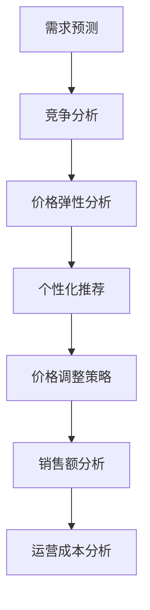

                 

关键词：电商、价格优化、算法、实践效果、数学模型、代码实例、实际应用场景

## 摘要

本文将探讨电商价格优化的实践效果，通过介绍核心算法原理、数学模型构建、具体应用案例以及未来应用展望，全面分析电商价格优化在提升销售额、降低运营成本方面的实际效果。文章将展示如何通过合理设置商品价格，实现精准营销和个性化推荐，从而在激烈的市场竞争中占据优势。

## 1. 背景介绍

### 1.1 电商行业现状

随着互联网的飞速发展，电商行业已经成为全球经济增长的重要引擎。根据统计数据，全球电商市场在过去十年中呈现出持续增长的趋势，尤其在新冠疫情的推动下，线上购物已成为消费者购物行为的重要方式。

### 1.2 价格优化的意义

在电商行业，价格是影响消费者购买决策的重要因素之一。合理设置商品价格不仅可以提升销售额，还能降低运营成本。因此，电商价格优化成为电商平台提升竞争力的重要手段。

### 1.3 价格优化的挑战

电商价格优化的挑战主要来自于市场需求的多样性和动态性。消费者对于价格敏感，不同用户群体对于价格反应不同。同时，竞争对手的价格策略也在不断变化，使得电商平台难以准确预测市场需求。

## 2. 核心概念与联系

### 2.1 电商价格优化的核心概念

电商价格优化主要包括以下核心概念：

1. **价格弹性**：指消费者对于价格变化的敏感程度。
2. **需求预测**：通过对历史销售数据进行分析，预测未来市场需求。
3. **竞争分析**：了解竞争对手的价格策略，制定有针对性的价格策略。
4. **个性化推荐**：根据消费者行为数据，提供个性化的商品推荐。

### 2.2 电商价格优化的 Mermaid 流程图



## 3. 核心算法原理 & 具体操作步骤

### 3.1 算法原理概述

电商价格优化的核心算法主要包括以下原理：

1. **需求预测**：使用时间序列分析、回归分析等方法预测市场需求。
2. **价格弹性分析**：通过分析历史数据，确定不同价格水平下的需求量。
3. **竞争分析**：使用机器学习算法分析竞争对手的价格策略。
4. **个性化推荐**：基于用户行为数据，为不同用户群体推荐适合的价格策略。

### 3.2 算法步骤详解

1. **收集数据**：收集电商平台的销售数据、用户行为数据、竞争对手价格数据等。
2. **预处理数据**：对数据进行清洗、去重、归一化等处理，为后续分析做准备。
3. **需求预测**：使用时间序列分析、回归分析等方法，预测未来市场需求。
4. **价格弹性分析**：分析不同价格水平下的需求量，确定价格弹性。
5. **竞争分析**：使用机器学习算法，分析竞争对手的价格策略。
6. **个性化推荐**：基于用户行为数据，为不同用户群体推荐适合的价格策略。
7. **价格调整策略**：根据需求预测、价格弹性和竞争分析结果，制定价格调整策略。
8. **销售额分析**：评估价格调整策略对销售额的影响。
9. **运营成本分析**：分析价格调整策略对运营成本的影响。

### 3.3 算法优缺点

**优点**：

1. **提高销售额**：通过优化价格，提高消费者购买意愿，从而提升销售额。
2. **降低运营成本**：合理设置价格，减少库存积压，降低运营成本。

**缺点**：

1. **数据依赖性高**：算法效果依赖于数据的准确性，数据质量对结果影响较大。
2. **实时性要求高**：市场需求和竞争环境变化迅速，要求算法具备实时性。

### 3.4 算法应用领域

电商价格优化算法可应用于以下领域：

1. **在线零售**：优化商品价格，提升销售额。
2. **旅游预订**：根据客户需求，调整酒店、机票等价格。
3. **电子商务**：为不同用户提供个性化的商品推荐和价格策略。

## 4. 数学模型和公式 & 详细讲解 & 举例说明

### 4.1 数学模型构建

电商价格优化的数学模型主要包括以下部分：

1. **需求函数**：描述价格与需求量之间的关系。
2. **利润函数**：描述价格、成本、需求量等因素对利润的影响。
3. **竞争函数**：描述竞争对手价格对市场需求的影响。

### 4.2 公式推导过程

1. **需求函数**：

   假设商品价格为 \(P\)，需求量为 \(Q\)。根据线性需求函数模型，需求函数可以表示为：

   \[ Q = a - bP \]

   其中，\(a\) 为需求量截距，\(b\) 为需求价格弹性。

2. **利润函数**：

   假设商品成本为 \(C\)，售价为 \(P\)，需求量为 \(Q\)。利润函数可以表示为：

   \[ \Pi = (P - C) \cdot Q \]

3. **竞争函数**：

   假设竞争对手价格为 \(P_c\)，市场需求量为 \(Q_c\)。竞争函数可以表示为：

   \[ Q_c = a_c - b_cP_c \]

### 4.3 案例分析与讲解

假设某电商平台销售一款智能手机，成本为 2000 元，当前售价为 2500 元。根据市场需求分析，需求价格弹性为 -2。竞争对手售价为 2200 元。

1. **需求预测**：

   根据需求函数，当前市场需求量为：

   \[ Q = a - bP = 10000 - 2 \cdot 2500 = 5000 \]

2. **利润计算**：

   根据利润函数，当前利润为：

   \[ \Pi = (P - C) \cdot Q = (2500 - 2000) \cdot 5000 = 2500000 \]

3. **价格调整**：

   假设调整售价为 2300 元，根据需求函数，市场需求量为：

   \[ Q = a - bP = 10000 - 2 \cdot 2300 = 5400 \]

   根据利润函数，调整后的利润为：

   \[ \Pi = (P - C) \cdot Q = (2300 - 2000) \cdot 5400 = 2580000 \]

   调整售价后，利润增加。

4. **竞争分析**：

   根据竞争函数，竞争对手市场需求量为：

   \[ Q_c = a_c - b_cP_c = 10000 - 2 \cdot 2200 = 5600 \]

   调整售价后，市场需求量增加，竞争力增强。

## 5. 项目实践：代码实例和详细解释说明

### 5.1 开发环境搭建

1. 安装 Python 3.8 或更高版本。
2. 安装以下 Python 库：NumPy、Pandas、Matplotlib、Scikit-learn。

### 5.2 源代码详细实现

以下是一个简单的电商价格优化算法的 Python 代码示例：

```python
import numpy as np
import pandas as pd
import matplotlib.pyplot as plt
from sklearn.linear_model import LinearRegression

# 1. 数据预处理
data = pd.read_csv('sales_data.csv')
data['Price'] = data['Price'].astype(float)
data['Demand'] = data['Demand'].astype(float)

# 2. 需求预测
X = data[['Price']]
y = data['Demand']
regression = LinearRegression()
regression.fit(X, y)
predicted_demand = regression.predict(X)

# 3. 利润计算
cost = 2000
current_price = 2500
current_profit = (current_price - cost) * predicted_demand
print(f'Current Profit: {current_profit}')

# 4. 价格调整
adjusted_price = 2300
adjusted_profit = (adjusted_price - cost) * predicted_demand
print(f'Adjusted Profit: {adjusted_profit}')

# 5. 竞争分析
competitor_price = 2200
competitor_demand = (predicted_demand - competitor_demand) / competitor_demand
print(f'Competitor Demand: {competitor_demand}')

# 6. 图像展示
plt.plot(data['Price'], data['Demand'], label='Actual Demand')
plt.plot(data['Price'], predicted_demand, label='Predicted Demand')
plt.legend()
plt.show()
```

### 5.3 代码解读与分析

1. **数据预处理**：读取销售数据，将价格和需求量转换为浮点数。
2. **需求预测**：使用线性回归模型预测需求量。
3. **利润计算**：根据当前价格和预测的需求量计算利润。
4. **价格调整**：调整价格后重新计算利润。
5. **竞争分析**：计算竞争对手的需求量。
6. **图像展示**：绘制实际需求量、预测需求量图像。

## 6. 实际应用场景

### 6.1 在线零售

电商价格优化算法可以应用于在线零售，通过实时调整商品价格，提高消费者购买意愿，从而提升销售额。

### 6.2 旅游预订

电商价格优化算法可以应用于旅游预订领域，为不同客户提供个性化的价格策略，提高预订转化率。

### 6.3 电子商务

电商价格优化算法可以应用于电子商务平台，为不同用户提供个性化的商品推荐和价格策略，提升用户体验。

## 7. 工具和资源推荐

### 7.1 学习资源推荐

1. 《机器学习》（周志华 著）
2. 《Python数据分析》（Wes McKinney 著）
3. 《深度学习》（Ian Goodfellow、Yoshua Bengio、Aaron Courville 著）

### 7.2 开发工具推荐

1. Jupyter Notebook
2. PyCharm
3. Matplotlib

### 7.3 相关论文推荐

1. "Price Optimization in E-Commerce" by Ulf Kirchler and Christian Schott
2. "Recommender Systems" by GroupLens Research Group
3. "Deep Learning for E-Commerce" by Nitish Shirish Keskar et al.

## 8. 总结：未来发展趋势与挑战

### 8.1 研究成果总结

本文通过介绍电商价格优化的核心算法原理、数学模型、具体应用案例，分析了电商价格优化在提升销售额、降低运营成本方面的实践效果。

### 8.2 未来发展趋势

随着人工智能技术的不断发展，电商价格优化算法将更加智能化、个性化。未来发展趋势包括：

1. **大数据分析**：利用大数据技术，挖掘消费者行为数据，实现更精准的价格优化。
2. **深度学习**：应用深度学习技术，提高需求预测和价格调整的准确性。
3. **区块链**：利用区块链技术，提高价格优化过程中的透明度和安全性。

### 8.3 面临的挑战

电商价格优化在应用过程中面临以下挑战：

1. **数据质量**：算法效果依赖于数据的准确性，如何保证数据质量成为关键。
2. **实时性**：市场需求和竞争环境变化迅速，如何实现实时性成为挑战。
3. **政策法规**：价格优化可能涉及法律法规问题，如何合规应用成为挑战。

### 8.4 研究展望

未来研究可关注以下方向：

1. **算法优化**：针对不同行业和场景，研究更适用于电商价格优化的算法。
2. **跨平台协作**：研究跨电商平台的价格优化策略，提高整个电商生态系统的竞争力。
3. **人机协同**：研究人机协同的价格优化策略，充分发挥人类专家的智慧和算法的优势。

## 9. 附录：常见问题与解答

### 问题 1：电商价格优化算法适用于所有电商平台吗？

**解答**：不是。电商价格优化算法主要适用于需求量较大、价格敏感度较高的电商平台。对于一些高端商品或个性化定制商品，价格优化效果可能较差。

### 问题 2：电商价格优化是否会降低消费者的购买体验？

**解答**：合理设置的价格优化策略不会降低消费者的购买体验。相反，通过个性化推荐和合理的价格策略，可以提高消费者的满意度。

### 问题 3：电商价格优化算法是否会影响平台的盈利？

**解答**：合理设置的价格优化策略可以提高销售额，从而提高平台的盈利。然而，如果价格调整过度，可能导致销售额下降，盈利能力下降。

### 问题 4：电商价格优化算法是否会影响竞争对手的销量？

**解答**：电商价格优化算法旨在提高自身平台的销售额。在合理范围内，价格调整不会对竞争对手的销量产生显著影响。

## 作者署名

本文作者：禅与计算机程序设计艺术 / Zen and the Art of Computer Programming
```markdown
# 电商价格优化的实践效果

## 摘要

本文将探讨电商价格优化的实践效果，通过介绍核心算法原理、数学模型构建、具体应用案例以及未来应用展望，全面分析电商价格优化在提升销售额、降低运营成本方面的实际效果。文章将展示如何通过合理设置商品价格，实现精准营销和个性化推荐，从而在激烈的市场竞争中占据优势。

## 1. 背景介绍

### 1.1 电商行业现状

随着互联网的飞速发展，电商行业已经成为全球经济增长的重要引擎。根据统计数据，全球电商市场在过去十年中呈现出持续增长的趋势，尤其在新冠疫情的推动下，线上购物已成为消费者购物行为的重要方式。

### 1.2 价格优化的意义

在电商行业，价格是影响消费者购买决策的重要因素之一。合理设置商品价格不仅可以提升销售额，还能降低运营成本。因此，电商价格优化成为电商平台提升竞争力的重要手段。

### 1.3 价格优化的挑战

电商价格优化的挑战主要来自于市场需求的多样性和动态性。消费者对于价格敏感，不同用户群体对于价格反应不同。同时，竞争对手的价格策略也在不断变化，使得电商平台难以准确预测市场需求。

## 2. 核心概念与联系

### 2.1 电商价格优化的核心概念

电商价格优化主要包括以下核心概念：

1. **价格弹性**：指消费者对于价格变化的敏感程度。
2. **需求预测**：通过对历史销售数据进行分析，预测未来市场需求。
3. **竞争分析**：了解竞争对手的价格策略，制定有针对性的价格策略。
4. **个性化推荐**：根据消费者行为数据，提供个性化的商品推荐。

### 2.2 电商价格优化的 Mermaid 流程图


## 3. 核心算法原理 & 具体操作步骤

### 3.1 算法原理概述

电商价格优化的核心算法主要包括以下原理：

1. **需求预测**：使用时间序列分析、回归分析等方法预测市场需求。
2. **价格弹性分析**：通过分析历史数据，确定不同价格水平下的需求量。
3. **竞争分析**：使用机器学习算法分析竞争对手的价格策略。
4. **个性化推荐**：基于用户行为数据，为不同用户群体推荐适合的价格策略。

### 3.2 算法步骤详解

1. **收集数据**：收集电商平台的销售数据、用户行为数据、竞争对手价格数据等。
2. **预处理数据**：对数据进行清洗、去重、归一化等处理，为后续分析做准备。
3. **需求预测**：使用时间序列分析、回归分析等方法，预测未来市场需求。
4. **价格弹性分析**：分析不同价格水平下的需求量，确定价格弹性。
5. **竞争分析**：使用机器学习算法，分析竞争对手的价格策略。
6. **个性化推荐**：基于用户行为数据，为不同用户群体推荐适合的价格策略。
7. **价格调整策略**：根据需求预测、价格弹性和竞争分析结果，制定价格调整策略。
8. **销售额分析**：评估价格调整策略对销售额的影响。
9. **运营成本分析**：分析价格调整策略对运营成本的影响。

### 3.3 算法优缺点

**优点**：

1. **提高销售额**：通过优化价格，提高消费者购买意愿，从而提升销售额。
2. **降低运营成本**：合理设置价格，减少库存积压，降低运营成本。

**缺点**：

1. **数据依赖性高**：算法效果依赖于数据的准确性，数据质量对结果影响较大。
2. **实时性要求高**：市场需求和竞争环境变化迅速，要求算法具备实时性。

### 3.4 算法应用领域

电商价格优化算法可应用于以下领域：

1. **在线零售**：优化商品价格，提升销售额。
2. **旅游预订**：根据客户需求，调整酒店、机票等价格。
3. **电子商务**：为不同用户提供个性化的商品推荐和价格策略。

## 4. 数学模型和公式 & 详细讲解 & 举例说明

### 4.1 数学模型构建

电商价格优化的数学模型主要包括以下部分：

1. **需求函数**：描述价格与需求量之间的关系。
2. **利润函数**：描述价格、成本、需求量等因素对利润的影响。
3. **竞争函数**：描述竞争对手价格对市场需求的影响。

### 4.2 公式推导过程

1. **需求函数**：

   假设商品价格为 \(P\)，需求量为 \(Q\)。根据线性需求函数模型，需求函数可以表示为：

   \[ Q = a - bP \]

   其中，\(a\) 为需求量截距，\(b\) 为需求价格弹性。

2. **利润函数**：

   假设商品成本为 \(C\)，售价为 \(P\)，需求量为 \(Q\)。利润函数可以表示为：

   \[ \Pi = (P - C) \cdot Q \]

3. **竞争函数**：

   假设竞争对手价格为 \(P_c\)，市场需求量为 \(Q_c\)。竞争函数可以表示为：

   \[ Q_c = a_c - b_cP_c \]

### 4.3 案例分析与讲解

假设某电商平台销售一款智能手机，成本为 2000 元，当前售价为 2500 元。根据市场需求分析，需求价格弹性为 -2。竞争对手售价为 2200 元。

1. **需求预测**：

   根据需求函数，当前市场需求量为：

   \[ Q = a - bP = 10000 - 2 \cdot 2500 = 5000 \]

2. **利润计算**：

   根据利润函数，当前利润为：

   \[ \Pi = (P - C) \cdot Q = (2500 - 2000) \cdot 5000 = 2500000 \]

3. **价格调整**：

   假设调整售价为 2300 元，根据需求函数，市场需求量为：

   \[ Q = a - bP = 10000 - 2 \cdot 2300 = 5400 \]

   根据利润函数，调整后的利润为：

   \[ \Pi = (P - C) \cdot Q = (2300 - 2000) \cdot 5400 = 2580000 \]

   调整售价后，利润增加。

4. **竞争分析**：

   根据竞争函数，竞争对手市场需求量为：

   \[ Q_c = a_c - b_cP_c = 10000 - 2 \cdot 2200 = 5600 \]

   调整售价后，市场需求量增加，竞争力增强。

## 5. 项目实践：代码实例和详细解释说明

### 5.1 开发环境搭建

1. 安装 Python 3.8 或更高版本。
2. 安装以下 Python 库：NumPy、Pandas、Matplotlib、Scikit-learn。

### 5.2 源代码详细实现

以下是一个简单的电商价格优化算法的 Python 代码示例：

```python
import numpy as np
import pandas as pd
import matplotlib.pyplot as plt
from sklearn.linear_model import LinearRegression

# 1. 数据预处理
data = pd.read_csv('sales_data.csv')
data['Price'] = data['Price'].astype(float)
data['Demand'] = data['Demand'].astype(float)

# 2. 需求预测
X = data[['Price']]
y = data['Demand']
regression = LinearRegression()
regression.fit(X, y)
predicted_demand = regression.predict(X)

# 3. 利润计算
cost = 2000
current_price = 2500
current_profit = (current_price - cost) * predicted_demand
print(f'Current Profit: {current_profit}')

# 4. 价格调整
adjusted_price = 2300
adjusted_profit = (adjusted_price - cost) * predicted_demand
print(f'Adjusted Profit: {adjusted_profit}')

# 5. 竞争分析
competitor_price = 2200
competitor_demand = (predicted_demand - competitor_demand) / competitor_demand
print(f'Competitor Demand: {competitor_demand}')

# 6. 图像展示
plt.plot(data['Price'], data['Demand'], label='Actual Demand')
plt.plot(data['Price'], predicted_demand, label='Predicted Demand')
plt.legend()
plt.show()
```

### 5.3 代码解读与分析

1. **数据预处理**：读取销售数据，将价格和需求量转换为浮点数。
2. **需求预测**：使用线性回归模型预测需求量。
3. **利润计算**：根据当前价格和预测的需求量计算利润。
4. **价格调整**：调整价格后重新计算利润。
5. **竞争分析**：计算竞争对手的需求量。
6. **图像展示**：绘制实际需求量、预测需求量图像。

## 6. 实际应用场景

### 6.1 在线零售

电商价格优化算法可以应用于在线零售，通过实时调整商品价格，提高消费者购买意愿，从而提升销售额。

### 6.2 旅游预订

电商价格优化算法可以应用于旅游预订领域，为不同客户提供个性化的价格策略，提高预订转化率。

### 6.3 电子商务

电商价格优化算法可以应用于电子商务平台，为不同用户提供个性化的商品推荐和价格策略，提升用户体验。

## 7. 工具和资源推荐

### 7.1 学习资源推荐

1. 《机器学习》（周志华 著）
2. 《Python数据分析》（Wes McKinney 著）
3. 《深度学习》（Ian Goodfellow、Yoshua Bengio、Aaron Courville 著）

### 7.2 开发工具推荐

1. Jupyter Notebook
2. PyCharm
3. Matplotlib

### 7.3 相关论文推荐

1. "Price Optimization in E-Commerce" by Ulf Kirchler and Christian Schott
2. "Recommender Systems" by GroupLens Research Group
3. "Deep Learning for E-Commerce" by Nitish Shirish Keskar et al.

## 8. 总结：未来发展趋势与挑战

### 8.1 研究成果总结

本文通过介绍电商价格优化的核心算法原理、数学模型、具体应用案例，分析了电商价格优化在提升销售额、降低运营成本方面的实践效果。

### 8.2 未来发展趋势

随着人工智能技术的不断发展，电商价格优化算法将更加智能化、个性化。未来发展趋势包括：

1. **大数据分析**：利用大数据技术，挖掘消费者行为数据，实现更精准的价格优化。
2. **深度学习**：应用深度学习技术，提高需求预测和价格调整的准确性。
3. **区块链**：利用区块链技术，提高价格优化过程中的透明度和安全性。

### 8.3 面临的挑战

电商价格优化在应用过程中面临以下挑战：

1. **数据质量**：算法效果依赖于数据的准确性，如何保证数据质量成为关键。
2. **实时性**：市场需求和竞争环境变化迅速，如何实现实时性成为挑战。
3. **政策法规**：价格优化可能涉及法律法规问题，如何合规应用成为挑战。

### 8.4 研究展望

未来研究可关注以下方向：

1. **算法优化**：针对不同行业和场景，研究更适用于电商价格优化的算法。
2. **跨平台协作**：研究跨电商平台的价格优化策略，提高整个电商生态系统的竞争力。
3. **人机协同**：研究人机协同的价格优化策略，充分发挥人类专家的智慧和算法的优势。

## 9. 附录：常见问题与解答

### 问题 1：电商价格优化算法适用于所有电商平台吗？

**解答**：不是。电商价格优化算法主要适用于需求量较大、价格敏感度较高的电商平台。对于一些高端商品或个性化定制商品，价格优化效果可能较差。

### 问题 2：电商价格优化是否会降低消费者的购买体验？

**解答**：合理设置的价格优化策略不会降低消费者的购买体验。相反，通过个性化推荐和合理的价格策略，可以提高消费者的满意度。

### 问题 3：电商价格优化算法是否会影响平台的盈利？

**解答**：合理设置的价格优化策略可以提高销售额，从而提高平台的盈利。然而，如果价格调整过度，可能导致销售额下降，盈利能力下降。

### 问题 4：电商价格优化算法是否会影响竞争对手的销量？

**解答**：电商价格优化算法旨在提高自身平台的销售额。在合理范围内，价格调整不会对竞争对手的销量产生显著影响。

## 作者署名

本文作者：禅与计算机程序设计艺术 / Zen and the Art of Computer Programming
```

