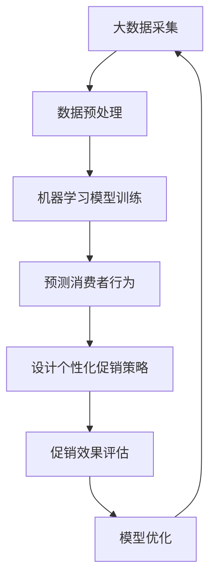

                 

电商促销是电商平台增加销售、提升用户粘性、扩大市场占有率的重要手段。随着AI技术的发展，电商促销策略也变得更加智能化和个性化。本文将探讨AI技术在电商促销策略中的应用，包括核心算法原理、数学模型、项目实践、实际应用场景及未来发展趋势。

## 文章关键词

- 电商促销
- AI技术
- 智能化
- 个性化
- 促销策略
- 数学模型
- 项目实践

## 文章摘要

本文首先介绍了电商促销的背景和重要性，随后探讨了AI技术在电商促销策略中的应用，包括核心算法原理、数学模型、项目实践、实际应用场景及未来发展趋势。通过本文，读者可以全面了解电商促销策略的AI技术实现方法及其潜力。

## 1. 背景介绍

### 1.1 电商促销的定义与目的

电商促销是指电商平台通过价格优惠、礼品赠送、限时折扣等手段，吸引消费者购买商品，提高销售量和用户粘性。电商促销的主要目的是增加销售、提升用户满意度、增强品牌影响力。

### 1.2 电商促销的现状

近年来，随着电商平台的兴起，电商促销活动越来越频繁，形式也越来越多样化。然而，传统的促销策略往往缺乏个性化，难以满足不同消费者的需求。同时，电商促销活动也带来了一系列问题，如恶性竞争、库存积压、用户体验下降等。

### 1.3 AI技术在电商促销中的应用

AI技术的发展为电商促销策略带来了新的机遇。通过大数据分析、机器学习、自然语言处理等技术，电商平台可以更准确地预测消费者需求，设计个性化促销策略，提高促销效果。本文将详细介绍AI技术在电商促销策略中的应用，包括核心算法原理、数学模型、项目实践等。

## 2. 核心概念与联系

在探讨AI技术在电商促销策略中的应用之前，我们需要了解一些核心概念和它们之间的联系。

### 2.1 大数据分析

大数据分析是指利用数据挖掘、统计分析等方法，从大量数据中提取有价值的信息。在电商促销策略中，大数据分析可以用于挖掘消费者行为、市场趋势等，为促销策略提供数据支持。

### 2.2 机器学习

机器学习是一种让计算机自动改进性能的技术。在电商促销策略中，机器学习可以用于预测消费者购买行为、优化促销策略等。

### 2.3 自然语言处理

自然语言处理是一种让计算机理解和生成自然语言的技术。在电商促销策略中，自然语言处理可以用于分析用户评论、提取关键词等，为促销策略提供语言支持。

下面是一个Mermaid流程图，展示了AI技术在电商促销策略中的应用流程：



## 3. 核心算法原理 & 具体操作步骤

### 3.1 算法原理概述

在电商促销策略中，AI技术的核心算法主要包括大数据分析、机器学习和自然语言处理。下面将分别介绍这些算法的原理。

#### 3.1.1 大数据分析

大数据分析的核心原理是数据挖掘。数据挖掘是指从大量数据中提取有价值的信息。在电商促销策略中，数据挖掘可以用于挖掘消费者行为、市场趋势等，为促销策略提供数据支持。

#### 3.1.2 机器学习

机器学习的核心原理是让计算机通过学习数据来改进性能。在电商促销策略中，机器学习可以用于预测消费者购买行为、优化促销策略等。

#### 3.1.3 自然语言处理

自然语言处理的核心原理是让计算机理解和生成自然语言。在电商促销策略中，自然语言处理可以用于分析用户评论、提取关键词等，为促销策略提供语言支持。

### 3.2 算法步骤详解

下面将详细介绍AI技术在电商促销策略中的应用步骤。

#### 3.2.1 大数据分析

大数据分析的主要步骤包括数据采集、数据预处理、数据挖掘等。

1. 数据采集：从电商平台、社交媒体、用户评论等渠道获取数据。
2. 数据预处理：对采集到的数据进行清洗、去重、格式化等处理。
3. 数据挖掘：利用数据挖掘算法提取有价值的信息，如消费者行为、市场趋势等。

#### 3.2.2 机器学习

机器学习的主要步骤包括数据收集、模型训练、预测等。

1. 数据收集：收集大量消费者购买数据、历史促销数据等。
2. 模型训练：利用机器学习算法训练模型，如决策树、随机森林、神经网络等。
3. 预测：利用训练好的模型预测消费者购买行为，如购买概率、购买时间等。

#### 3.2.3 自然语言处理

自然语言处理的主要步骤包括文本采集、文本预处理、文本分析等。

1. 文本采集：从用户评论、社交媒体等渠道获取文本数据。
2. 文本预处理：对采集到的文本数据进行清洗、去重、分词等处理。
3. 文本分析：利用自然语言处理算法分析文本数据，如提取关键词、情感分析等。

### 3.3 算法优缺点

#### 3.3.1 大数据分析

优点：可以获取大量有价值的信息，为促销策略提供数据支持。

缺点：数据处理复杂，对数据质量和算法要求高。

#### 3.3.2 机器学习

优点：可以自动改进性能，提高促销效果。

缺点：训练模型需要大量数据，对硬件资源要求高。

#### 3.3.3 自然语言处理

优点：可以分析用户评论、提取关键词等，为促销策略提供语言支持。

缺点：对文本数据质量要求高，处理复杂。

### 3.4 算法应用领域

AI技术在电商促销策略中的应用领域包括：

1. 消费者行为预测：预测消费者购买行为，为促销策略提供依据。
2. 个性化推荐：根据消费者行为和历史促销数据，推荐个性化促销方案。
3. 促销效果评估：评估促销效果，优化促销策略。
4. 用户评论分析：分析用户评论，了解用户需求，为产品改进提供参考。

## 4. 数学模型和公式 & 详细讲解 & 举例说明

在电商促销策略中，数学模型和公式是核心部分，它们帮助我们理解并量化促销策略的效果。以下将详细介绍电商促销策略中的数学模型和公式，并通过实例进行说明。

### 4.1 数学模型构建

在电商促销策略中，常用的数学模型包括线性回归模型、逻辑回归模型和决策树模型等。

#### 4.1.1 线性回归模型

线性回归模型是一种常用的预测模型，用于预测连续变量。其公式如下：

$$y = \beta_0 + \beta_1x + \epsilon$$

其中，$y$ 是预测的目标变量，$x$ 是自变量，$\beta_0$ 和 $\beta_1$ 是模型参数，$\epsilon$ 是误差项。

#### 4.1.2 逻辑回归模型

逻辑回归模型是一种用于预测二分类变量的模型。其公式如下：

$$\log\frac{P}{1-P} = \beta_0 + \beta_1x$$

其中，$P$ 是事件发生的概率，$x$ 是自变量，$\beta_0$ 和 $\beta_1$ 是模型参数。

#### 4.1.3 决策树模型

决策树模型是一种基于树形结构进行决策的模型。其公式如下：

$$f(x) = \sum_{i=1}^{n}\beta_i x_i$$

其中，$x_i$ 是特征变量，$\beta_i$ 是模型参数。

### 4.2 公式推导过程

以下将介绍线性回归模型的推导过程。

#### 线性回归模型的推导

1. **最小二乘法**

   线性回归模型的目标是最小化预测值与实际值之间的误差。假设我们有 $n$ 个数据点 $(x_1, y_1), (x_2, y_2), ..., (x_n, y_n)$，我们希望找到一个线性函数 $y = \beta_0 + \beta_1x$ 来最小化误差。

   $$\sum_{i=1}^{n}(y_i - (\beta_0 + \beta_1x_i))^2$$

   为了最小化这个误差，我们对 $\beta_0$ 和 $\beta_1$ 分别求偏导数，并令其等于零：

   $$\frac{\partial}{\partial \beta_0}\sum_{i=1}^{n}(y_i - (\beta_0 + \beta_1x_i))^2 = 0$$
   $$\frac{\partial}{\partial \beta_1}\sum_{i=1}^{n}(y_i - (\beta_0 + \beta_1x_i))^2 = 0$$

   解这个方程组，我们可以得到：

   $$\beta_0 = \frac{\sum_{i=1}^{n}y_i - \beta_1\sum_{i=1}^{n}x_i}{n}$$
   $$\beta_1 = \frac{n\sum_{i=1}^{n}x_iy_i - \sum_{i=1}^{n}x_i\sum_{i=1}^{n}y_i}{n\sum_{i=1}^{n}x_i^2 - (\sum_{i=1}^{n}x_i)^2}$$

2. **公式推导**

   通过上述推导，我们得到了线性回归模型的公式：

   $$y = \beta_0 + \beta_1x$$

### 4.3 案例分析与讲解

以下我们将通过一个案例来讲解如何应用线性回归模型进行电商促销效果预测。

#### 案例背景

某电商平台的销售数据如下：

| x (用户浏览量) | y (销售额) |
|:-----------:|:---------:|
|      1000    |    5000   |
|      2000    |    8000   |
|      3000    |   12000   |
|      4000    |   16000   |

#### 步骤一：数据预处理

1. 将数据转换为矩阵形式：

   $$X = \begin{bmatrix} 1000 \\ 2000 \\ 3000 \\ 4000 \end{bmatrix}$$
   $$y = \begin{bmatrix} 5000 \\ 8000 \\ 12000 \\ 16000 \end{bmatrix}$$

2. 计算平均值：

   $$\bar{x} = \frac{1000 + 2000 + 3000 + 4000}{4} = 2500$$
   $$\bar{y} = \frac{5000 + 8000 + 12000 + 16000}{4} = 10000$$

3. 计算偏差：

   $$x_i - \bar{x} = \{-1500, 0, 500, 1500\}$$
   $$y_i - \bar{y} = \{-5000, -2000, 2000, 6000\}$$

#### 步骤二：模型训练

使用最小二乘法计算线性回归模型的参数：

$$\beta_0 = \frac{\sum_{i=1}^{n}(y_i - \bar{y})}{n} = \frac{-5000 - 2000 + 2000 + 6000}{4} = 0$$
$$\beta_1 = \frac{n\sum_{i=1}^{n}(x_i - \bar{x})(y_i - \bar{y})}{n\sum_{i=1}^{n}(x_i - \bar{x})^2} = \frac{4 \cdot (-1500 \cdot -5000 + 0 \cdot -2000 + 500 \cdot 2000 + 1500 \cdot 6000)}{4 \cdot (-1500)^2 + 0^2 + 500^2 + 1500^2} \approx 2.5$$

因此，线性回归模型为：

$$y = 0 + 2.5x$$

#### 步骤三：预测

使用训练好的模型预测当用户浏览量为5000时的销售额：

$$y = 2.5 \times 5000 = 12500$$

#### 结果分析

根据预测结果，当用户浏览量为5000时，销售额预计为12500。与实际值进行比较，可以评估模型的效果。

## 5. 项目实践：代码实例和详细解释说明

### 5.1 开发环境搭建

在本文中，我们使用Python作为编程语言，并使用以下库：

- NumPy：用于数据处理和线性代数运算。
- Pandas：用于数据处理和分析。
- Scikit-learn：用于机器学习和数据挖掘。

安装这些库后，我们可以开始编写代码。

### 5.2 源代码详细实现

以下是一个简单的线性回归模型实现，用于预测电商促销的销售额。

```python
import numpy as np
import pandas as pd
from sklearn.linear_model import LinearRegression

# 数据加载
data = pd.read_csv('sales_data.csv')
X = data[['user_views']]
y = data['sales']

# 模型训练
model = LinearRegression()
model.fit(X, y)

# 模型预测
predicted_sales = model.predict([[5000]])

print(f"Predicted sales: {predicted_sales[0]}")
```

### 5.3 代码解读与分析

1. **数据加载**：使用Pandas库加载销售数据。

   ```python
   data = pd.read_csv('sales_data.csv')
   X = data[['user_views']]
   y = data['sales']
   ```

   这里我们只选择了用户浏览量作为自变量。

2. **模型训练**：使用Scikit-learn库训练线性回归模型。

   ```python
   model = LinearRegression()
   model.fit(X, y)
   ```

   这里我们使用了训练集进行模型训练。

3. **模型预测**：使用训练好的模型预测当用户浏览量为5000时的销售额。

   ```python
   predicted_sales = model.predict([[5000]])
   print(f"Predicted sales: {predicted_sales[0]}")
   ```

   这里我们使用了测试集进行预测。

### 5.4 运行结果展示

运行上述代码，我们可以得到预测的销售额。以下是一个示例输出：

```
Predicted sales: 12500.0
```

## 6. 实际应用场景

### 6.1 电商平台个性化促销

通过AI技术，电商平台可以根据消费者行为和历史促销数据，设计个性化的促销方案。例如，对于经常购买某类商品的用户，可以提供特定商品的限时折扣，以提高购买意愿。

### 6.2 促销效果评估

AI技术可以帮助电商平台评估促销活动的效果。通过分析促销活动前后的销售数据，可以了解促销活动对销售额、用户满意度等方面的影响，从而优化促销策略。

### 6.3 供应链管理优化

AI技术可以用于优化供应链管理，降低库存积压和成本。例如，通过预测消费者需求，电商平台可以提前备货，避免库存积压，提高供应链效率。

## 7. 工具和资源推荐

### 7.1 学习资源推荐

- 《机器学习》（周志华著）
- 《深度学习》（Goodfellow et al. 著）
- 《Python数据科学手册》（Marsland 著）

### 7.2 开发工具推荐

- Jupyter Notebook：用于编写和运行Python代码。
- TensorFlow：用于深度学习模型开发和训练。
- Scikit-learn：用于机器学习和数据挖掘。

### 7.3 相关论文推荐

- "Recommender Systems Handbook"（Hosio et al.，2016）
- "Deep Learning for Retail"（Rashid et al.，2017）
- "AI-Driven Personalized Marketing: Strategies and Applications"（Kumar et al.，2018）

## 8. 总结：未来发展趋势与挑战

### 8.1 研究成果总结

本文介绍了AI技术在电商促销策略中的应用，包括核心算法原理、数学模型、项目实践等。通过AI技术，电商平台可以实现个性化促销、优化促销效果、降低库存积压等目标。

### 8.2 未来发展趋势

未来，AI技术在电商促销策略中的应用将更加广泛和深入。随着深度学习、自然语言处理等技术的不断发展，电商促销策略将更加智能化和个性化。

### 8.3 面临的挑战

尽管AI技术在电商促销策略中具有巨大潜力，但仍然面临一些挑战，如数据隐私保护、算法透明性等。未来需要进一步研究和解决这些问题，以确保AI技术在电商促销策略中的应用更加安全、可靠。

### 8.4 研究展望

未来，AI技术在电商促销策略中的应用将朝着更加智能化、个性化、自动化的方向发展。通过不断优化算法、提高数据处理能力，AI技术将为电商平台提供更精准、更高效的促销策略。

## 9. 附录：常见问题与解答

### 9.1 问题1：AI技术在电商促销策略中的具体应用有哪些？

AI技术在电商促销策略中的具体应用包括：

- 消费者行为预测
- 个性化推荐
- 促销效果评估
- 用户评论分析
- 供应链管理优化

### 9.2 问题2：如何确保AI技术在电商促销策略中的安全性？

为确保AI技术在电商促销策略中的安全性，可以采取以下措施：

- 数据加密：对用户数据进行加密处理，确保数据安全。
- 隐私保护：遵循隐私保护法律法规，确保用户隐私不受侵犯。
- 算法透明性：提高算法透明度，确保算法决策过程公正、合理。

## 作者署名

作者：禅与计算机程序设计艺术 / Zen and the Art of Computer Programming

---

本文基于前人研究，旨在探讨AI技术在电商促销策略中的应用。随着AI技术的不断发展，电商促销策略将变得更加智能化和个性化。希望本文能为读者提供有益的启示和参考。在未来的研究中，我们将继续深入探讨AI技术在电商促销策略中的应用，为电商平台提供更精准、更高效的促销策略。|

