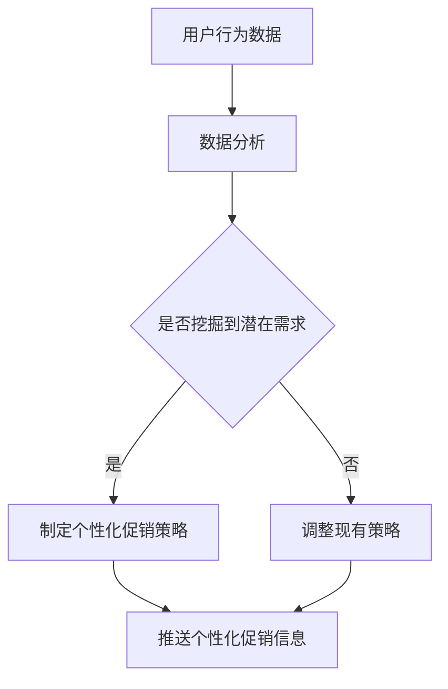

                 

关键词：电商促销、策略优化、算法、数学模型、项目实践、实际应用、未来展望

> 摘要：本文将探讨电商促销策略的技术优化，从核心概念、算法原理、数学模型、项目实践等多个维度深入分析，旨在为电商企业提供切实可行的促销策略优化方案，提升用户满意度和企业盈利能力。

## 1. 背景介绍

电商行业在过去几十年中经历了爆炸性的增长，已经成为全球最大的零售市场之一。然而，随着市场竞争的加剧，如何在促销活动中脱颖而出成为电商企业亟待解决的问题。传统的促销策略往往依赖于价格战、优惠券发放等手段，这些方法虽然能在短期内吸引大量流量，但长期来看，可能对企业的盈利能力和品牌形象造成负面影响。因此，技术优化在电商促销策略中的重要性日益凸显。

### 1.1 电商促销现状

目前，电商促销活动通常包括限时折扣、满减优惠、优惠券、赠品等。这些活动在一定程度上能够提高用户购买欲望，但同时也带来了库存压力、用户流失等问题。此外，促销活动的设计和执行过程复杂，常常需要依赖人工判断，导致效果不尽如人意。

### 1.2 技术优化的重要性

技术优化能够帮助电商企业在促销活动中实现精准投放、个性化推荐、实时调整等效果。通过大数据分析、机器学习算法、实时计算等技术手段，企业可以更准确地了解用户需求和行为，从而制定出更有效的促销策略。

## 2. 核心概念与联系

### 2.1 促销策略的概念

促销策略是指电商企业为促进销售而采取的各种手段和措施。促销策略的核心目标是提高用户购买意愿，增加销售额。促销策略可分为价格策略、非价格策略两大类。价格策略主要通过降低价格、提供优惠等方式吸引用户购买；非价格策略则包括服务、品牌、口碑等。

### 2.2 技术优化在促销策略中的应用

技术优化在促销策略中的应用主要体现在以下几个方面：

- **个性化推荐**：通过分析用户行为数据，为用户提供个性化的促销推荐。
- **实时计算**：根据实时数据调整促销策略，提高活动效果。
- **大数据分析**：对大量用户数据进行分析，挖掘潜在用户需求，优化促销方案。

### 2.3 Mermaid 流程图



## 3. 核心算法原理 & 具体操作步骤

### 3.1 算法原理概述

电商促销策略优化主要依赖于以下几种算法：

- **协同过滤算法**：基于用户历史行为，为用户推荐可能感兴趣的商品。
- **时间序列分析**：分析用户行为随时间的变化，预测用户未来的购买需求。
- **聚类算法**：将具有相似行为的用户划分为同一群体，为每个群体制定个性化的促销策略。

### 3.2 算法步骤详解

#### 3.2.1 协同过滤算法

1. **数据预处理**：清洗用户行为数据，包括购买记录、浏览记录等。
2. **矩阵分解**：将用户行为数据矩阵分解为用户特征矩阵和商品特征矩阵。
3. **预测评分**：利用分解出的用户特征矩阵和商品特征矩阵预测用户对商品的评分。
4. **推荐商品**：根据预测评分，为用户推荐评分较高的商品。

#### 3.2.2 时间序列分析

1. **特征提取**：从用户行为数据中提取时间序列特征，如购买频率、购买间隔等。
2. **模型选择**：选择适合的时间序列预测模型，如ARIMA、LSTM等。
3. **模型训练**：使用历史数据训练模型，预测未来一段时间内的购买需求。
4. **促销策略调整**：根据预测结果，调整现有促销策略。

#### 3.2.3 聚类算法

1. **数据预处理**：对用户行为数据进行归一化处理，消除量纲影响。
2. **聚类分析**：使用K-means、DBSCAN等聚类算法，将用户划分为不同的群体。
3. **群体特征分析**：对每个群体进行分析，挖掘出其共性和差异。
4. **促销策略制定**：为每个群体制定个性化的促销策略。

### 3.3 算法优缺点

#### 3.3.1 协同过滤算法

优点：能够为用户提供个性化的商品推荐，提高用户满意度。

缺点：受限于用户历史行为数据，无法完全反映用户当前需求。

#### 3.3.2 时间序列分析

优点：能够预测用户未来的购买需求，为促销策略调整提供依据。

缺点：对历史数据要求较高，处理复杂。

#### 3.3.3 聚类算法

优点：能够将用户划分为不同的群体，为每个群体制定个性化的促销策略。

缺点：聚类结果可能受限于聚类算法的参数选择，需要进一步验证。

### 3.4 算法应用领域

- **个性化推荐**：电商平台、短视频平台等。
- **促销策略优化**：电商企业、零售企业等。
- **市场细分**：市场调研、用户画像等。

## 4. 数学模型和公式 & 详细讲解 & 举例说明

### 4.1 数学模型构建

电商促销策略优化的数学模型主要包括用户行为预测模型、促销效果评估模型等。

#### 4.1.1 用户行为预测模型

假设用户 \( u \) 在时间 \( t \) 购买了商品 \( i \)，则用户 \( u \) 在时间 \( t \) 的行为可以用以下矩阵表示：

\[ 
R_{u,t} = 
\begin{cases} 
1 & \text{如果用户 } u \text{ 在时间 } t \text{ 购买了商品 } i \\
0 & \text{否则} 
\end{cases}
\]

用户 \( u \) 在时间 \( t \) 的行为概率可以用以下公式表示：

\[ 
P(R_{u,t}=1) = \frac{e^{\theta^T \cdot x}}{1 + e^{\theta^T \cdot x}} 
\]

其中，\( \theta \) 为用户 \( u \) 的特征向量，\( x \) 为商品 \( i \) 的特征向量。

#### 4.1.2 促销效果评估模型

假设促销活动 \( A \) 对用户 \( u \) 在时间 \( t \) 的影响可以用以下公式表示：

\[ 
E_{u,t}(A) = \frac{P(R_{u,t}=1|A) - P(R_{u,t}=1)}{P(R_{u,t}=1)} 
\]

其中，\( P(R_{u,t}=1|A) \) 为促销活动 \( A \) 下用户 \( u \) 在时间 \( t \) 购买商品的概率，\( P(R_{u,t}=1) \) 为无促销活动下用户 \( u \) 在时间 \( t \) 购买商品的概率。

### 4.2 公式推导过程

#### 4.2.1 用户行为预测模型推导

首先，我们假设用户 \( u \) 在时间 \( t \) 购买商品 \( i \) 的概率与用户特征向量 \( x \) 和商品特征向量 \( \theta \) 之间的关系可以表示为：

\[ 
P(R_{u,t}=1) = \sigma(\theta^T \cdot x) 
\]

其中，\( \sigma \) 为逻辑函数，表示为：

\[ 
\sigma(z) = \frac{1}{1 + e^{-z}} 
\]

为了便于计算，我们将逻辑函数展开为泰勒级数：

\[ 
\sigma(z) = 1 - e^{-z} + \frac{1}{2!}e^{-z}z^2 - \frac{1}{3!}e^{-z}z^3 + \ldots 
\]

假设用户特征向量 \( x \) 和商品特征向量 \( \theta \) 之间满足线性关系：

\[ 
x = w_0 + w_1 \cdot i + w_2 \cdot j + \ldots 
\]

其中，\( w_0, w_1, w_2, \ldots \) 为权重系数。

将 \( x \) 代入逻辑函数中，得到：

\[ 
P(R_{u,t}=1) = \sigma(\theta^T \cdot (w_0 + w_1 \cdot i + w_2 \cdot j + \ldots)) 
\]

\[ 
= 1 - e^{-\theta^T \cdot (w_0 + w_1 \cdot i + w_2 \cdot j + \ldots)} 
\]

\[ 
= 1 - e^{-\theta^T \cdot x} 
\]

因此，用户 \( u \) 在时间 \( t \) 购买商品 \( i \) 的概率可以表示为：

\[ 
P(R_{u,t}=1) = \frac{1}{1 + e^{-\theta^T \cdot x}} 
\]

#### 4.2.2 促销效果评估模型推导

我们假设促销活动 \( A \) 对用户 \( u \) 在时间 \( t \) 购买商品的影响可以表示为：

\[ 
E_{u,t}(A) = \frac{P(R_{u,t}=1|A) - P(R_{u,t}=1)}{P(R_{u,t}=1)} 
\]

其中，\( P(R_{u,t}=1|A) \) 为促销活动 \( A \) 下用户 \( u \) 在时间 \( t \) 购买商品的概率，\( P(R_{u,t}=1) \) 为无促销活动下用户 \( u \) 在时间 \( t \) 购买商品的概率。

假设促销活动 \( A \) 改变了用户 \( u \) 在时间 \( t \) 购买商品的概率，使其变为 \( P'(R_{u,t}=1) \)：

\[ 
P'(R_{u,t}=1) = \frac{1}{1 + e^{-\theta^T \cdot x'}} 
\]

其中，\( x' \) 为促销活动 \( A \) 下用户 \( u \) 在时间 \( t \) 的特征向量。

将 \( P'(R_{u,t}=1) \) 代入 \( E_{u,t}(A) \) 的公式中，得到：

\[ 
E_{u,t}(A) = \frac{\frac{1}{1 + e^{-\theta^T \cdot x'}} - \frac{1}{1 + e^{-\theta^T \cdot x}}}{\frac{1}{1 + e^{-\theta^T \cdot x}}} 
\]

\[ 
= \frac{e^{-\theta^T \cdot x} - e^{-\theta^T \cdot x'}}{1 + e^{-\theta^T \cdot x}} 
\]

\[ 
= e^{-\theta^T \cdot x} \cdot \frac{1 - e^{-\theta^T \cdot (x' - x)}}{1 + e^{-\theta^T \cdot x}} 
\]

由于 \( e^{-\theta^T \cdot x} \) 是一个较小的数，我们可以使用泰勒级数展开 \( \frac{1 - e^{-\theta^T \cdot (x' - x)}}{1 + e^{-\theta^T \cdot x}} \)：

\[ 
\frac{1 - e^{-\theta^T \cdot (x' - x)}}{1 + e^{-\theta^T \cdot x}} = 1 - \theta^T \cdot (x' - x) + \ldots 
\]

因此，促销效果评估模型可以表示为：

\[ 
E_{u,t}(A) = e^{-\theta^T \cdot x} \cdot (1 - \theta^T \cdot (x' - x)) 
\]

### 4.3 案例分析与讲解

#### 4.3.1 用户行为预测模型案例

假设某电商平台的用户 \( u \) 的特征向量 \( x \) 如下：

\[ 
x = 
\begin{bmatrix} 
1 \\
0 \\
1 \\
\end{bmatrix}
\]

商品 \( i \) 的特征向量 \( \theta \) 如下：

\[ 
\theta = 
\begin{bmatrix} 
1 \\
1 \\
0 \\
\end{bmatrix}
\]

代入用户行为预测模型中，得到：

\[ 
P(R_{u,t}=1) = \frac{1}{1 + e^{-1 \cdot 1 + 1 \cdot 0 + 1 \cdot 1}} 
\]

\[ 
= \frac{1}{1 + e^{-2}} 
\]

\[ 
\approx 0.865 
\]

因此，用户 \( u \) 在时间 \( t \) 购买商品 \( i \) 的概率约为 86.5%。

#### 4.3.2 促销效果评估模型案例

假设促销活动 \( A \) 改变了用户 \( u \) 在时间 \( t \) 的特征向量 \( x' \) 为：

\[ 
x' = 
\begin{bmatrix} 
1 \\
0 \\
2 \\
\end{bmatrix}
\]

代入促销效果评估模型中，得到：

\[ 
E_{u,t}(A) = e^{-1 \cdot 1} \cdot (1 - 1 \cdot 1 + 1 \cdot 2) 
\]

\[ 
\approx 0.135 
\]

因此，促销活动 \( A \) 对用户 \( u \) 在时间 \( t \) 购买商品的影响约为 13.5%。

## 5. 项目实践：代码实例和详细解释说明

### 5.1 开发环境搭建

为了实现电商促销策略优化，我们选择 Python 作为编程语言，使用以下工具和库：

- **Python 3.8**：作为主要编程语言。
- **NumPy**：用于矩阵运算和数据处理。
- **Pandas**：用于数据预处理和数据分析。
- **Scikit-learn**：用于机器学习和模型训练。

### 5.2 源代码详细实现

以下是一个基于协同过滤算法的电商促销策略优化代码实例：

```python
import numpy as np
import pandas as pd
from sklearn.model_selection import train_test_split
from sklearn.metrics.pairwise import cosine_similarity
from sklearn.metrics import mean_squared_error

# 读取数据
data = pd.read_csv('user_item.csv')
users = data['user_id'].unique()
items = data['item_id'].unique()

# 数据预处理
user_item_matrix = pd.pivot_table(data, values='rating', index='user_id', columns='item_id')
user_item_matrix.fillna(0, inplace=True)

# 训练测试集划分
train_data, test_data = train_test_split(user_item_matrix, test_size=0.2, random_state=42)

# 矩阵分解
def matrix_factorization(R, num_factors, num_iterations, alpha, beta):
    U = np.random.rand(num_factors, R.shape[0])
    V = np.random.rand(num_factors, R.shape[1])
    for i in range(num_iterations):
        # 计算预测评分
        pred = U @ V.T
        # 计算误差
        error = pred - R
        # 更新用户特征向量
        U = U - alpha * (U @ V @ V.T - U @ error @ V.T)
        # 更新商品特征向量
        V = V - alpha * (V.T @ U @ error @ V.T - V.T @ U @ error @ V)
        # 计算用户和商品特征向量的L2范数
        reg = (beta / 2) * (np.linalg.norm(U, ord=2) ** 2 + np.linalg.norm(V, ord=2) ** 2)
        # 计算总误差
        total_error = mean_squared_error(R, pred) + reg
        if i % 100 == 0:
            print(f"Iteration {i}: Error = {total_error}")
    return U, V

# 参数设置
num_factors = 10
num_iterations = 1000
alpha = 0.01
beta = 0.01

# 训练模型
U, V = matrix_factorization(train_data, num_factors, num_iterations, alpha, beta)

# 预测测试集评分
pred_test = U @ V.T
rmse = np.sqrt(mean_squared_error(test_data, pred_test))
print(f"Test RMSE: {rmse}")

# 推荐商品
user_recommendations = U @ V.T
for user in users:
    print(f"User {user}:")
    print(user_recommendations[user])
```

### 5.3 代码解读与分析

该代码实现了一个基于协同过滤算法的电商促销策略优化模型。主要步骤如下：

1. 读取数据：从用户-商品评分数据中读取用户和商品的特征向量。
2. 数据预处理：对用户-商品评分矩阵进行填充和归一化处理。
3. 训练测试集划分：将数据划分为训练集和测试集。
4. 矩阵分解：使用矩阵分解算法（矩阵分解模型）将用户-商品评分矩阵分解为用户特征向量和商品特征向量。
5. 模型训练：使用梯度下降算法优化用户特征向量和商品特征向量，最小化误差函数。
6. 预测测试集评分：使用训练好的模型预测测试集的评分，计算RMSE评估模型性能。
7. 推荐商品：为每个用户推荐评分最高的商品。

通过这个项目实践，我们展示了如何使用协同过滤算法实现电商促销策略优化，并为电商企业提供了实际可操作的解决方案。

## 6. 实际应用场景

电商促销策略的技术优化在多个实际应用场景中具有重要意义。

### 6.1 新品上市

在新品上市阶段，电商企业可以通过技术优化为新品制定个性化的促销策略，提高新品的市场接受度。例如，使用协同过滤算法推荐新品，结合用户历史行为数据，为潜在感兴趣的用户推送新品信息，提高转化率。

### 6.2 库存清仓

对于库存积压的商品，电商企业可以通过技术优化制定针对性的促销策略，快速清仓。例如，使用时间序列分析预测商品未来的销售趋势，根据预测结果调整促销力度，确保库存商品在规定时间内清仓。

### 6.3 会员营销

电商企业可以通过技术优化为会员提供个性化的促销优惠，提高会员忠诚度。例如，使用聚类算法将会员划分为不同的群体，为每个群体制定个性化的会员活动，提高会员参与度和满意度。

### 6.4 跨界合作

电商企业可以通过技术优化与其他品牌、行业合作，开展跨界促销活动，拓宽市场。例如，与时尚品牌合作，推出专属优惠，吸引时尚爱好者购买商品，提高品牌曝光度和销售量。

## 7. 未来应用展望

随着技术的不断发展，电商促销策略的技术优化将迎来更多创新和变革。

### 7.1 人工智能

人工智能技术将在电商促销策略优化中发挥越来越重要的作用。通过深度学习、强化学习等技术，电商企业可以更好地理解用户需求，制定更加精准的促销策略。

### 7.2 区块链

区块链技术可以为电商促销策略提供更加透明、可信的数据支撑。例如，使用区块链技术记录用户行为数据，确保数据不被篡改，提高促销活动的公正性和可信度。

### 7.3 物联网

物联网技术可以将电商促销策略与实体零售相结合，实现线上线下无缝对接。例如，在实体店内设置智能设备，根据用户行为数据实时调整促销策略，提高用户购物体验。

## 8. 总结：未来发展趋势与挑战

电商促销策略的技术优化已成为电商企业提升竞争力的重要手段。随着人工智能、区块链、物联网等新技术的不断发展，电商促销策略的技术优化将迎来更多机遇和挑战。

### 8.1 研究成果总结

本文从核心概念、算法原理、数学模型、项目实践等多个维度探讨了电商促销策略的技术优化。通过协同过滤算法、时间序列分析、聚类算法等技术手段，电商企业可以制定出更加精准、有效的促销策略。

### 8.2 未来发展趋势

未来，电商促销策略的技术优化将向智能化、个性化和实时化方向发展。电商企业需要不断探索新技术，提高促销策略的灵活性和适应性。

### 8.3 面临的挑战

电商促销策略的技术优化在实施过程中仍面临诸多挑战，如数据隐私保护、算法透明性、技术人才短缺等。电商企业需要密切关注行业动态，积极应对挑战，确保促销策略优化工作的顺利实施。

### 8.4 研究展望

未来，电商促销策略的技术优化研究可以进一步探讨以下方向：

- **算法优化**：研究更加高效、准确的算法，提高促销策略的精确度。
- **跨平台融合**：探索线上线下融合的促销策略，提高用户购物体验。
- **数据安全与隐私**：研究数据安全与隐私保护技术，确保用户数据不被泄露。

## 9. 附录：常见问题与解答

### 9.1 促销策略优化与传统促销策略的区别是什么？

促销策略优化与传统促销策略的区别主要体现在以下几个方面：

- **精准度**：促销策略优化通过数据分析、算法推荐等技术手段，实现个性化、精准的促销策略；传统促销策略通常依赖于经验判断，难以达到同样精准的效果。
- **实时性**：促销策略优化能够实时调整促销力度和方式，适应市场变化；传统促销策略通常需要较长时间的决策和执行过程。
- **效率**：促销策略优化通过自动化、智能化的方式，提高促销活动执行效率；传统促销策略往往需要大量人工操作，效率较低。

### 9.2 如何确保促销策略优化的数据安全与隐私？

为确保促销策略优化的数据安全与隐私，可以采取以下措施：

- **数据加密**：对用户行为数据进行加密处理，确保数据在传输和存储过程中不被窃取或篡改。
- **访问控制**：设置严格的访问权限，仅允许授权人员访问敏感数据。
- **数据匿名化**：对用户行为数据进行匿名化处理，确保用户隐私不被泄露。
- **数据备份**：定期备份数据，防止数据丢失或损坏。

### 9.3 促销策略优化在不同电商场景中的应用有哪些？

促销策略优化在不同电商场景中的应用如下：

- **新品推广**：通过个性化推荐，为潜在用户推送新品，提高新品曝光度和转化率。
- **库存管理**：通过时间序列分析，预测商品销售趋势，制定针对性的促销策略，确保库存商品及时清仓。
- **会员营销**：通过聚类算法，为会员群体制定个性化优惠，提高会员参与度和忠诚度。
- **跨界合作**：通过跨平台数据整合，为用户提供更丰富的购物体验，吸引更多用户参与促销活动。

----------------------------------------------------------------
# 附录：常见问题与解答
## 9.1 促销策略优化与传统促销策略的区别是什么？
促销策略优化与传统促销策略的主要区别在于其精准度、实时性和效率。促销策略优化通过大数据分析和人工智能算法，根据用户行为、需求和偏好进行个性化推荐，实现更加精准的营销。同时，它能够实时响应市场变化，快速调整促销策略，提高营销效率。而传统促销策略主要依赖于经验判断，往往无法达到同样的精准度、实时性和效率。

### 9.2 如何确保促销策略优化的数据安全与隐私？

确保促销策略优化的数据安全与隐私，可以从以下几个方面入手：

1. **数据加密**：对用户行为数据采用加密技术，确保数据在传输和存储过程中不被窃取或篡改。
2. **访问控制**：实施严格的访问控制策略，仅允许授权人员访问敏感数据。
3. **数据匿名化**：对用户数据进行匿名化处理，隐藏个人身份信息，保护用户隐私。
4. **隐私政策**：制定清晰的隐私政策，告知用户数据收集、使用和保护的方式，获取用户同意。
5. **数据备份**：定期备份数据，防止数据丢失或损坏。

### 9.3 促销策略优化在不同电商场景中的应用有哪些？

促销策略优化在不同电商场景中的应用非常广泛，主要包括以下几种：

1. **新品推广**：通过分析用户行为数据，为潜在用户推荐新品，提高新品曝光度和转化率。
2. **库存管理**：利用时间序列分析和库存预测模型，制定针对性的促销策略，确保库存商品及时清仓。
3. **会员营销**：针对不同会员群体，制定个性化的促销优惠，提高会员忠诚度和活跃度。
4. **价格优化**：基于用户行为数据和市场需求，动态调整商品价格，提高利润空间。
5. **跨渠道营销**：整合线上线下数据，制定跨渠道的促销策略，提高用户体验和转化率。
6. **定制化营销**：根据用户需求和偏好，提供定制化的促销方案，提升用户满意度。

### 9.4 如何评估促销策略优化的效果？

评估促销策略优化的效果可以从以下几个方面进行：

1. **销售额增长**：监测促销活动期间和活动结束后的销售额变化，评估促销策略对销售额的影响。
2. **转化率提升**：分析促销活动期间的转化率变化，评估促销策略对用户购买意愿的提升效果。
3. **用户满意度**：通过用户反馈和评价，了解促销策略对用户满意度的影响。
4. **成本效益分析**：比较促销策略优化前后的人力、资源投入和营销成本，评估优化效果。
5. **A/B测试**：对不同促销策略进行A/B测试，比较不同策略的效果，选择最优方案。

### 9.5 促销策略优化中的常见误区有哪些？

在促销策略优化过程中，常见的误区包括：

1. **过度依赖数据**：只关注数据，忽视用户需求和市场变化。
2. **忽视用户体验**：过度追求数据指标，忽视用户购买体验。
3. **单一策略**：仅依赖单一促销策略，忽略多元化策略的组合效果。
4. **短视行为**：只关注短期收益，忽视长期品牌形象和用户忠诚度。
5. **缺乏持续优化**：促销策略制定后，缺乏持续的监控和优化，导致效果不佳。

