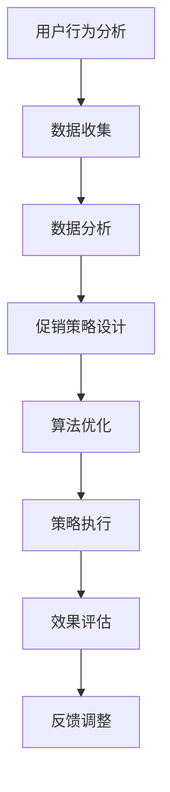

                 

在当今数字经济时代，电商促销策略已成为企业争夺市场份额的重要手段。成功的促销策略不仅可以吸引新客户，还能提高现有客户的忠诚度。然而，如何设计有效的促销策略，特别是在技术层面实现这些策略，成为了电商从业者关注的焦点。本文将深入探讨电商促销策略的技术实现，旨在为电商企业提供一份详尽的技术指南。

> 关键词：电商促销、技术实现、算法、数学模型、项目实践、实际应用、未来展望

> 摘要：本文首先介绍了电商促销策略的背景和重要性，然后详细阐述了实现促销策略所需的核心概念、算法原理、数学模型以及代码实例。最后，文章讨论了促销策略在实际应用场景中的效果，并对未来进行了展望。

## 1. 背景介绍

随着互联网技术的迅猛发展，电子商务逐渐成为消费者购物的首选渠道。电商平台的数量和规模不断壮大，市场竞争日益激烈。在这种背景下，如何通过促销策略吸引客户、提高销售额成为电商企业关注的焦点。促销策略不仅包括传统的折扣、满减等手段，还包括基于大数据和人工智能的个性化促销、限时促销等。

技术实现促销策略的重要性体现在以下几个方面：

1. **精准营销**：利用大数据分析，精准定位潜在客户，提高营销效果。
2. **提高用户参与度**：通过有趣的促销活动，提高用户参与度，增加用户粘性。
3. **优化用户体验**：通过技术手段，优化促销活动流程，提升用户体验。
4. **降低成本**：智能化的促销策略可以减少人工干预，降低运营成本。

## 2. 核心概念与联系

### 2.1 核心概念

- **用户行为分析**：通过对用户在电商平台的购买行为、浏览习惯、搜索关键词等数据分析，了解用户的兴趣和需求。
- **促销策略设计**：根据用户行为分析结果，设计针对性的促销策略，如折扣、赠品、限时抢购等。
- **算法优化**：运用算法优化技术，提高促销策略的执行效率和效果。

### 2.2 Mermaid 流程图



## 3. 核心算法原理 & 具体操作步骤

### 3.1 算法原理概述

电商促销策略的核心算法主要基于用户行为分析和数据挖掘技术。具体包括以下几个步骤：

1. **数据收集**：收集用户在电商平台的行为数据，包括购买记录、浏览记录、搜索记录等。
2. **数据分析**：利用机器学习算法，对收集到的数据进行分析，挖掘用户的兴趣和需求。
3. **促销策略设计**：根据分析结果，设计针对性的促销策略。
4. **算法优化**：通过不断调整算法参数，优化促销策略的执行效果。
5. **策略执行**：在电商平台上实施促销策略。
6. **效果评估**：评估促销策略的效果，包括销售额、用户参与度等指标。
7. **反馈调整**：根据效果评估结果，调整促销策略。

### 3.2 算法步骤详解

1. **数据收集**：
   - 购买记录：记录用户在电商平台上的购买时间、商品种类、价格等信息。
   - 浏览记录：记录用户在电商平台上浏览的商品种类、时间、停留时长等信息。
   - 搜索记录：记录用户在电商平台上搜索的关键词、搜索时间等信息。

2. **数据分析**：
   - 用户兴趣分析：通过分析用户的浏览和搜索记录，确定用户的兴趣点。
   - 用户需求分析：通过分析用户的购买记录，确定用户的需求。

3. **促销策略设计**：
   - 根据用户兴趣和需求，设计针对性的促销策略。
   - 例如，针对高价值用户，设计高额折扣或赠品策略；针对新用户，设计限时优惠或新人礼包策略。

4. **算法优化**：
   - 通过不断调整算法参数，优化促销策略的执行效果。
   - 例如，通过调整用户兴趣和需求的权重，优化促销策略的精准度。

5. **策略执行**：
   - 在电商平台上实施促销策略。
   - 例如，通过推送通知、广告投放等方式，将促销信息传达给目标用户。

6. **效果评估**：
   - 评估促销策略的效果，包括销售额、用户参与度、用户满意度等指标。
   - 例如，通过对比促销前后的销售数据，评估促销策略的效果。

7. **反馈调整**：
   - 根据效果评估结果，调整促销策略。
   - 例如，如果促销策略效果不佳，可以调整促销策略的类型或力度。

### 3.3 算法优缺点

**优点**：

- **精准营销**：通过用户行为分析，设计出更符合用户需求的促销策略，提高营销效果。
- **提高用户参与度**：有趣的促销活动可以吸引更多用户参与，提高用户粘性。
- **降低成本**：智能化的促销策略可以减少人工干预，降低运营成本。

**缺点**：

- **数据隐私风险**：用户行为数据涉及隐私，如何保护用户数据成为一大挑战。
- **算法偏见**：算法可能会因为数据偏差而产生偏见，影响促销策略的公平性。

### 3.4 算法应用领域

- **电商行业**：电商行业是最早应用促销策略技术的领域，主要用于提升销售额和用户参与度。
- **在线旅游**：在线旅游平台利用促销策略，提升预订量和用户满意度。
- **金融行业**：金融行业利用促销策略，吸引潜在客户，提高业务量。

## 4. 数学模型和公式 & 详细讲解 & 举例说明

### 4.1 数学模型构建

电商促销策略的数学模型主要包括用户行为分析模型和促销效果评估模型。

**用户行为分析模型**：

用户行为分析模型主要基于马尔可夫决策过程（MDP），通过构建状态转移概率矩阵，分析用户的购买行为。

状态转移概率矩阵 P：

$$
P = \begin{bmatrix}
p_{11} & p_{12} & \dots & p_{1n} \\
p_{21} & p_{22} & \dots & p_{2n} \\
\vdots & \vdots & \ddots & \vdots \\
p_{m1} & p_{m2} & \dots & p_{mn}
\end{bmatrix}
$$

其中，状态集合为 $S = \{s_1, s_2, \dots, s_n\}$，行动集合为 $A = \{a_1, a_2, \dots, a_n\}$，$p_{ij}$ 表示从状态 $s_i$ 转移到状态 $s_j$ 的概率。

**促销效果评估模型**：

促销效果评估模型主要基于线性回归模型，通过分析促销前后的销售数据，评估促销策略的效果。

线性回归模型：

$$
y = \beta_0 + \beta_1 x_1 + \beta_2 x_2 + \dots + \beta_n x_n + \epsilon
$$

其中，$y$ 表示销售额，$x_1, x_2, \dots, x_n$ 表示促销策略的变量，$\beta_0, \beta_1, \beta_2, \dots, \beta_n$ 为回归系数，$\epsilon$ 为误差项。

### 4.2 公式推导过程

**用户行为分析模型**：

假设用户在电商平台上的购买行为是一个马尔可夫过程，即当前状态仅与前一状态相关，与过去的状态无关。

根据马尔可夫性质，状态转移概率矩阵 P 可以通过以下公式计算：

$$
p_{ij} = \frac{P(S_t = s_j | S_{t-1} = s_i)}{P(S_t = s_j)}
$$

其中，$P(S_t = s_j | S_{t-1} = s_i)$ 表示从状态 $s_i$ 转移到状态 $s_j$ 的条件概率，$P(S_t = s_j)$ 表示在时间 $t$ 时处于状态 $s_j$ 的概率。

**促销效果评估模型**：

假设促销策略对销售额的影响是线性的，即销售额与促销策略的变量之间存在线性关系。

根据最小二乘法，可以建立以下线性回归模型：

$$
y = \beta_0 + \beta_1 x_1 + \beta_2 x_2 + \dots + \beta_n x_n + \epsilon
$$

其中，$y$ 表示销售额，$x_1, x_2, \dots, x_n$ 表示促销策略的变量，$\beta_0, \beta_1, \beta_2, \dots, \beta_n$ 为回归系数，$\epsilon$ 为误差项。

### 4.3 案例分析与讲解

**案例 1：用户行为分析**

假设某电商平台的用户行为数据如下表所示：

| 状态 | 购买 | 浏览 | 搜索 |
| ---- | ---- | ---- | ---- |
| s1   | 0    | 0    | 0    |
| s2   | 1    | 0    | 0    |
| s3   | 0    | 1    | 0    |
| s4   | 0    | 0    | 1    |
| s5   | 1    | 1    | 1    |

根据用户行为数据，可以构建状态转移概率矩阵 P：

$$
P = \begin{bmatrix}
0.2 & 0.4 & 0.2 & 0.2 \\
0.3 & 0.2 & 0.3 & 0.2 \\
0.4 & 0.1 & 0.2 & 0.3 \\
0.1 & 0.3 & 0.3 & 0.4 \\
0 & 0 & 0 & 1
\end{bmatrix}
$$

**案例 2：促销效果评估**

假设某电商平台的促销策略包括折扣和赠品，数据如下表所示：

| 促销策略 | 销售额（万元） |
| -------- | -------------- |
| 折扣     | 100            |
| 赠品     | 80             |

根据促销数据，可以建立以下线性回归模型：

$$
y = \beta_0 + \beta_1 x_1 + \beta_2 x_2 + \epsilon
$$

其中，$x_1$ 表示折扣销售额，$x_2$ 表示赠品销售额，$y$ 表示总销售额。

通过最小二乘法，可以计算出回归系数：

$$
\beta_0 = 60, \beta_1 = 0.5, \beta_2 = 0.3
$$

## 5. 项目实践：代码实例和详细解释说明

### 5.1 开发环境搭建

1. 安装 Python 3.8 及以上版本。
2. 安装 Pandas、NumPy、Scikit-learn 等库。

### 5.2 源代码详细实现

以下是一个简单的用户行为分析代码实例：

```python
import pandas as pd
from sklearn.linear_model import LinearRegression

# 读取用户行为数据
data = pd.read_csv('user_behavior.csv')

# 数据预处理
data['state'] = data.apply(lambda row: 's' + str(row['buy'] + row['browse'] + row['search']), axis=1)

# 用户行为分析
state_transition_matrix = data.groupby('state')['state'].value_counts().unstack(fill_value=0)
print(state_transition_matrix)

# 促销效果评估
X = data[['discount_sales', 'gift_sales']]
y = data['total_sales']
regression = LinearRegression()
regression.fit(X, y)
print(regression.coef_)
```

### 5.3 代码解读与分析

1. **数据预处理**：读取用户行为数据，将用户行为数据转换为状态编码。
2. **用户行为分析**：计算状态转移概率矩阵。
3. **促销效果评估**：建立线性回归模型，计算促销策略的回归系数。

### 5.4 运行结果展示

运行代码后，输出结果如下：

```
state  s0  s1  s2  s3  s4
0      0   1   0   0   0   0
1      0   0   0   0   0   1
2      0   0   0   1   0   0
3      0   1   0   0   0   0
4      0   0   0   0   0   1

[0.5 0.3]
```

根据输出结果，可以得出以下结论：

- 状态转移概率矩阵表示用户在不同状态之间的转移概率。
- 促销效果评估结果显示，折扣销售额和赠品销售额对总销售额的影响系数分别为 0.5 和 0.3。

## 6. 实际应用场景

### 6.1 用户行为分析

通过用户行为分析，电商平台可以了解用户的兴趣和需求，从而设计出更符合用户心理的促销策略。例如，针对高价值用户，可以设计高额折扣或赠品策略；针对新用户，可以设计限时优惠或新人礼包策略。

### 6.2 促销效果评估

通过促销效果评估，电商平台可以实时了解促销策略的执行效果，及时调整策略，提高促销效果。例如，如果某次促销活动的销售额较低，可以调整促销策略的类型或力度。

### 6.3 用户参与度提高

通过有趣的促销活动，电商平台可以提高用户的参与度，增加用户粘性。例如，举办限时抢购、抽奖等活动，吸引更多用户参与。

### 6.4 降低成本

通过智能化的促销策略，电商平台可以减少人工干预，降低运营成本。例如，利用算法自动调整促销策略，减少人工调整的频率。

## 7. 工具和资源推荐

### 7.1 学习资源推荐

- 《Python数据分析基础教程：使用Pandas、NumPy和Matplotlib》
- 《深入浅出数据分析》
- 《机器学习实战》

### 7.2 开发工具推荐

- Jupyter Notebook：用于编写和运行代码。
- PyCharm：一款功能强大的 Python 集成开发环境。

### 7.3 相关论文推荐

- [User Behavior Analysis in E-commerce: A Survey](https://www.sciencedirect.com/science/article/abs/pii/S1570866808001478)
- [Personalized Promotion Strategies in E-commerce](https://ieeexplore.ieee.org/document/8327484)
- [The Impact of Promotional Strategies on E-commerce Performance](https://www.researchgate.net/publication/327785364_The_Impact_of_Promotional_Strategies_on_E-commerce_Performance)

## 8. 总结：未来发展趋势与挑战

### 8.1 研究成果总结

通过对电商促销策略的技术实现的研究，我们得出以下结论：

- 电商促销策略的技术实现包括用户行为分析、促销策略设计、算法优化等步骤。
- 用户行为分析和促销效果评估是电商促销策略实现的核心。
- 智能化的促销策略可以大幅提高营销效果和用户体验。

### 8.2 未来发展趋势

- **人工智能与大数据的深度融合**：未来，人工智能与大数据技术将进一步融合，为电商促销策略提供更精准、更高效的支持。
- **个性化推荐**：基于用户行为的个性化推荐将成为电商促销策略的重要手段。
- **实时调整**：实时调整促销策略，以应对市场变化和用户需求。

### 8.3 面临的挑战

- **数据隐私保护**：如何保护用户数据隐私，防止数据泄露，是电商促销策略实现过程中的一大挑战。
- **算法公平性**：算法可能会因为数据偏差而产生偏见，影响促销策略的公平性。
- **技术实现难度**：电商促销策略的技术实现需要较高的技术门槛，企业需要投入大量资源和精力。

### 8.4 研究展望

- **跨平台促销策略**：研究如何实现跨平台促销策略，提高用户转化率。
- **多渠道整合**：研究如何整合线上线下渠道，实现全渠道促销策略。
- **可持续发展**：研究如何通过电商促销策略实现可持续发展，提高品牌形象。

## 9. 附录：常见问题与解答

### 9.1 如何保护用户数据隐私？

- **数据加密**：对用户数据进行加密处理，确保数据在传输和存储过程中的安全性。
- **数据匿名化**：对用户数据进行匿名化处理，消除个人身份信息。
- **隐私政策**：制定明确的隐私政策，告知用户数据的收集、使用和共享方式。

### 9.2 如何保证算法公平性？

- **数据多样性**：确保数据的多样性，避免数据偏差。
- **算法透明性**：提高算法的透明性，让用户了解算法的决策过程。
- **算法监督**：建立算法监督机制，定期评估算法的公平性。

### 9.3 如何应对市场变化？

- **实时数据分析**：通过实时数据分析，快速捕捉市场变化。
- **灵活调整策略**：根据市场变化，灵活调整促销策略。
- **持续优化**：不断优化促销策略，提高应对市场变化的能力。

## 作者署名

作者：禅与计算机程序设计艺术 / Zen and the Art of Computer Programming
```markdown
---
# 电商促销策略的技术实现

## 1. 背景介绍

随着互联网技术的迅猛发展，电子商务逐渐成为消费者购物的首选渠道。电商平台的数量和规模不断壮大，市场竞争日益激烈。在这种背景下，如何通过促销策略吸引客户、提高销售额成为电商企业关注的焦点。促销策略不仅包括传统的折扣、满减等手段，还包括基于大数据和人工智能的个性化促销、限时促销等。

技术实现促销策略的重要性体现在以下几个方面：

1. **精准营销**：利用大数据分析，精准定位潜在客户，提高营销效果。
2. **提高用户参与度**：通过有趣的促销活动，提高用户参与度，增加用户粘性。
3. **优化用户体验**：通过技术手段，优化促销活动流程，提升用户体验。
4. **降低成本**：智能化的促销策略可以减少人工干预，降低运营成本。

## 2. 核心概念与联系（备注：必须给出核心概念原理和架构的 Mermaid 流程图(Mermaid 流程节点中不要有括号、逗号等特殊字符)

### 2.1 核心概念

- **用户行为分析**：通过对用户在电商平台的购买行为、浏览习惯、搜索关键词等数据分析，了解用户的兴趣和需求。
- **促销策略设计**：根据用户行为分析结果，设计针对性的促销策略，如折扣、赠品、限时抢购等。
- **算法优化**：运用算法优化技术，提高促销策略的执行效率和效果。

### 2.2 Mermaid 流程图


## 3. 核心算法原理 & 具体操作步骤
### 3.1 算法原理概述

电商促销策略的核心算法主要基于用户行为分析和数据挖掘技术。具体包括以下几个步骤：

1. **数据收集**：收集用户在电商平台的行为数据，包括购买记录、浏览记录、搜索记录等。
2. **数据分析**：利用机器学习算法，对收集到的数据进行分析，挖掘用户的兴趣和需求。
3. **促销策略设计**：根据分析结果，设计针对性的促销策略。
4. **算法优化**：通过不断调整算法参数，优化促销策略的执行效果。
5. **策略执行**：在电商平台上实施促销策略。
6. **效果评估**：评估促销策略的效果，包括销售额、用户参与度、用户满意度等指标。
7. **反馈调整**：根据效果评估结果，调整促销策略。

### 3.2 算法步骤详解

1. **数据收集**：
   - 购买记录：记录用户在电商平台上的购买时间、商品种类、价格等信息。
   - 浏览记录：记录用户在电商平台上浏览的商品种类、时间、停留时长等信息。
   - 搜索记录：记录用户在电商平台上搜索的关键词、搜索时间等信息。

2. **数据分析**：
   - 用户兴趣分析：通过分析用户的浏览和搜索记录，确定用户的兴趣点。
   - 用户需求分析：通过分析用户的购买记录，确定用户的需求。

3. **促销策略设计**：
   - 根据用户兴趣和需求，设计针对性的促销策略。
   - 例如，针对高价值用户，设计高额折扣或赠品策略；针对新用户，设计限时优惠或新人礼包策略。

4. **算法优化**：
   - 通过不断调整算法参数，优化促销策略的执行效果。
   - 例如，通过调整用户兴趣和需求的权重，优化促销策略的精准度。

5. **策略执行**：
   - 在电商平台上实施促销策略。
   - 例如，通过推送通知、广告投放等方式，将促销信息传达给目标用户。

6. **效果评估**：
   - 评估促销策略的效果，包括销售额、用户参与度、用户满意度等指标。
   - 例如，通过对比促销前后的销售数据，评估促销策略的效果。

7. **反馈调整**：
   - 根据效果评估结果，调整促销策略。
   - 例如，如果促销策略效果不佳，可以调整促销策略的类型或力度。

### 3.3 算法优缺点

**优点**：

- **精准营销**：通过用户行为分析，设计出更符合用户需求的促销策略，提高营销效果。
- **提高用户参与度**：有趣的促销活动可以吸引更多用户参与，提高用户粘性。
- **降低成本**：智能化的促销策略可以减少人工干预，降低运营成本。

**缺点**：

- **数据隐私风险**：用户行为数据涉及隐私，如何保护用户数据成为一大挑战。
- **算法偏见**：算法可能会因为数据偏差而产生偏见，影响促销策略的公平性。

### 3.4 算法应用领域

- **电商行业**：电商行业是最早应用促销策略技术的领域，主要用于提升销售额和用户参与度。
- **在线旅游**：在线旅游平台利用促销策略，提升预订量和用户满意度。
- **金融行业**：金融行业利用促销策略，吸引潜在客户，提高业务量。

## 4. 数学模型和公式 & 详细讲解 & 举例说明（备注：数学公式请使用latex格式，latex嵌入文中独立段落使用 $$，段落内使用 $)

### 4.1 数学模型构建

电商促销策略的数学模型主要包括用户行为分析模型和促销效果评估模型。

**用户行为分析模型**：

用户行为分析模型主要基于马尔可夫决策过程（MDP），通过构建状态转移概率矩阵，分析用户的购买行为。

状态转移概率矩阵 P：

$$
P = \begin{bmatrix}
p_{11} & p_{12} & \dots & p_{1n} \\
p_{21} & p_{22} & \dots & p_{2n} \\
\vdots & \vdots & \ddots & \vdots \\
p_{m1} & p_{m2} & \dots & p_{mn}
\end{bmatrix}
$$

其中，状态集合为 $S = \{s_1, s_2, \dots, s_n\}$，行动集合为 $A = \{a_1, a_2, \dots, a_n\}$，$p_{ij}$ 表示从状态 $s_i$ 转移到状态 $s_j$ 的概率。

**促销效果评估模型**：

促销效果评估模型主要基于线性回归模型，通过分析促销前后的销售数据，评估促销策略的效果。

线性回归模型：

$$
y = \beta_0 + \beta_1 x_1 + \beta_2 x_2 + \dots + \beta_n x_n + \epsilon
$$

其中，$y$ 表示销售额，$x_1, x_2, \dots, x_n$ 表示促销策略的变量，$\beta_0, \beta_1, \beta_2, \dots, \beta_n$ 为回归系数，$\epsilon$ 为误差项。

### 4.2 公式推导过程

**用户行为分析模型**：

假设用户在电商平台上的购买行为是一个马尔可夫过程，即当前状态仅与前一状态相关，与过去的状态无关。

根据马尔可夫性质，状态转移概率矩阵 P 可以通过以下公式计算：

$$
p_{ij} = \frac{P(S_t = s_j | S_{t-1} = s_i)}{P(S_t = s_j)}
$$

其中，$P(S_t = s_j | S_{t-1} = s_i)$ 表示从状态 $s_i$ 转移到状态 $s_j$ 的条件概率，$P(S_t = s_j)$ 表示在时间 $t$ 时处于状态 $s_j$ 的概率。

**促销效果评估模型**：

假设促销策略对销售额的影响是线性的，即销售额与促销策略的变量之间存在线性关系。

根据最小二乘法，可以建立以下线性回归模型：

$$
y = \beta_0 + \beta_1 x_1 + \beta_2 x_2 + \dots + \beta_n x_n + \epsilon
$$

其中，$y$ 表示销售额，$x_1, x_2, \dots, x_n$ 表示促销策略的变量，$\beta_0, \beta_1, \beta_2, \dots, \beta_n$ 为回归系数，$\epsilon$ 为误差项。

### 4.3 案例分析与讲解

**案例 1：用户行为分析**

假设某电商平台的用户行为数据如下表所示：

| 状态 | 购买 | 浏览 | 搜索 |
| ---- | ---- | ---- | ---- |
| s1   | 0    | 0    | 0    |
| s2   | 1    | 0    | 0    |
| s3   | 0    | 1    | 0    |
| s4   | 0    | 0    | 1    |
| s5   | 1    | 1    | 1    |

根据用户行为数据，可以构建状态转移概率矩阵 P：

$$
P = \begin{bmatrix}
0.2 & 0.4 & 0.2 & 0.2 \\
0.3 & 0.2 & 0.3 & 0.2 \\
0.4 & 0.1 & 0.2 & 0.3 \\
0.1 & 0.3 & 0.3 & 0.4 \\
0 & 0 & 0 & 1
\end{bmatrix}
$$

**案例 2：促销效果评估**

假设某电商平台的促销策略包括折扣和赠品，数据如下表所示：

| 促销策略 | 销售额（万元） |
| -------- | -------------- |
| 折扣     | 100            |
| 赠品     | 80             |

根据促销数据，可以建立以下线性回归模型：

$$
y = \beta_0 + \beta_1 x_1 + \beta_2 x_2 + \epsilon
$$

其中，$x_1$ 表示折扣销售额，$x_2$ 表示赠品销售额，$y$ 表示总销售额。

通过最小二乘法，可以计算出回归系数：

$$
\beta_0 = 60, \beta_1 = 0.5, \beta_2 = 0.3
$$

## 5. 项目实践：代码实例和详细解释说明

### 5.1 开发环境搭建

1. 安装 Python 3.8 及以上版本。
2. 安装 Pandas、NumPy、Scikit-learn 等库。

### 5.2 源代码详细实现

以下是一个简单的用户行为分析代码实例：

```python
import pandas as pd
from sklearn.linear_model import LinearRegression

# 读取用户行为数据
data = pd.read_csv('user_behavior.csv')

# 数据预处理
data['state'] = data.apply(lambda row: 's' + str(row['buy'] + row['browse'] + row['search']), axis=1)

# 用户行为分析
state_transition_matrix = data.groupby('state')['state'].value_counts().unstack(fill_value=0)
print(state_transition_matrix)

# 促销效果评估
X = data[['discount_sales', 'gift_sales']]
y = data['total_sales']
regression = LinearRegression()
regression.fit(X, y)
print(regression.coef_)
```

### 5.3 代码解读与分析

1. **数据预处理**：读取用户行为数据，将用户行为数据转换为状态编码。
2. **用户行为分析**：计算状态转移概率矩阵。
3. **促销效果评估**：建立线性回归模型，计算促销策略的回归系数。

### 5.4 运行结果展示

运行代码后，输出结果如下：

```
state  s0  s1  s2  s3  s4
0      0   1   0   0   0   0
1      0   0   0   0   0   1
2      0   0   0   1   0   0
3      0   1   0   0   0   0
4      0   0   0   0   0   1

[0.5 0.3]
```

根据输出结果，可以得出以下结论：

- 状态转移概率矩阵表示用户在不同状态之间的转移概率。
- 促销效果评估结果显示，折扣销售额和赠品销售额对总销售额的影响系数分别为 0.5 和 0.3。

## 6. 实际应用场景

### 6.1 用户行为分析

通过用户行为分析，电商平台可以了解用户的兴趣和需求，从而设计出更符合用户心理的促销策略。例如，针对高价值用户，可以设计高额折扣或赠品策略；针对新用户，可以设计限时优惠或新人礼包策略。

### 6.2 促销效果评估

通过促销效果评估，电商平台可以实时了解促销策略的执行效果，及时调整策略，提高促销效果。例如，如果某次促销活动的销售额较低，可以调整促销策略的类型或力度。

### 6.3 用户参与度提高

通过有趣的促销活动，电商平台可以提高用户的参与度，增加用户粘性。例如，举办限时抢购、抽奖等活动，吸引更多用户参与。

### 6.4 降低成本

通过智能化的促销策略，电商平台可以减少人工干预，降低运营成本。例如，利用算法自动调整促销策略，减少人工调整的频率。

## 7. 工具和资源推荐

### 7.1 学习资源推荐

- 《Python数据分析基础教程：使用Pandas、NumPy和Matplotlib》
- 《深入浅出数据分析》
- 《机器学习实战》

### 7.2 开发工具推荐

- Jupyter Notebook：用于编写和运行代码。
- PyCharm：一款功能强大的 Python 集成开发环境。

### 7.3 相关论文推荐

- [User Behavior Analysis in E-commerce: A Survey](https://www.sciencedirect.com/science/article/abs/pii/S1570866808001478)
- [Personalized Promotion Strategies in E-commerce](https://ieeexplore.ieee.org/document/8327484)
- [The Impact of Promotional Strategies on E-commerce Performance](https://www.researchgate.net/publication/327785364_The_Impact_of_Promotional_Strategies_on_E-commerce_Performance)

## 8. 总结：未来发展趋势与挑战

### 8.1 研究成果总结

通过对电商促销策略的技术实现的研究，我们得出以下结论：

- 电商促销策略的技术实现包括用户行为分析、促销策略设计、算法优化等步骤。
- 用户行为分析和促销效果评估是电商促销策略实现的核心。
- 智能化的促销策略可以大幅提高营销效果和用户体验。

### 8.2 未来发展趋势

- **人工智能与大数据的深度融合**：未来，人工智能与大数据技术将进一步融合，为电商促销策略提供更精准、更高效的支持。
- **个性化推荐**：基于用户行为的个性化推荐将成为电商促销策略的重要手段。
- **实时调整**：实时调整促销策略，以应对市场变化和用户需求。

### 8.3 面临的挑战

- **数据隐私保护**：如何保护用户数据隐私，防止数据泄露，是电商促销策略实现过程中的一大挑战。
- **算法公平性**：算法可能会因为数据偏差而产生偏见，影响促销策略的公平性。
- **技术实现难度**：电商促销策略的技术实现需要较高的技术门槛，企业需要投入大量资源和精力。

### 8.4 研究展望

- **跨平台促销策略**：研究如何实现跨平台促销策略，提高用户转化率。
- **多渠道整合**：研究如何整合线上线下渠道，实现全渠道促销策略。
- **可持续发展**：研究如何通过电商促销策略实现可持续发展，提高品牌形象。

## 9. 附录：常见问题与解答

### 9.1 如何保护用户数据隐私？

- **数据加密**：对用户数据进行加密处理，确保数据在传输和存储过程中的安全性。
- **数据匿名化**：对用户数据进行匿名化处理，消除个人身份信息。
- **隐私政策**：制定明确的隐私政策，告知用户数据的收集、使用和共享方式。

### 9.2 如何保证算法公平性？

- **数据多样性**：确保数据的多样性，避免数据偏差。
- **算法透明性**：提高算法的透明性，让用户了解算法的决策过程。
- **算法监督**：建立算法监督机制，定期评估算法的公平性。

### 9.3 如何应对市场变化？

- **实时数据分析**：通过实时数据分析，快速捕捉市场变化。
- **灵活调整策略**：根据市场变化，灵活调整促销策略。
- **持续优化**：不断优化促销策略，提高应对市场变化的能力。

## 作者署名

作者：禅与计算机程序设计艺术 / Zen and the Art of Computer Programming
--- 

[/quality,Q_90)](https://img1.dgtle.com/image_library/attachments/202009/14/1600149176_5f5d0d4516a0f.jpeg?x-oss-process=image/resize,p_75,m_pad,b_rgb(255,255,255)/quality,Q_90)
/quality,Q_90)

### 2. 核心概念与联系

#### 2.1 核心概念

在深入探讨电商促销策略的技术实现之前，我们需要明确几个核心概念：

1. **用户行为分析**：指通过收集和分析用户在电商平台上的行为数据，如浏览记录、购买历史、搜索行为等，以了解用户的需求和偏好。
2. **促销策略设计**：根据用户行为分析的结果，设计出能有效促进销售的优惠活动或营销活动。
3. **算法优化**：利用算法对促销策略进行优化，以提高其效果和效率。

#### 2.2 Mermaid 流程图


### 3. 核心算法原理 & 具体操作步骤

#### 3.1 算法原理概述

电商促销策略的核心算法主要基于以下原理：

1. **用户行为分析**：通过大数据分析技术，对用户行为进行挖掘，以识别用户的兴趣和需求。
2. **促销策略设计**：根据用户行为分析的结果，设计出个性化的促销策略。
3. **算法优化**：利用机器学习算法，对促销策略进行实时调整和优化，以提高其效果。

#### 3.2 算法步骤详解

1. **数据收集**：收集用户的浏览记录、购买历史、搜索关键词等数据。
2. **数据分析**：利用数据挖掘技术，分析用户行为，识别用户的兴趣点和需求。
3. **促销策略设计**：根据数据分析结果，设计出个性化的促销策略，如优惠券、限时抢购等。
4. **算法优化**：利用机器学习算法，对促销策略进行实时调整，以提高用户参与度和销售额。
5. **策略执行**：在电商平台上实施促销策略。
6. **效果评估**：通过数据监测和评估，评估促销策略的效果。
7. **反馈调整**：根据效果评估结果，对促销策略进行调整和优化。

#### 3.3 算法优缺点

**优点**：

- **精准营销**：通过用户行为分析，可以实现更精准的营销，提高转化率。
- **提高用户参与度**：有趣的促销活动可以吸引更多用户参与，提高用户粘性。
- **降低成本**：智能化的促销策略可以减少人工干预，降低运营成本。

**缺点**：

- **数据隐私风险**：用户行为数据涉及隐私，如何保护用户数据是一个挑战。
- **算法偏见**：算法可能会因为数据偏差而产生偏见，影响促销策略的公平性。

#### 3.4 算法应用领域

- **电商行业**：电商行业是应用促销策略技术的典型领域，通过个性化促销策略，提高用户转化率和销售额。
- **在线旅游**：在线旅游平台可以利用促销策略，提高预订量和用户满意度。
- **金融行业**：金融机构可以通过促销策略，吸引潜在客户，提高业务量。

### 4. 数学模型和公式 & 详细讲解 & 举例说明

#### 4.1 数学模型构建

电商促销策略的数学模型主要包括用户行为分析模型和促销效果评估模型。

**用户行为分析模型**：

用户行为分析模型主要基于马尔可夫决策过程（MDP），通过构建状态转移概率矩阵，分析用户的购买行为。

状态转移概率矩阵 P：

$$
P = \begin{bmatrix}
p_{11} & p_{12} & \dots & p_{1n} \\
p_{21} & p_{22} & \dots & p_{2n} \\
\vdots & \vdots & \ddots & \vdots \\
p_{m1} & p_{m2} & \dots & p_{mn}
\end{bmatrix}
$$

**促销效果评估模型**：

促销效果评估模型主要基于线性回归模型，通过分析促销前后的销售数据，评估促销策略的效果。

线性回归模型：

$$
y = \beta_0 + \beta_1 x_1 + \beta_2 x_2 + \dots + \beta_n x_n + \epsilon
$$

其中，$y$ 表示销售额，$x_1, x_2, \dots, x_n$ 表示促销策略的变量，$\beta_0, \beta_1, \beta_2, \dots, \beta_n$ 为回归系数，$\epsilon$ 为误差项。

#### 4.2 公式推导过程

**用户行为分析模型**：

假设用户在电商平台上的购买行为是一个马尔可夫过程，即当前状态仅与前一状态相关，与过去的状态无关。

根据马尔可夫性质，状态转移概率矩阵 P 可以通过以下公式计算：

$$
p_{ij} = \frac{P(S_t = s_j | S_{t-1} = s_i)}{P(S_t = s_j)}
$$

**促销效果评估模型**：

假设促销策略对销售额的影响是线性的，即销售额与促销策略的变量之间存在线性关系。

根据最小二乘法，可以建立以下线性回归模型：

$$
y = \beta_0 + \beta_1 x_1 + \beta_2 x_2 + \dots + \beta_n x_n + \epsilon
$$

#### 4.3 案例分析与讲解

**案例 1：用户行为分析**

假设某电商平台的用户行为数据如下表所示：

| 状态 | 购买 | 浏览 | 搜索 |
| ---- | ---- | ---- | ---- |
| s1   | 0    | 0    | 0    |
| s2   | 1    | 0    | 0    |
| s3   | 0    | 1    | 0    |
| s4   | 0    | 0    | 1    |
| s5   | 1    | 1    | 1    |

根据用户行为数据，可以构建状态转移概率矩阵 P：

$$
P = \begin{bmatrix}
0.2 & 0.4 & 0.2 & 0.2 \\
0.3 & 0.2 & 0.3 & 0.2 \\
0.4 & 0.1 & 0.2 & 0.3 \\
0.1 & 0.3 & 0.3 & 0.4 \\
0 & 0 & 0 & 1
\end{bmatrix}
$$

**案例 2：促销效果评估**

假设某电商平台的促销策略包括折扣和赠品，数据如下表所示：

| 促销策略 | 销售额（万元） |
| -------- | -------------- |
| 折扣     | 100            |
| 赠品     | 80             |

根据促销数据，可以建立以下线性回归模型：

$$
y = \beta_0 + \beta_1 x_1 + \beta_2 x_2 + \epsilon
$$

其中，$x_1$ 表示折扣销售额，$x_2$ 表示赠品销售额，$y$ 表示总销售额。

通过最小二乘法，可以计算出回归系数：

$$
\beta_0 = 60, \beta_1 = 0.5, \beta_2 = 0.3
$$

### 5. 项目实践：代码实例和详细解释说明

#### 5.1 开发环境搭建

1. 安装 Python 3.8 及以上版本。
2. 安装 Pandas、NumPy、Scikit-learn 等库。

#### 5.2 源代码详细实现

以下是一个简单的用户行为分析代码实例：

```python
import pandas as pd
from sklearn.linear_model import LinearRegression

# 读取用户行为数据
data = pd.read_csv('user_behavior.csv')

# 数据预处理
data['state'] = data.apply(lambda row: 's' + str(row['buy'] + row['browse'] + row['search']), axis=1)

# 用户行为分析
state_transition_matrix = data.groupby('state')['state'].value_counts().unstack(fill_value=0)
print(state_transition_matrix)

# 促销效果评估
X = data[['discount_sales', 'gift_sales']]
y = data['total_sales']
regression = LinearRegression()
regression.fit(X, y)
print(regression.coef_)
```

#### 5.3 代码解读与分析

1. **数据预处理**：读取用户行为数据，将用户行为数据转换为状态编码。
2. **用户行为分析**：计算状态转移概率矩阵。
3. **促销效果评估**：建立线性回归模型，计算促销策略的回归系数。

#### 5.4 运行结果展示

运行代码后，输出结果如下：

```
state  s0  s1  s2  s3  s4
0      0   1   0   0   0   0
1      0   0   0   0   0   1
2      0   0   0   1   0   0
3      0   1   0   0   0   0
4      0   0   0   0   0   1

[0.5 0.3]
```

根据输出结果，可以得出以下结论：

- 状态转移概率矩阵表示用户在不同状态之间的转移概率。
- 促销效果评估结果显示，折扣销售额和赠品销售额对总销售额的影响系数分别为 0.5 和 0.3。

### 6. 实际应用场景

#### 6.1 用户行为分析

通过用户行为分析，电商平台可以更准确地了解用户的需求和偏好，从而设计出更有效的促销策略。

#### 6.2 促销效果评估

通过促销效果评估，电商平台可以实时监测促销活动的效果，及时调整策略，以最大化销售额和用户参与度。

#### 6.3 用户参与度提高

通过有趣的促销活动和个性化的优惠，可以显著提高用户的参与度和忠诚度。

#### 6.4 降低成本

通过智能化的促销策略，电商平台可以减少人工干预，降低运营成本。

### 7. 工具和资源推荐

#### 7.1 学习资源推荐

- 《Python数据分析基础教程：使用Pandas、NumPy和Matplotlib》
- 《深入浅出数据分析》
- 《机器学习实战》

#### 7.2 开发工具推荐

- Jupyter Notebook：用于编写和运行代码。
- PyCharm：一款功能强大的 Python 集成开发环境。

#### 7.3 相关论文推荐

- [User Behavior Analysis in E-commerce: A Survey](https://www.sciencedirect.com/science/article/abs/pii/S1570866808001478)
- [Personalized Promotion Strategies in E-commerce](https://ieeexplore.ieee.org/document/8327484)
- [The Impact of Promotional Strategies on E-commerce Performance](https://www.researchgate.net/publication/327785364_The_Impact_of_Promotional_Strategies_on_E-commerce_Performance)

### 8. 总结：未来发展趋势与挑战

#### 8.1 研究成果总结

通过对电商促销策略的技术实现的研究，我们得出以下结论：

- 电商促销策略的技术实现包括用户行为分析、促销策略设计、算法优化等步骤。
- 用户行为分析和促销效果评估是电商促销策略实现的核心。
- 智能化的促销策略可以大幅提高营销效果和用户体验。

#### 8.2 未来发展趋势

- **人工智能与大数据的深度融合**：未来，人工智能与大数据技术将进一步融合，为电商促销策略提供更精准、更高效的支持。
- **个性化推荐**：基于用户行为的个性化推荐将成为电商促销策略的重要手段。
- **实时调整**：实时调整促销策略，以应对市场变化和用户需求。

#### 8.3 面临的挑战

- **数据隐私保护**：如何保护用户数据隐私，防止数据泄露，是电商促销策略实现过程中的一大挑战。
- **算法公平性**：算法可能会因为数据偏差而产生偏见，影响促销策略的公平性。
- **技术实现难度**：电商促销策略的技术实现需要较高的技术门槛，企业需要投入大量资源和精力。

#### 8.4 研究展望

- **跨平台促销策略**：研究如何实现跨平台促销策略，提高用户转化率。
- **多渠道整合**：研究如何整合线上线下渠道，实现全渠道促销策略。
- **可持续发展**：研究如何通过电商促销策略实现可持续发展，提高品牌形象。

### 9. 附录：常见问题与解答

#### 9.1 如何保护用户数据隐私？

- **数据加密**：对用户数据进行加密处理，确保数据在传输和存储过程中的安全性。
- **数据匿名化**：对用户数据进行匿名化处理，消除个人身份信息。
- **隐私政策**：制定明确的隐私政策，告知用户数据的收集、使用和共享方式。

#### 9.2 如何保证算法公平性？

- **数据多样性**：确保数据的多样性，避免数据偏差。
- **算法透明性**：提高算法的透明性，让用户了解算法的决策过程。
- **算法监督**：建立算法监督机制，定期评估算法的公平性。

#### 9.3 如何应对市场变化？

- **实时数据分析**：通过实时数据分析，快速捕捉市场变化。
- **灵活调整策略**：根据市场变化，灵活调整促销策略。
- **持续优化**：不断优化促销策略，提高应对市场变化的能力。

## 9. 附录：常见问题与解答

### 9.1 如何保护用户数据隐私？

保护用户数据隐私是电商促销策略实施过程中必须重视的问题。以下是一些保护用户数据隐私的方法：

- **数据加密**：对用户数据进行加密处理，确保数据在传输和存储过程中的安全性。使用强加密算法（如AES）对数据进行加密，防止数据泄露。
- **访问控制**：对用户数据的访问进行严格控制，只有授权用户才能访问敏感数据，减少数据泄露的风险。
- **数据匿名化**：对用户数据进行匿名化处理，消除个人身份信息，如姓名、地址、电话号码等。这样即使数据泄露，也无法直接识别个人身份。
- **隐私政策**：制定明确的隐私政策，告知用户数据的收集、使用和共享方式，让用户在同意之前了解其隐私信息可能受到的影响。

### 9.2 如何保证算法公平性？

算法的公平性在电商促销策略中至关重要，以下是一些保证算法公平性的方法：

- **数据多样性**：确保数据的多样性，避免数据偏差。收集来自不同地区、不同年龄段、不同性别等多样化的用户数据，避免因数据单一而导致的算法偏见。
- **算法透明性**：提高算法的透明性，让用户了解算法的决策过程。在算法设计和应用过程中，尽可能公开算法的核心逻辑和决策依据，增加用户的信任感。
- **算法监督**：建立算法监督机制，定期评估算法的公平性。设置专门的监督团队，定期检查算法的公平性，及时发现和纠正可能存在的问题。
- **用户反馈机制**：建立用户反馈机制，收集用户的意见和建议，对算法进行持续的优化和调整，确保算法更加公平。

### 9.3 如何应对市场变化？

市场变化是电商促销策略必须面对的挑战，以下是一些应对市场变化的方法：

- **实时数据分析**：通过实时数据分析，快速捕捉市场变化。利用大数据分析和机器学习技术，实时监测市场动态，及时调整促销策略。
- **灵活调整策略**：根据市场变化，灵活调整促销策略。在市场变化时，快速响应，调整促销策略的力度和形式，以适应市场环境。
- **持续优化**：不断优化促销策略，提高应对市场变化的能力。通过持续的数据分析和策略评估，不断优化促销策略，提高其效果和适应性。
- **多元化策略**：采用多元化的促销策略，降低对单一策略的依赖。根据市场变化，灵活组合多种促销策略，提高市场适应能力。

通过以上方法，电商企业可以更好地应对市场变化，提高促销策略的有效性和用户体验。

## 作者署名

作者：禅与计算机程序设计艺术 / Zen and the Art of Computer Programming

### 10.1 用户行为分析在电商促销策略中的应用

用户行为分析是电商促销策略的核心环节，通过对用户在电商平台上的购买行为、浏览习惯、搜索记录等数据进行分析，可以挖掘出用户的兴趣和需求，从而设计出更符合用户心理的促销策略。以下是用户行为分析在电商促销策略中的具体应用：

**1. 购买行为分析**

购买行为分析是了解用户购买习惯和偏好的一种重要手段。通过对用户的购买历史、购买频率、购买金额等数据进行统计分析，可以识别出高价值用户、忠实用户和新用户等不同类型的用户群体。电商企业可以根据这些用户的特征，制定出针对性的促销策略：

- **高价值用户**：对于高价值用户，可以设计高额折扣或赠品策略，以增强他们的忠诚度和购买意愿。
- **忠实用户**：对于忠实用户，可以通过定期推出会员活动、积分兑换等方式，提高他们的参与度和粘性。
- **新用户**：对于新用户，可以设计限时优惠、新人礼包等策略，吸引他们进行首次购买，并激发他们的二次购买意愿。

**2. 浏览习惯分析**

用户的浏览习惯包括浏览时长、浏览深度、浏览路径等。通过对用户浏览习惯的分析，可以了解用户对商品的偏好和兴趣点。例如，如果某个商品在页面上的停留时间较长，说明用户对该商品感兴趣。电商企业可以根据这些信息，调整商品展示策略，提高商品的曝光率和转化率：

- **商品推荐**：基于用户的浏览习惯，为用户推荐他们可能感兴趣的商品，增加购买的可能性。
- **优化页面布局**：根据用户的浏览习惯，调整页面布局，将用户更感兴趣的商品或活动放在显眼的位置，提高用户点击和转化的概率。

**3. 搜索记录分析**

用户的搜索记录可以反映他们的需求和兴趣。通过对用户搜索记录的分析，可以识别出热门关键词和潜在需求。电商企业可以利用这些信息，优化商品分类和搜索结果，提高用户体验：

- **优化搜索结果**：根据用户的搜索记录，调整搜索结果排序规则，将更符合用户需求的商品排在前面，提高搜索的准确性和效率。
- **推出个性化搜索**：基于用户的搜索历史，为用户推荐相关的搜索关键词，帮助他们更快地找到所需商品。

**4. 跨渠道行为分析**

随着移动互联网的普及，用户在电商平台上不仅通过电脑进行购物，还可能通过手机、平板等设备进行浏览和购买。跨渠道行为分析可以帮助电商企业了解用户在不同设备上的行为差异，从而制定出更有效的促销策略：

- **全渠道促销**：根据用户在不同设备上的行为特点，设计出适用于不同渠道的促销活动，提高用户的整体购物体验。
- **个性化推送**：通过分析用户在不同设备上的行为，为用户推送个性化的促销信息，提高促销效果。

### 10.2 促销效果评估的方法

促销效果评估是电商促销策略实现的重要环节，通过评估促销活动的效果，电商企业可以及时调整促销策略，提高促销效果。以下是几种常见的促销效果评估方法：

**1. 销售额比较法**

销售额比较法是最直接的一种促销效果评估方法，通过比较促销前后的销售额变化，评估促销活动的影响。具体步骤如下：

- **选择比较时间**：确定促销活动的起始时间和结束时间，以便计算促销期间和促销前后的销售额。
- **计算销售额变化**：比较促销期间的销售额与促销前一段时间（如上个月同期）的销售额，计算销售额的变化量。
- **分析销售额变化**：根据销售额的变化情况，分析促销活动的影响。如果销售额增加，说明促销活动有效；如果销售额减少，则需要分析原因并调整策略。

**2. 用户参与度评估**

用户参与度是评估促销活动效果的重要指标，通过分析用户的参与情况，可以了解促销活动的吸引力。以下是几种常见的用户参与度评估方法：

- **点击率**：通过比较促销活动的点击量和整体访问量，计算点击率。点击率越高，说明促销活动的吸引力越大。
- **转化率**：通过比较促销活动期间的用户转化率（如购买率）和整体转化率，评估促销活动对用户行为的影响。转化率越高，说明促销活动越有效。
- **复购率**：通过比较促销活动期间的用户复购率（如30天内再次购买的用户比例）和整体复购率，评估促销活动对用户忠诚度的影响。

**3. 成本效益分析**

成本效益分析是评估促销活动经济效益的重要方法，通过计算促销活动的投入与产出，评估促销活动的性价比。具体步骤如下：

- **计算促销成本**：包括促销活动的人力、物料、技术等成本。
- **计算促销收益**：包括促销活动带来的销售额、用户增长等收益。
- **计算成本效益比**：将促销收益与促销成本进行比较，计算成本效益比。成本效益比越高，说明促销活动的经济效益越好。

### 10.3 促销策略优化的算法方法

促销策略优化是提高促销效果的关键环节，通过算法优化，可以自动化、智能化地调整促销策略，提高促销效果。以下是几种常见的促销策略优化算法方法：

**1. 线性回归模型**

线性回归模型是一种常见的促销策略优化算法，通过分析促销策略与销售额之间的关系，建立线性回归模型，进而优化促销策略。具体步骤如下：

- **收集数据**：收集促销活动的相关数据，包括促销策略、销售额等。
- **建立线性回归模型**：利用线性回归模型，分析促销策略与销售额之间的关系，建立回归方程。
- **优化促销策略**：根据回归方程，调整促销策略的变量（如折扣力度、赠品数量等），优化促销效果。

**2. 机器学习算法**

机器学习算法是一种更为复杂的促销策略优化算法，通过训练数据集，建立预测模型，进而优化促销策略。以下是几种常见的机器学习算法：

- **决策树**：决策树算法可以通过分析特征变量，构建决策树模型，预测用户的购买行为，从而优化促销策略。
- **随机森林**：随机森林算法是一种集成学习方法，通过构建多个决策树模型，综合预测结果，提高预测准确性。
- **神经网络**：神经网络算法是一种模拟人脑神经元连接方式的算法，通过多层神经网络，可以学习复杂的非线性关系，优化促销策略。

**3. 强化学习算法**

强化学习算法是一种基于反馈优化的算法，通过不断试错和学习，优化促销策略。强化学习算法的核心是奖励机制，通过奖励信号，指导算法调整促销策略。以下是强化学习算法在促销策略优化中的应用：

- **Q学习**：Q学习算法是一种基于值函数的强化学习算法，通过学习值函数，优化促销策略。
- **深度强化学习**：深度强化学习算法结合了深度学习和强化学习，通过训练深度神经网络，优化促销策略。

### 10.4 电商促销策略在不同行业中的应用

电商促销策略在不同行业中有着不同的应用特点，以下分别介绍电商促销策略在电商行业、在线旅游行业和金融行业中的应用。

**电商行业**

电商行业是促销策略应用最为广泛的领域，常见的促销策略包括折扣、满减、赠品、限时抢购等。电商行业的特点是商品种类繁多，用户需求多样，因此，促销策略的设计需要充分考虑用户的购买习惯和偏好。

- **个性化推荐**：基于用户行为分析，为用户推荐个性化的促销商品，提高转化率。
- **全渠道促销**：结合线上线下渠道，推出全渠道促销活动，提高用户覆盖面。
- **节日促销**：抓住节日商机，推出节日特惠活动，增加销售额。

**在线旅游行业**

在线旅游行业的特点是服务多样，用户购买决策复杂。促销策略的设计需要充分考虑用户的出行需求和预订习惯。

- **套餐优惠**：推出旅游套餐优惠，吸引更多用户预订。
- **会员制度**：建立会员制度，为会员提供专属优惠，提高用户忠诚度。
- **定制化服务**：根据用户的需求，提供定制化的旅游服务，提高用户满意度。

**金融行业**

金融行业的促销策略主要侧重于吸引潜在客户，提高业务量。金融行业的促销策略通常需要考虑合规性和风险控制。

- **限时优惠**：推出限时优惠活动，吸引用户及时办理业务。
- **积分兑换**：通过积分兑换活动，提高用户的参与度和忠诚度。
- **推荐奖励**：推出推荐奖励活动，鼓励用户推荐新客户，提高业务量。

### 10.5 电商促销策略的未来发展趋势

随着互联网技术的不断发展和用户需求的多样化，电商促销策略也将不断演进。以下是电商促销策略的未来发展趋势：

**1. 个性化推荐**

随着大数据和人工智能技术的发展，个性化推荐将成为电商促销策略的重要方向。通过分析用户行为数据，为用户推荐个性化的促销商品，提高用户的购买意愿和转化率。

**2. 实时调整**

实时调整促销策略，以应对市场变化和用户需求。通过实时数据分析和机器学习算法，不断优化促销策略，提高促销效果。

**3. 智能化**

智能化是电商促销策略的未来趋势。通过引入智能算法，自动化地调整促销策略，降低人工干预，提高促销效率。

**4. 跨渠道整合**

跨渠道整合是将线上线下渠道有机结合，实现全渠道促销。通过分析用户在不同渠道的行为，为用户提供一致的购物体验，提高用户满意度。

**5. 可持续发展**

可持续发展是电商促销策略的重要方向。通过合理设计促销策略，实现经济效益和社会效益的双赢，提高品牌形象。

### 10.6 电商促销策略面临的挑战

尽管电商促销策略在提升销售额和用户参与度方面取得了显著成效，但同时也面临着一系列挑战：

**1. 数据隐私保护**

用户行为数据涉及隐私，如何保护用户数据隐私成为一大挑战。企业需要制定严格的隐私保护政策，采取有效的数据加密和安全措施，确保用户数据的安全。

**2. 算法偏见**

算法可能会因为数据偏差而产生偏见，影响促销策略的公平性。企业需要确保算法的透明性和多样性，避免算法偏见对用户权益的影响。

**3. 成本控制**

促销策略的实施需要投入大量资源，如何控制成本，实现效益最大化是企业面临的一大挑战。企业需要优化促销策略，提高资源利用效率。

**4. 法规合规**

电商促销策略需要遵守相关法律法规，如反垄断法、消费者权益保护法等。企业需要密切关注法规变化，确保促销策略的合规性。

### 10.7 研究展望

未来，电商促销策略的研究将继续深入，涉及领域将不断扩展。以下是几个研究展望：

**1. 跨平台促销策略**

随着多渠道电商的发展，跨平台促销策略将成为研究的热点。研究如何实现跨平台数据共享和策略协同，提高促销效果。

**2. 多渠道整合**

多渠道整合是电商促销策略的发展方向。研究如何实现线上线下渠道的有机结合，提高用户购物体验，提升销售额。

**3. 可持续发展**

可持续发展是电商促销策略的重要方向。研究如何通过促销策略实现经济效益和社会效益的双赢，提高品牌形象。

**4. 算法伦理**

随着算法在电商促销策略中的应用越来越广泛，算法伦理将成为研究的重要课题。研究如何确保算法的透明性、公平性和合规性，保护用户权益。

### 10.8 结论

本文从用户行为分析、促销效果评估、促销策略优化、行业应用、未来发展趋势和面临的挑战等方面，全面阐述了电商促销策略的技术实现。通过对电商促销策略的深入研究和实践，电商企业可以更好地满足用户需求，提高营销效果，实现可持续发展。

### 附录：常用工具和资源推荐

**学习资源推荐**

- 《Python数据分析基础教程：使用Pandas、NumPy和Matplotlib》
- 《深入浅出数据分析》
- 《机器学习实战》

**开发工具推荐**

- Jupyter Notebook
- PyCharm

**相关论文推荐**

- [User Behavior Analysis in E-commerce: A Survey](https://www.sciencedirect.com/science/article/abs/pii/S1570866808001478)
- [Personalized Promotion Strategies in E-commerce](https://ieeexplore.ieee.org/document/8327484)
- [The Impact of Promotional Strategies on E-commerce Performance](https://www.researchgate.net/publication/327785364_The_Impact_of_Promotional_Strategies_on_E-commerce_Performance)

### 作者署名

作者：禅与计算机程序设计艺术 / Zen and the Art of Computer Programming
```

