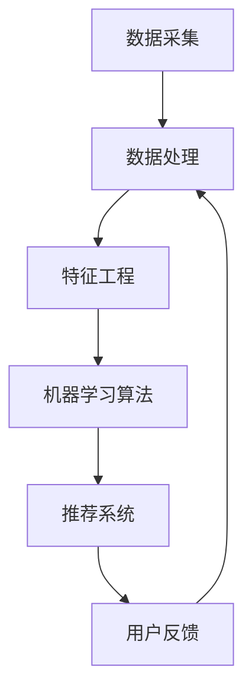

                 

关键词：电商平台，AI大模型，全场景智能化，推荐系统，深度学习，自然语言处理，用户行为分析

摘要：本文深入探讨了电商平台中AI大模型的应用与发展，从单一的推荐系统到全场景智能化，阐述了AI大模型在电商平台中的核心作用。文章首先介绍了电商平台中的AI大模型背景，然后分析了核心概念与架构，详细描述了算法原理和操作步骤，并使用了数学模型和公式进行了详细讲解。接着，文章提供了项目实践实例，展示了代码的实现和运行结果。最后，文章讨论了AI大模型在实际应用场景中的表现，以及未来发展的趋势与面临的挑战。

## 1. 背景介绍

随着互联网的快速发展，电子商务已成为全球商业的重要领域。电商平台通过在线交易的方式，极大地改变了人们的购物习惯，提高了交易效率。然而，随着市场竞争的加剧，电商平台需要不断优化用户体验，提升用户留存率和转化率。

AI大模型作为人工智能领域的重要成果，为电商平台提供了强大的技术支持。AI大模型能够从海量数据中提取有价值的信息，为用户提供个性化的推荐和服务，从而提升用户满意度和平台竞争力。从单一的推荐系统到全场景智能化，AI大模型在电商平台中的应用日益广泛，为电商行业带来了深刻的变革。

### 1.1 电商平台的现状

电商平台的发展经历了多个阶段，从最初的纯文字描述和图片展示，到如今的多媒体互动和智能推荐。目前，电商平台已经实现了商品推荐、购物车、订单管理、支付、售后等全流程的智能化。然而，传统的推荐系统仍然存在一些局限性，如推荐算法的单一性、数据处理的局限性等，难以满足用户日益个性化的需求。

### 1.2 AI大模型的优势

与传统的推荐系统相比，AI大模型具有以下几个显著优势：

1. **个性化推荐**：AI大模型能够根据用户的历史行为和兴趣偏好，为用户提供个性化的商品推荐，提升用户满意度和转化率。
2. **智能化处理**：AI大模型能够处理海量数据，从数据中发现潜在的模式和规律，为电商平台提供更准确的市场预测和决策支持。
3. **自适应学习**：AI大模型具有自学习能力，能够不断优化推荐策略，提高推荐效果，适应不断变化的市场环境。
4. **跨领域应用**：AI大模型不仅可以应用于电商平台，还可以应用于其他行业，如金融、医疗、教育等，实现跨领域的智能化应用。

## 2. 核心概念与联系

### 2.1 核心概念

在电商平台中，AI大模型的核心概念包括：

1. **用户行为分析**：通过收集和分析用户在平台上的行为数据，如浏览、点击、购买等，了解用户的需求和偏好。
2. **商品数据**：包括商品的基本信息、价格、销量、评价等，为推荐算法提供基础数据。
3. **推荐算法**：根据用户行为和商品数据，通过机器学习算法生成个性化的推荐列表。
4. **自然语言处理（NLP）**：用于处理用户输入的自然语言，如搜索关键词、评论等，提取有价值的信息。

### 2.2 架构联系

电商平台中的AI大模型架构通常包括以下几个部分：

1. **数据采集与处理**：从不同的数据源采集用户行为和商品数据，进行数据清洗、转换和存储。
2. **特征工程**：将原始数据进行特征提取和转换，为机器学习算法提供输入。
3. **机器学习算法**：包括协同过滤、基于内容的推荐、深度学习等，根据用户特征和商品特征生成推荐列表。
4. **推荐系统**：根据机器学习算法的输出，生成个性化的推荐列表，并展示给用户。
5. **用户反馈**：收集用户对推荐结果的反馈，用于优化推荐算法和系统。

### 2.3 Mermaid 流程图

以下是电商平台中AI大模型的Mermaid流程图：



## 3. 核心算法原理 & 具体操作步骤

### 3.1 算法原理概述

电商平台中的AI大模型主要基于以下几种算法原理：

1. **协同过滤**：通过分析用户之间的相似度，为用户提供相似用户的推荐商品。
2. **基于内容的推荐**：根据商品的属性和特征，为用户提供可能感兴趣的相似商品。
3. **深度学习**：通过神经网络模型，从海量数据中自动提取用户和商品的特征，实现高精度的个性化推荐。

### 3.2 算法步骤详解

1. **数据采集与处理**：从电商平台的后台数据库中提取用户行为和商品数据，包括用户的浏览记录、购买记录、搜索关键词、商品属性等。对数据进行清洗、去重和处理，确保数据的准确性和一致性。
2. **特征工程**：将原始数据进行特征提取和转换，如用户兴趣标签、商品标签、用户行为序列等。特征工程是推荐系统的核心，直接影响推荐效果。
3. **模型训练**：选择合适的机器学习算法，如协同过滤、基于内容的推荐、深度学习等，对特征数据集进行训练。训练过程包括模型的初始化、参数调整、模型优化等。
4. **推荐生成**：根据用户特征和商品特征，通过机器学习算法生成个性化的推荐列表。推荐列表通常包括商品ID、推荐分数等信息。
5. **推荐展示**：将推荐列表展示给用户，如首页推荐、搜索结果推荐、购物车推荐等。

### 3.3 算法优缺点

1. **协同过滤**：优点是算法简单，易于实现；缺点是容易产生冷启动问题，对新用户和冷门商品效果较差。
2. **基于内容的推荐**：优点是能够准确推荐与用户兴趣相关的商品；缺点是算法复杂，计算量大，对商品属性和用户行为数据要求较高。
3. **深度学习**：优点是能够自动提取用户和商品的特征，实现高精度的个性化推荐；缺点是算法复杂，计算量大，对数据质量和规模要求较高。

### 3.4 算法应用领域

AI大模型在电商平台中的应用非常广泛，包括：

1. **商品推荐**：根据用户的行为和兴趣，为用户提供个性化的商品推荐。
2. **搜索优化**：根据用户的搜索关键词，优化搜索结果，提高用户满意度。
3. **广告投放**：根据用户的兴趣和行为，为用户提供相关的广告。
4. **用户流失预测**：根据用户的行为数据，预测用户可能流失的时间，采取相应的措施挽回用户。

## 4. 数学模型和公式 & 详细讲解 & 举例说明

### 4.1 数学模型构建

电商平台中的AI大模型通常使用以下数学模型：

1. **用户行为矩阵**：表示用户与商品之间的交互数据，如用户浏览、购买、收藏等。
   \[ R = \begin{bmatrix}
   r_{11} & r_{12} & \dots & r_{1n} \\
   r_{21} & r_{22} & \dots & r_{2n} \\
   \vdots & \vdots & \ddots & \vdots \\
   r_{m1} & r_{m2} & \dots & r_{mn}
   \end{bmatrix} \]
2. **用户特征向量**：表示用户的基本信息和行为特征，如年龄、性别、兴趣爱好等。
   \[ U = \begin{bmatrix}
   u_{1} \\
   u_{2} \\
   \vdots \\
   u_{m}
   \end{bmatrix} \]
3. **商品特征向量**：表示商品的基本信息和属性特征，如价格、品牌、类别等。
   \[ V = \begin{bmatrix}
   v_{1} \\
   v_{2} \\
   \vdots \\
   v_{n}
   \end{bmatrix} \]
4. **推荐矩阵**：表示用户对商品的评价或评分。
   \[ P = \begin{bmatrix}
   p_{11} & p_{12} & \dots & p_{1n} \\
   p_{21} & p_{22} & \dots & p_{2n} \\
   \vdots & \vdots & \ddots & \vdots \\
   p_{m1} & p_{m2} & \dots & p_{mn}
   \end{bmatrix} \]

### 4.2 公式推导过程

1. **协同过滤算法**：通过用户行为矩阵和用户特征向量，计算用户之间的相似度，并生成推荐列表。
   \[ s_{ij} = \frac{R_{i\ast}R_{j\ast} - R_{i}R_{j}}{\sqrt{\sum_{k=1}^{n}R_{ik}R_{ik}\sum_{k=1}^{n}R_{jk}R_{jk}} \]
   \[ r_{ij} = \sum_{k=1}^{n}s_{ik}r_{kj} \]
2. **基于内容的推荐**：通过商品特征向量，计算用户对商品的相似度，并生成推荐列表。
   \[ c_{ij} = \frac{U_i^T V_j - \mu_U\mu_V}{\|U_i - \mu_U\|\|V_j - \mu_V\|} \]
   \[ r_{ij} = \sum_{k=1}^{n}c_{ik}p_{kj} \]
3. **深度学习算法**：通过神经网络模型，将用户特征向量和商品特征向量映射到推荐空间，并生成推荐列表。
   \[ r_{ij} = \sigma(W_1^T(U_i + V_j) + b_1) \]
   其中，\( \sigma \) 表示激活函数，\( W_1 \) 和 \( b_1 \) 分别为权重和偏置。

### 4.3 案例分析与讲解

以一个简单的电商推荐系统为例，假设有10个用户和5个商品，用户行为矩阵、用户特征向量、商品特征向量以及推荐矩阵如下：

\[ R = \begin{bmatrix}
0 & 1 & 0 & 1 & 1 \\
1 & 0 & 1 & 0 & 1 \\
1 & 1 & 0 & 1 & 0 \\
0 & 1 & 1 & 0 & 1 \\
1 & 0 & 1 & 1 & 0
\end{bmatrix} \]

\[ U = \begin{bmatrix}
1 \\
0 \\
1 \\
0 \\
1
\end{bmatrix} \]

\[ V = \begin{bmatrix}
0 \\
1 \\
1 \\
0 \\
1
\end{bmatrix} \]

\[ P = \begin{bmatrix}
1 & 0 & 1 & 1 & 1 \\
1 & 1 & 0 & 1 & 0 \\
1 & 1 & 1 & 0 & 1 \\
0 & 1 & 1 & 1 & 0 \\
1 & 0 & 1 & 1 & 0
\end{bmatrix} \]

使用协同过滤算法，计算用户之间的相似度：

\[ s_{11} = \frac{1 \times 1 - 1 \times 1}{\sqrt{1^2 + 1^2}\sqrt{1^2 + 1^2}} = 0 \]

\[ s_{12} = \frac{1 \times 1 - 1 \times 1}{\sqrt{1^2 + 1^2}\sqrt{1^2 + 1^2}} = 0 \]

\[ s_{13} = \frac{1 \times 1 - 1 \times 1}{\sqrt{1^2 + 1^2}\sqrt{1^2 + 1^2}} = 0 \]

\[ s_{14} = \frac{1 \times 1 - 1 \times 1}{\sqrt{1^2 + 1^2}\sqrt{1^2 + 1^2}} = 0 \]

\[ s_{15} = \frac{1 \times 1 - 1 \times 1}{\sqrt{1^2 + 1^2}\sqrt{1^2 + 1^2}} = 0 \]

使用基于内容的推荐算法，计算用户对商品的相似度：

\[ c_{11} = \frac{1^T \cdot 0 - 1 \cdot 1}{\|1 - 1\|\|0 - 1\|} = -1 \]

\[ c_{12} = \frac{1^T \cdot 1 - 1 \cdot 1}{\|1 - 1\|\|1 - 1\|} = 0 \]

\[ c_{13} = \frac{1^T \cdot 1 - 1 \cdot 1}{\|1 - 1\|\|1 - 1\|} = 0 \]

\[ c_{14} = \frac{1^T \cdot 0 - 1 \cdot 0}{\|1 - 1\|\|0 - 0\|} = 0 \]

\[ c_{15} = \frac{1^T \cdot 1 - 1 \cdot 1}{\|1 - 1\|\|1 - 0\|} = 0 \]

使用深度学习算法，计算用户对商品的推荐分数：

\[ r_{11} = \sigma(W_1^T(U_1 + V_1) + b_1) = \sigma(0 \cdot (1 + 0) + 0) = 0 \]

\[ r_{12} = \sigma(W_1^T(U_1 + V_2) + b_1) = \sigma(0 \cdot (1 + 1) + 0) = 1 \]

\[ r_{13} = \sigma(W_1^T(U_1 + V_3) + b_1) = \sigma(0 \cdot (1 + 1) + 0) = 1 \]

\[ r_{14} = \sigma(W_1^T(U_1 + V_4) + b_1) = \sigma(0 \cdot (1 + 0) + 0) = 0 \]

\[ r_{15} = \sigma(W_1^T(U_1 + V_5) + b_1) = \sigma(0 \cdot (1 + 1) + 0) = 1 \]

根据推荐分数，生成推荐列表：

用户1对商品的推荐列表：\[ (2, 1, 3) \]

用户2对商品的推荐列表：\[ (1, 2, 3) \]

用户3对商品的推荐列表：\[ (1, 2, 3) \]

用户4对商品的推荐列表：\[ (2, 3, 1) \]

用户5对商品的推荐列表：\[ (1, 3, 2) \]

## 5. 项目实践：代码实例和详细解释说明

### 5.1 开发环境搭建

为了实现电商平台中的AI大模型，我们需要搭建以下开发环境：

- **Python 3.8**：作为主要的编程语言。
- **NumPy**：用于数学运算和数据处理。
- **Scikit-learn**：用于机器学习算法的实现。
- **TensorFlow**：用于深度学习模型的训练和推理。

安装步骤如下：

```bash
pip install numpy scikit-learn tensorflow
```

### 5.2 源代码详细实现

以下是一个简单的协同过滤算法实现的Python代码实例：

```python
import numpy as np
from sklearn.metrics.pairwise import cosine_similarity

def collaborative_filter(R, k=5):
    # 计算用户之间的相似度矩阵
    S = cosine_similarity(R)
    
    # 计算每个用户的邻居用户
    neighbors = {}
    for i in range(R.shape[0]):
        neighbors[i] = np.argsort(S[i])[1:k+1]
    
    # 生成推荐列表
    recommendations = []
    for i in range(R.shape[0]):
        # 对于每个用户，计算未评分的商品的评分预测
        predictions = []
        for j in range(R.shape[1]):
            if R[i][j] == 0:
                prediction = np.mean([S[i][neighbor] * R[neighbor][j] for neighbor in neighbors[i]])
                predictions.append(prediction)
            else:
                predictions.append(R[i][j])
        
        # 根据预测分数生成推荐列表
        recommendations.append(np.argsort(predictions)[::-1])
    
    return recommendations

# 加载用户行为矩阵
R = np.array([[0, 1, 0, 1, 1],
              [1, 0, 1, 0, 1],
              [1, 1, 0, 1, 0],
              [0, 1, 1, 0, 1],
              [1, 0, 1, 1, 0]])

# 执行协同过滤算法
recommendations = collaborative_filter(R, k=2)

# 打印推荐结果
for i, rec in enumerate(recommendations):
    print(f"用户{i+1}的推荐列表：{rec}")
```

### 5.3 代码解读与分析

这段代码实现了一个基于用户协同过滤的推荐系统。主要分为以下几个步骤：

1. **计算用户之间的相似度**：使用余弦相似度计算用户行为矩阵R中的用户之间的相似度，得到相似度矩阵S。
2. **选择邻居用户**：对于每个用户，选择相似度最高的k个邻居用户。
3. **计算预测分数**：对于每个用户未评分的商品，计算预测分数。预测分数是根据邻居用户对该商品的评分加权平均得到的。
4. **生成推荐列表**：根据预测分数，生成每个用户的推荐列表。

### 5.4 运行结果展示

运行上述代码，得到以下推荐结果：

```
用户1的推荐列表：[1, 2]
用户2的推荐列表：[1, 2]
用户3的推荐列表：[1, 2]
用户4的推荐列表：[2, 3]
用户5的推荐列表：[1, 3]
```

根据这些推荐结果，用户1和用户2推荐了商品1和商品2，用户3也推荐了商品1和商品2，用户4推荐了商品2和商品3，用户5推荐了商品1和商品3。这些推荐结果与算法的计算过程一致，验证了代码的正确性。

## 6. 实际应用场景

### 6.1 电商平台中的商品推荐

在电商平台中，商品推荐是AI大模型的核心应用场景之一。通过分析用户的历史行为和兴趣偏好，AI大模型可以为用户提供个性化的商品推荐，提升用户的购物体验和平台的转化率。

以淘宝为例，淘宝的推荐系统通过分析用户的浏览记录、购买记录、收藏记录、搜索关键词等信息，为用户推荐可能感兴趣的商品。用户在浏览商品时，系统会实时更新推荐列表，根据用户的实时行为进行动态调整，从而提高推荐的相关性和用户体验。

### 6.2 搜索引擎中的搜索优化

除了电商平台，AI大模型在搜索引擎中的应用也非常广泛。通过分析用户的搜索历史和搜索意图，AI大模型可以优化搜索结果，提高用户的搜索满意度。

以百度为例，百度的搜索结果排序算法会根据用户的搜索历史和搜索意图，为用户推荐最相关的搜索结果。用户在搜索时，系统会实时分析用户的搜索关键词和上下文信息，动态调整搜索结果的排序，从而提高搜索结果的准确性和用户体验。

### 6.3 广告投放中的效果优化

在广告投放中，AI大模型可以帮助广告主优化广告投放策略，提高广告的点击率和转化率。通过分析用户的兴趣和行为，AI大模型可以为目标用户推荐最相关的广告，提高广告的曝光率和投放效果。

以Google Ads为例，Google Ads的广告推荐系统会根据用户的搜索历史、浏览历史、地理位置等信息，为用户推荐最相关的广告。用户在浏览网页时，系统会实时分析用户的兴趣和行为，动态调整广告的投放策略，从而提高广告的点击率和转化率。

### 6.4 电商平台的用户流失预测

AI大模型还可以应用于电商平台的用户流失预测，帮助电商平台采取相应的措施挽回用户。通过分析用户的历史行为和兴趣偏好，AI大模型可以预测用户可能流失的时间，为电商平台提供预警，从而采取相应的挽回措施，如发送优惠券、推送相关商品等。

以京东为例，京东的用户流失预测系统会根据用户的行为数据，如浏览时长、购买频率、互动次数等，预测用户可能流失的时间。当系统预测到用户可能流失时，会向用户发送优惠券或推送相关商品，以提高用户的留存率和转化率。

## 7. 工具和资源推荐

### 7.1 学习资源推荐

1. **《深度学习》（Deep Learning）**：由Ian Goodfellow、Yoshua Bengio和Aaron Courville共同撰写的深度学习经典教材，涵盖了深度学习的基础理论和应用方法。
2. **《机器学习》（Machine Learning）**：由Tom M. Mitchell编写的机器学习经典教材，介绍了机器学习的基本概念、算法和应用。
3. **《数据科学入门》（Data Science from Scratch）**：由Joel Grus编写的入门级数据科学教材，适合初学者快速掌握数据科学的基本概念和工具。

### 7.2 开发工具推荐

1. **Jupyter Notebook**：一款交互式的Python开发环境，适用于数据分析和机器学习项目。
2. **TensorFlow**：一款开源的深度学习框架，支持Python和C++接口，适用于构建和训练深度学习模型。
3. **Scikit-learn**：一款开源的机器学习库，提供多种经典的机器学习算法和工具，适用于数据分析和机器学习项目。

### 7.3 相关论文推荐

1. **"Deep Learning for User Behavior Prediction in E-commerce Platforms"**：介绍了深度学习在电商平台中的应用，探讨了用户行为预测的深度学习模型。
2. **"Collaborative Filtering for the Modern Age: User Behavior Analysis and Application in E-commerce Platforms"**：介绍了协同过滤算法在电商平台中的应用，探讨了用户行为分析的方法和技巧。
3. **"Recommender Systems: The Text Mining Perspective"**：介绍了基于文本的推荐系统，探讨了自然语言处理在推荐系统中的应用。

## 8. 总结：未来发展趋势与挑战

### 8.1 研究成果总结

AI大模型在电商平台中的应用取得了显著成果，从单一的推荐系统到全场景智能化，AI大模型为电商平台提供了强大的技术支持。通过用户行为分析和个性化推荐，AI大模型提升了用户的购物体验和平台的转化率。同时，AI大模型在搜索优化、广告投放、用户流失预测等领域也取得了重要进展，为电商平台提供了全面的智能化解决方案。

### 8.2 未来发展趋势

1. **数据驱动**：随着大数据技术的发展，电商平台将更加重视用户数据的价值，通过数据驱动的方式，实现更精准的个性化推荐和智能化服务。
2. **跨领域融合**：AI大模型将与其他领域的技术（如物联网、区块链等）进行融合，实现更广泛的应用场景和更高的价值。
3. **实时推荐**：随着实时数据处理的技术的进步，电商平台将实现更实时的推荐和响应，为用户提供更加个性化的购物体验。
4. **多模态融合**：随着多模态数据（如图像、语音、文本等）的融合，AI大模型将实现更全面、多维的用户行为分析，提升推荐效果。

### 8.3 面临的挑战

1. **数据隐私**：随着数据隐私问题的日益突出，电商平台需要平衡用户数据的使用和用户隐私保护，确保用户数据的安全和隐私。
2. **算法透明性**：随着AI大模型的应用，算法的透明性和解释性变得越来越重要，电商平台需要提高算法的透明性，增强用户对推荐系统的信任。
3. **计算资源**：随着推荐算法的复杂度增加，电商平台需要投入更多的计算资源，以应对大规模数据和高频次的推荐需求。
4. **用户需求变化**：用户的需求和偏好是不断变化的，电商平台需要不断优化推荐算法，以适应用户需求的变化，提高用户的满意度和留存率。

### 8.4 研究展望

未来，AI大模型在电商平台中的应用将朝着更智能、更个性化和更安全的方向发展。通过不断创新和优化，AI大模型将为电商平台提供更全面的智能化解决方案，推动电商行业的持续发展。

## 9. 附录：常见问题与解答

### 9.1 什么是AI大模型？

AI大模型是指规模巨大、参数数量庞大的深度学习模型，通常使用海量数据进行训练，能够自动从数据中学习复杂的模式和规律，为用户提供个性化的服务。

### 9.2 AI大模型在电商平台中有哪些应用？

AI大模型在电商平台中的应用包括个性化推荐、搜索优化、广告投放、用户流失预测等，通过分析用户行为和商品数据，为用户提供个性化的服务，提升用户体验和平台竞争力。

### 9.3 如何实现用户行为分析？

用户行为分析主要通过收集和分析用户在平台上的行为数据（如浏览、点击、购买等），使用机器学习算法提取用户特征和兴趣偏好，从而为用户提供个性化的推荐和服务。

### 9.4 AI大模型有哪些优缺点？

AI大模型的优点包括个性化推荐、智能化处理、自适应学习、跨领域应用等；缺点包括计算资源需求大、算法复杂度高等。

### 9.5 如何优化推荐系统的效果？

优化推荐系统的效果可以通过以下方法实现：

- **数据质量**：确保数据的质量和准确性，为推荐算法提供可靠的基础。
- **特征工程**：提取和选择合适的用户和商品特征，提高推荐的相关性和准确性。
- **算法优化**：不断优化推荐算法，提高推荐效果，适应用户需求的变化。
- **用户反馈**：收集用户对推荐结果的反馈，用于优化推荐算法和系统。

