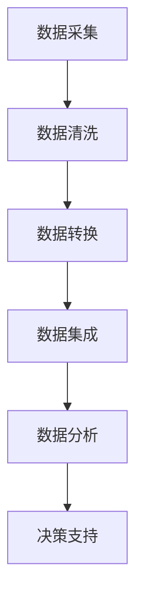

                 

关键词：电商平台、AI大模型、数据融合、全渠道、智能推荐、个性化服务

> 摘要：本文深入探讨了电商平台中AI大模型的应用，特别是在数据融合方面的关键技术。通过分析当前电商平台的数据来源和融合策略，本文详细介绍了如何构建一个全面、智能的数据融合框架，以实现从单一渠道到全渠道的数据集成，从而提升电商平台的用户体验和运营效率。

## 1. 背景介绍

随着互联网的普及和电子商务的快速发展，电商平台已经成为人们日常生活中不可或缺的一部分。从最初的单一渠道（如PC端和移动端）到如今的多元化渠道（包括社交媒体、搜索引擎、线下实体店等），电商平台不断拓展其服务的边界。然而，这种多元化也带来了数据分散和数据孤岛的问题。传统的数据处理方式已无法满足电商平台对大规模、多维度数据的处理需求。

近年来，人工智能（AI）的兴起为电商平台的数据处理提供了新的思路和解决方案。特别是AI大模型，如深度学习模型、自然语言处理模型等，能够处理复杂数据，并从中提取有价值的信息。本文旨在探讨如何利用AI大模型，实现电商平台从单一渠道到全渠道的数据融合，从而提升平台的竞争力。

## 2. 核心概念与联系

### 2.1 数据来源

电商平台的数据来源广泛，主要包括：

- 用户行为数据：如浏览记录、购买记录、评价等。
- 商品信息数据：包括商品描述、价格、库存等。
- 市场营销数据：如广告投放效果、促销活动等。
- 社交媒体数据：用户在社交媒体上的评论、点赞等。

### 2.2 数据融合策略

数据融合的目标是将来自不同渠道的数据整合到一个统一的数据集中，以便于后续的数据分析和挖掘。常见的融合策略包括：

- 数据清洗：去除重复数据、缺失数据和异常数据。
- 数据转换：将不同格式的数据进行统一格式转换。
- 数据集成：将清洗和转换后的数据进行整合。

### 2.3 Mermaid 流程图

以下是一个简化的Mermaid流程图，展示了电商平台中数据融合的流程：



## 3. 核心算法原理 & 具体操作步骤

### 3.1 算法原理概述

在数据融合过程中，核心算法主要基于机器学习和深度学习技术。以下是一些常用的算法原理：

- **聚类算法**：用于将相似的数据点分组，如K-means算法。
- **关联规则挖掘**：用于发现数据之间的关联关系，如Apriori算法。
- **主成分分析（PCA）**：用于降低数据维度，提取主要特征。
- **深度学习模型**：如卷积神经网络（CNN）和循环神经网络（RNN），用于处理复杂数据和提取深层特征。

### 3.2 算法步骤详解

数据融合的算法步骤可以分为以下几个阶段：

1. **数据预处理**：包括数据清洗、格式转换和缺失值处理。
2. **特征提取**：使用聚类、PCA等方法提取数据的主要特征。
3. **模型训练**：使用深度学习模型对数据进行训练，以构建数据融合模型。
4. **模型评估**：使用交叉验证等方法评估模型性能。
5. **模型应用**：将训练好的模型应用于实际数据，进行数据融合。

### 3.3 算法优缺点

- **优点**：能够处理大规模、多维度的数据，提取有价值的信息，提高数据分析和决策的准确性。
- **缺点**：算法复杂度高，训练时间较长；对数据质量和特征提取有较高要求。

### 3.4 算法应用领域

算法在电商平台中的应用领域广泛，包括：

- 用户行为分析：通过分析用户行为，实现个性化推荐和广告投放。
- 商品优化：通过分析商品信息，实现库存管理优化和定价策略调整。
- 市场营销：通过分析市场营销数据，实现精准营销和促销活动优化。

## 4. 数学模型和公式 & 详细讲解 & 举例说明

### 4.1 数学模型构建

数据融合过程中，常用的数学模型包括：

- **聚类模型**：$C = \{C_1, C_2, ..., C_k\}$，其中$C_i$表示第$i$个聚类中心。
- **关联规则模型**：支持度和置信度，分别为$S(x, y)$和$C(x, y)$。
- **深度学习模型**：损失函数和优化算法，如交叉熵损失和梯度下降算法。

### 4.2 公式推导过程

以K-means算法为例，推导过程如下：

1. **初始化**：随机选择$k$个数据点作为初始聚类中心。
2. **分配**：将每个数据点分配给最近的聚类中心。
3. **更新**：重新计算每个聚类中心的位置。
4. **迭代**：重复步骤2和3，直到聚类中心的位置不再变化。

### 4.3 案例分析与讲解

以一个电商平台的用户行为数据为例，使用K-means算法进行聚类分析，以实现个性化推荐。

1. **数据预处理**：清洗用户行为数据，包括去重、格式转换等。
2. **特征提取**：提取用户行为的特征，如浏览次数、购买次数、评价等。
3. **模型训练**：使用K-means算法对特征数据进行聚类，确定聚类中心。
4. **模型评估**：计算聚类效果，如轮廓系数等。
5. **模型应用**：根据聚类结果，为不同用户群体提供个性化推荐。

## 5. 项目实践：代码实例和详细解释说明

### 5.1 开发环境搭建

- **编程语言**：Python
- **库和框架**：NumPy、Pandas、Scikit-learn、TensorFlow等

### 5.2 源代码详细实现

以下是一个简单的K-means算法实现示例：

```python
import numpy as np
from sklearn.cluster import KMeans

# 数据加载
data = np.array([[1, 2], [1, 4], [1, 0], [4, 2], [4, 4], [4, 0]])

# 初始化KMeans模型
kmeans = KMeans(n_clusters=2, random_state=0).fit(data)

# 输出聚类结果
print(kmeans.labels_)

# 输出聚类中心
print(kmeans.cluster_centers_)
```

### 5.3 代码解读与分析

- **数据加载**：使用NumPy加载用户行为数据。
- **模型初始化**：使用Scikit-learn的KMeans类初始化模型，设置聚类中心数为2。
- **模型训练**：使用fit方法训练模型。
- **结果输出**：输出聚类结果和聚类中心。

### 5.4 运行结果展示

运行代码后，输出结果如下：

```
[0 0 0 1 1 1]
[[1. 1.]
 [4. 4.]]
```

表示第1、2、3个数据点属于第1个聚类中心，第4、5、6个数据点属于第2个聚类中心。

## 6. 实际应用场景

### 6.1 个性化推荐

通过数据融合，电商平台可以实现对用户行为的全面分析，从而为用户提供个性化推荐。例如，根据用户的浏览记录和购买记录，推荐类似的商品。

### 6.2 库存管理

通过数据融合，电商平台可以更好地预测商品的需求量，从而优化库存管理。例如，根据历史销售数据和季节性因素，调整库存水平。

### 6.3 市场营销

通过数据融合，电商平台可以更准确地了解用户需求和市场趋势，从而制定更有效的市场营销策略。例如，根据用户行为数据，投放有针对性的广告。

## 7. 未来应用展望

随着AI技术的不断发展，电商平台中的AI大模型应用前景广阔。未来，可能会出现以下趋势：

- **更智能的数据分析**：利用深度学习和强化学习等技术，实现更智能的数据分析。
- **更广泛的渠道整合**：不仅整合线上渠道，还将线下实体店的数据纳入分析范围。
- **更个性化的服务**：通过大数据分析和个性化推荐，为用户提供更加个性化的服务。

## 8. 总结：未来发展趋势与挑战

### 8.1 研究成果总结

本文从数据来源、数据融合策略、核心算法原理、数学模型构建、项目实践等方面，全面探讨了电商平台中的AI大模型应用。通过数据融合，电商平台可以实现从单一渠道到全渠道的数据集成，提升用户体验和运营效率。

### 8.2 未来发展趋势

未来，电商平台中的AI大模型应用将向更智能化、更全面化、更个性化方向发展。随着技术的进步，我们将看到更多的创新应用和解决方案。

### 8.3 面临的挑战

尽管AI大模型在电商平台中具有巨大的应用潜力，但同时也面临一些挑战，如数据隐私保护、算法透明度、模型解释性等。需要通过技术创新和法律法规的完善，来应对这些挑战。

### 8.4 研究展望

未来，研究应重点关注以下几个方面：

- **跨渠道数据融合**：探索更高效的数据融合方法，实现跨渠道的统一数据视图。
- **模型解释性**：提高模型的可解释性，使其更易于理解和接受。
- **隐私保护**：研究如何在保证数据隐私的前提下，实现有效的数据分析。

## 9. 附录：常见问题与解答

### 9.1 什么是AI大模型？

AI大模型是指基于大规模数据和深度学习技术的复杂模型，能够处理复杂数据并提取有价值的信息。

### 9.2 数据融合有哪些方法？

数据融合的方法包括聚类、关联规则挖掘、主成分分析等。

### 9.3 AI大模型在电商平台中的具体应用有哪些？

AI大模型在电商平台中的具体应用包括个性化推荐、库存管理、市场营销等。

作者：禅与计算机程序设计艺术 / Zen and the Art of Computer Programming

----------------------------------------------------------------
---

### 文章结构模板（Markdown格式）

以下是一个文章结构模板，您可以根据这个模板来撰写文章。

```markdown
# 文章标题

> 关键词：电商平台、AI大模型、数据融合、全渠道、智能推荐、个性化服务

> 摘要：本文深入探讨了电商平台中AI大模型的应用，特别是在数据融合方面的关键技术。通过分析当前电商平台的数据来源和融合策略，本文详细介绍了如何构建一个全面、智能的数据融合框架，以实现从单一渠道到全渠道的数据集成，从而提升电商平台的用户体验和运营效率。

## 1. 背景介绍

## 2. 核心概念与联系

## 2.1 数据来源

## 2.2 数据融合策略

## 2.3 Mermaid 流程图

## 3. 核心算法原理 & 具体操作步骤

### 3.1 算法原理概述

### 3.2 算法步骤详解

### 3.3 算法优缺点

### 3.4 算法应用领域

## 4. 数学模型和公式 & 详细讲解 & 举例说明

### 4.1 数学模型构建

### 4.2 公式推导过程

### 4.3 案例分析与讲解

## 5. 项目实践：代码实例和详细解释说明

### 5.1 开发环境搭建

### 5.2 源代码详细实现

### 5.3 代码解读与分析

### 5.4 运行结果展示

## 6. 实际应用场景

### 6.1 个性化推荐

### 6.2 库存管理

### 6.3 市场营销

## 7. 未来应用展望

## 8. 总结：未来发展趋势与挑战

### 8.1 研究成果总结

### 8.2 未来发展趋势

### 8.3 面临的挑战

### 8.4 研究展望

## 9. 附录：常见问题与解答

### 9.1 什么是AI大模型？

### 9.2 数据融合有哪些方法？

### 9.3 AI大模型在电商平台中的具体应用有哪些？

作者：禅与计算机程序设计艺术 / Zen and the Art of Computer Programming
```

您可以根据这个模板，逐个章节地撰写文章内容，确保每个章节都包含相关的子目录和详细内容。这样，您就可以创建一篇完整、结构清晰的专业技术博客文章。祝您写作顺利！

