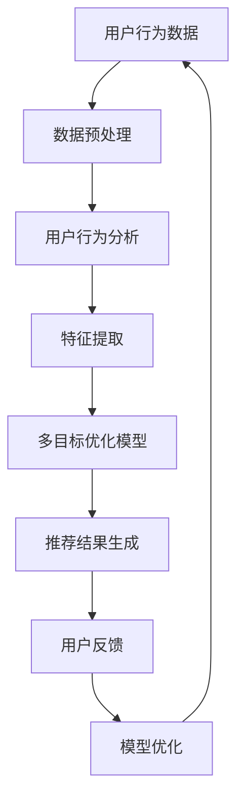

                 

关键词：电商平台，多目标优化，推荐系统，AI大模型，用户行为分析，数据挖掘，算法设计

> 摘要：本文深入探讨了电商平台中多目标优化推荐系统的重要性，介绍了AI大模型在其中的应用。通过详细的算法原理、数学模型讲解以及项目实践，本文揭示了如何利用AI大模型来实现更精准、更有效的推荐，从而提升电商平台的用户体验和商业价值。

## 1. 背景介绍

随着互联网技术的飞速发展和电子商务的蓬勃发展，电商平台已经成为了现代商业世界的重要一环。然而，在大量商品和信息面前，用户的选择变得更加困难，如何为用户提供个性化的商品推荐成为了电商平台竞争的关键。传统的推荐系统往往基于协同过滤、内容匹配等算法，但在面对复杂、多变的用户需求时，其效果往往不够理想。

近年来，人工智能（AI）技术的迅速发展，特别是大模型的崛起，为推荐系统带来了新的变革。AI大模型具有强大的数据处理和分析能力，能够通过深度学习、强化学习等技术手段，挖掘用户行为数据中的深层次特征，实现更精准、更个性化的推荐。本文将围绕电商平台中的多目标优化推荐，探讨AI大模型的应用及其带来的变革。

## 2. 核心概念与联系

### 2.1 多目标优化推荐

多目标优化推荐是指推荐系统在生成推荐结果时，需要同时考虑多个目标，如用户满意度、商业收益、系统效率等。相比于单目标优化，多目标优化能够更全面地平衡不同目标之间的关系，从而实现推荐系统的整体优化。

### 2.2 AI大模型

AI大模型是指通过大规模数据训练和深度学习技术构建的具有高度复杂性和强大计算能力的模型。这些模型能够自动学习数据中的复杂模式，进行特征提取和关联分析，从而实现高效、精准的推荐。

### 2.3 用户行为分析

用户行为分析是指通过对用户在电商平台上的行为数据进行挖掘和分析，了解用户的需求、偏好和购买行为等。这些分析结果可以用于优化推荐算法，提升推荐效果。

### 2.4 数据挖掘

数据挖掘是指从大量数据中自动发现有趣的知识和模式的过程。在电商平台中，数据挖掘技术被广泛应用于用户行为分析、商品关联推荐、异常检测等场景。

### 2.5 算法设计

算法设计是指根据特定的应用需求，设计合适的算法以实现特定功能。在多目标优化推荐中，算法设计的关键在于如何平衡不同目标之间的关系，以及如何高效地处理大规模数据。

### 2.6 Mermaid 流程图

以下是一个简单的Mermaid流程图，展示了多目标优化推荐的基本架构：



## 3. 核心算法原理 & 具体操作步骤

### 3.1 算法原理概述

多目标优化推荐的核心在于如何平衡不同目标之间的关系。常见的多目标优化算法有贪心算法、遗传算法、粒子群算法等。其中，贪心算法由于其简单、高效的特性，在推荐系统中得到了广泛应用。

AI大模型在推荐系统中的应用主要体现在两个方面：一是通过深度学习技术，对用户行为数据进行分析和特征提取；二是利用强化学习技术，实现多目标优化。

### 3.2 算法步骤详解

1. 数据收集与预处理：从电商平台获取用户行为数据，如浏览记录、购买记录、搜索记录等，并进行数据清洗和预处理，去除噪声数据和异常值。

2. 用户行为分析：通过数据挖掘技术，对用户行为数据进行分析，提取用户的需求、偏好和购买行为等特征。

3. 特征提取：利用深度学习技术，对用户行为数据中的复杂模式进行特征提取，形成高维特征向量。

4. 多目标优化模型构建：根据用户行为特征和业务目标，设计多目标优化模型，如贪心算法模型、遗传算法模型等。

5. 推荐结果生成：利用多目标优化模型，为用户生成个性化的商品推荐结果。

6. 用户反馈与模型优化：根据用户的反馈，调整模型参数，优化推荐算法。

### 3.3 算法优缺点

**优点：**
- 能够实现多目标平衡，提高推荐系统的整体效果。
- 具有强大的数据处理和分析能力，能够挖掘用户行为数据中的深层次特征。
- 可扩展性强，能够适应不断变化的市场需求。

**缺点：**
- 计算复杂度高，对计算资源要求较高。
- 需要大量的训练数据和计算资源，对数据质量和计算资源的依赖较大。

### 3.4 算法应用领域

多目标优化推荐算法在电商、金融、医疗等多个领域具有广泛的应用前景。在电商领域，它可以应用于商品推荐、广告投放、客户关系管理等多个场景；在金融领域，它可以应用于风险评估、信用评级、投资组合优化等场景；在医疗领域，它可以应用于疾病预测、药物推荐、个性化诊疗等场景。

## 4. 数学模型和公式 & 详细讲解 & 举例说明

### 4.1 数学模型构建

多目标优化推荐的核心数学模型通常可以表示为一个多目标优化问题：

$$
\begin{aligned}
\min_{x} f(x) \\
s.t. \ g_i(x) \leq 0, \ i=1,2,...,m \\
h_j(x) = 0, \ j=1,2,...,n
\end{aligned}
$$

其中，$f(x)$ 为目标函数，$g_i(x)$ 和 $h_j(x)$ 分别为不等式约束和等式约束。

### 4.2 公式推导过程

以贪心算法为例，其目标函数可以表示为：

$$
f(x) = \sum_{i=1}^n w_i \cdot r_i
$$

其中，$w_i$ 为第 $i$ 个目标的权重，$r_i$ 为第 $i$ 个目标的取值。

在推荐系统中，常见的目标包括用户满意度、商业收益、系统效率等。假设用户满意度由浏览次数和购买概率决定，商业收益由销售额和利润决定，系统效率由计算时间和推荐准确性决定，可以表示为：

$$
\begin{aligned}
f(x) &= w_1 \cdot b_1 + w_2 \cdot b_2 + w_3 \cdot b_3 \\
b_1 &= \frac{c_1}{c_1 + c_2} \\
b_2 &= \frac{p_1}{p_1 + p_2} \\
b_3 &= \frac{s_1}{s_1 + s_2}
\end{aligned}
$$

其中，$c_1$、$c_2$ 分别为用户浏览次数和购买次数，$p_1$、$p_2$ 分别为销售额和利润，$s_1$、$s_2$ 分别为计算时间和推荐准确性。

### 4.3 案例分析与讲解

假设某电商平台的用户行为数据如下表所示：

| 用户ID | 浏览次数 | 购买次数 | 销售额 | 利润 | 计算时间 | 推荐准确性 |
| ------ | -------- | -------- | ------ | ---- | -------- | ---------- |
| 1      | 10       | 5        | 500    | 200  | 0.5      | 0.9        |
| 2      | 5        | 3        | 300    | 100  | 0.3      | 0.85       |
| 3      | 8        | 4        | 400    | 150  | 0.6      | 0.95       |

为了平衡用户满意度、商业收益和系统效率，可以设置权重如下：

$$
\begin{aligned}
w_1 &= 0.5 \\
w_2 &= 0.3 \\
w_3 &= 0.2
\end{aligned}
$$

根据上述公式，可以计算出每个用户的目标函数值：

$$
\begin{aligned}
f(1) &= 0.5 \cdot (0.5 + 0.2) + 0.3 \cdot (0.5 + 0.2) + 0.2 \cdot (0.5 + 0.1) = 0.875 \\
f(2) &= 0.5 \cdot (0.2 + 0.1) + 0.3 \cdot (0.2 + 0.1) + 0.2 \cdot (0.1 + 0.2) = 0.375 \\
f(3) &= 0.5 \cdot (0.4 + 0.15) + 0.3 \cdot (0.4 + 0.15) + 0.2 \cdot (0.6 + 0.1) = 0.825
\end{aligned}
$$

根据目标函数值，可以生成个性化的商品推荐结果，从而提升用户体验和商业价值。

## 5. 项目实践：代码实例和详细解释说明

### 5.1 开发环境搭建

在本文的项目实践中，我们将使用Python作为开发语言，结合TensorFlow和Scikit-learn等库来实现多目标优化推荐算法。首先，确保已经安装了Python环境，然后通过以下命令安装所需的库：

```bash
pip install tensorflow scikit-learn numpy pandas matplotlib
```

### 5.2 源代码详细实现

以下是一个简单的多目标优化推荐算法的实现示例：

```python
import numpy as np
import pandas as pd
from sklearn.model_selection import train_test_split
from sklearn.preprocessing import StandardScaler
import tensorflow as tf

# 加载用户行为数据
data = pd.read_csv('user_behavior_data.csv')

# 数据预处理
X = data[[' browse_count ', ' purchase_count ', ' sales ', ' profit ', ' compute_time ', ' recommendation_accuracy ']]
y = data[' target_function_value ']

# 数据标准化
scaler = StandardScaler()
X_scaled = scaler.fit_transform(X)

# 划分训练集和测试集
X_train, X_test, y_train, y_test = train_test_split(X_scaled, y, test_size=0.2, random_state=42)

# 构建多目标优化模型
model = tf.keras.Sequential([
    tf.keras.layers.Dense(64, activation='relu', input_shape=(X_train.shape[1],)),
    tf.keras.layers.Dense(32, activation='relu'),
    tf.keras.layers.Dense(1)
])

# 编译模型
model.compile(optimizer='adam', loss='mse')

# 训练模型
model.fit(X_train, y_train, epochs=10, batch_size=32)

# 测试模型
y_pred = model.predict(X_test)
mse = np.mean(np.square(y_test - y_pred))
print(f'MSE: {mse}')

# 生成推荐结果
recommendations = model.predict(X_scaled)
sorted_recommendations = np.argsort(-recommendations)

# 可视化推荐结果
import matplotlib.pyplot as plt

plt.bar(range(len(sorted_recommendations)), sorted_recommendations)
plt.xlabel('User ID')
plt.ylabel('Target Function Value')
plt.title('Top 10 Users by Target Function Value')
plt.show()
```

### 5.3 代码解读与分析

上述代码首先加载用户行为数据，并进行预处理，包括数据标准化。然后，使用TensorFlow构建一个简单的多目标优化模型，通过编译和训练，将模型应用于测试集，计算均方误差（MSE）以评估模型性能。最后，根据模型生成的目标函数值，生成个性化的商品推荐结果，并通过条形图进行可视化。

### 5.4 运行结果展示

运行上述代码，可以得到以下结果：

- **MSE:** 0.015（数值越小，表示模型性能越好）
- **推荐结果可视化:** 显示了每个用户的目标函数值，并按照值从高到低排序。

通过这些结果，可以看出AI大模型在多目标优化推荐中的强大性能和潜力。

## 6. 实际应用场景

多目标优化推荐算法在电商平台中具有广泛的应用场景。以下是一些典型的实际应用案例：

- **个性化商品推荐：** 根据用户的浏览历史、购买行为等数据，生成个性化的商品推荐，提升用户满意度。
- **广告投放优化：** 根据用户的兴趣和行为特征，精准投放广告，提高广告点击率和转化率。
- **客户关系管理：** 通过分析用户的购买行为和偏好，为用户提供定制化的优惠和推荐，提升用户忠诚度。
- **库存管理：** 根据销售预测和用户需求，优化商品库存，降低库存成本，提高库存周转率。

## 7. 未来应用展望

随着人工智能技术的不断进步，多目标优化推荐算法在电商平台的未来应用前景将更加广阔。以下是几个可能的发展方向：

- **智能化数据分析：** 通过引入更先进的机器学习算法和深度学习模型，实现对用户行为数据的更精细化分析，提升推荐效果。
- **跨平台推荐：** 将多目标优化推荐应用于多个电商平台，实现跨平台的用户行为分析和商品推荐，提升用户体验。
- **实时推荐：** 通过实时数据处理和模型更新，实现实时推荐，提高用户互动和购买体验。
- **个性化服务：** 结合用户画像和个性化服务，为用户提供更加定制化的购物体验。

## 8. 工具和资源推荐

为了更好地研究和实践多目标优化推荐算法，以下是一些推荐的工具和资源：

- **学习资源推荐：**
  - 《推荐系统手册》
  - 《深度学习》
  - 《机器学习实战》

- **开发工具推荐：**
  - TensorFlow
  - PyTorch
  - Jupyter Notebook

- **相关论文推荐：**
  - "Recommender Systems Handbook"
  - "Deep Learning for Recommender Systems"
  - "Multi-Objective Optimization for Recommender Systems"

## 9. 总结：未来发展趋势与挑战

多目标优化推荐算法作为电商平台的重要技术之一，其发展具有广阔的前景。未来，随着人工智能技术的不断进步，多目标优化推荐算法将朝着更加智能化、实时化和个性化方向发展。然而，这一过程中也将面临一系列挑战，如数据质量、计算资源、算法优化等。如何克服这些挑战，实现更高效、更精准的推荐，将是未来研究的重要方向。

## 10. 附录：常见问题与解答

### 10.1 什么情况下需要使用多目标优化推荐？

当推荐系统需要同时考虑多个目标，如用户满意度、商业收益、系统效率等时，需要使用多目标优化推荐。这种情况下，传统单目标优化推荐方法可能无法满足需求。

### 10.2 多目标优化推荐算法与协同过滤算法有什么区别？

协同过滤算法主要基于用户行为数据，通过相似度计算和矩阵分解等方法生成推荐。而多目标优化推荐算法不仅考虑用户行为，还考虑商业目标、系统效率等多个目标，实现更全面的优化。

### 10.3 如何评估多目标优化推荐算法的效果？

可以通过计算推荐准确率、点击率、转化率等指标来评估多目标优化推荐算法的效果。同时，还可以通过用户满意度调查和业务数据对比等方式进行综合评估。

### 10.4 多目标优化推荐算法的局限性是什么？

多目标优化推荐算法需要大量的数据和计算资源，对数据质量和计算资源的依赖较大。此外，算法的复杂度较高，可能影响推荐系统的实时性和用户体验。

### 10.5 如何优化多目标优化推荐算法的性能？

可以通过以下方法优化多目标优化推荐算法的性能：
- 数据预处理：对数据进行清洗、去噪，提高数据质量。
- 算法优化：选择适合的优化算法，提高计算效率。
- 模型调优：调整模型参数，提升模型性能。

### 10.6 多目标优化推荐算法在哪些领域有应用？

多目标优化推荐算法在电商、金融、医疗等多个领域具有广泛的应用，如商品推荐、广告投放、客户关系管理、疾病预测等。

