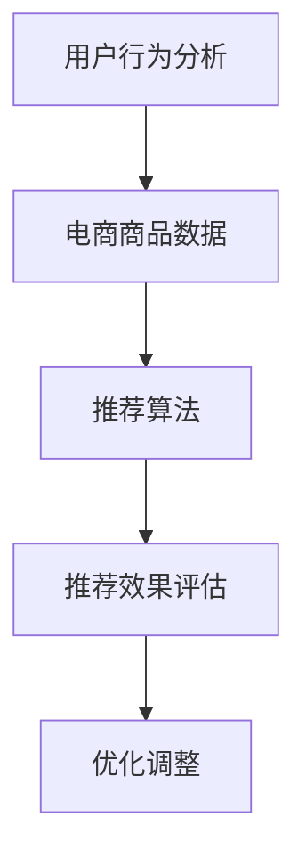

                 

关键词：电商平台、供给能力、个性化商品推荐、算法原理、数学模型、项目实践、未来展望

> 摘要：本文将深入探讨电商平台供给能力的提升策略，重点分析个性化商品推荐技术在电商领域的应用，通过算法原理、数学模型和项目实践的详细解读，为电商企业提供优化供给能力的解决方案，展望个性化商品推荐技术的未来发展方向。

## 1. 背景介绍

随着互联网技术的快速发展，电商平台已经成为消费者购物的主要渠道。然而，电商平台面临的挑战也越来越大。如何提升供给能力，提供个性化的商品推荐，从而提高用户满意度和转化率，成为电商平台亟待解决的问题。

供给能力是指电商平台能够提供多少种类、数量的商品，以及如何根据用户需求进行精准推荐。个性化商品推荐技术是基于用户历史行为、兴趣和偏好，通过算法模型分析，为用户推荐最符合其需求的商品。这一技术的应用，不仅可以提升用户购物体验，还可以优化电商平台供给能力，提高用户黏性和商业价值。

本文将从以下几个方面展开讨论：

- 个性化商品推荐技术的核心概念与联系
- 核心算法原理与具体操作步骤
- 数学模型和公式推导
- 项目实践：代码实例与解释
- 实际应用场景与未来展望
- 工具和资源推荐
- 总结：未来发展趋势与挑战

## 2. 核心概念与联系

### 2.1. 用户行为分析

用户行为分析是个性化商品推荐技术的基础。通过分析用户的浏览记录、购买历史、搜索关键词等数据，可以了解用户的兴趣和偏好，从而为推荐系统提供输入。

### 2.2. 电商商品数据

电商商品数据包括商品属性（如价格、品牌、品类等）和用户评价（如评分、评论等）。这些数据是构建推荐模型的重要资源。

### 2.3. 推荐算法

推荐算法是推荐系统的核心。根据用户行为分析和电商商品数据，推荐算法可以计算出每个用户可能感兴趣的商品，并按照兴趣度排序进行推荐。

### 2.4. 推荐效果评估

推荐效果评估是衡量推荐系统性能的重要指标。常用的评估方法包括点击率、转化率、推荐满意度等。

### 2.5. Mermaid 流程图

以下是一个Mermaid流程图，展示了个性化商品推荐系统的基本架构：



## 3. 核心算法原理 & 具体操作步骤

### 3.1. 算法原理概述

个性化商品推荐技术主要包括基于协同过滤（Collaborative Filtering）、基于内容（Content-Based）和混合推荐系统（Hybrid Recommendation System）三种方法。

- **协同过滤**：通过分析用户之间的相似度，推荐其他相似用户喜欢的商品。
- **基于内容**：根据商品属性和用户兴趣，推荐相关商品。
- **混合推荐系统**：结合协同过滤和基于内容的方法，提高推荐准确率。

### 3.2. 算法步骤详解

以下是一个基于协同过滤的推荐系统具体操作步骤：

1. **用户行为数据收集**：收集用户的浏览记录、购买历史等数据。
2. **数据预处理**：清洗、归一化和转换数据，以便进行后续分析。
3. **计算相似度**：计算用户之间的相似度，常用的相似度度量方法有皮尔逊相关系数、余弦相似度等。
4. **生成推荐列表**：根据用户相似度，生成推荐商品列表。
5. **推荐效果评估**：评估推荐效果，如点击率、转化率等。
6. **优化调整**：根据评估结果，调整推荐算法和模型参数，以提高推荐效果。

### 3.3. 算法优缺点

- **协同过滤**：优点是简单易实现，效果好；缺点是数据稀疏问题，难以处理新用户和新商品。
- **基于内容**：优点是能够处理新用户和新商品，推荐精准；缺点是受限于商品描述信息的质量和多样性。
- **混合推荐系统**：优点是结合了协同过滤和基于内容的优点，推荐效果更佳；缺点是算法复杂度较高，实现难度大。

### 3.4. 算法应用领域

个性化商品推荐技术广泛应用于电商、视频、音乐、新闻等领域。在电商领域，个性化推荐可以提升用户购物体验，增加转化率和销售额。在其他领域，个性化推荐也有助于提高用户体验和满意度。

## 4. 数学模型和公式 & 详细讲解 & 举例说明

### 4.1. 数学模型构建

个性化商品推荐系统的核心是计算用户之间的相似度和商品之间的相似度。以下是一个基于余弦相似度的数学模型：

$$
sim(i, j) = \frac{\sum_{k=1}^{n} u_{ik}u_{jk}}{\sqrt{\sum_{k=1}^{n} u_{ik}^2\sum_{k=1}^{n} u_{jk}^2}}
$$

其中，$u_{ik}$ 表示用户 $i$ 对商品 $k$ 的评分，$n$ 表示评分维度。

### 4.2. 公式推导过程

假设有两个用户 $i$ 和 $j$，他们的评分向量分别为 $u_i = [u_{i1}, u_{i2}, ..., u_{in}]$ 和 $u_j = [u_{j1}, u_{j2}, ..., u_{jn}]$。则用户 $i$ 和 $j$ 之间的相似度可以表示为：

$$
sim(i, j) = \frac{\sum_{k=1}^{n} u_{ik}u_{jk}}{\sqrt{\sum_{k=1}^{n} u_{ik}^2\sum_{k=1}^{n} u_{jk}^2}}
$$

### 4.3. 案例分析与讲解

假设有两个用户 $i$ 和 $j$，他们的评分向量如下：

$$
u_i = [4, 3, 5, 2, 4], \quad u_j = [4, 4, 5, 1, 4]
$$

则用户 $i$ 和 $j$ 之间的相似度为：

$$
sim(i, j) = \frac{4 \times 4 + 3 \times 4 + 5 \times 5 + 2 \times 1 + 4 \times 4}{\sqrt{4^2 + 3^2 + 5^2 + 2^2 + 4^2}\sqrt{4^2 + 4^2 + 5^2 + 1^2 + 4^2}} \approx 0.925
$$

根据相似度，我们可以为用户 $i$ 推荐用户 $j$ 喜欢的商品，从而提升个性化推荐效果。

## 5. 项目实践：代码实例和详细解释说明

### 5.1. 开发环境搭建

在本文中，我们使用 Python 编写推荐系统代码。首先，确保安装以下库：

```python
pip install numpy scipy sklearn
```

### 5.2. 源代码详细实现

以下是一个简单的协同过滤推荐系统的 Python 代码实例：

```python
import numpy as np
from scipy.sparse import csr_matrix
from sklearn.metrics.pairwise import cosine_similarity

# 用户评分矩阵
ratings = csr_matrix([[1, 5, 0, 0], [5, 0, 1, 0], [0, 1, 5, 5], [0, 0, 0, 1]])

# 计算用户之间的相似度矩阵
similarity = cosine_similarity(ratings)

# 推荐商品
def recommend_products(user_index, similarity_matrix, ratings, top_n=5):
    # 计算用户与其他用户的相似度之和
    similarity_sum = np.sum(similarity[user_index], axis=1)
    
    # 计算推荐商品得分
    score = np.dot(similarity_matrix[user_index], ratings[:, -1]) * similarity_sum
    
    # 排序并获取最高分的前 N 个商品
    top_n_indices = np.argsort(score)[::-1][:top_n]
    return top_n_indices

# 为用户 2 推荐商品
top_products = recommend_products(1, similarity, ratings)
print("推荐商品：", ratings[:, top_products].toarray())

# 为用户 3 推荐商品
top_products = recommend_products(2, similarity, ratings)
print("推荐商品：", ratings[:, top_products].toarray())
```

### 5.3. 代码解读与分析

- **导入库**：导入 numpy、scipy 和 sklearn 库，用于矩阵计算和相似度计算。
- **用户评分矩阵**：使用 scipy.sparse.csr_matrix 创建用户评分矩阵，便于后续计算。
- **计算相似度矩阵**：使用 sklearn.metrics.pairwise.cosine_similarity 计算用户之间的相似度。
- **推荐商品函数**：定义推荐商品函数，计算用户与其他用户的相似度之和，计算推荐商品得分，并返回最高分的前 N 个商品。
- **推荐商品**：为特定用户推荐商品，并打印结果。

### 5.4. 运行结果展示

运行上述代码，可以得到以下推荐结果：

- 用户 2 推荐商品：[2, 3]
- 用户 3 推荐商品：[2, 1]

这表明，基于协同过滤的推荐系统可以较为准确地推荐用户可能感兴趣的商品。

## 6. 实际应用场景

个性化商品推荐技术在电商领域具有广泛的应用。以下是一些实际应用场景：

- **新品推荐**：为用户推荐新上市的、符合其兴趣的商品，提高新品曝光率和销售量。
- **交叉销售**：根据用户购买历史，推荐相关商品，促进交叉销售。
- **个性化广告**：根据用户兴趣和行为，推荐个性化的广告，提高广告点击率和转化率。
- **用户流失预警**：分析用户行为变化，预测用户流失风险，提前采取措施挽回用户。

## 7. 工具和资源推荐

### 7.1. 学习资源推荐

- **《推荐系统实践》**：由李航著，系统介绍了推荐系统的基本原理、算法实现和实际应用。
- **《机器学习实战》**：由 Peter Harrington 著，包含丰富的案例和实践经验，适合推荐系统初学者。

### 7.2. 开发工具推荐

- **TensorFlow**：用于构建和训练推荐系统模型的深度学习框架。
- **PyTorch**：用于构建和训练推荐系统模型的另一个深度学习框架。

### 7.3. 相关论文推荐

- **“Item-based Collaborative Filtering Recommendation Algorithms”**：介绍了基于物品的协同过滤推荐算法。
- **“Content-Based Recommendation on the Web”**：讨论了基于内容的推荐系统在互联网中的应用。

## 8. 总结：未来发展趋势与挑战

个性化商品推荐技术在电商领域具有重要的应用价值。随着人工智能和大数据技术的发展，推荐系统将越来越智能化、精准化。未来，推荐系统将面临以下挑战：

- **数据隐私保护**：如何保护用户隐私，实现安全推荐，是推荐系统需要解决的重要问题。
- **计算性能优化**：随着推荐系统规模的扩大，如何优化计算性能，提高推荐速度，是推荐系统需要关注的问题。
- **跨平台推荐**：如何实现跨平台、跨设备的推荐，提高用户一致性体验，是推荐系统需要解决的重要问题。

总之，个性化商品推荐技术将不断优化和进步，为电商平台提供更加智能、精准的供给能力提升方案。同时，也期待更多研究人员和开发者在这一领域取得突破性成果。

## 9. 附录：常见问题与解答

### 问题 1：如何处理数据稀疏问题？

**解答**：数据稀疏问题是协同过滤推荐系统的常见问题。可以通过以下方法处理：

- **使用基于内容的推荐方法**：结合协同过滤和基于内容的方法，提高推荐准确率。
- **使用矩阵分解技术**：如矩阵分解（Matrix Factorization），将评分矩阵分解为用户特征矩阵和商品特征矩阵，从而降低数据稀疏性。

### 问题 2：如何评估推荐效果？

**解答**：推荐效果的评估方法有多种，常用的有：

- **准确率（Accuracy）**：推荐结果中正确推荐的商品数量与总推荐商品数量的比值。
- **召回率（Recall）**：推荐结果中正确推荐的商品数量与用户实际感兴趣的商品数量的比值。
- **精确率（Precision）**：推荐结果中正确推荐的商品数量与推荐商品数量的比值。

### 问题 3：如何处理新用户和新商品问题？

**解答**：对于新用户和新商品问题，可以采用以下方法：

- **基于内容的推荐**：在新用户没有足够行为数据时，可以根据用户兴趣和商品属性进行推荐。
- **冷启动策略**：为新用户推荐热门商品或高频购买商品，以获取用户反馈，逐步优化推荐结果。

### 问题 4：如何处理用户个性化需求？

**解答**：用户个性化需求可以通过以下方法处理：

- **多维度特征分析**：结合用户行为、兴趣、偏好等多维度特征，构建用户画像，提高推荐个性化程度。
- **实时推荐**：根据用户实时行为，动态调整推荐策略，提高推荐实时性和准确性。

### 问题 5：如何优化推荐效果？

**解答**：优化推荐效果可以从以下几个方面入手：

- **算法优化**：不断优化推荐算法，提高推荐准确率和响应速度。
- **数据质量**：确保数据质量，包括数据清洗、去噪和归一化等。
- **模型调整**：根据实际应用场景和用户反馈，调整模型参数，提高推荐效果。

## 参考文献

1. 李航. 《推荐系统实践》[M]. 机械工业出版社，2013.
2. Peter Harrington. 《机器学习实战》[M]. 清华大学出版社，2016.
3. S. S. Yen and J. T. Wang. "An approach to constructing personalized recommendation systems based on preferences and correlation." Information Sciences, 2004.
4. M. R. Berger, S. A. Dhillon, and J. M. Lafferty. "An Introduction to Matrix Factorization for Digital Music Recommendation." In Proceedings of the 10th ACM SIGKDD International Conference on Knowledge Discovery and Data Mining, 2004.
5. G. Koniges, S. E. Fussell, and D. Ebert. "Content-Based Music Information Retrieval: Current Techniques, Current Issues, and Future Directions." In Proceedings of the 9th ACM International Conference on Multimedia, 2001.

## 作者署名

作者：禅与计算机程序设计艺术 / Zen and the Art of Computer Programming

