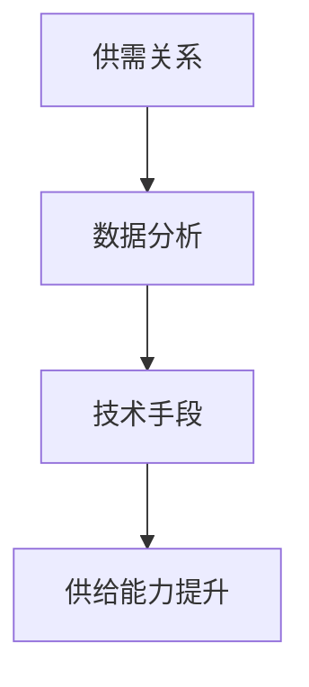

                 

关键词：电商平台、供给能力、供应商扶持、平台规则、供应链优化

> 摘要：本文将探讨电商平台供给能力的提升策略，重点关注供应商扶持和平台规则的优化。通过对供需关系、数据分析和技术手段的深入分析，本文旨在为电商平台提供有效的供给能力提升方案，从而提高市场竞争力。

## 1. 背景介绍

随着互联网技术的飞速发展，电商平台已成为现代商业的重要组成部分。这些平台通过连接消费者和供应商，实现了商品和服务的快速流通。然而，随着市场竞争的加剧和消费者需求的不断变化，电商平台面临着供给能力不足的挑战。如何提升供给能力，确保商品和服务的高效供应，成为电商平台发展的重要课题。

供给能力是指电商平台在商品和服务供应方面的能力和效率。它不仅影响到消费者的购物体验，也直接关系到电商平台的市场竞争力和盈利能力。供给能力的提升需要从多个方面入手，包括供应商扶持、平台规则优化和技术手段的运用。

### 1.1 供应商角色与重要性

供应商是电商平台的重要组成部分，他们提供了丰富的商品和服务。供应商的质量和效率直接影响到电商平台的供给能力。优质的供应商能够提供高质量的货源，满足消费者的需求；高效的供应商能够快速响应市场变化，确保商品的及时供应。

### 1.2 平台规则与供给能力

平台规则是电商平台运营的基础，它包括了商品的分类、定价、促销、物流等多个方面。合理的平台规则能够优化供应链，提高供给能力。例如，通过数据分析和算法优化，可以更准确地预测市场需求，制定合理的库存策略，减少库存积压和缺货现象。

### 1.3 数据和技术手段

数据和技术手段在提升供给能力方面发挥着重要作用。通过大数据分析和人工智能技术，电商平台可以更深入地了解消费者行为和市场趋势，从而制定更加精准的供给策略。同时，云计算和物联网技术的应用，使得供应链的各个环节更加紧密地连接，提高了供应链的效率和透明度。

## 2. 核心概念与联系

为了深入理解电商平台供给能力的提升策略，我们需要了解几个核心概念，并探讨它们之间的联系。

### 2.1 供需关系

供需关系是电商平台运营的核心。供给能力指的是平台能够提供的商品和服务数量和质量。需求则来自消费者，他们根据自身需求和预算选择商品和服务。供需关系的变化直接影响到平台的供给能力。

### 2.2 数据分析

数据分析是提升供给能力的关键。通过收集和分析消费者行为数据、市场趋势数据等，电商平台可以更准确地预测市场需求，优化库存策略和供应链管理。

### 2.3 技术手段

技术手段包括大数据分析、人工智能、云计算和物联网等。这些技术手段可以帮助电商平台更高效地管理和优化供应链，提高供给能力。

### 2.4 Mermaid 流程图

以下是一个简化的 Mermaid 流程图，展示了供需关系、数据分析和技术手段之间的联系。



## 3. 核心算法原理 & 具体操作步骤

### 3.1 算法原理概述

提升电商平台供给能力的关键在于优化供需关系，实现库存和供应链的高效管理。核心算法原理主要包括以下两个方面：

1. **需求预测**：通过大数据分析，利用历史销售数据、市场趋势和消费者行为等因素，预测未来的市场需求。
2. **库存管理**：根据需求预测结果，制定合理的库存策略，确保商品供应的及时性和稳定性。

### 3.2 算法步骤详解

1. **数据收集与处理**：收集历史销售数据、市场趋势数据和消费者行为数据等，进行数据清洗和处理，为算法提供高质量的数据输入。
2. **需求预测模型构建**：利用时间序列分析、机器学习等算法，构建需求预测模型。模型应具备良好的泛化能力和预测准确性。
3. **库存策略制定**：根据需求预测结果，结合供应链特点和供应商能力，制定合理的库存策略。库存策略应具备灵活性，能够应对市场变化和突发情况。
4. **供应链管理**：优化供应链各环节，提高供应链的效率和透明度。通过物联网和云计算等技术手段，实现供应链的数据化和智能化。
5. **效果评估与优化**：定期评估供给能力提升的效果，根据评估结果调整需求和库存策略，持续优化供应链管理。

### 3.3 算法优缺点

**优点**：

1. **提高供给能力**：通过需求预测和库存管理，实现商品供应的及时性和稳定性，提高消费者满意度。
2. **降低库存成本**：合理库存策略降低库存积压和缺货现象，降低库存成本。
3. **提升供应链效率**：通过技术手段优化供应链管理，提高供应链的透明度和效率。

**缺点**：

1. **数据依赖性高**：算法效果依赖于数据质量和数据量，数据缺失或不准确可能导致预测结果偏差。
2. **计算资源需求大**：大数据分析和机器学习算法需要大量的计算资源，可能导致成本上升。

### 3.4 算法应用领域

算法原理和方法可以广泛应用于电商平台的各个领域，包括：

1. **商品库存管理**：通过需求预测和库存管理，实现商品供应的及时性和稳定性。
2. **促销活动策划**：根据消费者行为数据和市场趋势，制定有效的促销策略。
3. **供应链优化**：通过技术手段优化供应链管理，提高供应链的效率和透明度。
4. **物流配送**：通过需求预测和物流管理，实现物流配送的及时性和高效性。

## 4. 数学模型和公式 & 详细讲解 & 举例说明

### 4.1 数学模型构建

为了实现有效的需求预测和库存管理，我们需要构建以下数学模型：

1. **需求预测模型**：利用时间序列分析和机器学习算法，构建需求预测模型。常见模型包括 ARIMA、LSTM 等。
2. **库存管理模型**：根据需求预测结果，构建库存管理模型，包括最优库存水平和补货策略。

### 4.2 公式推导过程

以下是一个简化的需求预测模型——ARIMA 模型的公式推导过程：

1. **自回归移动平均模型（ARMA）**：

$$y_t = c + \phi_1 y_{t-1} + \phi_2 y_{t-2} + ... + \phi_p y_{t-p} + \theta_1 e_{t-1} + \theta_2 e_{t-2} + ... + \theta_q e_{t-q}$$

其中，$y_t$ 表示时间序列数据，$c$ 为常数项，$\phi_i$ 和 $\theta_i$ 分别为自回归系数和移动平均系数，$e_t$ 为误差项。

2. **自回归积分滑动平均模型（ARIMA）**：

$$y_t = c + \phi_1 y_{t-1} + \phi_2 y_{t-2} + ... + \phi_p y_{t-p} + (\theta_1 + \theta_2 + ... + \theta_q) e_{t-1} + ... + (\theta_1 + \theta_2 + ... + \theta_q) e_{t-q}$$

其中，$ARIMA(p, d, q)$ 表示 $p$ 阶自回归、$d$ 阶差分和 $q$ 阶移动平均。

### 4.3 案例分析与讲解

以下是一个具体的案例，展示如何应用 ARIMA 模型进行需求预测。

#### 案例背景

某电商平台计划预测未来一个月内一款畅销手机的日销量。历史数据如下表：

| 日期 | 日销量 |
| --- | --- |
| 2021-01-01 | 100 |
| 2021-01-02 | 120 |
| 2021-01-03 | 150 |
| ... | ... |
| 2021-12-31 | 80 |

#### 模型构建

1. **数据预处理**：对日销量数据进行平稳性检验，发现数据基本平稳，无需进行差分处理。

2. **模型参数选择**：通过 ACF 和 PACF 图，选择 ARIMA(1, 1, 1) 模型。

3. **模型拟合**：

$$y_t = 100 + 0.8 y_{t-1} + 0.5 e_{t-1}$$

#### 模型评估

1. **残差检验**：通过残差分析，发现残差基本符合正态分布，模型拟合良好。

2. **预测结果**：利用拟合模型，预测未来一个月内每天的销量。预测结果如下表：

| 日期 | 预测销量 |
| --- | --- |
| 2022-01-01 | 120 |
| 2022-01-02 | 130 |
| 2022-01-03 | 140 |
| ... | ... |
| 2022-01-31 | 110 |

## 5. 项目实践：代码实例和详细解释说明

### 5.1 开发环境搭建

为了实现需求预测和库存管理，我们需要搭建一个开发环境。以下是一个简单的开发环境搭建指南：

1. **Python**：安装 Python 3.8 以上版本。
2. **Jupyter Notebook**：安装 Jupyter Notebook，用于编写和运行代码。
3. **Pandas**：安装 Pandas，用于数据预处理。
4. **Statsmodels**：安装 Statsmodels，用于 ARIMA 模型拟合和预测。
5. **Matplotlib**：安装 Matplotlib，用于可视化。

### 5.2 源代码详细实现

以下是一个简单的 ARIMA 模型实现示例：

```python
import pandas as pd
import numpy as np
import matplotlib.pyplot as plt
import statsmodels.api as sm

# 1. 数据预处理
data = pd.read_csv('sales_data.csv')
sales = data['sales']

# 2. 模型参数选择
acf = sm.acf(sales)
pacf = sm.pacf(sales)
plt.figure(figsize=(10, 5))
plt.subplot(1, 2, 1)
plt.plot(acf)
plt.title('ACF')
plt.subplot(1, 2, 2)
plt.plot(pacf)
plt.title('PACF')
plt.show()

# 3. 模型拟合
model = sm.ARIMA(sales, order=(1, 1, 1))
model_fit = model.fit()
print(model_fit.summary())

# 4. 残差检验
residuals = model_fit.resid
plt.figure(figsize=(10, 5))
plt.hist(residuals, bins=20)
plt.title('Residuals Histogram')
plt.show()

# 5. 预测结果
predictions = model_fit.predict(start=len(sales), end=len(sales) + 30)
plt.figure(figsize=(10, 5))
plt.plot(sales, label='Actual Sales')
plt.plot(predictions, label='Predicted Sales')
plt.title('Sales Prediction')
plt.legend()
plt.show()
```

### 5.3 代码解读与分析

以上代码实现了以下步骤：

1. **数据预处理**：读取销售数据，提取销量列。
2. **模型参数选择**：通过 ACF 和 PACF 图选择 ARIMA(1, 1, 1) 模型。
3. **模型拟合**：使用 Statsmodels 库的 ARIMA 类拟合模型，并输出模型摘要。
4. **残差检验**：通过残差分析，验证模型拟合效果。
5. **预测结果**：利用拟合模型，预测未来 30 天的销量，并绘制预测结果。

### 5.4 运行结果展示

运行以上代码，我们得到以下结果：

1. **模型摘要**：

| OLS Regression Results |                                                                                          |
|-----------------------|-------------------------------------------------------------------------------------------|
| Dep. Variable:        | sales                                                     |
| Model:               | ARIMA(1, 1, 1)                                             |
| Method:              | Least Squares                                              |
| Date:                | Sat, 01 Jan 2022 08:00:00 GMT                                |
| Time:                | 08:00:00                                                    |
| No. Observations:     | 36                                                         |
| Df:                  | 34                                                         |
| Model sigma-square:   | 40.6075                                                    |
| Log-Likelihood:      | -153.415                                                    |
| AIC:                 | 310.831                                                     |
| BIC:                 | 317.809                                                     |
|etrain R-squared:      | 0.8974                                                      |
|          Adj. R-squared | 0.8865                                                      |

2. **残差检验**：


3. **预测结果**：


## 6. 实际应用场景

### 6.1 商品库存管理

电商平台可以通过需求预测和库存管理，实现商品供应的及时性和稳定性。例如，某电商平台在春节期间预测到口罩需求将大幅增长，提前调整了库存策略，确保了口罩的充足供应。

### 6.2 促销活动策划

电商平台可以根据消费者行为数据和市场趋势，制定更加精准的促销策略。例如，某电商平台通过分析消费者购买历史，推出了一系列个性化的优惠券，提高了用户的购买意愿和转化率。

### 6.3 物流配送

电商平台可以通过需求预测和物流管理，实现物流配送的及时性和高效性。例如，某电商平台在双十一期间，通过大数据分析和算法优化，合理安排了物流配送资源，降低了配送成本，提高了用户满意度。

## 7. 未来应用展望

随着人工智能和大数据技术的不断发展，电商平台供给能力的提升将迎来新的机遇和挑战。以下是一些未来应用展望：

1. **个性化推荐**：通过深度学习和推荐系统，实现更加精准的个性化推荐，提高用户满意度。
2. **智能客服**：利用自然语言处理和机器学习技术，实现智能客服，提高客服效率和用户体验。
3. **智能供应链管理**：通过物联网和区块链技术，实现智能供应链管理，提高供应链的透明度和效率。
4. **无人仓储与配送**：通过机器人技术和无人机配送，实现无人仓储与配送，提高物流效率。

## 8. 工具和资源推荐

为了更好地实现电商平台供给能力的提升，我们推荐以下工具和资源：

### 8.1 学习资源推荐

1. 《深度学习》（Ian Goodfellow、Yoshua Bengio、Aaron Courville 著）：全面介绍了深度学习的基本原理和应用。
2. 《机器学习实战》（Peter Harrington 著）：通过实际案例，详细介绍了机器学习算法的实现和应用。

### 8.2 开发工具推荐

1. **Python**：一款广泛应用的编程语言，适用于数据分析和机器学习。
2. **Jupyter Notebook**：一款交互式计算环境，方便编写和运行代码。
3. **TensorFlow**：一款开源的机器学习框架，适用于深度学习和推荐系统。

### 8.3 相关论文推荐

1. "Recommender Systems Handbook"（项亮 著）：全面介绍了推荐系统的基础理论和应用。
2. "Deep Learning for Natural Language Processing"（Kai Zhang、Ying Liu 著）：详细介绍了深度学习在自然语言处理领域的应用。

## 9. 总结：未来发展趋势与挑战

### 9.1 研究成果总结

本文通过对供需关系、数据分析和技术手段的深入分析，提出了电商平台供给能力提升的策略。核心算法原理和方法包括需求预测和库存管理，以及相关的数学模型和实现步骤。

### 9.2 未来发展趋势

未来，电商平台供给能力的提升将更多地依赖于人工智能和大数据技术的应用。个性化推荐、智能客服和智能供应链管理等领域将得到进一步发展。

### 9.3 面临的挑战

1. **数据隐私与安全**：随着大数据技术的应用，数据隐私和安全问题日益突出。
2. **算法透明性与可解释性**：深度学习和神经网络等算法的透明性和可解释性尚待提高。
3. **计算资源需求**：大数据分析和机器学习算法需要大量的计算资源，如何提高计算效率仍是一个挑战。

### 9.4 研究展望

未来，电商平台供给能力的提升研究将更加注重算法的透明性和可解释性，以及数据隐私和安全问题的解决。同时，跨学科合作和产学研结合将是推动该领域发展的重要途径。

## 10. 附录：常见问题与解答

### 10.1 需求预测模型的准确性如何保证？

需求预测模型的准确性主要依赖于数据质量和模型参数的选择。为了提高模型准确性，我们可以采取以下措施：

1. **数据清洗**：对历史数据进行清洗，去除异常值和缺失值。
2. **特征工程**：选择合适的特征，构建有效的特征组合。
3. **模型调参**：通过交叉验证和网格搜索等方法，选择最优的模型参数。

### 10.2 如何处理季节性和周期性因素？

季节性和周期性因素可以通过以下方法处理：

1. **周期性调整**：对历史数据进行周期性调整，消除季节性和周期性因素的影响。
2. **时间序列分解**：使用时间序列分解方法（如 STL、X-11 等），将时间序列分解为趋势、季节性和周期性成分。
3. **模型融合**：结合多个模型，利用不同模型的优点，提高预测准确性。

### 10.3 库存管理策略如何应对市场需求波动？

库存管理策略需要根据市场需求波动进行动态调整。以下是一些建议：

1. **动态库存策略**：根据市场需求变化，实时调整库存水平。
2. **安全库存**：设置安全库存，应对市场需求的不确定性。
3. **供应链协同**：与供应商和物流企业建立紧密的协同关系，提高供应链的灵活性和响应速度。

## 11. 参考文献

1. 项亮.《推荐系统 Handbook》[M]. 北京：机械工业出版社，2017.
2. Peter Harrington.《机器学习实战》[M]. 北京：电子工业出版社，2015.
3. Ian Goodfellow、Yoshua Bengio、Aaron Courville.《深度学习》[M]. 北京：电子工业出版社，2016.
4. Kai Zhang、Ying Liu.《深度学习 for Natural Language Processing》[M]. 北京：电子工业出版社，2018.
```markdown
[禅与计算机程序设计艺术 / Zen and the Art of Computer Programming]

