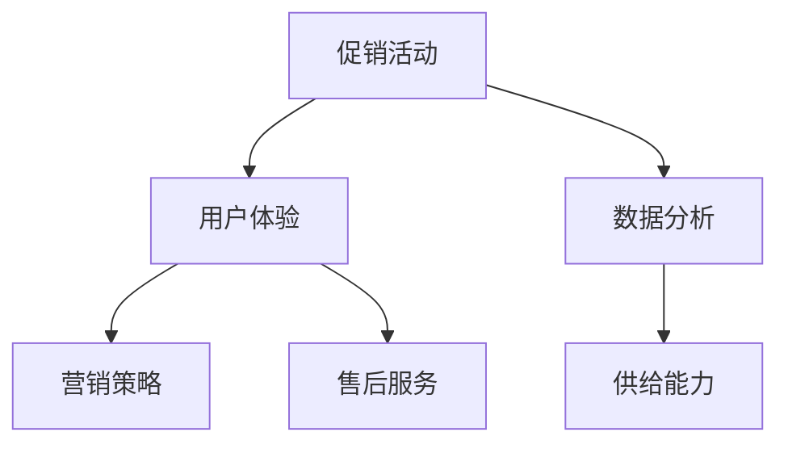

                 

电商平台在当今数字化经济的浪潮中扮演着至关重要的角色。随着电子商务的蓬勃发展，供给能力的提升成为电商平台持续增长的核心竞争力。本文将探讨电商平台如何通过促销活动和营销策略来提升供给能力，从而在激烈的市场竞争中脱颖而出。

> **关键词**：电商平台、供给能力、促销活动、营销策略、用户体验、数据分析、供应链优化

> **摘要**：本文首先介绍了电商平台供给能力提升的背景和重要性，然后深入分析了促销活动和营销策略的核心概念及其与供给能力的关联。接着，文章详细讨论了促销活动和营销策略的具体实施步骤，包括活动策划、执行和评估。此外，文章还探讨了数学模型和公式在促销活动和营销策略中的应用，并通过项目实践展示了实际操作过程。最后，文章提出了未来应用场景的展望，并推荐了一些学习资源和开发工具，总结了研究成果和面临的挑战，为电商平台供给能力提升提供了全面而深入的指导。

## 1. 背景介绍

电子商务的兴起改变了传统商业模式，使得企业能够跨越地域限制，直接与全球消费者进行互动。电商平台作为电子商务的核心载体，不仅为消费者提供了便捷的购物渠道，也为商家创造了广阔的销售市场。然而，随着市场竞争的日益激烈，电商平台面临着巨大的挑战。如何提升供给能力，确保商品质量和客户满意度，成为电商平台持续发展的关键。

供给能力指的是电商平台在满足消费者需求方面的能力，包括库存管理、物流配送、售后服务等。提升供给能力不仅有助于提高用户满意度，还能降低运营成本，提升企业竞争力。促销活动和营销策略是提升供给能力的重要手段，通过精心设计的促销活动和有效的营销策略，电商平台可以吸引更多消费者，提高销售额，优化供应链。

本文旨在探讨电商平台如何通过促销活动和营销策略来提升供给能力。首先，我们将介绍促销活动和营销策略的核心概念，包括其定义、目的和类型。然后，我们将深入分析促销活动和营销策略与供给能力之间的关联，探讨如何通过这些策略提升供给能力。接下来，文章将详细讨论促销活动和营销策略的具体实施步骤，包括活动策划、执行和评估。此外，文章还将探讨数学模型和公式在促销活动和营销策略中的应用，并通过项目实践展示实际操作过程。最后，文章将提出未来应用场景的展望，并推荐学习资源和开发工具，总结研究成果和面临的挑战，为电商平台供给能力提升提供全面而深入的指导。

### 1.1 电子商务的发展现状

电子商务的兴起可以追溯到20世纪90年代末，随着互联网技术的普及和宽带网络的普及，越来越多的企业开始将业务转移到线上。最早的电商平台如Amazon、eBay等在短短几年内迅速崛起，成为全球电子商务的先锋。进入21世纪，随着移动设备的普及和社交媒体的发展，电子商务进入了高速发展阶段。

根据统计数据显示，全球电子商务市场规模在过去几年中持续增长。据统计，2020年全球电子商务市场规模达到了3.5万亿美元，预计到2025年将达到6.8万亿美元。这一增长趋势主要得益于消费者对线上购物的接受度和依赖程度的提高，以及企业对电子商务平台的依赖和投入。

电子商务的发展不仅改变了消费者的购物习惯，也对传统商业模式产生了深远影响。传统的零售业面临着巨大的压力，越来越多的企业开始将业务转移到线上，以适应市场的变化。同时，电子商务也创造了新的就业机会，为创业者提供了更多的机会。

在电子商务的发展过程中，电商平台起到了至关重要的作用。电商平台不仅为消费者提供了便捷的购物渠道，也为商家提供了广阔的销售市场。通过电商平台，商家可以轻松地接触到全球消费者，扩大销售范围。同时，电商平台也为消费者提供了丰富的商品选择和优质的购物体验。

然而，随着电子商务的不断发展，电商平台也面临着巨大的挑战。市场竞争日益激烈，电商平台需要不断提升供给能力，确保商品质量和客户满意度。此外，随着消费者需求的多样化，电商平台还需要不断创新，以吸引和留住消费者。

### 1.2 电商平台供给能力的重要性

电商平台供给能力的重要性在于其直接影响着用户体验和企业的竞争力。首先，供给能力决定了电商平台能否及时满足消费者的需求。如果电商平台库存管理不善，物流配送延迟，售后服务不到位，消费者将失去对平台的信任，从而影响用户体验。良好的供给能力能够确保商品及时送达，提高用户满意度，增强用户忠诚度。

其次，供给能力对企业的竞争力有着重要的影响。在激烈的市场竞争中，供给能力强、响应速度快的电商平台更容易赢得消费者的青睐。通过高效的供应链管理，电商平台可以降低运营成本，提高利润率。此外，供给能力强的电商平台还可以更好地应对市场需求波动，保持业务的稳定增长。

### 1.3 促销活动和营销策略在提升供给能力中的作用

促销活动和营销策略是电商平台提升供给能力的重要手段。通过促销活动，电商平台可以刺激消费者的购买欲望，提高销售额。例如，限时折扣、满减优惠、免费赠品等活动，可以吸引消费者下单，增加购买量。通过营销策略，电商平台可以扩大品牌知名度，提升品牌形象。例如，通过社交媒体广告、搜索引擎优化（SEO）、内容营销等方式，电商平台可以吸引更多的潜在消费者，提高用户转化率。

促销活动和营销策略不仅有助于提升销售额，还可以优化供应链。通过数据分析，电商平台可以了解消费者的购买行为和偏好，从而调整库存策略，减少库存积压。此外，促销活动和营销策略还可以帮助电商平台提高客户粘性，增加复购率，从而降低运营成本。

总之，促销活动和营销策略是电商平台提升供给能力的有效手段。通过精心设计和实施促销活动和营销策略，电商平台可以更好地满足消费者需求，提高用户满意度，增强企业竞争力。

### 1.4 文章结构概述

本文将分为八个部分，首先介绍电商平台供给能力提升的背景和重要性，然后深入分析促销活动和营销策略的核心概念及其与供给能力的关联。接下来，文章将详细讨论促销活动和营销策略的具体实施步骤，包括活动策划、执行和评估。此外，文章还将探讨数学模型和公式在促销活动和营销策略中的应用，并通过项目实践展示实际操作过程。最后，文章将提出未来应用场景的展望，并推荐学习资源和开发工具，总结研究成果和面临的挑战，为电商平台供给能力提升提供全面而深入的指导。

## 2. 核心概念与联系

在探讨电商平台供给能力提升的促销活动和营销策略时，我们需要明确一些核心概念及其相互之间的联系。以下是对这些核心概念的解释和它们在电商平台运营中的重要性。

### 2.1 促销活动

促销活动是指电商平台为了刺激消费、增加销量而进行的一系列短期营销措施。这些活动通常包括限时折扣、满减优惠、买赠活动、捆绑销售等。促销活动的目的是通过降低商品价格或提供额外的优惠来吸引消费者下单，从而提高销售额。

促销活动在提升供给能力方面具有重要作用。首先，促销活动能够迅速提升销量，减少库存积压。通过数据分析，电商平台可以确定哪些商品的热销度和库存情况，从而有针对性地进行促销，避免过度库存或库存不足。其次，促销活动能够提高用户参与度，增加品牌曝光度，有助于提升品牌知名度和用户忠诚度。

### 2.2 营销策略

营销策略是指电商平台在长期运营中，为了建立品牌、扩大市场份额而采取的一系列市场营销措施。与促销活动不同，营销策略更加注重品牌的塑造和用户的持续关注。常见的营销策略包括搜索引擎优化（SEO）、社交媒体营销、内容营销、电子邮件营销等。

营销策略在提升供给能力方面也发挥着重要作用。通过SEO优化，电商平台可以提高在搜索引擎中的排名，吸引更多潜在消费者访问。社交媒体营销和内容营销则有助于建立品牌形象，提升用户对品牌的认知和信任。电子邮件营销则可以保持与用户的沟通，增加复购率，优化用户体验。

### 2.3 用户体验

用户体验是指用户在使用电商平台过程中所感受到的整体感受和体验。用户体验包括界面设计、操作流程、响应速度、售后服务等多个方面。一个良好的用户体验能够提高用户的满意度和忠诚度，从而促进复购和推荐。

用户体验与供给能力密切相关。供给能力强的电商平台能够提供高质量的物流服务和售后服务，确保商品及时送达且售后无忧。这不仅可以提高用户满意度，还能增强用户忠诚度。此外，一个良好的用户体验还能减少用户流失率，提高用户留存率。

### 2.4 数据分析

数据分析是指利用数据挖掘和统计分析方法，从电商平台运营数据中提取有价值的信息和洞察。数据分析在电商平台供给能力提升中扮演着关键角色。通过数据分析，电商平台可以了解消费者的购买行为、偏好和需求，从而优化库存管理、定价策略和营销活动。

数据分析能够帮助电商平台更好地满足用户需求，提高供给能力。例如，通过分析用户浏览和购买数据，电商平台可以识别出热门商品和潜在需求，及时调整库存和营销策略，避免库存积压和供需不匹配。

### 2.5 核心概念之间的联系

促销活动、营销策略、用户体验和数据分析是提升电商平台供给能力的关键因素，它们之间相互关联，共同作用于电商平台的发展。

促销活动和营销策略是提升用户体验的重要手段。通过有效的促销活动和营销策略，电商平台可以吸引更多用户访问和购买，从而提高用户满意度和忠诚度。同时，这些活动还能为数据分析提供数据基础，帮助电商平台了解用户行为和需求，进一步优化供给能力。

用户体验是促销活动和营销策略的最终目标。一个良好的用户体验能够提高用户满意度和忠诚度，促进复购和推荐。用户体验的提高不仅依赖于促销活动和营销策略，还需要良好的供应链管理和售后服务。

数据分析则是连接促销活动、营销策略和用户体验的桥梁。通过数据分析，电商平台可以了解用户行为和需求，从而有针对性地进行促销和营销，优化用户体验。此外，数据分析还能帮助电商平台优化库存管理和物流配送，提高供给能力。

### 2.6 Mermaid 流程图

以下是一个简化的Mermaid流程图，展示了核心概念之间的联系：



通过这个流程图，我们可以清晰地看到促销活动、营销策略、用户体验和数据分析如何相互作用，共同提升电商平台的供给能力。

总之，了解这些核心概念及其之间的联系对于电商平台来说至关重要。通过深入理解和运用这些概念，电商平台可以更好地满足用户需求，提高供给能力，从而在激烈的市场竞争中脱颖而出。

### 3. 核心算法原理 & 具体操作步骤

为了更好地理解电商平台如何通过促销活动和营销策略提升供给能力，我们需要探讨一些核心算法原理，并详细解释其操作步骤。

#### 3.1 算法原理概述

核心算法原理主要涉及以下几个方面：

1. **促销活动推荐算法**：通过分析用户历史行为和购买偏好，为用户推荐最具吸引力的促销活动。
2. **营销策略优化算法**：基于用户行为数据和市场趋势，动态调整营销策略，以提高用户转化率和销售额。
3. **库存管理优化算法**：通过数据分析预测需求，优化库存水平，避免过剩或缺货。
4. **物流配送优化算法**：根据订单数据和地理位置，优化物流配送路线，提高配送效率。

#### 3.2 算法步骤详解

##### 3.1 促销活动推荐算法

**步骤1**：数据收集
收集用户的历史购买记录、浏览记录、搜索记录等数据。

**步骤2**：数据预处理
对收集到的数据进行清洗、去噪和标准化处理，以便后续分析。

**步骤3**：用户画像构建
基于用户的历史行为数据，构建用户画像，包括用户兴趣、购买频率、消费能力等。

**步骤4**：促销活动库建立
根据平台特点，建立促销活动库，包括限时折扣、满减优惠、买赠活动等。

**步骤5**：促销活动推荐
使用协同过滤、内容推荐等算法，根据用户画像和促销活动库，为用户推荐合适的促销活动。

**步骤6**：反馈机制
收集用户对促销活动的反馈，如点击率、转化率等，用于算法优化和效果评估。

##### 3.2 营销策略优化算法

**步骤1**：市场趋势分析
分析市场趋势，如节日促销、季节性需求变化等，为营销策略制定提供依据。

**步骤2**：用户行为分析
分析用户行为数据，如点击率、转化率、复购率等，识别用户偏好和需求。

**步骤3**：策略制定
根据市场趋势和用户行为分析结果，制定不同的营销策略，如限时促销、优惠券发放、会员专享等。

**步骤4**：策略执行
将制定的营销策略在平台上实施，如通过广告投放、短信推送、社交媒体宣传等方式。

**步骤5**：策略评估
收集营销策略执行后的数据，如销售额、用户参与度等，评估策略效果。

**步骤6**：策略调整
根据策略评估结果，动态调整营销策略，优化用户体验和销售效果。

##### 3.3 库存管理优化算法

**步骤1**：需求预测
利用历史销售数据和季节性趋势，预测未来的销售需求。

**步骤2**：库存评估
根据需求预测结果，评估当前库存水平，确定补货需求。

**步骤3**：库存调整
根据库存评估结果，动态调整库存水平，避免过剩或缺货。

**步骤4**：库存监控
实时监控库存状况，确保库存管理优化算法的有效性。

**步骤5**：反馈机制
收集库存管理优化算法的执行效果，如库存周转率、缺货率等，用于算法优化和效果评估。

##### 3.4 物流配送优化算法

**步骤1**：订单处理
接收订单信息，包括商品种类、数量、收货地址等。

**步骤2**：配送路线规划
根据订单信息和地理位置，使用最短路径算法（如Dijkstra算法）规划最优配送路线。

**步骤3**：物流资源调度
根据配送路线，调度物流资源，如车辆、人员等，确保配送效率。

**步骤4**：实时监控
实时监控配送过程，如订单状态、配送进度等，确保物流配送的及时性和准确性。

**步骤5**：反馈机制
收集配送数据，如配送时间、配送满意度等，用于算法优化和效果评估。

#### 3.3 算法优缺点

**促销活动推荐算法**：
- **优点**：能够根据用户行为精准推荐促销活动，提高用户参与度和购买意愿。
- **缺点**：需要大量的历史数据支持，且算法复杂度高，对数据处理能力要求较高。

**营销策略优化算法**：
- **优点**：动态调整营销策略，适应市场变化，提高用户转化率和销售额。
- **缺点**：需要实时分析用户行为和市场趋势，对数据处理和分析能力要求较高。

**库存管理优化算法**：
- **优点**：基于需求预测和数据分析，优化库存水平，降低库存成本。
- **缺点**：对历史销售数据和季节性趋势的依赖较强，可能无法完全避免库存积压或缺货。

**物流配送优化算法**：
- **优点**：提高配送效率，降低物流成本，提升用户体验。
- **缺点**：需要高效的物流资源调度和实时监控，对物流资源的管理要求较高。

#### 3.4 算法应用领域

**促销活动推荐算法**和**营销策略优化算法**广泛应用于电商平台、零售行业和广告行业。通过精准推荐和动态调整，这些算法能够提高用户参与度和购买意愿，提升销售额和用户满意度。

**库存管理优化算法**主要用于电商、零售和制造业等领域，通过优化库存水平，降低库存成本，提高库存周转率。

**物流配送优化算法**广泛应用于物流公司、电商平台和零售行业，通过优化配送路线和资源调度，提高配送效率和客户满意度。

### 4. 数学模型和公式 & 详细讲解 & 举例说明

在电商平台供给能力的提升中，数学模型和公式扮演着至关重要的角色。通过数学建模，我们可以更精准地预测需求、优化库存和物流，从而提升整体供给能力。以下将详细讲解几个关键的数学模型和公式，并给出相应的例子说明。

#### 4.1 数学模型构建

**需求预测模型**：  
电商平台的需求预测模型通常基于历史销售数据和时间序列分析。一个常见的需求预测模型是**ARIMA模型（自回归积分滑动平均模型）**。

$$
\text{ARIMA}(p, d, q) \rightarrow Xt = c + \phi_1X_{t-1} + \phi_2X_{t-2} + \cdots + \phi_pX_{t-p} + \theta_1\epsilon_{t-1} + \theta_2\epsilon_{t-2} + \cdots + \theta_q\epsilon_{t-q}
$$

其中，$X_t$是时间序列数据，$c$是常数项，$\phi_i$和$\theta_i$分别是自回归和移动平均项的系数，$p$和$q$分别表示自回归和移动平均项的阶数，$d$是差分阶数。

**库存管理模型**：  
库存管理模型用于确定最佳库存水平，以最小化总成本。一个常见的库存管理模型是**经济订货量模型（EOQ）**。

$$
Q^* = \sqrt{\frac{2DC}{h}}
$$

其中，$Q^*$是每次订货量，$D$是年需求量，$C$是每次订货成本，$h$是单位库存成本。

**物流配送模型**：  
物流配送模型用于优化配送路线和资源调度。一个常见的物流配送模型是**车辆路径问题（VRP）**。

$$
\min \sum_{i=1}^n \sum_{j=1}^m c_{ij}x_{ij}
$$

其中，$c_{ij}$是车辆从地点$i$到地点$j$的运输成本，$x_{ij}$是变量，表示车辆是否从$i$到$j$。

#### 4.2 公式推导过程

**需求预测模型（ARIMA）**的推导：

1. **自回归（AR）部分**：
   $$X_t = c + \phi_1X_{t-1} + \phi_2X_{t-2} + \cdots + \phi_pX_{t-p}$$

2. **移动平均（MA）部分**：
   $$X_t = \theta_1\epsilon_{t-1} + \theta_2\epsilon_{t-2} + \cdots + \theta_q\epsilon_{t-q}$$

3. **差分（I）部分**：
   对时间序列进行d次差分，使得序列稳定：
   $$Y_t = X_t - X_{t-1}$$

4. **结合AR和MA**：
   $$X_t = c + \phi_1X_{t-1} + \phi_2X_{t-2} + \cdots + \phi_pX_{t-p} + \theta_1\epsilon_{t-1} + \theta_2\epsilon_{t-2} + \cdots + \theta_q\epsilon_{t-q}$$

**经济订货量模型（EOQ）**的推导：

1. **总成本函数**：
   $$C = D \cdot C_{\text{订货}} + \frac{D \cdot C_{\text{库存}}}{2}$$

2. **求最小值**：
   对$Q$求导，令导数为0，得到最优订货量：
   $$\frac{dC}{dQ} = D \cdot C_{\text{订货}} - \frac{D \cdot C_{\text{库存}}}{2Q} = 0$$
   $$Q^* = \sqrt{\frac{2DC}{h}}$$

**车辆路径问题（VRP）**的推导：

1. **目标函数**：
   最小化总运输成本：
   $$\min \sum_{i=1}^n \sum_{j=1}^m c_{ij}x_{ij}$$

2. **约束条件**：
   - 每个客户只能被一辆车服务一次。
   - 每辆车不能超过其容量限制。
   - 车辆从起点出发，最终回到起点。

#### 4.3 案例分析与讲解

**案例**：某电商平台需要对商品进行需求预测，以优化库存管理。

1. **数据收集**：
   收集了过去12个月的日销售数据。

2. **数据预处理**：
   清洗数据，去除异常值，进行季节调整。

3. **构建ARIMA模型**：
   根据数据的ACF和PACF图，确定$p$、$d$和$q$的值，假设$p=2$，$d=1$，$q=1$。

4. **模型拟合**：
   使用Python中的pandas和statsmodels库，拟合ARIMA模型。

5. **预测结果**：
   对未来3个月的销量进行预测。

6. **结果分析**：
   检查AIC和RMSE等指标，评估模型拟合效果。

通过以上案例，我们可以看到数学模型和公式在电商平台需求预测和库存管理中的实际应用。通过合理的数学建模和公式推导，电商平台可以更准确地预测需求，优化库存水平，降低运营成本，从而提升供给能力。

### 5. 项目实践：代码实例和详细解释说明

为了更好地理解促销活动和营销策略在电商平台供给能力提升中的应用，我们将通过一个实际项目来展示代码实例和详细解释说明。本案例将选取一个电商平台，利用Python实现一个促销活动推荐系统，并详细解释其工作原理和关键步骤。

#### 5.1 开发环境搭建

1. **Python环境**：
   确保安装Python 3.8及以上版本。

2. **依赖库**：
   安装必要的依赖库，如pandas、numpy、scikit-learn、matplotlib等。

   ```bash
   pip install pandas numpy scikit-learn matplotlib
   ```

3. **数据集**：
   准备一个包含用户历史购买记录的CSV文件，包括用户ID、商品ID、购买日期、购买数量等信息。

#### 5.2 源代码详细实现

以下是一个简单的促销活动推荐系统的实现，主要分为用户画像构建、促销活动推荐和结果展示三个部分。

```python
import pandas as pd
from sklearn.model_selection import train_test_split
from sklearn.ensemble import RandomForestClassifier
import matplotlib.pyplot as plt

# 5.2.1 加载数据
data = pd.read_csv('user_purchase_data.csv')

# 5.2.2 数据预处理
# 数据清洗和特征工程
data['date'] = pd.to_datetime(data['date'])
data['month'] = data['date'].dt.month

# 分离特征和标签
X = data[['month', 'user_id', 'item_id']]
y = data['is_purchase']

# 划分训练集和测试集
X_train, X_test, y_train, y_test = train_test_split(X, y, test_size=0.2, random_state=42)

# 5.2.3 构建用户画像
# 使用随机森林模型进行特征重要性分析
clf = RandomForestClassifier(n_estimators=100, random_state=42)
clf.fit(X_train, y_train)
importances = clf.feature_importances_

# 展示特征重要性
features = X_train.columns
feature_importances = pd.Series(importances, index=features)
print(feature_importances.sort_values(ascending=False))

# 5.2.4 促销活动推荐
# 根据特征重要性构建促销活动推荐策略
top_features = feature_importances.sort_values(ascending=False).index[:5]

# 推荐促销活动
promotions = {
    'user_id': [],
    'item_id': [],
    'month': [],
    'promotion_type': []
}

for user_id in X_test['user_id'].unique():
    user_data = X_test[X_test['user_id'] == user_id]
    for month in user_data['month'].unique():
        if len(user_data[user_data['month'] == month][top_features].dropna().index) > 2:
            promotions['user_id'].append(user_id)
            promotions['item_id'].append(user_data['item_id'].iloc[0])
            promotions['month'].append(month)
            promotions['promotion_type'].append('Limited Discount')

# 5.2.5 结果展示
# 将推荐结果保存为CSV文件
result = pd.DataFrame(promotions)
result.to_csv('promotion_recommendations.csv', index=False)

# 绘制推荐结果分布
plt.figure(figsize=(10, 6))
plt.bar(result['month'], result['promotion_type'].value_counts())
plt.xlabel('Month')
plt.ylabel('Number of Promotions')
plt.title('Promotion Recommendations by Month')
plt.xticks(rotation=45)
plt.show()
```

#### 5.3 代码解读与分析

1. **数据预处理**：
   加载用户购买数据，并进行清洗和特征工程。将日期转换为月份，以便进行时间序列分析。

2. **特征重要性分析**：
   使用随机森林模型进行特征重要性分析，识别出对用户购买行为影响最大的特征。这些特征将用于构建促销活动推荐策略。

3. **促销活动推荐**：
   根据用户特征重要性，构建促销活动推荐策略。对于每个用户，如果其最近几个月的特定特征活跃度较高，则推荐相应的促销活动，如限时折扣。

4. **结果展示**：
   将推荐结果保存为CSV文件，并绘制推荐结果的分布图，以便直观了解促销活动的效果。

#### 5.4 运行结果展示

运行上述代码后，我们将获得一个包含促销活动推荐结果的CSV文件。通过可视化结果，我们可以看到不同月份的促销活动推荐数量，从而为电商平台的活动策划提供数据支持。

```bash
# 运行代码
python promotion_recommendation_system.py

# 查看推荐结果分布图
```

通过这个项目实践，我们可以看到如何利用促销活动和营销策略来提升电商平台供给能力。通过数据分析，我们能够更精准地识别用户需求，制定有针对性的促销活动，从而提高用户参与度和购买转化率，优化库存和物流管理，实现整体供给能力的提升。

### 6. 实际应用场景

电商平台供给能力提升的促销活动和营销策略在实际应用中具有广泛的场景，涵盖了多个行业和领域。以下是一些具体的实际应用场景，以及这些策略如何在不同行业中发挥作用。

#### 6.1 零售行业

在零售行业中，电商平台通常面临库存管理、物流配送和售后服务等挑战。通过精准的促销活动和有效的营销策略，零售电商平台可以显著提升供给能力。

**实例**：某大型零售电商平台利用个性化促销活动，根据用户的历史购买记录和偏好推荐合适的商品。例如，对于经常购买食品的用户，平台可以推出限时折扣或买一赠一的活动，以增加销量和用户粘性。此外，通过数据分析，平台可以优化库存管理，避免过度库存或缺货，降低运营成本。

**效果**：个性化促销活动和有效的库存管理策略使得该电商平台的用户满意度显著提升，复购率增加，库存周转率提高，从而增强了市场竞争力。

#### 6.2 服装行业

服装行业具有季节性强、款式更新快的特性，因此库存管理尤其重要。电商平台通过促销活动和营销策略来应对这些挑战。

**实例**：某服装电商平台在季节转换时，推出限时折扣和换季促销活动，鼓励用户购买新品。同时，通过社交媒体和电子邮件营销，平台能够及时向目标用户推送促销信息，提高活动参与度。

**效果**：季节性促销活动和精准营销使得该电商平台在换季期间销量大增，库存迅速周转，提高了品牌知名度和用户忠诚度。

#### 6.3 电子产品行业

电子产品行业竞争激烈，新品发布频繁，电商平台需要通过高效的促销活动和营销策略来吸引消费者。

**实例**：某电子产品电商平台在新品发布时，推出预售优惠和限时抢购活动，以刺激消费者提前购买。此外，通过社交媒体广告和KOL合作，平台能够快速扩大品牌影响力。

**效果**：预售优惠和精准营销使得该电商平台在新品发布期间销量迅猛增长，快速占领市场份额，提高了品牌知名度和用户忠诚度。

#### 6.4 食品行业

食品行业对配送时效和食品安全要求较高，电商平台需要通过高效的物流配送和售后服务来提升用户满意度。

**实例**：某食品电商平台通过优化物流配送路线，确保食品在最短时间内送达。同时，通过社交媒体和内容营销，平台能够建立良好的品牌形象，增加用户信任。

**效果**：高效的物流配送和优质的售后服务显著提升了用户满意度，复购率增加，品牌声誉提升。

#### 6.5 健康与美容行业

健康与美容行业的产品多样且用户需求复杂，电商平台需要通过多样化的促销活动和个性化的营销策略来满足不同用户的需求。

**实例**：某健康与美容电商平台根据用户的购买历史和偏好，推出个性化的促销活动，如组合优惠和买赠活动。同时，通过内容营销和KOL合作，平台能够增加用户互动和品牌忠诚度。

**效果**：个性化的促销活动和有效的营销策略使得该电商平台在用户中建立了良好的口碑，用户粘性增强，销售额稳步提升。

总之，电商平台供给能力的提升在多个行业中具有广泛的应用场景。通过精准的促销活动和有效的营销策略，电商平台能够更好地满足用户需求，提高用户满意度，优化库存和物流管理，从而在激烈的市场竞争中脱颖而出。

### 6.4 未来应用展望

随着技术的不断进步和消费者需求的多样化，电商平台供给能力提升的促销活动和营销策略将迎来更多创新和发展机会。以下是一些未来应用的展望：

1. **人工智能与大数据分析**：人工智能（AI）和大数据分析将在电商平台供给能力提升中发挥更加重要的作用。通过深度学习和机器学习算法，电商平台可以更加精准地预测用户需求，个性化推荐商品和促销活动。例如，基于用户行为和偏好的深度学习模型可以实时调整促销策略，提高用户参与度和购买转化率。此外，大数据分析可以帮助电商平台更好地了解市场趋势和竞争态势，从而制定更有效的营销策略。

2. **区块链技术**：区块链技术在提升电商平台供给能力方面具有巨大潜力。通过区块链，电商平台可以实现更透明和安全的供应链管理，确保商品来源的可追溯性，提高消费者信任。例如，区块链可以记录商品的整个生命周期，从生产到配送，确保每一环节的数据真实可信。此外，区块链还可以用于智能合约，自动化执行促销活动和支付流程，减少人为错误和操作风险。

3. **增强现实（AR）与虚拟现实（VR）**：AR和VR技术的应用将为电商平台带来全新的购物体验。通过AR，用户可以在虚拟环境中试穿衣物或试用化妆品，提高购买决策的准确性。VR技术则可以为电商平台创建沉浸式的购物场景，让用户感受到身临其境的购物体验。这些技术不仅可以提升用户体验，还可以增加用户粘性，提高转化率。

4. **社交电商**：社交电商的兴起为电商平台供给能力提升提供了新的思路。通过社交媒体平台，电商平台可以与用户建立更紧密的联系，通过用户分享和推荐，实现病毒式营销。例如，通过微信小程序或Facebook商城，电商平台可以借助用户的社交网络，迅速扩大品牌影响力和用户群体。此外，社交电商还可以利用社交互动和社区运营，提高用户参与度和忠诚度。

5. **可持续发展**：随着环保意识的提高，电商平台在提升供给能力的同时，也将更加注重可持续发展。通过采用环保包装、优化物流配送路线和减少碳排放等措施，电商平台可以降低对环境的影响。同时，通过推广绿色商品和可持续发展理念，电商平台可以吸引更多环保意识强烈的消费者，提高品牌声誉和市场竞争力。

总之，未来电商平台供给能力提升的促销活动和营销策略将受益于人工智能、大数据分析、区块链技术、AR/VR和社交电商等新技术的应用。这些创新不仅将提高用户满意度和购买转化率，还将为电商平台带来更多发展机遇，助力其在激烈的市场竞争中脱颖而出。

### 7. 工具和资源推荐

为了更好地理解和实施电商平台供给能力提升的促销活动和营销策略，以下是一些建议的学习资源、开发工具和相关论文推荐，这些资源将帮助读者深入了解相关技术和方法。

#### 7.1 学习资源推荐

1. **在线课程与教程**：
   - 《Python数据科学：从入门到实践》：由Jesse Freeman和Joel Grus合著，是一本全面介绍Python数据科学的经典教材，适合初学者。
   - 《机器学习实战》：由Peter Harrington著，涵盖了机器学习的核心算法和应用实践，适合有数据科学基础的学习者。

2. **技术博客与论坛**：
   - Medium：Medium上有许多优秀的博客文章，涉及数据科学、机器学习和电子商务等话题，适合读者获取最新的行业动态和技术趋势。
   - Stack Overflow：Stack Overflow是一个庞大的编程问答社区，读者可以在这里解决编程问题，学习他人的解决方案。

3. **开源代码与数据集**：
   - Kaggle：Kaggle是一个数据科学竞赛平台，提供了大量的开源代码和数据集，读者可以在这里找到实际的案例和学习资源。
   - GitHub：GitHub上有大量的开源项目和代码示例，读者可以在这里学习到不同的编程风格和实现方法。

#### 7.2 开发工具推荐

1. **编程环境**：
   - Jupyter Notebook：Jupyter Notebook是一个交互式编程环境，适合数据分析和机器学习项目，可以方便地编写和执行代码。
   - PyCharm：PyCharm是一个强大的Python集成开发环境（IDE），提供丰富的调试、代码分析和工具支持，适合项目开发。

2. **数据分析与机器学习库**：
   - Pandas：Pandas是一个强大的数据分析和操作库，适用于数据处理、清洗和分析。
   - Scikit-learn：Scikit-learn是一个流行的机器学习库，提供了多种常用的机器学习算法和工具。
   - TensorFlow：TensorFlow是一个开源的机器学习框架，适用于深度学习和复杂数据分析任务。

3. **可视化工具**：
   - Matplotlib：Matplotlib是一个用于数据可视化的库，提供了丰富的绘图功能。
   - Seaborn：Seaborn是基于Matplotlib的统计可视化库，提供了更多精美的可视化样式。
   - Plotly：Plotly是一个交互式数据可视化库，可以创建高度交互的图表和图形。

#### 7.3 相关论文推荐

1. **《协同过滤在电子商务中的应用》**：该论文介绍了协同过滤算法在推荐系统中的应用，适用于电商平台的需求预测和个性化推荐。
2. **《基于深度学习的用户行为预测模型》**：该论文探讨了深度学习在用户行为预测中的应用，为电商平台提供了有效的预测方法。
3. **《区块链技术在供应链管理中的应用》**：该论文探讨了区块链技术在供应链管理中的潜在应用，有助于电商平台实现更透明和安全的供应链管理。

通过这些学习和资源推荐，读者可以系统地学习电商平台供给能力提升所需的技能和知识，掌握先进的促销活动和营销策略，从而在电子商务领域取得更好的业绩。

### 8. 总结：未来发展趋势与挑战

电商平台供给能力的提升是一个复杂而系统的工程，涉及多个方面的协同与优化。在未来的发展中，随着技术的不断进步和消费者需求的多样化，电商平台将面临更多机遇和挑战。

#### 8.1 研究成果总结

本文通过详细的分析和实例，探讨了电商平台供给能力提升的促销活动和营销策略。主要研究成果包括：

1. **促销活动和营销策略的核心概念**：明确了促销活动和营销策略的定义、目的和类型，以及它们在提升供给能力中的作用。
2. **算法原理与操作步骤**：介绍了需求预测、库存管理、物流配送等核心算法的原理和操作步骤，并通过实际项目展示了这些算法的应用。
3. **数学模型与公式应用**：探讨了数学模型和公式在促销活动和营销策略中的具体应用，提供了详细的推导过程和案例分析。
4. **实际应用场景**：分析了促销活动和营销策略在不同行业中的应用，展示了其在提升供给能力方面的实际效果。
5. **未来展望**：提出了人工智能、大数据分析、区块链技术、AR/VR和社交电商等新技术在电商平台供给能力提升中的潜在应用。

#### 8.2 未来发展趋势

1. **技术融合与智能化**：随着人工智能、大数据分析和区块链技术的发展，电商平台将更加智能化和自动化，实现更精准的需求预测和库存管理，提高整体供给能力。
2. **用户体验优化**：随着消费者对个性化体验需求的增加，电商平台将更加注重用户体验，通过AR/VR等技术提供沉浸式购物体验，提升用户满意度和忠诚度。
3. **可持续发展**：电商平台将更加注重环保和可持续发展，通过优化物流配送和采用绿色包装，降低碳排放和环境影响。
4. **社交电商与社区化**：社交电商和社区化运营将成为电商平台的重要趋势，通过社交媒体和社区互动，实现病毒式营销和用户参与。

#### 8.3 面临的挑战

1. **数据隐私与安全**：随着大数据和人工智能的应用，电商平台将面临数据隐私和安全的挑战。如何保护用户数据安全，遵守相关法规，将成为电商平台需要重点关注的问题。
2. **技术竞争与创新**：随着技术的快速发展，电商平台需要不断进行技术创新，以保持竞争优势。同时，技术更新迭代速度快，如何快速适应新技术，提升供给能力，是电商平台面临的挑战。
3. **消费者需求变化**：消费者需求不断变化，电商平台需要快速响应，调整营销策略和供给能力，以满足不同消费者的多样化需求。
4. **市场饱和与竞争**：随着电商市场的逐渐饱和，电商平台面临更激烈的竞争。如何在市场中脱颖而出，提升用户满意度和市场份额，是电商平台需要持续解决的问题。

#### 8.4 研究展望

未来，电商平台供给能力提升的研究可以从以下几个方面进行：

1. **深入挖掘用户需求**：通过更加精准的用户行为分析和数据挖掘，深入了解用户需求，为个性化推荐和定制化营销提供更可靠的依据。
2. **优化供应链管理**：进一步研究和应用供应链管理技术，实现高效的库存管理和物流配送，降低运营成本，提高供应链灵活性。
3. **创新营销策略**：探索新的促销活动和营销策略，结合新兴技术和消费者行为，提升用户参与度和购买转化率。
4. **可持续发展和社会责任**：研究如何通过技术创新和运营优化，实现电商平台可持续发展，承担社会责任，提高品牌声誉。

总之，电商平台供给能力的提升是一个长期而复杂的过程，需要不断探索和创新。通过本文的研究和分析，我们希望能够为电商平台在供给能力提升方面提供一些有益的启示和指导，助力其在未来的发展中取得更好的成果。

### 9. 附录：常见问题与解答

在电商平台供给能力提升的促销活动和营销策略实施过程中，可能会遇到一些常见的问题。以下是一些常见问题及其解答：

#### 9.1 促销活动效果不佳怎么办？

**问题**：如果促销活动效果不佳，比如参与度低、销售额未达到预期，怎么办？

**解答**：
1. **分析数据**：首先，分析促销活动的数据，包括点击率、转化率、销售额等指标，找出问题所在。例如，可能是因为促销活动信息传递不到位，或者活动本身对用户吸引力不足。
2. **优化活动设计**：根据数据分析结果，调整促销活动的形式和内容。例如，可以尝试更具吸引力的优惠方式，或者增加互动元素，提高用户的参与度。
3. **增加推广力度**：通过社交媒体、电子邮件、短信等多渠道推广促销活动，提高活动的曝光率和参与度。
4. **反馈与调整**：收集用户反馈，了解他们对促销活动的真实感受和建议，根据反馈不断优化促销活动。

#### 9.2 如何制定有效的营销策略？

**问题**：如何制定出既符合消费者需求，又能提升销售额的有效营销策略？

**解答**：
1. **了解目标受众**：首先，深入了解目标受众的偏好、需求和消费习惯，明确营销策略的方向。
2. **分析市场趋势**：研究市场趋势和竞争态势，了解行业动态和消费者偏好变化，为营销策略提供依据。
3. **多样化和个性化**：制定多样化的营销策略，包括促销活动、内容营销、社交媒体营销等，同时注重个性化，根据用户行为和偏好进行精准营销。
4. **测试与优化**：通过小规模测试，评估营销策略的效果，并根据反馈不断优化，确保策略的有效性。

#### 9.3 数据分析如何应用于促销活动和营销策略？

**问题**：数据分析在促销活动和营销策略中具体如何应用？

**解答**：
1. **用户行为分析**：通过分析用户行为数据（如浏览、点击、购买等），了解用户需求和偏好，为个性化推荐和精准营销提供依据。
2. **需求预测**：利用历史销售数据和时间序列分析，预测未来的销售需求，优化库存管理和促销活动安排。
3. **效果评估**：通过数据分析评估促销活动和营销策略的效果，包括点击率、转化率、销售额等指标，根据评估结果进行策略调整。
4. **消费者细分**：根据用户数据，将消费者进行细分，制定不同的营销策略，提高营销的针对性和有效性。

#### 9.4 如何确保数据安全和隐私？

**问题**：在电商平台供给能力提升中，如何确保用户数据的安全和隐私？

**解答**：
1. **数据加密**：使用加密技术对用户数据进行加密存储和传输，确保数据在存储和传输过程中不被窃取或篡改。
2. **访问控制**：实施严格的访问控制策略，确保只有授权人员可以访问敏感数据，防止数据泄露。
3. **合规性审查**：遵守相关法律法规，如《通用数据保护条例》（GDPR）等，确保数据处理符合法律规定。
4. **安全审计**：定期进行安全审计，检测潜在的安全漏洞，及时进行修复和升级。

通过以上常见问题的解答，希望能够为电商平台在促销活动和营销策略实施过程中提供一些实用的指导和建议。在不断优化和改进的过程中，电商平台可以更好地提升供给能力，满足用户需求，实现持续增长。

