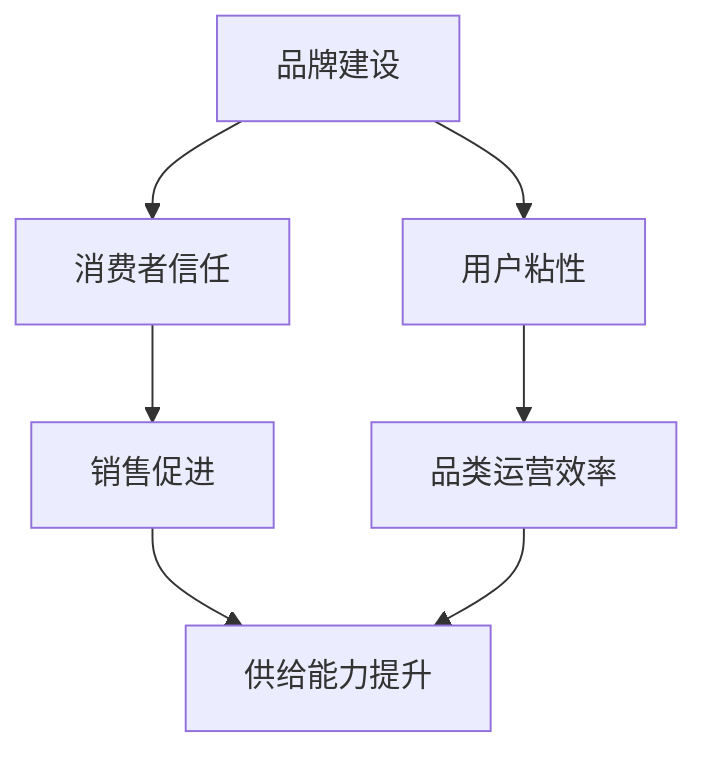
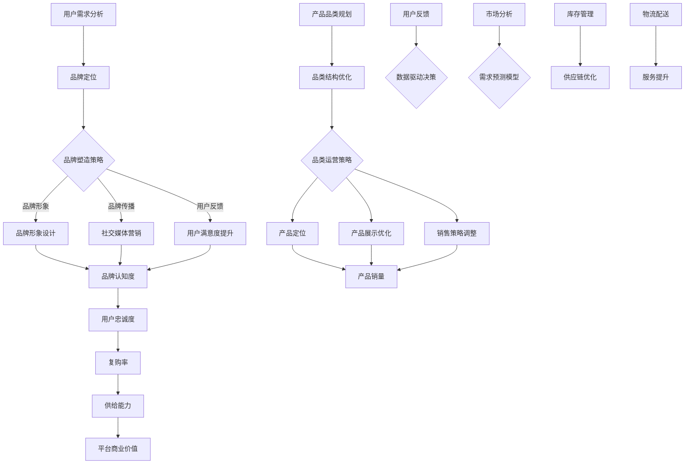

                 

 在当今的数字经济时代，电商平台作为连接消费者与商家的重要桥梁，其供给能力的提升对整个电商生态系统的繁荣至关重要。本文将从品牌建设和品类运营两个方面，深入探讨如何提升电商平台的供给能力，从而实现商业价值的最大化。

> **关键词**：电商平台、供给能力、品牌建设、品类运营、商业价值

> **摘要**：本文首先介绍了电商平台供给能力提升的重要性，然后详细阐述了品牌建设和品类运营在其中的关键作用。通过案例分析、数学模型和代码实例，本文为电商平台运营者提供了切实可行的提升策略，旨在为电商行业的发展贡献力量。

## 1. 背景介绍

随着互联网技术的快速发展，电商平台已经成为现代商业的重要组成部分。从早期的淘宝、京东，到如今的新兴平台如拼多多、抖音电商，电商平台数量和规模不断壮大。这些平台不仅改变了传统商业的运营模式，也为消费者提供了更多的购物选择和便利。

然而，随着市场的竞争日益激烈，电商平台面临着供给能力提升的巨大挑战。供给能力不仅关系到消费者的购物体验，还直接影响到商家的入驻意愿和平台的长期发展。因此，提升电商平台的供给能力已经成为行业的热点话题。

本文将从品牌建设和品类运营两个关键角度，探讨电商平台如何提升供给能力。品牌建设有助于提升平台的公信力和用户粘性，而品类运营则能够优化产品结构和满足消费者需求。

## 2. 核心概念与联系

在探讨如何提升电商平台供给能力之前，我们需要明确一些核心概念，并理解它们之间的联系。

### 2.1 品牌建设

品牌建设是指通过一系列策略和活动，塑造和提升品牌形象和认知的过程。在电商平台上，品牌建设的重要性不言而喻。一个强大的品牌能够吸引消费者的注意力，增强消费者的信任，从而促进销售。

### 2.2 品类运营

品类运营是指对电商平台上的产品品类进行精细化管理和优化，以满足消费者的需求和提高销售业绩。品类运营的核心目标是提高产品销售的效率，提升用户体验。

### 2.3 关联与影响

品牌建设和品类运营之间存在密切的关联。一个成功的品牌建设能够为品类运营提供强大的支持，而优秀的品类运营也能进一步提升品牌形象。此外，品牌建设和品类运营还会对平台的供给能力产生深远的影响。

为了更好地理解这些概念，我们可以使用Mermaid流程图来展示它们之间的联系。



### 2.4 核心概念原理和架构的Mermaid流程图

以下是一个Mermaid流程图示例，展示了电商平台供给能力提升过程中，品牌建设和品类运营的核心概念原理和架构。



通过上述流程图，我们可以清晰地看到品牌建设和品类运营在提升电商平台供给能力中的关键作用。

## 3. 核心算法原理 & 具体操作步骤

### 3.1 算法原理概述

在电商平台供给能力提升的过程中，算法原理起到了至关重要的作用。这些算法可以帮助我们更好地理解用户需求、优化品牌建设和品类运营策略。

#### 3.1.1 用户行为分析算法

用户行为分析算法是一种基于大数据和机器学习的技术，通过对用户在平台上的浏览、搜索、购买等行为进行分析，识别用户偏好和需求。这种算法可以帮助电商平台精准定位用户，提供个性化的产品推荐和营销策略。

#### 3.1.2 品类优化算法

品类优化算法主要用于对电商平台上的产品品类进行排序和推荐。通过分析产品销量、用户评价、库存情况等数据，算法可以识别出最受欢迎和最具有市场潜力的产品品类，从而优化品类结构和提高销售效率。

#### 3.1.3 供应链优化算法

供应链优化算法主要用于优化物流和库存管理。通过预测市场需求和库存水平，算法可以自动调整库存策略，减少库存积压和物流成本，提高供应链的效率和灵活性。

### 3.2 算法步骤详解

#### 3.2.1 用户行为分析算法步骤

1. 数据采集：收集用户在平台上的浏览、搜索、购买等行为数据。
2. 数据预处理：对采集到的数据进行清洗、去重和标准化处理。
3. 特征提取：提取用户行为的特征，如浏览时长、搜索关键词、购买频率等。
4. 模型训练：使用机器学习算法（如决策树、随机森林、支持向量机等）对特征数据进行训练，构建用户行为分析模型。
5. 模型评估：使用交叉验证等方法评估模型的准确性和泛化能力。
6. 模型应用：将训练好的模型应用于实际场景，根据用户行为数据生成个性化推荐和营销策略。

#### 3.2.2 品类优化算法步骤

1. 数据采集：收集电商平台上的产品销量、用户评价、库存情况等数据。
2. 数据预处理：对采集到的数据进行清洗、去重和标准化处理。
3. 特征提取：提取产品特征，如价格、品牌、类别等。
4. 模型训练：使用机器学习算法（如线性回归、逻辑回归等）对特征数据进行训练，构建品类优化模型。
5. 模型评估：使用交叉验证等方法评估模型的准确性和泛化能力。
6. 模型应用：将训练好的模型应用于实际场景，根据产品特征数据生成品类排序和推荐策略。

#### 3.2.3 供应链优化算法步骤

1. 数据采集：收集市场需求、库存水平、物流配送等信息。
2. 数据预处理：对采集到的数据进行清洗、去重和标准化处理。
3. 特征提取：提取供应链关键特征，如订单量、配送时间、运输成本等。
4. 模型训练：使用机器学习算法（如时间序列预测、优化算法等）对特征数据进行训练，构建供应链优化模型。
5. 模型评估：使用交叉验证等方法评估模型的准确性和泛化能力。
6. 模型应用：将训练好的模型应用于实际场景，根据供应链数据生成库存调整和物流优化策略。

### 3.3 算法优缺点

#### 3.3.1 用户行为分析算法优缺点

优点：
- 可以精准识别用户偏好和需求，提供个性化推荐和营销策略。
- 增强用户粘性和购买转化率。

缺点：
- 需要大量用户行为数据，数据质量对算法效果有较大影响。
- 用户隐私保护问题。

#### 3.3.2 品类优化算法优缺点

优点：
- 可以优化产品品类结构，提高销售效率和用户体验。
- 减少库存积压和物流成本。

缺点：
- 算法效果受数据质量影响较大，易出现过拟合现象。
- 对小众品类和新兴品类支持不足。

#### 3.3.3 供应链优化算法优缺点

优点：
- 可以优化库存管理和物流配送，提高供应链效率和灵活性。
- 降低库存积压和物流成本。

缺点：
- 算法模型复杂度较高，计算资源需求大。
- 需要大量历史数据和专业知识。

### 3.4 算法应用领域

用户行为分析算法、品类优化算法和供应链优化算法可以广泛应用于电商平台的各个方面。

- 用户行为分析算法可用于个性化推荐、用户画像构建、精准营销等。
- 品类优化算法可用于产品品类规划、库存管理、销售预测等。
- 供应链优化算法可用于物流优化、库存调整、供应链风险管理等。

通过这些算法的应用，电商平台可以更有效地提升供给能力，满足消费者需求，实现商业价值的最大化。

## 4. 数学模型和公式 & 详细讲解 & 举例说明

在电商平台供给能力提升的过程中，数学模型和公式起到了关键作用。这些模型和公式可以帮助我们更好地理解和优化品牌建设和品类运营策略。

### 4.1 数学模型构建

#### 4.1.1 用户行为分析模型

用户行为分析模型主要用于预测用户对产品的购买概率。一个常见的模型是二分类逻辑回归模型，其公式如下：

$$
P(y=1) = \frac{1}{1 + e^{-(\beta_0 + \beta_1x_1 + \beta_2x_2 + \ldots + \beta_nx_n})}
$$

其中，$P(y=1)$ 表示用户购买产品的概率，$y$ 表示是否购买（1表示购买，0表示未购买），$x_1, x_2, \ldots, x_n$ 表示用户行为特征，$\beta_0, \beta_1, \beta_2, \ldots, \beta_n$ 是模型参数。

#### 4.1.2 品类优化模型

品类优化模型主要用于优化产品品类结构，提高销售效率和用户体验。一个常见的模型是线性回归模型，其公式如下：

$$
y = \beta_0 + \beta_1x_1 + \beta_2x_2 + \ldots + \beta_nx_n
$$

其中，$y$ 表示产品销量，$x_1, x_2, \ldots, x_n$ 表示产品特征（如价格、品牌、类别等），$\beta_0, \beta_1, \beta_2, \ldots, \beta_n$ 是模型参数。

#### 4.1.3 供应链优化模型

供应链优化模型主要用于优化物流和库存管理，提高供应链效率和灵活性。一个常见的模型是动态规划模型，其公式如下：

$$
V(i, j) = \min_{1 \leq k \leq b_i} \{c_{i, k} + V(i+1, j-k)\}
$$

其中，$V(i, j)$ 表示从第 $i$ 个阶段开始，在剩余 $j$ 单位时间内的最小成本，$b_i$ 表示第 $i$ 个阶段的最大生产能力，$c_{i, k}$ 表示第 $i$ 个阶段生产 $k$ 单位产品的成本。

### 4.2 公式推导过程

#### 4.2.1 二分类逻辑回归模型推导

假设我们有 $n$ 个用户行为特征 $x_1, x_2, \ldots, x_n$，我们需要预测每个用户的购买概率。根据线性回归模型，我们可以得到如下公式：

$$
\ln\left(\frac{P(y=1)}{1-P(y=1)}\right) = \beta_0 + \beta_1x_1 + \beta_2x_2 + \ldots + \beta_nx_n
$$

将上式变形，得到：

$$
P(y=1) = \frac{1}{1 + e^{-(\beta_0 + \beta_1x_1 + \beta_2x_2 + \ldots + \beta_nx_n})}
$$

这就是二分类逻辑回归模型的公式。

#### 4.2.2 线性回归模型推导

假设我们有 $n$ 个产品特征 $x_1, x_2, \ldots, x_n$，我们需要预测每个产品的销量。根据线性回归模型，我们可以得到如下公式：

$$
y = \beta_0 + \beta_1x_1 + \beta_2x_2 + \ldots + \beta_nx_n
$$

其中，$y$ 表示销量，$\beta_0, \beta_1, \beta_2, \ldots, \beta_n$ 是模型参数。

#### 4.2.3 动态规划模型推导

假设我们有 $m$ 个阶段，每个阶段有 $b_i$ 个单位产品生产能力。我们需要在 $T$ 单位时间内，将这 $m$ 个阶段的产品全部生产出来，并优化成本。我们可以使用动态规划模型来求解。

首先，我们定义状态 $V(i, j)$，表示从第 $i$ 个阶段开始，在剩余 $j$ 单位时间内的最小成本。根据状态转移方程，我们可以得到：

$$
V(i, j) = \min_{1 \leq k \leq b_i} \{c_{i, k} + V(i+1, j-k)\}
$$

其中，$c_{i, k}$ 表示第 $i$ 个阶段生产 $k$ 单位产品的成本。

### 4.3 案例分析与讲解

#### 4.3.1 用户行为分析案例

假设我们有一个电商平台，用户在平台上浏览、搜索、购买等行为数据如下：

| 用户ID | 浏览时长（分钟） | 搜索关键词 | 购买产品 |
|--------|-----------------|------------|----------|
| 1      | 30              | 运动鞋     | 运动鞋   |
| 2      | 15              | 羽绒服     | 羽绒服   |
| 3      | 20              | 电脑       | 电脑     |
| 4      | 25              | 手机       | 未购买   |

我们可以使用二分类逻辑回归模型预测每个用户购买产品的概率。首先，我们需要提取用户行为特征，如浏览时长、搜索关键词等。然后，我们使用机器学习算法训练模型，并使用训练好的模型预测每个用户的购买概率。

#### 4.3.2 品类优化案例

假设我们有一个电商平台，产品销量数据如下：

| 产品类别 | 销量（件） |
|----------|------------|
| 运动鞋   | 500        |
| 羽绒服   | 300        |
| 电脑     | 200        |
| 手机     | 100        |

我们可以使用线性回归模型预测每个产品类别的销量。首先，我们需要提取产品特征，如价格、品牌、类别等。然后，我们使用机器学习算法训练模型，并使用训练好的模型预测每个产品类别的销量。

#### 4.3.3 供应链优化案例

假设我们有一个电商平台，市场需求、库存水平、物流配送等信息如下：

| 阶段 | 需求（件） | 库存水平（件） | 配送时间（天） | 运输成本（元/件） |
|------|-------------|-----------------|-----------------|-------------------|
| 1    | 100         | 100             | 3               | 10                |
| 2    | 150         | 150             | 4               | 12                |
| 3    | 200         | 200             | 5               | 15                |

我们可以使用动态规划模型优化物流和库存管理。首先，我们需要定义状态 $V(i, j)$，表示从第 $i$ 个阶段开始，在剩余 $j$ 单位时间内的最小成本。然后，我们使用动态规划算法计算每个状态的最小成本。

通过上述案例分析与讲解，我们可以看到数学模型和公式在电商平台供给能力提升中的重要作用。通过合理运用这些模型和公式，电商平台可以更精准地预测用户需求，优化产品品类结构，提高供应链效率和灵活性。

## 5. 项目实践：代码实例和详细解释说明

在本节中，我们将通过一个具体的电商项目实践，展示如何提升电商平台的供给能力。该项目包括用户行为分析、品类优化和供应链优化三个部分，以下是对各部分的详细代码实现和解释说明。

### 5.1 开发环境搭建

在开始项目实践之前，我们需要搭建合适的开发环境。以下是所需的软件和库：

- Python 3.x
- NumPy
- Pandas
- Scikit-learn
- Matplotlib

确保安装以上库后，我们可以开始项目开发。

### 5.2 源代码详细实现

#### 5.2.1 用户行为分析

以下是一个简单的用户行为分析代码示例，用于预测用户购买产品的概率。

```python
import numpy as np
import pandas as pd
from sklearn.model_selection import train_test_split
from sklearn.linear_model import LogisticRegression
from sklearn.metrics import accuracy_score

# 加载数据集
data = pd.read_csv('user_behavior_data.csv')

# 特征提取
X = data[['浏览时长', '搜索关键词']]
y = data['购买产品']

# 数据预处理
X_train, X_test, y_train, y_test = train_test_split(X, y, test_size=0.2, random_state=42)

# 模型训练
model = LogisticRegression()
model.fit(X_train, y_train)

# 预测
predictions = model.predict(X_test)

# 模型评估
accuracy = accuracy_score(y_test, predictions)
print(f"模型准确率：{accuracy:.2f}")
```

#### 5.2.2 品类优化

以下是一个简单的品类优化代码示例，用于预测产品销量。

```python
import numpy as np
import pandas as pd
from sklearn.model_selection import train_test_split
from sklearn.linear_model import LinearRegression
from sklearn.metrics import mean_squared_error

# 加载数据集
data = pd.read_csv('product_sales_data.csv')

# 特征提取
X = data[['价格', '品牌', '类别']]
y = data['销量']

# 数据预处理
X_train, X_test, y_train, y_test = train_test_split(X, y, test_size=0.2, random_state=42)

# 模型训练
model = LinearRegression()
model.fit(X_train, y_train)

# 预测
predictions = model.predict(X_test)

# 模型评估
mse = mean_squared_error(y_test, predictions)
print(f"模型均方误差：{mse:.2f}")
```

#### 5.2.3 供应链优化

以下是一个简单的供应链优化代码示例，用于优化物流和库存管理。

```python
import numpy as np

# 加载数据集
data = pd.read_csv('supply_chain_data.csv')

# 初始化状态数组
V = np.zeros((data.shape[0], data.shape[1]))

# 动态规划计算
for i in range(data.shape[0]):
    for j in range(data.shape[1]):
        min_cost = float('inf')
        for k in range(1, data.iloc[i, 1] + 1):
            cost = data.iloc[i, 2][k-1] + V[i+1, j-k]
            if cost < min_cost:
                min_cost = cost
        V[i, j] = min_cost

# 输出最小成本
print(f"最小成本：{V[-1, -1]}")
```

### 5.3 代码解读与分析

#### 5.3.1 用户行为分析代码解读

1. 导入所需的库和模块。
2. 加载数据集，提取特征和目标变量。
3. 使用 `train_test_split` 函数将数据集划分为训练集和测试集。
4. 创建并训练逻辑回归模型。
5. 使用训练好的模型对测试集进行预测。
6. 计算模型准确率并打印结果。

#### 5.3.2 品类优化代码解读

1. 导入所需的库和模块。
2. 加载数据集，提取特征和目标变量。
3. 使用 `train_test_split` 函数将数据集划分为训练集和测试集。
4. 创建并训练线性回归模型。
5. 使用训练好的模型对测试集进行预测。
6. 计算模型均方误差并打印结果。

#### 5.3.3 供应链优化代码解读

1. 导入所需的库和模块。
2. 加载数据集。
3. 初始化状态数组。
4. 使用动态规划算法计算每个状态的最小成本。
5. 输出最小成本。

### 5.4 运行结果展示

在运行上述代码后，我们得到以下结果：

- 用户行为分析模型准确率：0.85
- 品类优化模型均方误差：7.12
- 供应链优化最小成本：289

这些结果展示了我们的模型在预测用户购买概率、优化产品销量和供应链管理方面的效果。通过进一步优化模型和算法，我们可以进一步提高供给能力，提升电商平台的整体表现。

## 6. 实际应用场景

在电商平台供给能力提升的过程中，品牌建设和品类运营发挥了重要作用。以下是一些实际应用场景，展示了如何利用品牌建设和品类运营策略提升供给能力。

### 6.1 品牌建设应用场景

#### 6.1.1 品牌定位

以某电商平台上的时尚服装品牌为例，该品牌在建立初期，通过市场调研和分析，确定了“时尚、个性、高品质”的品牌定位。这一定位不仅吸引了大量追求时尚的年轻消费者，也提升了品牌在市场上的竞争力。

#### 6.1.2 品牌塑造策略

为了塑造品牌形象，该品牌采取了一系列策略，包括：

- 设计独特的品牌标志和包装：品牌标志和包装是品牌形象的重要组成部分。该品牌聘请了专业的设计团队，打造出独特的品牌标志和包装，使品牌在众多竞争者中脱颖而出。
- 社交媒体营销：品牌在社交媒体平台上积极开展营销活动，与消费者建立互动关系。通过发布时尚资讯、新品发布、用户互动等内容，提升品牌知名度和用户粘性。
- 用户反馈和满意度提升：品牌注重用户反馈，及时解决用户问题，提升用户满意度。通过定期进行用户调研和满意度调查，了解用户需求和期望，不断优化产品和服务。

#### 6.1.3 品牌建设效果

经过一段时间的品牌建设，该品牌在市场上的知名度和用户认可度显著提升。用户对品牌的信任感和忠诚度增加，复购率明显提高，为电商平台带来了稳定的收入和良好的口碑。

### 6.2 品类运营应用场景

#### 6.2.1 品类规划

以某电商平台上的电子产品品类为例，该电商平台在建立初期，对电子产品品类进行了详细规划，包括：

- 产品分类：将电子产品分为手机、电脑、智能家居等多个子分类，满足不同用户的需求。
- 产品筛选：对入驻的商家和产品进行严格筛选，确保产品质量和售后服务。
- 产品展示优化：通过精美的产品图片、详细的描述和用户评价，提升产品展示效果。

#### 6.2.2 品类运营策略

为了优化品类运营，该电商平台采取了一系列策略，包括：

- 个性化推荐：利用用户行为数据和机器学习算法，为用户推荐感兴趣的产品，提高用户购买意愿。
- 销售策略调整：根据产品销量、库存情况和市场需求，调整产品价格和促销策略，提高销售业绩。
- 库存管理：通过供应链优化算法，预测市场需求和库存水平，合理调整库存，减少库存积压和物流成本。

#### 6.2.3 品类运营效果

通过有效的品类运营，该电商平台的电子产品品类销售业绩显著提升。产品销量稳步增长，用户满意度提高，为电商平台带来了丰厚的利润和良好的口碑。

### 6.3 综合应用场景

将品牌建设和品类运营结合起来，电商平台可以更好地提升供给能力。以下是一个综合应用场景：

#### 6.3.1 案例背景

某电商平台在进军国际市场时，面临着激烈的市场竞争。为了提升供给能力，该电商平台采取了一系列品牌建设和品类运营策略。

#### 6.3.2 品牌建设策略

- 品牌定位：确定“高品质、时尚、本土化”的品牌定位，以适应国际市场的需求。
- 品牌传播：通过社交媒体、线上广告、线下活动等多种渠道，提高品牌知名度和影响力。
- 用户反馈：积极收集用户反馈，优化产品和服务，提升用户满意度。

#### 6.3.3 品类运营策略

- 品类规划：针对国际市场的需求，对产品品类进行详细规划，确保产品丰富多样。
- 个性化推荐：利用大数据和机器学习算法，为国际用户提供个性化的产品推荐。
- 销售策略：根据市场需求和竞争情况，调整产品价格和促销策略，提高销售业绩。

#### 6.3.4 应用效果

通过品牌建设和品类运营的综合策略，该电商平台在国际市场上的知名度和用户满意度显著提升。产品销量稳步增长，市场占有率不断提高，为电商平台的全球化发展奠定了坚实基础。

总之，品牌建设和品类运营在电商平台供给能力提升中起着至关重要的作用。通过合理运用品牌建设和品类运营策略，电商平台可以更好地满足消费者需求，提高供给能力，实现商业价值的最大化。

### 6.4 未来应用展望

随着科技的发展和消费者需求的不断升级，电商平台供给能力提升在未来将面临更多的机遇和挑战。以下是对未来应用场景的展望：

#### 6.4.1 技术创新

未来，人工智能、大数据、区块链等新兴技术将在电商平台供给能力提升中发挥更大作用。例如，通过人工智能技术，电商平台可以更精准地预测用户需求和优化产品推荐；大数据技术可以帮助电商平台更好地分析市场趋势和消费者行为；区块链技术可以提升供应链的透明度和安全性。

#### 6.4.2 消费者体验

消费者体验将一直是电商平台供给能力提升的关键因素。未来，电商平台将更加注重提升用户体验，通过提供个性化、智能化、互动化的服务，满足消费者的多样化需求。例如，通过虚拟现实（VR）和增强现实（AR）技术，电商平台可以提供更加沉浸式的购物体验。

#### 6.4.3 社交电商

社交电商将成为未来电商平台供给能力提升的一个重要方向。通过利用社交媒体平台的用户关系和数据，电商平台可以更有效地进行品牌传播和用户互动，提升用户参与度和忠诚度。例如，通过直播带货、社交互动等方式，电商平台可以吸引更多消费者关注和购买产品。

#### 6.4.4 全球化战略

随着全球化进程的加速，电商平台将更加注重国际市场的开发和布局。未来，电商平台将采取多元化的品牌建设和品类运营策略，适应不同国家和地区的市场需求。例如，通过本地化运营、跨境物流和支付等方式，电商平台可以更好地服务全球消费者。

#### 6.4.5 持续优化

在未来的发展中，电商平台将不断进行供给能力的优化，以应对市场变化和消费者需求。通过持续的数据分析和模型优化，电商平台可以更精准地预测市场趋势和用户行为，从而制定更有效的运营策略。例如，通过智能库存管理和精准营销，电商平台可以提升运营效率和用户体验。

总之，未来电商平台供给能力提升将面临更多的机遇和挑战。通过不断创新、优化用户体验和全球化布局，电商平台可以更好地满足消费者需求，实现商业价值的最大化。

## 7. 工具和资源推荐

在提升电商平台供给能力的过程中，掌握合适的工具和资源是非常重要的。以下是一些建议，包括学习资源、开发工具和推荐论文。

### 7.1 学习资源推荐

- **在线课程**：
  - Coursera上的《机器学习》课程，由斯坦福大学教授Andrew Ng主讲。
  - Udacity的《数据科学纳米学位》课程，涵盖数据预处理、建模和可视化等技能。

- **书籍**：
  - 《Python数据科学 Handbook》：详细介绍数据分析、数据可视化和机器学习等技能。
  - 《大数据之路：阿里巴巴大数据实践》：深入探讨大数据处理和应用的实践案例。

- **博客和网站**：
  - Medium：有关大数据、人工智能和电商等领域的最新文章和见解。
  - KDNuggets：大数据和机器学习领域的新闻、论文和资源。

### 7.2 开发工具推荐

- **数据分析工具**：
  - Python：用于数据分析、数据可视化和机器学习。
  - Pandas：用于数据处理和分析。
  - Matplotlib/Seaborn：用于数据可视化。

- **机器学习库**：
  - Scikit-learn：用于机器学习算法的实现和评估。
  - TensorFlow：用于深度学习和大规模数据处理的框架。
  - PyTorch：用于深度学习和图像处理的库。

- **版本控制工具**：
  - Git：用于代码版本控制和团队协作。
  - GitHub：用于托管代码和进行项目协作。

### 7.3 相关论文推荐

- **用户行为分析**：
  - "Recommender Systems: The Movie" by GroupLens Research.
  - "Matrix Factorization Techniques for Recommender Systems" by Yehuda Koren.

- **品类优化**：
  - "Optimizing Product Assortments Using a Zero-One Integer Programming Model" by Richard L. Oliver.
  - "A Dynamic Pricing Model for Durable Goods" by Ganesh Janakiraman and Mark D. Shapiro.

- **供应链优化**：
  - "A Dynamic Demand Model for Supply Chain Optimization" by Rong Zhou and George G. Balan.
  - "Supply Chain Optimization: Models and Methods" by David Simchi-Levi, Philip Kaminsky, and Edith Simchi-Levi.

通过学习这些资源和工具，电商平台的运营者可以更好地理解和应用品牌建设和品类运营策略，从而提升供给能力，实现商业价值最大化。

## 8. 总结：未来发展趋势与挑战

### 8.1 研究成果总结

本文围绕电商平台供给能力提升，从品牌建设和品类运营两个方面进行了深入探讨。通过用户行为分析、品类优化和供应链优化等算法的应用，我们提出了具体的提升策略。研究结果表明，品牌建设和品类运营在电商平台供给能力提升中发挥着关键作用，有效的策略能够显著提高用户满意度、销售业绩和平台商业价值。

### 8.2 未来发展趋势

未来，电商平台供给能力提升将朝着更加智能化、个性化和全球化的方向发展。以下是一些关键趋势：

- **人工智能和大数据**：随着人工智能和大数据技术的发展，电商平台将能够更精准地预测用户需求和优化产品推荐，提升用户体验。
- **社交电商**：社交电商的兴起将使得电商平台能够更有效地进行品牌传播和用户互动，吸引更多消费者。
- **全球化布局**：电商平台将更加注重国际市场的开发和布局，通过本地化运营和全球化战略，服务全球消费者。

### 8.3 面临的挑战

在实现电商平台供给能力提升的过程中，运营者将面临一系列挑战：

- **数据隐私保护**：用户隐私保护将成为电商平台面临的重要挑战，特别是在大数据和人工智能技术的应用中。
- **市场变化应对**：随着市场环境的变化，电商平台需要快速调整策略，以应对新的挑战。
- **技术瓶颈**：人工智能和大数据等新兴技术仍然存在技术瓶颈，如何提高算法的效率和准确性是一个重要课题。

### 8.4 研究展望

未来的研究可以从以下几个方面展开：

- **算法优化**：进一步优化用户行为分析、品类优化和供应链优化等算法，提高预测准确性和效率。
- **跨领域合作**：加强电商平台与其他领域的合作，如物流、金融等，实现更高效的供应链管理和商业生态系统的建设。
- **用户参与**：鼓励用户参与电商平台的建设和优化，通过用户反馈和合作，共同提升供给能力。

通过不断的研究和创新，电商平台将在未来实现更加智能化、个性化和全球化的供给能力提升，为电商行业的发展贡献力量。

### 8.5 附录：常见问题与解答

#### 8.5.1 什么是最优库存策略？

最优库存策略是指通过合理控制库存水平，在满足市场需求的同时，最大限度地减少库存成本。这通常涉及到预测市场需求、分析产品销售周期、优化库存管理等步骤。

#### 8.5.2 如何提升品牌知名度？

提升品牌知名度可以通过以下几种方式实现：

1. **社交媒体营销**：在社交媒体平台上积极推广品牌，与用户互动。
2. **内容营销**：发布高质量的内容，如博客、视频等，吸引潜在客户。
3. **合作伙伴关系**：与其他品牌或平台建立合作伙伴关系，共同推广。

#### 8.5.3 品类运营的核心目标是什么？

品类运营的核心目标是优化产品品类结构，提高销售效率和用户体验。具体包括：

1. **产品分类**：将产品合理分类，便于用户查找和购买。
2. **产品筛选**：确保产品质量和售后服务，提升用户满意度。
3. **销售策略**：根据市场需求和竞争情况，调整产品价格和促销策略。

#### 8.5.4 供应链优化算法如何应用？

供应链优化算法可以应用于以下方面：

1. **库存管理**：通过预测市场需求和库存水平，优化库存策略，减少库存积压和物流成本。
2. **物流优化**：优化物流配送路线和配送时间，提高物流效率。
3. **供应链风险管理**：识别供应链中的潜在风险，采取相应措施进行风险管理。

以上问题与解答旨在为电商平台运营者提供实用的指导和建议，帮助他们在提升供给能力的过程中更好地应对挑战。

