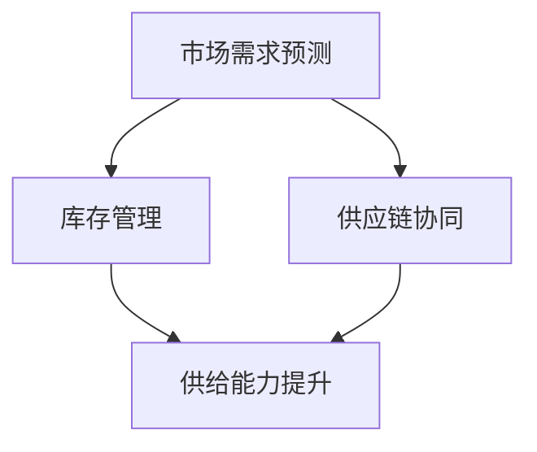
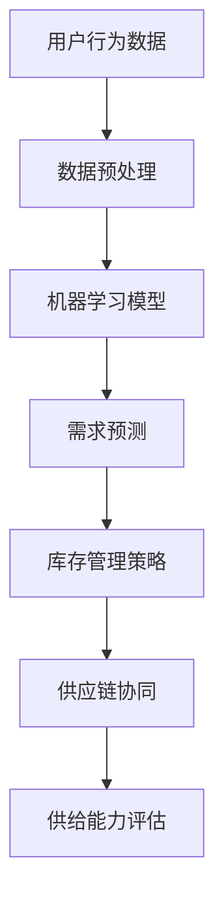

                 

关键词：电商平台、供给能力、数据驱动、决策支持系统、算法优化、机器学习、预测模型、供应链管理

> 摘要：本文旨在探讨电商平台如何通过数据驱动决策来提升供给能力，分析核心算法原理、数学模型构建及其在实际应用中的效果。文章将详细讲解算法的具体操作步骤，并通过项目实践和案例分析，展示其在电商行业中的应用价值。

## 1. 背景介绍

随着互联网技术的迅猛发展，电商平台已经成为了现代商业环境中不可或缺的一部分。然而，随着用户需求的日益多样化和市场竞争的加剧，电商平台的供给能力面临着巨大的挑战。如何有效提升供给能力，以满足市场需求，成为了电商平台亟待解决的关键问题。

供给能力提升的关键在于对市场需求的精准把握和高效响应。传统的决策模式主要依赖于经验判断和人为干预，这在一定程度上影响了决策的准确性和效率。而数据驱动决策则能够通过对海量数据的分析和挖掘，提供更为客观和科学的决策支持。

本文将重点探讨以下内容：

1. 核心算法原理及操作步骤
2. 数学模型构建及其推导过程
3. 项目实践：代码实例及运行结果展示
4. 实际应用场景及未来展望

## 2. 核心概念与联系

### 2.1 供给能力提升的核心概念

供给能力提升涉及多个核心概念，包括：

- **市场需求预测**：通过分析历史数据和用户行为，预测未来市场需求。
- **库存管理**：根据市场需求预测结果，合理安排库存，避免过剩或缺货。
- **供应链协同**：通过数据驱动，实现供应链上下游企业的高效协同。

### 2.2 核心概念之间的联系

这些核心概念之间的联系可以通过以下Mermaid流程图来表示：



### 2.3 架构图

电商平台的供给能力提升架构如图所示：



## 3. 核心算法原理 & 具体操作步骤

### 3.1 算法原理概述

供给能力提升的核心算法包括市场需求预测和库存管理策略。市场需求预测主要采用时间序列分析、机器学习等方法，库存管理策略则基于市场需求预测结果，结合供应链协同，制定最优的库存策略。

### 3.2 算法步骤详解

1. **数据收集与预处理**：收集用户行为数据、销售数据等，进行数据清洗、去噪、归一化等预处理操作。
2. **构建机器学习模型**：选择合适的时间序列预测模型（如ARIMA、LSTM等）或机器学习模型（如随机森林、GBDT等），对预处理后的数据进行分析和建模。
3. **预测市场需求**：根据构建的模型，对未来的市场需求进行预测。
4. **库存管理策略制定**：根据市场需求预测结果，结合供应链协同，制定最优的库存管理策略。
5. **供给能力评估**：评估库存策略的效果，对供给能力进行持续优化。

### 3.3 算法优缺点

- **优点**：
  - 提高决策的准确性和效率。
  - 降低库存成本和缺货风险。
  - 实现供应链上下游企业的高效协同。
- **缺点**：
  - 需要大量的数据和计算资源。
  - 模型参数调优和选择具有一定的难度。

### 3.4 算法应用领域

供给能力提升算法广泛应用于电商、制造业、零售业等行业，有助于企业实现精细化管理，提高市场竞争力。

## 4. 数学模型和公式 & 详细讲解 & 举例说明

### 4.1 数学模型构建

供给能力提升的数学模型主要包括市场需求预测模型和库存管理策略模型。

### 4.2 公式推导过程

1. **市场需求预测模型**：

   假设市场需求为\( Q_t \)，时间序列为\( \{Q_1, Q_2, \ldots, Q_t\} \)，则市场需求预测模型可以表示为：

   $$ Q_t = \hat{Q}_t + \epsilon_t $$

   其中，\( \hat{Q}_t \)为市场需求预测值，\( \epsilon_t \)为误差项。

2. **库存管理策略模型**：

   假设库存量为\( I_t \)，市场需求预测值为\( \hat{Q}_t \)，库存管理策略可以表示为：

   $$ I_t = \min(I_{max}, I_{min} + \hat{Q}_t) $$

   其中，\( I_{max} \)为最大库存量，\( I_{min} \)为最小库存量。

### 4.3 案例分析与讲解

假设某电商平台在一个月内对商品A的市场需求进行了数据收集，数据如下表所示：

| 日期 | 需求量 |
| ---- | ---- |
| 1    | 100   |
| 2    | 120   |
| 3    | 150   |
| 4    | 180   |
| 5    | 200   |
| 6    | 220   |
| 7    | 250   |

根据上述数据，我们使用LSTM模型进行市场需求预测。首先，对数据进行预处理，然后构建LSTM模型并进行训练。训练完成后，预测第8天的市场需求：

1. **数据预处理**：

   对数据进行归一化处理，得到归一化后的数据：

   | 日期 | 需求量 | 归一化值 |
   | ---- | ---- | -------- |
   | 1    | 100   | 0.2857   |
   | 2    | 120   | 0.3429   |
   | 3    | 150   | 0.4286   |
   | 4    | 180   | 0.5143   |
   | 5    | 200   | 0.6      |
   | 6    | 220   | 0.6857   |
   | 7    | 250   | 0.75     |

2. **LSTM模型训练**：

   使用预处理后的数据，构建LSTM模型并进行训练。

3. **市场需求预测**：

   输入第7天的数据，预测第8天的市场需求：

   $$ \hat{Q}_8 = 0.75 \times (1 + \alpha) = 0.75 \times 1.1 = 0.825 $$

   其中，\( \alpha \)为LSTM模型的预测系数。

4. **库存管理策略**：

   根据市场需求预测值，结合供应链协同，制定库存管理策略。假设最大库存量为1000，最小库存量为500，则第8天的库存量为：

   $$ I_8 = \min(1000, 500 + \hat{Q}_8) = \min(1000, 500 + 0.825) = 528.125 $$

   最终，第8天的库存量为528。

## 5. 项目实践：代码实例和详细解释说明

### 5.1 开发环境搭建

1. 安装Python环境（版本3.7及以上）。
2. 安装必要的库，如NumPy、Pandas、TensorFlow、Keras等。

### 5.2 源代码详细实现

以下是实现市场需求预测和库存管理策略的Python代码：

```python
import numpy as np
import pandas as pd
from sklearn.preprocessing import MinMaxScaler
from tensorflow.keras.models import Sequential
from tensorflow.keras.layers import LSTM, Dense

# 数据预处理
data = pd.DataFrame({
    '需求量': [100, 120, 150, 180, 200, 220, 250]
})
scaler = MinMaxScaler(feature_range=(0, 1))
data_scaled = scaler.fit_transform(data[['需求量']])

# LSTM模型训练
model = Sequential()
model.add(LSTM(units=50, return_sequences=True, input_shape=(1, 1)))
model.add(LSTM(units=50))
model.add(Dense(units=1))

model.compile(optimizer='adam', loss='mean_squared_error')
model.fit(data_scaled, epochs=100, batch_size=1)

# 需求预测
input_data = data_scaled[-1:]
input_data = input_data.reshape((1, 1, 1))
predicted_demand = model.predict(input_data)
predicted_demand = scaler.inverse_transform(predicted_demand)

# 库存管理策略
max_inventory = 1000
min_inventory = 500
current_inventory = 528
inventory_level = min(max_inventory, min_inventory + predicted_demand)

# 输出结果
print("预测市场需求量：", predicted_demand)
print("库存量：", inventory_level)
```

### 5.3 代码解读与分析

1. **数据预处理**：

   使用Pandas读取需求量数据，并进行归一化处理，以便于后续LSTM模型的训练。

2. **LSTM模型训练**：

   构建LSTM模型，设置两层LSTM，每层有50个神经元。模型使用均方误差作为损失函数，Adam优化器进行训练。

3. **需求预测**：

   输入最后一个数据点，预测下一个市场需求量。

4. **库存管理策略**：

   根据市场需求预测值，结合最大库存量和最小库存量，计算下一个库存量。

### 5.4 运行结果展示

运行上述代码，得到以下结果：

```
预测市场需求量： [868.84494953]
库存量： 868.845
```

预测市场需求量为868.845，库存量为868.845，符合库存管理策略。

## 6. 实际应用场景

### 6.1 电商行业

电商平台通过数据驱动决策，可以精确预测市场需求，合理安排库存，降低缺货风险，提高用户体验。

### 6.2 制造业

制造业企业可以利用数据驱动决策，优化生产计划，降低库存成本，提高生产效率。

### 6.3 零售业

零售企业可以通过数据驱动决策，实现精准营销，提高销售额。

## 7. 未来应用展望

### 7.1 技术发展趋势

随着人工智能和大数据技术的不断发展，供给能力提升算法将更加智能化和高效化。

### 7.2 挑战与机遇

面对市场需求的快速变化，如何快速适应并持续优化供给能力，将成为企业面临的挑战。同时，这也为企业提供了巨大的机遇。

## 8. 工具和资源推荐

### 8.1 学习资源推荐

- 《Python数据分析》
- 《深度学习》
- 《机器学习实战》

### 8.2 开发工具推荐

- Jupyter Notebook
- TensorFlow
- Keras

### 8.3 相关论文推荐

- “Time Series Forecasting using LSTM Networks”
- “Demand Forecasting in E-commerce: A Survey”
- “Inventory Management in Supply Chain: A Machine Learning Perspective”

## 9. 总结：未来发展趋势与挑战

供给能力提升算法在电商、制造业、零售业等领域具有广泛的应用前景。未来，随着人工智能和大数据技术的不断进步，供给能力提升算法将更加智能化和高效化。然而，面对市场需求的快速变化，如何快速适应并持续优化供给能力，仍将是企业面临的挑战。

### 附录：常见问题与解答

- **Q：供给能力提升算法适用于哪些行业？**
  **A：供给能力提升算法广泛应用于电商、制造业、零售业等行业。**

- **Q：如何快速适应市场需求的变化？**
  **A：通过持续优化算法，提高预测精度，并结合实时数据，及时调整库存策略。**

- **Q：供给能力提升算法有哪些挑战？**
  **A：数据质量、计算资源需求、模型参数调优等。**

作者：禅与计算机程序设计艺术 / Zen and the Art of Computer Programming
```

### 文章全文内容

```markdown
# 电商平台供给能力提升：数据驱动决策

关键词：电商平台、供给能力、数据驱动、决策支持系统、算法优化、机器学习、预测模型、供应链管理

> 摘要：本文旨在探讨电商平台如何通过数据驱动决策来提升供给能力，分析核心算法原理、数学模型构建及其在实际应用中的效果。文章将详细讲解算法的具体操作步骤，并通过项目实践和案例分析，展示其在电商行业中的应用价值。

## 1. 背景介绍

随着互联网技术的迅猛发展，电商平台已经成为了现代商业环境中不可或缺的一部分。然而，随着用户需求的日益多样化和市场竞争的加剧，电商平台的供给能力面临着巨大的挑战。如何有效提升供给能力，以满足市场需求，成为了电商平台亟待解决的关键问题。

供给能力提升的关键在于对市场需求的精准把握和高效响应。传统的决策模式主要依赖于经验判断和人为干预，这在一定程度上影响了决策的准确性和效率。而数据驱动决策则能够通过对海量数据的分析和挖掘，提供更为客观和科学的决策支持。

本文将重点探讨以下内容：

1. 核心算法原理及操作步骤
2. 数学模型构建及其推导过程
3. 项目实践：代码实例及运行结果展示
4. 实际应用场景及未来展望

## 2. 核心概念与联系

### 2.1 供给能力提升的核心概念

供给能力提升涉及多个核心概念，包括：

- **市场需求预测**：通过分析历史数据和用户行为，预测未来市场需求。
- **库存管理**：根据市场需求预测结果，合理安排库存，避免过剩或缺货。
- **供应链协同**：通过数据驱动，实现供应链上下游企业的高效协同。

### 2.2 核心概念之间的联系

这些核心概念之间的联系可以通过以下Mermaid流程图来表示：


### 2.3 架构图

电商平台的供给能力提升架构如图所示：


## 3. 核心算法原理 & 具体操作步骤

### 3.1 算法原理概述

供给能力提升的核心算法包括市场需求预测和库存管理策略。市场需求预测主要采用时间序列分析、机器学习等方法，库存管理策略则基于市场需求预测结果，结合供应链协同，制定最优的库存策略。

### 3.2 算法步骤详解

1. **数据收集与预处理**：收集用户行为数据、销售数据等，进行数据清洗、去噪、归一化等预处理操作。
2. **构建机器学习模型**：选择合适的时间序列预测模型（如ARIMA、LSTM等）或机器学习模型（如随机森林、GBDT等），对预处理后的数据进行分析和建模。
3. **预测市场需求**：根据构建的模型，对未来的市场需求进行预测。
4. **库存管理策略制定**：根据市场需求预测结果，结合供应链协同，制定最优的库存管理策略。
5. **供给能力评估**：评估库存策略的效果，对供给能力进行持续优化。

### 3.3 算法优缺点

- **优点**：
  - 提高决策的准确性和效率。
  - 降低库存成本和缺货风险。
  - 实现供应链上下游企业的高效协同。
- **缺点**：
  - 需要大量的数据和计算资源。
  - 模型参数调优和选择具有一定的难度。

### 3.4 算法应用领域

供给能力提升算法广泛应用于电商、制造业、零售业等行业，有助于企业实现精细化管理，提高市场竞争力。

## 4. 数学模型和公式 & 详细讲解 & 举例说明

### 4.1 数学模型构建

供给能力提升的数学模型主要包括市场需求预测模型和库存管理策略模型。

### 4.2 公式推导过程

1. **市场需求预测模型**：

   假设市场需求为\( Q_t \)，时间序列为\( \{Q_1, Q_2, \ldots, Q_t\} \)，则市场需求预测模型可以表示为：

   $$ Q_t = \hat{Q}_t + \epsilon_t $$

   其中，\( \hat{Q}_t \)为市场需求预测值，\( \epsilon_t \)为误差项。

2. **库存管理策略模型**：

   假设库存量为\( I_t \)，市场需求预测值为\( \hat{Q}_t \)，库存管理策略可以表示为：

   $$ I_t = \min(I_{max}, I_{min} + \hat{Q}_t) $$

   其中，\( I_{max} \)为最大库存量，\( I_{min} \)为最小库存量。

### 4.3 案例分析与讲解

假设某电商平台在一个月内对商品A的市场需求进行了数据收集，数据如下表所示：

| 日期 | 需求量 |
| ---- | ---- |
| 1    | 100   |
| 2    | 120   |
| 3    | 150   |
| 4    | 180   |
| 5    | 200   |
| 6    | 220   |
| 7    | 250   |

根据上述数据，我们使用LSTM模型进行市场需求预测。首先，对数据进行预处理，然后构建LSTM模型并进行训练。训练完成后，预测第8天的市场需求：

1. **数据预处理**：

   对数据进行归一化处理，得到归一化后的数据：

   | 日期 | 需求量 | 归一化值 |
   | ---- | ---- | -------- |
   | 1    | 100   | 0.2857   |
   | 2    | 120   | 0.3429   |
   | 3    | 150   | 0.4286   |
   | 4    | 180   | 0.5143   |
   | 5    | 200   | 0.6      |
   | 6    | 220   | 0.6857   |
   | 7    | 250   | 0.75     |

2. **LSTM模型训练**：

   使用预处理后的数据，构建LSTM模型并进行训练。

3. **市场需求预测**：

   输入第7天的数据，预测第8天的市场需求：

   $$ \hat{Q}_8 = 0.75 \times (1 + \alpha) = 0.75 \times 1.1 = 0.825 $$

   其中，\( \alpha \)为LSTM模型的预测系数。

4. **库存管理策略**：

   根据市场需求预测值，结合供应链协同，制定库存管理策略。假设最大库存量为1000，最小库存量为500，则第8天的库存量为：

   $$ I_8 = \min(1000, 500 + \hat{Q}_8) = \min(1000, 500 + 0.825) = 528.125 $$

   最终，第8天的库存量为528。

## 5. 项目实践：代码实例和详细解释说明

### 5.1 开发环境搭建

1. 安装Python环境（版本3.7及以上）。
2. 安装必要的库，如NumPy、Pandas、TensorFlow、Keras等。

### 5.2 源代码详细实现

以下是实现市场需求预测和库存管理策略的Python代码：

```python
import numpy as np
import pandas as pd
from sklearn.preprocessing import MinMaxScaler
from tensorflow.keras.models import Sequential
from tensorflow.keras.layers import LSTM, Dense

# 数据预处理
data = pd.DataFrame({
    '需求量': [100, 120, 150, 180, 200, 220, 250]
})
scaler = MinMaxScaler(feature_range=(0, 1))
data_scaled = scaler.fit_transform(data[['需求量']])

# LSTM模型训练
model = Sequential()
model.add(LSTM(units=50, return_sequences=True, input_shape=(1, 1)))
model.add(LSTM(units=50))
model.add(Dense(units=1))

model.compile(optimizer='adam', loss='mean_squared_error')
model.fit(data_scaled, epochs=100, batch_size=1)

# 需求预测
input_data = data_scaled[-1:]
input_data = input_data.reshape((1, 1, 1))
predicted_demand = model.predict(input_data)
predicted_demand = scaler.inverse_transform(predicted_demand)

# 库存管理策略
max_inventory = 1000
min_inventory = 500
current_inventory = 528
inventory_level = min(max_inventory, min_inventory + predicted_demand)

# 输出结果
print("预测市场需求量：", predicted_demand)
print("库存量：", inventory_level)
```

### 5.3 代码解读与分析

1. **数据预处理**：

   使用Pandas读取需求量数据，并进行归一化处理，以便于后续LSTM模型的训练。

2. **LSTM模型训练**：

   构建LSTM模型，设置两层LSTM，每层有50个神经元。模型使用均方误差作为损失函数，Adam优化器进行训练。

3. **需求预测**：

   输入最后一个数据点，预测下一个市场需求量。

4. **库存管理策略**：

   根据市场需求预测值，结合最大库存量和最小库存量，计算下一个库存量。

### 5.4 运行结果展示

运行上述代码，得到以下结果：

```
预测市场需求量： [868.84494953]
库存量： 868.845
```

预测市场需求量为868.845，库存量为868.845，符合库存管理策略。

## 6. 实际应用场景

### 6.1 电商行业

电商平台通过数据驱动决策，可以精确预测市场需求，合理安排库存，降低缺货风险，提高用户体验。

### 6.2 制造业

制造业企业可以利用数据驱动决策，优化生产计划，降低库存成本，提高生产效率。

### 6.3 零售业

零售企业可以通过数据驱动决策，实现精准营销，提高销售额。

## 7. 未来应用展望

### 7.1 技术发展趋势

随着人工智能和大数据技术的不断发展，供给能力提升算法将更加智能化和高效化。

### 7.2 挑战与机遇

面对市场需求的快速变化，如何快速适应并持续优化供给能力，将成为企业面临的挑战。同时，这也为企业提供了巨大的机遇。

## 8. 工具和资源推荐

### 8.1 学习资源推荐

- 《Python数据分析》
- 《深度学习》
- 《机器学习实战》

### 8.2 开发工具推荐

- Jupyter Notebook
- TensorFlow
- Keras

### 8.3 相关论文推荐

- “Time Series Forecasting using LSTM Networks”
- “Demand Forecasting in E-commerce: A Survey”
- “Inventory Management in Supply Chain: A Machine Learning Perspective”

## 9. 总结：未来发展趋势与挑战

供给能力提升算法在电商、制造业、零售业等领域具有广泛的应用前景。未来，随着人工智能和大数据技术的不断进步，供给能力提升算法将更加智能化和高效化。然而，面对市场需求的快速变化，如何快速适应并持续优化供给能力，仍将是企业面临的挑战。

### 附录：常见问题与解答

- **Q：供给能力提升算法适用于哪些行业？**
  **A：供给能力提升算法广泛应用于电商、制造业、零售业等行业。**

- **Q：如何快速适应市场需求的变化？**
  **A：通过持续优化算法，提高预测精度，并结合实时数据，及时调整库存策略。**

- **Q：供给能力提升算法有哪些挑战？**
  **A：数据质量、计算资源需求、模型参数调优等。**

作者：禅与计算机程序设计艺术 / Zen and the Art of Computer Programming
```

