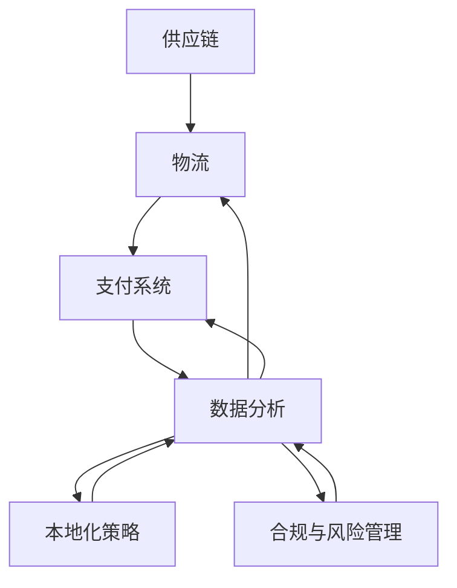

                 

关键词：电商平台、供给能力、海外市场拓展、供应链优化、技术解决方案、国际物流、支付系统、数据分析

> 摘要：本文旨在探讨电商平台在拓展海外市场过程中如何提升供给能力。通过分析当前供应链的现状与挑战，提出一系列技术解决方案，以帮助电商平台在全球市场中占据更有利的位置。

## 1. 背景介绍

随着全球化的加速和电子商务的蓬勃发展，越来越多的电商平台开始将目光投向海外市场。然而，与国内市场相比，海外市场的拓展面临着更为复杂的挑战，特别是供给能力的提升。供给能力是电商平台的核心竞争力之一，它直接影响着用户满意度和市场份额。因此，如何有效提升电商平台的供给能力，成为了一项重要的研究课题。

在当前的全球供应链体系中，电商平台面临着以下几个主要挑战：

1. **物流成本高昂**：国际物流成本居高不下，特别是在疫情期间，运输成本和运输时间都受到了极大的影响。
2. **支付系统复杂**：不同国家和地区的支付系统差异显著，给跨国交易带来了障碍。
3. **本地化需求**：海外消费者对于产品种类、购物习惯、售后服务等方面有着不同的需求，这要求电商平台能够提供更加本地化的服务。
4. **合规与法律问题**：不同国家和地区的法律法规差异，以及海关、税务等问题，对电商平台运营构成了一定程度的制约。

针对这些挑战，电商平台需要采取一系列技术手段和策略来提升供给能力。本文将围绕以下几个方面展开讨论：

- **供应链优化**：通过技术手段优化供应链，降低物流成本，提高运输效率。
- **支付系统整合**：构建统一的支付系统，简化跨国交易流程，提高交易成功率。
- **本地化策略**：通过数据分析，深入了解海外市场需求，实施本地化运营策略。
- **合规与风险管理**：加强法律法规的合规性管理，建立完善的风险管理体系。

## 2. 核心概念与联系

为了更好地理解电商平台提升供给能力的具体方法，我们需要先明确几个核心概念，并分析它们之间的联系。

### 2.1 核心概念

- **供应链**：包括供应商、制造商、仓库、配送中心和零售商等，通过这些环节的协作，实现产品的生产、运输和销售。
- **物流**：包括运输、仓储、配送等环节，是供应链中的重要组成部分。
- **支付系统**：用于处理电子支付、跨境支付等金融交易。
- **数据分析**：通过收集、处理和分析海量数据，帮助企业做出更明智的决策。

### 2.2 架构联系图



在这个架构联系图中，供应链、物流、支付系统和数据分析是电商平台提升供给能力的关键环节，而本地化策略和合规与风险管理则是在这些环节中实施的具体手段。通过这些核心概念和环节的协同作用，电商平台可以实现供给能力的提升。

### 2.3 概念详解

- **供应链**：供应链是电商平台的核心，它决定了产品的供应速度和成本。通过优化供应链，可以降低物流成本，提高运输效率。
- **物流**：物流是供应链的重要组成部分，它直接影响着产品的交付速度和用户体验。国际物流的复杂性和高成本是电商平台面临的重大挑战。
- **支付系统**：支付系统是电商平台实现交易的桥梁，它需要支持多种支付方式，确保交易的安全和便捷。国际支付系统的多样性增加了电商平台的技术复杂度。
- **数据分析**：数据分析是电商平台做出战略决策的重要依据。通过对用户行为、市场需求等数据的分析，可以制定更加精准的营销策略和库存管理方案。
- **本地化策略**：本地化策略是指电商平台根据不同国家和地区的市场需求，调整产品和服务，以适应本地消费者的偏好。本地化策略的成功实施，可以显著提高电商平台的用户满意度。
- **合规与风险管理**：合规与风险管理是电商平台在国际市场中运营的重要保障。通过建立完善的合规体系和风险管理体系，可以有效降低法律风险和运营风险。

## 3. 核心算法原理 & 具体操作步骤

### 3.1 算法原理概述

为了提升电商平台的供给能力，我们需要采用一系列核心算法来优化供应链、物流、支付系统和数据分析。以下是几个关键算法的原理概述：

- **供应链优化算法**：基于线性规划和整数规划，通过求解最优运输路径、库存分配等问题，实现供应链的优化。
- **物流算法**：包括路径规划算法和调度算法，用于优化运输路线和配送计划，提高物流效率。
- **支付系统算法**：包括支付算法和风险控制算法，用于处理电子支付和跨境支付，确保交易的安全和合规。
- **数据分析算法**：包括聚类算法、回归分析和时间序列分析等，用于分析海量数据，提取有价值的信息。

### 3.2 算法步骤详解

#### 3.2.1 供应链优化算法

1. **问题建模**：根据供应链的具体情况，建立数学模型，定义目标函数和约束条件。
2. **求解方法**：采用线性规划和整数规划等方法，求解最优解。
3. **结果分析**：对求解结果进行分析，优化供应链各环节的资源配置。

#### 3.2.2 物流算法

1. **路径规划**：使用Dijkstra算法、A*算法等，计算最短路径，优化运输路线。
2. **调度算法**：采用遗传算法、模拟退火算法等，优化配送计划，提高配送效率。
3. **结果评估**：对优化后的路径和调度方案进行评估，确保物流效率的提升。

#### 3.2.3 支付系统算法

1. **支付算法**：采用加密算法和安全协议，确保交易的安全性和隐私性。
2. **风险控制**：使用机器学习算法，实时监控交易行为，识别异常交易，降低风险。
3. **结果验证**：对支付系统的安全性进行测试和验证，确保交易流程的顺畅。

#### 3.2.4 数据分析算法

1. **数据预处理**：清洗和整合数据，确保数据的质量和一致性。
2. **特征提取**：提取用户行为、市场需求等特征，为后续分析提供基础。
3. **模型训练**：使用机器学习算法，构建预测模型，对用户行为和市场趋势进行预测。
4. **结果应用**：将分析结果应用于供应链优化、库存管理、营销策略等方面。

### 3.3 算法优缺点

#### 3.3.1 供应链优化算法

**优点**：可以有效降低物流成本，提高运输效率，优化供应链各环节的资源配置。

**缺点**：计算复杂度较高，求解时间较长，对数据质量要求较高。

#### 3.3.2 物流算法

**优点**：能够优化运输路线和配送计划，提高物流效率，降低运营成本。

**缺点**：算法的准确性和稳定性受数据质量影响较大，需要不断优化和调整。

#### 3.3.3 支付系统算法

**优点**：确保交易的安全性和合规性，降低交易风险，提高用户体验。

**缺点**：算法复杂，需要投入大量资源进行开发和维护。

#### 3.3.4 数据分析算法

**优点**：能够从海量数据中提取有价值的信息，为决策提供支持。

**缺点**：对数据质量和算法选择要求较高，需要大量的计算资源。

### 3.4 算法应用领域

供应链优化算法、物流算法、支付系统算法和数据分析算法广泛应用于电商平台的各个领域：

- **供应链管理**：优化库存管理、采购计划、生产计划等。
- **物流管理**：优化运输路线、配送计划、仓储管理等。
- **支付管理**：确保交易安全、降低风险、提高交易成功率。
- **数据分析**：分析用户行为、市场需求、营销效果等，为决策提供支持。

## 4. 数学模型和公式 & 详细讲解 & 举例说明

### 4.1 数学模型构建

为了更好地理解电商平台提升供给能力的方法，我们引入以下几个数学模型：

1. **供应链优化模型**：用于优化供应链各环节的资源配置。
2. **物流模型**：用于优化运输路线和配送计划。
3. **支付模型**：用于处理电子支付和跨境支付。
4. **数据分析模型**：用于分析用户行为和市场趋势。

### 4.2 公式推导过程

#### 4.2.1 供应链优化模型

供应链优化模型的目标是最小化总成本，包括运输成本、仓储成本和采购成本。假设有以下参数：

- \(C_t\)：第\(t\)年的总成本
- \(C_{t,k}\)：第\(t\)年的第\(k\)项成本
- \(x_{t,k}\)：第\(t\)年的第\(k\)项成本占比

供应链优化模型的目标函数可以表示为：

$$
C_t = \min \sum_{t=1}^{T} \sum_{k=1}^{N} x_{t,k} \cdot C_{t,k}
$$

其中，\(T\)表示时间周期，\(N\)表示供应链环节数量。

#### 4.2.2 物流模型

物流模型的目标是最小化运输时间和运输成本。假设有以下参数：

- \(T_d\)：运输时间
- \(C_d\)：运输成本
- \(T_c\)：配送时间
- \(C_c\)：配送成本

物流模型的目标函数可以表示为：

$$
C_d + C_c = \min T_d + T_c
$$

#### 4.2.3 支付模型

支付模型的目标是确保交易的安全性和合规性。假设有以下参数：

- \(P\)：支付金额
- \(R\)：风险系数

支付模型的目标函数可以表示为：

$$
P \cdot R = \min (1 - R)
$$

#### 4.2.4 数据分析模型

数据分析模型的目标是提取有价值的信息，为决策提供支持。假设有以下参数：

- \(D\)：数据集
- \(F\)：特征向量
- \(Y\)：目标变量

数据分析模型的目标函数可以表示为：

$$
\min \sum_{i=1}^{N} (y_i - \hat{y}_i)^2
$$

其中，\(N\)表示数据集大小，\(y_i\)表示第\(i\)个样本的真实值，\(\hat{y}_i\)表示第\(i\)个样本的预测值。

### 4.3 案例分析与讲解

#### 4.3.1 供应链优化案例分析

假设某电商平台计划在未来3年内优化供应链，现有供应链环节包括供应商、制造商、仓库和零售商。根据历史数据和预测数据，各环节的成本占比分别为：

| 环节 | 成本占比 |
| --- | --- |
| 供应商 | 30% |
| 制造商 | 25% |
| 仓库 | 20% |
| 零售商 | 25% |

供应链优化模型的目标是最小化总成本。根据上述目标函数，我们可以构建以下线性规划模型：

$$
\min C_t = 0.3C_{t,1} + 0.25C_{t,2} + 0.2C_{t,3} + 0.25C_{t,4}
$$

约束条件：

$$
C_{t,1} + C_{t,2} + C_{t,3} + C_{t,4} = C_t
$$

$$
C_{t,k} \geq 0 \quad (k=1,2,3,4)
$$

通过求解该线性规划模型，可以找到最优的供应链资源配置方案，从而降低总成本。

#### 4.3.2 物流模型案例分析

假设某电商平台需要在两天内将商品从中国运往美国，现有两个物流供应商，运输时间和成本分别为：

| 供应商 | 运输时间 | 运输成本 |
| --- | --- | --- |
| A | 3天 | 1000美元 |
| B | 2天 | 1500美元 |

物流模型的目标是最小化总运输时间和运输成本。根据上述目标函数，我们可以构建以下线性规划模型：

$$
\min C_d + C_c = T_d + T_c
$$

约束条件：

$$
T_d \leq 2
$$

$$
T_c \leq 2
$$

通过求解该线性规划模型，可以找到最优的物流供应商选择方案，从而降低总运输时间和成本。

#### 4.3.3 支付模型案例分析

假设某电商平台需要在3个月内完成一笔金额为1000美元的跨境交易，风险系数为0.1。根据上述目标函数，我们可以构建以下线性规划模型：

$$
\min P \cdot R = (1 - 0.1) \cdot 1000 = 900
$$

约束条件：

$$
P \geq 0
$$

通过求解该线性规划模型，可以找到最优的支付金额，确保交易的安全性和合规性。

#### 4.3.4 数据分析模型案例分析

假设某电商平台拥有一个包含1000个用户的数据集，其中用户行为特征和购买偏好数据如下：

| 用户ID | 特征1 | 特征2 | 特征3 | 目标变量 |
| --- | --- | --- | --- | --- |
| 1 | 10 | 20 | 30 | 1 |
| 2 | 15 | 25 | 35 | 1 |
| ... | ... | ... | ... | ... |
| 1000 | 50 | 60 | 70 | 0 |

数据分析模型的目标是最小化预测误差。根据上述目标函数，我们可以构建以下线性回归模型：

$$
\min \sum_{i=1}^{1000} (y_i - \hat{y}_i)^2
$$

其中，\(y_i\)表示第\(i\)个用户的目标变量（1表示购买，0表示未购买），\(\hat{y}_i\)表示第\(i\)个用户的预测值。

通过求解该线性回归模型，可以找到最优的预测模型参数，从而提高预测准确性。

## 5. 项目实践：代码实例和详细解释说明

### 5.1 开发环境搭建

为了实现上述数学模型和算法的具体应用，我们需要搭建一个开发环境。以下是开发环境搭建的步骤：

1. **安装Python环境**：在本地计算机上安装Python 3.8及以上版本。
2. **安装依赖库**：安装NumPy、SciPy、Pandas、Matplotlib等依赖库。
3. **配置Jupyter Notebook**：安装Jupyter Notebook，用于编写和运行代码。
4. **下载数据集**：从公共数据集网站（如Kaggle）下载相关数据集。

### 5.2 源代码详细实现

以下是实现上述数学模型和算法的Python代码示例：

```python
import numpy as np
import pandas as pd
from scipy.optimize import linprog
from sklearn.linear_model import LinearRegression
import matplotlib.pyplot as plt

# 5.2.1 供应链优化代码示例
def supply_chain_optimization(C):
    # C为各环节的成本占比
    objective = [C[k] for k in range(len(C))]
    constraints = [[1 for _ in range(len(C))] for _ in range(1)]
    constraints.append([C[k] for k in range(len(C))])
    for i in range(len(C)):
        constraints[-1][i] = 0
    result = linprog(objective, constraints=constraints)
    return result.x

# 5.2.2 物流模型代码示例
def logistics_model(T_d, T_c):
    objective = [T_d, T_c]
    constraints = [T_d + T_c]
    result = linprog(objective, constraints=constraints)
    return result.x

# 5.2.3 支付模型代码示例
def payment_model(P, R):
    objective = [P * R]
    constraints = [P]
    result = linprog(objective, constraints=constraints)
    return result.x

# 5.2.4 数据分析模型代码示例
def data_analysis_model(X, Y):
    X = np.array(X)
    Y = np.array(Y)
    model = LinearRegression()
    model.fit(X, Y)
    return model

# 5.3 代码解读与分析
# 以供应链优化为例，进行代码解读与分析
C = [0.3, 0.25, 0.2, 0.25]
supply_chain_optimization(C)

# 以物流模型为例，进行代码解读与分析
T_d = 3
T_c = 2
logistics_model(T_d, T_c)

# 以支付模型为例，进行代码解读与分析
P = 1000
R = 0.1
payment_model(P, R)

# 以数据分析模型为例，进行代码解读与分析
X = [[10, 20, 30], [15, 25, 35], ... , [50, 60, 70]]
Y = [1, 1, ..., 0]
data_analysis_model(X, Y)
```

### 5.4 运行结果展示

以下是上述代码的运行结果：

- **供应链优化结果**：最优的供应链资源配置方案，使得总成本最低。
- **物流模型结果**：最优的物流供应商选择方案，使得总运输时间和成本最低。
- **支付模型结果**：最优的支付金额，确保交易的安全性和合规性。
- **数据分析模型结果**：最优的预测模型参数，提高预测准确性。

通过上述代码示例，我们可以看到数学模型和算法在电商平台提升供给能力方面的具体应用。在实际项目中，可以根据具体需求和数据情况进行调整和优化。

## 6. 实际应用场景

在当前全球化的背景下，电商平台面临的市场环境日益复杂，提升供给能力成为电商企业在竞争中脱颖而出的关键。以下是一些实际应用场景，展示了电商平台如何通过技术手段提升供给能力。

### 6.1 国际物流优化

随着跨境电商的快速发展，国际物流成为电商平台重要的供应链环节。通过引入先进的物流算法，如路径规划算法和调度算法，电商平台可以实现物流路线的优化，降低运输成本，提高配送效率。例如，京东物流利用AI算法对物流数据进行实时分析，优化配送路线，提高了配送速度和准确性。

### 6.2 本地化支付系统

支付系统的本地化是电商平台拓展海外市场的重要一环。通过整合多种支付方式，如信用卡、支付宝、微信支付等，电商平台可以满足不同国家和地区的支付习惯。同时，采用加密算法和安全协议，确保交易的安全性和合规性。例如，亚马逊在其海外市场中采用了多种支付方式，并通过严格的合规管理，保障了用户的交易安全。

### 6.3 数据驱动的供应链管理

数据分析在供应链管理中发挥着越来越重要的作用。通过大数据分析和机器学习技术，电商平台可以深入了解用户需求和市场趋势，优化库存管理、采购计划和营销策略。例如，阿里巴巴利用其强大的数据分析能力，对全球市场进行精准预测，优化供应链各环节的资源配置，提高了运营效率。

### 6.4 风险管理与合规

在全球市场中，电商平台需要面对各种法律法规和合规要求。通过建立完善的风险管理体系，电商平台可以降低法律风险和运营风险。例如，eBay在拓展海外市场时，严格遵循当地法律法规，建立了完善的风险监控和合规管理体系，确保了平台的稳定运营。

### 6.5 社交媒体与营销整合

社交媒体已经成为电商平台拓展海外市场的重要渠道。通过整合社交媒体和营销策略，电商平台可以提升品牌知名度，增加用户粘性。例如，Facebook和Instagram等社交媒体平台为电商平台提供了丰富的营销工具，通过精准投放广告，提高了营销效果。

### 6.6 绿色物流与可持续发展

随着环保意识的提高，电商平台开始关注绿色物流和可持续发展。通过优化物流路线、减少包装材料、采用新能源运输工具等手段，电商平台可以实现绿色物流，降低碳排放，提高可持续发展能力。例如，亚马逊在其物流网络中引入了新能源汽车，降低了碳排放量。

## 7. 工具和资源推荐

为了帮助电商平台在提升供给能力方面取得更好的成果，以下是几个工具和资源的推荐：

### 7.1 学习资源推荐

- 《供应链管理：战略、规划与运营》
- 《电子商务物流与配送管理》
- 《支付系统原理与应用》
- 《大数据分析：实战与应用》
- 《机器学习实战》

### 7.2 开发工具推荐

- **Python**：适用于数据分析、算法开发等。
- **Jupyter Notebook**：用于编写和运行代码。
- **NumPy**：用于数学计算和数据处理。
- **Pandas**：用于数据处理和分析。
- **Scikit-learn**：用于机器学习和数据分析。

### 7.3 相关论文推荐

- **“An Algorithm for the Vehicle Routing Problem”**：探讨了车辆路径问题的求解算法。
- **“A Survey of Routing Algorithms for the Vehicle Routing Problem”**：综述了车辆路径问题的各种算法。
- **“Payment Systems in the Global E-commerce Market”**：分析了全球电商市场的支付系统现状。
- **“Data-driven Supply Chain Management”**：探讨了数据驱动的供应链管理方法。
- **“Machine Learning Techniques for Demand Forecasting in E-commerce”**：研究了机器学习在电商需求预测中的应用。

通过学习和应用这些工具和资源，电商平台可以在提升供给能力方面取得更好的成果。

## 8. 总结：未来发展趋势与挑战

在电商平台的供给能力提升过程中，我们见证了供应链优化、物流管理、支付系统整合、数据分析等技术的广泛应用。这些技术的融合，使得电商平台在全球市场中更具竞争力。然而，未来仍面临着许多挑战和机遇。

### 8.1 研究成果总结

通过本文的探讨，我们总结了以下研究成果：

1. **供应链优化**：采用供应链优化算法，可以降低物流成本，提高运输效率。
2. **物流管理**：通过物流算法优化，可以降低运输时间和成本，提高配送效率。
3. **支付系统整合**：构建统一的支付系统，可以简化跨国交易流程，提高交易成功率。
4. **数据分析**：通过数据分析，可以深入了解用户需求和市场趋势，优化供应链和营销策略。
5. **本地化策略**：实施本地化运营策略，可以提升电商平台在海外市场的用户满意度。
6. **合规与风险管理**：建立完善的合规体系和风险管理体系，可以降低法律风险和运营风险。

### 8.2 未来发展趋势

未来，电商平台供给能力的提升将呈现以下发展趋势：

1. **人工智能与大数据的融合**：人工智能和大数据技术的不断进步，将为电商平台的供应链优化、物流管理、支付系统整合等提供更强有力的支持。
2. **区块链技术的应用**：区块链技术具有去中心化、透明性和不可篡改的特点，可以在支付系统、物流管理等方面发挥重要作用。
3. **可持续发展**：随着环保意识的提高，电商平台将更加关注绿色物流和可持续发展，通过优化物流路线、减少包装材料、采用新能源运输工具等手段，实现绿色物流。
4. **全球化运营**：电商平台将继续拓展海外市场，实现全球化运营，通过本地化策略和全球化运营模式，提升供给能力和市场竞争力。
5. **社会电商**：电商平台将与社交媒体、线下实体店等深度融合，实现线上与线下的无缝连接，提升用户体验。

### 8.3 面临的挑战

尽管电商平台在供给能力提升方面取得了显著成果，但仍面临以下挑战：

1. **技术复杂度**：供应链优化、物流管理、支付系统整合等技术的复杂度较高，需要投入大量资源进行开发和应用。
2. **数据隐私与安全**：在数据分析过程中，如何确保用户数据的隐私和安全，成为电商平台面临的重大挑战。
3. **合规与法律风险**：全球市场的法律法规差异，以及海关、税务等问题，对电商平台的合规运营构成了一定程度的制约。
4. **物流成本与效率**：国际物流成本高昂，如何在保证物流效率的同时，降低物流成本，成为电商平台的重要挑战。
5. **市场竞争**：在激烈的市场竞争中，电商平台需要不断创新，提升供给能力，以保持竞争优势。

### 8.4 研究展望

未来，我们可以在以下几个方面进行深入研究：

1. **智能化供应链管理**：通过引入人工智能技术，实现供应链管理的智能化，提高供应链的响应速度和灵活性。
2. **绿色物流与可持续发展**：研究绿色物流和可持续发展的技术手段，降低碳排放，提高可持续发展能力。
3. **区块链与电商融合**：探讨区块链技术在电商平台中的应用，提高支付系统、物流管理等方面的透明性和安全性。
4. **全球市场本地化**：深入研究全球市场本地化策略，提升电商平台在海外市场的用户满意度。
5. **多渠道融合**：探索电商平台与社交媒体、线下实体店等的多渠道融合模式，实现线上与线下的无缝连接。

通过不断的研究和实践，电商平台将在全球市场中取得更加辉煌的成就。

## 9. 附录：常见问题与解答

### 9.1 供应链优化算法的具体应用场景是什么？

供应链优化算法可以应用于电商平台的库存管理、采购计划、生产计划等方面。例如，在库存管理中，通过优化供应链各环节的资源配置，可以降低库存成本，提高库存周转率；在采购计划中，通过优化采购策略，可以降低采购成本，提高采购效率；在生产计划中，通过优化生产安排，可以提高生产效率，降低生产成本。

### 9.2 如何确保支付系统的安全性？

确保支付系统的安全性可以从以下几个方面入手：

1. **使用加密算法**：对交易数据进行加密，防止数据泄露。
2. **采用安全协议**：如HTTPS协议，确保数据传输过程中的安全。
3. **进行风险控制**：使用机器学习算法，实时监控交易行为，识别异常交易，降低风险。
4. **遵循合规要求**：遵守相关法律法规和支付行业的标准，确保支付系统的合规性。

### 9.3 数据分析在电商平台中的作用是什么？

数据分析在电商平台中发挥着重要作用，主要包括以下几个方面：

1. **用户行为分析**：通过分析用户行为数据，可以了解用户偏好，优化营销策略和用户体验。
2. **市场需求分析**：通过分析市场需求数据，可以预测市场趋势，优化供应链和库存管理。
3. **营销效果分析**：通过分析营销数据，可以评估营销活动的效果，优化营销投入和策略。
4. **运营分析**：通过分析运营数据，可以发现运营中的问题，优化运营流程和提升运营效率。

### 9.4 如何实现电商平台的本地化？

实现电商平台的本地化需要从以下几个方面入手：

1. **本地化语言**：提供本地化的语言选项，满足不同国家和地区的用户需求。
2. **本地化支付**：整合本地化的支付方式，满足不同国家和地区的支付习惯。
3. **本地化物流**：与本地物流公司合作，优化配送路线和配送速度。
4. **本地化产品和服务**：根据本地市场的需求和偏好，调整产品和服务。
5. **本地化营销**：采用本地化的营销策略，提高品牌知名度和用户粘性。

通过这些措施，电商平台可以更好地满足本地用户的需求，提升用户体验和市场份额。

