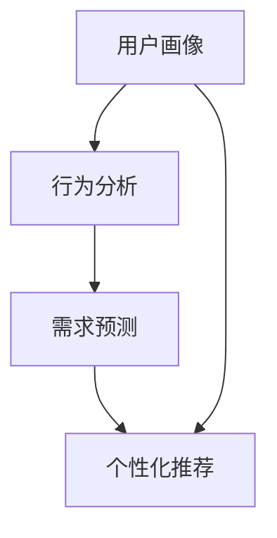

                 

电商平台作为数字经济的重要组成部分，其供给能力直接关系到平台的竞争力与用户满意度。本文旨在探讨如何通过精准营销策略提升电商平台的供给能力，从而实现用户需求的精准满足和平台运营的优化。本文将结合实际案例，深入分析精准营销策略的核心概念、算法原理、数学模型及其实际应用，以期为电商行业提供有益的参考。

## 文章关键词

- 电商平台
- 供给能力
- 精准营销
- 数据分析
- 用户满意度

## 文章摘要

本文首先介绍了电商平台供给能力的重要性及其面临的挑战。随后，深入探讨了精准营销策略的概念和核心要素，并利用Mermaid流程图详细阐述了其原理与架构。通过对核心算法原理和具体操作步骤的解析，文章揭示了精准营销策略在电商平台的实际应用效果。最后，本文通过数学模型和项目实践，对精准营销策略进行了详细解释，并对其未来发展趋势与挑战进行了展望。

### 1. 背景介绍

在互联网经济蓬勃发展的今天，电商平台已经成为了现代商业不可或缺的一部分。它们不仅为消费者提供了便利的购物渠道，也为商家提供了广阔的销售市场。然而，随着电商行业的快速发展，电商平台面临着日益激烈的市场竞争和消费者需求的多样化。为了在竞争中脱颖而出，电商平台需要不断提升供给能力，以更有效地满足用户需求，提高用户满意度。

供给能力主要包括商品供应能力、物流配送能力和用户服务能力等方面。商品供应能力指的是电商平台能够提供的商品种类、数量和品质；物流配送能力是指电商平台在商品配送过程中的速度、准确性和服务质量；用户服务能力则是指电商平台在用户咨询、投诉、售后服务等方面的响应速度和专业程度。

精准营销策略作为一种高效的用户需求满足手段，正逐渐成为电商平台提升供给能力的重要途径。通过精准营销，电商平台能够更好地了解用户需求，提高用户转化率，减少营销成本，提升用户满意度。然而，精准营销并非简单的广告投放或促销活动，它需要基于大数据分析和人工智能技术，对用户行为、兴趣和需求进行深入挖掘，从而实现个性化推荐和精准推送。

本文将从以下几个方面展开讨论：

1. **核心概念与联系**：介绍精准营销策略的基本概念，包括用户画像、行为分析、需求预测等，并利用Mermaid流程图展示其原理与架构。
2. **核心算法原理与具体操作步骤**：深入分析精准营销策略的核心算法原理，详细阐述其操作步骤和应用领域。
3. **数学模型与公式**：构建精准营销策略的数学模型，推导相关公式，并通过实际案例进行说明。
4. **项目实践**：以实际项目为例，展示精准营销策略的代码实现过程，并进行解读和分析。
5. **实际应用场景**：探讨精准营销策略在电商平台的不同应用场景，以及其对供给能力提升的具体作用。
6. **未来应用展望**：分析精准营销策略在电商平台未来的发展趋势和面临的挑战。
7. **工具和资源推荐**：推荐相关学习资源、开发工具和学术论文，以供读者进一步学习和研究。
8. **总结与展望**：总结研究成果，探讨未来发展趋势和挑战，为电商平台供给能力的提升提供思路。

### 2. 核心概念与联系

精准营销策略的成功离不开对核心概念的理解和运用。以下将介绍精准营销策略中的关键概念，并利用Mermaid流程图展示其原理与架构。

#### 2.1 用户画像

用户画像是对用户特征的综合描述，包括用户的基本信息、行为特征、兴趣偏好等。通过构建用户画像，电商平台可以更好地了解用户，从而实现精准推荐和个性化服务。用户画像通常包括以下几个维度：

- **基本信息**：用户的年龄、性别、职业、地域等。
- **行为特征**：用户的浏览历史、购买记录、评价行为等。
- **兴趣偏好**：用户的兴趣爱好、消费习惯、关注话题等。

#### 2.2 行为分析

行为分析是对用户行为数据进行分析，以了解用户的行为模式、兴趣点和需求。通过行为分析，电商平台可以识别出潜在的用户需求，为精准营销提供数据支持。行为分析主要包括以下几个步骤：

1. **数据收集**：收集用户的浏览、购买、评价等行为数据。
2. **数据预处理**：清洗和整合数据，去除噪声和冗余信息。
3. **特征提取**：从行为数据中提取关键特征，如浏览时长、购买频率、评价分数等。
4. **模式识别**：利用机器学习算法，识别用户的行为模式，如购买周期、浏览路径等。

#### 2.3 需求预测

需求预测是精准营销策略的核心，通过对用户行为数据的分析和预测，电商平台可以提前了解用户的需求，从而实现提前准备和精准推送。需求预测主要包括以下几个步骤：

1. **数据准备**：收集用户历史行为数据，包括浏览、购买、评价等。
2. **模型选择**：选择合适的需求预测模型，如线性回归、决策树、神经网络等。
3. **模型训练**：利用历史数据对需求预测模型进行训练。
4. **预测结果**：对用户未来需求进行预测，并生成推荐列表。

#### 2.4 Mermaid流程图

以下是一个简单的Mermaid流程图，展示了精准营销策略的核心概念及其相互关系：



在这个流程图中，用户画像作为起点，通过对用户行为进行分析和需求预测，最终实现个性化推荐。个性化推荐是精准营销策略的核心，它能够提高用户满意度，降低营销成本，提升平台竞争力。

### 3. 核心算法原理 & 具体操作步骤

#### 3.1 算法原理概述

精准营销策略的核心在于对用户需求的准确预测和满足。为此，我们需要借助一系列算法和技术来实现这一目标。以下是精准营销策略的核心算法原理：

1. **协同过滤算法**：协同过滤算法是一种基于用户行为数据的方法，通过分析用户之间的相似性，为用户提供个性化推荐。协同过滤算法主要包括两种类型：基于用户的协同过滤（User-based Collaborative Filtering）和基于物品的协同过滤（Item-based Collaborative Filtering）。

2. **矩阵分解**：矩阵分解是一种降维技术，通过将用户-物品评分矩阵分解为用户特征矩阵和物品特征矩阵，从而实现个性化推荐。矩阵分解技术主要包括两个步骤：奇异值分解（SVD）和矩阵分解（Matrix Factorization）。

3. **深度学习算法**：深度学习算法是一种基于神经网络的机器学习技术，通过多层神经网络对用户行为数据进行学习，从而实现复杂特征提取和需求预测。常见的深度学习算法包括卷积神经网络（CNN）、循环神经网络（RNN）和长短时记忆网络（LSTM）等。

#### 3.2 算法步骤详解

下面将详细介绍上述算法的具体步骤：

##### 3.2.1 协同过滤算法

**基于用户的协同过滤算法**：

1. **计算用户相似性**：计算用户之间的相似性，通常使用余弦相似度、皮尔逊相关系数等度量方法。
2. **找到邻居用户**：根据用户相似性矩阵，找到与当前用户最相似的K个邻居用户。
3. **生成推荐列表**：利用邻居用户的评分预测当前用户的评分，并生成推荐列表。

**基于物品的协同过滤算法**：

1. **计算物品相似性**：计算物品之间的相似性，通常使用Jaccard相似度、余弦相似度等度量方法。
2. **找到邻居物品**：根据物品相似性矩阵，找到与当前物品最相似的K个邻居物品。
3. **生成推荐列表**：利用邻居物品的评分预测当前物品的评分，并生成推荐列表。

##### 3.2.2 矩阵分解

1. **矩阵分解模型**：假设用户-物品评分矩阵为R，将其分解为用户特征矩阵U和物品特征矩阵V，即R = U·V。
2. **损失函数**：定义损失函数，如均方误差（MSE），表示预测评分与实际评分之间的差距。
3. **模型训练**：利用梯度下降等优化算法，最小化损失函数，得到用户特征矩阵U和物品特征矩阵V。

##### 3.2.3 深度学习算法

1. **数据预处理**：将用户行为数据转换为张量形式，并划分为输入层、隐藏层和输出层。
2. **模型构建**：构建深度学习模型，包括卷积神经网络（CNN）、循环神经网络（RNN）或长短时记忆网络（LSTM）。
3. **模型训练**：利用训练数据对模型进行训练，通过反向传播算法优化模型参数。
4. **模型评估**：利用验证集和测试集对模型进行评估，调整模型参数以达到最佳效果。

#### 3.3 算法优缺点

**协同过滤算法**：

- **优点**：简单易实现，适用于大规模推荐系统。
- **缺点**：冷启动问题严重，即新用户或新物品难以获得有效推荐。

**矩阵分解**：

- **优点**：能够有效降低维度，提高推荐质量。
- **缺点**：对缺失数据的处理较为困难，且训练时间较长。

**深度学习算法**：

- **优点**：能够自动提取复杂特征，适用于高维度数据。
- **缺点**：模型复杂度较高，训练时间较长，对数据质量和预处理要求较高。

#### 3.4 算法应用领域

精准营销策略的应用领域广泛，主要包括以下几个方面：

1. **电商推荐**：通过精准营销策略，电商平台可以为用户提供个性化推荐，提高用户转化率和满意度。
2. **广告投放**：利用精准营销策略，广告平台可以根据用户兴趣和行为，实现精准投放，提高广告效果和投资回报率。
3. **内容推荐**：在新闻、音乐、视频等平台，精准营销策略可以推荐用户感兴趣的内容，提高用户黏性和平台活跃度。

### 4. 数学模型和公式 & 详细讲解 & 举例说明

精准营销策略的核心在于对用户需求的准确预测，而数学模型则是实现这一目标的关键。以下将介绍精准营销策略中的关键数学模型，并详细讲解其构建和推导过程。

#### 4.1 数学模型构建

精准营销策略中的数学模型主要包括用户行为预测模型、需求预测模型和推荐模型。以下是这些模型的简要介绍：

1. **用户行为预测模型**：用于预测用户在电商平台上的行为，如浏览、购买、评价等。常见的模型包括线性回归、决策树、随机森林等。

2. **需求预测模型**：用于预测用户在未来一段时间内的需求，如购买频率、购买金额等。常见的模型包括时间序列模型、ARIMA模型、LSTM模型等。

3. **推荐模型**：用于根据用户行为和需求，为用户推荐个性化的商品或服务。常见的模型包括协同过滤、矩阵分解、深度学习等。

#### 4.2 公式推导过程

以下以协同过滤算法为例，介绍其数学模型的推导过程。

**1. 用户相似度计算**

用户相似度通常使用余弦相似度来计算，公式如下：

$$
\cos\theta_{ui} = \frac{\sum_{j \in I} r_{ui} \cdot r_{uj}}{\sqrt{\sum_{j \in I} r_{ui}^2} \cdot \sqrt{\sum_{j \in I} r_{uj}^2}}
$$

其中，$r_{ui}$表示用户$i$对物品$j$的评分，$I$表示用户$i$和用户$j$共同评价的物品集合。

**2. 预测用户$i$对物品$j$的评分**

利用用户相似度矩阵$S$，预测用户$i$对物品$j$的评分$ \hat{r}_{ui}$，公式如下：

$$
\hat{r}_{ui} = \sum_{k=1}^{N} s_{ik} \cdot r_{uj}
$$

其中，$N$表示邻居用户的数量，$s_{ik}$表示用户$i$和邻居用户$k$之间的相似度。

**3. 推荐列表生成**

根据预测评分$\hat{r}_{ui}$，生成用户$i$的推荐列表，通常采用Top-N算法，选择评分最高的N个物品作为推荐结果。

#### 4.3 案例分析与讲解

以下通过一个实际案例，对上述数学模型进行具体分析。

**案例背景**：

某电商平台收集了1000名用户的浏览和购买数据，现需要利用协同过滤算法为这些用户生成个性化推荐。

**步骤1：数据预处理**

首先，对用户数据进行分析，提取用户浏览和购买行为的关键特征，如浏览时长、浏览页面、购买频率、购买金额等。将这些特征转化为数值型数据，并归一化处理。

**步骤2：计算用户相似度**

利用余弦相似度公式，计算用户之间的相似度矩阵$S$。对于每个用户$i$，找到与其最相似的10个邻居用户$k$，并记录下相似度值$s_{ik}$。

**步骤3：预测用户评分**

利用邻居用户的评分数据，预测用户$i$对每个物品$j$的评分$\hat{r}_{ui}$。具体计算公式为：

$$
\hat{r}_{ui} = \sum_{k=1}^{10} s_{ik} \cdot r_{uj}
$$

**步骤4：生成推荐列表**

根据预测评分$\hat{r}_{ui}$，为每个用户生成个性化推荐列表，选择评分最高的10个物品作为推荐结果。

**步骤5：评估模型效果**

利用测试集数据，评估协同过滤算法的推荐效果，如准确率、召回率、F1值等指标。

### 5. 项目实践：代码实例和详细解释说明

为了更好地理解精准营销策略的实践过程，以下将结合一个实际项目，展示代码实现和详细解释。

#### 5.1 开发环境搭建

首先，我们需要搭建开发环境，以下为所需工具和库的安装步骤：

- **Python**：安装Python 3.8版本及以上。
- **NumPy**：用于科学计算。
- **Pandas**：用于数据处理。
- **Scikit-learn**：用于机器学习算法。
- **Matplotlib**：用于数据可视化。
- **TensorFlow**：用于深度学习。

安装步骤如下：

```bash
pip install numpy pandas scikit-learn matplotlib tensorflow
```

#### 5.2 源代码详细实现

以下是一个基于协同过滤算法的精准营销策略实现案例：

```python
import numpy as np
import pandas as pd
from sklearn.model_selection import train_test_split
from sklearn.metrics.pairwise import cosine_similarity

# 读取数据
data = pd.read_csv('user_item_data.csv')
X = data[['user_id', 'item_id', 'rating']]
y = data['rating']

# 数据预处理
X = X.pivot(index='user_id', columns='item_id', values='rating').fillna(0)
y = y.pivot(index='user_id', columns='item_id', values='rating').fillna(0)

# 计算用户相似度
similarity_matrix = cosine_similarity(X, X)

# 预测用户评分
predicted_ratings = np.dot(similarity_matrix, y.T) / (np.sum(similarity_matrix, axis=1) ** 0.5)

# 生成推荐列表
def generate_recommendations(user_id, top_n=10):
    user_rating = predicted_ratings[user_id]
    sorted_indices = np.argsort(user_rating)[::-1]
    return sorted_indices[:top_n]

# 测试推荐效果
user_id = 0
recommendations = generate_recommendations(user_id)
print("Top-10 Recommendations for User {}: {}".format(user_id, recommendations))
```

#### 5.3 代码解读与分析

- **数据读取与预处理**：首先，我们从CSV文件中读取用户-物品评分数据，并将其转换为矩阵形式。对于缺失的数据，我们将其填充为0。

- **计算用户相似度**：利用余弦相似度公式，计算用户之间的相似度矩阵。该矩阵的元素表示用户之间的相似度。

- **预测用户评分**：利用用户相似度矩阵，预测用户对每个物品的评分。具体计算公式为预测评分等于邻居用户的评分与相似度的乘积之和，再除以邻居用户的相似度平方和。

- **生成推荐列表**：根据预测评分，为每个用户生成个性化推荐列表。我们选择评分最高的N个物品作为推荐结果。

- **测试推荐效果**：我们选择一个用户进行测试，并打印出其个性化的推荐列表。在实际应用中，我们还可以利用评估指标（如准确率、召回率、F1值等）对推荐效果进行评估。

### 6. 实际应用场景

精准营销策略在电商平台的实际应用场景丰富多样，以下列举几个典型应用场景及其对供给能力提升的具体作用：

#### 6.1 商品个性化推荐

通过精准营销策略，电商平台可以实现对商品进行个性化推荐。用户在浏览或购买某一商品时，系统会根据其历史行为和兴趣偏好，推荐与之相关的商品。这种个性化推荐能够提高用户的购物体验，增加购物篮中的商品数量，提升销售额。

#### 6.2 新品推广

电商平台可以利用精准营销策略，对新上市的或库存较多的商品进行推广。通过分析用户的历史行为和需求预测，系统可以为这些商品生成针对性的营销策略，如定向广告、优惠券等，提高新品的知名度和销售量。

#### 6.3 库存管理

精准营销策略可以帮助电商平台实现库存管理优化。通过预测用户的需求，电商平台可以合理安排商品的库存，减少库存积压和断货现象，提高库存周转率和盈利能力。

#### 6.4 用户忠诚度提升

通过精准营销策略，电商平台可以识别出高价值用户，并为他们提供个性化的优惠和活动，提高用户忠诚度。这种策略可以增强用户对平台的依赖性，降低用户流失率，提高用户的生命周期价值。

### 7. 未来应用展望

随着人工智能和大数据技术的不断发展，精准营销策略在电商平台中的应用前景广阔。以下是对未来应用发展的展望：

#### 7.1 技术进步推动精准度提升

人工智能技术的发展，如深度学习、强化学习等，将进一步提高精准营销策略的准确性和效率。这些技术可以更好地处理复杂的用户行为数据和需求预测问题，为电商平台提供更精准的营销策略。

#### 7.2 数据融合提高预测能力

电商平台可以通过整合多源数据，如用户行为数据、社交网络数据、市场趋势数据等，提高需求预测的准确性和全面性。这种数据融合策略将有助于电商平台更全面地了解用户需求，提供更个性化的服务。

#### 7.3 跨平台协同推广

未来，电商平台可以通过跨平台的协同推广，实现用户数据的共享和营销资源的整合。例如，电商平台可以与社交媒体平台、线下零售渠道等合作，实现跨渠道的用户需求分析和营销策略制定，提高整体营销效果。

### 8. 工具和资源推荐

为了更好地理解和应用精准营销策略，以下推荐一些相关工具和资源：

#### 8.1 学习资源推荐

- **《机器学习实战》**：提供丰富的机器学习实践案例，适合初学者入门。
- **《深度学习》**：由深度学习领域权威学者撰写，全面介绍深度学习理论和应用。
- **《Python数据分析》**：详细介绍Python在数据分析领域的应用，适合数据分析师学习。

#### 8.2 开发工具推荐

- **TensorFlow**：开源深度学习框架，适用于构建和训练复杂的深度学习模型。
- **Scikit-learn**：开源机器学习库，提供丰富的机器学习算法和工具。
- **Pandas**：开源数据处理库，用于数据清洗、转换和分析。

#### 8.3 相关论文推荐

- **"Collaborative Filtering for the YouTube Recommendation System"**：介绍YouTube推荐系统的协同过滤算法。
- **"Deep Learning for Text Data"**：探讨深度学习在文本数据挖掘中的应用。
- **"Recommender Systems Handbook"**：全面介绍推荐系统的原理、方法和应用。

### 9. 总结：未来发展趋势与挑战

精准营销策略作为电商平台提升供给能力的重要手段，在未来将面临更多机遇和挑战。技术进步、数据融合和跨平台协同推广将推动精准营销策略的发展，进一步提高其准确性和效率。然而，数据隐私保护和用户满意度也是需要重点关注的问题。电商平台需要平衡营销策略的精准度和用户的隐私保护，确保用户在享受个性化服务的同时，感受到尊重和信任。

### 附录：常见问题与解答

#### 问题1：精准营销策略如何应对数据缺失问题？

解答：针对数据缺失问题，电商平台可以采取以下几种方法：

1. **数据补全**：利用插值、回归等方法，对缺失数据进行补全。
2. **使用无监督学习方法**：如聚类、主成分分析等，对缺失数据进行预测。
3. **利用外部数据源**：通过整合其他数据源（如社交媒体、公共数据集等），补充缺失数据。

#### 问题2：精准营销策略是否适用于所有电商平台？

解答：精准营销策略在一定程度上适用于所有电商平台，但实际应用效果取决于平台的用户规模、数据质量和技术实力。小型电商平台可能由于数据量有限，难以实现大规模的个性化推荐，但仍然可以通过一些简单的用户行为分析来实现个性化营销。

#### 问题3：如何确保精准营销策略的用户满意度？

解答：确保精准营销策略的用户满意度需要关注以下几个方面：

1. **个性化推荐**：根据用户兴趣和需求，提供个性化的商品或服务。
2. **用户参与**：鼓励用户参与平台活动，收集用户反馈，优化营销策略。
3. **隐私保护**：严格遵守数据隐私法规，保护用户个人信息。
4. **持续优化**：根据用户反馈和营销效果，不断调整和优化营销策略。

### 结束语

精准营销策略作为电商平台提升供给能力的重要手段，具有重要的现实意义。通过本文的讨论，我们深入了解了精准营销策略的核心概念、算法原理、数学模型及其实际应用。未来，随着技术的不断进步，精准营销策略将在电商平台发挥更大的作用，为用户带来更好的购物体验，为平台创造更大的价值。作者：禅与计算机程序设计艺术 / Zen and the Art of Computer Programming
----------------------------------------------------------------


