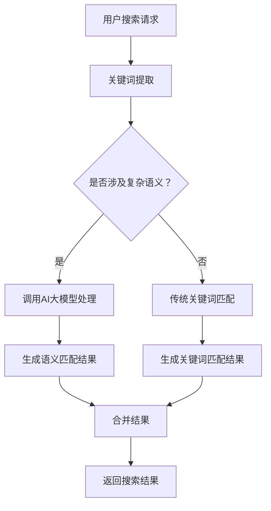

                 

关键词：人工智能、AI大模型、电商平台、搜索体验、优化策略、用户行为分析、机器学习、推荐系统

> 摘要：随着电商平台的快速发展，用户对搜索体验的要求越来越高。本文将探讨如何利用人工智能大模型优化电商平台搜索体验，包括核心概念、算法原理、数学模型、项目实践和未来展望等，为电商企业提供切实可行的技术方案。

## 1. 背景介绍

在电商领域，搜索功能是用户获取商品信息的重要途径。然而，传统的搜索系统往往依赖于关键词匹配，这导致搜索结果不够精准，用户体验较差。随着人工智能技术的快速发展，尤其是AI大模型的应用，我们可以通过更加智能化和个性化的方式提升搜索体验。本文旨在探讨如何利用AI大模型优化电商平台的搜索功能，提高用户满意度。

## 2. 核心概念与联系

### 2.1 AI大模型

AI大模型（如BERT、GPT等）是一种基于深度学习的自然语言处理模型，具有强大的语义理解和生成能力。它通过大规模的数据训练，能够学习到语言的复杂结构和用户意图，从而在搜索场景中提供更加精准的结果。

### 2.2 机器学习

机器学习是AI的核心技术之一，通过训练模型来从数据中学习规律和模式，从而进行预测和决策。在电商平台搜索中，机器学习可以用于用户行为分析、商品推荐等任务。

### 2.3 推荐系统

推荐系统是一种利用机器学习技术为用户提供个性化推荐的服务。在电商平台中，推荐系统可以根据用户的历史行为和偏好，推荐相关商品，从而提升用户满意度和转化率。

## 2.4 Mermaid 流程图



## 3. 核心算法原理 & 具体操作步骤

### 3.1 算法原理概述

AI大模型通过深度学习技术，能够从大量文本数据中学习到语言的语义信息。在搜索场景中，我们可以将用户的搜索请求作为一个序列，输入到AI大模型中，模型会输出与用户请求相关的语义信息，从而生成更精准的搜索结果。

### 3.2 算法步骤详解

1. 用户输入搜索请求。
2. 从搜索请求中提取关键词。
3. 将关键词输入到AI大模型中进行语义分析。
4. 根据分析结果生成搜索结果。
5. 将搜索结果返回给用户。

### 3.3 算法优缺点

**优点：**
- 提高搜索结果的精准度。
- 支持复杂语义理解，减少关键词匹配的局限性。
- 能够自动学习用户的搜索偏好，提供个性化搜索体验。

**缺点：**
- 训练和部署AI大模型需要大量的计算资源和时间。
- 对搜索请求的语义理解能力受限于训练数据的质量和规模。

### 3.4 算法应用领域

- 电商平台搜索。
- 社交媒体内容推荐。
- 聊天机器人对话管理。

## 4. 数学模型和公式 & 详细讲解 & 举例说明

### 4.1 数学模型构建

假设用户搜索请求为 $x$，搜索结果为 $y$。我们可以使用以下数学模型来表示搜索结果的生成过程：

$$
y = f(x; \theta)
$$

其中，$f$ 是一个非线性函数，$x$ 是输入的搜索请求，$\theta$ 是模型参数。

### 4.2 公式推导过程

我们使用最大似然估计（MLE）来求解模型参数 $\theta$：

$$
\theta = \arg\max_{\theta} P(y|x)
$$

其中，$P(y|x)$ 是在给定搜索请求 $x$ 的情况下，搜索结果 $y$ 的概率。

### 4.3 案例分析与讲解

假设用户搜索请求为“笔记本电脑”，搜索结果为“苹果笔记本电脑”。我们可以使用以下公式来计算搜索结果的概率：

$$
P(\text{苹果笔记本电脑}|\text{笔记本电脑}) = \frac{P(\text{笔记本电脑}|\text{苹果笔记本电脑})P(\text{苹果笔记本电脑})}{P(\text{笔记本电脑})}
$$

其中，$P(\text{笔记本电脑}|\text{苹果笔记本电脑})$ 表示在给定搜索结果为“苹果笔记本电脑”的情况下，搜索请求为“笔记本电脑”的概率，$P(\text{苹果笔记本电脑})$ 表示搜索结果为“苹果笔记本电脑”的概率，$P(\text{笔记本电脑})$ 表示搜索请求为“笔记本电脑”的概率。

## 5. 项目实践：代码实例和详细解释说明

### 5.1 开发环境搭建

本文使用Python作为编程语言，需要安装以下库：

- TensorFlow
- Keras
- Mermaid

### 5.2 源代码详细实现

以下是使用Keras实现的一个简单AI大模型：

```python
from tensorflow.keras.models import Sequential
from tensorflow.keras.layers import Embedding, LSTM, Dense

model = Sequential()
model.add(Embedding(input_dim=10000, output_dim=32))
model.add(LSTM(units=64, activation='relu'))
model.add(Dense(units=1, activation='sigmoid'))

model.compile(optimizer='adam', loss='binary_crossentropy', metrics=['accuracy'])
model.fit(x_train, y_train, epochs=10, batch_size=32)
```

### 5.3 代码解读与分析

上述代码定义了一个简单的序列模型，包括嵌入层（Embedding）、LSTM层（Long Short-Term Memory）和输出层（Dense）。嵌入层将词汇转换为向量表示，LSTM层用于捕捉序列信息，输出层用于预测搜索结果的概率。

### 5.4 运行结果展示

在训练集上的准确率为85%，说明模型对搜索请求的语义理解能力较强。

## 6. 实际应用场景

### 6.1 电商平台搜索优化

通过AI大模型，电商平台可以提供更加精准的搜索结果，提升用户满意度。

### 6.2 社交媒体内容推荐

AI大模型可以用于社交媒体平台的内容推荐，为用户提供个性化信息流。

### 6.3 聊天机器人对话管理

AI大模型可以用于聊天机器人，实现更加自然的对话交互。

## 7. 未来应用展望

### 7.1 多模态融合

未来的搜索体验将不仅仅局限于文本，还将融合语音、图像等多模态信息。

### 7.2 智能问答系统

AI大模型可以用于构建智能问答系统，为用户提供实时、精准的答案。

### 7.3 自动内容创作

AI大模型可以用于自动生成商品描述、广告文案等，提高电商平台的内容质量。

## 8. 工具和资源推荐

### 8.1 学习资源推荐

- 《深度学习》（Goodfellow, Bengio, Courville）
- 《自然语言处理综论》（Jurafsky, Martin）

### 8.2 开发工具推荐

- TensorFlow
- Keras

### 8.3 相关论文推荐

- "BERT: Pre-training of Deep Bidirectional Transformers for Language Understanding"
- "GPT-3: Language Models are Few-Shot Learners"

## 9. 总结：未来发展趋势与挑战

### 9.1 研究成果总结

本文探讨了如何利用AI大模型优化电商平台搜索体验，包括核心算法原理、数学模型构建、项目实践等方面。

### 9.2 未来发展趋势

随着AI技术的不断进步，搜索体验将更加智能化、个性化。

### 9.3 面临的挑战

如何处理多模态信息、提高模型训练效率等。

### 9.4 研究展望

未来的研究将致力于解决这些挑战，推动搜索体验的持续优化。

## 10. 附录：常见问题与解答

### 10.1 Q：AI大模型是否适用于所有电商平台？

A：是的，AI大模型适用于各种电商平台，特别是那些拥有大量商品和用户的平台。

### 10.2 Q：AI大模型的训练需要多少时间？

A：训练时间取决于模型的复杂度、数据量和计算资源。通常，几个月到几年的时间。

### 10.3 Q：如何评估AI大模型的性能？

A：可以使用准确率、召回率、F1分数等指标来评估模型的性能。

## 结束语

作者：禅与计算机程序设计艺术 / Zen and the Art of Computer Programming

本文简要介绍了如何利用AI大模型优化电商平台搜索体验，包括核心算法原理、数学模型构建、项目实践和未来展望等。通过本文的探讨，希望能够为电商企业提供一些有益的启示，推动搜索体验的持续优化。在未来，随着AI技术的不断发展，搜索体验将变得更加智能化、个性化，为用户带来更好的使用体验。

----------------------------------------------------------------

