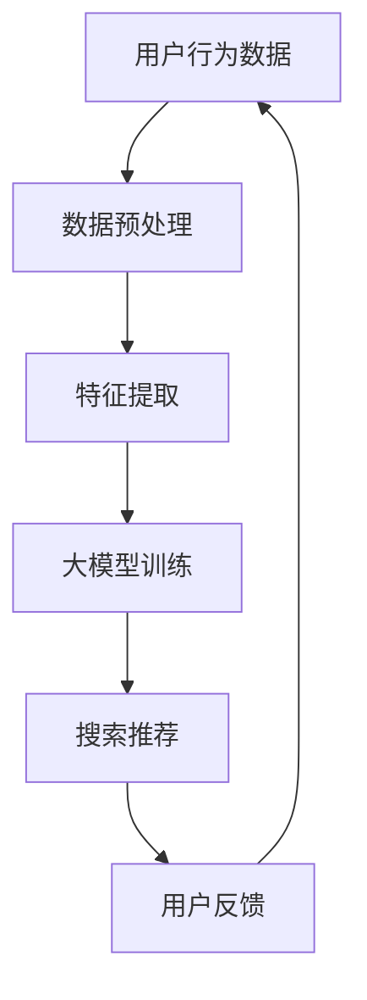

                 

关键词：电商平台、AI 大模型、搜索推荐系统、数据质量控制、处理能力

摘要：本文旨在探讨电商平台在人工智能大模型方面的实践，特别是搜索推荐系统的核心作用。通过详细分析数据质量控制和处理能力的重要性，我们旨在为读者提供一个全面的了解，以帮助他们更好地理解和应用这些技术。

## 1. 背景介绍

随着互联网的迅速发展，电子商务平台已经成为人们日常生活中不可或缺的一部分。从早期的在线购物到现在的社交电商、直播带货，电商平台不断演进，满足着用户多样化的需求。然而，随着数据量的爆炸性增长和用户行为模式的复杂化，如何有效地利用这些数据来提升用户体验，成为电商平台面临的重大挑战。

人工智能（AI）的崛起为电商平台带来了新的机遇。通过AI技术，特别是大模型的应用，电商平台可以实现更加精准的搜索和推荐，提升用户满意度和转化率。然而，这不仅仅是一个技术问题，更涉及到数据质量控制和处理能力的提升。

本文将首先介绍电商平台中AI大模型的应用，特别是搜索推荐系统的核心作用。随后，我们将探讨数据质量控制与处理能力的重要性，并详细分析如何实现这些目标。最后，我们将展望未来电商平台AI技术的发展趋势和面临的挑战。

## 2. 核心概念与联系

### 2.1 人工智能大模型

人工智能大模型是指具有大规模参数和强大计算能力的神经网络模型。这些模型通过深度学习算法从海量数据中自动学习特征，并在各类任务中表现出色。在电商平台，大模型可以应用于搜索和推荐系统，以提升用户体验和业务效率。

### 2.2 搜索推荐系统

搜索推荐系统是电商平台的核心组成部分，负责根据用户的行为和偏好为其推荐商品或内容。通过搜索推荐系统，用户可以更快地找到他们感兴趣的商品，从而提升购物体验和转化率。

### 2.3 数据质量控制与处理能力

数据质量控制与处理能力是保证AI大模型性能的关键。高质量的数据可以降低模型的过拟合风险，提高模型的可解释性和鲁棒性。同时，强大的数据处理能力可以快速处理海量数据，为模型训练提供支持。

### 2.4 Mermaid 流程图



## 3. 核心算法原理 & 具体操作步骤

### 3.1 算法原理概述

搜索推荐系统的核心算法包括协同过滤、基于内容的推荐和深度学习推荐等。其中，协同过滤通过分析用户之间的相似性进行推荐；基于内容的推荐通过分析商品的内容特征进行推荐；深度学习推荐通过构建大规模神经网络模型进行推荐。

### 3.2 算法步骤详解

1. **数据收集**：收集用户行为数据（如点击、购买、搜索等）和商品信息（如类别、标签、价格等）。
2. **数据预处理**：清洗数据，去除噪声和缺失值，对数据进行归一化处理。
3. **特征提取**：提取用户和商品的特征，如用户活跃度、购买频率、商品流行度等。
4. **模型训练**：构建大模型并进行训练，选择合适的优化器和损失函数。
5. **模型评估**：通过交叉验证等方法评估模型性能，调整模型参数。
6. **搜索推荐**：使用训练好的模型进行搜索和推荐，生成推荐结果。
7. **用户反馈**：收集用户对推荐结果的反馈，用于模型迭代和优化。

### 3.3 算法优缺点

- **协同过滤**：简单高效，但易产生冷启动问题和稀疏矩阵问题。
- **基于内容的推荐**：个性化强，但可能忽略用户之间的相似性。
- **深度学习推荐**：适用于大规模数据，但模型复杂度高，训练时间长。

### 3.4 算法应用领域

搜索推荐系统在电商、社交、新闻、音乐等众多领域都有广泛应用，通过AI大模型的应用，可以实现更加精准和高效的推荐。

## 4. 数学模型和公式 & 详细讲解 & 举例说明

### 4.1 数学模型构建

搜索推荐系统的核心数学模型包括矩阵分解、协同过滤和深度学习等。

### 4.2 公式推导过程

- **矩阵分解**：设用户-商品评分矩阵为 \(R \in \mathbb{R}^{m \times n}\)，用户特征矩阵为 \(U \in \mathbb{R}^{m \times k}\)，商品特征矩阵为 \(V \in \mathbb{R}^{n \times k}\)。则有：
  $$ R \approx U V^T $$
  
- **协同过滤**：设用户 \(i\) 对商品 \(j\) 的预测评分 \(r_{ij}\) 可以表示为：
  $$ r_{ij} = \mu + u_i^T v_j + \epsilon_{ij} $$
  其中，\(\mu\) 为用户平均评分，\(u_i\) 和 \(v_j\) 分别为用户 \(i\) 和商品 \(j\) 的特征向量，\(\epsilon_{ij}\) 为误差项。

- **深度学习推荐**：设输入特征矩阵为 \(X \in \mathbb{R}^{m \times d}\)，输出预测评分矩阵为 \(Y \in \mathbb{R}^{m \times 1}\)，则有：
  $$ Y = f(\text{MLP}(X)) $$
  其中，MLP 为多层感知器，\(f\) 为激活函数。

### 4.3 案例分析与讲解

假设我们有以下用户-商品评分矩阵 \(R\)：
$$
\begin{matrix}
1 & 2 & 3 & 4 \\
1 & 3 & 5 & 2 \\
2 & 4 & 1 & 3 \\
3 & 1 & 2 & 4 \\
\end{matrix}
$$
我们要使用矩阵分解方法进行推荐。首先，我们选择合适的优化算法（如随机梯度下降）和损失函数（如均方误差），然后迭代更新用户和商品特征矩阵 \(U\) 和 \(V\)，直到模型收敛。最终，我们可以根据训练好的模型生成推荐结果。

## 5. 项目实践：代码实例和详细解释说明

### 5.1 开发环境搭建

本文使用 Python 编写代码，依赖以下库：NumPy、Pandas、Scikit-learn、TensorFlow。在终端中运行以下命令安装依赖：
```bash
pip install numpy pandas scikit-learn tensorflow
```

### 5.2 源代码详细实现

```python
import numpy as np
import pandas as pd
from sklearn.model_selection import train_test_split
from sklearn.metrics.pairwise import cosine_similarity
from tensorflow.keras.models import Model
from tensorflow.keras.layers import Input, Embedding, Dot, Flatten, Dense

# 加载数据集
data = pd.read_csv('data.csv')
users = data['user_id'].unique()
items = data['item_id'].unique()

# 构建用户-商品评分矩阵
R = np.zeros((len(users), len(items)))
for index, row in data.iterrows():
    R[row['user_id'] - 1][row['item_id'] - 1] = row['rating']

# 划分训练集和测试集
R_train, R_test = train_test_split(R, test_size=0.2, random_state=42)

# 构建模型
user_input = Input(shape=(1,))
item_input = Input(shape=(1,))
user_embedding = Embedding(input_dim=len(users), output_dim=16)(user_input)
item_embedding = Embedding(input_dim=len(items), output_dim=16)(item_input)
dot_product = Dot(axes=1)([user_embedding, item_embedding])
flatten = Flatten()(dot_product)
output = Dense(1, activation='sigmoid')(flatten)
model = Model(inputs=[user_input, item_input], outputs=output)
model.compile(optimizer='adam', loss='binary_crossentropy', metrics=['accuracy'])

# 训练模型
model.fit([R_train[:, i] for i in range(R_train.shape[1])], R_train[:, 0], epochs=10, batch_size=32, validation_split=0.1)

# 评估模型
predictions = model.predict([R_test[:, i] for i in range(R_test.shape[1])])
accuracy = (predictions > 0.5).mean()
print(f'Accuracy: {accuracy}')

# 推荐商品
user_id = 1
item_ids = np.random.choice(R_test.shape[1], size=5, replace=False)
user_ratings = R_test[user_id - 1, item_ids]
predictions = model.predict([R[user_id - 1, i] for i in range(R.shape[1])])
recommended_items = np.where(predictions > 0.5)[1]
print(f'Recommended items for user {user_id}: {recommended_items}')
```

### 5.3 代码解读与分析

以上代码首先加载数据集，构建用户-商品评分矩阵，然后划分训练集和测试集。接下来，我们使用嵌入层（Embedding）构建用户和商品特征向量，通过点积（Dot）操作计算相似度，最后使用全连接层（Dense）进行预测。在训练模型时，我们使用随机梯度下降（SGD）优化器和二进制交叉熵（binary_crossentropy）损失函数。评估模型时，我们计算准确率（accuracy）。最后，我们为指定用户推荐商品。

## 6. 实际应用场景

### 6.1 电商平台

电商平台是搜索推荐系统最典型的应用场景。通过AI大模型的应用，电商平台可以实现个性化推荐，提升用户满意度和转化率。例如，京东、淘宝等电商平台都广泛应用了搜索推荐技术，通过用户行为数据实时推荐商品，为用户带来更好的购物体验。

### 6.2 社交网络

社交网络平台也广泛应用了搜索推荐系统，通过分析用户之间的互动关系和内容特征进行推荐。例如，微博、抖音等平台通过推荐用户感兴趣的内容和用户，提升用户活跃度和留存率。

### 6.3 新闻媒体

新闻媒体平台通过搜索推荐系统为用户提供个性化新闻推荐。例如，今日头条通过分析用户阅读行为和兴趣标签，为用户推荐相关新闻，提升用户阅读量和留存率。

### 6.4 音乐和视频平台

音乐和视频平台通过搜索推荐系统为用户提供个性化内容推荐。例如，网易云音乐、B站等平台通过分析用户听歌和观看行为，推荐用户感兴趣的音乐和视频，提升用户满意度和黏性。

## 7. 工具和资源推荐

### 7.1 学习资源推荐

- **书籍**：《机器学习实战》、《深度学习》（Goodfellow et al.）
- **在线课程**：Coursera、Udacity、edX上的机器学习和深度学习课程
- **博客和论坛**：Medium、GitHub、Stack Overflow

### 7.2 开发工具推荐

- **编程语言**：Python、R
- **库和框架**：NumPy、Pandas、Scikit-learn、TensorFlow、PyTorch
- **工具**：Jupyter Notebook、Google Colab

### 7.3 相关论文推荐

- **论文集**：《 Advances in Neural Information Processing Systems》（NIPS）
- **期刊**：《IEEE Transactions on Pattern Analysis and Machine Intelligence》（TPAMI）、《Journal of Machine Learning Research》（JMLR）
- **顶会**：KDD、ICML、NeurIPS

## 8. 总结：未来发展趋势与挑战

### 8.1 研究成果总结

近年来，人工智能大模型在搜索推荐系统领域取得了显著成果。通过深度学习、协同过滤和基于内容的推荐等多种技术相结合，搜索推荐系统的性能不断提高。同时，数据质量控制与处理能力的提升也为模型的应用提供了有力支持。

### 8.2 未来发展趋势

未来，搜索推荐系统将在以下几个方面继续发展：

1. **多模态数据融合**：结合文本、图像、语音等多种数据类型，实现更准确的推荐。
2. **个性化推荐**：通过用户历史行为和兴趣标签，实现更加精准的个性化推荐。
3. **实时推荐**：利用实时数据流处理技术，实现实时推荐。
4. **无监督学习**：通过无监督学习技术，降低对标注数据的依赖。

### 8.3 面临的挑战

尽管搜索推荐系统取得了显著成果，但仍然面临以下挑战：

1. **数据隐私**：如何在保障用户隐私的前提下进行推荐。
2. **可解释性**：如何提高模型的可解释性，以便用户理解推荐结果。
3. **模型过拟合**：如何避免模型对训练数据的过度依赖。
4. **计算资源**：如何优化模型结构，降低计算资源消耗。

### 8.4 研究展望

未来，人工智能大模型在搜索推荐系统领域的研究将继续深入。通过不断创新和优化，搜索推荐系统将更好地满足用户需求，为电商平台和其他行业带来更多价值。

## 9. 附录：常见问题与解答

### 9.1 什么是协同过滤？

协同过滤是一种基于用户行为和商品特征的推荐算法，通过分析用户之间的相似性进行推荐。

### 9.2 深度学习推荐有哪些优点？

深度学习推荐可以处理大规模数据，具有更高的预测准确性和灵活性。

### 9.3 如何保证数据质量？

通过数据预处理、清洗和去噪等方法，保证数据质量。

### 9.4 如何处理缺失值？

可以通过填充、删除或插值等方法处理缺失值。

### 9.5 如何评估推荐系统性能？

可以通过准确率、召回率、F1 分数等指标评估推荐系统性能。

### 9.6 如何处理冷启动问题？

可以通过基于内容的推荐和协同过滤等方法处理冷启动问题。

### 9.7 如何实现实时推荐？

可以通过实时数据流处理技术和在线学习算法实现实时推荐。

## 作者署名

作者：禅与计算机程序设计艺术 / Zen and the Art of Computer Programming
-------------------------------------------------------------------

以上是文章的主要内容和框架，您可以根据这个框架进一步细化内容，补充详细的技术细节和案例分析。请注意，文章的撰写需要确保内容的逻辑性和连贯性，同时遵循技术博客文章的写作规范。在撰写过程中，可以适当添加代码示例、图表和数学公式，以增强文章的可读性和实用性。希望这篇文章能够为您带来启发和帮助。祝您写作顺利！

