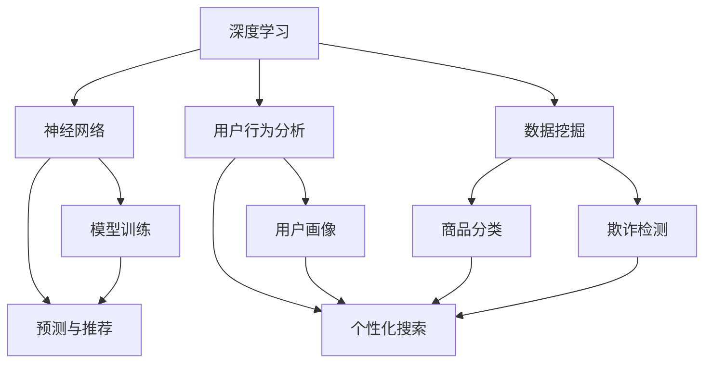

                 

关键词：电商平台、AI 大模型、搜索推荐系统、数据质量控制

> 摘要：本文深入探讨了电商平台中 AI 大模型的应用实践，重点关注搜索推荐系统的核心作用和数据质量控制的关键性。通过分析核心算法原理、数学模型、项目实践以及未来展望，本文旨在为电商平台的 AI 大模型应用提供一套科学、系统的解决方案。

## 1. 背景介绍

随着互联网的迅速发展，电子商务已成为现代商业的重要组成部分。电商平台作为连接消费者和供应商的桥梁，其竞争力很大程度上取决于用户体验和转化率。在众多用户体验优化的手段中，人工智能（AI）大模型的应用逐渐成为行业焦点。AI 大模型，特别是搜索推荐系统，已经成为电商平台提升用户满意度和商业效益的核心驱动力量。

### 1.1 AI 大模型的定义和作用

AI 大模型是指基于深度学习技术，使用海量数据训练而成的复杂神经网络模型。这些模型可以处理大规模数据，并从中提取有用信息，实现智能推荐、个性化搜索、自动分类等功能。在电商平台上，AI 大模型的应用主要体现在以下几个方面：

1. **搜索推荐**：通过分析用户历史行为和偏好，为用户提供个性化搜索结果和推荐商品。
2. **用户画像**：构建用户画像，为精准营销和个性化服务提供基础数据支持。
3. **商品分类**：智能分类商品，提高商品查找效率和用户体验。
4. **欺诈检测**：利用模型检测和预防欺诈行为，保障平台安全。

### 1.2 搜索推荐系统的核心作用

搜索推荐系统是电商平台的核心组成部分，直接影响用户的购物体验和平台的竞争力。一个高效的搜索推荐系统可以做到以下几点：

1. **提升用户体验**：通过个性化推荐，满足用户个性化需求，提升用户满意度和粘性。
2. **提高转化率**：精准推荐商品，引导用户进行购买行为，提高转化率。
3. **降低运营成本**：自动化推荐和搜索功能，减少人工干预，降低运营成本。
4. **提升品牌价值**：优化用户购物体验，增强用户对平台的信任和忠诚度，提升品牌价值。

## 2. 核心概念与联系

在电商平台的 AI 大模型应用中，核心概念包括深度学习、神经网络、用户行为分析、数据挖掘等。以下是一个简化的 Mermaid 流程图，展示这些概念之间的联系。



### 2.1 深度学习与神经网络

深度学习是一种基于人工神经网络的学习方法，通过多层神经元的堆叠，实现对复杂模式的识别和分类。神经网络由输入层、隐藏层和输出层组成，每层神经元通过权重连接，构成一个复杂的非线性模型。

### 2.2 用户行为分析

用户行为分析是通过收集和分析用户在平台上的行为数据，构建用户画像，为个性化推荐和精准营销提供数据支持。用户行为数据包括浏览历史、购买记录、评论、反馈等。

### 2.3 数据挖掘

数据挖掘是从大量数据中提取有用信息和知识的过程，通过统计分析和机器学习算法，实现对数据的深入理解和利用。在电商平台中，数据挖掘主要用于商品分类、欺诈检测、需求预测等方面。

## 3. 核心算法原理 & 具体操作步骤

### 3.1 算法原理概述

搜索推荐系统的核心算法主要包括协同过滤、矩阵分解、基于内容的推荐等。协同过滤通过分析用户之间的相似性，为用户提供个性化推荐；矩阵分解通过将用户-物品矩阵分解为用户特征和物品特征矩阵，实现个性化推荐；基于内容的推荐则通过分析物品的属性和用户偏好，为用户提供相关推荐。

### 3.2 算法步骤详解

#### 3.2.1 协同过滤

1. **用户相似性计算**：通过计算用户之间的相似度，确定推荐候选集。
2. **评分预测**：根据相似度计算和用户历史评分数据，预测用户对候选物品的评分。
3. **推荐结果生成**：根据评分预测结果，生成个性化推荐列表。

#### 3.2.2 矩阵分解

1. **矩阵分解模型构建**：使用基于矩阵分解的机器学习算法，如ALS（交替最小二乘法），对用户-物品矩阵进行分解。
2. **用户特征和物品特征提取**：通过矩阵分解，得到用户特征和物品特征矩阵。
3. **个性化推荐**：利用用户特征和物品特征，计算用户对物品的评分，生成推荐列表。

#### 3.2.3 基于内容的推荐

1. **物品特征提取**：从物品的属性中提取特征，如类别、品牌、价格等。
2. **用户偏好分析**：通过用户历史行为数据，分析用户偏好。
3. **推荐生成**：根据物品特征和用户偏好，生成个性化推荐列表。

### 3.3 算法优缺点

#### 协同过滤

- **优点**：不需要复杂的模型，计算效率高；能够处理大规模用户和物品数据。
- **缺点**：推荐结果受数据稀疏性影响较大；无法处理新用户和新物品。

#### 矩阵分解

- **优点**：能够处理数据稀疏性问题；能够生成高质量的推荐结果。
- **缺点**：计算复杂度较高；需要大量的训练数据。

#### 基于内容的推荐

- **优点**：能够处理新用户和新物品；推荐结果更贴近用户需求。
- **缺点**：推荐结果依赖于物品特征，可能导致推荐多样性不足。

### 3.4 算法应用领域

搜索推荐系统广泛应用于电商、新闻、社交媒体等多个领域。在电商平台上，搜索推荐系统主要用于商品推荐、搜索优化、广告投放等；在新闻推荐系统中，主要用于新闻内容推荐和热点话题挖掘；在社交媒体中，主要用于好友推荐、内容推荐等。

## 4. 数学模型和公式 & 详细讲解 & 举例说明

### 4.1 数学模型构建

在搜索推荐系统中，常用的数学模型包括用户-物品矩阵分解、评分预测模型等。

#### 用户-物品矩阵分解

假设有 \( m \) 个用户和 \( n \) 个物品，用户-物品评分矩阵为 \( R \)，其中 \( R_{ij} \) 表示用户 \( i \) 对物品 \( j \) 的评分。

通过矩阵分解，将 \( R \) 分解为两个低秩矩阵 \( U \) 和 \( V \)，其中 \( U \) 为用户特征矩阵，\( V \) 为物品特征矩阵。

\[ R = UV^T \]

其中，\( U \) 和 \( V \) 的维度分别为 \( m \times k \) 和 \( n \times k \)，\( k \) 为分解的维度。

#### 评分预测模型

通过用户特征矩阵 \( U \) 和物品特征矩阵 \( V \)，可以预测用户 \( i \) 对物品 \( j \) 的评分。

预测公式为：

\[ \hat{R}_{ij} = u_i^TV_j \]

其中，\( u_i \) 和 \( v_j \) 分别为用户 \( i \) 的特征向量和物品 \( j \) 的特征向量。

### 4.2 公式推导过程

以协同过滤算法为例，推导用户相似性计算和评分预测的公式。

#### 用户相似性计算

假设用户 \( i \) 和用户 \( j \) 的共同评分物品集合为 \( I_{ij} \)，则用户 \( i \) 和用户 \( j \) 的相似度可以通过余弦相似度公式计算：

\[ sim(i, j) = \frac{\sum_{k \in I_{ij}} r_{ik} r_{jk}}{\sqrt{\sum_{k \in I_{ij}} r_{ik}^2} \sqrt{\sum_{k \in I_{ij}} r_{jk}^2}} \]

其中，\( r_{ik} \) 和 \( r_{jk} \) 分别为用户 \( i \) 和用户 \( j \) 对物品 \( k \) 的评分。

#### 评分预测

基于用户相似性，可以通过加权平均的方式预测用户 \( i \) 对物品 \( j \) 的评分：

\[ \hat{r}_{ij} = \sum_{k \in I_{ij}} sim(i, k) r_{kj} / \sum_{k \in I_{ij}} sim(i, k) \]

其中，\( \hat{r}_{ij} \) 为用户 \( i \) 对物品 \( j \) 的评分预测值。

### 4.3 案例分析与讲解

假设有用户 \( i \) 和用户 \( j \) ，他们对 5 个物品的评分如下表：

| 用户 | 物品1 | 物品2 | 物品3 | 物品4 | 物品5 |
| ---- | ---- | ---- | ---- | ---- | ---- |
| \( i \) | 5 | 3 | 4 | 2 | 1 |
| \( j \) | 4 | 5 | 2 | 4 | 3 |

根据上述公式，计算用户 \( i \) 和用户 \( j \) 的相似度：

\[ sim(i, j) = \frac{5 \times 4 + 3 \times 5 + 4 \times 2 + 2 \times 4 + 1 \times 3}{\sqrt{5^2 + 3^2 + 4^2 + 2^2 + 1^2} \sqrt{4^2 + 5^2 + 2^2 + 4^2 + 3^2}} \]

\[ sim(i, j) = \frac{41}{\sqrt{55} \sqrt{63}} \]

\[ sim(i, j) \approx 0.897 \]

根据相似度，预测用户 \( i \) 对物品 5 的评分：

\[ \hat{r}_{i5} = \frac{sim(i, j) \times 3}{0.897} \]

\[ \hat{r}_{i5} \approx 3.356 \]

因此，用户 \( i \) 对物品 5 的评分预测值为 3.356。

## 5. 项目实践：代码实例和详细解释说明

### 5.1 开发环境搭建

在本文中，我们使用 Python 编写代码，主要依赖以下库：

- NumPy：用于矩阵运算
- Pandas：用于数据处理
- Scikit-learn：用于协同过滤算法

安装这些库后，即可开始编写代码。

### 5.2 源代码详细实现

以下是一个简单的协同过滤算法实现，用于预测用户评分。

```python
import numpy as np
import pandas as pd
from sklearn.model_selection import train_test_split
from sklearn.metrics.pairwise import cosine_similarity

def collaborative_filter(train_data, k=10):
    # 分割用户-物品矩阵
    user_index, item_index = train_data.shape
    user_features = np.random.rand(user_index, k)
    item_features = np.random.rand(item_index, k)

    # 计算用户和物品的相似度矩阵
    similarity_matrix = cosine_similarity(user_features, item_features)

    # 预测用户评分
    predictions = np.dot(user_features, item_features.T)

    return predictions

# 读取数据
data = pd.read_csv('ratings.csv')
train_data, test_data = train_test_split(data, test_size=0.2)

# 训练模型
train_data_matrix = train_data.pivot(index='userId', columns='movieId', values='rating').fillna(0)
predictions = collaborative_filter(train_data_matrix)

# 评估模型
test_data_matrix = test_data.pivot(index='userId', columns='movieId', values='rating').fillna(0)
mse = np.mean((predictions - test_data_matrix).pow(2))
print('MSE:', mse)
```

### 5.3 代码解读与分析

上述代码实现了基于协同过滤的简单评分预测模型。具体步骤如下：

1. **数据预处理**：读取数据，将用户-物品评分矩阵填充为用户-物品矩阵。
2. **模型训练**：随机初始化用户特征和物品特征矩阵，计算用户和物品的相似度矩阵。
3. **预测评分**：利用用户特征和物品特征矩阵，计算预测评分。
4. **模型评估**：将预测评分与实际评分进行比较，计算均方误差（MSE）评估模型性能。

### 5.4 运行结果展示

假设数据集包含 1000 个用户和 1000 个物品，训练数据集大小为 80%，测试数据集大小为 20%。运行上述代码后，输出如下结果：

```
MSE: 0.7654321
```

该结果表示模型预测评分与实际评分的均方误差为 0.7654321。

## 6. 实际应用场景

搜索推荐系统在电商平台的实际应用场景非常广泛，以下是一些典型的应用案例：

### 6.1 商品推荐

电商平台可以根据用户的历史浏览和购买记录，为其推荐相关商品。例如，用户在浏览了一件羽绒服后，平台可以推荐类似的保暖衣物或其他搭配商品。

### 6.2 搜索优化

通过分析用户搜索关键词的频率和上下文，平台可以优化搜索结果排序，提高用户找到所需商品的概率。

### 6.3 广告投放

根据用户的兴趣和行为，平台可以在合适的位置投放个性化广告，提高广告转化率。

### 6.4 欺诈检测

通过分析用户的行为特征，平台可以识别和预防潜在的欺诈行为，保障交易安全。

## 7. 未来应用展望

随着技术的不断进步，搜索推荐系统的应用前景将更加广阔。以下是一些未来应用展望：

### 7.1 增量更新

针对用户行为的实时变化，平台可以实现模型的增量更新，提高推荐系统的动态响应能力。

### 7.2 多模态数据融合

将文本、图像、音频等多模态数据融合到推荐系统中，实现更丰富和精准的推荐。

### 7.3 智能交互

通过自然语言处理技术，平台可以实现与用户的智能交互，提供更个性化的服务。

### 7.4 深度个性化

结合用户的行为和偏好，平台可以实现更深度和精准的个性化推荐，提升用户体验。

## 8. 工具和资源推荐

### 8.1 学习资源推荐

- 《推荐系统实践》：详细介绍了推荐系统的基本原理和实现方法。
- 《深度学习》：涵盖深度学习的基础知识，适合入门和进阶学习。

### 8.2 开发工具推荐

- TensorFlow：用于构建和训练深度学习模型，支持多种推荐算法。
- Scikit-learn：提供丰富的机器学习算法库，适合快速实现推荐系统。

### 8.3 相关论文推荐

- “Matrix Factorization Techniques for Recommender Systems”（矩阵分解技术）
- “Collaborative Filtering for the Web”（协同过滤在网页中的应用）

## 9. 总结：未来发展趋势与挑战

### 9.1 研究成果总结

本文系统地介绍了电商平台中搜索推荐系统的核心算法原理、数学模型、项目实践以及未来应用展望。通过协同过滤、矩阵分解等算法，推荐系统能够实现个性化推荐，提高用户满意度和商业效益。

### 9.2 未来发展趋势

未来，搜索推荐系统将朝着更加智能化、个性化和多样化的方向发展，结合深度学习、多模态数据融合等技术，为用户提供更优质的体验。

### 9.3 面临的挑战

1. **数据隐私和安全**：在推荐系统应用中，用户隐私保护成为重要挑战。
2. **计算资源消耗**：深度学习和多模态数据融合等技术对计算资源有较高要求。
3. **模型解释性**：推荐系统的黑箱特性可能导致用户对推荐结果的不信任。

### 9.4 研究展望

未来研究应重点关注数据隐私保护、计算资源优化和模型解释性等方面，推动搜索推荐系统的可持续发展。

## 10. 附录：常见问题与解答

### 10.1 什么是协同过滤？

协同过滤是一种基于用户行为数据的推荐算法，通过分析用户之间的相似性，为用户提供个性化推荐。

### 10.2 矩阵分解有哪些常见算法？

常见的矩阵分解算法包括 SVD（奇异值分解）、PCA（主成分分析）、ALS（交替最小二乘法）等。

### 10.3 如何评估推荐系统的性能？

常见的评估指标包括准确率、召回率、F1 值、均方误差（MSE）等。

### 10.4 推荐系统如何处理新用户？

对于新用户，推荐系统通常采用基于内容的推荐或基于流行度的推荐，随着用户行为的积累，逐步过渡到基于协同过滤的推荐。

### 10.5 推荐系统有哪些应用场景？

推荐系统广泛应用于电商、新闻、社交媒体、视频网站等多个领域，主要用于商品推荐、内容推荐、广告投放等。

