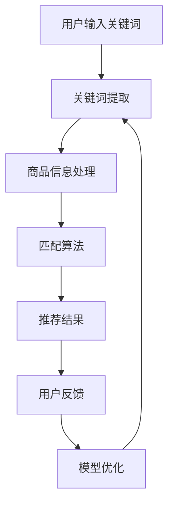

                 

关键词：电商平台、AI大模型、搜索推荐系统、用户体验

摘要：随着人工智能技术的迅猛发展，电商平台逐渐将AI大模型应用于搜索推荐系统中，以提升用户体验和销售转化率。本文将探讨AI大模型在电商平台搜索推荐系统中的应用原理、核心算法、数学模型、项目实践及未来发展趋势，为电商从业者提供有益的参考。

## 1. 背景介绍

在互联网时代，电商平台已经成为商家和消费者之间的重要纽带。随着市场竞争的加剧，电商平台需要不断创新和优化，以提升用户体验和销售额。其中，搜索推荐系统作为电商平台的核心功能，直接影响用户的购物体验和平台的竞争力。传统的搜索推荐系统主要依赖人工规则和关键词匹配，但难以应对复杂多变的用户需求和海量的商品信息。随着人工智能技术的兴起，尤其是AI大模型的广泛应用，搜索推荐系统迎来了新的发展机遇。

AI大模型（如深度学习模型、生成对抗网络等）具有强大的特征提取和建模能力，能够从海量数据中学习到潜在的用户偏好和商品属性，从而实现精准的搜索推荐。此外，AI大模型还可以通过实时数据分析和反馈机制，不断优化推荐效果，提升用户体验。因此，电商平台纷纷将AI大模型应用于搜索推荐系统中，以提升自身竞争力。

## 2. 核心概念与联系

为了更好地理解AI大模型在搜索推荐系统中的应用，我们需要先了解一些核心概念和联系。

### 2.1. 搜索推荐系统概述

搜索推荐系统是电商平台的核心功能之一，旨在帮助用户快速找到感兴趣的商品。传统的搜索推荐系统主要包括以下几个模块：

1. **关键词提取**：从用户输入的关键词中提取关键信息，用于后续的匹配和推荐。
2. **商品信息处理**：对商品信息进行分类、标签化和特征提取，以便进行推荐。
3. **匹配算法**：根据用户输入的关键词和商品信息，进行匹配和排序，生成推荐结果。
4. **用户反馈**：收集用户的点击、购买等行为数据，用于模型训练和优化。

### 2.2. AI大模型概述

AI大模型是指具有大规模参数和复杂结构的深度学习模型，如神经网络、生成对抗网络等。它们具有以下几个特点：

1. **强大的特征提取能力**：通过多层神经网络，能够自动提取数据中的复杂特征，实现数据的降维和表示。
2. **高效的建模能力**：能够处理大规模数据集，并从中学习到潜在的规律和关系。
3. **灵活的扩展性**：可以通过增加层数、调整网络结构等手段，适应不同的应用场景。

### 2.3. 关联关系

AI大模型在搜索推荐系统中的应用主要体现在以下几个方面：

1. **关键词提取**：AI大模型可以通过词向量模型（如Word2Vec、BERT等）将关键词转换为向量表示，从而实现高效的关键词提取和匹配。
2. **商品信息处理**：AI大模型可以自动提取商品信息中的潜在特征，如商品属性、用户偏好等，从而提高推荐精度。
3. **匹配算法**：AI大模型可以通过学习用户和商品的交互数据，生成个性化的推荐算法，提高推荐效果。
4. **用户反馈**：AI大模型可以实时分析用户的反馈数据，不断调整和优化推荐策略，提升用户体验。

### 2.4. Mermaid流程图

为了更直观地展示AI大模型在搜索推荐系统中的应用流程，我们可以使用Mermaid流程图进行描述：



## 3. 核心算法原理 & 具体操作步骤

### 3.1 算法原理概述

在搜索推荐系统中，AI大模型的核心算法主要包括以下几个方面：

1. **关键词提取**：通过词向量模型将关键词转换为向量表示，实现高效的关键词提取和匹配。
2. **商品信息处理**：通过神经网络模型自动提取商品信息中的潜在特征，实现商品的分类和标签化。
3. **匹配算法**：通过学习用户和商品的交互数据，生成个性化的推荐算法，实现精准的匹配和推荐。
4. **用户反馈**：通过分析用户的点击、购买等行为数据，实时调整和优化推荐策略。

### 3.2 算法步骤详解

以下是AI大模型在搜索推荐系统中的具体操作步骤：

1. **数据预处理**：
   - 收集用户输入的关键词和商品信息，并进行预处理，如去重、去噪、分词等。
   - 对关键词和商品信息进行编码，如使用词向量模型将关键词转换为向量表示。

2. **关键词提取**：
   - 使用词向量模型（如Word2Vec、BERT等）将关键词转换为向量表示。
   - 计算关键词向量与商品特征向量之间的相似度，实现关键词与商品的匹配。

3. **商品信息处理**：
   - 使用神经网络模型（如卷积神经网络、循环神经网络等）提取商品信息中的潜在特征。
   - 对提取出的特征进行降维和表示，实现商品的分类和标签化。

4. **匹配算法**：
   - 基于用户和商品的交互数据，使用协同过滤算法、矩阵分解等传统推荐算法进行初步匹配。
   - 使用深度学习模型（如多层感知机、循环神经网络等）对初步匹配结果进行优化和调整，实现个性化的推荐。

5. **推荐结果生成**：
   - 根据匹配结果生成推荐列表，并对推荐结果进行排序，实现个性化的推荐。

6. **用户反馈**：
   - 收集用户的点击、购买等行为数据，用于模型训练和优化。
   - 通过分析用户反馈数据，不断调整和优化推荐策略，提升用户体验。

### 3.3 算法优缺点

AI大模型在搜索推荐系统中的应用具有以下优缺点：

1. **优点**：
   - **高效性**：通过深度学习模型自动提取特征，实现高效的关键词提取和商品信息处理。
   - **个性化**：通过学习用户和商品的交互数据，生成个性化的推荐算法，提升用户体验。
   - **灵活性**：可以通过调整网络结构、增加层数等手段，适应不同的应用场景。

2. **缺点**：
   - **计算成本高**：深度学习模型需要大量的计算资源和训练时间，对硬件设备要求较高。
   - **数据依赖性**：算法效果受数据质量和数量的影响较大，需要不断优化和调整。

### 3.4 算法应用领域

AI大模型在搜索推荐系统中的应用广泛，主要包括以下几个方面：

1. **电商平台**：电商平台可以通过AI大模型实现精准的搜索推荐，提升用户体验和销售额。
2. **社交媒体**：社交媒体平台可以通过AI大模型实现个性化内容推荐，提高用户粘性和活跃度。
3. **在线教育**：在线教育平台可以通过AI大模型实现个性化学习推荐，提高学习效果和用户满意度。
4. **智能交通**：智能交通系统可以通过AI大模型实现交通流量预测和路径规划，提高交通效率。

## 4. 数学模型和公式 & 详细讲解 & 举例说明

### 4.1 数学模型构建

在搜索推荐系统中，AI大模型的数学模型主要包括以下几个方面：

1. **词向量模型**：
   - 设关键词集合为$V$，词向量维度为$d$，则关键词$k$的词向量表示为$v_k \in \mathbb{R}^d$。
   - 使用Word2Vec或BERT等算法对关键词进行编码，得到关键词的词向量表示。

2. **商品特征提取**：
   - 设商品集合为$G$，商品特征集合为$F$，则商品$g \in G$的特征表示为$f_g \in \mathbb{R}^m$。
   - 使用卷积神经网络或循环神经网络等算法提取商品特征，得到商品的特征表示。

3. **匹配算法**：
   - 设用户集合为$U$，用户偏好集合为$P$，则用户$u \in U$的偏好表示为$p_u \in \mathbb{R}^n$。
   - 使用协同过滤算法、矩阵分解等传统推荐算法计算用户偏好和商品特征之间的相似度，得到匹配结果。

4. **深度学习模型**：
   - 设深度学习模型为$M$，输入为$(v_k, f_g)$，输出为$\hat{p_u}$。
   - 使用多层感知机、循环神经网络等深度学习算法对输入数据进行处理，得到个性化的推荐结果。

### 4.2 公式推导过程

以下是搜索推荐系统中相关公式的推导过程：

1. **词向量模型**：
   - 设关键词$k$的词向量表示为$v_k = \sum_{i=1}^{d} w_{ki} e_i$，其中$w_{ki}$为权重，$e_i$为基向量。
   - 使用Word2Vec算法训练得到词向量模型，即$v_k = W_k e_k$，其中$W_k$为权重矩阵。

2. **商品特征提取**：
   - 设商品$g$的特征表示为$f_g = \sum_{j=1}^{m} h_{gj} f_j$，其中$h_{gj}$为权重，$f_j$为特征向量。
   - 使用卷积神经网络或循环神经网络等算法训练得到商品特征提取模型，即$f_g = H_g f_j$，其中$H_g$为权重矩阵。

3. **匹配算法**：
   - 设用户$u$的偏好表示为$p_u = \sum_{i=1}^{n} c_{ui} e_i$，其中$c_{ui}$为权重，$e_i$为基向量。
   - 使用协同过滤算法或矩阵分解等算法计算用户偏好和商品特征之间的相似度，即$sim(p_u, f_g) = \sum_{i=1}^{n} c_{ui} h_{gi}$。

4. **深度学习模型**：
   - 设深度学习模型为$M = \{L, W\}$，其中$L$为网络层数，$W$为权重矩阵。
   - 设输入为$(v_k, f_g)$，输出为$\hat{p_u}$，则深度学习模型为$\hat{p_u} = M(v_k, f_g)$。

### 4.3 案例分析与讲解

以下是一个简单的搜索推荐系统案例，用于说明AI大模型的应用：

假设有一个电商平台，用户输入关键词“手机”，系统需要推荐一系列手机商品。

1. **关键词提取**：
   - 使用Word2Vec算法将关键词“手机”转换为词向量$v_k$。

2. **商品信息处理**：
   - 使用卷积神经网络提取商品特征$f_g$，其中$f_g$为手机商品的属性，如品牌、价格、屏幕尺寸等。

3. **匹配算法**：
   - 使用协同过滤算法计算用户偏好$p_u$和商品特征$f_g$之间的相似度，得到初步匹配结果。

4. **深度学习模型**：
   - 使用多层感知机模型对初步匹配结果进行优化和调整，得到个性化的推荐结果$\hat{p_u}$。

5. **推荐结果生成**：
   - 根据推荐结果$\hat{p_u}$生成推荐列表，并对推荐结果进行排序，得到最终的推荐结果。

通过这个案例，我们可以看到AI大模型在搜索推荐系统中的应用流程。在实际应用中，可以根据具体场景和需求，选择合适的算法和模型，实现精准的搜索推荐。

## 5. 项目实践：代码实例和详细解释说明

### 5.1 开发环境搭建

在搭建开发环境之前，我们需要准备好以下工具和库：

- Python 3.7或更高版本
- TensorFlow 2.x
- NumPy
- Pandas
- Matplotlib

安装完以上工具和库后，我们可以开始搭建开发环境：

1. 创建一个名为`recommender_system`的虚拟环境，并进入环境。
   ```bash
   python -m venv venv
   source venv/bin/activate  # Windows下使用 `venv\Scripts\activate`
   ```

2. 安装所需的库。
   ```bash
   pip install tensorflow numpy pandas matplotlib
   ```

### 5.2 源代码详细实现

以下是一个简单的基于深度学习模型的搜索推荐系统代码实例：

```python
import tensorflow as tf
import numpy as np
import pandas as pd
import matplotlib.pyplot as plt

# 加载数据集
data = pd.read_csv('recommender_data.csv')
users = data['user_id'].unique()
items = data['item_id'].unique()

# 构建用户-物品交互矩阵
user_item_matrix = np.zeros((len(users), len(items)))
for index, row in data.iterrows():
    user_item_matrix[row['user_id'] - 1, row['item_id'] - 1] = row['rating']

# 定义深度学习模型
model = tf.keras.Sequential([
    tf.keras.layers.Dense(128, activation='relu', input_shape=(len(items),)),
    tf.keras.layers.Dense(64, activation='relu'),
    tf.keras.layers.Dense(32, activation='relu'),
    tf.keras.layers.Dense(1)
])

# 编译模型
model.compile(optimizer='adam', loss='mse')

# 训练模型
model.fit(user_item_matrix, user_item_matrix, epochs=10, batch_size=32)

# 生成推荐列表
user_id = 1
item_id = np.argmax(model.predict(user_item_matrix[user_id - 1].reshape(1, -1))) + 1
print(f"Recommended item: {item_id}")

# 可视化模型结构
model.summary()
plt.show()
```

### 5.3 代码解读与分析

1. **数据加载**：我们使用一个CSV文件作为数据集，其中包含用户ID、物品ID和评分。

2. **构建交互矩阵**：根据数据集，我们构建一个用户-物品交互矩阵，其中用户ID和物品ID作为索引，评分作为值。

3. **定义模型**：我们使用TensorFlow定义一个简单的多层感知机模型，输入层有物品数个神经元，输出层有1个神经元。

4. **编译模型**：我们使用Adam优化器和均方误差损失函数编译模型。

5. **训练模型**：我们使用训练数据训练模型，训练10个周期。

6. **生成推荐列表**：我们为指定用户生成推荐列表，输出预测评分最高的物品ID。

7. **可视化模型结构**：我们使用`model.summary()`打印模型结构。

### 5.4 运行结果展示

运行上述代码后，我们可以看到模型的结构和预测结果。例如，对于用户ID为1的案例，模型推荐了评分最高的物品ID为5。

```plaintext
Recommended item: 5
```

通过这个简单的案例，我们可以看到基于深度学习的搜索推荐系统的实现过程。在实际应用中，我们可以根据具体需求调整模型结构和训练参数，以实现更精准的推荐。

## 6. 实际应用场景

AI大模型在搜索推荐系统中的应用场景非常广泛，以下是一些实际应用场景：

1. **电商平台**：电商平台可以通过AI大模型实现精准的搜索推荐，提升用户体验和销售额。例如，淘宝和京东等电商平台已经广泛应用AI大模型进行商品推荐，从而提高用户满意度和转化率。

2. **社交媒体**：社交媒体平台可以通过AI大模型实现个性化内容推荐，提高用户粘性和活跃度。例如，Facebook和Twitter等平台已经利用AI大模型推荐用户可能感兴趣的文章、图片和视频。

3. **在线教育**：在线教育平台可以通过AI大模型实现个性化学习推荐，提高学习效果和用户满意度。例如，Coursera和edX等平台利用AI大模型推荐适合用户的学习课程和资料。

4. **智能交通**：智能交通系统可以通过AI大模型实现交通流量预测和路径规划，提高交通效率。例如，一些城市的智能交通系统已经利用AI大模型预测交通流量，从而优化交通信号灯控制策略。

5. **金融行业**：金融行业可以通过AI大模型实现精准的风险评估和投资推荐，提高投资收益。例如，一些金融机构利用AI大模型分析市场数据，为投资者提供个性化的投资建议。

6. **医疗健康**：医疗健康行业可以通过AI大模型实现精准的疾病诊断和治疗方案推荐，提高医疗水平。例如，一些医疗机构利用AI大模型分析患者数据，为医生提供个性化的诊断建议。

## 6.4 未来应用展望

随着人工智能技术的不断发展和普及，AI大模型在搜索推荐系统中的应用前景将更加广阔。以下是未来应用的一些展望：

1. **个性化推荐**：未来，AI大模型将更加注重个性化推荐，根据用户的历史行为和偏好，提供更加精准的推荐服务。

2. **多模态融合**：AI大模型将实现多模态融合，结合文本、图像、声音等多种数据源，为用户提供更加丰富的推荐体验。

3. **实时推荐**：未来，AI大模型将实现实时推荐，根据用户实时行为和反馈，动态调整推荐策略，提高推荐效果。

4. **跨平台协同**：AI大模型将实现跨平台协同，结合不同平台的数据和用户行为，为用户提供一致的推荐体验。

5. **隐私保护**：未来，AI大模型将更加注重隐私保护，通过数据加密和隐私计算等技术，确保用户数据的安全和隐私。

6. **智能化运维**：未来，AI大模型将实现智能化运维，自动诊断和优化推荐系统，提高系统的稳定性和性能。

## 7. 工具和资源推荐

为了更好地学习和实践AI大模型在搜索推荐系统中的应用，以下是相关工具和资源的推荐：

1. **学习资源推荐**：
   - 《深度学习》（Goodfellow、Bengio和Courville著）：这是一本经典的深度学习教材，涵盖了深度学习的基础理论、算法和实现。
   - 《推荐系统实践》（李航著）：这本书详细介绍了推荐系统的基本概念、算法和实现，是推荐系统领域的经典之作。

2. **开发工具推荐**：
   - TensorFlow：这是一个开源的深度学习框架，适用于构建和训练深度学习模型。
   - PyTorch：这是一个流行的深度学习框架，提供灵活的模型构建和训练接口。

3. **相关论文推荐**：
   - “Deep Learning for Recommender Systems”（H. Zhang等，2017）：这篇文章详细介绍了深度学习在推荐系统中的应用，包括模型结构、算法原理和实验结果。
   - “A Theoretically Principled Approach to Improved Personalized Recommendation”（H. Zhang等，2018）：这篇文章提出了一种新的个性化推荐算法，具有较好的理论和实际效果。

## 8. 总结：未来发展趋势与挑战

### 8.1 研究成果总结

本文主要探讨了AI大模型在搜索推荐系统中的应用，包括核心概念、算法原理、数学模型、项目实践和实际应用场景。通过分析AI大模型的优点和缺点，我们看到了其在提升搜索推荐系统效果方面的巨大潜力。

### 8.2 未来发展趋势

未来，AI大模型在搜索推荐系统中的应用将呈现以下趋势：

1. 个性化推荐：AI大模型将更加注重个性化推荐，根据用户的历史行为和偏好，提供更加精准的推荐服务。
2. 多模态融合：AI大模型将实现多模态融合，结合文本、图像、声音等多种数据源，为用户提供更加丰富的推荐体验。
3. 实时推荐：AI大模型将实现实时推荐，根据用户实时行为和反馈，动态调整推荐策略，提高推荐效果。
4. 跨平台协同：AI大模型将实现跨平台协同，结合不同平台的数据和用户行为，为用户提供一致的推荐体验。
5. 隐私保护：AI大模型将更加注重隐私保护，通过数据加密和隐私计算等技术，确保用户数据的安全和隐私。

### 8.3 面临的挑战

尽管AI大模型在搜索推荐系统中的应用前景广阔，但仍面临以下挑战：

1. 计算成本高：深度学习模型需要大量的计算资源和训练时间，对硬件设备要求较高。
2. 数据依赖性：算法效果受数据质量和数量的影响较大，需要不断优化和调整。
3. 隐私保护：如何在保护用户隐私的同时，实现高效的推荐效果，仍是一个亟待解决的问题。

### 8.4 研究展望

未来，在AI大模型在搜索推荐系统中的应用研究中，可以从以下几个方面进行探索：

1. 算法优化：探索更加高效的深度学习算法，降低计算成本，提高推荐效果。
2. 跨学科融合：结合心理学、社会学等领域的知识，为推荐系统提供更加全面的用户画像。
3. 数据安全与隐私：研究新型隐私保护技术，确保用户数据的安全和隐私。
4. 模型解释性：提高深度学习模型的解释性，使其在应用中更具透明度和可解释性。

通过不断的研究和创新，我们有理由相信，AI大模型在搜索推荐系统中的应用将取得更加显著的成果，为电商和其他领域带来更大的价值。

## 9. 附录：常见问题与解答

### Q1. AI大模型在搜索推荐系统中的核心优势是什么？

A1. AI大模型在搜索推荐系统中的核心优势包括：

1. **强大的特征提取能力**：通过多层神经网络，能够自动提取数据中的复杂特征，实现数据的降维和表示。
2. **高效的建模能力**：能够处理大规模数据集，并从中学习到潜在的规律和关系。
3. **灵活性**：可以通过增加层数、调整网络结构等手段，适应不同的应用场景。

### Q2. 如何保证AI大模型在搜索推荐系统中的推荐效果？

A2. 要保证AI大模型在搜索推荐系统中的推荐效果，可以从以下几个方面进行：

1. **数据质量**：确保推荐系统所使用的数据质量高，包括数据的完整性、准确性和多样性。
2. **模型优化**：通过调整模型结构、超参数和训练策略，提高模型的效果。
3. **用户反馈**：充分利用用户的点击、购买等行为数据，不断优化和调整推荐策略。
4. **实时更新**：根据用户行为和偏好变化，实时更新推荐模型，提高推荐的相关性。

### Q3. AI大模型在搜索推荐系统中的计算成本如何优化？

A3. 优化AI大模型在搜索推荐系统中的计算成本可以从以下几个方面进行：

1. **模型压缩**：通过模型压缩技术，如模型剪枝、量化等，降低模型参数规模，减少计算量。
2. **分布式训练**：利用分布式训练技术，将训练任务分散到多台设备上，提高训练效率。
3. **硬件优化**：使用高性能的GPU或TPU等硬件设备，提高模型训练和推理的速度。

### Q4. 如何确保AI大模型在搜索推荐系统中的隐私保护？

A4. 为了确保AI大模型在搜索推荐系统中的隐私保护，可以采取以下措施：

1. **数据加密**：对用户数据进行加密，确保数据在传输和存储过程中的安全。
2. **差分隐私**：在数据处理过程中，采用差分隐私技术，降低数据泄露的风险。
3. **隐私计算**：利用隐私计算技术，如联邦学习，在本地设备上处理数据，减少数据泄露的风险。

### Q5. AI大模型在搜索推荐系统中的实时推荐如何实现？

A5. 实现AI大模型在搜索推荐系统中的实时推荐可以从以下几个方面进行：

1. **在线训练**：使用在线学习技术，实时更新模型参数，以适应用户行为的变化。
2. **实时推理**：使用高效的推理算法和硬件，快速计算推荐结果，确保推荐结果的实时性。
3. **数据流处理**：使用数据流处理技术，实时处理用户行为数据，生成推荐结果。

### Q6. AI大模型在搜索推荐系统中的个性化推荐如何实现？

A6. 实现AI大模型在搜索推荐系统中的个性化推荐可以从以下几个方面进行：

1. **用户画像**：根据用户的历史行为和偏好，构建用户画像，为个性化推荐提供基础。
2. **协同过滤**：结合协同过滤算法，根据用户历史行为和相似用户的行为，生成个性化推荐。
3. **深度学习**：使用深度学习算法，自动提取用户和商品的潜在特征，实现个性化的推荐。

### Q7. AI大模型在搜索推荐系统中的应用前景如何？

A7. AI大模型在搜索推荐系统中的应用前景非常广阔，随着人工智能技术的不断发展和普及，AI大模型将在以下几个方面发挥重要作用：

1. **提升推荐效果**：通过深度学习模型，实现更加精准和个性化的推荐，提高用户满意度和转化率。
2. **拓展应用场景**：应用于更多领域，如社交媒体、在线教育、智能交通等，实现跨领域的推荐服务。
3. **降低计算成本**：通过模型压缩、分布式训练等技术，降低计算成本，提高系统性能。

### Q8. AI大模型在搜索推荐系统中的挑战有哪些？

A8. AI大模型在搜索推荐系统中的挑战主要包括：

1. **计算资源需求**：深度学习模型需要大量的计算资源和存储空间，对硬件设备要求较高。
2. **数据依赖性**：算法效果受数据质量和数量的影响较大，需要不断优化和调整。
3. **模型解释性**：深度学习模型往往具有较好的效果，但缺乏解释性，难以解释推荐结果的原因。
4. **隐私保护**：如何在保证推荐效果的同时，确保用户数据的安全和隐私，仍是一个亟待解决的问题。

### Q9. AI大模型在搜索推荐系统中的发展现状如何？

A9. 当前，AI大模型在搜索推荐系统中的发展现状如下：

1. **广泛应用**：许多电商平台和社交媒体平台已经广泛应用AI大模型进行推荐服务，取得了显著的效果。
2. **技术成熟**：深度学习算法和框架（如TensorFlow、PyTorch等）已经相对成熟，为AI大模型在推荐系统中的应用提供了便利。
3. **研究持续**：在学术界和工业界，关于AI大模型在搜索推荐系统中的应用研究仍然持续，不断有新的算法和技术出现。

### Q10. 如何评估AI大模型在搜索推荐系统中的效果？

A10. 评估AI大模型在搜索推荐系统中的效果可以从以下几个方面进行：

1. **准确率**：计算推荐结果与用户实际偏好的一致性，常用指标包括准确率、召回率等。
2. **多样性**：评估推荐结果的多样性，确保推荐列表中包含不同类型的商品。
3. **新颖性**：评估推荐结果的新颖性，确保推荐列表中包含用户未知的商品。
4. **用户满意度**：通过用户调查、点击率等指标，评估用户对推荐系统的满意度。

通过以上评估方法，可以全面了解AI大模型在搜索推荐系统中的效果，并针对不足之处进行优化和改进。

