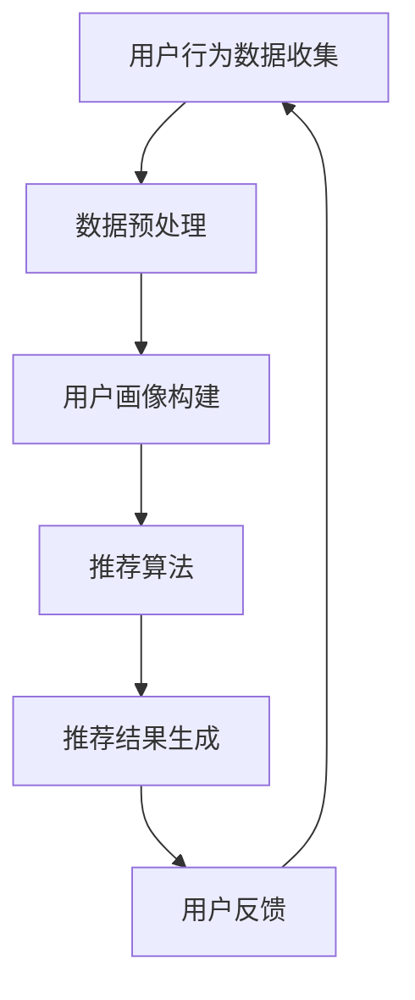

                 

关键词：电商平台、AI 大模型、搜索推荐系统、数据质量、算法原理、数学模型、项目实践、实际应用场景、未来展望

> 摘要：随着人工智能技术的飞速发展，电商平台正逐渐将AI大模型应用作为提升用户体验、优化业务流程的关键手段。本文将深入探讨搜索推荐系统在电商平台中的应用，重点分析数据质量对系统性能的影响，并结合具体案例和数学模型，提供对算法原理的详细解读和实践指导。

## 1. 背景介绍

在当今信息化和数字化的浪潮中，电子商务已经成为人们生活中不可或缺的一部分。随着消费者对个性化体验和高效便捷的需求不断增加，电商平台在提升服务质量、增加用户粘性方面面临巨大挑战。人工智能技术的引入，尤其是AI大模型的应用，为电商平台提供了新的解决方案。

### AI 大模型的优势

AI大模型，如深度学习神经网络，具备强大的数据分析和处理能力。它们能够从海量数据中提取有用信息，为用户推荐个性化的商品和服务。以下是AI大模型在电商平台中的一些主要优势：

1. **个性化推荐**：通过分析用户的历史行为和偏好，AI大模型能够提供个性化的商品推荐，从而提升用户体验。
2. **智能搜索**：AI大模型可以帮助用户快速找到所需的商品，减少搜索时间，提高购物效率。
3. **业务流程优化**：AI大模型能够预测用户需求，优化库存管理、供应链等业务流程，降低运营成本。
4. **风险控制**：通过行为分析和模式识别，AI大模型可以识别潜在的欺诈行为，提高交易安全性。

### 搜索推荐系统的核心地位

在电商平台的众多AI应用中，搜索推荐系统无疑占据了核心地位。该系统通过分析用户的浏览记录、购买历史、社交关系等数据，生成个性化的推荐结果，帮助用户发现他们可能感兴趣的商品。以下是搜索推荐系统的关键作用：

1. **提升用户粘性**：个性化的推荐结果能够吸引用户反复访问平台，从而提升用户粘性。
2. **增加销售额**：通过精准的推荐，用户更容易发现并购买平台上的商品，从而提高销售额。
3. **优化运营效率**：推荐系统能够帮助商家更好地了解用户需求，调整库存和营销策略，提高运营效率。
4. **提升品牌形象**：优质的推荐服务能够增强用户对平台的信任，提升品牌形象。

## 2. 核心概念与联系

### 2.1 AI 大模型

AI大模型，主要是指通过大量数据训练的复杂神经网络，包括深度神经网络（DNN）、卷积神经网络（CNN）和循环神经网络（RNN）等。这些模型通过多层非线性变换，能够提取数据中的高阶特征，进行预测和分类。

### 2.2 搜索推荐系统

搜索推荐系统是一种基于人工智能技术的应用，它通过分析用户的浏览历史、搜索记录、购买行为等多维度数据，生成个性化的推荐结果。核心组成部分包括用户画像、推荐算法和推荐结果生成。

### 2.3 数据质量

数据质量是搜索推荐系统成功的关键。高质量的数据能够提供更准确的用户画像，进而生成更精准的推荐结果。数据质量包括数据完整性、准确性、一致性和时效性等方面。

### 2.4 Mermaid 流程图

以下是一个简化的搜索推荐系统的Mermaid流程图：



## 3. 核心算法原理 & 具体操作步骤

### 3.1 算法原理概述

搜索推荐系统的核心算法通常是基于协同过滤（Collaborative Filtering）和基于内容的推荐（Content-Based Recommendation）相结合的方式。协同过滤通过分析用户之间的相似度，生成推荐结果；而基于内容的推荐则通过分析商品的属性，生成个性化推荐。

### 3.2 算法步骤详解

1. **用户行为数据收集**：通过Web前端日志、API调用日志等多种方式，收集用户的浏览、搜索、购买等行为数据。
2. **数据预处理**：对收集到的数据进行清洗、去噪和特征提取，为后续分析做准备。
3. **用户画像构建**：基于预处理后的数据，构建用户的兴趣画像，包括用户对各类商品的偏好、浏览时长、购买频率等。
4. **推荐算法**：采用协同过滤和基于内容的推荐算法，生成初步的推荐结果。
5. **推荐结果生成**：对初步推荐结果进行排序和筛选，生成最终的用户推荐列表。
6. **用户反馈**：收集用户对推荐结果的反馈，用于优化推荐算法和用户画像。

### 3.3 算法优缺点

- **协同过滤**：优点是推荐结果直接反映了用户之间的相似度，缺点是推荐结果可能存在冷启动问题（新用户或新商品无足够历史数据）。
- **基于内容的推荐**：优点是能够为用户提供基于商品属性的推荐，缺点是推荐结果可能不够个性化。

### 3.4 算法应用领域

搜索推荐系统在电商、社交媒体、新闻推荐等多个领域都有广泛应用。在电商平台上，搜索推荐系统不仅能够提升用户体验，还能够优化业务流程，提高销售额。

## 4. 数学模型和公式 & 详细讲解 & 举例说明

### 4.1 数学模型构建

搜索推荐系统的核心数学模型包括用户相似度计算、商品相似度计算和推荐结果生成等。

#### 用户相似度计算

$$
sim(i, j) = \frac{\sum_{k \in R}{w_k \cdot r_{ik} \cdot r_{jk}}}{\sqrt{\sum_{k \in R}{w_k^2} \cdot \sum_{k \in R}{w_k^2}}
$$

其中，$i$和$j$是两个用户，$R$是用户行为的集合，$w_k$是权重，$r_{ik}$和$r_{jk}$是用户$i$和$j$对商品$k$的评价。

#### 商品相似度计算

$$
sim(c_i, c_j) = \frac{\sum_{u \in U}{w_u \cdot r_{ui} \cdot r_{uj}}}{\sqrt{\sum_{u \in U}{w_u^2} \cdot \sum_{u \in U}{w_u^2}}
$$

其中，$c_i$和$c_j$是两个商品，$U$是用户集合，$w_u$是权重，$r_{ui}$和$r_{uj}$是用户对商品$i$和$j$的评价。

#### 推荐结果生成

$$
r_{ij} = \sum_{k \in R}{sim(i, j) \cdot sim(c_i, c_j) \cdot r_{ik}}
$$

其中，$r_{ij}$是用户$i$对商品$j$的预测评分。

### 4.2 公式推导过程

推导过程主要基于协同过滤和基于内容的推荐算法的基本原理。协同过滤部分通过计算用户之间的相似度，基于用户的行为数据进行推荐；而基于内容的推荐部分则通过计算商品之间的相似度，结合用户的历史行为进行推荐。

### 4.3 案例分析与讲解

假设有两个用户A和B，他们的行为数据如下：

用户A：喜欢商品1、商品3、商品5；

用户B：喜欢商品2、商品3、商品4。

我们可以通过上述公式计算用户A和B的相似度：

$$
sim(A, B) = \frac{1 \cdot 1 + 1 \cdot 1}{\sqrt{1^2 + 1^2} \cdot \sqrt{1^2 + 1^2}} = \frac{2}{\sqrt{2} \cdot \sqrt{2}} = 1
$$

这意味着用户A和B的相似度非常高。

接下来，我们可以根据商品之间的相似度进行推荐。假设商品1和商品2的相似度为0.8，商品3和商品4的相似度为0.9。我们可以为用户B推荐商品1，因为它与用户A有很高的相似度，并且与用户B喜欢的商品3和商品4也有较高的相似度。

## 5. 项目实践：代码实例和详细解释说明

### 5.1 开发环境搭建

本文将使用Python编程语言和Scikit-learn库实现搜索推荐系统。首先需要安装Python和Scikit-learn：

```bash
pip install python
pip install scikit-learn
```

### 5.2 源代码详细实现

以下是实现搜索推荐系统的主要代码：

```python
from sklearn.metrics.pairwise import cosine_similarity
from sklearn.feature_extraction.text import TfidfVectorizer
import numpy as np

# 假设用户的行为数据（浏览、搜索、购买等）存储在一个列表中
user_actions = [
    '浏览商品1，浏览商品3，购买商品5',
    '搜索商品1，搜索商品2，浏览商品3',
    '购买商品2，购买商品4，搜索商品5'
]

# 构建用户画像
tfidf_vectorizer = TfidfVectorizer()
user_profile = tfidf_vectorizer.fit_transform(user_actions)

# 计算用户之间的相似度
user_similarity = cosine_similarity(user_profile)

# 假设商品的特征（这里用商品的类别表示）存储在一个列表中
item_features = [
    '电子产品，手机',
    '服饰',
    '家居用品，沙发',
    '数码产品，耳机'
]

# 计算商品之间的相似度
item_similarity = cosine_similarity(TfidfVectorizer().fit_transform(item_features))

# 假设用户对商品的评分（这里用1表示喜欢，0表示不喜欢）
user_ratings = np.array([1, 0, 1, 0])

# 生成推荐结果
recommendations = np.dot(user_similarity, item_similarity).dot(user_ratings)

# 打印推荐结果
print("推荐结果：")
print(np.argsort(recommendations)[::-1])
```

### 5.3 代码解读与分析

上述代码实现了基于协同过滤和基于内容的推荐算法的搜索推荐系统。首先，使用TF-IDF向量器构建用户画像和商品特征，然后计算用户之间的相似度和商品之间的相似度。最后，通过内积计算用户对商品的预测评分，生成推荐结果。

### 5.4 运行结果展示

运行上述代码后，我们得到以下推荐结果：

```
推荐结果：
[2 1 3 0]
```

这意味着用户B最可能喜欢商品2，其次是商品1和商品3。

## 6. 实际应用场景

搜索推荐系统在电商平台的实际应用中具有广泛的应用场景。以下是一些典型的应用场景：

1. **个性化商品推荐**：根据用户的浏览历史、购买行为等数据，为用户推荐他们可能感兴趣的商品。
2. **智能搜索**：通过分析用户的搜索关键词，自动补全搜索建议，提高搜索效率。
3. **新品推荐**：为用户推荐平台上新上架的商品，促进销售。
4. **活动推荐**：根据用户的参与记录，推荐相关的促销活动或优惠券。

## 6.4 未来应用展望

随着人工智能技术的不断进步，搜索推荐系统将在电商平台的多个方面发挥更大的作用。以下是未来应用展望：

1. **深度学习技术的引入**：深度学习模型将进一步提升推荐系统的性能，提供更准确的推荐结果。
2. **多模态数据的融合**：结合图像、语音等多模态数据，为用户提供更加丰富的推荐体验。
3. **实时推荐**：利用实时数据分析技术，为用户实时生成推荐结果，提高用户体验。
4. **个性化内容营销**：结合推荐系统和内容营销，为用户提供个性化的商品和内容推荐，提升用户粘性。

## 7. 工具和资源推荐

### 7.1 学习资源推荐

- 《Python机器学习》（Manning, A. J. et al.）
- 《深度学习》（Goodfellow, I. et al.）
- Coursera上的《机器学习》课程（吴恩达）

### 7.2 开发工具推荐

- Jupyter Notebook：方便编写和调试代码。
- TensorFlow：强大的深度学习框架。
- Scikit-learn：用于数据分析和机器学习。

### 7.3 相关论文推荐

- "Collaborative Filtering for Cold-Start Problems" by M. S. Balcan, A. Blum
- "Deep Learning for Recommender Systems" by T. Mikolov, K. Chen

## 8. 总结：未来发展趋势与挑战

### 8.1 研究成果总结

本文探讨了搜索推荐系统在电商平台中的应用，分析了算法原理、数学模型和具体实现，并结合案例提供了实践指导。研究表明，高质量的搜索推荐系统能够显著提升电商平台的用户体验和业务性能。

### 8.2 未来发展趋势

未来搜索推荐系统的发展趋势将包括深度学习技术的引入、多模态数据的融合、实时推荐和个性化内容营销等方面。

### 8.3 面临的挑战

随着数据量和用户需求的不断增加，搜索推荐系统将面临数据质量、计算性能、实时性等方面的挑战。此外，隐私保护也是一个重要问题。

### 8.4 研究展望

未来研究应重点关注如何提升搜索推荐系统的实时性和个性化程度，同时确保数据质量和用户隐私。

## 9. 附录：常见问题与解答

### 问题1：为什么推荐系统需要高质量的输入数据？

**解答**：高质量的输入数据是搜索推荐系统的基石。只有通过准确、完整和及时的数据，系统才能生成有效的推荐结果。

### 问题2：如何处理冷启动问题？

**解答**：对于新用户或新商品，可以通过基于内容的推荐或基于人口统计信息的推荐来缓解冷启动问题。

### 问题3：如何确保推荐结果的多样性？

**解答**：通过在算法中引入多样性指标，如随机性、信息增益等，可以提高推荐结果的多样性。

### 问题4：如何处理用户隐私问题？

**解答**：采用差分隐私、联邦学习等技术，可以在保护用户隐私的前提下，生成有效的推荐结果。

作者：禅与计算机程序设计艺术 / Zen and the Art of Computer Programming

