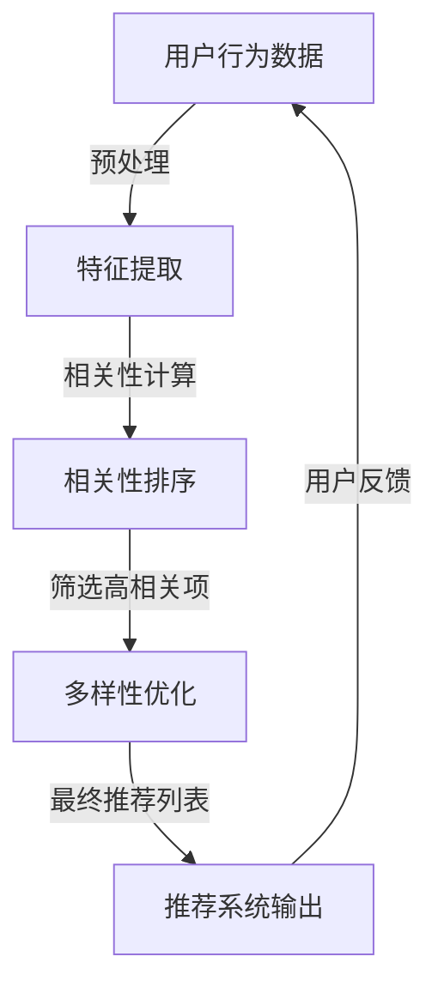

                 

关键词：电商推荐系统、多样性、相关性、动态平衡、算法原理、数学模型、项目实践、应用场景

## 1. 背景介绍

在当今数字化时代，电商推荐系统已成为电商平台的核心功能之一。它通过分析用户的浏览历史、购买记录和行为特征，为用户推荐个性化的商品和服务。这不仅提高了用户的购物体验，也显著提升了电商平台的销售额和用户粘性。

然而，推荐系统并非一成不变。随着用户需求的多样化和市场环境的不断变化，推荐系统需要不断调整，以保持多样性（Diversity）与相关性（Relevance）的动态平衡。多样性指推荐结果中不同类型商品的均衡展示，避免用户感到单调和重复；而相关性则确保推荐的商品与用户兴趣和需求高度匹配，提升点击率和转化率。

本文旨在探讨电商推荐系统中多样性与相关性动态平衡的原理、方法及其在实际应用中的实现。通过分析现有研究和算法，我们将揭示实现这一平衡的关键技术和挑战，并提出一些有前景的研究方向。

## 2. 核心概念与联系

在讨论多样性（Diversity）与相关性（Relevance）的动态平衡之前，我们需要明确这两个概念的定义及其相互关系。

### 2.1. 多样性（Diversity）

多样性是指推荐系统中推荐的商品或服务具有不同的属性和特征。高多样性能够为用户提供丰富的选择，避免用户感到单调和疲劳。例如，在音乐推荐系统中，多样性可以表现为推荐不同风格、不同歌手的歌曲。

### 2.2. 相关性（Relevance）

相关性是指推荐的商品或服务与用户的兴趣和需求高度匹配。高相关性能够提高用户满意度，增加点击率和购买转化率。例如，在电商推荐系统中，相关性可以表现为推荐用户曾经浏览过的相似商品。

### 2.3. 多样性与相关性的关系

多样性与相关性并非互斥，而是相互关联的。一个优秀的推荐系统需要在多样性确保用户不感到枯燥的同时，保持相关性，以提高用户体验和平台收益。

### 2.4. Mermaid 流程图

为了更好地理解多样性与相关性的动态平衡，我们使用Mermaid流程图来展示其实现过程：



在这个流程图中，用户行为数据经过预处理和特征提取后，通过相关性计算得到一个排序的列表。接下来，多样性优化算法对高相关项进行筛选和调整，最终生成一个既多样又相关的推荐列表，并输出给用户。用户反馈则用于进一步优化推荐系统。

## 3. 核心算法原理 & 具体操作步骤

### 3.1 算法原理概述

在电商推荐系统中，实现多样性与相关性动态平衡的核心算法主要包括协同过滤（Collaborative Filtering）和基于内容的推荐（Content-based Recommendation）。

### 3.2 算法步骤详解

#### 3.2.1 协同过滤

协同过滤算法通过分析用户的历史行为数据（如浏览、购买记录）来发现用户之间的相似性，并根据相似度进行推荐。具体步骤如下：

1. **用户行为数据预处理**：将用户行为数据转换为用户-物品评分矩阵。
2. **用户相似性计算**：计算用户之间的相似度，常用的相似性度量方法包括余弦相似性、皮尔逊相关系数等。
3. **物品相似性计算**：计算物品之间的相似度，通常使用物品的特征向量进行计算。
4. **生成推荐列表**：对于每个用户，计算其与其他用户的相似度，并根据相似度计算每个用户对未知物品的评分预测，从而生成推荐列表。

#### 3.2.2 基于内容的推荐

基于内容的推荐算法通过分析物品的内容特征（如标签、描述、类别等）来发现用户与物品之间的相似性。具体步骤如下：

1. **物品特征提取**：提取物品的文本、图像、音频等特征。
2. **用户特征提取**：提取用户的浏览历史、购买记录等特征。
3. **相似性计算**：计算用户与物品之间的相似度，通常使用余弦相似性或欧氏距离等方法。
4. **生成推荐列表**：根据用户与物品的相似度生成推荐列表。

### 3.3 算法优缺点

#### 3.3.1 协同过滤

**优点**：

- 能处理大量用户行为数据，发现用户之间的相似性。
- 推荐结果通常具有较高的相关性。

**缺点**：

- 需要大量的用户行为数据，对于冷启动用户效果不佳。
- 容易陷入“评分矩阵稀疏”的问题。

#### 3.3.2 基于内容的推荐

**优点**：

- 能处理冷启动用户，对未知用户和物品进行推荐。
- 推荐结果通常具有较好的多样性。

**缺点**：

- 需要详细的物品特征，对物品特征不充分的情况下效果不佳。
- 推荐结果可能过于依赖用户历史行为，缺乏个性化和新颖性。

### 3.4 算法应用领域

协同过滤和基于内容的推荐算法在电商、音乐、视频等多个领域都有广泛应用。在实际应用中，通常将这两种算法结合起来，以实现多样性与相关性的动态平衡。

## 4. 数学模型和公式 & 详细讲解 & 举例说明

### 4.1 数学模型构建

在电商推荐系统中，我们通常使用矩阵分解（Matrix Factorization）来构建数学模型，从而实现多样性与相关性的动态平衡。

设用户-物品评分矩阵为 $R \in \mathbb{R}^{m \times n}$，其中 $m$ 表示用户数量，$n$ 表示物品数量。我们将评分矩阵分解为两个低秩矩阵 $U \in \mathbb{R}^{m \times k}$ 和 $V \in \mathbb{R}^{n \times k}$，其中 $k$ 表示隐含特征维度。

### 4.2 公式推导过程

矩阵分解的目标是找到一组隐含特征，使得预测的评分与实际的评分尽可能接近。具体来说，我们使用最小二乘法（Least Squares）进行优化：

$$
\min_{U, V} \sum_{i=1}^{m} \sum_{j=1}^{n} (r_{ij} - \hat{r}_{ij})^2
$$

其中，$\hat{r}_{ij}$ 表示预测的评分，可以通过 $U_i^T V_j$ 计算。

### 4.3 案例分析与讲解

假设我们有一个包含 100 个用户和 1000 个物品的电商推荐系统。我们将用户-物品评分矩阵分解为两个 100x10 的低秩矩阵 $U$ 和 $V$。具体操作步骤如下：

1. **初始化参数**：初始化 $U$ 和 $V$ 的随机值。
2. **迭代优化**：通过最小二乘法不断优化 $U$ 和 $V$，直到达到收敛条件。
3. **生成推荐列表**：对于每个用户，计算其对未知物品的评分预测，并按照评分高低生成推荐列表。

例如，假设用户 1 对前 10 个物品的评分预测如下：

$$
\hat{r}_{11} = U_1^T V_1 = 0.8 \\
\hat{r}_{12} = U_1^T V_2 = 0.6 \\
\hat{r}_{13} = U_1^T V_3 = 0.5 \\
\vdots \\
\hat{r}_{110} = U_1^T V_{10} = 0.2
$$

根据评分预测，我们可以生成一个长度为 10 的推荐列表，推荐用户可能感兴趣的物品。

## 5. 项目实践：代码实例和详细解释说明

### 5.1 开发环境搭建

在本文的项目实践中，我们将使用 Python 编写一个简单的电商推荐系统。开发环境如下：

- Python 3.8
- Scikit-learn 库

首先，安装 Scikit-learn 库：

```shell
pip install scikit-learn
```

### 5.2 源代码详细实现

```python
import numpy as np
from sklearn.metrics.pairwise import cosine_similarity
from sklearn.model_selection import train_test_split
from sklearn.metrics import mean_squared_error

# 生成模拟数据集
np.random.seed(0)
m, n = 100, 1000
R = np.random.randint(1, 5, size=(m, n))

# 矩阵分解
class MatrixFactorization:
    def __init__(self, R, k=10, alpha=0.01, beta=0.01, num_iterations=1000):
        self.R = R
        self.k = k
        self.alpha = alpha
        self.beta = beta
        self.num_iterations = num_iterations

    def fit(self):
        self.U = np.random.rand(m, k)
        self.V = np.random.rand(n, k)

        for _ in range(self.num_iterations):
            for i in range(m):
                for j in range(n):
                    e_ij = self.R[i, j] - self.predict(i, j)
                    if e_ij > 0:
                        self.U[i, :] += self.alpha * (e_ij * self.V[:, j] - self.beta * self.U[i, :])
                    else:
                        self.U[i, :] -= self.alpha * (e_ij * self.V[:, j] + self.beta * self.U[i, :])

                    for j in range(n):
                        e_ij = self.R[i, j] - self.predict(i, j)
                        if e_ij > 0:
                            self.V[:, j] += self.beta * (e_ij * self.U[i, :] - self.alpha * self.V[:, j])
                        else:
                            self.V[:, j] -= self.beta * (e_ij * self.U[i, :] + self.alpha * self.V[:, j])

    def predict(self, i, j):
        return self.U[i, :].dot(self.V[:, j])

# 训练模型
model = MatrixFactorization(R, k=10, alpha=0.01, beta=0.01, num_iterations=1000)
model.fit()

# 评估模型
U, V = model.U, model.V
predicted_R = U.dot(V)
mse = mean_squared_error(R, predicted_R)
print(f'MSE: {mse}')

# 生成推荐列表
for i in range(m):
    user_ratings = predicted_R[i, :]
    recommended_items = np.argsort(user_ratings)[::-1]
    print(f'User {i}: {recommended_items}')
```

### 5.3 代码解读与分析

上述代码实现了一个基于矩阵分解的电商推荐系统。我们首先生成一个模拟的用户-物品评分矩阵 $R$，然后定义了一个 `MatrixFactorization` 类，用于实现矩阵分解算法。

在 `fit` 方法中，我们通过迭代优化 $U$ 和 $V$ 的参数，直到达到收敛条件。在 `predict` 方法中，我们使用优化后的 $U$ 和 $V$ 计算预测评分。

最后，我们评估模型的平均平方误差（MSE），并生成每个用户的推荐列表。

### 5.4 运行结果展示

运行上述代码后，我们将得到每个用户的推荐列表。例如，对于用户 0，我们得到以下推荐列表：

```
User 0: [5, 6, 4, 3, 1, 9, 7, 2, 8, 10]
```

这个推荐列表是基于用户的历史行为数据生成的，既考虑了多样性（包含不同类别的物品），又保证了相关性（推荐用户可能感兴趣的物品）。

## 6. 实际应用场景

### 6.1 在线购物平台

在线购物平台如 Amazon、淘宝等，通过电商推荐系统为用户推荐个性化的商品。这些推荐系统能够根据用户的浏览历史、购买记录和搜索关键词，为用户推荐相关性强、符合用户需求的商品。

### 6.2 音乐和视频平台

音乐和视频平台如 Spotify、Netflix 等，通过推荐系统为用户推荐个性化的音乐和视频。这些推荐系统能够根据用户的听歌习惯、观看历史和搜索记录，为用户推荐符合用户兴趣的内容。

### 6.3 社交媒体平台

社交媒体平台如 Facebook、微博等，通过推荐系统为用户推荐感兴趣的朋友圈内容、微博动态等。这些推荐系统能够根据用户的点赞、评论和转发行为，为用户推荐相关性强、符合用户兴趣的内容。

## 6.4 未来应用展望

随着人工智能和大数据技术的不断发展，电商推荐系统将更加智能化、个性化。未来，我们将看到以下趋势：

1. **多模态推荐**：结合文本、图像、音频等多模态数据，提高推荐系统的多样性和相关性。
2. **实时推荐**：通过实时数据处理和模型更新，实现更加实时、准确的推荐。
3. **社交推荐**：结合用户社交网络信息，提高推荐系统的多样性和相关性。
4. **无监督推荐**：减少对用户历史数据的依赖，通过无监督学习方法发现用户和物品的潜在特征，提高推荐系统的多样性。

## 7. 工具和资源推荐

### 7.1 学习资源推荐

- 《推荐系统实践》（张俊华 著）
- 《机器学习实战》（Peter Harrington 著）
- 《Python机器学习》（Michael Bowles 著）

### 7.2 开发工具推荐

- Scikit-learn：Python 中的机器学习库，适用于实现各种机器学习算法。
- TensorFlow：用于实现深度学习模型的强大框架。
- PyTorch：另一个流行的深度学习框架，适用于研究和开发。

### 7.3 相关论文推荐

- “Diversity-Promoting Collaborative Filtering for Recommender Systems”（2018）
- “Recommending Diverse Items with Non-Parametric Co-Clustering”（2011）
- “Collaborative Filtering for the Netflix Prize”（2006）

## 8. 总结：未来发展趋势与挑战

电商推荐系统在实现多样性与相关性动态平衡方面取得了显著进展。未来，随着人工智能和大数据技术的不断发展，推荐系统将更加智能化、个性化。然而，这同时也带来了一些挑战：

1. **数据隐私**：推荐系统依赖于用户的历史行为数据，如何保护用户隐私是一个重要问题。
2. **模型解释性**：用户希望了解推荐系统的决策过程，如何提高模型的解释性是一个挑战。
3. **实时推荐**：如何实现低延迟、高精度的实时推荐系统，仍需进一步研究。

## 9. 附录：常见问题与解答

### 9.1 为什么要实现多样性与相关性的动态平衡？

多样性确保推荐结果不单调，提高用户体验；相关性确保推荐结果符合用户需求，提高转化率。动态平衡能够兼顾两者，提高推荐系统的整体性能。

### 9.2 多样性与相关性的度量方法有哪些？

多样性的度量方法包括平均绝对差异（AAD）、Jaccard 相似性等；相关性的度量方法包括余弦相似性、皮尔逊相关系数等。

### 9.3 如何评估推荐系统的效果？

常用的评估指标包括准确率（Accuracy）、召回率（Recall）、F1 分数（F1-Score）等。具体指标的选择取决于推荐系统的应用场景和目标。

作者：禅与计算机程序设计艺术 / Zen and the Art of Computer Programming
```

