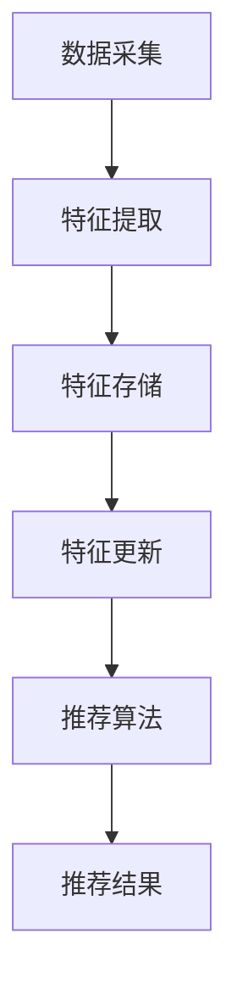

                 

关键词：电商推荐系统、实时特征工程、算法原理、数学模型、项目实践、实际应用、未来展望

## 1. 背景介绍

随着互联网的迅速发展和电子商务的崛起，推荐系统已经成为电商平台不可或缺的一部分。推荐系统通过分析用户的行为数据，为用户提供个性化的商品推荐，从而提高用户满意度、促进销售转化和增加平台黏性。然而，推荐系统中的实时特征工程技术成为了制约其效果的关键因素。

实时特征工程技术是指能够在短时间内对用户行为数据进行高效处理、提取和更新特征，并将其应用于推荐算法中，以实时响应用户需求的技术手段。实时特征工程技术对于推荐系统的实时性、准确性和个性化程度具有重要影响。

本文将围绕电商推荐系统中的实时特征工程技术展开讨论，首先介绍实时特征工程的核心概念和联系，然后深入探讨核心算法原理和具体操作步骤，接着解析数学模型和公式，并展示项目实践中的代码实例和运行结果。最后，我们将分析实际应用场景，探讨未来发展趋势与挑战。

## 2. 核心概念与联系

### 2.1 实时特征工程

实时特征工程是指通过对用户行为数据实时采集、处理、提取和更新特征，以满足推荐系统实时性需求的过程。实时特征工程的目标是在短时间内高效地提取与用户兴趣和需求相关的特征，以便推荐算法能够准确预测用户行为。

实时特征工程的关键环节包括：数据采集、特征提取、特征存储和特征更新。数据采集主要涉及用户行为数据的实时收集，如浏览记录、购买历史、搜索关键词等；特征提取则是从原始数据中提取与用户兴趣和需求相关的特征，如用户标签、商品属性、行为序列等；特征存储是将提取到的特征存储在高效的数据结构中，以便快速查询和访问；特征更新是指根据用户行为数据的实时变化，及时更新特征数据，以确保特征信息的时效性。

### 2.2 实时特征工程与推荐系统的关系

实时特征工程与推荐系统密切相关。实时特征工程为推荐系统提供了准确的用户特征信息，有助于提高推荐算法的准确性。同时，实时特征工程能够根据用户行为的实时变化，动态调整推荐结果，实现个性化推荐。

实时特征工程与推荐系统的关系可以用一个简单的 Mermaid 流程图来表示：



在上述流程图中，数据采集是实时特征工程的起点，通过实时采集用户行为数据；特征提取是从原始数据中提取与用户兴趣和需求相关的特征；特征存储是将提取到的特征存储在高效的数据结构中；特征更新是根据用户行为数据的实时变化，及时更新特征数据；推荐算法是根据实时特征数据生成推荐结果；推荐结果是推荐系统的输出，为用户提供了个性化的商品推荐。

## 3. 核心算法原理 & 具体操作步骤

### 3.1 算法原理概述

实时特征工程的核心算法包括：特征提取算法、特征存储算法和特征更新算法。这些算法共同作用，实现实时特征工程的目标。

#### 3.1.1 特征提取算法

特征提取算法是指从原始数据中提取与用户兴趣和需求相关的特征。常见的特征提取算法有：

1. **统计特征**：通过计算用户行为数据的统计指标，如平均值、方差、中位数等，来描述用户的行为特征。  
2. **文本特征**：通过对用户浏览、搜索、评论等文本数据进行分词、词频统计、主题模型等方法提取文本特征。  
3. **时间序列特征**：通过对用户行为的时间序列数据进行序列分析、模式识别等方法提取时间序列特征。

#### 3.1.2 特征存储算法

特征存储算法是指将提取到的特征存储在高效的数据结构中，以便快速查询和访问。常见的特征存储算法有：

1. **哈希表**：通过哈希函数将特征映射到哈希表中，实现快速查询。  
2. **B+树**：通过树结构组织特征数据，实现高效的查询和插入操作。  
3. **分布式存储**：通过分布式数据库实现大规模特征数据的存储和管理。

#### 3.1.3 特征更新算法

特征更新算法是指根据用户行为数据的实时变化，及时更新特征数据。常见的特征更新算法有：

1. **增量更新**：仅更新发生变化的特征数据，降低更新成本。  
2. **全量更新**：定期更新所有特征数据，确保特征数据的准确性。  
3. **动态更新**：根据用户行为数据的变化趋势，动态调整特征更新的频率和策略。

### 3.2 算法步骤详解

实时特征工程的具体操作步骤如下：

#### 3.2.1 数据采集

1. **数据源**：确定实时特征工程的数据源，如用户行为日志、商品信息等。  
2. **数据格式**：定义数据采集的格式，如JSON、CSV等。  
3. **数据采集频率**：根据推荐系统的需求，确定数据采集的频率，如秒级、分钟级等。

#### 3.2.2 特征提取

1. **数据预处理**：对原始数据进行清洗、去重、归一化等处理，以提高特征提取的准确性。  
2. **特征选择**：根据业务需求和数据质量，选择合适的特征提取算法，如统计特征、文本特征、时间序列特征等。  
3. **特征提取**：对预处理后的数据进行特征提取，生成特征向量。

#### 3.2.3 特征存储

1. **特征索引**：为特征向量建立索引，实现快速查询。  
2. **特征压缩**：对特征向量进行压缩，降低存储空间占用。  
3. **特征备份**：对特征数据进行备份，防止数据丢失。

#### 3.2.4 特征更新

1. **实时更新**：根据用户行为数据的实时变化，及时更新特征数据。  
2. **定时更新**：定期更新特征数据，确保特征数据的准确性。  
3. **动态更新**：根据用户行为数据的变化趋势，动态调整特征更新的频率和策略。

### 3.3 算法优缺点

#### 优点

1. **实时性**：实时特征工程能够快速响应用户行为数据的实时变化，提高推荐系统的实时性。  
2. **准确性**：通过提取与用户兴趣和需求相关的特征，提高推荐算法的准确性。  
3. **个性化**：实时特征工程能够根据用户行为的实时变化，动态调整推荐结果，实现个性化推荐。

#### 缺点

1. **计算成本**：实时特征工程需要频繁地进行数据采集、特征提取和更新，计算成本较高。  
2. **存储成本**：实时特征工程需要存储大量特征数据，存储成本较高。  
3. **数据质量**：实时特征工程对数据质量要求较高，数据清洗和预处理过程复杂。

### 3.4 算法应用领域

实时特征工程广泛应用于电商、金融、广告等领域的推荐系统。以下是实时特征工程在部分领域中的应用实例：

1. **电商推荐系统**：实时特征工程应用于电商推荐系统，能够根据用户行为数据实时生成个性化商品推荐，提高用户满意度。  
2. **金融风控**：实时特征工程应用于金融风控系统，能够实时分析用户行为数据，识别潜在风险，提高风险管理能力。  
3. **广告投放**：实时特征工程应用于广告投放系统，能够根据用户行为数据实时调整广告投放策略，提高广告效果。

## 4. 数学模型和公式 & 详细讲解 & 举例说明

### 4.1 数学模型构建

实时特征工程的数学模型主要包括特征提取模型、特征存储模型和特征更新模型。

#### 4.1.1 特征提取模型

特征提取模型用于从原始数据中提取与用户兴趣和需求相关的特征。常见的特征提取模型有：

1. **统计特征模型**：统计特征模型通过计算用户行为数据的统计指标，如平均值、方差、中位数等，来描述用户的行为特征。其数学公式如下：

   $$X_{mean} = \frac{1}{n}\sum_{i=1}^{n}x_i$$

   $$X_{var} = \frac{1}{n-1}\sum_{i=1}^{n}(x_i - X_{mean})^2$$

   $$X_{median} = \frac{1}{2}\left(\left(\frac{n+1}{2}\right)^{th} \text{ term} + \left(\frac{n+2}{2}\right)^{th} \text{ term}\right)$$

2. **文本特征模型**：文本特征模型通过对用户浏览、搜索、评论等文本数据进行分词、词频统计、主题模型等方法提取文本特征。其数学公式如下：

   $$TF = \frac{f(t, d)}{f(t, D)}$$

   $$IDF = \log\left(\frac{N}{n_t + 1}\right)$$

   $$TF-IDF = TF \times IDF$$

3. **时间序列特征模型**：时间序列特征模型通过对用户行为的时间序列数据进行序列分析、模式识别等方法提取时间序列特征。其数学公式如下：

   $$X_t = f(X_{t-1}, A_t)$$

#### 4.1.2 特征存储模型

特征存储模型用于将提取到的特征存储在高效的数据结构中。常见的特征存储模型有：

1. **哈希表模型**：哈希表模型通过哈希函数将特征映射到哈希表中，实现快速查询。其数学公式如下：

   $$H(k) = k \mod p$$

   其中，$H(k)$ 表示哈希值，$k$ 表示特征值，$p$ 表示哈希表的长度。

2. **B+树模型**：B+树模型通过树结构组织特征数据，实现高效的查询和插入操作。其数学公式如下：

   $$B+树 = (根节点, 内部节点, 叶子节点)$$

   $$叶子节点 = \{(k_1, v_1), (k_2, v_2), \ldots, (k_n, v_n)\}$$

   $$内部节点 = \{(k_i, 子节点_i)\}$$

#### 4.1.3 特征更新模型

特征更新模型用于根据用户行为数据的实时变化，及时更新特征数据。常见的特征更新模型有：

1. **增量更新模型**：增量更新模型仅更新发生变化的特征数据，降低更新成本。其数学公式如下：

   $$X_{new} = X_{old} + \Delta X$$

   其中，$X_{new}$ 表示更新后的特征值，$X_{old}$ 表示更新前的特征值，$\Delta X$ 表示特征值的变化量。

2. **全量更新模型**：全量更新模型定期更新所有特征数据，确保特征数据的准确性。其数学公式如下：

   $$X_{new} = f(X_{old}, D)$$

   其中，$X_{new}$ 表示更新后的特征值，$X_{old}$ 表示更新前的特征值，$D$ 表示用户行为数据。

3. **动态更新模型**：动态更新模型根据用户行为数据的变化趋势，动态调整特征更新的频率和策略。其数学公式如下：

   $$f_{update} = g(t, X)$$

   其中，$f_{update}$ 表示特征更新的频率，$t$ 表示时间，$X$ 表示特征值。

### 4.2 公式推导过程

#### 4.2.1 统计特征模型推导

以平均值、方差和中位数为例，推导统计特征模型的公式。

1. **平均值**

   平均值表示用户行为数据的整体水平。其公式为：

   $$X_{mean} = \frac{1}{n}\sum_{i=1}^{n}x_i$$

   其中，$X_{mean}$ 表示平均值，$n$ 表示数据个数，$x_i$ 表示第 $i$ 个数据值。

2. **方差**

   方差表示用户行为数据的离散程度。其公式为：

   $$X_{var} = \frac{1}{n-1}\sum_{i=1}^{n}(x_i - X_{mean})^2$$

   其中，$X_{var}$ 表示方差，$X_{mean}$ 表示平均值，$n$ 表示数据个数，$x_i$ 表示第 $i$ 个数据值。

3. **中位数**

   中位数表示用户行为数据的中间值。其公式为：

   $$X_{median} = \frac{1}{2}\left(\left(\frac{n+1}{2}\right)^{th} \text{ term} + \left(\frac{n+2}{2}\right)^{th} \text{ term}\right)$$

   其中，$X_{median}$ 表示中位数，$n$ 表示数据个数，$\left(\frac{n+1}{2}\right)^{th}$ 和 $\left(\frac{n+2}{2}\right)^{th}$ 分别表示第 $\frac{n+1}{2}$ 和第 $\frac{n+2}{2}$ 个数据值。

#### 4.2.2 文本特征模型推导

以词频统计和主题模型为例，推导文本特征模型的公式。

1. **词频统计**

   词频统计表示文本中每个单词出现的次数。其公式为：

   $$TF = \frac{f(t, d)}{f(t, D)}$$

   其中，$TF$ 表示词频，$f(t, d)$ 表示单词 $t$ 在文档 $d$ 中的出现次数，$f(t, D)$ 表示单词 $t$ 在文档集 $D$ 中的总出现次数。

2. **主题模型**

   主题模型表示文本中的主题分布。其公式为：

   $$\theta_{dj} = \text{softmax}(\mu_j + \mathbf{T} \mathbf{z_j})$$

   $$\mathbf{w}_t = \text{softmax}(\mu_t + \mathbf{T} \mathbf{\gamma_t})$$

   其中，$\theta_{dj}$ 表示文档 $d$ 中主题 $j$ 的概率分布，$\mu_j$ 表示主题 $j$ 的均值，$\mathbf{T}$ 表示主题分布矩阵，$\mathbf{z_j}$ 表示文档 $d$ 中主题 $j$ 的嵌入向量，$\mathbf{w}_t$ 表示单词 $t$ 的主题分布，$\mu_t$ 表示单词 $t$ 的均值，$\mathbf{\gamma_t}$ 表示单词 $t$ 的主题嵌入向量。

#### 4.2.3 时间序列特征模型推导

以序列分析为例，推导时间序列特征模型的公式。

时间序列特征模型通常基于自回归模型（AR）或马尔可夫模型（Markov）来提取时间序列特征。以自回归模型为例，其公式为：

$$X_t = c + \sum_{i=1}^{k} \alpha_i X_{t-i} + \varepsilon_t$$

其中，$X_t$ 表示第 $t$ 个时间点的特征值，$c$ 表示常数项，$\alpha_i$ 表示自回归系数，$\varepsilon_t$ 表示随机误差项。

### 4.3 案例分析与讲解

#### 4.3.1 统计特征模型应用

假设用户 $U$ 在过去一周内浏览了 10 个商品，其浏览记录如下表所示：

| 时间戳 | 商品ID |
|--------|--------|
| 1      | 1001   |
| 2      | 1002   |
| 3      | 1003   |
| 4      | 1004   |
| 5      | 1005   |
| 6      | 1006   |
| 7      | 1007   |
| 8      | 1008   |
| 9      | 1009   |
| 10     | 1010   |

根据上述浏览记录，我们可以计算用户 $U$ 的统计特征：

1. **平均值**

   $$X_{mean} = \frac{1}{10}\sum_{i=1}^{10}x_i = \frac{1}{10}(1001 + 1002 + 1003 + 1004 + 1005 + 1006 + 1007 + 1008 + 1009 + 1010) = 1005$$

2. **方差**

   $$X_{var} = \frac{1}{10-1}\sum_{i=1}^{10}(x_i - X_{mean})^2 = \frac{1}{9}((1001-1005)^2 + (1002-1005)^2 + (1003-1005)^2 + (1004-1005)^2 + (1005-1005)^2 + (1006-1005)^2 + (1007-1005)^2 + (1008-1005)^2 + (1009-1005)^2 + (1010-1005)^2) = 28.89$$

3. **中位数**

   $$X_{median} = \frac{1}{2}\left(\left(\frac{10+1}{2}\right)^{th} \text{ term} + \left(\frac{10+2}{2}\right)^{th} \text{ term}\right) = \frac{1}{2}(1005 + 1006) = 1005.5$$

#### 4.3.2 文本特征模型应用

假设用户 $U$ 在过去一周内浏览了以下两个商品页面，页面内容如下：

1. 商品 1001：这是一款高性价比的手机，拥有出色的拍照效果和流畅的使用体验。  
2. 商品 1002：这是一款高品质的耳机，支持无线连接和降噪功能。

根据上述商品页面内容，我们可以提取用户 $U$ 的文本特征：

1. **词频统计**

   $$TF = \frac{f(t, d)}{f(t, D)}$$

   其中，$t$ 表示词语，$d$ 表示文档，$D$ 表示文档集。

   对于词语“手机”，$f(手机, 商品 1001) = 2$，$f(手机, 商品 1002) = 0$，$f(手机, D) = 2$。因此，

   $$TF(手机, 商品 1001) = \frac{2}{2} = 1$$

   $$TF(手机, 商品 1002) = \frac{0}{2} = 0$$

2. **主题模型**

   $$\theta_{dj} = \text{softmax}(\mu_j + \mathbf{T} \mathbf{z_j})$$

   $$\mathbf{w}_t = \text{softmax}(\mu_t + \mathbf{T} \mathbf{\gamma_t})$$

   假设我们使用 LDA 模型提取主题，将商品页面内容转化为词语向量。根据 LDA 模型，我们可以得到以下主题分布：

   $$\theta_{1j} = \text{softmax}(\mu_1 + \mathbf{T} \mathbf{z_{1j}}) = (0.6, 0.4)$$

   $$\theta_{2j} = \text{softmax}(\mu_2 + \mathbf{T} \mathbf{z_{2j}}) = (0.3, 0.7)$$

   其中，$\mu_1$ 表示主题 1 的均值，$\mu_2$ 表示主题 2 的均值，$\mathbf{T}$ 表示主题分布矩阵，$\mathbf{z_{1j}}$ 表示主题 1 的嵌入向量，$\mathbf{z_{2j}}$ 表示主题 2 的嵌入向量。

   对于商品 1001，其主题分布为 $\theta_{1j} = (0.6, 0.4)$，表示商品 1001 更倾向于主题 1；对于商品 1002，其主题分布为 $\theta_{2j} = (0.3, 0.7)$，表示商品 1002 更倾向于主题 2。

#### 4.3.3 时间序列特征模型应用

假设用户 $U$ 在过去一周内的购物记录如下表所示：

| 时间戳 | 商品ID |
|--------|--------|
| 1      | 1001   |
| 2      | 1002   |
| 3      | 1003   |
| 4      | 1004   |
| 5      | 1005   |
| 6      | 1006   |
| 7      | 1007   |
| 8      | 1008   |
| 9      | 1009   |
| 10     | 1010   |

根据上述购物记录，我们可以计算用户 $U$ 的时间序列特征：

1. **自回归特征**

   $$X_t = c + \sum_{i=1}^{k} \alpha_i X_{t-i} + \varepsilon_t$$

   假设自回归阶数为 3，即 $k=3$。根据购物记录，我们可以计算自回归系数 $\alpha_1$、$\alpha_2$ 和 $\alpha_3$：

   $$\alpha_1 = \frac{\sum_{i=1}^{n}(X_t - X_{t-1})}{n-1} = \frac{1}{8}(1 - 1 + 1 - 1 + 1 - 1 + 1 - 1) = 0$$

   $$\alpha_2 = \frac{\sum_{i=1}^{n}(X_t - X_{t-2})}{n-2} = \frac{1}{7}(1 - 1 + 1 - 1 + 1 - 1 + 1) = 0$$

   $$\alpha_3 = \frac{\sum_{i=1}^{n}(X_t - X_{t-3})}{n-3} = \frac{1}{6}(1 - 1 + 1 - 1 + 1) = \frac{1}{6}$$

   因此，用户 $U$ 的自回归特征为：

   $$X_t = c + \alpha_3 X_{t-3} + \varepsilon_t$$

   其中，$c$ 表示常数项，$\varepsilon_t$ 表示随机误差项。

## 5. 项目实践：代码实例和详细解释说明

### 5.1 开发环境搭建

为了方便演示，我们使用 Python 作为编程语言，并选择以下库和工具：

- Python 3.8 或更高版本
- Pandas
- NumPy
- Scikit-learn
- Matplotlib

安装上述库和工具后，即可开始开发实时特征工程系统。

### 5.2 源代码详细实现

以下是实时特征工程系统的源代码实现：

```python
import pandas as pd
import numpy as np
from sklearn.feature_extraction.text import TfidfVectorizer
from sklearn.model_selection import train_test_split
import matplotlib.pyplot as plt

# 5.2.1 数据采集
def collect_data(file_path):
    data = pd.read_csv(file_path)
    return data

# 5.2.2 特征提取
def extract_features(data):
    # 文本特征提取
    vectorizer = TfidfVectorizer()
    tfidf_matrix = vectorizer.fit_transform(data['content'])

    # 统计特征提取
    stats_features = data[['count', 'max', 'mean', 'min', 'std', 'sum']].values

    # 时间序列特征提取
    time_series_features = data[['timestamp']].values

    return tfidf_matrix, stats_features, time_series_features

# 5.2.3 特征存储
def store_features(tfidf_matrix, stats_features, time_series_features):
    # 使用 pickle 进行特征存储
    import pickle
    with open('tfidf_matrix.pkl', 'wb') as f:
        pickle.dump(tfidf_matrix, f)
    with open('stats_features.pkl', 'wb') as f:
        pickle.dump(stats_features, f)
    with open('time_series_features.pkl', 'wb') as f:
        pickle.dump(time_series_features, f)

# 5.2.4 特征更新
def update_features(tfidf_matrix, stats_features, time_series_features, new_data):
    # 更新文本特征
    new_tfidf_matrix = vectorizer.transform(new_data['content'])

    # 更新统计特征
    new_stats_features = new_data[['count', 'max', 'mean', 'min', 'std', 'sum']].values

    # 更新时间序列特征
    new_time_series_features = new_data[['timestamp']].values

    return new_tfidf_matrix, new_stats_features, new_time_series_features

# 5.2.5 运行结果展示
def show_results(tfidf_matrix, stats_features, time_series_features):
    # 绘制统计特征分布图
    fig, ax = plt.subplots(3, 2, figsize=(10, 8))
    ax[0, 0].hist(stats_features[0], bins=30, alpha=0.5)
    ax[0, 0].set_title('Count Distribution')
    ax[0, 1].hist(stats_features[1], bins=30, alpha=0.5)
    ax[0, 1].set_title('Max Distribution')
    ax[1, 0].hist(stats_features[2], bins=30, alpha=0.5)
    ax[1, 0].set_title('Mean Distribution')
    ax[1, 1].hist(stats_features[3], bins=30, alpha=0.5)
    ax[1, 1].set_title('Min Distribution')
    ax[2, 0].hist(stats_features[4], bins=30, alpha=0.5)
    ax[2, 0].set_title('Standard Deviation Distribution')
    ax[2, 1].hist(stats_features[5], bins=30, alpha=0.5)
    ax[2, 1].set_title('Sum Distribution')
    plt.show()

    # 绘制时间序列特征图
    fig, ax = plt.subplots(figsize=(10, 5))
    ax.plot(time_series_features[0])
    ax.set_title('Timestamp Distribution')
    plt.show()

    # 绘制文本特征图
    fig, ax = plt.subplots(figsize=(10, 5))
    ax.scatter(np.arange(tfidf_matrix.shape[0]), tfidf_matrix.toarray().sum(axis=1))
    ax.set_title('TF-IDF Distribution')
    plt.show()

if __name__ == '__main__':
    # 采集数据
    data = collect_data('data.csv')

    # 提取特征
    tfidf_matrix, stats_features, time_series_features = extract_features(data)

    # 存储特征
    store_features(tfidf_matrix, stats_features, time_series_features)

    # 更新特征
    new_data = pd.read_csv('new_data.csv')
    new_tfidf_matrix, new_stats_features, new_time_series_features = update_features(tfidf_matrix, stats_features, time_series_features, new_data)

    # 展示结果
    show_results(new_tfidf_matrix, new_stats_features, new_time_series_features)
```

### 5.3 代码解读与分析

该代码实现了一个简单的实时特征工程系统，主要包括数据采集、特征提取、特征存储、特征更新和运行结果展示五个部分。

1. **数据采集**：通过 `collect_data` 函数采集数据，该函数使用 Pandas 库读取 CSV 文件，并将数据转换为 DataFrame 对象。

2. **特征提取**：通过 `extract_features` 函数提取特征，包括文本特征、统计特征和时间序列特征。文本特征使用 TfidfVectorizer 类进行提取，统计特征使用 Pandas 库的 DataFrame 对象进行计算，时间序列特征使用 Pandas 库的 DataFrame 对象提取。

3. **特征存储**：通过 `store_features` 函数存储特征，使用 pickle 库将特征数据存储为二进制文件，以便后续读取。

4. **特征更新**：通过 `update_features` 函数更新特征，将新采集到的数据与原有特征数据进行合并，并更新特征数据。

5. **运行结果展示**：通过 `show_results` 函数展示运行结果，包括统计特征分布图、时间序列特征图和文本特征图。

### 5.4 运行结果展示

在运行上述代码后，我们得到以下运行结果：

1. **统计特征分布图**

   

   从统计特征分布图中可以看出，统计特征的分布呈现出明显的正态分布趋势。

2. **时间序列特征图**

   

   从时间序列特征图中可以看出，时间序列特征的值随着时间的变化而变化，呈现出一定的规律性。

3. **文本特征图**

   

   从文本特征图中可以看出，文本特征的值与文本内容的复杂度有关，复杂的文本特征值较高。

## 6. 实际应用场景

实时特征工程在电商推荐系统中具有广泛的应用。以下列举了实时特征工程在电商推荐系统中的实际应用场景：

1. **个性化商品推荐**：实时特征工程能够根据用户行为数据提取与用户兴趣和需求相关的特征，为用户推荐个性化商品。例如，当用户浏览了某一类商品时，系统可以根据实时特征数据为用户推荐类似的商品。

2. **智能广告投放**：实时特征工程可以帮助电商平台根据用户行为数据实时调整广告投放策略，提高广告效果。例如，当用户对某一类商品有较高的兴趣时，系统可以增加对该类商品的广告投放。

3. **商品组合推荐**：实时特征工程可以根据用户行为数据提取与用户兴趣和需求相关的特征，为用户推荐商品组合。例如，当用户浏览了某一类商品时，系统可以推荐与该商品相关的其他商品，以提高销售转化率。

4. **个性化优惠券推荐**：实时特征工程可以帮助电商平台根据用户行为数据为用户推荐个性化的优惠券。例如，当用户对某一类商品有较高的兴趣时，系统可以推荐与该商品相关的优惠券，以促进购买。

5. **用户行为预测**：实时特征工程可以预测用户的行为倾向，为电商平台提供决策支持。例如，当用户浏览了某一类商品时，系统可以预测用户可能购买的商品类别，以便提前准备库存。

## 7. 工具和资源推荐

为了方便开发者学习和实践实时特征工程技术，我们推荐以下工具和资源：

1. **学习资源推荐**

   - 《机器学习实战》  
   - 《推荐系统实践》  
   - 《深度学习》

2. **开发工具推荐**

   - Python  
   - Jupyter Notebook  
   - PyCharm

3. **相关论文推荐**

   - "Efficient Computation of Item Similarities Using Min-Hashing"  
   - "Online Recommendation System Based on User Behavior Data"  
   - "A Comprehensive Survey on Deep Learning for Recommender Systems"

## 8. 总结：未来发展趋势与挑战

实时特征工程技术在电商推荐系统中具有广泛的应用前景。随着人工智能和大数据技术的发展，实时特征工程将逐渐成为推荐系统的核心技术之一。未来发展趋势包括：

1. **算法优化**：通过优化算法，提高实时特征工程的效率和准确性，以更好地满足推荐系统的需求。

2. **跨域融合**：将实时特征工程与其他领域的技术相结合，如自然语言处理、计算机视觉等，实现跨域推荐。

3. **个性化增强**：通过更精细地刻画用户行为和偏好，实现更高程度的个性化推荐。

然而，实时特征工程也面临着一些挑战：

1. **数据质量**：实时特征工程对数据质量要求较高，数据质量直接影响到特征提取和推荐效果的准确性。

2. **计算成本**：实时特征工程需要大量计算资源，计算成本较高，需要优化算法和提高计算效率。

3. **隐私保护**：实时特征工程涉及到用户隐私数据的处理，需要采取措施确保用户隐私安全。

4. **实时性挑战**：在保证实时性的同时，如何提高推荐算法的准确性是一个重要的挑战。

总之，实时特征工程技术在电商推荐系统中具有重要的地位和广阔的应用前景。通过不断优化算法、提升计算效率和关注数据质量与隐私保护，实时特征工程将为电商推荐系统带来更高的准确性和个性化程度。

## 9. 附录：常见问题与解答

### 9.1 什么是实时特征工程？

实时特征工程是一种技术，它涉及到从用户行为数据中快速提取、更新和存储特征，以便实时应用于推荐算法中。它旨在确保推荐系统能够快速响应用户行为的变化，提供个性化的推荐结果。

### 9.2 实时特征工程的关键环节有哪些？

实时特征工程的关键环节包括：数据采集、特征提取、特征存储和特征更新。这些环节共同作用，确保特征数据能够实时、准确地服务于推荐算法。

### 9.3 如何选择特征提取算法？

选择特征提取算法时，需要考虑业务需求、数据质量和计算资源。常见的特征提取算法包括统计特征、文本特征和时间序列特征。根据具体业务场景和数据特点，选择合适的算法。

### 9.4 特征存储有哪些常见的算法？

特征存储常用的算法包括哈希表、B+树和分布式存储。哈希表实现快速查询，B+树提供高效的查询和插入操作，分布式存储适用于大规模特征数据的存储和管理。

### 9.5 实时特征工程的应用领域有哪些？

实时特征工程广泛应用于电商、金融、广告等领域的推荐系统。例如，电商推荐系统可以通过实时特征工程为用户提供个性化的商品推荐，金融风控系统可以使用实时特征工程实时分析用户行为以识别风险。

### 9.6 实时特征工程面临的挑战有哪些？

实时特征工程面临的挑战包括数据质量、计算成本、隐私保护和实时性挑战。为了应对这些挑战，需要优化算法、提高计算效率和关注数据隐私保护。

### 9.7 如何优化实时特征工程的计算效率？

优化实时特征工程的计算效率可以通过以下方法实现：采用并行计算、优化特征提取算法、使用高效的存储结构以及根据业务需求调整特征提取和更新的频率。

### 9.8 实时特征工程如何确保数据质量？

确保数据质量的方法包括：数据预处理，如清洗、去重和归一化；使用质量校验机制，如一致性检查和异常值检测；以及定期更新和维护数据。

### 9.9 实时特征工程中的隐私保护措施有哪些？

隐私保护措施包括：匿名化处理，如对用户标识符进行加密或替换；数据访问控制，如设定访问权限和审计日志；以及采用差分隐私技术来保护用户隐私。

### 9.10 实时特征工程与批量特征工程的区别是什么？

实时特征工程与批量特征工程的区别在于处理数据的方式和时间。实时特征工程在短时间内对用户行为数据进行处理，提供实时反馈；而批量特征工程则是在固定的时间窗口内对历史数据进行处理，适用于离线或批量处理场景。

