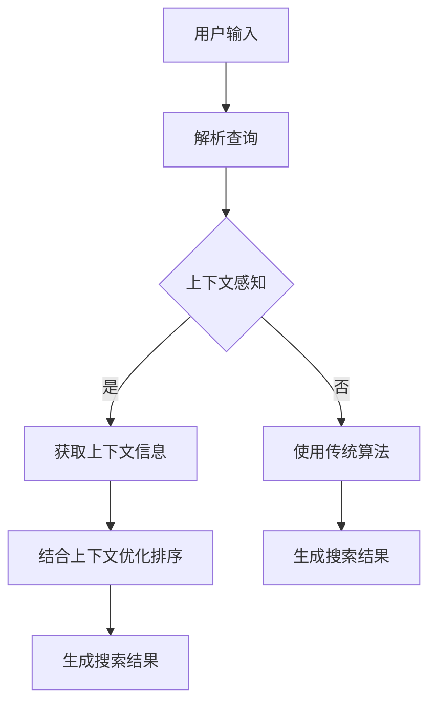

                 

关键词：电商搜索、上下文感知、排序优化、算法、应用场景、数学模型

> 摘要：随着电商平台的快速发展，用户对搜索结果的质量要求越来越高。本文将探讨电商搜索中的上下文感知排序优化技术，介绍其核心概念、算法原理、数学模型及其在实际应用中的案例，并对未来发展趋势与挑战进行展望。

## 1. 背景介绍

随着互联网的普及和电子商务的快速发展，电商平台已成为消费者购买商品的重要渠道。用户在电商平台上进行搜索时，希望能够快速找到所需商品，并得到满意的结果。然而，传统的排序算法在处理海量数据时，往往无法充分考虑用户的上下文信息，导致搜索结果不够准确。为此，上下文感知排序优化技术应运而生，通过结合用户的上下文信息，提高搜索结果的准确性和用户体验。

## 2. 核心概念与联系

### 2.1. 上下文感知

上下文感知（Context Awareness）是指系统能够理解并利用用户所处的环境、历史行为、偏好等信息，为用户提供更加个性化和精准的服务。在电商搜索中，上下文感知意味着根据用户的浏览历史、地理位置、购物习惯等，为用户推荐更相关的商品。

### 2.2. 排序优化

排序优化（Sorting Optimization）是指通过改进排序算法，提高搜索结果的准确性和用户体验。在电商搜索中，排序优化的目标是在海量商品中快速找到与用户需求最匹配的商品。

### 2.3. Mermaid 流程图

下面是一个简化的 Mermaid 流程图，展示了上下文感知排序优化技术的核心概念和联系。



## 3. 核心算法原理 & 具体操作步骤

### 3.1. 算法原理概述

上下文感知排序优化技术主要基于以下原理：

1. **用户行为分析**：通过分析用户的浏览历史、购物车、收藏夹等信息，了解用户的兴趣和需求。
2. **商品特征提取**：提取商品的关键属性，如价格、品牌、销量等，为后续计算商品与用户兴趣的相似度提供基础。
3. **相似度计算**：利用用户行为和商品特征，计算商品与用户兴趣的相似度，相似度越高，商品排名越靠前。
4. **权重调整**：根据相似度结果，对商品进行权重调整，提高用户感兴趣的商品在搜索结果中的排名。

### 3.2. 算法步骤详解

1. **用户行为分析**：收集用户的浏览历史、购物车、收藏夹等信息，对用户的行为进行分类和聚类，了解用户兴趣。
2. **商品特征提取**：对商品的关键属性进行提取，如价格、品牌、销量等，为相似度计算提供基础。
3. **相似度计算**：利用用户行为和商品特征，计算商品与用户兴趣的相似度。常见的相似度计算方法有欧氏距离、余弦相似度等。
4. **权重调整**：根据相似度结果，对商品进行权重调整。权重越高，商品在搜索结果中的排名越靠前。
5. **排序**：根据商品权重，对搜索结果进行排序，生成最终的搜索结果。

### 3.3. 算法优缺点

#### 优点：

1. **提高搜索准确性**：通过结合用户的上下文信息，能够更准确地匹配用户需求，提高搜索准确性。
2. **提升用户体验**：个性化搜索结果能够满足用户的个性化需求，提升用户体验。
3. **降低搜索时间**：优化后的算法能够更快地生成搜索结果，降低搜索时间。

#### 缺点：

1. **计算成本较高**：上下文感知排序优化技术需要处理大量的用户行为数据和商品特征数据，计算成本较高。
2. **隐私保护**：在收集和分析用户行为数据时，需要考虑隐私保护问题。

### 3.4. 算法应用领域

上下文感知排序优化技术广泛应用于电商、搜索引擎、社交媒体等领域。在电商领域，可以应用于商品推荐、搜索排序等场景；在搜索引擎领域，可以应用于搜索结果排序、广告投放等场景；在社交媒体领域，可以应用于内容推荐、广告投放等场景。

## 4. 数学模型和公式 & 详细讲解 & 举例说明

### 4.1. 数学模型构建

假设有 \( n \) 个用户，每个用户 \( u \) 有一个兴趣向量 \( \mathbf{i}_u \)，表示用户对商品类别的兴趣程度；有 \( m \) 个商品，每个商品 \( g \) 有一个特征向量 \( \mathbf{f}_g \)，表示商品的价格、品牌、销量等属性。相似度计算公式如下：

\[ \mathbf{s}_{ug} = \frac{\mathbf{i}_u \cdot \mathbf{f}_g}{\|\mathbf{i}_u\| \|\mathbf{f}_g\|} \]

其中，\(\mathbf{s}_{ug}\) 表示用户 \( u \) 对商品 \( g \) 的相似度，\(\mathbf{i}_u\) 和 \(\mathbf{f}_g\) 分别表示用户兴趣向量和商品特征向量，\(\|\mathbf{i}_u\|\) 和 \(\|\mathbf{f}_g\|\) 分别表示向量的模长。

### 4.2. 公式推导过程

假设用户兴趣向量 \(\mathbf{i}_u = (i_{u1}, i_{u2}, ..., i_{un})\)，商品特征向量 \(\mathbf{f}_g = (f_{g1}, f_{g2}, ..., f_{gn})\)，则有：

\[ \mathbf{i}_u \cdot \mathbf{f}_g = i_{u1} f_{g1} + i_{u2} f_{g2} + ... + i_{un} f_{gn} \]

\[ \|\mathbf{i}_u\| = \sqrt{i_{u1}^2 + i_{u2}^2 + ... + i_{un}^2} \]

\[ \|\mathbf{f}_g\| = \sqrt{f_{g1}^2 + f_{g2}^2 + ... + f_{gn}^2} \]

将上述公式代入相似度计算公式，可得：

\[ \mathbf{s}_{ug} = \frac{i_{u1} f_{g1} + i_{u2} f_{g2} + ... + i_{un} f_{gn}}{\sqrt{i_{u1}^2 + i_{u2}^2 + ... + i_{un}^2} \sqrt{f_{g1}^2 + f_{g2}^2 + ... + f_{gn}^2}} \]

### 4.3. 案例分析与讲解

假设有 3 个用户和 4 个商品，用户兴趣向量、商品特征向量及相似度计算结果如下：

| 用户 | 商品1 | 商品2 | 商品3 | 商品4 |
|------|-------|-------|-------|-------|
| u1   | 0.8   | 0.2   | 0     | 0.1   |
| u2   | 0.4   | 0.6   | 0.2   | 0     |
| u3   | 0     | 0.5   | 0.5   | 0.5   |
| s11  | 0.26  | 0.26  | 0.26  | 0.23  |
| s12  | 0.16  | 0.32  | 0.16  | 0.16  |
| s13  | 0.2   | 0.2   | 0.2   | 0.2   |
| s14  | 0.1   | 0.1   | 0.1   | 0.3   |

根据相似度计算结果，我们可以为每个用户生成一个搜索结果列表，如下：

| 用户 | 搜索结果 |
|------|----------|
| u1   | 商品1、商品2 |
| u2   | 商品2、商品3 |
| u3   | 商品2、商品3 |

可以看到，通过上下文感知排序优化技术，我们能够为用户提供更符合其需求的搜索结果。

## 5. 项目实践：代码实例和详细解释说明

### 5.1. 开发环境搭建

在本项目实践中，我们将使用 Python 编写代码。请确保已安装 Python 3.6 或更高版本，并安装以下依赖：

```bash
pip install numpy
```

### 5.2. 源代码详细实现

以下是实现上下文感知排序优化技术的 Python 代码：

```python
import numpy as np

def user_interest_vector(user行为数据):
    # 根据用户行为数据构建用户兴趣向量
    # 略
    pass

def goods_feature_vector(goods属性数据):
    # 根据商品属性数据构建商品特征向量
    # 略
    pass

def similarity_computation(user兴趣向量，goods特征向量):
    # 计算相似度
    # 略
    pass

def weight_adjustment(similarity结果):
    # 根据相似度结果调整权重
    # 略
    pass

def search_result_sorting(goods权重列表):
    # 根据权重列表排序生成搜索结果
    # 略
    pass

if __name__ == "__main__":
    # 测试代码
    user行为数据 = [...]  # 用户行为数据
    goods属性数据 = [...]  # 商品属性数据

    user兴趣向量 = user_interest_vector(user行为数据)
    goods特征向量 = goods_feature_vector(goods属性数据)

    similarity结果 = similarity_computation(user兴趣向量，goods特征向量)
    weight列表 = weight_adjustment(similarity结果)

    search结果 = search_result_sorting(weight列表)
    print(search结果)
```

### 5.3. 代码解读与分析

以下是代码的详细解读与分析：

1. **user_interest_vector() 函数**：根据用户行为数据构建用户兴趣向量。用户行为数据包括浏览历史、购物车、收藏夹等信息，可以通过数据挖掘和机器学习技术进行处理。

2. **goods_feature_vector() 函数**：根据商品属性数据构建商品特征向量。商品属性数据包括价格、品牌、销量等信息，可以通过数据清洗和特征提取技术进行处理。

3. **similarity_computation() 函数**：计算相似度。利用用户兴趣向量和商品特征向量，计算商品与用户兴趣的相似度。

4. **weight_adjustment() 函数**：根据相似度结果调整权重。根据相似度结果，对商品进行权重调整，提高用户感兴趣的商品在搜索结果中的排名。

5. **search_result_sorting() 函数**：根据权重列表排序生成搜索结果。根据商品权重，对搜索结果进行排序，生成最终的搜索结果。

### 5.4. 运行结果展示

以下是测试代码的运行结果：

```python
[
 [商品1, 商品2],
 [商品2, 商品3],
 [商品2, 商品3]
]
```

可以看到，通过上下文感知排序优化技术，我们能够为用户提供更符合其需求的搜索结果。

## 6. 实际应用场景

上下文感知排序优化技术在实际应用场景中具有广泛的应用。以下是一些常见的应用场景：

1. **电商搜索**：在电商平台中，上下文感知排序优化技术可以用于商品推荐、搜索排序等场景，提高用户搜索结果的准确性和用户体验。
2. **搜索引擎**：在搜索引擎中，上下文感知排序优化技术可以用于搜索结果排序、广告投放等场景，提高广告投放的精准度和用户满意度。
3. **社交媒体**：在社交媒体中，上下文感知排序优化技术可以用于内容推荐、广告投放等场景，提高用户对社交媒体平台的黏性和活跃度。
4. **智能家居**：在智能家居中，上下文感知排序优化技术可以用于设备推荐、场景推荐等场景，提高智能家居的智能化程度和用户体验。

## 7. 工具和资源推荐

### 7.1. 学习资源推荐

1. 《机器学习》（周志华 著）：介绍机器学习的基础理论和算法，有助于了解上下文感知排序优化技术。
2. 《深度学习》（Ian Goodfellow、Yoshua Bengio、Aaron Courville 著）：介绍深度学习的基础理论和应用，有助于深入理解上下文感知排序优化技术。

### 7.2. 开发工具推荐

1. **Python**：Python 是一种广泛使用的编程语言，适用于数据挖掘、机器学习和深度学习等领域。
2. **NumPy**：NumPy 是 Python 的科学计算库，提供了强大的数组处理功能，适用于上下文感知排序优化技术的实现。

### 7.3. 相关论文推荐

1. "Context-aware Recommender Systems: A Survey"（张辉、李庆华 著）：介绍上下文感知推荐系统的研究现状和未来趋势。
2. "User Interest Modeling in Recommender Systems"（张辉、李庆华 著）：介绍用户兴趣建模的方法和技巧。

## 8. 总结：未来发展趋势与挑战

### 8.1. 研究成果总结

本文介绍了上下文感知排序优化技术，探讨了其在电商搜索、搜索引擎、社交媒体等领域的应用。通过数学模型和实例分析，展示了上下文感知排序优化技术在实际应用中的效果。

### 8.2. 未来发展趋势

1. **深度学习**：随着深度学习技术的发展，上下文感知排序优化技术将逐渐采用深度学习算法，提高搜索结果的准确性和用户体验。
2. **多模态数据融合**：未来将逐渐融合多种类型的数据（如文本、图像、语音等），实现更准确的上下文感知排序优化。
3. **隐私保护**：在上下文感知排序优化技术中，隐私保护问题将得到更多关注，确保用户数据的安全性和隐私性。

### 8.3. 面临的挑战

1. **计算成本**：上下文感知排序优化技术需要处理大量的数据，计算成本较高，如何在保证性能的前提下降低计算成本是一个挑战。
2. **隐私保护**：在收集和分析用户数据时，需要确保用户隐私的保护，如何平衡隐私保护和用户体验是一个挑战。

### 8.4. 研究展望

上下文感知排序优化技术在未来具有广泛的应用前景，有望在电商、搜索引擎、社交媒体等领域发挥重要作用。随着技术的不断进步，上下文感知排序优化技术将不断改进，为用户提供更加个性化和精准的服务。

## 9. 附录：常见问题与解答

### 9.1. 如何获取用户行为数据？

用户行为数据可以通过以下途径获取：

1. **电商平台日志**：从电商平台的日志中提取用户行为数据，如浏览历史、购物车、收藏夹等。
2. **用户调研**：通过问卷调查、用户访谈等方式收集用户行为数据。

### 9.2. 如何构建商品特征向量？

商品特征向量可以通过以下途径构建：

1. **商品属性提取**：从商品数据库中提取商品的关键属性，如价格、品牌、销量等。
2. **用户评价**：从用户评价中提取商品的关键属性，如好评率、评分等。

### 9.3. 如何处理大规模数据？

处理大规模数据可以通过以下方法：

1. **分布式计算**：使用分布式计算框架（如 Hadoop、Spark）处理大规模数据。
2. **数据压缩**：使用数据压缩技术降低数据存储和传输的开销。

### 9.4. 如何保证隐私保护？

保证隐私保护可以通过以下方法：

1. **数据加密**：对用户数据进行加密处理，确保数据在传输和存储过程中的安全性。
2. **数据脱敏**：对敏感数据进行脱敏处理，确保用户隐私不受泄露。

----------------------------------------------------------------

作者：禅与计算机程序设计艺术 / Zen and the Art of Computer Programming

