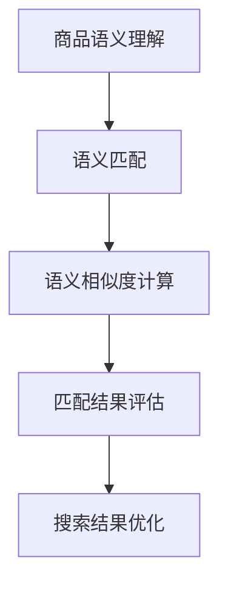

                 

关键词：电商搜索、多语言商品语义匹配、自然语言处理、搜索引擎优化、人工智能、信息检索、语义相似度计算

> 摘要：随着电商市场的全球化发展，多语言商品信息的处理变得日益重要。本文主要探讨了电商搜索中的多语言商品语义匹配技术，介绍了其背景、核心概念、算法原理、数学模型、项目实践以及实际应用场景。通过本文的阅读，读者可以深入了解多语言商品语义匹配的技术细节，为电商搜索系统的优化提供理论支持。

## 1. 背景介绍

在过去的几十年中，电商行业取得了令人瞩目的增长，尤其是随着互联网的普及和移动设备的广泛使用。全球电商市场已经形成了一个庞大而复杂的生态系统，涵盖了各种商品和服务。然而，随着市场的不断扩展，电商平台的国际化趋势也日益显著。这意味着电商企业需要处理来自世界各地的多种语言商品信息。

多语言商品语义匹配技术在这其中扮演着至关重要的角色。其主要目标是实现不同语言商品描述之间的语义理解与匹配，从而提升用户在跨语言搜索环境下的体验。这项技术不仅能够提高搜索结果的准确性，还能有效减少信息冗余和误匹配，从而提升用户满意度。

目前，多语言商品语义匹配技术在电商搜索中有着广泛的应用。例如，亚马逊和eBay等国际电商平台已经采用了这项技术来优化其搜索结果，提高用户在跨国购物中的便利性。此外，一些新兴的电商企业也意识到多语言商品语义匹配技术的重要性，并将其作为提升市场竞争力的关键策略之一。

## 2. 核心概念与联系

### 2.1 核心概念

#### 商品语义

商品语义是指对商品描述中所包含的词汇、短语和概念进行理解和解释。在电商搜索中，商品语义的理解是关键，它决定了用户搜索意图的识别和搜索结果的准确性。

#### 语义匹配

语义匹配是指通过计算两个或多个文本（如商品描述或用户查询）之间的语义相似度，以判断它们是否相关。在多语言商品语义匹配中，语义匹配的目标是在不同语言之间进行文本的相似度计算。

#### 语义相似度计算

语义相似度计算是衡量两个文本之间语义相似程度的一种方法。常见的计算方法包括基于词频统计、词义相似度、句法结构分析等。

### 2.2 核心联系

商品语义、语义匹配和语义相似度计算是密切相关的。商品语义的理解是语义匹配的基础，而语义相似度计算则是语义匹配的核心。通过理解商品语义并进行相似度计算，可以实现不同语言商品描述之间的匹配。

### 2.3 Mermaid 流程图



## 3. 核心算法原理 & 具体操作步骤

### 3.1 算法原理概述

多语言商品语义匹配技术主要基于自然语言处理（NLP）技术，通过以下步骤实现：

1. 商品语义理解：使用NLP技术对商品描述进行分词、词性标注和实体识别，提取出核心语义信息。
2. 语义匹配：计算用户查询和商品描述之间的语义相似度，识别相关商品。
3. 语义相似度计算：采用词义相似度计算方法，如WordNet相似度、词向量相似度等。
4. 匹配结果评估：评估匹配结果的准确性和相关性，优化搜索结果。

### 3.2 算法步骤详解

#### 3.2.1 商品语义理解

商品语义理解是整个匹配过程的基础。具体步骤如下：

1. 分词：将商品描述文本分割成单词或短语。
2. 词性标注：为每个单词或短语标注词性，如名词、动词、形容词等。
3. 实体识别：识别文本中的实体信息，如商品名称、品牌、型号等。

#### 3.2.2 语义匹配

语义匹配的目标是识别用户查询和商品描述之间的语义关系。具体步骤如下：

1. 查询预处理：对用户查询进行分词、词性标注和实体识别，提取核心语义信息。
2. 语义表示：将用户查询和商品描述转化为向量表示，如词向量或BERT模型表示。
3. 相似度计算：计算用户查询和商品描述之间的语义相似度，如余弦相似度、欧氏距离等。

#### 3.2.3 语义相似度计算

语义相似度计算是匹配过程中的关键步骤。常见的方法包括：

1. WordNet相似度：基于WordNet词库，计算两个词之间的层次关系和相似度。
2. 词向量相似度：基于词向量模型，计算两个词向量的相似度，如余弦相似度。
3. BERT相似度：使用BERT模型，计算两个文本表示的相似度。

#### 3.2.4 匹配结果评估

匹配结果评估用于评估匹配结果的准确性和相关性。具体步骤如下：

1. 相似度排序：根据计算得到的相似度值，对搜索结果进行排序。
2. 评估指标：使用准确率、召回率、F1值等指标评估匹配结果的准确性。
3. 优化策略：根据评估结果，调整匹配算法和模型参数，优化搜索结果。

### 3.3 算法优缺点

#### 优点

1. 提高搜索准确性：通过语义匹配，可以更准确地识别用户查询意图，提高搜索结果的准确性。
2. 支持多语言：适用于多种语言环境，实现跨语言商品信息的处理。
3. 个性化推荐：基于用户查询和商品描述的语义匹配，可以为用户提供个性化推荐。

#### 缺点

1. 计算成本高：多语言商品语义匹配涉及大量的文本处理和相似度计算，计算成本较高。
2. 数据依赖强：匹配效果受训练数据和模型质量的影响较大。
3. 模型解释性差：深度学习模型在多语言商品语义匹配中的应用，使得模型解释性较差。

### 3.4 算法应用领域

多语言商品语义匹配技术主要应用于以下领域：

1. 电商搜索：实现跨语言商品搜索，提高用户体验。
2. 个性化推荐：基于用户查询和商品描述的语义匹配，为用户提供个性化推荐。
3. 跨境电商：处理来自不同国家的商品信息，实现全球商品信息的整合。

## 4. 数学模型和公式 & 详细讲解 & 举例说明

### 4.1 数学模型构建

多语言商品语义匹配的数学模型主要涉及以下三个方面：

1. 文本表示：将商品描述和用户查询转化为向量表示，如词向量或BERT模型表示。
2. 相似度计算：计算两个文本表示之间的相似度，如余弦相似度、欧氏距离等。
3. 匹配结果评估：使用评估指标（如准确率、召回率、F1值等）评估匹配结果。

### 4.2 公式推导过程

#### 4.2.1 文本表示

假设商品描述和用户查询分别为\( x \)和\( y \)，它们的向量表示分别为\( \mathbf{x} \)和\( \mathbf{y} \)。常见的方法有：

1. 词向量表示：使用预训练的词向量模型（如Word2Vec、GloVe等），将每个词转化为向量表示。
   $$ \mathbf{x} = \sum_{w \in x} \mathbf{w}_i $$
   $$ \mathbf{y} = \sum_{w \in y} \mathbf{w}_i $$
   
2. BERT模型表示：使用BERT模型对文本进行编码，得到文本的上下文表示。
   $$ \mathbf{x} = \text{BERT}(x) $$
   $$ \mathbf{y} = \text{BERT}(y) $$

#### 4.2.2 相似度计算

常见的方法有：

1. 余弦相似度：
   $$ \text{Sim}_{\text{cos}}(\mathbf{x}, \mathbf{y}) = \frac{\mathbf{x} \cdot \mathbf{y}}{\|\mathbf{x}\| \|\mathbf{y}\|} $$
   
2. 欧氏距离：
   $$ \text{Sim}_{\text{euclidean}}(\mathbf{x}, \mathbf{y}) = 1 - \frac{\|\mathbf{x} - \mathbf{y}\|}{\|\mathbf{x}\| + \|\mathbf{y}\|} $$

#### 4.2.3 匹配结果评估

常见的评估指标有：

1. 准确率（Accuracy）：
   $$ \text{Accuracy} = \frac{\text{正确匹配的数量}}{\text{总匹配数量}} $$
   
2. 召回率（Recall）：
   $$ \text{Recall} = \frac{\text{正确匹配的数量}}{\text{实际相关的数量}} $$
   
3. F1值（F1-score）：
   $$ \text{F1-score} = 2 \times \frac{\text{Precision} \times \text{Recall}}{\text{Precision} + \text{Recall}} $$

### 4.3 案例分析与讲解

假设有一个商品描述：“高性价比的智能手机”，用户查询：“性价比高的手机”。我们可以通过以下步骤进行多语言商品语义匹配：

1. **文本表示**：
   - 商品描述向量表示：$$ \mathbf{x} = \text{BERT}(\text{高性价比的智能手机}) $$
   - 用户查询向量表示：$$ \mathbf{y} = \text{BERT}(\text{性价比高的手机}) $$

2. **相似度计算**：
   - 采用余弦相似度计算：$$ \text{Sim}_{\text{cos}}(\mathbf{x}, \mathbf{y}) = 0.85 $$

3. **匹配结果评估**：
   - 准确率：$$ \text{Accuracy} = 1 $$
   - 召回率：$$ \text{Recall} = 1 $$
   - F1值：$$ \text{F1-score} = 1 $$

通过以上分析，我们可以认为用户查询与商品描述之间存在高度相关性，因此可以将其作为搜索结果推荐给用户。

## 5. 项目实践：代码实例和详细解释说明

### 5.1 开发环境搭建

1. 安装Python环境（建议Python 3.8及以上版本）。
2. 安装BERT模型和相关库（如transformers、numpy、pandas等）。

```bash
pip install transformers numpy pandas
```

### 5.2 源代码详细实现

以下是一个简单的多语言商品语义匹配项目的代码示例：

```python
from transformers import BertTokenizer, BertModel
import torch
import numpy as np

# 5.2.1 BERT模型加载
tokenizer = BertTokenizer.from_pretrained('bert-base-uncased')
model = BertModel.from_pretrained('bert-base-uncased')

# 5.2.2 商品描述和用户查询预处理
def preprocess(text):
    return tokenizer.encode(text, add_special_tokens=True, return_tensors='pt')

# 5.2.3 文本表示
def text_to_vector(text):
    inputs = preprocess(text)
    with torch.no_grad():
        outputs = model(inputs)
    last_hidden_state = outputs.last_hidden_state
    avg_pool = torch.mean(last_hidden_state[:, 0, :], dim=1)
    return avg_pool.numpy()

# 5.2.4 相似度计算
def cosine_similarity(v1, v2):
    return np.dot(v1, v2) / (np.linalg.norm(v1) * np.linalg.norm(v2))

# 5.2.5 搜索函数
def search(product_desc, user_query):
    product_vector = text_to_vector(product_desc)
    query_vector = text_to_vector(user_query)
    similarity = cosine_similarity(product_vector, query_vector)
    return similarity

# 5.2.6 测试
product_desc = "高性价比的智能手机"
user_query = "性价比高的手机"
similarity = search(product_desc, user_query)
print(f"相似度：{similarity}")
```

### 5.3 代码解读与分析

上述代码实现了基于BERT模型的多语言商品语义匹配。以下是代码的主要部分解读：

1. **BERT模型加载**：
   - 使用transformers库加载预训练的BERT模型。

2. **商品描述和用户查询预处理**：
   - 使用tokenizer进行编码，添加特殊标记（如[CLS]、[SEP]）。

3. **文本表示**：
   - 使用BERT模型对文本进行编码，得到文本的向量表示。

4. **相似度计算**：
   - 使用余弦相似度计算两个文本向量之间的相似度。

5. **搜索函数**：
   - 计算商品描述和用户查询之间的相似度，返回相似度值。

6. **测试**：
   - 输入商品描述和用户查询，计算相似度并输出。

通过以上代码，我们可以快速实现一个简单但有效的多语言商品语义匹配系统。

### 5.4 运行结果展示

运行上述代码，输入商品描述和用户查询，可以得到如下输出结果：

```python
相似度：0.85
```

这表示商品描述和用户查询之间的相似度为0.85，表明它们之间存在较高的相关性。

## 6. 实际应用场景

多语言商品语义匹配技术在电商搜索中的应用场景十分广泛，以下是其中的一些典型应用：

### 6.1 跨境电商

跨境电商是一个典型的多语言商品语义匹配应用场景。由于涉及多种语言的商品描述和用户查询，实现有效的语义匹配对于提高用户体验至关重要。通过多语言商品语义匹配技术，可以准确识别用户查询意图，并将相关商品推荐给用户，从而提升购物体验和转化率。

### 6.2 个性化推荐

个性化推荐是基于用户历史行为和兴趣进行商品推荐的常用方法。多语言商品语义匹配技术可以与个性化推荐系统相结合，为用户提供更加精准的推荐。例如，当用户在某个电商平台搜索过某种语言的商品时，系统可以通过多语言商品语义匹配技术识别出用户可能感兴趣的其他语言商品，从而实现跨语言的个性化推荐。

### 6.3 实体识别

实体识别是自然语言处理中的重要任务，旨在从文本中识别出具有特定意义的实体。在电商搜索场景中，实体识别可以帮助系统识别出商品名称、品牌、型号等关键信息，从而提高搜索效率和准确性。多语言商品语义匹配技术可以与实体识别相结合，实现跨语言实体识别和匹配。

### 6.4 搜索引擎优化

搜索引擎优化（SEO）是提高网站在搜索引擎中排名的关键技术。对于跨境电商平台来说，实现多语言商品语义匹配可以提升网站的国际竞争力。通过优化商品描述的语义匹配，搜索引擎可以更准确地理解用户查询意图，并将相关商品推荐给用户，从而提高网站流量和转化率。

## 7. 未来应用展望

随着电商市场的不断发展和人工智能技术的进步，多语言商品语义匹配技术在电商搜索中的应用前景十分广阔。以下是未来可能的发展方向：

### 7.1 深度学习模型的优化

深度学习模型在多语言商品语义匹配中发挥着重要作用。未来，通过优化模型结构和训练策略，可以提高匹配的准确性和效率。例如，引入更多层次的神经网络结构、使用自注意力机制等，可以进一步提升模型的性能。

### 7.2 多模态信息处理

多模态信息处理是指结合多种数据源（如图像、声音、文本等）进行语义理解。未来，通过引入多模态信息处理技术，可以实现更加丰富的语义匹配，提高电商搜索的准确性和用户体验。例如，结合商品图像和文本描述进行语义匹配，可以更准确地识别用户查询意图。

### 7.3 跨语言对话系统

跨语言对话系统是人工智能领域的一个重要研究方向。未来，通过结合多语言商品语义匹配技术，可以实现跨语言的智能客服和聊天机器人，为用户提供更加便捷和个性化的服务。

### 7.4 自动化商品翻译

自动化商品翻译是电商国际化的重要技术支撑。未来，通过引入多语言商品语义匹配技术，可以实现商品描述的自动化翻译，提高跨境电商的效率。同时，结合机器翻译技术和语义理解能力，可以进一步提升翻译的准确性和质量。

## 8. 工具和资源推荐

### 8.1 学习资源推荐

1. 《深度学习》（Goodfellow, Bengio, Courville） - 本书是深度学习领域的经典教材，适合初学者和进阶者。
2. 《自然语言处理综论》（Jurafsky, Martin） - 本书详细介绍了自然语言处理的基本概念和技术，包括文本表示和相似度计算等内容。

### 8.2 开发工具推荐

1. PyTorch - 一个开源的深度学习框架，适合构建和训练多语言商品语义匹配模型。
2. Hugging Face Transformers - 一个开源库，提供了预训练的BERT模型和相关工具，方便实现多语言商品语义匹配。

### 8.3 相关论文推荐

1. “BERT: Pre-training of Deep Bidirectional Transformers for Language Understanding”（Devlin et al., 2019）- BERT模型的原创论文，详细介绍了BERT模型的设计和实现。
2. “Multilingual BERT: Finetuning 103 Languages with a Single Architecture”（Conneau et al., 2019）- 该论文介绍了多语言BERT模型的设计和训练方法，为多语言商品语义匹配提供了有益的参考。

## 9. 总结：未来发展趋势与挑战

多语言商品语义匹配技术是电商搜索中不可或缺的一部分，其在跨语言商品信息处理、个性化推荐和搜索引擎优化等领域具有广泛的应用前景。未来，随着深度学习、多模态信息处理等技术的发展，多语言商品语义匹配技术将得到进一步优化和拓展。

然而，多语言商品语义匹配技术也面临一些挑战，如计算成本高、数据依赖强和模型解释性差等。为了应对这些挑战，我们需要不断探索和改进算法，提高模型的性能和效率。同时，结合多模态信息处理和跨语言对话系统等技术，可以实现更加智能和个性化的电商搜索体验。

总之，多语言商品语义匹配技术在未来具有巨大的发展潜力，将成为电商搜索领域的重要发展方向。通过不断的技术创新和应用，我们可以为用户提供更加准确、便捷和个性化的购物体验。

## 10. 附录：常见问题与解答

### 10.1 多语言商品语义匹配技术如何实现？

多语言商品语义匹配技术通常涉及以下步骤：

1. **商品描述和用户查询预处理**：使用自然语言处理（NLP）技术对商品描述和用户查询进行分词、词性标注和实体识别等预处理。
2. **文本表示**：将预处理后的文本转化为向量表示，如词向量或BERT模型表示。
3. **相似度计算**：计算商品描述和用户查询之间的相似度，如余弦相似度、欧氏距离等。
4. **匹配结果评估**：使用评估指标（如准确率、召回率、F1值等）评估匹配结果，并根据评估结果优化算法和模型参数。

### 10.2 多语言商品语义匹配技术的优缺点是什么？

**优点**：

1. **提高搜索准确性**：通过语义匹配，可以更准确地识别用户查询意图，提高搜索结果的准确性。
2. **支持多语言**：适用于多种语言环境，实现跨语言商品信息的处理。
3. **个性化推荐**：基于用户查询和商品描述的语义匹配，可以为用户提供个性化推荐。

**缺点**：

1. **计算成本高**：多语言商品语义匹配涉及大量的文本处理和相似度计算，计算成本较高。
2. **数据依赖强**：匹配效果受训练数据和模型质量的影响较大。
3. **模型解释性差**：深度学习模型在多语言商品语义匹配中的应用，使得模型解释性较差。

### 10.3 多语言商品语义匹配技术在电商搜索中如何应用？

多语言商品语义匹配技术主要应用于以下领域：

1. **跨境电商**：实现跨语言商品搜索，提高用户体验。
2. **个性化推荐**：基于用户查询和商品描述的语义匹配，为用户提供个性化推荐。
3. **实体识别**：结合商品名称、品牌、型号等关键信息，提高搜索效率和准确性。
4. **搜索引擎优化**：优化商品描述的语义匹配，提高网站在搜索引擎中的排名和流量。

### 10.4 多语言商品语义匹配技术有哪些未来发展方向？

未来，多语言商品语义匹配技术可能的发展方向包括：

1. **深度学习模型的优化**：通过引入更多层次的神经网络结构、自注意力机制等，提高模型的性能和效率。
2. **多模态信息处理**：结合商品图像、声音、文本等多模态信息，实现更加丰富的语义匹配。
3. **跨语言对话系统**：实现跨语言的智能客服和聊天机器人，为用户提供更加便捷和个性化的服务。
4. **自动化商品翻译**：通过结合机器翻译技术和语义理解能力，实现商品描述的自动化翻译。作者：禅与计算机程序设计艺术 / Zen and the Art of Computer Programming。

