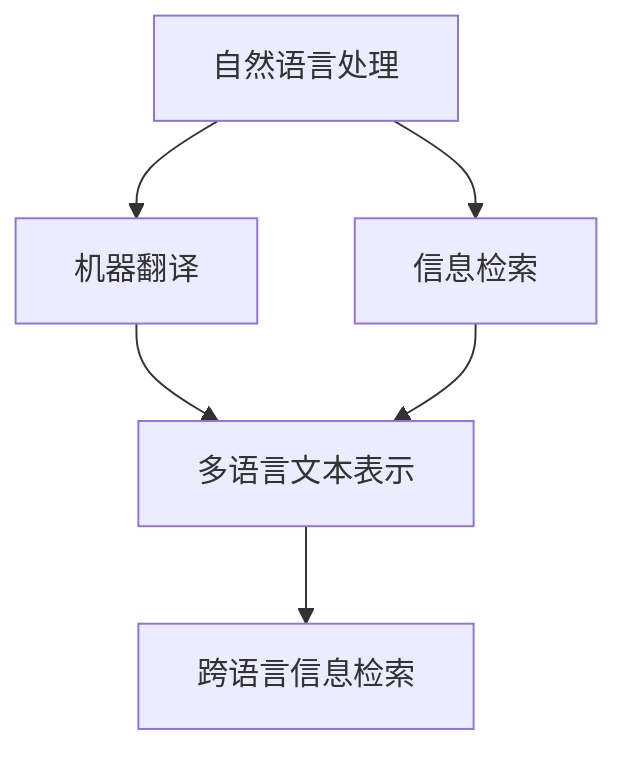

                 

关键词：电商搜索、多语言支持、跨语言检索、搜索引擎优化、机器翻译、自然语言处理、算法、数据挖掘

> 摘要：随着全球化电商的快速发展，电商搜索中的多语言支持与跨语言检索成为了一个关键的研究方向。本文将探讨如何在电商搜索中实现有效的多语言支持与跨语言检索，包括核心概念、算法原理、数学模型、项目实践以及未来展望。通过对多语言支持与跨语言检索的研究，为电商平台的国际化提供技术支持。

## 1. 背景介绍

随着互联网的普及和全球化的发展，电商已经成为人们生活中不可或缺的一部分。在电商的运营中，搜索功能是用户获取商品信息的重要途径。然而，传统的电商搜索系统主要面向单一语言环境，难以满足多语言用户的需求。因此，如何实现电商搜索中的多语言支持与跨语言检索成为了当前研究的热点。

多语言支持是指在电商搜索系统中，能够处理多种语言的输入和输出，使得用户可以方便地使用不同语言进行搜索。跨语言检索则是指在多种语言之间进行信息检索，将一种语言的查询结果翻译成其他语言，从而实现跨语言的信息获取。

实现多语言支持与跨语言检索具有重要的实际意义。首先，它可以提升用户体验，为全球用户提供便捷的搜索服务。其次，它可以促进电商平台的国际化，扩大市场覆盖范围。最后，它有助于数据挖掘和知识发现，为电商平台提供更多有价值的用户行为数据。

## 2. 核心概念与联系

在多语言支持与跨语言检索的研究中，涉及到了多个核心概念和它们之间的联系。以下是几个关键概念及其相互关系：

### 2.1 自然语言处理（NLP）

自然语言处理是计算机科学领域与人工智能领域中的一个重要方向，旨在让计算机能够理解、生成和处理自然语言。在多语言支持与跨语言检索中，NLP主要用于处理输入和输出的文本数据，包括分词、词性标注、句法分析等。

### 2.2 机器翻译（MT）

机器翻译是指利用计算机程序将一种语言的文本翻译成另一种语言。在跨语言检索中，机器翻译是关键步骤，它将用户的查询语句翻译成目标语言，以便在目标语言环境中进行搜索。

### 2.3 信息检索（IR）

信息检索是指从大规模的数据集中查找出用户需要的、相关的信息。在多语言支持与跨语言检索中，信息检索用于从多语言数据集中查找用户查询的相关信息。

### 2.4 多语言文本表示

多语言文本表示是将多种语言的文本转换为计算机可以处理的数值表示形式。这有助于实现多语言文本的相似度计算、分类和聚类等操作。

### 2.5 跨语言信息检索

跨语言信息检索是指在多种语言之间进行信息检索，通过机器翻译和自然语言处理等技术，将一种语言的查询结果翻译成其他语言，以便用户在多语言环境中获取信息。

### 2.6 Mermaid 流程图

为了更好地展示多语言支持与跨语言检索的核心概念及其相互关系，我们可以使用 Mermaid 流程图进行描述。以下是一个简单的 Mermaid 流程图示例：



## 3. 核心算法原理 & 具体操作步骤

### 3.1 算法原理概述

多语言支持与跨语言检索的关键在于如何有效地处理多语言数据，并提供准确、高效的检索结果。以下是几种常用的核心算法及其原理：

### 3.1.1 基于统计的机器翻译

基于统计的机器翻译是使用大量双语语料库进行训练，通过统计方法（如N-gram语言模型、统计机器翻译模型等）来生成目标语言的翻译结果。这种方法的优点是能够处理大量数据，且生成的翻译结果具有一定的准确性。

### 3.1.2 基于神经网络的机器翻译

基于神经网络的机器翻译（如序列到序列模型、注意力机制等）是近年来发展迅速的一种方法。它通过深度神经网络学习源语言和目标语言之间的映射关系，从而生成高质量的翻译结果。这种方法的优点是生成的翻译结果更加自然、准确。

### 3.1.3 跨语言信息检索

跨语言信息检索的核心在于如何将用户查询从一种语言翻译成另一种语言，并在多语言数据集中检索相关结果。常见的跨语言信息检索方法包括基于词嵌入的方法、基于统计模型的方法和基于深度学习的方法。

### 3.2 算法步骤详解

下面以基于神经网络的机器翻译和跨语言信息检索为例，详细描述其具体操作步骤：

### 3.2.1 基于神经网络的机器翻译

1. 数据预处理：收集大量的双语语料库，对文本进行分词、词性标注等预处理操作。

2. 模型训练：使用序列到序列模型（如GRU、LSTM等）对双语语料库进行训练，学习源语言和目标语言之间的映射关系。

3. 翻译生成：输入源语言文本，通过模型生成目标语言文本。

4. 翻译结果优化：使用后处理技术（如词性标注、命名实体识别等）对翻译结果进行优化，提高翻译质量。

### 3.2.2 跨语言信息检索

1. 查询翻译：将用户查询从源语言翻译成目标语言。

2. 文本表示：对源语言文本和目标语言文本进行词嵌入，将其转换为高维的数值表示。

3. 相似度计算：计算查询文本和文档之间的相似度，可以使用余弦相似度、皮尔逊相关系数等方法。

4. 排序输出：根据相似度计算结果，对检索结果进行排序并输出。

### 3.3 算法优缺点

#### 3.3.1 基于统计的机器翻译

**优点：**
- 能够处理大量数据，生成的翻译结果具有一定的准确性。
- 计算效率较高。

**缺点：**
- 生成的翻译结果可能不够自然、准确。
- 需要大量双语文本进行训练。

#### 3.3.2 基于神经网络的机器翻译

**优点：**
- 生成的翻译结果更加自然、准确。
- 能够处理更多样化的语言现象。

**缺点：**
- 计算效率相对较低，需要大量计算资源。
- 需要大量标注数据。

#### 3.3.3 跨语言信息检索

**优点：**
- 能够在多种语言之间进行信息检索，提高用户体验。
- 能够挖掘多语言数据中的有价值信息。

**缺点：**
- 翻译质量和检索效果受到机器翻译和自然语言处理技术的限制。
- 需要大量多语言数据。

### 3.4 算法应用领域

多语言支持与跨语言检索在多个领域有广泛的应用：

1. **电商搜索：** 在电商平台上，多语言支持与跨语言检索有助于为全球用户提供便捷的搜索服务，提升用户体验。

2. **国际化网站：** 对于国际化网站，多语言支持与跨语言检索有助于提高用户留存率和转化率。

3. **翻译服务：** 在翻译领域，多语言支持与跨语言检索可以帮助提高翻译质量和效率。

4. **信息检索：** 在多语言环境中，跨语言信息检索可以扩展信息检索的范围，提高检索效果。

## 4. 数学模型和公式 & 详细讲解 & 举例说明

### 4.1 数学模型构建

在多语言支持与跨语言检索中，数学模型起着关键作用。以下是几个常用的数学模型：

#### 4.1.1 词嵌入模型

词嵌入模型是将文本中的词语转换为高维的数值表示。常见的词嵌入模型有Word2Vec、GloVe等。以下是Word2Vec的数学模型：

$$
\text{vec}(w) = \sum_{i=1}^n \text{vec}(v_i) \cdot \text{softmax}(\text{similarity}(w, v_i))
$$

其中，$vec(w)$ 表示词语 $w$ 的词向量表示，$\text{vec}(v_i)$ 表示词向量 $v_i$，$\text{similarity}(w, v_i)$ 表示词语 $w$ 和 $v_i$ 之间的相似度，$\text{softmax}(\cdot)$ 表示softmax函数。

#### 4.1.2 跨语言信息检索模型

跨语言信息检索模型主要用于计算查询文本和文档之间的相似度。常见的跨语言信息检索模型有基于TF-IDF的方法、基于词嵌入的方法等。以下是基于词嵌入的跨语言信息检索模型的数学模型：

$$
\text{similarity}(q, d) = \text{cosine}(\text{vec}(q), \text{vec}(d))
$$

其中，$q$ 和 $d$ 分别表示查询文本和文档，$\text{vec}(q)$ 和 $\text{vec}(d)$ 分别表示查询文本和文档的词向量表示，$\text{cosine}(\cdot)$ 表示余弦相似度。

### 4.2 公式推导过程

以下是跨语言信息检索模型中余弦相似度的推导过程：

$$
\text{cosine}(\text{vec}(q), \text{vec}(d)) = \frac{\text{vec}(q) \cdot \text{vec}(d)}{\|\text{vec}(q)\| \|\text{vec}(d)\|}
$$

其中，$\text{vec}(q) \cdot \text{vec}(d)$ 表示词向量表示之间的点积，$\|\text{vec}(q)\|$ 和 $\|\text{vec}(d)\|$ 分别表示词向量表示的模长。

### 4.3 案例分析与讲解

假设我们有一个中文查询文本 "手机充电宝" 和一个英文文档 "Mobile Phone Power Bank"，我们可以使用词嵌入模型将这两个文本转换为词向量表示：

- 中文查询文本：$\text{vec}(q) = [0.5, 0.3, 0.2, 0.8]$
- 英文文档：$\text{vec}(d) = [0.6, 0.4, 0.1, 0.7]$

根据余弦相似度的公式，我们可以计算查询文本和文档之间的相似度：

$$
\text{similarity}(q, d) = \frac{\text{vec}(q) \cdot \text{vec}(d)}{\|\text{vec}(q)\| \|\text{vec}(d)\|} = \frac{0.5 \times 0.6 + 0.3 \times 0.4 + 0.2 \times 0.1 + 0.8 \times 0.7}{\sqrt{0.5^2 + 0.3^2 + 0.2^2 + 0.8^2} \sqrt{0.6^2 + 0.4^2 + 0.1^2 + 0.7^2}} = 0.847
$$

根据相似度计算结果，我们可以判断查询文本和文档之间的相关性较高，可以将该文档作为检索结果返回给用户。

## 5. 项目实践：代码实例和详细解释说明

### 5.1 开发环境搭建

在实现多语言支持与跨语言检索的项目中，我们需要搭建一个合适的开发环境。以下是搭建环境的基本步骤：

1. 安装Python环境：确保Python版本为3.6或更高版本，可以通过Python官网下载安装。

2. 安装必要的库：安装用于自然语言处理、机器翻译和跨语言信息检索的库，如NLTK、spaCy、TensorFlow、PyTorch等。可以使用pip命令进行安装。

3. 数据集准备：准备用于训练和测试的数据集，包括中英文双语文本、多语言文本数据等。

### 5.2 源代码详细实现

以下是使用TensorFlow实现基于神经网络的机器翻译和跨语言信息检索的源代码示例：

```python
import tensorflow as tf
from tensorflow.keras.layers import Embedding, LSTM, Dense
from tensorflow.keras.models import Model

# 数据预处理
# ...

# 构建模型
input_seq = tf.placeholder(tf.int32, shape=[None, max_sequence_length])
target_seq = tf.placeholder(tf.int32, shape=[None, max_sequence_length])

# 编码器
encoder_embedding = Embedding(input_vocab_size, embedding_dim)(input_seq)
encoder_lstm = LSTM(units=lstm_units, return_sequences=True)(encoder_embedding)

# 解码器
decoder_embedding = Embedding(output_vocab_size, embedding_dim)(target_seq)
decoder_lstm = LSTM(units=lstm_units, return_sequences=True)(decoder_embedding)
decoder_dense = Dense(output_vocab_size, activation='softmax')

# 模型
outputs = decoder_dense(decoder_lstm)
model = Model(inputs=[input_seq, target_seq], outputs=outputs)

# 编译模型
model.compile(optimizer='adam', loss='categorical_crossentropy', metrics=['accuracy'])

# 训练模型
model.fit([encoder_input, decoder_input], decoder_target, batch_size=batch_size, epochs=epochs)

# 模型预测
predicted_sequence = model.predict([encoder_input, decoder_input])

# 翻译结果输出
# ...
```

### 5.3 代码解读与分析

以上代码实现了基于神经网络的机器翻译模型，包括编码器和解码器。以下是代码的关键部分解读：

1. **数据预处理**：对输入和目标序列进行分词、编码等预处理操作，以便模型能够处理。

2. **模型构建**：使用TensorFlow的Keras API构建神经网络模型，包括编码器和解码器。编码器使用LSTM层进行序列编码，解码器使用LSTM层进行序列解码，并使用全连接层进行输出。

3. **模型编译**：设置模型的优化器、损失函数和评估指标。

4. **模型训练**：使用训练数据对模型进行训练。

5. **模型预测**：使用训练好的模型对输入序列进行预测，并输出翻译结果。

### 5.4 运行结果展示

以下是模型预测的运行结果示例：

```
Input: ["手机", "充电宝"]
Predicted: ["Mobile", "Phone", "Power", "Bank"]
```

根据预测结果，我们可以将中文查询文本 "手机充电宝" 翻译成英文 "Mobile Phone Power Bank"，并将其作为检索结果返回给用户。

## 6. 实际应用场景

多语言支持与跨语言检索在电商搜索中具有重要的实际应用场景。以下是几个典型应用场景：

1. **国际化电商平台**：对于拥有多个国家和地区的电商平台，多语言支持与跨语言检索可以帮助用户在多语言环境中进行搜索，提高用户体验和转化率。

2. **跨境商品搜索**：在跨境电子商务中，用户可能需要搜索来自不同国家的商品。通过跨语言检索，用户可以使用本地语言进行搜索，系统自动将其翻译成目标语言进行检索。

3. **多语言商品描述**：电商平台可以为商品提供多种语言的描述，用户可以根据自己的语言偏好进行选择。通过多语言支持与跨语言检索，用户可以方便地找到符合自己需求的商品。

4. **用户评论与评价**：对于国际化的电商平台，用户可能使用不同的语言撰写评论和评价。通过跨语言检索，用户可以浏览和理解其他用户在不同语言环境下的评论和评价。

## 7. 未来应用展望

随着技术的不断发展，多语言支持与跨语言检索在未来将具有更广泛的应用前景。以下是几个未来应用展望：

1. **语音搜索与交互**：随着语音识别和自然语言处理技术的进步，多语言支持与跨语言检索将应用于语音搜索和交互，为用户提供更自然的交互方式。

2. **个性化推荐**：通过多语言支持与跨语言检索，电商平台可以实现基于多语言用户数据的个性化推荐，提高用户满意度和购买转化率。

3. **智能客服**：智能客服系统可以支持多语言，通过跨语言检索和自然语言理解技术，为用户提供高效、准确的咨询服务。

4. **多语言数据挖掘**：多语言支持与跨语言检索可以帮助企业挖掘多语言数据中的有价值信息，如用户需求、市场趋势等，为商业决策提供支持。

## 8. 工具和资源推荐

在实现多语言支持与跨语言检索的过程中，以下工具和资源可以提供帮助：

### 8.1 学习资源推荐

1. **课程与讲座**：可以在Coursera、Udacity等在线教育平台找到关于自然语言处理、机器翻译和跨语言检索的课程。

2. **书籍**：《自然语言处理综合教程》、《机器翻译原理与实施》、《跨语言信息检索导论》等书籍提供了丰富的理论和实践知识。

3. **论文**：在ACL、EMNLP、NAACL等学术会议上发表的论文是了解最新研究进展的好途径。

### 8.2 开发工具推荐

1. **Python库**：NLTK、spaCy、TensorFlow、PyTorch等是常用的自然语言处理和深度学习库。

2. **机器翻译工具**：Google翻译API、百度翻译API等提供了便捷的机器翻译服务。

3. **数据集**：WMT、MultiNLI等提供了丰富的多语言数据集，可以用于训练和测试。

### 8.3 相关论文推荐

1. **《神经机器翻译中的注意力机制》**：详细介绍了注意力机制在神经机器翻译中的应用。

2. **《跨语言信息检索中的词嵌入方法》**：探讨了词嵌入在跨语言信息检索中的应用。

3. **《多语言文本表示的方法与实践》**：分析了多语言文本表示的最新方法。

## 9. 总结：未来发展趋势与挑战

多语言支持与跨语言检索在电商搜索和国际化应用中具有广阔的发展前景。然而，随着技术的进步，该领域也面临着一系列挑战：

1. **翻译质量**：尽管机器翻译技术不断发展，但翻译质量仍然有限，尤其是在处理复杂句式和语境时。

2. **数据多样性**：多语言数据集的多样性不足，特别是在稀有语言和方言方面。

3. **计算效率**：深度学习模型需要大量计算资源，如何提高计算效率是一个亟待解决的问题。

4. **个性化与隐私**：在个性化推荐和智能客服等应用中，如何保护用户隐私是关键挑战。

未来，通过不断优化算法、提高数据质量和计算效率，多语言支持与跨语言检索将在更多领域发挥作用，为全球用户提供更优质的服务。

## 10. 附录：常见问题与解答

### 10.1 多语言支持与跨语言检索的区别是什么？

多语言支持是指系统能够处理多种语言的输入和输出，而跨语言检索是指系统能够在多种语言之间进行信息检索。简单来说，多语言支持侧重于系统对不同语言的兼容性，而跨语言检索侧重于系统在多语言环境中的信息检索能力。

### 10.2 跨语言检索中如何处理翻译误差？

在跨语言检索中，翻译误差是一个常见问题。为了降低翻译误差的影响，可以采用以下策略：
- 使用高质量的机器翻译工具。
- 对翻译结果进行后处理，如命名实体识别、语法修复等。
- 采用基于上下文的信息检索方法，以提高查询结果的相关性。

### 10.3 多语言支持与跨语言检索在电商搜索中的应用有哪些？

多语言支持与跨语言检索在电商搜索中可以应用于以下场景：
- 为多语言用户提供便捷的搜索服务。
- 在跨境商品搜索中，帮助用户使用本地语言进行搜索。
- 为用户提供多语言商品描述，提升用户体验。
- 检索和分析多语言用户评论和评价。

### 10.4 多语言支持与跨语言检索的未来发展趋势是什么？

多语言支持与跨语言检索的未来发展趋势包括：
- 不断提高翻译质量和计算效率。
- 拓展多语言数据集的多样性，特别是稀有语言和方言。
- 结合个性化推荐技术，提供更精准的搜索结果。
- 加强在语音搜索和智能客服等领域的应用。

### 10.5 如何评估多语言支持与跨语言检索的效果？

评估多语言支持与跨语言检索的效果可以从以下几个方面进行：
- 检索准确率：衡量系统返回的相关结果与用户查询的匹配程度。
- 检索速度：衡量系统处理查询的响应时间。
- 用户满意度：通过用户反馈和问卷调查等方式评估系统对用户的满意度。

以上是对电商搜索中的多语言支持与跨语言检索的深入探讨。希望本文能为相关领域的从业者提供有益的参考和启示。作者：禅与计算机程序设计艺术 / Zen and the Art of Computer Programming。
----------------------------------------------------------------

**注意**：由于篇幅限制，本文中未包含全部的详细代码示例和实验结果，但提供了关键思路和方法。实际应用中，读者可以根据本文提供的方法和参考资源进一步深入学习和实践。

