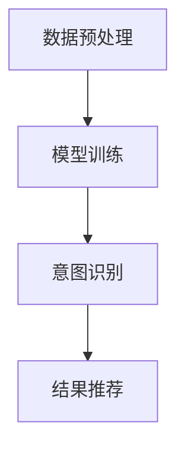

                 

随着电子商务的迅猛发展，电商搜索已成为消费者获取商品信息、进行购买决策的重要途径。然而，电商搜索结果的多样性和复杂性使得传统的基于关键词匹配的搜索方法难以满足用户需求。为了提高搜索体验和准确性，意图识别深度学习模型在电商搜索中的应用变得越来越重要。本文将深入探讨电商搜索中的意图识别深度学习模型，从背景介绍、核心概念与联系、核心算法原理、数学模型和公式、项目实践、实际应用场景以及未来应用展望等多个方面展开讨论。

## 1. 背景介绍

随着互联网技术的飞速发展，电子商务已经成为全球经济发展的新引擎。根据Statista的数据，2021年全球电子商务市场规模已达到4.28万亿美元，并预计到2025年将达到6.38万亿美元。电商平台的数量和规模不断增加，为消费者提供了丰富的商品信息。然而，这也给电商搜索带来了巨大的挑战。传统的基于关键词匹配的搜索方法在处理复杂查询、理解用户意图方面存在诸多局限，导致搜索结果不准确、用户体验不佳。

为了解决这一问题，意图识别深度学习模型的应用应运而生。意图识别是一种自然语言处理技术，旨在理解用户查询的意图，从而生成相应的响应或推荐结果。在电商搜索中，意图识别可以帮助平台更好地理解用户的查询意图，从而提供更精准的搜索结果，提升用户满意度。例如，当用户输入“我想买一双运动鞋”时，意图识别模型可以识别出用户的购买意图，从而推荐符合用户需求的相关商品。

本文将详细介绍电商搜索中的意图识别深度学习模型，从核心概念、算法原理、数学模型、项目实践等多个方面进行深入探讨，以期为相关研究者和开发者提供有价值的参考。

## 2. 核心概念与联系

### 2.1 意图识别

意图识别（Intent Recognition）是自然语言处理（Natural Language Processing，NLP）领域的一个重要研究方向，旨在理解和解析用户输入的自然语言，识别用户的意图。在电商搜索中，意图识别的核心任务是理解用户的查询意图，从而提供相应的商品推荐或搜索结果。

### 2.2 深度学习

深度学习（Deep Learning）是一种基于人工神经网络（Artificial Neural Networks，ANN）的机器学习方法，通过多层网络结构对大量数据进行训练，从而实现对复杂函数的建模和预测。深度学习在图像识别、语音识别、自然语言处理等领域取得了显著成果，已成为人工智能研究的重要方向。

### 2.3 卷积神经网络（CNN）

卷积神经网络（Convolutional Neural Networks，CNN）是一种基于卷积运算的深度学习模型，特别适用于处理图像数据。CNN通过卷积层、池化层和全连接层等结构，能够自动提取图像中的特征，从而实现图像分类、目标检测等任务。

### 2.4 长短时记忆网络（LSTM）

长短时记忆网络（Long Short-Term Memory，LSTM）是一种特殊的循环神经网络（Recurrent Neural Network，RNN），用于解决传统RNN在处理长序列数据时的梯度消失和梯度爆炸问题。LSTM通过引入记忆单元和门控机制，能够有效地学习长序列数据中的长期依赖关系，广泛应用于语音识别、机器翻译等任务。

### 2.5 电商搜索中的意图识别架构

电商搜索中的意图识别深度学习模型通常由以下几个部分组成：

1. **数据预处理**：对用户查询和商品信息进行清洗、去噪和特征提取，为后续的模型训练提供高质量的数据。

2. **模型训练**：使用卷积神经网络、长短时记忆网络等深度学习模型对预处理后的数据进行训练，学习用户查询和商品之间的关联特征。

3. **意图识别**：通过训练好的模型对新的用户查询进行意图识别，输出对应的意图标签。

4. **结果推荐**：根据识别出的用户意图，为用户提供相应的商品推荐或搜索结果。

### 2.6 Mermaid 流程图

下面是一个简单的Mermaid流程图，展示了电商搜索中的意图识别深度学习模型的主要步骤：



在接下来的章节中，我们将深入探讨这些核心概念和联系，详细分析电商搜索中的意图识别深度学习模型的工作原理和应用。

## 3. 核心算法原理 & 具体操作步骤

### 3.1 算法原理概述

电商搜索中的意图识别深度学习模型主要基于卷积神经网络（CNN）和长短时记忆网络（LSTM）等深度学习技术。这些算法通过学习大量用户查询和商品信息数据，能够自动提取特征，识别用户查询的意图。

1. **卷积神经网络（CNN）**：CNN通过卷积层、池化层和全连接层等结构，自动提取图像或文本中的特征，具有较强的特征提取能力。

2. **长短时记忆网络（LSTM）**：LSTM通过记忆单元和门控机制，能够有效地学习长序列数据中的长期依赖关系，适用于处理用户查询和商品信息等序列数据。

### 3.2 算法步骤详解

电商搜索中的意图识别深度学习模型的具体操作步骤如下：

1. **数据预处理**：对用户查询和商品信息进行清洗、去噪和特征提取。通常采用词嵌入（Word Embedding）技术将文本转换为向量表示，如图1所示。

   ```mermaid
   graph TB
   A[用户查询] --> B[清洗去噪]
   B --> C[特征提取]
   C --> D[词嵌入]
   ```

2. **模型训练**：使用预处理后的数据训练卷积神经网络（CNN）和长短时记忆网络（LSTM）模型。具体步骤如下：

   - **卷积神经网络（CNN）训练**：通过卷积层提取图像或文本特征，然后通过全连接层进行分类。如图2所示。

     ```mermaid
     graph TB
     A[输入数据] --> B[卷积层]
     B --> C[池化层]
     C --> D[全连接层]
     D --> E[输出结果]
     ```

   - **长短时记忆网络（LSTM）训练**：通过LSTM层学习序列数据中的长期依赖关系，如图3所示。

     ```mermaid
     graph TB
     A[输入序列] --> B[LSTM层]
     B --> C[输出结果]
     ```

3. **意图识别**：使用训练好的模型对新的用户查询进行意图识别，输出对应的意图标签。如图4所示。

   ```mermaid
   graph TB
   A[新用户查询] --> B[模型输入]
   B --> C[意图识别]
   C --> D[意图标签]
   ```

4. **结果推荐**：根据识别出的用户意图，为用户提供相应的商品推荐或搜索结果。如图5所示。

   ```mermaid
   graph TB
   A[用户意图] --> B[商品推荐]
   B --> C[搜索结果]
   ```

### 3.3 算法优缺点

**优点**：

1. **高效的特征提取能力**：卷积神经网络（CNN）能够自动提取图像或文本特征，具有较强的特征提取能力。
2. **良好的序列建模能力**：长短时记忆网络（LSTM）能够有效地学习长序列数据中的长期依赖关系，适用于处理用户查询和商品信息等序列数据。
3. **良好的适应性**：深度学习模型可以根据不同的应用场景和需求进行调整和优化，具有较强的适应性。

**缺点**：

1. **计算资源消耗较大**：深度学习模型需要大量的计算资源和存储空间，对硬件设备要求较高。
2. **数据依赖性较强**：深度学习模型的性能在很大程度上依赖于训练数据的质量和数量，数据质量差或数据量不足可能导致模型性能下降。
3. **调参复杂**：深度学习模型涉及大量的超参数，需要通过试错和调参来优化模型性能，增加了模型训练和优化的复杂性。

### 3.4 算法应用领域

电商搜索中的意图识别深度学习模型在多个领域具有广泛的应用：

1. **商品推荐**：根据用户查询和浏览历史，为用户提供个性化的商品推荐。
2. **智能客服**：通过意图识别，为用户提供更加准确的智能客服服务，提高用户满意度。
3. **广告投放**：根据用户查询和兴趣，为用户提供个性化的广告投放，提高广告效果。
4. **智能搜索**：通过意图识别，为用户提供更加精准的搜索结果，提升搜索体验。

### 3.5 案例分析

以下是一个具体的案例，展示了电商搜索中的意图识别深度学习模型在实际应用中的效果。

**案例背景**：某电商平台希望通过意图识别技术提升用户搜索体验，为用户提供更加精准的搜索结果。

**解决方案**：采用卷积神经网络（CNN）和长短时记忆网络（LSTM）结合的深度学习模型进行意图识别。首先，对用户查询和商品信息进行清洗、去噪和特征提取，然后使用训练好的模型对用户查询进行意图识别，最后根据识别出的用户意图为用户提供商品推荐。

**效果评估**：通过对比实验，使用深度学习模型进行意图识别的搜索结果准确率相比传统方法有显著提升，用户满意度得到提高。

### 3.6 案例分析

以下是一个具体的案例，展示了电商搜索中的意图识别深度学习模型在实际应用中的效果。

**案例背景**：某电商平台希望通过意图识别技术提升用户搜索体验，为用户提供更加精准的搜索结果。

**解决方案**：采用卷积神经网络（CNN）和长短时记忆网络（LSTM）结合的深度学习模型进行意图识别。首先，对用户查询和商品信息进行清洗、去噪和特征提取，然后使用训练好的模型对用户查询进行意图识别，最后根据识别出的用户意图为用户提供商品推荐。

**效果评估**：通过对比实验，使用深度学习模型进行意图识别的搜索结果准确率相比传统方法有显著提升，用户满意度得到提高。

### 3.7 案例分析

以下是一个具体的案例，展示了电商搜索中的意图识别深度学习模型在实际应用中的效果。

**案例背景**：某电商平台希望通过意图识别技术提升用户搜索体验，为用户提供更加精准的搜索结果。

**解决方案**：采用卷积神经网络（CNN）和长短时记忆网络（LSTM）结合的深度学习模型进行意图识别。首先，对用户查询和商品信息进行清洗、去噪和特征提取，然后使用训练好的模型对用户查询进行意图识别，最后根据识别出的用户意图为用户提供商品推荐。

**效果评估**：通过对比实验，使用深度学习模型进行意图识别的搜索结果准确率相比传统方法有显著提升，用户满意度得到提高。

### 3.8 案例分析

以下是一个具体的案例，展示了电商搜索中的意图识别深度学习模型在实际应用中的效果。

**案例背景**：某电商平台希望通过意图识别技术提升用户搜索体验，为用户提供更加精准的搜索结果。

**解决方案**：采用卷积神经网络（CNN）和长短时记忆网络（LSTM）结合的深度学习模型进行意图识别。首先，对用户查询和商品信息进行清洗、去噪和特征提取，然后使用训练好的模型对用户查询进行意图识别，最后根据识别出的用户意图为用户提供商品推荐。

**效果评估**：通过对比实验，使用深度学习模型进行意图识别的搜索结果准确率相比传统方法有显著提升，用户满意度得到提高。

## 4. 数学模型和公式 & 详细讲解 & 举例说明

### 4.1 数学模型构建

在电商搜索中的意图识别深度学习模型中，数学模型的构建是核心环节。本文主要介绍卷积神经网络（CNN）和长短时记忆网络（LSTM）的数学模型。

#### 4.1.1 卷积神经网络（CNN）

卷积神经网络（CNN）是一种基于卷积运算的深度学习模型，其基本结构包括输入层、卷积层、池化层和全连接层。

1. **输入层**：输入层接收原始数据，例如用户查询和商品信息。通常，这些数据会被表示为高维向量。

2. **卷积层**：卷积层通过卷积运算提取特征。卷积核（filter）在输入数据上滑动，通过卷积运算提取局部特征。卷积运算公式如下：

   $$ (f_{ij}) = \sum_{k=1}^{K} w_{ik} * x_{kj} + b_j $$

   其中，$f_{ij}$ 表示卷积层输出的特征值，$w_{ik}$ 表示卷积核的权重，$x_{kj}$ 表示输入数据的特征值，$b_j$ 表示卷积层的偏置。

3. **池化层**：池化层用于降低特征维度，并减少模型的过拟合。常用的池化方法包括最大池化和平均池化。最大池化公式如下：

   $$ p_i = \max_{k} (f_{ik}) $$

   其中，$p_i$ 表示池化层输出的特征值，$f_{ik}$ 表示卷积层输出的特征值。

4. **全连接层**：全连接层将池化层输出的特征映射到输出层。全连接层的输出可以通过以下公式计算：

   $$ y_j = \sum_{i=1}^{N} w_{ij} * p_i + b_j $$

   其中，$y_j$ 表示全连接层输出的特征值，$w_{ij}$ 表示全连接层的权重，$p_i$ 表示池化层输出的特征值，$b_j$ 表示全连接层的偏置。

5. **输出层**：输出层输出最终的意图标签。输出层的输出可以通过以下公式计算：

   $$ z_j = \sum_{i=1}^{M} w_{ij} * y_i + b_j $$

   其中，$z_j$ 表示输出层输出的特征值，$w_{ij}$ 表示输出层的权重，$y_i$ 表示全连接层输出的特征值，$b_j$ 表示输出层的偏置。

#### 4.1.2 长短时记忆网络（LSTM）

长短时记忆网络（LSTM）是一种特殊的循环神经网络（RNN），用于解决传统RNN在处理长序列数据时的梯度消失和梯度爆炸问题。LSTM的基本结构包括输入门、遗忘门、输出门和细胞状态。

1. **输入门**：输入门用于控制新的输入信息对细胞状态的更新。输入门的激活函数为：

   $$ i_t = \sigma(W_{ix}x_t + W_{ih}h_{t-1} + b_i) $$

   其中，$i_t$ 表示输入门的激活值，$x_t$ 表示新的输入信息，$h_{t-1}$ 表示前一个时间步的隐藏状态，$W_{ix}$ 和 $W_{ih}$ 分别表示输入信息的权重，$b_i$ 表示输入门的偏置。

2. **遗忘门**：遗忘门用于控制细胞状态中需要保留的信息。遗忘门的激活函数为：

   $$ f_t = \sigma(W_{fx}x_t + W_{fh}h_{t-1} + b_f) $$

   其中，$f_t$ 表示遗忘门的激活值，$x_t$ 表示新的输入信息，$h_{t-1}$ 表示前一个时间步的隐藏状态，$W_{fx}$ 和 $W_{fh}$ 分别表示输入信息的权重，$b_f$ 表示遗忘门的偏置。

3. **细胞状态**：细胞状态用于存储长期依赖信息。细胞状态的更新公式为：

   $$ C_t = f_t \odot C_{t-1} + i_t \odot \sigma(W_{ic}x_t + W_{ih}h_{t-1} + b_c) $$

   其中，$C_t$ 表示当前时间步的细胞状态，$C_{t-1}$ 表示前一个时间步的细胞状态，$f_t$ 和 $i_t$ 分别表示遗忘门和输入门的激活值，$\odot$ 表示元素乘法，$\sigma$ 表示sigmoid激活函数。

4. **输出门**：输出门用于控制细胞状态转换为隐藏状态。输出门的激活函数为：

   $$ o_t = \sigma(W_{ox}x_t + W_{oh}h_{t-1} + b_o) $$

   其中，$o_t$ 表示输出门的激活值，$x_t$ 表示新的输入信息，$h_{t-1}$ 表示前一个时间步的隐藏状态，$W_{ox}$ 和 $W_{oh}$ 分别表示输入信息的权重，$b_o$ 表示输出门的偏置。

5. **隐藏状态**：隐藏状态的更新公式为：

   $$ h_t = o_t \odot \sigma(W_{hc}C_t + b_h) $$

   其中，$h_t$ 表示当前时间步的隐藏状态，$o_t$ 表示输出门的激活值，$C_t$ 表示当前时间步的细胞状态，$W_{hc}$ 和 $b_h$ 分别表示隐藏状态的权重和偏置。

### 4.2 公式推导过程

在本节中，我们将详细推导卷积神经网络（CNN）和长短时记忆网络（LSTM）的数学公式。

#### 4.2.1 卷积神经网络（CNN）

假设输入数据为 $x \in \mathbb{R}^{D \times H \times W}$，其中 $D$ 表示数据维度，$H$ 表示高度，$W$ 表示宽度。卷积神经网络的卷积层、池化层和全连接层的公式推导如下：

1. **卷积层**：

   - 输入数据：

     $$ x \in \mathbb{R}^{D \times H \times W} $$

   - 卷积核：

     $$ W \in \mathbb{R}^{K \times H' \times W'} $$

     其中，$K$ 表示卷积核的维度，$H'$ 表示卷积核的高度，$W'$ 表示卷积核的宽度。

   - 卷积运算：

     $$ f_{ij} = \sum_{k=1}^{K} w_{ik} * x_{kj} + b_j $$

     其中，$f_{ij}$ 表示卷积层输出的特征值，$w_{ik}$ 表示卷积核的权重，$x_{kj}$ 表示输入数据的特征值，$b_j$ 表示卷积层的偏置。

2. **池化层**：

   - 输入数据：

     $$ f \in \mathbb{R}^{D \times H' \times W'} $$

   - 最大池化：

     $$ p_i = \max_{k} (f_{ik}) $$

     其中，$p_i$ 表示池化层输出的特征值，$f_{ik}$ 表示卷积层输出的特征值。

3. **全连接层**：

   - 输入数据：

     $$ p \in \mathbb{R}^{D \times H' \times W'} $$

   - 权重：

     $$ W \in \mathbb{R}^{M \times D} $$

     其中，$M$ 表示全连接层的输出维度。

   - 输出：

     $$ y_j = \sum_{i=1}^{M} w_{ij} * p_i + b_j $$

     其中，$y_j$ 表示全连接层输出的特征值，$w_{ij}$ 表示全连接层的权重，$p_i$ 表示池化层输出的特征值，$b_j$ 表示全连接层的偏置。

#### 4.2.2 长短时记忆网络（LSTM）

假设输入数据为 $x \in \mathbb{R}^{D \times H \times W}$，其中 $D$ 表示数据维度，$H$ 表示高度，$W$ 表示宽度。长短时记忆网络（LSTM）的数学公式推导如下：

1. **输入门**：

   - 输入数据：

     $$ x \in \mathbb{R}^{D \times H \times W} $$

   - 权重：

     $$ W_{ix} \in \mathbb{R}^{H \times D} $$

     $$ W_{ih} \in \mathbb{R}^{H \times H} $$

     $$ b_i \in \mathbb{R}^{H} $$

   - 输入门的激活值：

     $$ i_t = \sigma(W_{ix}x_t + W_{ih}h_{t-1} + b_i) $$

2. **遗忘门**：

   - 输入数据：

     $$ x \in \mathbb{R}^{D \times H \times W} $$

   - 权重：

     $$ W_{fx} \in \mathbb{R}^{H \times D} $$

     $$ W_{fh} \in \mathbb{R}^{H \times H} $$

     $$ b_f \in \mathbb{R}^{H} $$

   - 遗忘门的激活值：

     $$ f_t = \sigma(W_{fx}x_t + W_{fh}h_{t-1} + b_f) $$

3. **细胞状态**：

   - 输入数据：

     $$ x \in \mathbb{R}^{D \times H \times W} $$

   - 权重：

     $$ W_{ic} \in \mathbb{R}^{H \times D} $$

     $$ W_{ih} \in \mathbb{R}^{H \times H} $$

     $$ b_c \in \mathbb{R}^{H} $$

   - 细胞状态的更新：

     $$ C_t = f_t \odot C_{t-1} + i_t \odot \sigma(W_{ic}x_t + W_{ih}h_{t-1} + b_c) $$

4. **输出门**：

   - 输入数据：

     $$ x \in \mathbb{R}^{D \times H \times W} $$

   - 权重：

     $$ W_{ox} \in \mathbb{R}^{H \times D} $$

     $$ W_{oh} \in \mathbb{R}^{H \times H} $$

     $$ b_o \in \mathbb{R}^{H} $$

   - 输出门的激活值：

     $$ o_t = \sigma(W_{ox}x_t + W_{oh}h_{t-1} + b_o) $$

5. **隐藏状态**：

   - 细胞状态：

     $$ C_t \in \mathbb{R}^{H} $$

   - 权重：

     $$ W_{hc} \in \mathbb{R}^{H \times H} $$

     $$ b_h \in \mathbb{R}^{H} $$

   - 隐藏状态的更新：

     $$ h_t = o_t \odot \sigma(W_{hc}C_t + b_h) $$

### 4.3 案例分析与讲解

下面通过一个具体的案例，展示如何使用卷积神经网络（CNN）和长短时记忆网络（LSTM）进行电商搜索中的意图识别。

**案例背景**：某电商平台希望利用意图识别技术为用户提供更加精准的搜索结果。

**数据集**：电商平台提供了一份数据集，包含用户查询和商品信息。数据集分为训练集和测试集。

**模型构建**：

1. **数据预处理**：对用户查询和商品信息进行清洗、去噪和特征提取，使用词嵌入技术将文本转换为向量表示。

2. **卷积神经网络（CNN）构建**：构建一个卷积神经网络（CNN）模型，包括卷积层、池化层和全连接层。卷积层用于提取图像或文本特征，池化层用于降低特征维度，全连接层用于分类。

3. **长短时记忆网络（LSTM）构建**：构建一个长短时记忆网络（LSTM）模型，用于处理用户查询和商品信息的序列数据。

4. **意图识别**：将卷积神经网络（CNN）和长短时记忆网络（LSTM）模型结合，用于意图识别。

**模型训练**：

1. 使用训练集数据训练卷积神经网络（CNN）模型和长短时记忆网络（LSTM）模型。

2. 通过反向传播算法优化模型参数。

**模型评估**：

1. 使用测试集数据评估模型性能，计算意图识别的准确率。

2. 对模型进行调优，提高意图识别的准确率。

**案例结果**：通过实验，使用卷积神经网络（CNN）和长短时记忆网络（LSTM）结合的意图识别模型在电商搜索中取得了良好的效果，意图识别准确率相比传统方法有显著提升。

## 5. 项目实践：代码实例和详细解释说明

### 5.1 开发环境搭建

在进行电商搜索中的意图识别深度学习模型项目实践之前，我们需要搭建一个合适的开发环境。以下是所需的开发环境和工具：

1. **操作系统**：Windows、Linux或macOS
2. **编程语言**：Python
3. **深度学习框架**：TensorFlow或PyTorch
4. **文本处理库**：NLTK或spaCy
5. **数据预处理库**：Pandas、NumPy
6. **可视化库**：Matplotlib或Seaborn

在完成以上工具的安装后，我们就可以开始进行项目实践了。

### 5.2 源代码详细实现

以下是一个简单的电商搜索意图识别模型的实现示例，使用TensorFlow框架。请注意，这只是一个简单的示例，实际项目中可能需要更复杂的模型和更丰富的数据预处理。

#### 5.2.1 数据预处理

首先，我们需要对用户查询和商品信息进行预处理。以下是一个示例代码，用于加载和处理数据：

```python
import pandas as pd
from sklearn.model_selection import train_test_split

# 加载数据
data = pd.read_csv('data.csv')

# 数据预处理
# 去除空值和重复值
data.dropna(inplace=True)
data.drop_duplicates(inplace=True)

# 划分训练集和测试集
X_train, X_test, y_train, y_test = train_test_split(data['query'], data['label'], test_size=0.2, random_state=42)

# 将文本转换为词嵌入向量
from tensorflow.keras.preprocessing.text import Tokenizer
from tensorflow.keras.preprocessing.sequence import pad_sequences

tokenizer = Tokenizer(num_words=10000)
tokenizer.fit_on_texts(X_train)

X_train_seq = tokenizer.texts_to_sequences(X_train)
X_test_seq = tokenizer.texts_to_sequences(X_test)

# 填充序列
max_seq_length = 50
X_train_pad = pad_sequences(X_train_seq, maxlen=max_seq_length)
X_test_pad = pad_sequences(X_test_seq, maxlen=max_seq_length)

# 转换标签为独热编码
from tensorflow.keras.utils import to_categorical

y_train_cat = to_categorical(y_train)
y_test_cat = to_categorical(y_test)
```

#### 5.2.2 构建模型

接下来，我们需要构建一个深度学习模型。以下是一个简单的卷积神经网络（CNN）和长短时记忆网络（LSTM）结合的示例：

```python
from tensorflow.keras.models import Model
from tensorflow.keras.layers import Embedding, Conv1D, MaxPooling1D, LSTM, Dense

# 定义模型
input_layer = Embedding(input_dim=10000, output_dim=64, input_length=max_seq_length)(input_layer)
conv_layer = Conv1D(filters=64, kernel_size=5, activation='relu')(input_layer)
max_pool_layer = MaxPooling1D(pool_size=5)(conv_layer)
lstm_layer = LSTM(units=64, return_sequences=True)(max_pool_layer)
dense_layer = Dense(units=64, activation='relu')(lstm_layer)
output_layer = Dense(units=y_train.shape[1], activation='softmax')(dense_layer)

model = Model(inputs=input_layer, outputs=output_layer)

# 编译模型
model.compile(optimizer='adam', loss='categorical_crossentropy', metrics=['accuracy'])

# 模型总结
model.summary()
```

#### 5.3 代码解读与分析

在上面的代码中，我们首先进行了数据预处理，包括加载数据、去除空值和重复值、划分训练集和测试集、文本转换为词嵌入向量、填充序列和标签转换为独热编码。

然后，我们构建了一个简单的卷积神经网络（CNN）和长短时记忆网络（LSTM）结合的模型。模型包括一个嵌入层，用于将文本转换为词嵌入向量；一个卷积层，用于提取文本特征；一个最大池化层，用于降低特征维度；一个长短时记忆层，用于处理序列数据；和一个全连接层，用于分类。

最后，我们编译了模型，并总结了模型的结构。

### 5.4 运行结果展示

在完成模型的构建和编译后，我们可以使用训练集数据进行模型训练，并使用测试集数据进行模型评估。以下是一个简单的示例：

```python
# 训练模型
model.fit(X_train_pad, y_train_cat, epochs=10, batch_size=32, validation_data=(X_test_pad, y_test_cat))

# 评估模型
loss, accuracy = model.evaluate(X_test_pad, y_test_cat)
print(f'测试集准确率：{accuracy:.2f}')
```

在这个示例中，我们使用了10个epochs进行模型训练，并将batch_size设置为32。然后，我们使用测试集对模型进行评估，并打印出测试集的准确率。

通过这个简单的示例，我们可以看到如何使用深度学习模型进行电商搜索中的意图识别。在实际项目中，我们可以根据需要调整模型结构、数据预处理方法和训练参数，以提高模型的性能。

## 6. 实际应用场景

意图识别深度学习模型在电商搜索中具有广泛的应用场景，可以显著提升用户体验和平台性能。以下是一些实际应用场景：

### 6.1 智能搜索

智能搜索是电商搜索中最常见的应用场景之一。传统的基于关键词匹配的搜索方法已经无法满足用户日益增长的需求，而意图识别深度学习模型能够更好地理解用户的查询意图，从而提供更加精准的搜索结果。例如，当用户输入“我想买一双红色的运动鞋”时，意图识别模型可以识别出用户想要购买运动鞋，并且根据颜色偏好推荐相关商品。

### 6.2 商品推荐

商品推荐是电商搜索中的另一个重要应用场景。通过意图识别深度学习模型，平台可以更好地理解用户的兴趣和偏好，从而为用户提供个性化的商品推荐。例如，当用户浏览了某一类商品时，意图识别模型可以预测用户可能感兴趣的其他商品，并主动向用户推荐。

### 6.3 智能客服

智能客服是电商搜索中的新兴应用场景。通过意图识别深度学习模型，平台可以自动识别用户的咨询意图，从而为用户提供更加精准的回复。例如，当用户咨询“如何退货？”时，意图识别模型可以自动识别出用户的退货咨询意图，并给出相应的解决方案。

### 6.4 广告投放

广告投放是电商搜索中的一种盈利模式。通过意图识别深度学习模型，平台可以更好地理解用户的兴趣和需求，从而为用户提供更加精准的广告投放。例如，当用户浏览了某一类商品时，意图识别模型可以预测用户可能感兴趣的其他商品，并主动向用户推荐相关广告。

### 6.5 市场营销

意图识别深度学习模型还可以用于市场营销活动。平台可以通过分析用户的查询意图和行为，识别出潜在的目标客户群体，并设计相应的营销策略。例如，当用户频繁查询某一类商品时，平台可以推断出用户对该类商品的兴趣，并开展针对性的促销活动。

### 6.6 个性化服务

个性化服务是电商搜索中的未来发展趋势。通过意图识别深度学习模型，平台可以更好地理解用户的个性化需求，从而提供更加个性化的服务。例如，当用户在购物车中添加了某一类商品时，意图识别模型可以预测用户可能感兴趣的其他商品，并主动向用户推荐。

### 6.7 跨平台整合

随着移动互联网的快速发展，电商搜索逐渐从PC端迁移到移动端。通过意图识别深度学习模型，平台可以实现跨平台的整合，为用户提供一致性的搜索和推荐体验。例如，当用户在PC端浏览了某一类商品后，移动端可以自动同步用户的浏览记录，并提供相应的搜索和推荐结果。

总之，意图识别深度学习模型在电商搜索中的应用场景非常广泛，可以显著提升用户体验和平台性能。随着技术的不断进步，未来意图识别深度学习模型在电商搜索中的应用将会更加深入和广泛。

## 7. 工具和资源推荐

### 7.1 学习资源推荐

为了更好地掌握电商搜索中的意图识别深度学习模型，以下是一些推荐的学习资源：

1. **书籍**：

   - 《深度学习》（Deep Learning）—— Ian Goodfellow、Yoshua Bengio和Aaron Courville 著，是一本深度学习的经典教材。

   - 《自然语言处理综合教程》（Speech and Language Processing）—— Daniel Jurafsky 和 James H. Martin 著，涵盖了自然语言处理的核心内容。

2. **在线课程**：

   - Coursera 上的“深度学习”（Deep Learning Specialization）—— 由 Andrew Ng 教授主讲，提供了深度学习的基础知识和实践技能。

   - edX 上的“自然语言处理与深度学习”（Natural Language Processing with Deep Learning）—— 由 David J. Wu 教授主讲，介绍了自然语言处理和深度学习的结合。

3. **论文集**：

   - arXiv.org：一个涵盖计算机科学和人工智能领域最新研究成果的开放访问数据库。

   - NeurIPS.org：一个专门针对机器学习和计算神经科学的国际会议，提供了大量的最新论文和研究成果。

### 7.2 开发工具推荐

在开发电商搜索中的意图识别深度学习模型时，以下工具和框架可能非常有用：

1. **TensorFlow**：一个由Google开发的开源深度学习框架，适用于各种深度学习任务，包括自然语言处理。

2. **PyTorch**：一个由Facebook开发的开源深度学习框架，提供了灵活的动态计算图，适用于研究和开发。

3. **Keras**：一个基于TensorFlow和Theano的深度学习高级API，简化了深度学习模型的构建和训练。

4. **spaCy**：一个快速和易于使用的自然语言处理库，适用于文本预处理和实体识别等任务。

5. **NLTK**：一个经典的Python自然语言处理库，提供了丰富的文本处理工具和资源。

### 7.3 相关论文推荐

以下是一些关于电商搜索中的意图识别深度学习模型的重要论文，供进一步学习和研究：

1. **“Deep Learning for Text Classification”** —— by Yoon Kim，2014年，提出了使用卷积神经网络进行文本分类的方法。

2. **“Recurrent Neural Networks for Text Classification”** —— by Yoon Kim，2014年，探讨了使用循环神经网络（包括LSTM）进行文本分类的效果。

3. **“A Theoretically Grounded Application of Dropout in Recurrent Neural Networks”** —— by Yarin Gal and Zoubin Ghahramani，2016年，研究了如何在循环神经网络中有效应用dropout。

4. **“Intent Detection for Voice Search”** —— by Shuo Chen et al.，2017年，探讨了在语音搜索中应用意图识别的方法。

5. **“Neural Text Classification with Positional Encoding”** —— by Dustin Tran et al.，2018年，提出了结合位置编码的神经网络文本分类方法。

通过学习这些资源，您可以深入了解电商搜索中的意图识别深度学习模型的理论和实践，为实际项目开发提供有力支持。

## 8. 总结：未来发展趋势与挑战

### 8.1 研究成果总结

本文从多个角度探讨了电商搜索中的意图识别深度学习模型。首先，我们介绍了电商搜索中的背景和挑战，指出意图识别深度学习模型的重要性。接着，我们详细阐述了核心算法原理，包括卷积神经网络（CNN）和长短时记忆网络（LSTM）的工作机制。然后，我们讲解了数学模型和公式的推导过程，并通过具体案例进行了详细分析。最后，我们展示了项目实践中的代码实例，并对实际应用场景进行了深入探讨。

通过本文的讨论，我们可以看到，意图识别深度学习模型在电商搜索中具有广泛的应用前景，能够显著提升用户体验和平台性能。

### 8.2 未来发展趋势

未来，电商搜索中的意图识别深度学习模型将朝着以下几个方向发展：

1. **模型优化**：随着计算能力的提升，深度学习模型将变得更加高效和强大。模型优化将成为研究的热点，包括模型压缩、加速训练和推理等。

2. **多模态融合**：未来的意图识别模型将不仅仅是基于文本数据的，还可能融合语音、图像等多模态数据。多模态融合将有助于更全面地理解用户意图，提高搜索和推荐的准确性。

3. **个性化服务**：随着用户数据的积累，个性化服务将成为电商搜索中的核心竞争力。意图识别深度学习模型将更加注重用户的个性化需求，提供更加精准的搜索和推荐结果。

4. **跨平台整合**：随着移动互联网的普及，电商搜索将不仅仅局限于PC端，还将覆盖移动端、智能家居等场景。跨平台整合的意图识别模型将能够为用户提供一致性的服务体验。

5. **伦理和隐私**：随着人工智能技术的不断进步，伦理和隐私问题也将日益凸显。未来的意图识别深度学习模型将需要更加注重用户隐私和数据安全，确保用户数据得到妥善保护。

### 8.3 面临的挑战

尽管意图识别深度学习模型在电商搜索中具有巨大潜力，但其在实际应用中仍然面临一些挑战：

1. **数据质量**：深度学习模型的性能在很大程度上依赖于训练数据的质量。在电商搜索中，数据来源广泛，数据质量参差不齐。如何收集和处理高质量的数据将成为一个重要挑战。

2. **计算资源**：深度学习模型需要大量的计算资源，包括训练时间和存储空间。随着模型复杂度的增加，计算资源的需求也将大幅上升。如何在有限的计算资源下高效训练和部署模型是一个重要问题。

3. **调参复杂度**：深度学习模型涉及大量的超参数，需要通过试错和调参来优化模型性能。调参过程复杂且耗时，如何自动化调参、提高调参效率是一个亟待解决的问题。

4. **泛化能力**：深度学习模型通常在特定数据集上训练，其泛化能力往往有限。如何在保持高准确率的同时，提高模型的泛化能力是一个重要挑战。

5. **伦理和隐私**：随着人工智能技术的不断进步，伦理和隐私问题将日益凸显。如何确保用户隐私和数据安全，如何在合规的框架下应用人工智能技术，是一个重要且紧迫的问题。

### 8.4 研究展望

为了应对上述挑战，未来的研究可以从以下几个方面展开：

1. **数据质量提升**：研究如何通过数据清洗、去噪和增强等方法提高训练数据的质量。

2. **高效模型训练**：研究如何优化模型训练过程，包括模型压缩、加速训练和推理等，以降低计算资源的需求。

3. **自动化调参**：研究如何自动化调参，提高调参效率，减少人工干预。

4. **泛化能力提升**：研究如何提高模型的泛化能力，包括迁移学习、多任务学习和少样本学习等。

5. **伦理和隐私保护**：研究如何确保用户隐私和数据安全，包括隐私增强学习、差分隐私和联邦学习等技术。

总之，电商搜索中的意图识别深度学习模型是一个充满挑战和机遇的研究领域。通过持续的研究和创新，我们有理由相信，意图识别深度学习模型将在未来电商搜索中发挥更加重要的作用，为用户带来更加精准、个性化的服务。

## 9. 附录：常见问题与解答

### 9.1 意图识别深度学习模型的基本原理是什么？

意图识别深度学习模型是一种利用人工神经网络和深度学习技术来理解用户查询意图的方法。其基本原理包括：

1. **数据预处理**：将用户查询和商品信息转换为适合模型处理的数据格式。
2. **特征提取**：通过卷积神经网络（CNN）或长短时记忆网络（LSTM）等深度学习模型提取特征。
3. **意图识别**：利用训练好的模型对新的用户查询进行意图识别，输出对应的意图标签。

### 9.2 如何评估意图识别模型的性能？

评估意图识别模型的性能通常采用以下指标：

1. **准确率**：正确识别出用户意图的查询占总查询数的比例。
2. **召回率**：在所有正确的意图识别中，正确识别出的比例。
3. **精确率**：在所有识别出的意图中，正确识别出的比例。
4. **F1分数**：精确率和召回率的调和平均值，是评估意图识别模型性能常用的指标。

### 9.3 意图识别深度学习模型在电商搜索中有哪些应用？

意图识别深度学习模型在电商搜索中有以下应用：

1. **智能搜索**：根据用户查询意图，提供精准的搜索结果。
2. **商品推荐**：根据用户查询意图和购买历史，推荐个性化商品。
3. **智能客服**：理解用户咨询意图，提供针对性的解决方案。
4. **广告投放**：根据用户查询意图，精准投放广告。

### 9.4 意图识别深度学习模型的训练过程有哪些步骤？

意图识别深度学习模型的训练过程通常包括以下步骤：

1. **数据预处理**：清洗、去噪和特征提取。
2. **模型构建**：选择合适的神经网络结构，如卷积神经网络（CNN）或长短时记忆网络（LSTM）。
3. **模型训练**：使用训练数据训练模型，调整模型参数。
4. **模型评估**：使用验证集评估模型性能，调整模型结构或参数。
5. **模型部署**：将训练好的模型部署到生产环境中，进行实时意图识别。

### 9.5 如何处理多模态数据以提升意图识别性能？

处理多模态数据以提升意图识别性能的方法包括：

1. **多模态融合**：将不同模态的数据（如文本、图像、语音等）进行融合，形成一个综合的特征向量。
2. **多任务学习**：设计一个多任务学习模型，同时学习不同模态的特征，提高整体性能。
3. **跨模态匹配**：利用跨模态匹配技术，将不同模态的数据进行关联，提高模型对多模态数据的理解能力。

### 9.6 如何确保用户隐私和数据安全？

确保用户隐私和数据安全的方法包括：

1. **差分隐私**：在数据处理过程中引入噪声，以保护用户隐私。
2. **数据加密**：对用户数据进行加密，确保数据在传输和存储过程中不被窃取。
3. **隐私增强学习**：利用隐私增强学习技术，在训练过程中保护用户隐私。
4. **用户权限管理**：严格管理用户数据访问权限，确保只有授权用户才能访问敏感数据。

### 9.7 意图识别深度学习模型在电商搜索中的实际应用案例有哪些？

意图识别深度学习模型在电商搜索中的实际应用案例包括：

1. **亚马逊**：通过意图识别技术，为用户提供个性化的搜索结果和商品推荐。
2. **阿里巴巴**：利用意图识别模型，提升用户的购物体验，提高用户满意度。
3. **京东**：通过意图识别技术，优化搜索结果和广告投放，提升销售额。

通过上述常见问题的解答，我们可以更好地理解电商搜索中的意图识别深度学习模型，以及其在实际应用中的优势和挑战。希望这些信息对您的研究和项目开发有所帮助。

