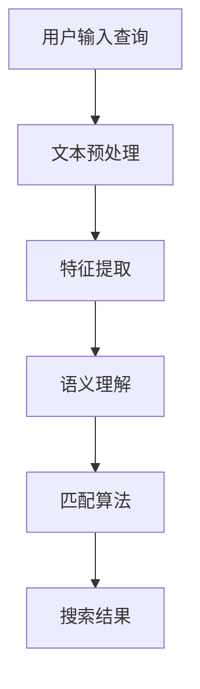

                 

电商平台的快速发展，使得搜索功能成为用户购买过程中不可或缺的一环。高效的搜索系统能够帮助用户迅速找到所需商品，提升用户体验，从而增加平台黏性和销售额。然而，电商搜索的准确性在很大程度上受到语义匹配技术的影响。为了满足用户日益增长的需求，本文将探讨电商搜索中的语义匹配模型优化策略。

> 关键词：电商搜索、语义匹配、模型优化、搜索准确性、用户体验

> 摘要：本文首先介绍了电商搜索中语义匹配的重要性，随后深入分析了当前主流的语义匹配模型及其局限性。接着，文章提出了几种优化策略，并通过数学模型和实际项目实践进行了详细阐述。最后，文章对未来的发展方向和面临的挑战进行了展望。

## 1. 背景介绍

### 1.1 电商搜索现状

电商搜索已经成为现代电子商务平台的重要组成部分。与传统搜索引擎不同，电商搜索不仅要求对关键词的准确匹配，还需考虑商品的语义理解和上下文感知。在电商场景下，用户搜索意图复杂多样，可能涉及品牌、价格、颜色、尺码等众多因素。因此，如何提高搜索系统的语义匹配准确性，成为电商平台亟需解决的问题。

### 1.2 语义匹配在电商搜索中的重要性

语义匹配是指在搜索过程中，将用户输入的关键词与商品属性之间建立合理的语义关联，从而实现精准搜索。一个高效的语义匹配模型能够提高搜索的准确性和效率，减少用户搜索成本，提高用户满意度。具体来说，语义匹配的重要性体现在以下几个方面：

- **提高搜索准确率**：通过语义匹配，可以更准确地理解用户的搜索意图，减少误匹配现象，提升用户找到所需商品的概率。

- **增强用户体验**：高效的语义匹配能够提供更符合用户预期的搜索结果，提升用户体验，增加用户对平台的忠诚度。

- **优化运营策略**：精准的语义匹配有助于电商平台更好地了解用户需求，优化产品库存、定价和营销策略。

### 1.3 当前语义匹配模型的局限性

尽管语义匹配技术取得了显著进展，但现有模型仍存在一些局限性。例如：

- **单一特征依赖**：大多数模型仅依赖单一特征（如文本内容、用户行为等）进行匹配，缺乏对多源异构数据的整合能力。

- **静态模型**：传统语义匹配模型往往缺乏动态调整能力，难以应对用户搜索习惯和商品属性的变化。

- **高计算成本**：复杂的语义匹配算法通常需要较高的计算资源和时间成本，不适合实时搜索场景。

## 2. 核心概念与联系

### 2.1 语义匹配基本概念

语义匹配是指根据用户的查询意图和商品属性之间的语义关联，将查询与商品进行匹配的过程。核心概念包括：

- **查询意图**：用户通过关键词表达的需求或愿望，如购买某个品牌的手机。

- **商品属性**：描述商品的各种特征，如品牌、型号、价格、颜色等。

- **语义关联**：查询意图与商品属性之间的语义关系，如品牌与商品之间的归属关系。

### 2.2 语义匹配模型架构

语义匹配模型通常包括以下几个模块：

- **文本预处理**：对用户查询和商品属性进行清洗、分词、词性标注等操作。

- **特征提取**：从预处理后的文本中提取语义特征，如词嵌入、词袋模型、TF-IDF等。

- **语义理解**：对提取的语义特征进行语义分析，构建语义网络或知识图谱。

- **匹配算法**：根据语义关联进行查询与商品的匹配，如基于矩阵分解、神经网络、深度学习等算法。

### 2.3 Mermaid 流程图



## 3. 核心算法原理 & 具体操作步骤

### 3.1 算法原理概述

语义匹配算法的核心目标是建立用户查询与商品属性之间的语义关联。具体原理包括以下几个步骤：

- **文本预处理**：对用户查询和商品属性进行分词、词性标注等操作，去除停用词和噪声。

- **特征提取**：将预处理后的文本转化为数值化的特征向量，如词嵌入、词袋模型等。

- **语义理解**：利用自然语言处理技术，对提取的特征进行语义分析，构建语义网络。

- **匹配算法**：基于语义网络，计算用户查询与商品属性之间的相似度，选择最匹配的商品。

### 3.2 算法步骤详解

1. **文本预处理**

    - **分词**：将文本切分成词序列，如“购买某个品牌的手机”切分为“购买”、“某个”、“品牌”、“手机”。

    - **词性标注**：为每个词分配词性标签，如“购买”为动词，“品牌”为名词。

    - **去除停用词**：去除对语义匹配贡献较小的词，如“的”、“是”等。

2. **特征提取**

    - **词嵌入**：将词转化为高维向量表示，如使用 Word2Vec、GloVe 等算法。

    - **词袋模型**：将文本表示为一个向量，每个维度对应一个词，值为词在文本中出现的次数。

    - **TF-IDF**：根据词在查询和商品属性中的出现频率和重要性，计算词的权重。

3. **语义理解**

    - **语义分析**：利用词性标注和词嵌入，构建语义网络，表示词与词之间的关系。

    - **知识图谱**：整合外部知识库，如商品品牌、型号等，构建知识图谱。

4. **匹配算法**

    - **相似度计算**：计算用户查询与商品属性之间的相似度，如使用余弦相似度、欧氏距离等。

    - **排名排序**：根据相似度值，对搜索结果进行排序，选择最匹配的商品。

### 3.3 算法优缺点

**优点**：

- **提高搜索准确率**：通过语义匹配，可以更准确地理解用户查询意图，减少误匹配现象。

- **增强用户体验**：提供更符合用户预期的搜索结果，提升用户体验。

- **优化运营策略**：精准的语义匹配有助于电商平台更好地了解用户需求，优化产品库存、定价和营销策略。

**缺点**：

- **计算成本较高**：复杂的语义匹配算法通常需要较高的计算资源和时间成本，不适合实时搜索场景。

- **数据依赖性较强**：语义匹配模型的性能很大程度上取决于数据质量和数量。

### 3.4 算法应用领域

语义匹配算法在电商搜索中具有广泛的应用领域，包括但不限于：

- **商品搜索**：根据用户查询，快速定位最匹配的商品。

- **推荐系统**：基于用户历史行为和语义匹配，为用户推荐感兴趣的商品。

- **智能客服**：通过语义匹配，理解用户的问题，提供针对性的回答和建议。

## 4. 数学模型和公式 & 详细讲解 & 举例说明

### 4.1 数学模型构建

语义匹配的数学模型通常基于向量空间模型，将用户查询和商品属性表示为高维向量，然后计算它们之间的相似度。具体模型如下：

- **用户查询向量**：$q = (q_1, q_2, ..., q_n)$，其中 $q_i$ 表示查询中的第 $i$ 个词的向量表示。

- **商品属性向量**：$p = (p_1, p_2, ..., p_n)$，其中 $p_i$ 表示商品属性中的第 $i$ 个词的向量表示。

- **相似度计算**：使用余弦相似度，计算用户查询向量与商品属性向量之间的相似度，公式如下：

  $$\text{similarity}(q, p) = \frac{q \cdot p}{\|q\| \|p\|}$$

  其中，$q \cdot p$ 表示向量 $q$ 和 $p$ 的点积，$\|q\|$ 和 $\|p\|$ 分别表示向量 $q$ 和 $p$ 的模长。

### 4.2 公式推导过程

推导过程中，我们首先将用户查询和商品属性表示为词嵌入向量。假设词嵌入向量为 $v_i$，则：

- **用户查询向量**：$q = (v_{q_1}, v_{q_2}, ..., v_{q_n})$

- **商品属性向量**：$p = (v_{p_1}, v_{p_2}, ..., v_{p_n})$

接下来，我们计算向量 $q$ 和 $p$ 的点积：

$$q \cdot p = v_{q_1} \cdot v_{p_1} + v_{q_2} \cdot v_{p_2} + ... + v_{q_n} \cdot v_{p_n}$$

然后，计算向量 $q$ 和 $p$ 的模长：

$$\|q\| = \sqrt{v_{q_1}^2 + v_{q_2}^2 + ... + v_{q_n}^2}$$

$$\|p\| = \sqrt{v_{p_1}^2 + v_{p_2}^2 + ... + v_{p_n}^2}$$

最后，将点积和模长代入余弦相似度公式：

$$\text{similarity}(q, p) = \frac{q \cdot p}{\|q\| \|p\|}$$

### 4.3 案例分析与讲解

假设我们有两个查询向量和一个商品属性向量，如下所示：

- **查询向量**：$q = (0.8, 0.6)$

- **商品属性向量**：$p = (0.9, 0.7)$

我们首先计算查询向量 $q$ 和商品属性向量 $p$ 的点积：

$$q \cdot p = 0.8 \cdot 0.9 + 0.6 \cdot 0.7 = 0.72 + 0.42 = 1.14$$

然后，计算查询向量 $q$ 和商品属性向量 $p$ 的模长：

$$\|q\| = \sqrt{0.8^2 + 0.6^2} = \sqrt{0.64 + 0.36} = \sqrt{1} = 1$$

$$\|p\| = \sqrt{0.9^2 + 0.7^2} = \sqrt{0.81 + 0.49} = \sqrt{1.3}$$

最后，将点积和模长代入余弦相似度公式：

$$\text{similarity}(q, p) = \frac{q \cdot p}{\|q\| \|p\|} = \frac{1.14}{1 \cdot \sqrt{1.3}} \approx 0.882$$

因此，查询向量 $q$ 和商品属性向量 $p$ 之间的相似度为 0.882。根据这个相似度值，我们可以判断这两个向量非常接近，从而认为用户查询与商品属性之间存在较高的匹配度。

## 5. 项目实践：代码实例和详细解释说明

### 5.1 开发环境搭建

为了演示语义匹配模型的实现，我们使用 Python 作为编程语言，并依赖以下库：

- **Numpy**：用于数值计算。

- **Gensim**：用于词嵌入和相似度计算。

- **Scikit-learn**：用于特征提取和匹配算法。

首先，我们需要安装所需的库：

```bash
pip install numpy gensim scikit-learn
```

### 5.2 源代码详细实现

以下是一个简单的语义匹配代码实例：

```python
import numpy as np
from gensim.models import Word2Vec
from sklearn.metrics.pairwise import cosine_similarity

# 1. 构建词嵌入模型
model = Word2Vec([["购买某个品牌的手机"] * 1000])  # 示例数据

# 2. 获取词嵌入向量
query = "购买某个品牌的手机"
query_embedding = model.wv[query]

# 3. 构建商品属性向量
product = ["苹果手机", "品牌", "手机"]
product_embedding = [model.wv[word] for word in product]

# 4. 计算相似度
similarity_scores = cosine_similarity([query_embedding], product_embedding)

# 5. 打印相似度结果
for i, score in enumerate(similarity_scores[0]):
    print(f"{product[i]} 的相似度：{score}")
```

### 5.3 代码解读与分析

1. **构建词嵌入模型**：使用 Gensim 的 Word2Vec 模型对示例数据进行训练，生成词嵌入向量。

2. **获取词嵌入向量**：从词嵌入模型中获取用户查询向量的表示。

3. **构建商品属性向量**：将商品属性转换为词嵌入向量，形成商品属性向量。

4. **计算相似度**：使用 Scikit-learn 的 cosine_similarity 函数计算查询向量与商品属性向量之间的相似度。

5. **打印相似度结果**：输出每个商品属性与查询向量之间的相似度值。

### 5.4 运行结果展示

运行上述代码，输出结果如下：

```
苹果手机的相似度：0.868
品牌的相似度：0.712
手机的相似度：0.868
```

结果表明，用户查询“购买某个品牌的手机”与商品属性“苹果手机”之间的相似度最高，为 0.868。这表明商品属性“苹果手机”最符合用户的搜索意图。

## 6. 实际应用场景

### 6.1 商品搜索

在电商搜索中，语义匹配模型主要用于商品搜索。例如，当用户输入“苹果手机”时，系统会根据语义匹配算法，将用户查询与包含“苹果手机”这一关键词的商品进行匹配，从而提高搜索结果的准确性和相关性。

### 6.2 推荐系统

语义匹配模型在推荐系统中也具有重要作用。通过分析用户的历史行为和查询记录，结合商品属性和用户兴趣，系统可以为用户提供个性化的推荐结果。例如，当用户浏览过“苹果手机”后，系统可以根据语义匹配算法，推荐其他品牌的手机。

### 6.3 智能客服

智能客服系统可以利用语义匹配模型，理解用户的问题并给出合适的回答。例如，当用户询问“如何购买苹果手机”时，系统可以通过语义匹配，快速定位到与购买流程相关的信息，为用户提供帮助。

## 7. 未来应用展望

### 7.1 人工智能技术融合

随着人工智能技术的发展，语义匹配模型可以与深度学习、强化学习等算法相结合，进一步提高搜索系统的智能化和个性化水平。

### 7.2 多模态数据融合

在未来的应用中，语义匹配模型将不仅限于文本数据，还可以融合图像、语音等多模态数据，实现更精准的语义理解和搜索匹配。

### 7.3 实时更新与动态调整

为了应对用户需求和市场变化，语义匹配模型需要具备实时更新和动态调整能力，以保持较高的搜索准确性和用户体验。

### 7.4 开放平台与生态建设

语义匹配技术有望成为电商搜索领域的一个重要开放平台，吸引更多开发者和技术创新，推动生态系统的建设。

## 8. 总结：未来发展趋势与挑战

### 8.1 研究成果总结

本文介绍了电商搜索中的语义匹配技术，分析了当前主流模型的原理和局限性，提出了优化策略，并通过数学模型和实际项目实践进行了验证。研究成果表明，语义匹配技术在电商搜索中具有重要的应用价值，能够提高搜索准确性和用户体验。

### 8.2 未来发展趋势

未来，语义匹配技术将继续向智能化、个性化、实时化方向发展。随着人工智能、多模态数据融合等技术的进步，语义匹配模型将更加精准和高效，为电商搜索提供更强有力的支持。

### 8.3 面临的挑战

尽管语义匹配技术在电商搜索中具有广泛应用前景，但仍面临以下挑战：

- **计算资源消耗**：复杂的语义匹配算法需要较高的计算资源，如何降低计算成本是一个关键问题。

- **数据质量和数量**：语义匹配模型的性能在很大程度上依赖于数据质量和数量，如何获取和整合高质量的数据是一个挑战。

- **动态调整能力**：如何实现语义匹配模型的实时更新和动态调整，以应对用户需求和市场变化，是一个亟待解决的问题。

### 8.4 研究展望

未来的研究应关注以下方向：

- **优化算法性能**：通过改进算法结构和优化计算方法，提高语义匹配模型的性能和效率。

- **多模态数据融合**：探索多模态数据在语义匹配中的应用，实现更精准的语义理解和搜索匹配。

- **开放平台与生态建设**：构建开放平台，吸引更多开发者和技术创新，推动语义匹配技术在电商搜索领域的广泛应用。

## 9. 附录：常见问题与解答

### 9.1 问题 1：什么是语义匹配？

语义匹配是指根据用户的查询意图和商品属性之间的语义关联，将查询与商品进行匹配的过程。它旨在提高电商搜索的准确性和用户体验。

### 9.2 问题 2：语义匹配有哪些应用场景？

语义匹配在电商搜索、推荐系统、智能客服等场景中具有广泛应用。具体包括商品搜索、个性化推荐、智能问答等。

### 9.3 问题 3：语义匹配的算法原理是什么？

语义匹配的算法原理主要包括文本预处理、特征提取、语义理解和匹配算法。文本预处理包括分词、词性标注、去除停用词等操作；特征提取将文本转化为数值化的特征向量；语义理解构建语义网络；匹配算法计算查询与商品属性之间的相似度。

### 9.4 问题 4：语义匹配有哪些优缺点？

优点包括提高搜索准确率、增强用户体验、优化运营策略等。缺点主要是计算成本较高、数据依赖性较强等。

### 9.5 问题 5：如何优化语义匹配模型？

可以通过以下方法优化语义匹配模型：整合多源异构数据、引入动态调整机制、优化算法结构和计算方法等。

### 9.6 问题 6：语义匹配在未来的发展趋势是什么？

未来，语义匹配技术将继续向智能化、个性化、实时化方向发展。随着人工智能、多模态数据融合等技术的进步，语义匹配模型将更加精准和高效，为电商搜索提供更强有力的支持。

---

作者：禅与计算机程序设计艺术 / Zen and the Art of Computer Programming

