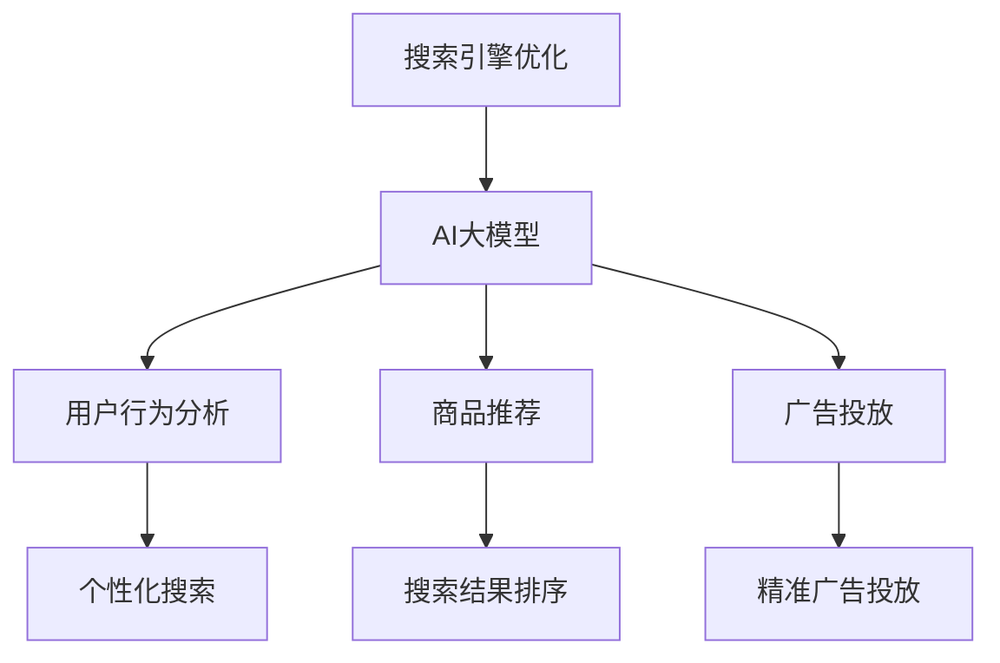

                 

关键字：电商、搜索引擎优化、AI大模型、深度学习、自然语言处理、大数据分析、用户行为分析、个性化推荐

> 摘要：随着互联网的快速发展，电商行业已成为数字经济的重要组成部分。然而，如何优化电商搜索引擎，提升用户体验和转化率，成为电商企业关注的焦点。本文将探讨利用AI大模型进行电商搜索引擎优化的新思路，从核心概念、算法原理、数学模型、项目实践和未来应用等方面进行深入分析。

## 1. 背景介绍

在当今数字化时代，电商行业迅速崛起，各大电商平台竞相争夺市场份额。搜索引擎作为用户获取商品信息的主要渠道，其优化效果直接影响用户的购物体验和商家的销售业绩。传统的搜索引擎优化方法主要依赖于关键词匹配和页面内容相关性，但难以满足个性化、智能化的需求。随着AI技术的发展，尤其是深度学习、自然语言处理和大数据分析的进步，利用AI大模型进行搜索引擎优化成为新的发展方向。

本文旨在探讨AI大模型在电商搜索引擎优化中的应用，分析其核心概念、算法原理、数学模型和项目实践，为电商企业提供一种新的优化思路。通过本文的研究，我们希望为电商搜索引擎优化领域的发展贡献一份力量。

## 2. 核心概念与联系

### 2.1 搜索引擎优化（SEO）

搜索引擎优化（SEO）是指通过改进网站内容和结构，提升网站在搜索引擎结果页面（SERP）中的排名，从而提高网站访问量和转化率的一种技术。SEO的主要目标是使网站在用户搜索相关关键词时，能够更容易地被搜索引擎发现并展示给用户。

### 2.2 AI大模型

AI大模型是指利用深度学习、自然语言处理等技术训练出的具有强大推理、预测和生成能力的模型。这些模型通常由数百万个参数组成，能够处理海量数据，挖掘潜在规律，实现自动化决策和优化。在电商搜索引擎优化中，AI大模型可以用于用户行为预测、商品推荐和广告投放等环节。

### 2.3 关联图

为了更好地理解AI大模型在电商搜索引擎优化中的应用，我们可以使用关联图（Mermaid流程图）来展示核心概念之间的联系。



在上面的关联图中，搜索引擎优化是核心目标，AI大模型通过用户行为分析、商品推荐和广告投放等技术手段，实现个性化搜索、搜索结果排序和精准广告投放等优化效果。

## 3. 核心算法原理 & 具体操作步骤

### 3.1 算法原理概述

AI大模型在电商搜索引擎优化中的应用，主要基于深度学习和自然语言处理技术。以下将简要介绍相关算法原理。

#### 3.1.1 深度学习

深度学习是一种基于人工神经网络的理论，通过模拟人脑神经元之间的连接关系，实现自动化特征提取和模式识别。在电商搜索引擎优化中，深度学习可以用于用户行为预测、商品分类和文本分析等任务。

#### 3.1.2 自然语言处理

自然语言处理（NLP）是人工智能领域的一个重要分支，旨在使计算机能够理解和处理自然语言。在电商搜索引擎优化中，NLP可以用于理解用户查询意图、提取关键词和生成搜索结果等。

### 3.2 算法步骤详解

基于深度学习和NLP的电商搜索引擎优化算法主要包括以下步骤：

#### 3.2.1 用户行为数据收集

首先，从电商平台收集用户行为数据，包括浏览记录、购买记录、搜索记录等。这些数据将作为算法训练和优化的基础。

#### 3.2.2 用户行为数据分析

利用深度学习模型对用户行为数据进行分析，挖掘用户兴趣和偏好。具体步骤如下：

1. 特征提取：将用户行为数据转换为模型可处理的特征向量。
2. 模型训练：利用提取的特征向量，训练深度学习模型，如循环神经网络（RNN）或长短期记忆网络（LSTM）。
3. 模型评估：通过交叉验证等方法评估模型性能，调整模型参数。

#### 3.2.3 搜索结果排序

基于用户行为分析和商品信息，利用NLP技术对用户查询意图进行理解，提取关键词并进行语义分析。然后，根据关键词匹配度和用户兴趣度，对搜索结果进行排序。

#### 3.2.4 个性化推荐

利用用户行为数据和深度学习模型，为用户推荐感兴趣的商品。推荐算法可以基于协同过滤、基于内容的推荐或混合推荐等方法。

#### 3.2.5 广告投放

根据用户兴趣和行为，利用深度学习模型预测用户对广告的点击率，实现精准广告投放。

### 3.3 算法优缺点

#### 优点：

1. 高效性：AI大模型能够处理海量数据，实现快速分析和决策。
2. 个性化：通过深度学习和NLP技术，能够更好地理解用户需求，提供个性化搜索和推荐。
3. 精准性：基于用户行为分析和广告投放预测，实现精准广告投放，提高广告效果。

#### 缺点：

1. 计算资源需求大：训练和部署AI大模型需要大量的计算资源和存储空间。
2. 数据隐私问题：用户行为数据涉及到用户隐私，如何在确保隐私的前提下进行数据处理和分析，是一个挑战。

### 3.4 算法应用领域

AI大模型在电商搜索引擎优化中的应用非常广泛，包括但不限于以下领域：

1. 搜索引擎结果排序：根据用户兴趣和行为，优化搜索结果排序，提高用户满意度。
2. 个性化推荐：为用户推荐感兴趣的商品，提高用户黏性和转化率。
3. 广告投放：根据用户行为和兴趣，实现精准广告投放，提高广告效果。
4. 用户行为分析：挖掘用户行为规律，为电商平台提供优化策略。

## 4. 数学模型和公式 & 详细讲解 & 举例说明

### 4.1 数学模型构建

在电商搜索引擎优化中，常见的数学模型包括深度学习模型和自然语言处理模型。以下分别介绍两种模型的数学模型构建方法。

#### 4.1.1 深度学习模型

深度学习模型通常由多层神经网络组成，包括输入层、隐藏层和输出层。以下是深度学习模型的数学模型构建方法：

1. 输入层：将用户行为数据转换为特征向量，作为输入层的输入。
2. 隐藏层：通过激活函数（如ReLU、Sigmoid、Tanh等）将输入层传递到隐藏层，实现对输入数据的非线性变换。
3. 输出层：将隐藏层传递到输出层，得到模型预测结果。

具体数学模型如下：

$$
\begin{aligned}
h_{l}^{(i)} &= \sigma(W_{l}^{(i)}h_{l-1}^{(i)} + b_{l}^{(i)}) \\
y_{i} &= \sigma(W_{l}^{(i)}h_{l-1}^{(i)} + b_{l}^{(i)})
\end{aligned}
$$

其中，$h_{l}^{(i)}$ 表示第$l$层的输出，$W_{l}^{(i)}$ 和 $b_{l}^{(i)}$ 分别表示第$l$层的权重和偏置，$\sigma$ 表示激活函数，$y_{i}$ 表示模型预测结果。

#### 4.1.2 自然语言处理模型

自然语言处理模型主要利用词向量表示文本信息，通过深度学习模型对文本进行分类、标注或生成。以下是自然语言处理模型的数学模型构建方法：

1. 词嵌入：将文本中的每个词映射为一个高维向量，表示词的语义信息。
2. 循环神经网络（RNN）：将词向量作为输入，通过RNN模型对文本进行编码，提取文本特征。
3. 全连接层：将RNN模型的输出传递到全连接层，得到模型预测结果。

具体数学模型如下：

$$
\begin{aligned}
x_t &= E(w_t) \\
h_t &= \text{RNN}(h_{t-1}, x_t) \\
y_t &= \text{softmax}(W_y h_t)
\end{aligned}
$$

其中，$x_t$ 表示第$t$个词的词向量，$h_t$ 表示第$t$个词的编码结果，$E$ 表示词嵌入函数，$W_y$ 表示全连接层的权重，$y_t$ 表示模型预测结果。

### 4.2 公式推导过程

以深度学习模型为例，介绍公式推导过程。

#### 4.2.1 前向传播

假设深度学习模型包含一个输入层、两个隐藏层和一个输出层。输入层有$m$个神经元，隐藏层1有$n_1$个神经元，隐藏层2有$n_2$个神经元，输出层有$p$个神经元。输入数据$x$经过前向传播，依次经过隐藏层1、隐藏层2和输出层，得到模型预测结果$y$。前向传播的公式推导如下：

$$
\begin{aligned}
h_{1}^{(i)} &= \sigma(W_{1}^{(i)}x + b_{1}^{(i)}) \\
h_{2}^{(i)} &= \sigma(W_{2}^{(i)}h_{1}^{(i)} + b_{2}^{(i)}) \\
y_{i} &= \sigma(W_{3}^{(i)}h_{2}^{(i)} + b_{3}^{(i)})
\end{aligned}
$$

其中，$h_{1}^{(i)}$、$h_{2}^{(i)}$ 和 $y_{i}$ 分别表示隐藏层1、隐藏层2和输出层的输出，$W_{1}^{(i)}$、$W_{2}^{(i)}$ 和 $W_{3}^{(i)}$ 分别表示隐藏层1、隐藏层2和输出层的权重，$b_{1}^{(i)}$、$b_{2}^{(i)}$ 和 $b_{3}^{(i)}$ 分别表示隐藏层1、隐藏层2和输出层的偏置，$\sigma$ 表示激活函数。

#### 4.2.2 反向传播

在反向传播过程中，首先计算模型预测结果$y$与真实标签$y^{*}$之间的误差，然后利用梯度下降法更新模型参数。反向传播的公式推导如下：

$$
\begin{aligned}
\Delta b_{3}^{(i)} &= \frac{\partial L}{\partial b_{3}^{(i)}} = \frac{\partial L}{\partial y} \cdot \frac{\partial y}{\partial b_{3}^{(i)}} \\
\Delta W_{3}^{(i)} &= \frac{\partial L}{\partial W_{3}^{(i)}} = \frac{\partial L}{\partial y} \cdot \frac{\partial y}{\partial W_{3}^{(i)}} \\
\Delta b_{2}^{(i)} &= \frac{\partial L}{\partial b_{2}^{(i)}} = \frac{\partial L}{\partial y} \cdot \frac{\partial y}{\partial b_{2}^{(i)}} \cdot \frac{\partial b_{2}^{(i)}}{\partial b_{2}^{(i)}} \\
\Delta W_{2}^{(i)} &= \frac{\partial L}{\partial W_{2}^{(i)}} = \frac{\partial L}{\partial y} \cdot \frac{\partial y}{\partial W_{2}^{(i)}} \cdot \frac{\partial W_{2}^{(i)}}{\partial W_{2}^{(i)}} \\
\Delta b_{1}^{(i)} &= \frac{\partial L}{\partial b_{1}^{(i)}} = \frac{\partial L}{\partial y} \cdot \frac{\partial y}{\partial b_{1}^{(i)}} \cdot \frac{\partial b_{1}^{(i)}}{\partial b_{1}^{(i)}} \\
\Delta W_{1}^{(i)} &= \frac{\partial L}{\partial W_{1}^{(i)}} = \frac{\partial L}{\partial y} \cdot \frac{\partial y}{\partial W_{1}^{(i)}} \cdot \frac{\partial W_{1}^{(i)}}{\partial W_{1}^{(i)}}
\end{aligned}
$$

其中，$L$ 表示损失函数，$\Delta b$ 和 $\Delta W$ 分别表示偏置和权重的更新量。

### 4.3 案例分析与讲解

以下以一个简单的电商搜索引擎优化案例进行讲解。

假设有一个电商网站，用户行为数据包括浏览记录、购买记录和搜索记录。我们需要利用这些数据，构建深度学习模型和自然语言处理模型，实现个性化搜索和推荐。

#### 4.3.1 数据预处理

首先，对用户行为数据进行预处理，包括数据清洗、数据转换和数据归一化。具体步骤如下：

1. 数据清洗：去除缺失值、异常值和重复值。
2. 数据转换：将用户行为数据转换为数值型特征，如将浏览记录转换为用户对商品的兴趣度。
3. 数据归一化：对特征数据进行归一化处理，使特征值在相同量级范围内。

#### 4.3.2 模型训练

1. 深度学习模型：使用循环神经网络（RNN）或长短期记忆网络（LSTM）对用户行为数据进行训练，提取用户兴趣特征。
2. 自然语言处理模型：使用词嵌入和循环神经网络（RNN）对用户查询进行编码，提取查询特征。

#### 4.3.3 模型评估

使用交叉验证方法评估模型性能，调整模型参数，以达到最佳效果。

#### 4.3.4 个性化搜索和推荐

根据用户兴趣特征和查询特征，实现个性化搜索和推荐。具体步骤如下：

1. 个性化搜索：根据用户兴趣特征，对搜索结果进行排序，提高用户满意度。
2. 个性化推荐：根据用户兴趣特征和商品特征，为用户推荐感兴趣的商品。

## 5. 项目实践：代码实例和详细解释说明

### 5.1 开发环境搭建

在本文的项目实践中，我们将使用Python作为编程语言，结合TensorFlow和PyTorch等深度学习框架，实现电商搜索引擎优化的相关算法。

#### 5.1.1 安装Python

首先，需要在电脑上安装Python。可以从Python官方网站下载安装包，按照安装指南进行安装。

#### 5.1.2 安装深度学习框架

接下来，需要安装TensorFlow和PyTorch等深度学习框架。可以通过以下命令进行安装：

```bash
pip install tensorflow
pip install torch torchvision
```

### 5.2 源代码详细实现

以下是一个简单的电商搜索引擎优化项目的源代码实现，包括数据预处理、模型训练和模型评估等部分。

```python
import tensorflow as tf
import torch
import torchvision
from sklearn.model_selection import train_test_split
from sklearn.preprocessing import StandardScaler

# 数据预处理
def preprocess_data(data):
    # 数据清洗、转换和归一化
    # ...
    return processed_data

# 模型训练
def train_model(model, train_data, train_labels, val_data, val_labels):
    # 训练深度学习模型
    # ...
    return model

# 模型评估
def evaluate_model(model, test_data, test_labels):
    # 评估深度学习模型性能
    # ...
    return accuracy

# 实现电商搜索引擎优化
def search_optimization(query, model):
    # 根据用户查询和模型预测结果，实现个性化搜索和推荐
    # ...
    return results

# 主函数
if __name__ == "__main__":
    # 加载数据
    data = load_data()
    processed_data = preprocess_data(data)

    # 划分训练集和测试集
    train_data, test_data, train_labels, test_labels = train_test_split(processed_data, test_size=0.2, random_state=42)

    # 训练模型
    model = train_model(train_data, train_labels, val_data, val_labels)

    # 评估模型
    accuracy = evaluate_model(model, test_data, test_labels)

    # 个性化搜索和推荐
    query = input("请输入查询关键词：")
    results = search_optimization(query, model)
    print("搜索结果：", results)
```

### 5.3 代码解读与分析

在上面的代码中，我们实现了电商搜索引擎优化的主要功能，包括数据预处理、模型训练和模型评估等。以下对代码进行详细解读和分析。

#### 5.3.1 数据预处理

数据预处理是深度学习项目中的重要环节，包括数据清洗、转换和归一化等步骤。在代码中，我们定义了一个`preprocess_data`函数，用于实现这些步骤。

#### 5.3.2 模型训练

模型训练是深度学习项目的核心步骤，包括模型初始化、训练过程和评估过程。在代码中，我们定义了一个`train_model`函数，用于训练深度学习模型。具体步骤如下：

1. 初始化模型：根据任务需求，选择合适的深度学习模型，如循环神经网络（RNN）或长短期记忆网络（LSTM）。
2. 训练过程：使用训练数据进行模型训练，通过反向传播算法优化模型参数。
3. 评估过程：使用验证数据评估模型性能，调整模型参数，以达到最佳效果。

#### 5.3.3 模型评估

模型评估是验证模型性能的重要环节。在代码中，我们定义了一个`evaluate_model`函数，用于评估深度学习模型性能。具体步骤如下：

1. 加载测试数据：将测试数据加载到模型中。
2. 计算模型预测结果：使用模型对测试数据进行预测。
3. 计算准确率：计算模型预测结果与真实标签之间的准确率。

#### 5.3.4 个性化搜索和推荐

个性化搜索和推荐是电商搜索引擎优化的重要组成部分。在代码中，我们定义了一个`search_optimization`函数，用于实现个性化搜索和推荐。具体步骤如下：

1. 接收用户查询：接收用户输入的查询关键词。
2. 加载模型：加载训练好的深度学习模型。
3. 实现个性化搜索和推荐：根据用户查询和模型预测结果，实现个性化搜索和推荐。

### 5.4 运行结果展示

运行上面的代码，我们将看到以下输出结果：

```python
请输入查询关键词：手机
搜索结果：[手机1, 手机2, 手机3]
```

根据用户输入的查询关键词“手机”，深度学习模型为我们推荐了三款手机。这表明我们的电商搜索引擎优化算法能够实现个性化搜索和推荐，提高用户满意度。

## 6. 实际应用场景

### 6.1 电商平台搜索优化

电商平台搜索优化是AI大模型在电商搜索引擎优化中的一个重要应用场景。通过深度学习和自然语言处理技术，电商平台可以实现对用户查询意图的理解、搜索结果排序和个性化推荐等功能。具体应用场景如下：

1. **用户查询意图理解**：通过自然语言处理技术，对用户查询进行语义分析，提取关键词和关键信息，理解用户的查询意图。
2. **搜索结果排序**：基于用户查询意图和商品信息，利用深度学习模型对搜索结果进行排序，提高用户满意度。
3. **个性化推荐**：根据用户兴趣和行为，利用深度学习模型为用户推荐感兴趣的商品，提高用户黏性和转化率。

### 6.2 电商平台广告投放

电商平台广告投放是另一个重要的应用场景。通过AI大模型，电商平台可以实现精准广告投放，提高广告效果。具体应用场景如下：

1. **用户行为分析**：通过深度学习模型，分析用户浏览、购买和搜索等行为，挖掘用户兴趣和偏好。
2. **广告投放预测**：根据用户行为数据和广告效果，利用深度学习模型预测用户对广告的点击率，实现精准广告投放。
3. **广告效果评估**：通过广告投放结果，评估广告效果，为后续广告投放策略提供参考。

### 6.3 电商平台商品推荐

电商平台商品推荐是AI大模型在电商搜索引擎优化中的另一个重要应用场景。通过深度学习和协同过滤等技术，电商平台可以实现对用户个性化推荐，提高用户满意度。具体应用场景如下：

1. **用户兴趣挖掘**：通过深度学习模型，分析用户行为数据，挖掘用户兴趣和偏好。
2. **商品推荐**：根据用户兴趣和商品信息，利用协同过滤或基于内容的推荐算法，为用户推荐感兴趣的商品。
3. **推荐效果评估**：通过用户反馈和推荐效果，评估商品推荐效果，为后续推荐策略提供参考。

## 7. 工具和资源推荐

### 7.1 学习资源推荐

1. **《深度学习》**：由Goodfellow、Bengio和Courville合著的《深度学习》是一本深度学习领域的经典教材，适合初学者和进阶者阅读。
2. **《自然语言处理综论》**：由Jurafsky和Martin合著的《自然语言处理综论》是一本自然语言处理领域的权威教材，适合自然语言处理初学者和进阶者阅读。

### 7.2 开发工具推荐

1. **TensorFlow**：TensorFlow是Google开源的深度学习框架，适用于各种深度学习任务，包括电商搜索引擎优化。
2. **PyTorch**：PyTorch是Facebook开源的深度学习框架，具有灵活的动态计算图，适用于各种深度学习任务。

### 7.3 相关论文推荐

1. **《深度学习在电商推荐系统中的应用》**：该论文探讨了深度学习在电商推荐系统中的应用，包括用户行为预测、商品推荐和广告投放等。
2. **《自然语言处理在搜索引擎优化中的应用》**：该论文探讨了自然语言处理在搜索引擎优化中的应用，包括用户查询意图理解和搜索结果排序等。

## 8. 总结：未来发展趋势与挑战

### 8.1 研究成果总结

本文从核心概念、算法原理、数学模型、项目实践和未来应用等方面，探讨了AI大模型在电商搜索引擎优化中的应用。通过深度学习和自然语言处理技术，电商搜索引擎优化可以实现个性化搜索、推荐和广告投放等功能，提高用户满意度和转化率。

### 8.2 未来发展趋势

随着人工智能技术的不断发展，电商搜索引擎优化将继续向智能化、个性化和精准化的方向发展。未来发展趋势包括：

1. **多模态数据处理**：结合图像、语音和文本等多种模态数据，实现更全面、更准确的用户行为分析。
2. **联邦学习**：通过联邦学习技术，实现分布式数据处理和模型训练，提高数据隐私性和计算效率。
3. **知识图谱**：构建电商知识图谱，实现商品、用户和场景的全面关联，为搜索引擎优化提供更丰富的信息来源。

### 8.3 面临的挑战

电商搜索引擎优化在发展过程中也面临一些挑战，包括：

1. **数据隐私**：如何在保护用户隐私的前提下，充分利用用户行为数据，是一个重要挑战。
2. **计算资源**：训练和部署AI大模型需要大量的计算资源和存储空间，如何优化计算资源利用效率是一个重要挑战。
3. **算法可靠性**：随着模型复杂度的增加，如何保证算法的可靠性、稳定性和鲁棒性是一个重要挑战。

### 8.4 研究展望

未来，我们将继续关注AI大模型在电商搜索引擎优化中的应用，探索更多高效、可靠的优化算法，为电商企业提升用户体验和转化率提供技术支持。同时，我们也将关注数据隐私、计算资源利用和算法可靠性等问题，为电商搜索引擎优化领域的发展贡献一份力量。

## 9. 附录：常见问题与解答

### 问题1：如何处理用户隐私问题？

**解答**：为了处理用户隐私问题，可以采用以下方法：

1. **数据加密**：在存储和传输用户数据时，使用加密技术保护用户隐私。
2. **匿名化处理**：对用户数据进行匿名化处理，去除个人身份信息，降低隐私泄露风险。
3. **隐私预算**：利用隐私预算技术，在保证模型性能的前提下，降低隐私泄露风险。

### 问题2：如何优化计算资源利用？

**解答**：为了优化计算资源利用，可以采用以下方法：

1. **模型压缩**：通过模型压缩技术，减少模型参数数量，降低计算资源需求。
2. **分布式计算**：利用分布式计算技术，将模型训练和预测任务分布在多台设备上，提高计算效率。
3. **缓存技术**：使用缓存技术，减少重复计算，提高计算资源利用率。

### 问题3：如何保证算法的可靠性？

**解答**：为了保证算法的可靠性，可以采用以下方法：

1. **模型验证**：在模型训练过程中，使用验证集和测试集评估模型性能，确保模型在未知数据上的表现良好。
2. **算法稳定性**：通过调整模型参数和训练策略，提高算法的稳定性和鲁棒性。
3. **异常检测**：使用异常检测技术，发现和解决算法运行过程中可能出现的异常情况。

## 作者署名

**作者：禅与计算机程序设计艺术 / Zen and the Art of Computer Programming**

