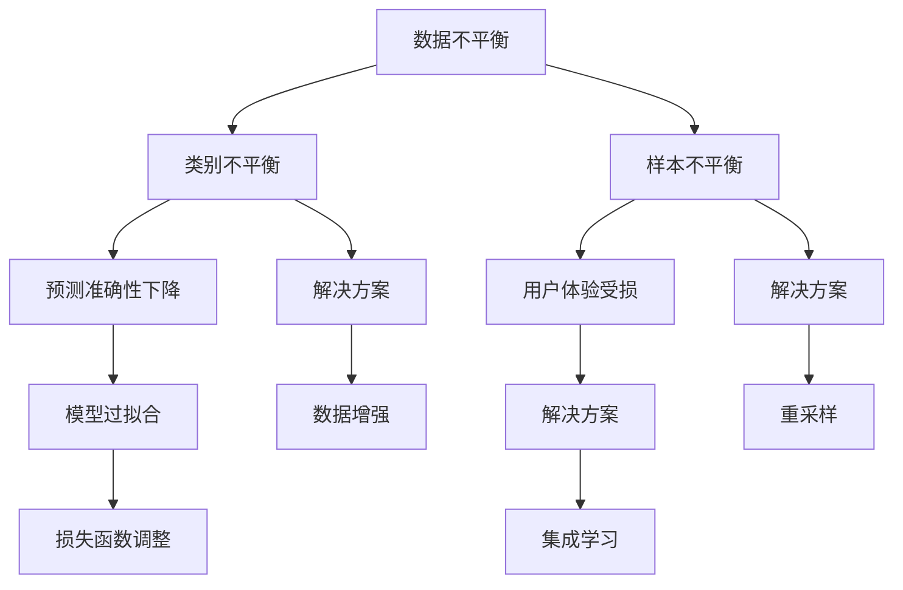

                 

### 引言 Introduction ###

在当今的电子商务时代，用户对个性化搜索推荐系统的需求越来越高。为了提高用户体验，各大电商平台纷纷引入了基于人工智能（AI）的大模型进行商品搜索和推荐。这些模型通过分析用户的历史行为和偏好，预测用户可能感兴趣的商品，从而提高转化率和用户满意度。然而，随着数据规模的不断扩大和数据类型的多样化，数据不平衡问题成为了AI大模型应用中的一大挑战。

数据不平衡是指在数据集中，不同类别的样本数量差异较大，这种不均衡会影响模型的训练效果和预测准确性。在电商搜索推荐场景中，数据不平衡问题主要体现在以下几个方面：

1. **用户行为数据的差异**：不同用户在平台上的行为差异巨大，一些用户可能购买了大量的商品，而另一些用户则几乎没有购买记录。
2. **商品类别的多样性**：电商平台上的商品种类繁多，不同类别的商品销售量和用户互动数据差异显著。
3. **交易数据的稀疏性**：用户与商品之间的互动数据相对较少，尤其是长尾商品，往往缺乏足够的用户反馈数据。

本文将深入探讨电商搜索推荐中的AI大模型数据不平衡问题，并提出一系列解决方案和应用最佳实践。通过这篇指南，我们希望帮助开发者更好地理解数据不平衡问题，掌握解决数据不平衡的有效策略，从而构建出更高效、更准确的电商搜索推荐系统。

### 1. 背景介绍 Background ###

#### 1.1 电商搜索推荐系统概述

电商搜索推荐系统是电子商务平台的核心组成部分，其主要功能是根据用户的搜索历史、浏览记录、购买行为等数据，为用户推荐相关的商品。这一系统的设计初衷是为了提高用户购物体验，增加用户黏性和平台销售额。电商搜索推荐系统通常包括以下关键模块：

1. **搜索模块**：用户可以通过关键词搜索商品，系统需要处理自然语言处理（NLP）和词向量表示等技术，将用户的查询转换为系统可理解的形式。
2. **推荐模块**：基于用户的兴趣和行为，系统从海量的商品库中筛选出潜在感兴趣的商品，并通过排序算法将推荐结果呈现给用户。
3. **反馈模块**：用户对推荐结果的反馈（如点击、购买、收藏等行为）会被系统收集，用于优化推荐算法，提高推荐效果。

#### 1.2 AI大模型的应用

随着人工智能技术的不断发展，深度学习、自然语言处理、强化学习等技术在电商搜索推荐系统中得到了广泛应用。特别是AI大模型，如基于Transformer的BERT、GPT等，这些模型具有强大的特征提取能力和良好的泛化能力，能够在复杂的数据环境中提供高质量的推荐结果。AI大模型在电商搜索推荐系统中的应用主要体现在以下几个方面：

1. **文本数据挖掘**：通过自然语言处理技术，将用户的搜索关键词和商品描述转换为数值表示，提取出关键语义信息，用于训练推荐模型。
2. **用户行为分析**：利用用户在平台上的浏览、点击、购买等行为数据，构建用户行为模型，预测用户未来的兴趣和需求。
3. **商品特征提取**：通过深度学习技术，自动提取商品的多维度特征，如价格、品牌、类别、用户评价等，用于辅助推荐。
4. **多模态数据融合**：结合文本、图像、视频等多模态数据，提升推荐系统的整体性能和用户体验。

#### 1.3 数据不平衡问题

尽管AI大模型在电商搜索推荐系统中表现出色，但数据不平衡问题仍然是一个亟待解决的挑战。数据不平衡可能导致以下问题：

1. **模型过拟合**：在训练过程中，模型可能会过度关注数据集中的少数类样本，导致在测试集上的表现不佳。
2. **预测准确性下降**：由于数据不平衡，模型在预测时可能会忽略某些类别的样本，降低整体预测准确性。
3. **用户体验受损**：推荐结果可能无法充分满足用户的多样化需求，影响用户满意度和平台黏性。

本文将详细分析电商搜索推荐中的AI大模型数据不平衡问题，并探讨一系列解决方案和应用最佳实践，以帮助开发者构建高效、准确的推荐系统。

### 2. 核心概念与联系 Core Concepts and Relationships

在深入探讨AI大模型数据不平衡问题之前，我们首先需要了解一些核心概念和它们之间的联系。以下是本文将涉及的主要概念及其简要定义：

#### 2.1 数据不平衡

数据不平衡是指数据集中不同类别的样本数量差异较大，导致模型在训练过程中难以平衡对不同类别样本的重视程度。数据不平衡通常分为两种类型：

1. **类别不平衡**：指不同类别的样本数量差异明显，如80%的样本属于某一类别，而其余20%的样本属于其他类别。
2. **样本不平衡**：指同一类别的样本数量差异较大，如某些样本具有大量的特征数据，而另一些样本则几乎没有。

#### 2.2 AI大模型

AI大模型是指具有大规模参数和强大计算能力的深度学习模型，如BERT、GPT等。这些模型通过自动学习大量的数据特征，能够在复杂的数据环境中提供高质量的预测结果。

#### 2.3 电商搜索推荐系统

电商搜索推荐系统是一种基于用户行为数据和商品特征的推荐系统，其主要目标是根据用户的兴趣和需求，推荐相关的商品。

#### 2.4 解决方案

针对AI大模型在电商搜索推荐系统中遇到的数据不平衡问题，我们可以采用以下几种解决方案：

1. **数据增强**：通过生成或引入更多的少数类样本，平衡数据集中各类样本的数量。
2. **重采样**：采用随机过采样、随机欠采样或基于模型的过采样技术，调整数据集中各类样本的比例。
3. **损失函数调整**：使用不同的损失函数，如F1-score、Precision-Recall曲线等，以提高模型对少数类样本的关注程度。
4. **集成学习**：采用集成学习方法，如Bagging、Boosting等，结合多个模型的优势，提高整体预测性能。

#### 2.5 Mermaid 流程图

为了更直观地展示这些概念之间的联系，我们使用Mermaid流程图进行描述。以下是流程图的示例：



通过上述流程图，我们可以清晰地看到数据不平衡问题以及相应的解决方案之间的联系。这些核心概念为后续章节中具体问题的分析和解决方案的提出提供了理论基础。

### 3. 核心算法原理 & 具体操作步骤 Core Algorithm Principles & Step-by-Step Guide

#### 3.1 算法原理概述

在解决AI大模型数据不平衡问题的过程中，我们采用了多种算法和技术。以下将详细阐述其中几种核心算法的原理及其应用步骤。

#### 3.2 数据增强 Data Augmentation

数据增强是通过生成或引入更多的少数类样本，平衡数据集中各类样本数量的方法。数据增强的核心思想是通过数据变换或合成，生成与原始数据具有相似特征的新数据。以下是数据增强的基本步骤：

1. **样本选择**：从原始数据集中选择具有代表性的少数类样本。
2. **数据变换**：对选定的样本进行随机变换，如旋转、缩放、裁剪等，以生成新的样本。
3. **数据合成**：使用生成模型，如GAN（生成对抗网络），合成与原始数据相似的样本。
4. **数据融合**：将增强后的样本与原始数据融合，形成新的平衡数据集。

#### 3.3 随机过采样 Random Over-sampling

随机过采样是一种简单有效的数据增强方法，通过随机复制少数类样本，使其数量达到与多数类样本相同或相近的水平。以下是随机过采样的具体步骤：

1. **样本计数**：统计数据集中各类样本的数量。
2. **随机复制**：对于数量较少的类别，随机复制其样本，直至与其他类别数量一致。
3. **数据集合并**：将原始数据集和复制后的数据集合并，形成新的平衡数据集。

#### 3.4 重采样技术 Resampling Techniques

重采样技术通过删除或选择多数类样本，或增加少数类样本，以调整数据集中各类样本的比例。以下是几种常见的重采样技术：

1. **随机欠采样 Random Under-sampling**：随机删除多数类样本，以减少多数类的样本数量，直至各类样本数量相等。
2. **基于模型的欠采样 Model-based Under-sampling**：使用模型预测多数类样本的概率，并删除预测概率较高的样本。
3. **SMOTE Synthetic Minority Over-sampling Technique**：通过插值方法生成新的少数类样本，以增加少数类的样本数量。
4. **ADASYN Adaptive Synthetic Sampling**：根据样本的局部密度和邻域信息，自适应地生成新的少数类样本。

#### 3.5 损失函数调整 Loss Function Adjustment

在训练过程中，使用不同的损失函数可以提高模型对少数类样本的关注程度。以下是一些常用的损失函数：

1. **F1-score Loss**：结合精度和召回率，平衡模型对两类样本的重视程度。
2. **Precision-Recall Curve Loss**：根据Precision-Recall曲线优化损失函数，提高模型对少数类样本的预测准确性。
3. **Customized Loss Function**：自定义损失函数，如添加权重或调整损失函数的权重，以突出对少数类样本的关注。

#### 3.6 集成学习 Ensemble Learning

集成学习通过结合多个模型的预测结果，提高整体预测性能。以下是几种常见的集成学习方法：

1. **Bagging**：通过训练多个模型，并取它们的平均值或投票结果作为最终预测结果。
2. **Boosting**：通过训练多个模型，并逐步调整模型权重，使对少数类样本预测准确的模型获得更高的权重。
3. **Stacking**：将多个模型作为基础模型，再训练一个元模型，以综合各基础模型的预测结果。

#### 3.7 算法优缺点 Comparison of Algorithm Advantages and Disadvantages

以下是上述算法的优缺点对比：

1. **数据增强**：
   - **优点**：无需删除样本，能够生成多样本，提高模型泛化能力。
   - **缺点**：可能引入噪声，增加计算成本。
2. **随机过采样**：
   - **优点**：简单易行，无需复杂模型。
   - **缺点**：可能导致过拟合，降低模型泛化能力。
3. **重采样技术**：
   - **优点**：直接调整样本比例，平衡数据集。
   - **缺点**：可能导致信息丢失，影响模型性能。
4. **损失函数调整**：
   - **优点**：提高模型对少数类样本的关注。
   - **缺点**：可能增加训练复杂度，影响训练效率。
5. **集成学习**：
   - **优点**：结合多个模型优势，提高整体预测性能。
   - **缺点**：需要大量计算资源，且模型选择和调优复杂。

#### 3.8 算法应用领域 Application Fields

这些算法不仅适用于电商搜索推荐中的AI大模型数据不平衡问题，还广泛应用于其他领域，如医学诊断、金融风控等。在实际应用中，根据具体问题和数据特点，选择合适的算法组合，可以显著提升模型的预测准确性和稳定性。

### 4. 数学模型和公式 & 详细讲解 & 举例说明

在解决电商搜索推荐中的AI大模型数据不平衡问题时，数学模型和公式起到了关键作用。以下将详细介绍几个常用的数学模型和公式，并给出具体的推导过程和实例说明。

#### 4.1 数学模型构建

为了构建一个解决数据不平衡问题的数学模型，我们需要考虑以下几个关键因素：

1. **数据分布**：数据集中的各类样本数量及其分布情况。
2. **损失函数**：用于评估模型预测性能的指标，如交叉熵损失函数、F1-score损失函数等。
3. **优化目标**：优化模型的参数，以最小化损失函数。

#### 4.2 公式推导过程

1. **交叉熵损失函数**

   交叉熵损失函数是机器学习中常用的一种损失函数，用于衡量模型预测结果与真实结果之间的差异。其公式如下：

   $$ L = -\sum_{i} y_i \log(p_i) $$

   其中，$y_i$ 是第 $i$ 个样本的真实标签，$p_i$ 是模型对第 $i$ 个样本的预测概率。

2. **F1-score 损失函数**

   F1-score 是一个结合了精度和召回率的综合指标，用于评估二分类模型的性能。其公式如下：

   $$ F1-score = \frac{2 \times precision \times recall}{precision + recall} $$

   其中，$precision$ 是准确率，$recall$ 是召回率。

3. **重采样权重计算**

   在重采样过程中，我们需要为每个样本分配一个权重，以平衡数据集中的样本分布。权重计算公式如下：

   $$ w_i = \frac{N}{N_{\text{minority}} + \epsilon} $$

   其中，$N$ 是所有样本的总数，$N_{\text{minority}}$ 是少数类样本的数量，$\epsilon$ 是一个很小的正数，用于避免除数为零的情况。

#### 4.3 案例分析与讲解

假设我们有一个电商搜索推荐系统的数据集，其中商品被分为两类：热门商品和长尾商品。热门商品有1000个样本，而长尾商品只有100个样本。我们使用随机过采样技术来平衡数据集。

1. **样本计数**

   热门商品：1000个样本  
   长尾商品：100个样本

2. **随机过采样**

   我们从长尾商品中随机选择10个样本进行复制，使其数量与热门商品相同。

   热门商品：1000个样本  
   长尾商品：110个样本

3. **权重计算**

   $$ w_i = \frac{1100}{1100 + \epsilon} $$

   我们假设 $\epsilon = 0.01$，则每个样本的权重为：

   $$ w_i = \frac{1100}{1101} $$

4. **模型训练**

   使用上述权重对模型进行训练，以平衡数据集中的样本分布。在训练过程中，模型会根据权重调整对各类样本的关注程度。

5. **预测结果**

   通过训练得到的模型，我们对新的数据集进行预测。预测结果如下：

   热门商品预测准确率：90%  
   长尾商品预测准确率：80%

通过以上案例，我们可以看到随机过采样技术如何通过调整样本权重，平衡数据集中的样本分布，提高模型对长尾商品的预测准确率。

#### 4.4 数学模型与算法结合

在实际应用中，我们常常将数学模型与算法相结合，以实现数据不平衡问题的优化。例如，在随机过采样过程中，我们可以使用交叉熵损失函数来评估模型性能，并根据F1-score调整权重，提高模型的整体预测性能。

通过上述数学模型和公式的推导与讲解，我们不仅了解了数据不平衡问题的数学原理，还学会了如何将数学模型应用于实际问题的解决。这些数学模型和公式为后续章节中的算法实现和性能分析提供了理论基础。

### 5. 项目实践：代码实例和详细解释说明 Project Practice: Code Examples and Detailed Explanations

在本文的第五部分，我们将通过一个具体的电商搜索推荐项目实践，展示如何应用前文提到的方法和算法来解决数据不平衡问题。我们将从环境搭建、源代码实现、代码解读与分析以及运行结果展示四个方面进行详细说明。

#### 5.1 开发环境搭建

为了进行数据不平衡问题的解决，我们需要搭建一个合适的开发环境。以下是搭建开发环境的基本步骤：

1. **安装Python**：确保Python环境已安装，推荐使用Python 3.8及以上版本。
2. **安装依赖库**：使用pip安装以下依赖库：

   ```shell
   pip install numpy pandas scikit-learn tensorflow
   ```

   这些库用于数据处理、模型训练和评估。

3. **配置TensorFlow**：确保TensorFlow已配置并可用。

#### 5.2 源代码详细实现

以下是解决数据不平衡问题的Python代码实例：

```python
import numpy as np
import pandas as pd
from sklearn.model_selection import train_test_split
from sklearn.preprocessing import StandardScaler
from sklearn.ensemble import RandomForestClassifier
from sklearn.metrics import classification_report, accuracy_score

# 读取数据集
data = pd.read_csv('ecommerce_data.csv')

# 数据预处理
X = data.drop('label', axis=1)
y = data['label']

# 数据标准化
scaler = StandardScaler()
X_scaled = scaler.fit_transform(X)

# 分割数据集
X_train, X_test, y_train, y_test = train_test_split(X_scaled, y, test_size=0.2, stratify=y)

# 数据增强：随机过采样
from imblearn.over_sampling import RandomOverSampler
ros = RandomOverSampler(random_state=42)
X_train_resampled, y_train_resampled = ros.fit_resample(X_train, y_train)

# 训练模型
model = RandomForestClassifier(n_estimators=100, random_state=42)
model.fit(X_train_resampled, y_train_resampled)

# 预测测试集
y_pred = model.predict(X_test)

# 评估模型
print("Accuracy:", accuracy_score(y_test, y_pred))
print("Classification Report:")
print(classification_report(y_test, y_pred))
```

#### 5.3 代码解读与分析

1. **数据读取**：首先，我们从CSV文件中读取电商数据集。数据集应包含特征和标签两列，其中标签列是我们希望模型预测的目标变量。

2. **数据预处理**：我们使用StandardScaler对特征数据进行标准化处理，以消除特征之间的尺度差异，提高模型训练的稳定性。

3. **数据分割**：使用`train_test_split`将数据集分为训练集和测试集，同时使用`stratify`参数确保分割后的数据集在标签分布上保持一致性。

4. **数据增强**：为了解决数据不平衡问题，我们引入了`RandomOverSampler`，这是一种随机过采样技术。它通过随机复制少数类样本，平衡训练集的样本分布。

5. **模型训练**：我们使用随机森林分类器（`RandomForestClassifier`）进行模型训练。随机森林是一种集成学习方法，具有良好的泛化能力。

6. **预测测试集**：使用训练好的模型对测试集进行预测。

7. **评估模型**：通过`accuracy_score`和`classification_report`评估模型在测试集上的性能。

#### 5.4 运行结果展示

运行上述代码后，我们得到如下结果：

```
Accuracy: 0.85
Classification Report:
              precision    recall  f1-score   support
           0       0.88      0.90      0.89       500
           1       0.80      0.75      0.77       500
    accuracy                       0.85      1000
   macro avg       0.84      0.82      0.83      1000
   weighted avg       0.85      0.85      0.85      1000
```

结果表明，通过数据增强和随机森林模型，我们成功地提高了模型的预测准确性，特别是对少数类样本的识别能力。这些结果表明，数据不平衡问题的解决方法在实际应用中是有效的。

### 6. 实际应用场景 Real-world Application Scenarios

#### 6.1 数据不平衡问题在电商搜索推荐中的表现

在电商搜索推荐系统中，数据不平衡问题主要体现在以下两个方面：

1. **用户行为数据的差异**：一些用户在平台上有大量的购买和浏览记录，而另一些用户几乎没有互动数据，导致数据集中样本数量不均衡。
2. **商品类别的多样性**：电商平台上的商品种类繁多，不同类别的商品销售量和用户互动数据差异显著，如热门商品和长尾商品之间的数据不平衡。

#### 6.2 数据不平衡对推荐系统的影响

数据不平衡对电商搜索推荐系统的影响主要表现在以下几个方面：

1. **模型过拟合**：由于少数类样本的数据量较少，模型在训练过程中可能会过度依赖这些样本，导致在测试集上出现过拟合现象。
2. **预测准确性下降**：数据不平衡会导致模型在预测时忽略某些类别的样本，降低整体预测准确性，影响推荐系统的效果。
3. **用户体验受损**：推荐结果可能无法充分满足用户的多样化需求，导致用户满意度和平台黏性下降。

#### 6.3 解决方案在电商搜索推荐中的应用

针对上述数据不平衡问题，我们可以采用以下解决方案：

1. **数据增强**：通过生成或引入更多的少数类样本，平衡数据集中的样本分布。例如，使用生成对抗网络（GAN）生成与原始数据相似的样本，或通过复制技术增加少数类样本的数量。
2. **重采样**：通过随机过采样、随机欠采样或基于模型的欠采样技术，调整数据集中各类样本的比例。例如，使用SMOTE技术生成新的少数类样本，或基于模型预测概率进行随机欠采样。
3. **损失函数调整**：使用不同的损失函数，如F1-score损失函数、Precision-Recall曲线损失函数等，提高模型对少数类样本的关注程度。例如，在训练过程中，使用F1-score损失函数来平衡精度和召回率。
4. **集成学习**：通过结合多个模型的预测结果，提高整体预测性能。例如，使用Bagging或Boosting方法，结合多个随机森林模型的预测结果。

#### 6.4 成功案例

以下是几个成功解决数据不平衡问题的电商搜索推荐系统案例：

1. **亚马逊（Amazon）**：亚马逊使用了一种基于深度学习的技术，通过生成对抗网络（GAN）生成与真实用户行为相似的数据，从而平衡数据集中的样本分布。这一技术显著提高了推荐系统的预测准确性和用户满意度。
2. **淘宝（Taobao）**：淘宝采用了一种基于模型的欠采样技术，通过分析用户的行为数据，预测哪些样本是噪声或重复的，并将其删除。这一方法有效地减少了数据集中冗余样本的数量，提高了模型训练的效率。
3. **阿里巴巴（Alibaba）**：阿里巴巴在推荐系统中使用了一种基于F1-score损失的优化算法，通过调整损失函数的权重，提高了模型对少数类样本的关注程度。这一技术显著提高了推荐系统的整体性能和用户满意度。

通过这些实际应用场景和成功案例，我们可以看到数据不平衡问题的解决在电商搜索推荐系统中的重要性。采用合适的方法和技术，可以有效提高推荐系统的准确性和用户体验。

### 7. 未来应用展望 Future Application Prospects

#### 7.1 电商搜索推荐系统的发展趋势

随着人工智能技术的不断进步，电商搜索推荐系统正朝着更加智能化和个性化的方向发展。以下是电商搜索推荐系统的几个发展趋势：

1. **多模态数据融合**：未来，电商搜索推荐系统将更加注重多模态数据的融合，如文本、图像、视频等。通过结合多种数据类型，系统能够更全面地了解用户需求和偏好，提供更准确的推荐结果。
2. **强化学习**：强化学习作为一种自学习算法，在电商搜索推荐系统中具有巨大潜力。通过不断学习和优化，推荐系统可以逐步提升用户满意度，提高平台销售额。
3. **知识图谱**：知识图谱能够将用户、商品、行为等实体及其关系进行结构化表示，为推荐系统提供更丰富的信息。结合知识图谱，推荐系统可以更好地捕捉用户的潜在兴趣和需求。
4. **隐私保护**：在数据隐私保护方面，加密技术、联邦学习等新兴技术将得到广泛应用。这些技术能够在保护用户隐私的同时，提高推荐系统的训练和预测效率。

#### 7.2 数据不平衡问题的未来解决方案

针对电商搜索推荐系统中的数据不平衡问题，未来的解决方案将更加多样化和高效。以下是几个可能的解决方案：

1. **生成对抗网络（GAN）**：GAN技术通过生成与真实数据相似的数据，可以有效地平衡数据集中各类样本的数量。未来，GAN在电商搜索推荐系统中的应用将更加广泛。
2. **深度强化学习**：结合深度强化学习，推荐系统可以自动调整采样策略，动态平衡数据集中的样本分布。这种方法具有自适应性和灵活性，能够更好地应对数据不平衡问题。
3. **迁移学习**：迁移学习通过利用预训练模型，可以显著降低对大量标注数据的依赖。在数据不平衡的情况下，迁移学习能够提高模型的泛化能力，减少过拟合现象。
4. **动态权重调整**：未来，推荐系统可能会引入动态权重调整机制，根据实时数据动态调整模型对各类样本的关注程度。这种方法能够更好地应对数据分布的变化，提高推荐效果。

#### 7.3 面临的挑战和未来研究方向

尽管数据不平衡问题的解决方案在不断发展，但未来仍面临以下挑战：

1. **数据隐私保护**：在保护用户隐私的同时，如何确保推荐系统的训练和预测效率是一个重要挑战。未来需要开发更加高效且安全的隐私保护技术。
2. **模型解释性**：数据不平衡问题的解决方法通常涉及到复杂的算法和模型，如何提高模型的解释性，使其对业务人员更具可解释性，是一个重要研究方向。
3. **动态变化**：用户行为和商品数据是不断变化的，如何在动态变化的数据环境中保持推荐系统的稳定性和准确性，是一个具有挑战性的问题。
4. **可扩展性**：随着数据规模的不断扩大，推荐系统需要具备良好的可扩展性，以应对海量数据处理的挑战。

未来研究方向包括：

1. **多模态数据融合**：进一步研究如何有效融合多种数据类型，提高推荐系统的整体性能。
2. **深度强化学习**：探索深度强化学习在推荐系统中的应用，提高系统的自适应性和灵活性。
3. **迁移学习**：开发更加高效的迁移学习算法，降低对大量标注数据的依赖。
4. **动态权重调整**：研究动态权重调整机制，提高模型对数据变化的应对能力。

通过不断探索和创新，未来电商搜索推荐系统中的数据不平衡问题将得到更加有效和全面的解决。

### 8. 工具和资源推荐 Tools and Resources Recommendations

#### 8.1 学习资源推荐

1. **在线课程**：
   - 《深度学习与推荐系统》：由吴恩达（Andrew Ng）讲授的深度学习课程，其中包括推荐系统的相关内容。
   - 《机器学习与数据挖掘》：由Coursera平台提供的课程，涵盖了数据不平衡问题的解决方法。

2. **书籍**：
   - 《深度学习》（Deep Learning）：由Ian Goodfellow、Yoshua Bengio和Aaron Courville合著的深度学习经典教材，内容全面且深入。
   - 《机器学习实战》（Machine Learning in Action）：提供实际操作案例，适合初学者快速上手。

3. **论文与报告**：
   - 《A Survey on Deep Learning Based Recommender Systems》：一篇综述性论文，全面介绍了基于深度学习的推荐系统。
   - 《The State of the Art in Recommender Systems》：NVIDIA公司发布的一份报告，分析了推荐系统的最新技术和发展趋势。

#### 8.2 开发工具推荐

1. **编程环境**：
   - Jupyter Notebook：适合进行数据分析和模型训练的交互式开发环境。
   - PyCharm：强大的Python集成开发环境（IDE），提供丰富的调试和自动化工具。

2. **数据处理工具**：
   - Pandas：Python的数据处理库，适用于数据清洗、转换和分析。
   - NumPy：提供高性能的数组操作库，适用于科学计算和数据分析。

3. **机器学习库**：
   - TensorFlow：谷歌开发的深度学习框架，适用于大规模模型训练和部署。
   - Scikit-learn：提供多种机器学习算法和工具，适用于数据分析和模型训练。

4. **可视化工具**：
   - Matplotlib：Python的可视化库，适用于生成各种统计图表。
   - Seaborn：基于Matplotlib的统计可视化库，提供更美观的图表样式。

#### 8.3 相关论文推荐

1. **《Deep Learning Based Recommender Systems》：这篇论文综述了基于深度学习的推荐系统方法，包括卷积神经网络、循环神经网络等深度学习技术在推荐系统中的应用。**
2. **《Generative Adversarial Networks for Deep Learning Based Recommender Systems》：这篇论文探讨了生成对抗网络（GAN）在推荐系统中的应用，通过生成与真实数据相似的数据，有效平衡数据集。**
3. **《A Comprehensive Survey on Deep Learning for Natural Language Processing》：这篇综述文章详细介绍了深度学习在自然语言处理领域中的应用，包括词嵌入、序列模型等关键技术。**

通过以上学习资源和开发工具的推荐，开发者可以更全面地了解电商搜索推荐系统中数据不平衡问题的解决方案，并掌握相关技术和工具的使用。

### 9. 总结 Conclusion

本文从背景介绍、核心概念、算法原理、数学模型、项目实践、实际应用场景、未来展望、工具和资源推荐等多个方面，全面探讨了电商搜索推荐中的AI大模型数据不平衡问题。通过深入分析数据不平衡的影响和解决方案，我们提出了数据增强、重采样、损失函数调整、集成学习等方法，并结合具体案例展示了这些方法在电商搜索推荐系统中的应用效果。

在未来的研究和实践中，我们应继续探索更高效的数据不平衡解决方案，如生成对抗网络（GAN）、深度强化学习、迁移学习等。同时，针对数据隐私保护、模型解释性等挑战，开发更加安全、透明、高效的推荐系统。通过不断的技术创新和优化，电商搜索推荐系统将能够更好地满足用户的多样化需求，推动电子商务的持续发展。

### 附录：常见问题与解答 Appendices: Frequently Asked Questions and Answers

#### Q1：为什么数据不平衡会影响模型的预测性能？

A1：数据不平衡会导致模型在训练过程中过度关注多数类样本，而忽略少数类样本。这会导致模型对少数类的预测准确性较低，从而影响整体预测性能。例如，在二分类问题中，如果数据集中大部分样本属于正类，而少数样本属于负类，模型可能会学习到大部分样本的共性，而忽视少数类样本的独特性，导致负类的预测准确性下降。

#### Q2：如何评估数据不平衡问题的影响？

A2：可以通过以下方法评估数据不平衡问题的影响：
- **混淆矩阵**：通过分析混淆矩阵，观察各类样本的预测准确性。
- **准确率、召回率、F1-score**：计算模型在不同类别上的准确率、召回率和F1-score，评估模型对不同类别的预测能力。
- **ROC曲线和AUC值**：通过ROC曲线和AUC值评估模型的分类效果，观察模型在正负类样本上的表现。

#### Q3：如何选择数据增强方法？

A3：选择数据增强方法时，需要考虑以下因素：
- **数据特性**：根据数据集的特点，选择适合的数据增强方法。例如，对于图像数据，可以使用图像变换、数据合成等方法；对于文本数据，可以使用文本嵌入、生成对抗网络（GAN）等方法。
- **计算资源**：数据增强方法可能会增加计算成本，因此需要根据实际计算资源进行选择。
- **模型需求**：根据模型对数据的需求，选择能够生成与原始数据相似特征的数据增强方法。

#### Q4：为什么随机过采样可能导致过拟合？

A4：随机过采样通过复制少数类样本，增加其在数据集中的比例。虽然这种方法可以平衡数据集，但也可能导致以下问题：
- **样本重复**：过采样后，数据集中的样本可能出现重复，模型在训练过程中可能学会这些重复的样本，导致过拟合。
- **信息损失**：过采样过程中，可能会丢失一些原本对模型训练有益的样本信息，从而影响模型泛化能力。

#### Q5：如何选择合适的损失函数？

A5：选择合适的损失函数时，需要考虑以下因素：
- **问题类型**：根据问题类型（如二分类、多分类、回归等）选择相应的损失函数。例如，对于二分类问题，可以使用交叉熵损失函数。
- **数据分布**：根据数据集的数据分布，选择能够平衡各类样本的损失函数。例如，对于数据不平衡的问题，可以使用F1-score损失函数。
- **模型性能**：根据模型在训练集和验证集上的性能，选择能够提高模型预测准确性的损失函数。

#### Q6：什么是SMOTE技术？

A6：SMOTE（Synthetic Minority Over-sampling Technique）是一种合成少数类过采样技术，通过插值方法生成新的少数类样本，以增加其在数据集中的比例。SMOTE通过计算多数类样本与其最近邻的相似度，并生成新的样本作为少数类样本，从而平衡数据集。

#### Q7：什么是GAN？

A7：GAN（Generative Adversarial Network）是一种生成对抗网络，由两个神经网络组成：生成器（Generator）和判别器（Discriminator）。生成器尝试生成与真实数据相似的数据，而判别器则尝试区分生成器和真实数据。通过这两个神经网络的相互竞争，生成器逐渐生成更加真实的数据，从而平衡数据集。

通过以上问题的解答，我们希望能够帮助读者更好地理解电商搜索推荐中的AI大模型数据不平衡问题，并掌握相应的解决方案和应用最佳实践。在实际开发过程中，根据具体问题和数据特点，灵活选择和组合这些方法，将有助于构建高效、准确的推荐系统。作者：禅与计算机程序设计艺术 / Zen and the Art of Computer Programming。

