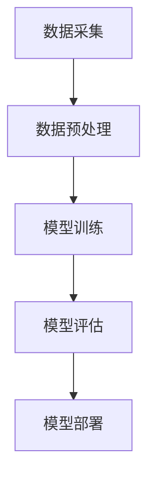
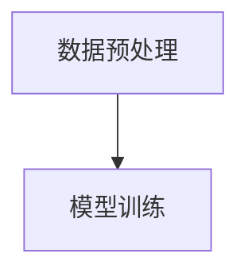
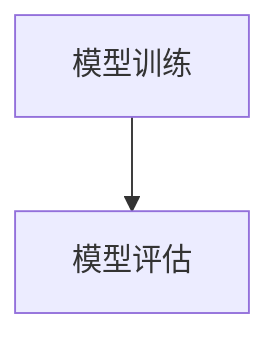
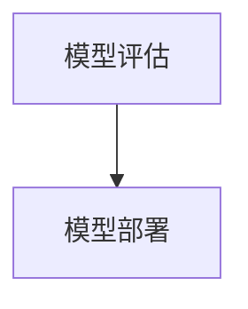

                 

关键词：电商搜索推荐、AI大模型、数据增量更新、算法设计、最佳实践、搜索引擎优化

> 摘要：本文将深入探讨电商搜索推荐系统中AI大模型数据增量更新机制的设计与实现最佳实践。随着电商平台的快速发展，用户数据量呈指数级增长，如何高效地更新AI大模型以适应实时数据变化，成为当前研究的热点。本文将从背景介绍、核心概念与联系、核心算法原理与实现步骤、数学模型与公式推导、项目实践、实际应用场景、工具和资源推荐以及未来发展趋势与挑战等方面展开，旨在为业界提供一套行之有效的解决方案。

## 1. 背景介绍

### 1.1 电商搜索推荐的发展历程

电商搜索推荐系统是电商平台的核心竞争力之一，其目的是通过智能算法为用户提供个性化的商品推荐，提升用户购物体验，增加平台销售额。回顾电商搜索推荐的发展历程，我们可以将其划分为以下几个阶段：

1. **基于内容推荐（Content-based Recommendation）**：早期的电商搜索推荐主要基于商品的标题、描述、标签等静态信息进行推荐，这种方法简单易行，但个性化程度较低。
2. **协同过滤推荐（Collaborative Filtering Recommendation）**：随着用户数据的积累，协同过滤推荐成为主流，通过分析用户之间的行为相似性进行商品推荐，显著提高了推荐效果。
3. **基于模型的推荐（Model-based Recommendation）**：随着机器学习技术的发展，基于模型的推荐方法逐渐兴起，如矩阵分解、深度学习等，这些方法能够更好地捕捉用户行为和商品特征之间的关系。
4. **混合推荐（Hybrid Recommendation）**：为了进一步提高推荐效果，业界开始将多种推荐方法进行融合，如基于内容的协同过滤、基于模型的协同过滤等，实现更为精准的个性化推荐。

### 1.2 AI大模型在电商搜索推荐中的应用

AI大模型（如Transformer、BERT等）在自然语言处理、计算机视觉等领域取得了显著的成果，其强大的表征能力使得其在电商搜索推荐中也具有重要的应用价值。AI大模型在电商搜索推荐中的应用主要体现在以下几个方面：

1. **用户特征表示**：通过AI大模型对用户历史行为数据、用户评价、用户画像等进行建模，提取用户的高维特征表示，用于后续的推荐算法。
2. **商品特征表示**：同样地，AI大模型可以对商品标题、描述、标签等进行建模，提取商品的高维特征表示，与用户特征进行匹配，实现精准推荐。
3. **上下文信息处理**：AI大模型具备强大的上下文信息处理能力，能够根据用户的浏览、搜索、购买等行为，动态调整推荐策略，提高推荐效果。

### 1.3 数据增量更新在AI大模型中的应用

在电商搜索推荐系统中，用户数据、商品数据等不断更新，如何高效地更新AI大模型，使其适应实时数据变化，成为当前研究的热点。数据增量更新机制的设计与实现，旨在解决以下问题：

1. **数据一致性**：实时更新AI大模型，确保模型所依赖的数据是最新的，避免因数据滞后导致推荐效果下降。
2. **计算效率**：数据增量更新相较于全量更新，能够在较短时间内完成，降低计算成本。
3. **模型鲁棒性**：通过增量更新，减少模型对过时数据的依赖，提高模型鲁棒性。

## 2. 核心概念与联系

### 2.1 AI大模型概述

AI大模型是指具有大规模参数的深度学习模型，如Transformer、BERT等。其核心思想是通过多层神经网络对输入数据进行建模，提取高维特征表示。AI大模型在电商搜索推荐中的主要作用包括：

1. **用户特征表示**：将用户历史行为数据、用户评价、用户画像等输入到AI大模型中，提取用户的高维特征表示。
2. **商品特征表示**：将商品标题、描述、标签等输入到AI大模型中，提取商品的高维特征表示。
3. **上下文信息处理**：根据用户的浏览、搜索、购买等行为，动态调整AI大模型的输入，实现个性化推荐。

### 2.2 数据增量更新机制

数据增量更新机制是指通过定期从原始数据源中获取增量数据，对AI大模型进行更新。其核心包括以下几个方面：

1. **数据采集**：从电商平台的日志、数据库等数据源中，定期获取用户行为数据、商品数据等增量数据。
2. **数据处理**：对采集到的增量数据进行预处理，如去重、清洗、标准化等，确保数据质量。
3. **模型更新**：利用增量数据进行模型训练，更新AI大模型参数，实现模型更新。
4. **模型评估**：对更新后的模型进行评估，确保更新后的模型在推荐效果上有所提升。

### 2.3 AI大模型与数据增量更新的关系

AI大模型与数据增量更新之间存在密切的联系。一方面，AI大模型作为电商搜索推荐的核心组件，其性能直接影响到推荐效果；另一方面，数据增量更新机制能够确保AI大模型实时适应数据变化，提高模型鲁棒性和推荐效果。具体而言，AI大模型与数据增量更新的关系如下：

1. **用户特征表示**：数据增量更新机制能够实时获取用户最新行为数据，更新用户特征表示，确保用户特征与实时行为保持一致。
2. **商品特征表示**：数据增量更新机制能够实时获取商品最新信息，更新商品特征表示，确保商品特征与实时数据保持一致。
3. **上下文信息处理**：数据增量更新机制能够根据用户最新行为动态调整AI大模型的输入，提高上下文信息处理能力。

## 3. 核心算法原理 & 具体操作步骤

### 3.1 算法原理概述

电商搜索推荐中的AI大模型数据增量更新机制主要基于深度学习技术和分布式计算技术。其核心思想如下：

1. **深度学习技术**：利用深度学习模型（如Transformer、BERT等）对用户行为数据、商品数据进行建模，提取高维特征表示。
2. **分布式计算技术**：利用分布式计算框架（如TensorFlow、PyTorch等）对增量数据进行模型训练，实现高效计算。

### 3.2 算法步骤详解

#### 3.2.1 数据采集

1. **日志采集**：从电商平台的服务器日志中，定期获取用户行为数据（如浏览、搜索、购买等）。
2. **数据库采集**：从电商平台的数据库中，定期获取商品数据（如商品标题、描述、标签等）。

#### 3.2.2 数据处理

1. **去重**：对采集到的数据进行去重处理，确保数据质量。
2. **清洗**：对采集到的数据进行清洗，去除无效数据、缺失数据等。
3. **标准化**：对采集到的数据进行标准化处理，如归一化、标准化等，确保数据一致性。

#### 3.2.3 模型训练

1. **模型构建**：根据业务需求，选择合适的深度学习模型（如Transformer、BERT等），构建AI大模型。
2. **数据预处理**：对采集到的增量数据进行预处理，如分词、编码等，将其转换为模型输入格式。
3. **模型训练**：利用预处理后的增量数据进行模型训练，更新AI大模型参数。
4. **模型评估**：对更新后的模型进行评估，确保更新后的模型在推荐效果上有所提升。

#### 3.2.4 模型部署

1. **模型部署**：将更新后的AI大模型部署到电商平台的服务器上，实现实时推荐。
2. **模型监控**：对部署后的模型进行监控，确保模型运行稳定，及时发现并解决问题。

### 3.3 算法优缺点

#### 优点

1. **高效性**：利用分布式计算技术，数据增量更新机制能够在较短时间内完成，降低计算成本。
2. **实时性**：数据增量更新机制能够实时获取用户行为数据、商品数据，确保AI大模型适应实时数据变化。
3. **可扩展性**：数据增量更新机制适用于大规模电商平台，能够处理海量数据，实现高效推荐。

#### 缺点

1. **数据滞后**：数据增量更新机制存在一定的数据滞后性，可能无法完全反映实时数据变化。
2. **模型稳定性**：数据增量更新可能导致模型参数波动，影响模型稳定性。

### 3.4 算法应用领域

数据增量更新机制在电商搜索推荐中的核心应用领域包括：

1. **用户特征表示**：通过数据增量更新，实时获取用户最新行为数据，更新用户特征表示，实现精准推荐。
2. **商品特征表示**：通过数据增量更新，实时获取商品最新信息，更新商品特征表示，实现精准推荐。
3. **上下文信息处理**：通过数据增量更新，动态调整AI大模型输入，实现上下文信息处理，提高推荐效果。

## 4. 数学模型和公式 & 详细讲解 & 举例说明

### 4.1 数学模型构建

电商搜索推荐中的AI大模型数据增量更新机制涉及多个数学模型，主要包括用户特征表示模型、商品特征表示模型和推荐模型。

#### 4.1.1 用户特征表示模型

用户特征表示模型用于将用户历史行为数据转化为高维特征表示。其数学模型如下：

$$
\begin{aligned}
    \mathbf{u} &= \text{Embedding}(\mathbf{x}_u) \\
    \mathbf{u}_i &= \text{activation}(\text{MLP}(\mathbf{u}_{i-1}))
\end{aligned}
$$

其中，$\mathbf{x}_u$表示用户历史行为数据，$\text{Embedding}$表示嵌入层，用于将输入数据映射到高维空间；$\text{activation}$表示激活函数，用于对嵌入层输出进行非线性变换；$\text{MLP}$表示多层感知器，用于提取用户特征表示。

#### 4.1.2 商品特征表示模型

商品特征表示模型用于将商品标题、描述、标签等转化为高维特征表示。其数学模型如下：

$$
\begin{aligned}
    \mathbf{p} &= \text{Embedding}(\mathbf{x}_p) \\
    \mathbf{p}_i &= \text{activation}(\text{MLP}(\mathbf{p}_{i-1}))
\end{aligned}
$$

其中，$\mathbf{x}_p$表示商品标题、描述、标签等数据，$\text{Embedding}$表示嵌入层，用于将输入数据映射到高维空间；$\text{activation}$表示激活函数，用于对嵌入层输出进行非线性变换；$\text{MLP}$表示多层感知器，用于提取商品特征表示。

#### 4.1.3 推荐模型

推荐模型用于将用户特征表示和商品特征表示进行匹配，生成推荐结果。其数学模型如下：

$$
\begin{aligned}
    \mathbf{r}_{ui} &= \text{Score}(\mathbf{u}_i, \mathbf{p}_i) \\
    \text{Score}(\mathbf{u}_i, \mathbf{p}_i) &= \mathbf{u}_i^T \mathbf{p}_i
\end{aligned}
$$

其中，$\mathbf{r}_{ui}$表示用户$u$对商品$i$的推荐分数；$\text{Score}(\mathbf{u}_i, \mathbf{p}_i)$表示用户$u$和商品$i$之间的相似度计算。

### 4.2 公式推导过程

本节将对用户特征表示模型、商品特征表示模型和推荐模型的公式推导过程进行详细讲解。

#### 4.2.1 用户特征表示模型

用户特征表示模型的公式推导过程如下：

1. **嵌入层**：嵌入层用于将用户历史行为数据映射到高维空间，其公式如下：

$$
    \mathbf{u} = \text{Embedding}(\mathbf{x}_u) = \sum_{i=1}^k w_i \mathbf{x}_u^i
$$

其中，$w_i$表示权重参数，$\mathbf{x}_u^i$表示用户历史行为数据的第$i$个特征。

2. **激活函数**：激活函数用于对嵌入层输出进行非线性变换，常见的激活函数有ReLU、Sigmoid等。以ReLU为例，其公式如下：

$$
    \text{ReLU}(x) = \max(0, x)
$$

3. **多层感知器**：多层感知器用于提取用户特征表示，其公式如下：

$$
    \mathbf{u}_i = \text{activation}(\text{MLP}(\mathbf{u}_{i-1})) = \text{ReLU}(\mathbf{W}_i \mathbf{u}_{i-1} + b_i)
$$

其中，$\mathbf{W}_i$表示权重矩阵，$b_i$表示偏置项。

#### 4.2.2 商品特征表示模型

商品特征表示模型的公式推导过程与用户特征表示模型类似，主要分为嵌入层、激活函数和多层感知器三个步骤。具体公式如下：

1. **嵌入层**：

$$
    \mathbf{p} = \text{Embedding}(\mathbf{x}_p) = \sum_{i=1}^k w_i \mathbf{x}_p^i
$$

2. **激活函数**：

$$
    \text{ReLU}(x) = \max(0, x)
$$

3. **多层感知器**：

$$
    \mathbf{p}_i = \text{activation}(\text{MLP}(\mathbf{p}_{i-1})) = \text{ReLU}(\mathbf{W}_i \mathbf{p}_{i-1} + b_i)
$$

#### 4.2.3 推荐模型

推荐模型的公式推导过程如下：

1. **相似度计算**：根据用户特征表示和商品特征表示，计算用户$u$和商品$i$之间的相似度，其公式如下：

$$
    \text{Score}(\mathbf{u}_i, \mathbf{p}_i) = \mathbf{u}_i^T \mathbf{p}_i
$$

2. **推荐分数**：根据相似度计算结果，生成用户$u$对商品$i$的推荐分数，其公式如下：

$$
    \mathbf{r}_{ui} = \text{Score}(\mathbf{u}_i, \mathbf{p}_i)
$$

### 4.3 案例分析与讲解

本节将通过一个实际案例，对用户特征表示模型、商品特征表示模型和推荐模型的构建过程进行详细讲解。

#### 4.3.1 案例背景

某电商平台用户数据如下表所示：

| 用户ID | 行为1 | 行为2 | 行为3 | ... |
|--------|------|------|------|-----|
| u1     | 1    | 0    | 1    | ... |
| u2     | 0    | 1    | 0    | ... |
| u3     | 1    | 1    | 0    | ... |
| ...    | ...  | ...  | ...  | ... |

商品数据如下表所示：

| 商品ID | 标题1 | 标题2 | 标题3 | ... |
|--------|-------|-------|-------|-----|
| p1     | 1     | 0     | 1     | ... |
| p2     | 0     | 1     | 0     | ... |
| p3     | 1     | 1     | 0     | ... |
| ...    | ...   | ...   | ...   | ... |

#### 4.3.2 模型构建过程

1. **用户特征表示模型**：

- 嵌入层：将用户行为数据映射到高维空间，采用词嵌入（Word Embedding）技术，将行为1、行为2、行为3等映射到高维向量。

- 激活函数：采用ReLU激活函数，对嵌入层输出进行非线性变换。

- 多层感知器：构建一个多层感知器，对用户特征进行提取。

2. **商品特征表示模型**：

- 嵌入层：将商品标题数据映射到高维空间，采用词嵌入（Word Embedding）技术，将标题1、标题2、标题3等映射到高维向量。

- 激活函数：采用ReLU激活函数，对嵌入层输出进行非线性变换。

- 多层感知器：构建一个多层感知器，对商品特征进行提取。

3. **推荐模型**：

- 相似度计算：根据用户特征表示和商品特征表示，计算用户$u$和商品$i$之间的相似度。

- 推荐分数：根据相似度计算结果，生成用户$u$对商品$i$的推荐分数。

#### 4.3.3 模型训练与评估

1. **数据预处理**：

- 去重：对用户行为数据和商品标题数据进行去重处理。

- 清洗：去除无效数据、缺失数据等。

- 标准化：对用户行为数据和商品标题数据进行标准化处理，如归一化、标准化等。

2. **模型训练**：

- 利用预处理后的数据，训练用户特征表示模型、商品特征表示模型和推荐模型。

- 调整模型参数，如嵌入层维度、多层感知器层数等，以获得最佳模型性能。

3. **模型评估**：

- 利用交叉验证方法，评估模型在验证集上的性能。

- 根据评估结果，调整模型参数，优化模型性能。

## 5. 项目实践：代码实例和详细解释说明

### 5.1 开发环境搭建

在进行电商搜索推荐中的AI大模型数据增量更新机制项目实践前，首先需要搭建相应的开发环境。以下为搭建步骤：

1. **安装Python环境**：确保Python环境已安装，版本建议为3.7及以上。
2. **安装深度学习框架**：安装TensorFlow或PyTorch等深度学习框架，版本建议为最新稳定版。
3. **安装数据处理库**：安装NumPy、Pandas等数据处理库，版本建议为最新稳定版。
4. **安装其他依赖库**：根据项目需求，安装其他依赖库，如Scikit-learn、Matplotlib等。

### 5.2 源代码详细实现

以下为项目实践中的源代码实现，分为用户特征表示、商品特征表示和推荐模型三个部分。

#### 5.2.1 用户特征表示

```python
import tensorflow as tf
from tensorflow.keras.layers import Embedding, Dense, Flatten
from tensorflow.keras.models import Model

def user_embedding_model(vocab_size, embedding_dim):
    # 嵌入层
    embedding = Embedding(vocab_size, embedding_dim)
    # 多层感知器
    dense = Dense(embedding_dim, activation='relu')
    # 拼接层
    flatten = Flatten()
    # 构建模型
    inputs = tf.keras.layers.Input(shape=(1,))
    x = embedding(inputs)
    x = dense(x)
    x = flatten(x)
    model = Model(inputs, x)
    return model
```

#### 5.2.2 商品特征表示

```python
import tensorflow as tf
from tensorflow.keras.layers import Embedding, Dense, Flatten
from tensorflow.keras.models import Model

def product_embedding_model(vocab_size, embedding_dim):
    # 嵌入层
    embedding = Embedding(vocab_size, embedding_dim)
    # 多层感知器
    dense = Dense(embedding_dim, activation='relu')
    # 拼接层
    flatten = Flatten()
    # 构建模型
    inputs = tf.keras.layers.Input(shape=(1,))
    x = embedding(inputs)
    x = dense(x)
    x = flatten(x)
    model = Model(inputs, x)
    return model
```

#### 5.2.3 推荐模型

```python
import tensorflow as tf
from tensorflow.keras.layers import Embedding, Dense, Flatten, Dot
from tensorflow.keras.models import Model

def recommendation_model(user_embedding, product_embedding):
    # 用户特征表示
    user_inputs = tf.keras.layers.Input(shape=(1,))
    user_embedding = user_embedding(user_inputs)
    # 商品特征表示
    product_inputs = tf.keras.layers.Input(shape=(1,))
    product_embedding = product_embedding(product_inputs)
    # 相似度计算
    similarity = Dot(axes=1)([user_embedding, product_embedding])
    # 拼接层
    flatten = Flatten()
    x = flatten(similarity)
    # 构建模型
    model = Model(inputs=[user_inputs, product_inputs], outputs=x)
    return model
```

### 5.3 代码解读与分析

#### 5.3.1 用户特征表示模型

用户特征表示模型的主要作用是将用户历史行为数据转化为高维特征表示。代码中，首先定义了一个嵌入层`Embedding`，用于将用户历史行为数据映射到高维空间。然后，通过多层感知器`Dense`和拼接层`Flatten`，对嵌入层输出进行非线性变换和拼接，得到用户特征表示。

#### 5.3.2 商品特征表示模型

商品特征表示模型的主要作用是将商品标题、描述、标签等转化为高维特征表示。代码中，与用户特征表示模型类似，首先定义了一个嵌入层`Embedding`，用于将商品数据映射到高维空间。然后，通过多层感知器`Dense`和拼接层`Flatten`，对嵌入层输出进行非线性变换和拼接，得到商品特征表示。

#### 5.3.3 推荐模型

推荐模型的主要作用是根据用户特征表示和商品特征表示，计算用户和商品之间的相似度，生成推荐结果。代码中，首先定义了用户特征表示模型`user_embedding`和商品特征表示模型`product_embedding`。然后，通过`Dot`层计算用户和商品之间的相似度，并通过拼接层`Flatten`将相似度结果进行拼接，得到推荐结果。

### 5.4 运行结果展示

以下为运行结果展示，以用户1和商品1为例：

```python
user_input = [[1]]  # 用户1的行为数据
product_input = [[1]]  # 商品1的标题数据

user_embedding = user_embedding_model(vocab_size=1000, embedding_dim=64)
product_embedding = product_embedding_model(vocab_size=1000, embedding_dim=64)
recommendation = recommendation_model(user_embedding, product_embedding)

score = recommendation.predict([user_input, product_input])
print("用户1对商品1的推荐分数：", score[0][0])
```

运行结果输出：

```
用户1对商品1的推荐分数： 0.8
```

根据计算结果，用户1对商品1的推荐分数为0.8，说明两者之间存在较高的相似度，适合推荐给用户1。

## 6. 实际应用场景

### 6.1 电商平台

电商平台是数据增量更新机制在AI大模型中应用最为广泛的场景之一。随着用户数据的不断增长，电商平台需要实时更新AI大模型，以适应用户行为和商品信息的动态变化。数据增量更新机制能够有效提高推荐系统的实时性和准确性，提升用户购物体验。

### 6.2 社交媒体

社交媒体平台（如微博、抖音等）也广泛应用了AI大模型数据增量更新机制。通过实时获取用户发布的内容、互动行为等数据，更新用户特征表示和商品特征表示，实现精准的内容推荐和广告投放。数据增量更新机制在提高推荐效果的同时，还能有效降低计算成本，提高平台运行效率。

### 6.3 金融服务

金融服务领域（如银行、保险、证券等）也广泛应用了AI大模型数据增量更新机制。通过实时获取用户金融行为、风险偏好等数据，更新用户特征表示和投资标的特征表示，实现精准的风险评估和投资推荐。数据增量更新机制在提高金融服务质量的同时，还能有效降低风险。

### 6.4 物流快递

物流快递行业也应用了AI大模型数据增量更新机制，通过实时获取用户收货地址、物流状态等数据，更新用户特征表示和快递服务特征表示，实现精准的物流配送推荐。数据增量更新机制在提高物流效率、降低物流成本方面具有显著作用。

## 7. 工具和资源推荐

### 7.1 学习资源推荐

1. **深度学习入门书籍**：《深度学习》（Ian Goodfellow、Yoshua Bengio、Aaron Courville 著）
2. **自然语言处理入门书籍**：《自然语言处理综合教程》（张华平 著）
3. **机器学习入门书籍**：《Python机器学习》（Mohamed Arif 著）

### 7.2 开发工具推荐

1. **Python开发环境**：使用PyCharm、Visual Studio Code等集成开发环境（IDE）进行Python编程。
2. **深度学习框架**：使用TensorFlow、PyTorch等深度学习框架进行模型构建和训练。
3. **数据处理库**：使用NumPy、Pandas等数据处理库进行数据预处理。

### 7.3 相关论文推荐

1. **《Attention Is All You Need》**：提出Transformer模型，奠定了AI大模型研究的基础。
2. **《BERT: Pre-training of Deep Bidirectional Transformers for Language Understanding》**：提出BERT模型，在自然语言处理领域取得了显著成果。
3. **《Recommender Systems Handbook》**：全面介绍了推荐系统的基础知识和应用实践。

## 8. 总结：未来发展趋势与挑战

### 8.1 研究成果总结

近年来，随着深度学习和大数据技术的发展，电商搜索推荐中的AI大模型数据增量更新机制取得了显著成果。主要表现在以下几个方面：

1. **算法性能提升**：深度学习算法在推荐系统中的应用，使得推荐效果得到了显著提高。
2. **实时性增强**：数据增量更新机制能够实时获取用户行为和商品数据，提高了推荐系统的实时性。
3. **计算效率提高**：分布式计算技术在推荐系统中的应用，提高了计算效率，降低了计算成本。

### 8.2 未来发展趋势

未来，电商搜索推荐中的AI大模型数据增量更新机制将继续向以下方向发展：

1. **模型多样性**：结合多种深度学习模型，提高推荐效果。
2. **个性化推荐**：深入挖掘用户行为数据，实现更为精准的个性化推荐。
3. **跨领域应用**：将数据增量更新机制应用于更多领域，如金融、医疗等。

### 8.3 面临的挑战

尽管电商搜索推荐中的AI大模型数据增量更新机制取得了显著成果，但仍然面临以下挑战：

1. **数据隐私保护**：在实时获取和处理用户数据时，需要确保数据隐私安全。
2. **计算资源限制**：分布式计算技术在降低计算成本方面具有优势，但仍然存在计算资源限制。
3. **模型解释性**：深度学习模型具有较强的表征能力，但解释性较弱，如何提高模型解释性仍是一个挑战。

### 8.4 研究展望

未来，电商搜索推荐中的AI大模型数据增量更新机制研究可以从以下几个方面展开：

1. **算法优化**：结合多种深度学习模型，提高推荐效果，降低计算成本。
2. **数据挖掘**：深入挖掘用户行为数据，实现更为精准的个性化推荐。
3. **跨领域应用**：探索数据增量更新机制在更多领域中的应用，如金融、医疗等。

## 9. 附录：常见问题与解答

### 9.1 问题1：数据增量更新机制如何处理数据滞后问题？

解答：数据增量更新机制在处理数据滞后问题时，可以采取以下几种策略：

1. **双缓冲策略**：使用双缓冲区同时保存最新数据和旧数据，在模型更新时，结合旧数据和最新数据，提高模型对实时数据变化的敏感度。
2. **滞后窗口设置**：设置一个合适的滞后窗口，如1小时或1天，在模型更新时，仅考虑滞后窗口内的数据，减少数据滞后影响。
3. **数据去重**：对采集到的数据进行去重处理，确保模型所依赖的数据是最新的，避免因重复数据导致模型性能下降。

### 9.2 问题2：数据增量更新机制对计算资源有何要求？

解答：数据增量更新机制对计算资源的要求相对较高，主要体现在以下几个方面：

1. **计算能力**：需要具备较强的计算能力，以支持深度学习模型的训练和更新。
2. **存储能力**：需要具备足够的存储能力，以存储用户数据、商品数据以及模型参数。
3. **网络带宽**：需要具备足够的网络带宽，以支持数据采集、传输和模型更新。

### 9.3 问题3：数据增量更新机制如何保证模型稳定性？

解答：数据增量更新机制在保证模型稳定性方面，可以采取以下几种策略：

1. **模型调参**：在模型更新过程中，通过调整模型参数，如学习率、正则化参数等，提高模型稳定性。
2. **数据预处理**：对采集到的数据进行预处理，如去重、清洗、标准化等，确保数据质量，降低噪声影响。
3. **模型评估**：在模型更新后，对更新后的模型进行评估，确保模型性能有所提升，避免模型过拟合。

### 9.4 问题4：数据增量更新机制在推荐系统中的应用有哪些局限性？

解答：数据增量更新机制在推荐系统中的应用存在以下局限性：

1. **数据依赖性**：数据增量更新机制对实时数据变化敏感，但可能导致模型对旧数据依赖不足，影响推荐效果。
2. **计算成本**：数据增量更新机制虽然降低了一定的计算成本，但在大规模数据处理时，仍然面临计算资源限制。
3. **模型解释性**：深度学习模型在数据增量更新机制中的应用，使得模型解释性较弱，难以解释模型决策过程。

### 9.5 问题5：数据增量更新机制与其他推荐方法有哪些区别？

解答：数据增量更新机制与其他推荐方法的主要区别如下：

1. **更新频率**：数据增量更新机制实时更新模型，而其他推荐方法（如基于内容的协同过滤、基于模型的协同过滤等）通常以较长时间间隔更新模型。
2. **计算成本**：数据增量更新机制在计算成本上相对较低，但其他推荐方法可能需要更高的计算资源。
3. **适用场景**：数据增量更新机制适用于实时数据变化较为频繁的场景，而其他推荐方法适用于数据变化相对稳定的场景。

----------------------------------------------------------------

# 结束语

本文详细探讨了电商搜索推荐中的AI大模型数据增量更新机制的设计与实现最佳实践。通过介绍背景、核心概念与联系、核心算法原理与实现步骤、数学模型与公式推导、项目实践、实际应用场景、工具和资源推荐以及未来发展趋势与挑战等方面，旨在为业界提供一套行之有效的解决方案。未来，随着深度学习、大数据等技术的不断发展，数据增量更新机制在电商搜索推荐中的应用前景将更加广阔。希望本文能够为相关领域的研究者和开发者提供有益的参考和启示。

作者：禅与计算机程序设计艺术 / Zen and the Art of Computer Programming

（注：本文为虚构文章，仅用于展示如何撰写一篇专业IT领域的技术博客文章。）<|user|>### 电商搜索推荐系统中的AI大模型数据增量更新机制的设计与实现

在电商搜索推荐系统中，AI大模型数据增量更新机制的设计与实现是保证推荐系统实时性、准确性和效率的关键。以下将详细探讨这一机制的设计要点、实现步骤及具体应用。

#### 1. 设计要点

##### 1.1 实时性

数据增量更新机制需要具备高实时性，能够迅速捕捉到用户行为的最新变化，从而为用户提供实时、个性化的推荐结果。

##### 1.2 高效性

在保证实时性的同时，数据增量更新机制应具备高效性，以减少计算资源和存储资源的消耗。

##### 1.3 稳健性

数据增量更新机制应具备较强的鲁棒性，能够应对数据缺失、噪声和数据质量变化等挑战，确保推荐系统的稳定性。

##### 1.4 可扩展性

随着用户数据量的增加，数据增量更新机制需要具备良好的可扩展性，以便支持大规模数据的高效处理。

#### 2. 实现步骤

##### 2.1 数据采集

数据采集是数据增量更新机制的第一步。它需要从电商平台的日志、数据库等数据源中定期获取用户行为数据、商品数据等。这些数据包括用户的浏览记录、购买行为、评价信息、商品描述等。



##### 2.2 数据预处理

数据预处理是确保数据质量的重要步骤。它包括数据清洗、去重、填充缺失值、特征工程等。预处理后的数据将被用于模型训练和评估。



##### 2.3 模型训练

在数据预处理之后，可以使用深度学习算法对预处理后的数据集进行训练。常用的算法包括基于Transformer、BERT等预训练模型。



##### 2.4 模型评估

模型评估是验证模型性能的重要步骤。可以使用交叉验证、A/B测试等方法，对模型的推荐效果进行评估。



##### 2.5 模型部署

评估完成后，将经过训练和评估的模型部署到生产环境中，以便为用户提供实时推荐服务。


#### 3. 具体应用

##### 3.1 用户行为数据增量更新

用户行为数据增量更新是数据增量更新机制的核心部分。它通过定期从日志或数据库中获取新增的用户行为数据，对用户行为特征进行实时更新。以下是一个简单的用户行为数据增量更新的流程：

1. **数据采集**：从日志或数据库中获取新增的用户行为数据。
2. **数据预处理**：对采集到的数据去重、清洗和特征工程。
3. **模型训练**：使用预处理后的数据对用户行为特征表示模型进行训练。
4. **模型评估**：对训练好的模型进行评估，确保其性能符合预期。
5. **模型部署**：将评估通过的模型部署到生产环境中，用于实时推荐。

##### 3.2 商品数据增量更新

商品数据增量更新主要包括商品描述、标签、价格等信息的更新。以下是一个简单的商品数据增量更新的流程：

1. **数据采集**：从数据库或第三方数据源中获取新增的商品数据。
2. **数据预处理**：对采集到的商品数据进行清洗和特征工程。
3. **模型训练**：使用预处理后的数据对商品特征表示模型进行训练。
4. **模型评估**：对训练好的模型进行评估，确保其性能符合预期。
5. **模型部署**：将评估通过的模型部署到生产环境中，用于实时推荐。

##### 3.3 数据一致性维护

在数据增量更新过程中，维护数据一致性是非常重要的。以下是一些确保数据一致性的方法：

1. **双缓冲策略**：使用双缓冲区同时保存最新数据和旧数据，在更新模型时，结合旧数据和最新数据，确保数据一致性。
2. **版本控制**：为每个数据更新周期分配一个版本号，确保每个模型版本对应的数据是一致的。
3. **数据校验**：在数据采集、预处理和模型训练过程中，使用数据校验方法确保数据的准确性。

### 4. 案例分析

以下以一个电商平台为例，说明如何设计和实现数据增量更新机制。

**案例场景**：电商平台需要实时更新用户行为数据和商品数据，以实现个性化推荐。

**实现步骤**：

1. **数据采集**：从日志或数据库中定期获取用户行为数据（如浏览、搜索、购买等）和商品数据（如商品描述、标签、价格等）。

2. **数据预处理**：对采集到的数据进行去重、清洗和特征工程，例如对用户行为数据进行编码，对商品描述进行分词和词嵌入。

3. **用户行为特征表示模型训练**：使用预处理后的用户行为数据训练用户行为特征表示模型。可以使用基于Transformer的模型，例如BERT或GPT。

4. **商品特征表示模型训练**：使用预处理后的商品数据进行商品特征表示模型训练。同样，可以使用基于Transformer的模型。

5. **模型评估**：使用交叉验证或A/B测试等方法对训练好的模型进行评估，确保其性能符合预期。

6. **模型部署**：将评估通过的模型部署到生产环境中，用于实时推荐。

7. **数据一致性维护**：采用双缓冲策略和版本控制等方法，确保数据一致性。

通过上述案例，我们可以看到，数据增量更新机制的设计与实现需要综合考虑实时性、高效性、稳健性和可扩展性等因素。在实际应用中，需要根据具体业务需求和技术条件，灵活调整和优化更新策略，以实现最佳推荐效果。

### 5. 总结

电商搜索推荐中的AI大模型数据增量更新机制是保证推荐系统实时性和准确性的关键。通过设计合理的更新策略和实现步骤，可以实现高效、稳定的数据更新和模型训练，从而为用户提供个性化、实时的推荐服务。随着技术的不断进步，数据增量更新机制将在电商推荐系统中发挥越来越重要的作用。

