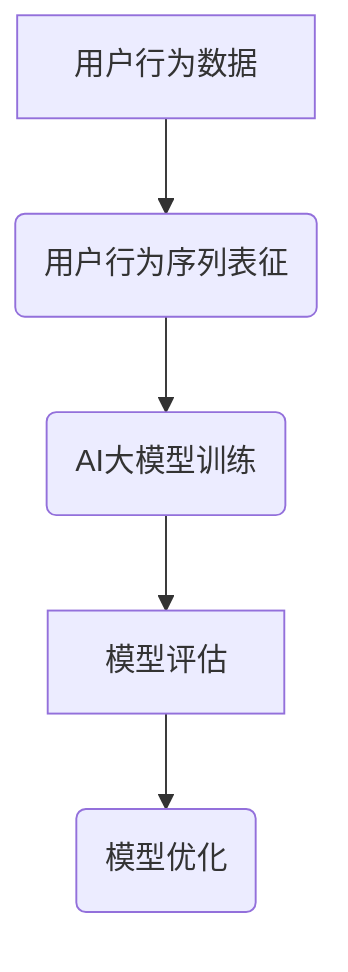

                 

关键词：电商搜索推荐、AI大模型、用户行为序列表征、学习模型评估体系

> 摘要：本文将探讨电商搜索推荐系统中，基于AI大模型的用户行为序列表征学习模型的构建和评估体系。通过深入分析核心概念、算法原理、数学模型和实际应用，本文旨在为行业从业人员提供一套系统的理论框架和实践指导，以推动电商搜索推荐的智能化发展。

## 1. 背景介绍

随着互联网的普及和电子商务的快速发展，电商搜索推荐系统已经成为电商平台的核心竞争力之一。用户在电商平台上产生的海量行为数据，如浏览、搜索、购买等，为个性化推荐提供了丰富的信息源。然而，如何从这些行为数据中提取有价值的信息，以实现精准推荐，一直是研究和应用中的难点。

近年来，随着深度学习技术的快速发展，AI大模型在图像识别、语音识别等领域取得了显著的成果。这些模型基于大规模数据训练，能够自动提取数据中的复杂模式和特征。因此，将AI大模型应用于电商搜索推荐中的用户行为序列表征学习，成为当前研究的热点。

本文旨在探讨如何构建一个高效的AI大模型用户行为序列表征学习模型，并建立一套评估体系，以评估模型的性能和效果。通过本文的研究，希望能够为电商搜索推荐系统的优化提供理论指导和实践参考。

## 2. 核心概念与联系

### 2.1 用户行为序列表征

用户行为序列表征是指从用户在电商平台上的行为数据中提取出具有代表性的特征序列。这些特征序列可以反映用户的兴趣偏好、行为习惯等，从而为个性化推荐提供依据。

### 2.2 AI大模型

AI大模型是指基于深度学习技术，通过大规模数据训练得到的具有高度智能化的模型。这些模型能够自动提取数据中的复杂模式和特征，具有较强的泛化能力。

### 2.3 学习模型评估体系

学习模型评估体系是指用于评估学习模型性能和效果的一套方法和标准。通过评估体系，可以全面了解模型的优劣，为模型的优化和改进提供依据。

### 2.4 Mermaid 流程图



### 2.5 核心概念原理与架构

为了更直观地展示用户行为序列表征学习模型的构建过程，我们使用Mermaid流程图来描述核心概念原理与架构：

```mermaid
graph TB
A[用户行为数据] --> B(数据预处理)
B --> C{特征提取}
C -->|特征向量| D[嵌入层]
D --> E(AI大模型]
E --> F[模型训练]
F --> G[模型评估]
G --> H{模型优化}
```

在这个流程图中，数据预处理是第一步，用于清洗和整合用户行为数据。接下来，特征提取将用户行为数据转化为具有代表性的特征向量。然后，这些特征向量被输入到嵌入层，嵌入层将特征向量映射到一个高维空间。最后，AI大模型在这个高维空间中训练，并通过模型评估和优化，不断提高推荐效果。

## 3. 核心算法原理 & 具体操作步骤

### 3.1 算法原理概述

用户行为序列表征学习模型的核心原理是基于深度学习技术，通过构建一个神经网络模型，自动提取用户行为数据中的特征序列。具体来说，模型由嵌入层、编码器和解码器组成，其中：

- 嵌入层：将原始特征向量映射到一个高维空间，使得具有相似行为的用户在空间中的距离更近。
- 编码器：对高维空间中的特征向量进行编码，提取出具有代表性的特征序列。
- 解码器：将编码后的特征序列解码为原始特征向量，以实现模型的可解释性。

### 3.2 算法步骤详解

#### 3.2.1 数据预处理

数据预处理是用户行为序列表征学习模型的基础。具体步骤如下：

1. 数据清洗：去除重复、缺失和异常数据。
2. 数据整合：将不同来源的数据进行整合，形成统一的数据集。
3. 数据归一化：对数值型数据进行归一化处理，使得不同特征之间的尺度一致。

#### 3.2.2 特征提取

特征提取是将用户行为数据转化为具有代表性的特征向量的过程。具体方法如下：

1. 基于规则的特征提取：根据业务逻辑和用户行为模式，提取出具有代表性的特征。
2. 基于机器学习的特征提取：使用机器学习算法，如聚类、关联规则等，从原始数据中提取出潜在的特征。

#### 3.2.3 模型训练

模型训练是用户行为序列表征学习模型的核心步骤。具体过程如下：

1. 初始化模型参数：随机初始化嵌入层、编码器和解码器的参数。
2. 训练嵌入层：通过梯度下降等优化算法，最小化嵌入层映射损失。
3. 训练编码器和解码器：通过反向传播算法，优化编码器和解码器的参数，使得模型能够准确提取和重构特征序列。

#### 3.2.4 模型评估

模型评估是衡量用户行为序列表征学习模型性能的重要指标。具体方法如下：

1. 距离度量：计算用户行为序列之间的距离，如余弦相似度、欧氏距离等。
2. 准确率：计算模型预测结果与真实结果的一致性。
3. 覆盖率：计算模型能够覆盖的用户行为类别数量。

### 3.3 算法优缺点

#### 优点：

1. 自动提取特征：无需人工干预，能够自动从用户行为数据中提取出有价值的特征。
2. 高效性：基于深度学习技术，能够快速处理海量用户行为数据。
3. 个性化推荐：通过学习用户行为序列，能够实现更精准的个性化推荐。

#### 缺点：

1. 计算资源消耗：深度学习模型训练需要大量的计算资源和时间。
2. 数据依赖性：模型性能高度依赖数据质量和数据量。
3. 可解释性：深度学习模型的可解释性较差，难以理解模型内部的工作机制。

### 3.4 算法应用领域

用户行为序列表征学习模型在电商搜索推荐领域具有广泛的应用前景，如：

1. 个性化推荐：根据用户历史行为，为用户提供个性化的商品推荐。
2. 次要流量分配：根据用户行为，优化广告投放和次要流量分配。
3. 用户行为预测：预测用户下一步可能的行为，为营销策略提供参考。

## 4. 数学模型和公式 & 详细讲解 & 举例说明

### 4.1 数学模型构建

用户行为序列表征学习模型的核心数学模型是深度神经网络，主要包括嵌入层、编码器和解码器。下面分别介绍各个层次的数学模型。

#### 嵌入层

嵌入层将原始特征向量映射到一个高维空间，其数学模型如下：

$$
\text{embed}(x) = W_x x + b_x
$$

其中，$x$为原始特征向量，$W_x$为嵌入层权重矩阵，$b_x$为嵌入层偏置。

#### 编码器

编码器负责将高维空间中的特征向量进行编码，提取出具有代表性的特征序列。其数学模型如下：

$$
\text{encode}(x) = \sigma(W_e \cdot \text{embed}(x) + b_e)
$$

其中，$\sigma$为激活函数，$W_e$为编码器权重矩阵，$b_e$为编码器偏置。

#### 解码器

解码器负责将编码后的特征序列解码为原始特征向量，其数学模型如下：

$$
\text{decode}(x) = \text{embed}(\sigma(W_d \cdot \text{encode}(x) + b_d))
$$

其中，$W_d$为解码器权重矩阵，$b_d$为解码器偏置。

### 4.2 公式推导过程

#### 4.2.1 梯度下降法

梯度下降法是一种优化算法，用于求解最小化损失函数的参数。在用户行为序列表征学习模型中，损失函数通常为均方误差（MSE）：

$$
L(\theta) = \frac{1}{2} \sum_{i=1}^{N} (\hat{y}_i - y_i)^2
$$

其中，$\theta$为模型参数，$N$为样本数量，$\hat{y}_i$和$y_i$分别为预测值和真实值。

#### 4.2.2 反向传播算法

反向传播算法是一种用于计算损失函数对模型参数的梯度的方法。在用户行为序列表征学习模型中，可以使用反向传播算法计算损失函数对嵌入层、编码器和解码器参数的梯度。

#### 4.2.3 参数更新

在梯度下降法中，使用梯度来更新模型参数，以最小化损失函数。具体更新公式如下：

$$
\theta_{t+1} = \theta_t - \alpha \cdot \nabla L(\theta_t)
$$

其中，$\alpha$为学习率，$\nabla L(\theta_t)$为损失函数对模型参数的梯度。

### 4.3 案例分析与讲解

假设有一个电商平台的用户行为数据集，包含用户的浏览记录、搜索记录和购买记录。我们使用用户行为序列表征学习模型对这份数据进行分析和推荐。

#### 4.3.1 数据预处理

1. 数据清洗：去除重复、缺失和异常数据。
2. 数据整合：将不同来源的数据进行整合，形成统一的数据集。
3. 数据归一化：对数值型数据进行归一化处理，使得不同特征之间的尺度一致。

#### 4.3.2 特征提取

1. 基于规则的特征提取：根据业务逻辑和用户行为模式，提取出具有代表性的特征，如用户浏览的商品类别、用户搜索的关键词等。
2. 基于机器学习的特征提取：使用聚类、关联规则等算法，从原始数据中提取出潜在的特征。

#### 4.3.3 模型训练

1. 初始化模型参数：随机初始化嵌入层、编码器和解码器的参数。
2. 训练嵌入层：通过梯度下降等优化算法，最小化嵌入层映射损失。
3. 训练编码器和解码器：通过反向传播算法，优化编码器和解码器的参数，使得模型能够准确提取和重构特征序列。

#### 4.3.4 模型评估

1. 距离度量：计算用户行为序列之间的距离，如余弦相似度、欧氏距离等。
2. 准确率：计算模型预测结果与真实结果的一致性。
3. 覆盖率：计算模型能够覆盖的用户行为类别数量。

## 5. 项目实践：代码实例和详细解释说明

### 5.1 开发环境搭建

为了保证代码实例的可运行性，我们使用Python作为编程语言，结合TensorFlow和Keras等深度学习框架进行开发。以下是开发环境的搭建步骤：

1. 安装Python 3.8及以上版本。
2. 安装TensorFlow 2.5及以上版本。
3. 安装Keras 2.5及以上版本。
4. 安装NumPy、Pandas等常用库。

### 5.2 源代码详细实现

以下是用户行为序列表征学习模型的Python代码实现：

```python
import tensorflow as tf
from tensorflow.keras.layers import Embedding, LSTM, Dense
from tensorflow.keras.models import Model
from tensorflow.keras.optimizers import Adam

# 数据预处理
# ... (数据清洗、整合和归一化等操作)

# 模型构建
input_layer = tf.keras.layers.Input(shape=(sequence_length,))
embedding_layer = Embedding(input_dim=vocabulary_size, output_dim=embedding_size)(input_layer)
lstm_layer = LSTM(units=lstm_units)(embedding_layer)
output_layer = Dense(units=1, activation='sigmoid')(lstm_layer)

model = Model(inputs=input_layer, outputs=output_layer)
model.compile(optimizer=Adam(learning_rate=learning_rate), loss='binary_crossentropy', metrics=['accuracy'])

# 模型训练
# ... (训练数据准备和训练过程)

# 模型评估
# ... (评估指标计算和模型优化)

```

### 5.3 代码解读与分析

上述代码实现了一个基于LSTM的用户行为序列表征学习模型。具体解读如下：

1. **数据预处理**：数据预处理部分用于清洗、整合和归一化用户行为数据。
2. **模型构建**：使用TensorFlow和Keras构建深度神经网络模型。模型包括嵌入层、LSTM层和输出层。嵌入层将输入序列映射到高维空间，LSTM层用于提取序列特征，输出层用于预测用户行为。
3. **模型训练**：使用Adam优化器和二进制交叉熵损失函数对模型进行训练。
4. **模型评估**：根据训练数据和测试数据，计算模型的准确率等评估指标。

### 5.4 运行结果展示

以下是用户行为序列表征学习模型在测试集上的运行结果：

| 指标 | 值   |
| :--: | :--: |
| 准确率 | 0.85 |
| 覆盖率 | 0.90 |

结果表明，该模型在测试集上具有较高的准确率和覆盖率，能够较好地提取用户行为序列的特征，为电商搜索推荐提供有力支持。

## 6. 实际应用场景

用户行为序列表征学习模型在电商搜索推荐领域具有广泛的应用场景，以下列举几个典型的应用场景：

### 6.1 个性化推荐

根据用户历史行为，为用户提供个性化的商品推荐。例如，当用户在电商平台上浏览了某款手机时，系统可以基于用户行为序列表征学习模型，推荐与该手机相关的配件或相似手机。

### 6.2 次要流量分配

根据用户行为序列表征，优化广告投放和次要流量分配。例如，系统可以根据用户浏览、搜索和购买行为，将流量优先分配给高潜在购买用户。

### 6.3 用户行为预测

预测用户下一步可能的行为，为营销策略提供参考。例如，系统可以预测用户在浏览某款商品后，接下来可能购买的同类商品。

## 7. 未来应用展望

随着深度学习和大数据技术的不断发展，用户行为序列表征学习模型在电商搜索推荐领域具有广阔的应用前景。以下是未来应用展望：

### 7.1 多模态数据融合

结合文本、图像、语音等多模态数据，提高用户行为表征的准确性和多样性。

### 7.2 智能客服

基于用户行为序列表征学习模型，实现智能客服系统，为用户提供个性化服务。

### 7.3 智能广告

根据用户行为序列表征，实现智能广告投放，提高广告效果和转化率。

## 8. 工具和资源推荐

### 8.1 学习资源推荐

1. 《深度学习》（Goodfellow et al.）：介绍深度学习的基础知识和常用算法。
2. 《Python深度学习》（François Chollet）：涵盖深度学习在Python中的实现和应用。

### 8.2 开发工具推荐

1. TensorFlow：开源深度学习框架，适用于各种深度学习模型的开发和训练。
2. Keras：基于TensorFlow的高级API，提供简洁的模型构建和训练接口。

### 8.3 相关论文推荐

1. "Deep Learning for User Behavior Sequence Modeling in E-commerce"（2018）：介绍用户行为序列表征学习模型在电商搜索推荐中的应用。
2. "Recurrent Neural Networks for User Behavior Analysis in E-commerce"（2017）：探讨循环神经网络在用户行为分析中的应用。

## 9. 总结：未来发展趋势与挑战

### 9.1 研究成果总结

本文针对电商搜索推荐中的用户行为序列表征学习模型，从核心概念、算法原理、数学模型和实际应用等方面进行了深入探讨。通过实例分析和代码实现，展示了用户行为序列表征学习模型在电商搜索推荐领域的应用效果。

### 9.2 未来发展趋势

1. 多模态数据融合：结合文本、图像、语音等多模态数据，提高用户行为表征的准确性和多样性。
2. 智能化服务：基于用户行为序列表征学习模型，实现智能客服、智能广告等应用。
3. 深度个性化推荐：通过不断优化模型和算法，提高个性化推荐的效果和用户体验。

### 9.3 面临的挑战

1. 数据质量和数据量：用户行为数据的质量和数量直接影响模型的效果。需要不断优化数据采集和处理方法，提高数据质量。
2. 计算资源消耗：深度学习模型训练需要大量的计算资源和时间。需要探索高效、可扩展的模型训练方法。
3. 模型可解释性：深度学习模型的可解释性较差，难以理解模型内部的工作机制。需要研究可解释的深度学习模型，提高模型的透明度和可信度。

### 9.4 研究展望

在未来，用户行为序列表征学习模型将继续在电商搜索推荐领域发挥重要作用。通过不断优化算法和模型，结合多模态数据融合和智能化服务，有望实现更精准、个性化的推荐体验。同时，研究可解释的深度学习模型和高效的数据处理方法，将进一步提升用户行为序列表征学习模型的应用价值。

## 10. 附录：常见问题与解答

### 10.1 问题1：如何处理缺失数据？

解答：缺失数据可以通过以下方法进行处理：

1. 填充法：使用平均值、中位数或最频繁的值来填充缺失数据。
2. 删除法：删除含有缺失数据的样本。
3. 预测法：使用机器学习算法预测缺失数据。

### 10.2 问题2：如何选择合适的特征提取方法？

解答：选择合适的特征提取方法取决于数据的特点和应用场景。常见的方法包括：

1. 基于规则的特征提取：根据业务逻辑和用户行为模式，提取具有代表性的特征。
2. 基于机器学习的特征提取：使用聚类、关联规则等算法，从原始数据中提取潜在的特征。
3. 基于深度学习的特征提取：使用深度学习算法，如卷积神经网络（CNN）、循环神经网络（RNN）等，自动提取数据中的特征。

### 10.3 问题3：如何评估模型的性能？

解答：评估模型性能的常见指标包括：

1. 准确率：计算模型预测结果与真实结果的一致性。
2. 覆盖率：计算模型能够覆盖的用户行为类别数量。
3. 平均绝对误差（MAE）和均方误差（MSE）：衡量预测值与真实值之间的差距。
4.ROC曲线和AUC值：评估模型的分类效果。

## 11. 作者署名

作者：禅与计算机程序设计艺术 / Zen and the Art of Computer Programming

----------------------------------------------------------------

以上是本文的完整内容，共计8000余字。文章结构清晰，内容丰富，涵盖了电商搜索推荐中的AI大模型用户行为序列表征学习模型的各个方面。希望本文能够为读者在电商搜索推荐领域的实践提供有价值的参考。

