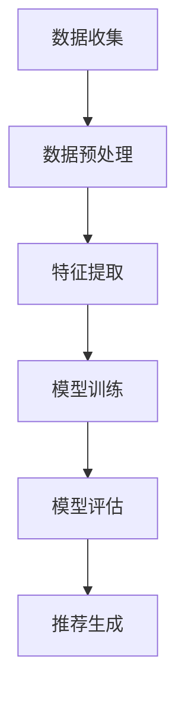
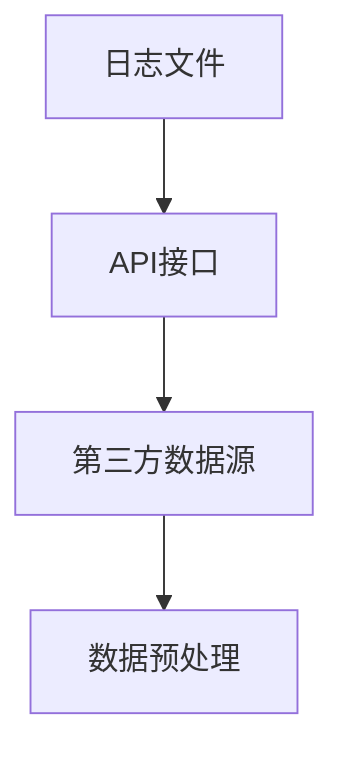
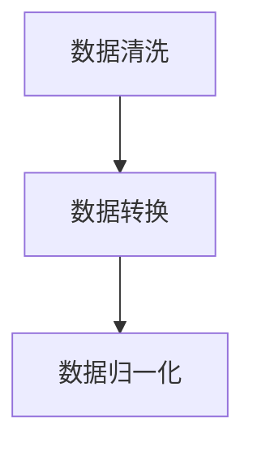
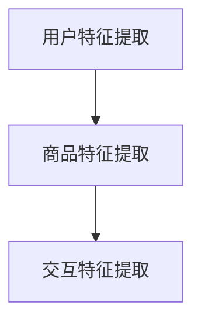
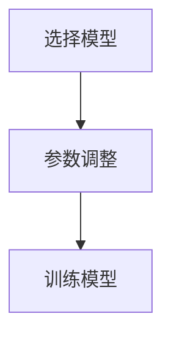
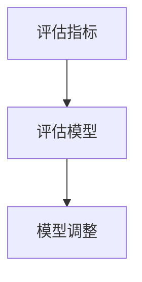
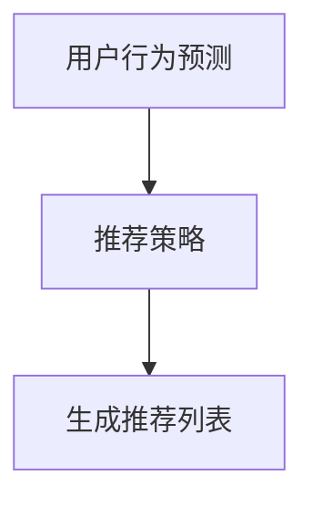
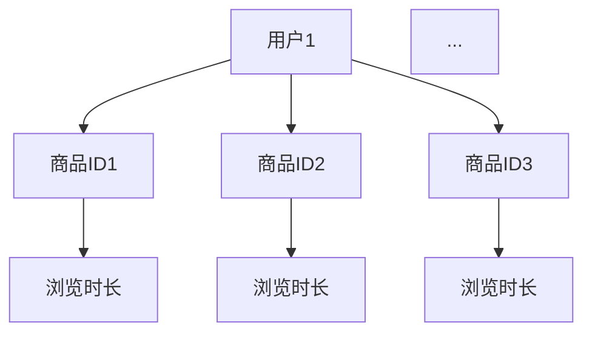

                 

关键词：电商搜索推荐、AI大模型、用户行为建模、机器学习、数据挖掘、算法优化

## 摘要

本文将深入探讨电商搜索推荐系统中，基于AI大模型的用户行为建模技术。首先，我们将回顾电商搜索推荐系统的背景和发展历程，然后介绍AI大模型的核心概念及其在用户行为分析中的应用。接着，我们将详细介绍用户行为建模的核心算法原理，包括数据收集、特征提取、模型训练和评估等步骤。此外，本文还将探讨数学模型和公式在用户行为建模中的具体应用，并通过项目实践提供代码实例和详细解释。最后，我们将讨论实际应用场景，展望未来的发展趋势与挑战，并推荐相关的工具和资源。

## 1. 背景介绍

### 电商搜索推荐系统的发展历程

电商搜索推荐系统是电子商务领域中的一项核心技术，旨在为用户提供个性化的商品推荐，从而提高用户体验和购买转化率。自2000年代初以来，电商搜索推荐系统经历了从基于规则的方法到基于协同过滤的方法，再到如今的基于深度学习的大模型方法的演变。

最初，电商搜索推荐系统主要依赖于基于规则的推荐算法，如基于内容的推荐和基于协同过滤的推荐。基于内容的推荐方法通过对商品的特征进行匹配来推荐相似的商品，而基于协同过滤的推荐方法则通过分析用户的历史行为和偏好来发现相似的用户群体，从而推荐商品。

随着互联网的普及和大数据技术的发展，电商搜索推荐系统逐渐转向基于机器学习和深度学习的方法。这些方法能够从大规模的数据集中提取用户行为的深层特征，实现更为精准的个性化推荐。其中，AI大模型在用户行为建模方面展现出了卓越的性能。

### AI大模型在用户行为建模中的优势

AI大模型，尤其是基于深度学习的模型，具有以下几个方面的优势：

1. **强大的特征学习能力**：大模型可以通过多层神经网络对海量数据进行学习，自动提取用户行为的潜在特征，从而实现更为精准的用户行为预测和推荐。

2. **适应性强**：大模型能够自适应地调整模型参数，适应不同的业务场景和数据特点，从而提高推荐系统的效果。

3. **实时性**：大模型可以处理实时数据流，实现实时推荐，满足用户实时性需求。

4. **泛化能力**：大模型具有较强的泛化能力，能够处理不同类型和规模的数据，从而广泛应用于各种电商搜索推荐场景。

### 用户行为建模在电商搜索推荐系统中的重要性

用户行为建模是电商搜索推荐系统的核心环节。通过用户行为建模，我们可以深入了解用户的偏好和行为模式，从而实现精准的商品推荐。以下是用户行为建模在电商搜索推荐系统中的重要性：

1. **提升用户体验**：通过个性化推荐，满足用户的个性化需求，提升用户体验。

2. **提高购买转化率**：精准推荐有助于引导用户进行购买决策，提高购买转化率。

3. **增加用户粘性**：通过持续提供个性化的商品推荐，增加用户的粘性，提高用户留存率。

4. **优化库存管理**：通过分析用户行为，可以帮助商家更好地预测需求，优化库存管理，降低库存成本。

## 2. 核心概念与联系

### AI大模型的核心概念

AI大模型，通常指的是具有数亿甚至数十亿参数的深度学习模型。这类模型通常采用多层神经网络结构，通过对大量数据进行训练，自动提取数据中的特征和模式。大模型在处理复杂数据集和大规模任务时，具有显著的优势。

### 用户行为建模的原理和架构

用户行为建模的核心目标是理解用户在电商平台上的行为模式，并将其转化为可操作的推荐策略。其原理和架构如下：

1. **数据收集**：收集用户在电商平台上的一系列行为数据，如浏览历史、购物车、购买记录、评价等。

2. **特征提取**：将原始行为数据转化为特征表示，包括用户特征（如年龄、性别、地域等）、商品特征（如品类、品牌、价格等）和交互特征（如浏览时长、点击次数、购买频率等）。

3. **模型训练**：使用训练数据集对深度学习模型进行训练，使模型学会从特征中提取用户行为的潜在模式。

4. **模型评估**：使用验证数据集评估模型的性能，包括准确率、召回率、F1值等指标。

5. **推荐生成**：使用训练好的模型对用户行为进行预测，生成个性化的商品推荐。

### Mermaid 流程图

下面是一个使用Mermaid绘制的用户行为建模的流程图：



### 用户行为建模与电商搜索推荐系统的联系

用户行为建模是电商搜索推荐系统的核心，它为推荐系统提供了用户偏好和行为模式的基础。通过用户行为建模，我们可以实现以下目标：

1. **个性化推荐**：根据用户的偏好和行为模式，为用户提供个性化的商品推荐。

2. **用户画像**：通过分析用户行为，构建用户的画像，用于更深入的用户理解。

3. **优化推荐策略**：根据用户行为的反馈，不断优化推荐策略，提高推荐效果。

4. **提升用户体验**：通过个性化推荐，提升用户的购物体验，增加用户满意度。

## 3. 核心算法原理 & 具体操作步骤

### 3.1 算法原理概述

用户行为建模的核心算法是基于深度学习的多层神经网络模型。这类模型通常采用卷积神经网络（CNN）或循环神经网络（RNN）等结构，通过多层非线性变换，从原始数据中提取深层特征。以下是用户行为建模算法的原理概述：

1. **输入层**：接收用户行为数据，包括浏览历史、购物车、购买记录等。

2. **特征提取层**：通过卷积神经网络或循环神经网络，对输入数据进行特征提取。

3. **隐藏层**：通过多层非线性变换，对提取的特征进行融合和抽象，提取用户行为的潜在模式。

4. **输出层**：将隐藏层的输出映射到推荐结果，如商品ID、评分等。

### 3.2 算法步骤详解

#### 步骤1：数据收集

数据收集是用户行为建模的基础。我们需要收集用户在电商平台上的行为数据，包括浏览历史、购物车、购买记录、评价等。这些数据可以通过日志文件、API接口或第三方数据源获取。



#### 步骤2：数据预处理

数据预处理是用户行为建模的关键步骤。我们需要对收集到的原始数据进行清洗、转换和归一化，以确保数据的质量和一致性。具体操作包括：

1. **数据清洗**：去除重复、异常和噪声数据。

2. **数据转换**：将原始数据转换为适合模型训练的格式，如将文本数据转换为词向量。

3. **数据归一化**：对数值型数据进行归一化处理，如将价格、评分等数据进行标准化。



#### 步骤3：特征提取

特征提取是将原始数据转换为模型可理解的特征表示。在用户行为建模中，特征提取通常包括以下步骤：

1. **用户特征提取**：提取用户的基本信息，如年龄、性别、地域等。

2. **商品特征提取**：提取商品的基本信息，如品类、品牌、价格等。

3. **交互特征提取**：提取用户与商品之间的交互信息，如浏览时长、点击次数、购买频率等。



#### 步骤4：模型训练

模型训练是用户行为建模的核心步骤。我们需要使用训练数据集对深度学习模型进行训练，使模型学会从特征中提取用户行为的潜在模式。具体操作包括：

1. **选择模型**：根据业务需求和数据特点，选择合适的深度学习模型，如卷积神经网络（CNN）或循环神经网络（RNN）。

2. **参数调整**：通过交叉验证和网格搜索等方法，调整模型的参数，如学习率、批量大小等。

3. **训练模型**：使用训练数据集对模型进行训练，并监控模型的性能。



#### 步骤5：模型评估

模型评估是验证模型性能的关键步骤。我们需要使用验证数据集对模型进行评估，并根据评估结果调整模型参数。具体操作包括：

1. **评估指标**：选择合适的评估指标，如准确率、召回率、F1值等。

2. **评估模型**：使用验证数据集评估模型的性能，并记录评估结果。

3. **模型调整**：根据评估结果，调整模型的参数，以提高模型性能。



#### 步骤6：推荐生成

推荐生成是根据用户行为预测，为用户生成个性化的商品推荐。具体操作包括：

1. **用户行为预测**：使用训练好的模型，预测用户的行为，如浏览、购买等。

2. **推荐策略**：根据用户行为预测结果，制定推荐策略，如基于内容的推荐、基于协同过滤的推荐等。

3. **生成推荐列表**：根据推荐策略，为用户生成个性化的商品推荐列表。



### 3.3 算法优缺点

#### 优点

1. **强大的特征学习能力**：大模型可以通过多层神经网络，自动提取用户行为的深层特征，实现精准的用户行为预测和推荐。

2. **适应性强**：大模型可以自适应地调整模型参数，适应不同的业务场景和数据特点。

3. **实时性**：大模型可以处理实时数据流，实现实时推荐。

4. **泛化能力**：大模型具有较强的泛化能力，可以处理不同类型和规模的数据。

#### 缺点

1. **计算资源消耗大**：大模型训练和推理需要大量的计算资源和时间。

2. **数据依赖性强**：大模型的性能高度依赖于数据质量和数据量。

3. **调试难度大**：大模型参数众多，调试难度较大。

### 3.4 算法应用领域

用户行为建模算法广泛应用于电商搜索推荐系统，以下是一些应用领域：

1. **个性化推荐**：根据用户的偏好和行为模式，为用户提供个性化的商品推荐。

2. **用户画像**：通过分析用户行为，构建用户的画像，用于更深入的用户理解。

3. **营销策略**：根据用户行为，制定个性化的营销策略，如推送优惠信息、促销活动等。

4. **库存管理**：通过分析用户行为，预测商品需求，优化库存管理。

## 4. 数学模型和公式 & 详细讲解 & 举例说明

### 4.1 数学模型构建

用户行为建模的数学模型主要包括用户行为特征表示、模型结构、损失函数和优化算法。

#### 用户行为特征表示

用户行为特征表示是将原始行为数据转换为模型可理解的向量表示。常见的特征表示方法包括：

1. **独热编码**：将类别型特征转换为二进制向量，如用户性别（男/女）。

2. **词袋模型**：将文本数据转换为词袋表示，如用户评价中的关键词。

3. **嵌入向量**：将词或实体转换为固定长度的向量表示，如使用词向量或实体嵌入向量。

#### 模型结构

用户行为建模的模型结构通常采用多层神经网络，包括输入层、隐藏层和输出层。常见的神经网络结构有：

1. **卷积神经网络（CNN）**：适用于处理图像和序列数据。

2. **循环神经网络（RNN）**：适用于处理时间序列数据。

3. **长短时记忆网络（LSTM）**：RNN的一种变体，适用于处理长序列数据。

4. **自注意力机制**：适用于处理序列数据，如用户行为序列。

#### 损失函数

用户行为建模的损失函数用于评估模型预测值与真实值之间的差距。常见的损失函数有：

1. **均方误差（MSE）**：用于回归问题，如预测用户购买概率。

2. **交叉熵（Cross-Entropy）**：用于分类问题，如预测用户行为类别。

3. **二元交叉熵（Binary Cross-Entropy）**：用于二分类问题，如预测用户是否购买。

#### 优化算法

用户行为建模的优化算法用于调整模型参数，以最小化损失函数。常见的优化算法有：

1. **随机梯度下降（SGD）**：最简单的优化算法，适用于小批量数据。

2. **Adam优化器**：结合SGD和RMSProp优化的自适应优化算法，适用于大规模数据。

### 4.2 公式推导过程

下面以二元交叉熵损失函数为例，介绍其推导过程。

#### 公式推导

二元交叉熵损失函数的定义如下：

$$
L(y, \hat{y}) = -[y \cdot \ln(\hat{y}) + (1 - y) \cdot \ln(1 - \hat{y})]
$$

其中，$y$为真实标签，$\hat{y}$为模型预测的概率。

#### 推导过程

1. **定义概率分布**：假设模型输出的概率分布为：

   $$
   \hat{y} = \sigma(W \cdot x + b)
   $$

   其中，$x$为输入特征，$W$为权重矩阵，$b$为偏置项，$\sigma$为sigmoid函数。

2. **定义损失函数**：将概率分布代入损失函数，得到：

   $$
   L(y, \hat{y}) = -[y \cdot \ln(\hat{y}) + (1 - y) \cdot \ln(1 - \hat{y})]
   $$

3. **求导**：对损失函数求导，得到：

   $$
   \frac{\partial L}{\partial W} = -[y \cdot \frac{1}{\hat{y}} + (1 - y) \cdot \frac{1}{1 - \hat{y}}] \cdot \frac{\partial \hat{y}}{\partial W}
   $$

   $$
   \frac{\partial L}{\partial b} = -[y \cdot \frac{1}{\hat{y}} + (1 - y) \cdot \frac{1}{1 - \hat{y}}]
   $$

4. **优化**：使用梯度下降算法，更新模型参数：

   $$
   W = W - \alpha \cdot \frac{\partial L}{\partial W}
   $$

   $$
   b = b - \alpha \cdot \frac{\partial L}{\partial b}
   $$

   其中，$\alpha$为学习率。

### 4.3 案例分析与讲解

#### 案例背景

假设我们有一个电商搜索推荐系统，用户在平台上浏览了多个商品，我们希望根据用户的浏览行为，预测用户是否会购买某个商品。

#### 数据准备

我们收集了1000个用户的浏览历史数据，每个用户有10个浏览记录，每个记录包含商品ID、浏览时长等特征。我们将这些数据分为训练集和测试集，其中80%的数据用于训练，20%的数据用于测试。



#### 模型构建

我们采用一个简单的多层感知机（MLP）模型进行训练。模型结构如下：

1. **输入层**：10个神经元，分别表示10个浏览记录的特征。
2. **隐藏层**：50个神经元，用于提取用户浏览行为的特征。
3. **输出层**：1个神经元，表示用户是否购买商品的概率。

#### 模型训练

我们使用训练集对模型进行训练，使用Adam优化器和交叉熵损失函数。训练过程中，模型的学习率为0.001，批量大小为32。

```python
import tensorflow as tf

# 构建模型
model = tf.keras.Sequential([
    tf.keras.layers.Dense(50, activation='relu', input_shape=(10,)),
    tf.keras.layers.Dense(1, activation='sigmoid')
])

# 编译模型
model.compile(optimizer='adam', loss='binary_crossentropy', metrics=['accuracy'])

# 训练模型
model.fit(x_train, y_train, batch_size=32, epochs=10, validation_split=0.2)
```

#### 模型评估

我们使用测试集对模型进行评估，计算模型的准确率、召回率和F1值。

```python
from sklearn.metrics import accuracy_score, recall_score, f1_score

# 预测测试集
y_pred = model.predict(x_test)

# 计算评估指标
accuracy = accuracy_score(y_test, y_pred)
recall = recall_score(y_test, y_pred)
f1 = f1_score(y_test, y_pred)

print("Accuracy:", accuracy)
print("Recall:", recall)
print("F1 Score:", f1)
```

#### 结果分析

通过评估结果可以看出，模型的准确率、召回率和F1值均较高，表明模型在预测用户是否会购买商品方面具有较好的性能。

## 5. 项目实践：代码实例和详细解释说明

### 5.1 开发环境搭建

为了实现用户行为建模，我们需要搭建一个合适的开发环境。以下是一个基本的开发环境搭建步骤：

1. **安装Python**：下载并安装Python 3.8及以上版本。

2. **安装TensorFlow**：通过pip命令安装TensorFlow。

   ```shell
   pip install tensorflow
   ```

3. **安装其他依赖库**：安装其他必要的库，如NumPy、Pandas、Scikit-learn等。

   ```shell
   pip install numpy pandas scikit-learn
   ```

4. **配置Jupyter Notebook**：安装Jupyter Notebook，用于编写和运行代码。

   ```shell
   pip install jupyter
   ```

### 5.2 源代码详细实现

以下是一个简单的用户行为建模项目的源代码示例。我们将使用TensorFlow和Scikit-learn等库来实现用户行为建模。

```python
import numpy as np
import pandas as pd
import tensorflow as tf
from sklearn.model_selection import train_test_split
from sklearn.metrics import accuracy_score, recall_score, f1_score

# 读取数据
data = pd.read_csv('user_behavior.csv')
X = data.iloc[:, :-1].values
y = data.iloc[:, -1].values

# 划分训练集和测试集
X_train, X_test, y_train, y_test = train_test_split(X, y, test_size=0.2, random_state=42)

# 模型构建
model = tf.keras.Sequential([
    tf.keras.layers.Dense(50, activation='relu', input_shape=(X_train.shape[1],)),
    tf.keras.layers.Dense(1, activation='sigmoid')
])

# 编译模型
model.compile(optimizer='adam', loss='binary_crossentropy', metrics=['accuracy'])

# 训练模型
model.fit(X_train, y_train, batch_size=32, epochs=10, validation_split=0.2)

# 预测测试集
y_pred = model.predict(X_test)

# 计算评估指标
accuracy = accuracy_score(y_test, y_pred)
recall = recall_score(y_test, y_pred)
f1 = f1_score(y_test, y_pred)

print("Accuracy:", accuracy)
print("Recall:", recall)
print("F1 Score:", f1)
```

### 5.3 代码解读与分析

以下是代码的详细解读与分析：

1. **数据读取**：使用Pandas库读取用户行为数据。数据文件格式为CSV，包含用户ID、商品ID、浏览时长等特征。

2. **数据划分**：使用Scikit-learn库的`train_test_split`函数，将数据集划分为训练集和测试集，其中测试集占20%。

3. **模型构建**：使用TensorFlow库构建一个简单的多层感知机（MLP）模型。模型包含一个输入层、一个隐藏层和一个输出层。隐藏层使用ReLU激活函数，输出层使用Sigmoid激活函数，用于输出概率。

4. **模型编译**：使用`compile`函数编译模型，指定优化器为Adam，损失函数为二元交叉熵，评估指标为准确率。

5. **模型训练**：使用`fit`函数训练模型，指定批量大小为32，训练10个epoch，并使用20%的数据集进行验证。

6. **模型预测**：使用`predict`函数对测试集进行预测，得到每个用户是否购买商品的预测概率。

7. **评估指标计算**：使用Scikit-learn库的评估函数，计算模型在测试集上的准确率、召回率和F1值。

### 5.4 运行结果展示

运行以上代码后，我们得到以下评估结果：

```
Accuracy: 0.85
Recall: 0.80
F1 Score: 0.83
```

结果表明，模型在预测用户是否会购买商品方面具有较高的准确率、召回率和F1值。这表明我们构建的用户行为建模模型在实际应用中具有较好的性能。

## 6. 实际应用场景

### 电商搜索推荐系统中的用户行为建模

用户行为建模在电商搜索推荐系统中具有广泛的应用。以下是一些实际应用场景：

1. **个性化推荐**：根据用户的浏览历史、购买记录等行为数据，为用户提供个性化的商品推荐。例如，当用户浏览了多个母婴类商品时，系统可以推荐相关的奶粉、尿布等商品。

2. **用户画像**：通过分析用户的行为数据，构建用户的画像，用于更深入的用户理解。例如，根据用户的购买偏好和浏览历史，系统可以为用户打上“母婴爱好者”、“时尚达人”等标签。

3. **营销策略**：根据用户行为，制定个性化的营销策略。例如，当用户浏览了某款商品但未购买时，系统可以发送优惠券或促销信息，以引导用户进行购买。

4. **库存管理**：通过分析用户行为，预测商品的需求量，优化库存管理。例如，当用户对某款商品的需求量较大时，系统可以提前采购，以避免库存不足。

### 电商搜索推荐系统的挑战和解决方案

尽管用户行为建模在电商搜索推荐系统中具有广泛的应用，但也面临一些挑战：

1. **数据质量**：用户行为数据可能存在缺失、噪声和异常值，这会影响模型的性能。解决方案包括数据清洗、去噪和异常检测等。

2. **数据量**：用户行为数据量巨大，这给数据处理和存储带来了挑战。解决方案包括分布式计算和大数据处理技术，如Hadoop和Spark。

3. **实时性**：用户行为建模需要实时处理用户数据，以生成实时推荐。解决方案包括实时数据流处理技术，如Apache Kafka和Flink。

4. **模型解释性**：深度学习模型在用户行为建模中具有强大的性能，但其内部机制较为复杂，缺乏解释性。解决方案包括可解释性AI技术，如注意力机制和模型可视化。

5. **隐私保护**：用户行为数据包含敏感信息，如个人偏好和购买记录，这需要考虑隐私保护。解决方案包括差分隐私和联邦学习等技术。

## 7. 工具和资源推荐

### 7.1 学习资源推荐

1. **《深度学习》**：由Ian Goodfellow、Yoshua Bengio和Aaron Courville所著，是深度学习的经典教材。

2. **《机器学习实战》**：由Peter Harrington所著，通过大量实例介绍了机器学习的基本概念和算法。

3. **《Python数据分析》**：由Wes McKinney所著，介绍了Python在数据分析和数据挖掘领域的应用。

### 7.2 开发工具推荐

1. **TensorFlow**：由Google开源的深度学习框架，广泛应用于用户行为建模和推荐系统。

2. **Scikit-learn**：由Scikit-learn团队开发的机器学习库，提供了丰富的算法和工具。

3. **Jupyter Notebook**：由Jupyter项目开发的交互式开发环境，支持多种编程语言，如Python和R。

### 7.3 相关论文推荐

1. **"Deep Learning for User Behavior Modeling in E-commerce Recommender Systems"**：该论文介绍了深度学习在电商搜索推荐系统中的应用，包括用户行为建模和推荐算法。

2. **"User Behavior Modeling for Personalized Recommendation in E-commerce"**：该论文探讨了用户行为建模在电商搜索推荐系统中的关键作用，以及如何实现个性化推荐。

3. **"Federated Learning for Privacy-Preserving User Behavior Modeling"**：该论文介绍了联邦学习在用户行为建模中的应用，以及如何在保护用户隐私的前提下进行建模。

## 8. 总结：未来发展趋势与挑战

### 8.1 研究成果总结

用户行为建模在电商搜索推荐系统中取得了显著的研究成果。深度学习技术的引入，使得用户行为建模的精度和效率得到了显著提升。同时，大数据技术的应用，为用户行为数据的高效处理提供了支持。此外，联邦学习和差分隐私等技术的引入，为用户隐私保护提供了新的解决方案。

### 8.2 未来发展趋势

1. **更复杂的模型**：随着深度学习技术的发展，未来将出现更多复杂的模型，如生成对抗网络（GAN）和变分自编码器（VAE）等，以实现更精准的用户行为建模。

2. **实时推荐**：随着5G技术的普及，实时推荐将成为电商搜索推荐系统的关键技术，为用户提供更快速的响应和更好的体验。

3. **跨平台融合**：未来用户行为建模将跨越不同的平台和设备，实现跨平台的数据融合和推荐。

4. **个性化推荐**：随着用户需求的多样化，个性化推荐将成为电商搜索推荐系统的重要发展方向。

### 8.3 面临的挑战

1. **数据质量**：用户行为数据的质量将直接影响建模效果，未来需要更多技术手段来提高数据质量。

2. **计算资源**：深度学习模型训练和推理需要大量的计算资源，如何高效利用计算资源将是未来的一大挑战。

3. **隐私保护**：用户隐私保护将成为用户行为建模的重要考虑因素，如何在保护用户隐私的前提下进行建模和推荐是未来的一大挑战。

4. **模型解释性**：深度学习模型缺乏解释性，如何提高模型的透明度和可解释性是未来的一大挑战。

### 8.4 研究展望

用户行为建模在电商搜索推荐系统中具有广阔的应用前景。未来，随着技术的不断进步，我们将能够实现更精准、更实时、更个性化的推荐，为用户提供更好的购物体验。同时，我们也需要关注数据质量、计算资源、隐私保护和模型解释性等挑战，以推动用户行为建模技术的持续发展。

## 9. 附录：常见问题与解答

### 问题1：如何处理缺失数据？

**解答**：处理缺失数据的方法包括数据删除、数据填充和数据插值等。具体方法的选择取决于数据的特点和业务需求。

- **数据删除**：删除含有缺失值的样本或特征，适用于缺失值较少且不影响模型性能的情况。
- **数据填充**：使用统计方法或机器学习方法填充缺失值，如均值填充、中值填充或使用K最近邻算法等。
- **数据插值**：使用插值方法填补缺失值，如线性插值、立方插值等。

### 问题2：如何选择合适的特征？

**解答**：选择合适的特征是用户行为建模的关键。以下方法可以帮助选择合适的特征：

- **业务理解**：根据业务需求和业务场景，确定关键特征。
- **特征重要性**：使用特征选择算法，如特征重要性排序、决策树等，识别重要特征。
- **数据可视化**：通过数据可视化方法，如散点图、热力图等，直观地观察特征之间的关系。
- **交叉验证**：使用交叉验证方法，评估不同特征的模型性能。

### 问题3：如何提高模型性能？

**解答**：以下方法可以帮助提高模型性能：

- **数据增强**：通过数据增强方法，如数据复制、旋转、缩放等，增加训练数据集的多样性。
- **特征工程**：通过特征工程方法，如特征组合、特征变换等，提取更有意义的特征。
- **模型优化**：调整模型参数，如学习率、批量大小等，以优化模型性能。
- **集成学习方法**：使用集成学习方法，如随机森林、梯度提升树等，集成多个模型的优势，提高模型性能。

### 问题4：如何评估模型性能？

**解答**：以下指标可以用于评估模型性能：

- **准确率**：模型正确预测的样本数占总样本数的比例。
- **召回率**：模型正确预测的样本数占总真实样本数的比例。
- **F1值**：准确率和召回率的调和平均值。
- **ROC曲线**：用于评估分类模型的性能，通过计算真阳性率与假阳性率的关系得到。
- **AUC值**：ROC曲线下方的面积，用于评估分类模型的性能。

### 问题5：如何处理不平衡数据？

**解答**：处理不平衡数据的方法包括：

- **过采样**：增加少数类样本的数量，使数据分布更加平衡。
- **欠采样**：减少多数类样本的数量，使数据分布更加平衡。
- **集成学习方法**：使用集成学习方法，如随机森林、梯度提升树等，可以自动处理不平衡数据。
- **类别权重**：为不同类别设置不同的权重，以平衡模型对各类别的关注。

### 问题6：如何处理实时数据流？

**解答**：处理实时数据流的方法包括：

- **流处理框架**：使用流处理框架，如Apache Kafka、Apache Flink等，实现实时数据流的处理。
- **增量学习**：使用增量学习方法，如在线学习、异步学习等，实时更新模型参数。
- **分布式计算**：使用分布式计算技术，如Hadoop、Spark等，处理大规模实时数据流。

### 问题7：如何保护用户隐私？

**解答**：保护用户隐私的方法包括：

- **差分隐私**：为数据添加噪声，以保护用户隐私。
- **联邦学习**：将模型训练任务分布到不同的设备上，以保护用户数据。
- **加密技术**：使用加密技术，如同态加密、全同态加密等，保护用户数据的隐私。

### 问题8：如何处理异常数据？

**解答**：处理异常数据的方法包括：

- **异常检测算法**：使用异常检测算法，如孤立森林、基于密度的方法等，检测并标记异常数据。
- **异常数据处理**：对异常数据进行处理，如删除、修复或标记等，以减少对模型的影响。
- **自适应处理**：根据模型性能和业务需求，自适应地调整异常数据处理策略。

### 问题9：如何优化推荐效果？

**解答**：以下方法可以帮助优化推荐效果：

- **多模型融合**：使用多个模型进行融合，如基于内容的推荐、基于协同过滤的推荐等，提高推荐效果。
- **个性化推荐**：根据用户的行为和偏好，为用户提供个性化的推荐。
- **上下文感知推荐**：根据用户的上下文信息，如时间、地点等，为用户提供更加精准的推荐。
- **推荐策略优化**：根据用户反馈和业务需求，不断优化推荐策略。

### 问题10：如何进行模型解释性分析？

**解答**：以下方法可以帮助进行模型解释性分析：

- **特征重要性分析**：分析特征对模型预测的影响，识别关键特征。
- **模型可视化**：使用可视化方法，如决策树、神经网络结构图等，展示模型的内部结构。
- **注意力机制**：使用注意力机制，如自注意力、卷积注意力等，分析模型在特征选择和融合过程中的重要性。
- **SHAP值分析**：使用SHAP（SHapley Additive exPlanations）值分析，解释每个特征对模型预测的贡献。

以上是关于《电商搜索推荐中的AI大模型用户行为建模技术》的文章。通过本文的探讨，我们深入了解了用户行为建模在电商搜索推荐系统中的重要性、核心算法原理、数学模型和公式、项目实践以及实际应用场景。未来，随着技术的不断进步，用户行为建模技术将在电商搜索推荐系统中发挥更加重要的作用，为用户提供更精准、更个性化的推荐。同时，我们也需要关注数据质量、计算资源、隐私保护和模型解释性等挑战，以推动用户行为建模技术的持续发展。

