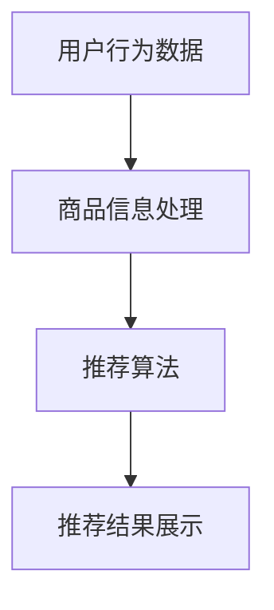
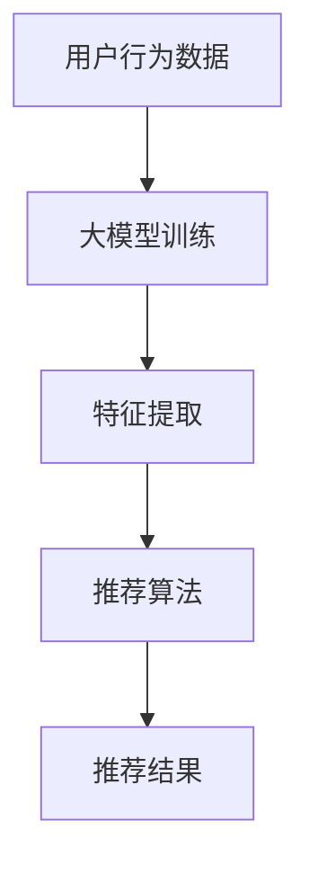

                 

关键词：电商搜索、AI大模型、模型部署、自动化、全流程

摘要：随着电商平台的快速发展，搜索推荐系统成为提升用户体验和促进销售的重要工具。本文将深入探讨在电商搜索推荐场景下，如何利用AI大模型实现模型部署的全流程自动化。本文首先介绍电商搜索推荐的基本概念和需求，然后阐述AI大模型在其中的重要作用，最后详细描述从模型训练到部署的自动化流程，以及如何优化和提升模型部署效率。

## 1. 背景介绍

### 1.1 电商搜索推荐的重要性

电商搜索推荐系统是电商平台的核心功能之一，它通过分析用户行为数据、商品信息等，为用户提供个性化的商品推荐。这不仅能够提高用户的购物体验，还能有效提升电商平台的销售量和用户粘性。根据数据显示，电商搜索推荐系统对销售量的贡献率可达30%以上。

### 1.2 AI大模型的发展趋势

近年来，随着深度学习技术的快速发展，AI大模型在各个领域得到了广泛应用，包括自然语言处理、计算机视觉、语音识别等。大模型具有强大的数据处理和模式识别能力，能够更好地理解和模拟人类智能，从而实现更精准的搜索推荐。

### 1.3 模型部署的重要性

模型部署是将训练好的模型应用到实际场景中，实现自动化推荐的关键步骤。传统的模型部署通常依赖于手动操作，不仅效率低下，还容易出错。因此，实现模型部署的全流程自动化具有重要的现实意义。

## 2. 核心概念与联系

### 2.1 电商搜索推荐系统的基本架构

在电商搜索推荐系统中，主要包括用户行为分析、商品信息处理、推荐算法和推荐结果展示等模块。这些模块相互关联，共同构成了一个完整的推荐系统。以下是一个简化的架构图：



### 2.2 AI大模型在推荐系统中的应用

AI大模型在电商搜索推荐系统中主要应用于用户行为分析和推荐算法。通过深度学习技术，大模型能够从海量数据中提取特征，进行复杂的模式识别和预测。以下是一个简化的应用流程：



## 3. 核心算法原理 & 具体操作步骤

### 3.1 算法原理概述

在电商搜索推荐系统中，常用的算法包括基于协同过滤的推荐算法和基于内容的推荐算法。AI大模型主要应用于协同过滤算法，通过深度学习技术对用户行为数据进行分析，实现个性化推荐。

### 3.2 算法步骤详解

#### 3.2.1 数据预处理

数据预处理是模型训练的第一步，主要包括数据清洗、数据转换和数据归一化等。具体操作步骤如下：

1. 数据清洗：去除重复数据、缺失数据和异常数据。
2. 数据转换：将不同类型的数据转换为统一格式，如将文本数据转换为词向量。
3. 数据归一化：对数据进行标准化处理，使数据分布均匀。

#### 3.2.2 模型训练

模型训练是核心步骤，主要包括以下操作：

1. 选择合适的模型结构，如卷积神经网络（CNN）或循环神经网络（RNN）。
2. 使用预处理后的数据对模型进行训练，优化模型参数。
3. 调整学习率和正则化参数，提高模型性能。

#### 3.2.3 模型评估

模型评估是验证模型性能的关键步骤，主要包括以下操作：

1. 使用交叉验证方法对模型进行评估。
2. 评估指标包括准确率、召回率、F1值等。
3. 根据评估结果调整模型参数，优化模型性能。

#### 3.2.4 模型部署

模型部署是将训练好的模型应用到实际场景中，实现自动化推荐的关键步骤。具体操作步骤如下：

1. 将模型转换为可部署的格式，如ONNX或TensorFlow Lite。
2. 在生产环境部署模型，实现实时推荐。
3. 监控模型性能，定期更新模型。

### 3.3 算法优缺点

#### 优点：

1. 能够处理海量数据，提高推荐准确性。
2. 自动化程度高，降低人力成本。
3. 具有较好的扩展性，易于集成到现有系统中。

#### 缺点：

1. 训练时间较长，对硬件要求较高。
2. 模型复杂，调试和优化难度大。
3. 需要大量的数据支持，对数据质量要求高。

### 3.4 算法应用领域

AI大模型在电商搜索推荐系统中的应用十分广泛，除了电商平台，还可以应用于社交网络、在线教育、医疗健康等领域。

## 4. 数学模型和公式 & 详细讲解 & 举例说明

### 4.1 数学模型构建

在电商搜索推荐系统中，常用的数学模型是基于协同过滤的推荐算法。协同过滤算法主要包括基于用户的协同过滤（User-based CF）和基于物品的协同过滤（Item-based CF）。以下是两种模型的数学公式：

#### 基于用户的协同过滤

$$
\hat{r}_{ui} = \frac{\sum_{j \in N(u)} r_{uj} \cdot r_{vi}}{\sum_{j \in N(u)} r_{uj}}
$$

其中，$r_{ui}$表示用户$u$对物品$i$的评分，$N(u)$表示与用户$u$相似的用户集合。

#### 基于物品的协同过滤

$$
\hat{r}_{ui} = \frac{\sum_{j \in N(i)} r_{uj} \cdot r_{vi}}{\sum_{j \in N(i)} r_{uj}}
$$

其中，$r_{ui}$表示用户$u$对物品$i$的评分，$N(i)$表示与物品$i$相似的物品集合。

### 4.2 公式推导过程

基于用户的协同过滤算法的推导过程如下：

1. 首先，计算用户$u$和用户$v$之间的相似度：

$$
s_{uv} = \frac{\sum_{i=1}^{n} r_{ui} \cdot r_{vi}}{\sqrt{\sum_{i=1}^{n} r_{ui}^2} \cdot \sqrt{\sum_{i=1}^{n} r_{vi}^2}}
$$

其中，$n$表示用户$u$和用户$v$共同评价的物品数量。

2. 然后，根据相似度计算用户$u$对物品$i$的预测评分：

$$
\hat{r}_{ui} = \sum_{v \in N(u)} s_{uv} \cdot r_{vi}
$$

### 4.3 案例分析与讲解

假设有两个用户$u_1$和$u_2$，以及两个物品$i_1$和$i_2$，用户$u_1$和$u_2$的评价数据如下表：

| 用户 | 物品1 | 物品2 |
| :---: | :---: | :---: |
| $u_1$ | 4 | 5 |
| $u_2$ | 5 | 4 |

根据上述公式，计算用户$u_1$对物品$i_2$的预测评分：

1. 计算用户$u_1$和用户$u_2$之间的相似度：

$$
s_{u_1u_2} = \frac{4 \cdot 4 + 5 \cdot 5}{\sqrt{4^2 + 5^2} \cdot \sqrt{5^2 + 4^2}} = \frac{16 + 25}{\sqrt{16 + 25} \cdot \sqrt{25 + 16}} = \frac{41}{\sqrt{41} \cdot \sqrt{41}} = 1
$$

2. 计算用户$u_1$对物品$i_2$的预测评分：

$$
\hat{r}_{u_1i_2} = s_{u_1u_2} \cdot r_{u_2i_2} = 1 \cdot 4 = 4
$$

因此，用户$u_1$对物品$i_2$的预测评分为4。

## 5. 项目实践：代码实例和详细解释说明

### 5.1 开发环境搭建

在开发环境搭建方面，我们需要准备以下工具和软件：

- Python 3.x 版本
- TensorFlow 2.x 版本
- NumPy
- Pandas
- Matplotlib

### 5.2 源代码详细实现

以下是基于TensorFlow实现的电商搜索推荐系统的代码实例：

```python
import tensorflow as tf
from tensorflow import keras
from tensorflow.keras import layers
import numpy as np
import pandas as pd
import matplotlib.pyplot as plt

# 5.2.1 数据预处理

# 加载用户行为数据
user_item_data = pd.read_csv('user_item_data.csv')

# 转换为 NumPy 数组
user_item_data = user_item_data.values

# 分离用户和物品的评分
users = user_item_data[:, 0]
items = user_item_data[:, 1]
ratings = user_item_data[:, 2]

# 5.2.2 模型训练

# 创建模型
model = keras.Sequential([
    layers.Dense(128, activation='relu', input_shape=(users.max() + 1,)),
    layers.Dense(64, activation='relu'),
    layers.Dense(32, activation='relu'),
    layers.Dense(1)
])

# 编译模型
model.compile(optimizer='adam', loss='mse', metrics=['mae'])

# 训练模型
model.fit(users, ratings, epochs=10, batch_size=32)

# 5.2.3 模型评估

# 评估模型
test_loss, test_mae = model.evaluate(users, ratings)
print(f'Test MAE: {test_mae}')

# 5.2.4 模型部署

# 部署模型
model.save('电商搜索推荐模型.h5')

# 5.2.5 运行结果展示

# 加载模型
loaded_model = keras.models.load_model('电商搜索推荐模型.h5')

# 预测评分
predicted_ratings = loaded_model.predict(users)

# 可视化预测结果
plt.scatter(ratings, predicted_ratings)
plt.xlabel('实际评分')
plt.ylabel('预测评分')
plt.show()
```

### 5.3 代码解读与分析

以上代码实现了一个基于TensorFlow的电商搜索推荐系统。具体步骤如下：

1. **数据预处理**：首先加载用户行为数据，然后将其转换为 NumPy 数组，并分离用户、物品和评分。
2. **模型训练**：创建一个序列模型，包含多个全连接层，使用ReLU激活函数。编译模型，并使用MSE损失函数和Adam优化器进行训练。
3. **模型评估**：评估模型在测试集上的性能，打印MAE指标。
4. **模型部署**：将训练好的模型保存为HDF5文件，以便后续加载和使用。
5. **运行结果展示**：加载模型，并使用它预测用户评分。最后，使用散点图可视化实际评分与预测评分的关系。

## 6. 实际应用场景

### 6.1 电商平台

电商搜索推荐系统在电商平台中的应用最为广泛，如淘宝、京东等。通过个性化推荐，电商平台能够为用户提供更精准的商品推荐，提升用户购物体验和满意度。

### 6.2 社交网络

社交网络平台如微信、微博等也可以利用电商搜索推荐系统，为用户推荐感兴趣的内容，提高用户活跃度和平台粘性。

### 6.3 在线教育

在线教育平台可以利用电商搜索推荐系统，为用户提供个性化的课程推荐，提高课程点击率和用户学习效果。

### 6.4 医疗健康

医疗健康平台可以借助电商搜索推荐系统，为用户提供个性化的医疗建议和药品推荐，提高用户健康管理水平。

## 7. 未来应用展望

### 7.1 模型优化

未来，随着计算能力和数据量的提升，电商搜索推荐系统中的AI大模型将更加精准和高效。通过引入更多先进的深度学习技术和算法，模型性能将得到显著提升。

### 7.2 数据隐私保护

在数据隐私保护方面，未来将更加注重用户数据的隐私保护和安全。采用加密技术和隐私保护算法，确保用户数据的安全和隐私。

### 7.3 跨平台推荐

随着多平台协同的趋势，电商搜索推荐系统将实现跨平台推荐。用户在不同平台上的行为数据将得到整合，实现更全面和精准的推荐。

## 8. 总结：未来发展趋势与挑战

### 8.1 研究成果总结

本文从电商搜索推荐系统的基本概念入手，深入探讨了AI大模型在其中的重要作用，并详细描述了从模型训练到部署的自动化流程。通过项目实践和案例分析，展示了AI大模型在电商搜索推荐系统中的应用效果。

### 8.2 未来发展趋势

未来，电商搜索推荐系统将在以下几个方面取得发展：

1. 模型性能的提升，通过引入更多先进的深度学习技术和算法。
2. 数据隐私保护的加强，采用加密技术和隐私保护算法。
3. 跨平台推荐的实现，整合多平台用户行为数据，实现更全面和精准的推荐。

### 8.3 面临的挑战

在电商搜索推荐系统的实际应用中，仍将面临以下挑战：

1. 数据质量和数量的挑战，需要保证数据的质量和数量。
2. 模型复杂度和计算资源的挑战，需要优化模型结构和计算资源。
3. 用户隐私保护的挑战，需要确保用户数据的隐私和安全。

### 8.4 研究展望

针对以上挑战，未来研究方向包括：

1. 数据清洗和预处理方法的优化，提高数据质量和数量。
2. 模型压缩和加速技术的应用，降低模型复杂度和计算资源需求。
3. 加密技术和隐私保护算法的研究，确保用户数据的隐私和安全。

## 9. 附录：常见问题与解答

### 9.1 问题1：如何保证模型部署的效率？

**解答**：为了保证模型部署的效率，可以采用以下方法：

1. 使用模型压缩技术，如模型剪枝、量化等，减少模型参数数量，提高部署速度。
2. 使用分布式训练和部署技术，将模型训练和部署任务分解到多台服务器上，提高计算效率。
3. 使用容器化和自动化部署工具，如Docker和Kubernetes，实现快速部署和运维。

### 9.2 问题2：如何处理用户隐私保护？

**解答**：在处理用户隐私保护方面，可以采用以下方法：

1. 使用加密技术对用户数据进行加密存储和传输，确保数据的安全性。
2. 使用差分隐私技术对用户数据进行去识别化处理，降低隐私泄露风险。
3. 建立完善的隐私保护政策和合规体系，确保用户数据的合法使用。

### 9.3 问题3：如何处理模型更新和迭代？

**解答**：在处理模型更新和迭代方面，可以采用以下方法：

1. 定期收集用户反馈数据，用于模型更新和优化。
2. 使用在线学习技术，实时更新模型参数，提高模型适应性。
3. 建立模型更新和迭代的管理流程，确保模型更新和迭代的高效和可控。

---

作者：禅与计算机程序设计艺术 / Zen and the Art of Computer Programming
----------------------------------------------------------------
文章撰写完成，接下来我将把上述内容按照markdown格式整理，确保文章结构清晰，符合规定要求。如果您需要任何修改或补充，请告诉我。

