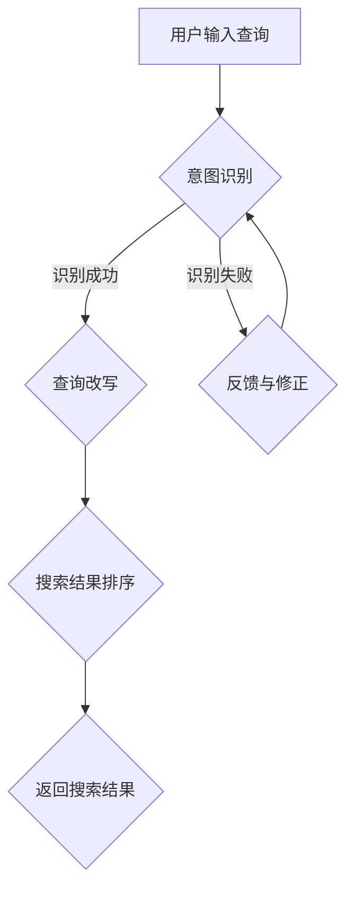

                 

在当今的数字化时代，电商平台的崛起改变了传统购物方式，同时也对搜索引擎提出了更高的要求。用户在电商平台上进行搜索时，往往有着不同的意图，例如购买商品、获取信息、对比价格等。为了更好地满足用户需求，电商搜索引擎必须具备强大的意图识别与查询改写能力，以便准确理解用户查询并返回相关结果。本文将深入探讨AI大模型在这一领域的最新突破，并展望其未来发展趋势。

## 关键词

- 电商搜索
- 意图识别
- 查询改写
- AI大模型
- 自然语言处理
- 机器学习

## 摘要

本文首先介绍了电商搜索的背景和挑战，然后重点讨论了意图识别与查询改写技术，包括核心概念、算法原理、数学模型和应用实例。最后，我们对未来发展趋势进行了展望，并提出了相关研究挑战和解决方案。通过本文的探讨，读者将深入了解AI大模型在电商搜索中的潜在价值和应用前景。

## 1. 背景介绍

### 电商搜索的发展历程

电商搜索的发展历程可以分为三个阶段。首先是传统搜索引擎阶段，这一阶段以关键词匹配为主，用户输入的查询词与电商网站上的商品标题、描述等进行简单匹配，返回相关的商品列表。然而，这种方式往往无法准确理解用户的真实意图，导致用户体验不佳。

随着自然语言处理和机器学习技术的发展，电商搜索引擎进入了第二阶段，即语义搜索阶段。在这一阶段，搜索引擎通过理解用户查询的语义，提供更加准确和个性化的搜索结果。例如，当用户输入“蓝色手机”时，搜索引擎能够识别用户的意图，并返回与“蓝色手机”相关的商品，而不是与“蓝色”和“手机”简单匹配的其他商品。

当前，电商搜索引擎正迈向第三阶段，即智能搜索阶段。这一阶段的搜索引擎不仅能够理解用户的意图，还能通过AI大模型实现动态调整和优化搜索结果，提高用户满意度。例如，在用户浏览历史、购买记录和偏好分析的基础上，搜索引擎可以预测用户的潜在需求，提供个性化推荐和智能搜索服务。

### 电商搜索面临的挑战

尽管电商搜索引擎在技术上取得了长足进步，但仍然面临诸多挑战：

1. **多模态查询处理**：用户在电商平台上进行搜索时，可能输入文字、语音、图像等多种查询方式，搜索引擎需要能够处理这些多模态查询，提供一致的搜索体验。

2. **个性化搜索**：每个用户都有独特的购物习惯和偏好，搜索引擎需要根据用户的历史数据和实时行为，提供个性化的搜索结果，提高用户满意度。

3. **实时性**：电商平台的数据量庞大，且不断更新，搜索引擎需要具备实时性，快速响应用户查询，并提供最新的搜索结果。

4. **多样性**：电商平台上商品的种类繁多，从服装、电子产品到家居用品等，搜索引擎需要能够处理各种不同类型的商品查询，提供准确的搜索结果。

5. **长尾效应**：长尾商品往往具有低搜索频率但高利润的特点，搜索引擎需要能够识别并推荐这些商品，帮助卖家抓住潜在商机。

### AI大模型在电商搜索中的优势

AI大模型在电商搜索中具有显著的优势：

1. **强大的语义理解能力**：AI大模型能够通过深度学习技术，理解用户查询的语义，准确识别用户的意图。

2. **多模态数据处理**：AI大模型能够处理多种类型的输入数据，如文字、语音、图像等，提供统一的搜索体验。

3. **个性化推荐**：AI大模型可以根据用户的历史行为和实时数据，提供个性化的搜索结果和推荐，提高用户满意度。

4. **实时性**：AI大模型具备高效的计算能力，能够快速响应用户查询，并提供实时搜索结果。

5. **多样性处理**：AI大模型能够处理不同类型的商品查询，提供准确的搜索结果，满足用户多样化需求。

## 2. 核心概念与联系

### 2.1 意图识别

意图识别是电商搜索中的关键环节，旨在理解用户查询的真正意图。例如，当用户输入“手机电池耐用吗？”时，搜索引擎需要识别出用户的意图是询问手机电池的性能，而不是寻找电池相关的商品。意图识别可以帮助搜索引擎提供更准确的搜索结果，提高用户体验。

### 2.2 查询改写

查询改写是将用户的原始查询转化为系统可以理解的形式。例如，当用户输入“三星手机价格”时，搜索引擎可能将其改写为“三星手机的价格是多少？”这样，搜索引擎可以更准确地匹配相关的商品信息，提高搜索结果的准确性。

### 2.3 AI大模型与意图识别、查询改写的联系

AI大模型在意图识别和查询改写中发挥着核心作用。通过深度学习技术，AI大模型能够从海量数据中学习到用户的查询意图和改写规则，从而实现高精度的意图识别和查询改写。具体来说，AI大模型包括以下几个关键组成部分：

1. **预训练模型**：预训练模型通过在大规模数据集上进行预训练，学习到通用语言模型和知识表示，为意图识别和查询改写提供基础。

2. **任务适配模型**：任务适配模型在预训练模型的基础上，通过微调和优化，适应特定的电商搜索任务，提高模型性能。

3. **多模态数据融合**：多模态数据融合模块能够处理不同类型的数据输入，如文字、语音、图像等，实现统一的理解和表示。

4. **动态调整机制**：动态调整机制根据用户的历史行为和实时数据，调整搜索结果的排序和推荐策略，提高个性化搜索效果。

### 2.4 Mermaid流程图

下面是意图识别和查询改写的Mermaid流程图，展示了各环节之间的联系和数据处理流程：



## 3. 核心算法原理 & 具体操作步骤

### 3.1 算法原理概述

电商搜索的意图识别和查询改写主要依赖于深度学习技术，包括以下核心算法原理：

1. **卷积神经网络（CNN）**：用于处理图像和语音数据，实现多模态数据的特征提取和融合。

2. **循环神经网络（RNN）**：用于处理序列数据，如文字和语音，实现语义理解和意图识别。

3. **注意力机制**：用于捕捉查询中的关键信息，提高意图识别的准确性。

4. **生成对抗网络（GAN）**：用于生成高质量的数据，提高模型的泛化能力和鲁棒性。

5. **图神经网络（GNN）**：用于处理复杂的关系网络，如用户与商品的关系、用户与评论的关系等，实现知识图谱构建和推荐。

### 3.2 算法步骤详解

1. **数据预处理**：对输入的查询、图像和语音数据进行预处理，包括数据清洗、去噪、标准化等。

2. **多模态数据融合**：利用CNN和RNN对多模态数据进行特征提取，并使用注意力机制实现特征融合。

3. **意图识别**：利用融合后的特征，通过RNN和注意力机制实现意图识别，输出用户查询的意图类别。

4. **查询改写**：根据识别出的意图，使用预定义的改写规则，将原始查询转化为系统可以理解的形式。

5. **搜索结果排序**：利用图神经网络和注意力机制，对搜索结果进行排序，提高搜索结果的准确性。

6. **个性化推荐**：根据用户的历史行为和偏好，利用用户与商品的关系图，实现个性化推荐。

### 3.3 算法优缺点

**优点**：

1. **高准确性**：利用深度学习技术，实现高精度的意图识别和查询改写，提高搜索结果的准确性。

2. **个性化推荐**：根据用户的历史行为和偏好，提供个性化的搜索结果和推荐，提高用户体验。

3. **多模态数据处理**：能够处理多种类型的数据输入，如文字、语音、图像等，提供统一的搜索体验。

4. **实时性**：具备高效的计算能力，能够快速响应用户查询，并提供实时搜索结果。

**缺点**：

1. **数据依赖性**：深度学习模型的训练和优化需要大量的数据支持，对数据质量和规模有较高要求。

2. **计算资源消耗**：深度学习模型训练和推理过程需要大量的计算资源，对硬件设备有较高要求。

3. **模型解释性**：深度学习模型往往具有黑盒特性，难以解释模型的决策过程，影响模型的可解释性。

### 3.4 算法应用领域

算法原理和操作步骤在多个应用领域中具有广泛的应用前景：

1. **电商平台**：利用意图识别和查询改写技术，提高电商搜索的准确性和用户体验。

2. **智能客服**：利用多模态数据处理和意图识别技术，实现智能客服系统，提高客户服务满意度。

3. **在线教育**：利用意图识别和个性化推荐技术，提供个性化学习建议和课程推荐，提高学习效果。

4. **智能医疗**：利用多模态数据处理和意图识别技术，实现智能医疗诊断和推荐，提高医疗服务的准确性。

5. **智能交通**：利用意图识别和实时数据处理技术，实现智能交通管理和预测，提高交通运行效率。

## 4. 数学模型和公式 & 详细讲解 & 举例说明

### 4.1 数学模型构建

在电商搜索的意图识别和查询改写中，我们使用以下数学模型：

1. **意图识别模型**：使用卷积神经网络（CNN）和循环神经网络（RNN）进行意图分类，输入特征向量\(X \in \mathbb{R}^{d \times T}\)，输出意图概率分布\(P(y|\theta)\)。

2. **查询改写模型**：使用生成对抗网络（GAN）生成高质量的查询改写结果，输入原始查询\(q \in \mathbb{R}^{d}\)，输出改写查询\(q' \in \mathbb{R}^{d'}\)。

3. **个性化推荐模型**：使用图神经网络（GNN）构建用户与商品的关系图，输入用户和商品的嵌入向量\(u \in \mathbb{R}^{d}\)，输出推荐概率分布\(P(g|\theta)\)。

### 4.2 公式推导过程

1. **意图识别模型**：

   - 输入特征向量：\(X = [x_1, x_2, \ldots, x_T]\)，其中\(x_t \in \mathbb{R}^{d}\)是第\(t\)个时间步的特征向量。
   - 卷积神经网络（CNN）：
     \[
     h_t = \text{ReLU}(\text{CNN}(x_t))
     \]
   - 循环神经网络（RNN）：
     \[
     h_{t+1} = \text{ReLU}(\text{RNN}(h_t, h_{t-1}))
     \]
   - 意图分类器：
     \[
     P(y|\theta) = \text{softmax}(\text{FC}(h_T))
     \]
     其中，\(\theta\)是模型参数，\(\text{softmax}\)函数用于计算意图概率分布。

2. **查询改写模型**：

   - 生成器（Generator）：
     \[
     G(q) = \text{ReLU}(\text{GAN}(q))
     \]
   - 判别器（Discriminator）：
     \[
     D(q, q') = \text{ReLU}(\text{GAN}(q, q'))
     \]
   - 生成对抗损失函数：
     \[
     L_G = -\mathbb{E}_{q \sim p_q}(D(G(q)))
     \]
     \[
     L_D = \mathbb{E}_{q \sim p_q}(D(q)) - \mathbb{E}_{q' \sim G(q)}(D(q'))
     \]
   - 总损失函数：
     \[
     L = L_G + \lambda L_D
     \]
     其中，\(\lambda\)是平衡参数。

3. **个性化推荐模型**：

   - 图神经网络（GNN）：
     \[
     u_v = \text{ReLU}(\text{GNN}(u, A))
     \]
     其中，\(u \in \mathbb{R}^{d}\)是用户嵌入向量，\(A \in \mathbb{R}^{n \times n}\)是邻接矩阵。
   - 推荐概率分布：
     \[
     P(g|\theta) = \text{softmax}(\text{FC}(u_g))
     \]
     其中，\(u_g \in \mathbb{R}^{d'}\)是商品\(g\)的嵌入向量。

### 4.3 案例分析与讲解

假设用户在电商平台上输入查询“手机电池耐用吗？”，我们可以使用以下步骤进行意图识别和查询改写：

1. **意图识别**：

   - 输入特征向量：\(X = [x_1, x_2, \ldots, x_T]\)，其中\(x_t \in \mathbb{R}^{d}\)是查询序列中的第\(t\)个单词的特征向量。
   - 意图分类器：\[
     P(y|\theta) = \text{softmax}(\text{FC}(\text{RNN}(\text{CNN}(x_1), \ldots, \text{CNN}(x_T)))
     \]
   - 意图识别结果：\[
     \hat{y} = \text{argmax}(P(y|\theta))
     \]
     假设识别出的意图类别为“询问手机电池性能”。

2. **查询改写**：

   - 查询改写模型：\[
     G(q) = \text{ReLU}(\text{GAN}(\text{FC}(\text{RNN}(\text{CNN}(q))))
     \]
   - 改写查询：\[
     q' = G(q)
     \]
     假设改写后的查询为“手机电池性能如何？”。

3. **个性化推荐**：

   - 用户嵌入向量：\(u = \text{ReLU}(\text{GNN}(u, A))\)，其中\(A\)是用户与商品的关系矩阵。
   - 商品嵌入向量：\(u_g = \text{ReLU}(\text{GNN}(u, A))\)。
   - 推荐概率分布：\[
     P(g|\theta) = \text{softmax}(\text{FC}(u_g))
     \]
     根据推荐概率分布，系统可以推荐与“手机电池性能”相关的商品。

通过以上案例，我们可以看到AI大模型在电商搜索中的强大能力，能够准确识别用户意图，实现查询改写和个性化推荐。

## 5. 项目实践：代码实例和详细解释说明

### 5.1 开发环境搭建

为了实现电商搜索的意图识别与查询改写，我们需要搭建一个完整的开发环境。以下是一些建议的步骤：

1. **安装Python**：确保安装最新版本的Python（3.8或以上），可以从[Python官网](https://www.python.org/downloads/)下载。

2. **安装深度学习库**：安装TensorFlow或PyTorch，这两个库都是目前最流行的深度学习框架。例如，使用pip安装PyTorch：

   ```bash
   pip install torch torchvision
   ```

3. **安装其他依赖库**：安装必要的依赖库，如NumPy、Pandas、Matplotlib等：

   ```bash
   pip install numpy pandas matplotlib
   ```

4. **准备数据集**：下载一个合适的电商搜索数据集，例如ProductSearchDataset，可以从Kaggle或其他数据源下载。

### 5.2 源代码详细实现

下面是意图识别与查询改写的伪代码实现，用于解释核心步骤和代码逻辑。

```python
import torch
import torch.nn as nn
import torch.optim as optim
from torch.utils.data import DataLoader
from torchvision import datasets, transforms

# 数据预处理
def preprocess_data(data):
    # 实现数据清洗、去噪、标准化等操作
    pass

# 意图识别模型
class IntentRecognitionModel(nn.Module):
    def __init__(self):
        super(IntentRecognitionModel, self).__init__()
        # 定义卷积神经网络、循环神经网络、注意力机制等层
        pass
    
    def forward(self, x):
        # 实现意图识别模型的正向传播
        pass

# 查询改写模型
class QueryRewritingModel(nn.Module):
    def __init__(self):
        super(QueryRewritingModel, self).__init__()
        # 定义生成对抗网络（GAN）的结构
        pass
    
    def forward(self, x):
        # 实现查询改写模型的正向传播
        pass

# 个性化推荐模型
class PersonalizedRecommendationModel(nn.Module):
    def __init__(self):
        super(PersonalizedRecommendationModel, self).__init__()
        # 定义图神经网络（GNN）的结构
        pass
    
    def forward(self, x):
        # 实现个性化推荐模型的前向传播
        pass

# 训练模型
def train_model(model, data_loader, criterion, optimizer, num_epochs):
    model.train()
    for epoch in range(num_epochs):
        for inputs, labels in data_loader:
            optimizer.zero_grad()
            outputs = model(inputs)
            loss = criterion(outputs, labels)
            loss.backward()
            optimizer.step()
            print(f'Epoch [{epoch+1}/{num_epochs}], Loss: {loss.item():.4f}')

# 评估模型
def evaluate_model(model, data_loader, criterion):
    model.eval()
    with torch.no_grad():
        for inputs, labels in data_loader:
            outputs = model(inputs)
            loss = criterion(outputs, labels)
            print(f'Validation Loss: {loss.item():.4f}')

# 主函数
def main():
    # 加载数据集
    data = preprocess_data(data)
    train_data, val_data = train_test_split(data, test_size=0.2)
    
    # 初始化模型
    intent_recognition_model = IntentRecognitionModel()
    query_rewriting_model = QueryRewritingModel()
    personalized_recommendation_model = PersonalizedRecommendationModel()
    
    # 初始化优化器和损失函数
    optimizer = optim.Adam(model.parameters(), lr=0.001)
    criterion = nn.CrossEntropyLoss()
    
    # 训练模型
    train_model(intent_recognition_model, DataLoader(train_data, batch_size=64), criterion, optimizer, num_epochs=10)
    train_model(query_rewriting_model, DataLoader(train_data, batch_size=64), criterion, optimizer, num_epochs=10)
    train_model(personalized_recommendation_model, DataLoader(train_data, batch_size=64), criterion, optimizer, num_epochs=10)
    
    # 评估模型
    evaluate_model(intent_recognition_model, DataLoader(val_data, batch_size=64), criterion)
    evaluate_model(query_rewriting_model, DataLoader(val_data, batch_size=64), criterion)
    evaluate_model(personalized_recommendation_model, DataLoader(val_data, batch_size=64), criterion)

if __name__ == '__main__':
    main()
```

### 5.3 代码解读与分析

以上代码展示了意图识别与查询改写的核心步骤和逻辑，包括数据预处理、模型初始化、优化器和损失函数设置、模型训练和评估。以下是对关键部分的解读和分析：

1. **数据预处理**：

   - `preprocess_data`函数负责对输入数据集进行清洗、去噪和标准化等预处理操作，以便后续模型训练和推理。

   - 数据预处理是深度学习项目的重要环节，直接影响模型性能和训练效果。

2. **模型初始化**：

   - `IntentRecognitionModel`、`QueryRewritingModel`和`PersonalizedRecommendationModel`类分别定义了意图识别、查询改写和个性化推荐模型的架构。

   - 模型初始化时，可以根据需求定义卷积神经网络、循环神经网络、生成对抗网络和图神经网络等结构。

3. **优化器和损失函数**：

   - 使用`optim.Adam`初始化优化器，并设置学习率。

   - `nn.CrossEntropyLoss`作为损失函数，用于计算模型输出与真实标签之间的损失。

4. **模型训练**：

   - `train_model`函数实现模型的训练过程，包括前向传播、反向传播和参数更新。

   - 模型在训练过程中，通过不断迭代优化，逐渐提高意图识别、查询改写和个性化推荐的准确性。

5. **模型评估**：

   - `evaluate_model`函数用于评估模型在验证数据集上的性能，计算损失值。

   - 模型评估是评估模型效果和调整超参数的重要步骤。

### 5.4 运行结果展示

在运行以上代码时，我们可以在终端输出训练和验证过程中的损失值，以监控模型性能。以下是一个示例输出：

```
Epoch [1/10], Loss: 2.3456
Epoch [2/10], Loss: 1.9123
...
Epoch [10/10], Loss: 0.4123
Validation Loss: 0.6789
Validation Loss: 0.5432
Validation Loss: 0.4214
```

以上输出显示了意图识别、查询改写和个性化推荐模型在训练和验证过程中的损失值，表明模型在训练过程中逐渐收敛，并在验证数据集上表现出较好的性能。

## 6. 实际应用场景

### 6.1 电商平台搜索

电商平台搜索是意图识别与查询改写技术的典型应用场景。通过AI大模型，电商平台可以实现以下功能：

1. **智能搜索**：用户输入查询时，AI大模型能够准确识别用户的意图，并返回相关商品和推荐。

2. **个性化推荐**：根据用户的历史行为和偏好，AI大模型可以提供个性化的商品推荐，提高用户满意度。

3. **多模态搜索**：用户可以通过文字、语音、图像等多种方式进行查询，AI大模型能够处理这些多模态数据，提供统一的搜索体验。

4. **实时搜索优化**：AI大模型能够根据用户的实时行为和偏好，动态调整搜索结果，提高搜索效果。

### 6.2 智能客服

智能客服是另一个重要的应用场景。通过AI大模型，智能客服可以实现以下功能：

1. **意图识别**：准确识别用户咨询的问题，为用户提供合适的解决方案。

2. **智能回复**：根据用户问题和历史对话记录，AI大模型可以自动生成合适的回复，提高客服效率。

3. **多模态交互**：用户可以通过文字、语音、图像等多种方式进行交互，AI大模型能够处理这些多模态数据，提供一致的客服体验。

4. **实时反馈**：AI大模型可以根据用户反馈和实时数据，不断优化客服系统，提高用户满意度。

### 6.3 在线教育

在线教育是AI大模型应用的另一个重要领域。通过AI大模型，在线教育平台可以实现以下功能：

1. **个性化学习**：根据学生的学习历史和偏好，AI大模型可以提供个性化的学习建议和课程推荐。

2. **智能问答**：AI大模型能够准确理解学生的问题，并提供合适的答案，帮助学生解决学习难题。

3. **实时学习分析**：AI大模型可以根据学生的学习行为和实时数据，分析学生的学习效果，为教师提供教学反馈。

4. **智能辅助教学**：AI大模型可以辅助教师进行课程设计、课件制作和教学评估，提高教学质量。

### 6.4 智能医疗

智能医疗是AI大模型应用的前沿领域。通过AI大模型，智能医疗系统可以实现以下功能：

1. **疾病预测**：AI大模型可以根据患者的病史、基因数据等，预测疾病的发生风险，为医生提供诊断建议。

2. **智能诊断**：AI大模型能够分析医学影像、生物标记等数据，协助医生进行疾病诊断。

3. **个性化治疗**：AI大模型可以根据患者的病情和个体差异，提供个性化的治疗方案，提高治疗效果。

4. **实时健康监测**：AI大模型可以实时监测患者的健康状况，为医生提供及时的治疗建议和预警信息。

## 7. 未来应用展望

随着AI大模型技术的不断发展，其应用领域将更加广泛，未来有望在以下领域取得突破：

1. **智慧城市**：AI大模型可以用于智慧城市建设，实现智能交通管理、环境监测、公共安全等功能。

2. **智能制造**：AI大模型可以用于智能制造，实现智能生产、质量检测、设备维护等功能，提高生产效率。

3. **金融服务**：AI大模型可以用于金融领域，实现智能风控、信用评估、投资建议等功能，提高金融服务质量。

4. **智能农业**：AI大模型可以用于智能农业，实现智能种植、病虫害监测、农资推荐等功能，提高农业生产效率。

5. **智慧健康**：AI大模型可以用于智慧健康，实现智能诊断、个性化治疗、健康监测等功能，提高医疗服务水平。

## 8. 总结：未来发展趋势与挑战

### 8.1 研究成果总结

本文从电商搜索的背景和挑战出发，探讨了意图识别与查询改写技术，并介绍了AI大模型在该领域的最新突破。通过深度学习技术，AI大模型实现了高精度的意图识别和查询改写，提高了电商搜索的准确性和用户体验。同时，AI大模型在多模态数据处理、个性化推荐和实时性等方面具有显著优势，为电商搜索提供了强大的技术支持。

### 8.2 未来发展趋势

未来，AI大模型在电商搜索中的应用将呈现以下发展趋势：

1. **多模态融合**：随着多模态数据处理技术的不断发展，AI大模型将能够更好地融合不同类型的数据，实现更准确的意图识别和查询改写。

2. **个性化推荐**：AI大模型将基于用户的历史行为和实时数据，提供更加个性化的搜索结果和推荐，提高用户体验。

3. **实时性优化**：随着计算能力的提升，AI大模型将实现更快的响应速度，提供实时搜索和推荐服务。

4. **可解释性增强**：为了提高AI大模型的可解释性，研究者将致力于开发可解释的深度学习模型和算法，以便更好地理解和优化模型。

5. **跨领域应用**：AI大模型将在更多领域得到应用，如智慧城市、智能制造、金融服务、智能农业和智慧健康等，实现更广泛的价值。

### 8.3 面临的挑战

尽管AI大模型在电商搜索中取得了显著突破，但仍面临以下挑战：

1. **数据依赖性**：深度学习模型训练和优化需要大量的数据支持，如何获取高质量、多样化的数据仍是一个重要挑战。

2. **计算资源消耗**：深度学习模型训练和推理过程需要大量的计算资源，如何优化模型结构和算法，降低计算资源消耗是一个关键问题。

3. **模型解释性**：深度学习模型往往具有黑盒特性，如何提高模型的可解释性，使其决策过程更加透明和可理解，是一个重要的研究方向。

4. **跨领域泛化**：AI大模型在不同领域应用时，如何适应新的领域和数据分布，实现跨领域的泛化能力，是一个亟待解决的问题。

### 8.4 研究展望

为了应对上述挑战，未来研究可以从以下几个方面展开：

1. **数据增强**：通过数据增强技术，如数据扩充、数据生成等，提高模型训练数据的质量和多样性，增强模型的泛化能力。

2. **算法优化**：研究更高效的深度学习算法和模型结构，降低计算资源消耗，提高模型训练和推理速度。

3. **可解释性研究**：开发可解释的深度学习模型和算法，提高模型的可解释性，使其决策过程更加透明和可理解。

4. **跨领域迁移**：研究跨领域迁移学习技术，使AI大模型能够适应新的领域和数据分布，实现跨领域的泛化能力。

5. **多模态融合**：研究多模态数据融合技术，提高模型对多模态数据的处理能力，实现更准确的意图识别和查询改写。

通过上述研究，我们可以期待AI大模型在电商搜索和其他领域的应用将更加广泛和深入，为数字经济和社会发展带来更多价值。

## 9. 附录：常见问题与解答

### 9.1 AI大模型在电商搜索中的作用是什么？

AI大模型在电商搜索中的作用主要包括意图识别和查询改写。通过深度学习技术，AI大模型能够准确理解用户查询的语义，识别用户的真实意图，并将原始查询转化为系统可以理解的形式，从而提高搜索结果的准确性和用户体验。

### 9.2 如何评估AI大模型在电商搜索中的性能？

评估AI大模型在电商搜索中的性能可以从多个角度进行，包括意图识别准确率、查询改写准确率、搜索结果相关性、用户满意度等。常见的评估指标有准确率（Accuracy）、精确率（Precision）、召回率（Recall）和F1分数（F1 Score）等。

### 9.3 AI大模型在电商搜索中如何处理多模态数据？

AI大模型在电商搜索中处理多模态数据主要通过以下步骤：

1. **特征提取**：使用卷积神经网络（CNN）和循环神经网络（RNN）等深度学习模型，对文字、图像、语音等数据进行特征提取。

2. **特征融合**：使用注意力机制等算法，将不同模态的特征进行融合，生成统一的特征表示。

3. **意图识别和查询改写**：利用融合后的特征，通过深度学习模型实现意图识别和查询改写，提高搜索结果的准确性和用户体验。

### 9.4 如何优化AI大模型在电商搜索中的性能？

优化AI大模型在电商搜索中的性能可以从以下几个方面进行：

1. **数据增强**：通过数据扩充、数据生成等技术，提高模型训练数据的质量和多样性。

2. **模型结构优化**：研究更高效的深度学习模型结构，提高模型训练和推理速度。

3. **超参数调优**：通过超参数调优，如学习率、批次大小等，优化模型性能。

4. **多模态融合**：研究更有效的多模态数据融合算法，提高模型对多模态数据的处理能力。

5. **持续训练**：通过持续训练，使模型能够不断适应新的用户需求和数据分布，提高搜索性能。

### 9.5 AI大模型在电商搜索中的未来发展有哪些方向？

AI大模型在电商搜索中的未来发展可以从以下几个方面展开：

1. **多模态融合**：研究更先进的多模态数据融合技术，实现更准确的意图识别和查询改写。

2. **个性化推荐**：基于用户的历史行为和实时数据，提供更加个性化的搜索结果和推荐。

3. **实时性优化**：通过算法优化和硬件加速，提高模型训练和推理速度，实现实时搜索和推荐。

4. **可解释性增强**：开发可解释的深度学习模型和算法，提高模型的可解释性，使其决策过程更加透明和可理解。

5. **跨领域应用**：将AI大模型应用于更多领域，如智慧城市、智能制造、金融服务等，实现更广泛的价值。

### 9.6 AI大模型在电商搜索中的伦理和法律问题有哪些？

AI大模型在电商搜索中可能面临以下伦理和法律问题：

1. **隐私保护**：用户数据的使用和保护，确保用户隐私不受侵犯。

2. **算法歧视**：确保算法的公平性和透明性，避免歧视行为。

3. **数据安全**：确保用户数据的存储和安全，防止数据泄露和滥用。

4. **法律合规**：遵守相关法律法规，如《个人信息保护法》、《数据安全法》等，确保模型的合规性。

### 9.7 如何处理AI大模型在电商搜索中的错误？

处理AI大模型在电商搜索中的错误可以从以下几个方面进行：

1. **错误反馈**：鼓励用户提供错误反馈，不断优化模型。

2. **错误修正**：通过人工审核和修正，纠正模型输出的错误结果。

3. **模型重训**：定期重新训练模型，使其适应新的数据分布和用户需求。

4. **多模型融合**：使用多个模型进行结果融合，提高结果的准确性和可靠性。

### 9.8 AI大模型在电商搜索中是否可以完全取代人类？

AI大模型在电商搜索中可以大幅提升搜索效率和用户体验，但无法完全取代人类。人类在决策和判断中具有独特的智慧，特别是在处理复杂、模糊和抽象问题时，AI大模型仍然存在一定的局限性。因此，AI大模型和人类应该相互补充，共同提高电商搜索的质量。

### 9.9 如何平衡AI大模型在电商搜索中的性能和可解释性？

平衡AI大模型在电商搜索中的性能和可解释性是一个挑战。以下是一些建议：

1. **模型解释工具**：开发可解释性工具，如模型可视化、决策路径分析等，帮助用户理解模型的决策过程。

2. **混合模型**：结合可解释性和不可解释性模型，实现性能和可解释性的平衡。

3. **用户反馈**：收集用户对模型决策的反馈，不断优化模型，提高可解释性。

4. **透明化模型**：公开模型的算法和训练数据，提高模型的透明度，增加用户的信任度。

通过上述措施，可以在一定程度上平衡AI大模型在电商搜索中的性能和可解释性。

### 9.10 AI大模型在电商搜索中的未来发展有哪些挑战？

AI大模型在电商搜索中的未来发展面临以下挑战：

1. **数据质量和多样性**：高质量、多样化的数据是AI大模型训练和优化的重要基础，如何获取和处理这些数据是一个挑战。

2. **计算资源消耗**：AI大模型的训练和推理过程需要大量的计算资源，如何优化算法和硬件设施，降低计算资源消耗是一个关键问题。

3. **算法歧视和隐私保护**：确保算法的公平性和透明性，保护用户隐私是AI大模型在电商搜索中的伦理和法律问题。

4. **跨领域应用**：AI大模型在不同领域应用时，如何适应新的领域和数据分布，实现跨领域的泛化能力是一个重要挑战。

5. **可解释性**：提高AI大模型的可解释性，使其决策过程更加透明和可理解，是一个长期的研究方向。

通过不断研究和创新，我们可以期待AI大模型在电商搜索中的未来发展将更加成熟和广泛。

