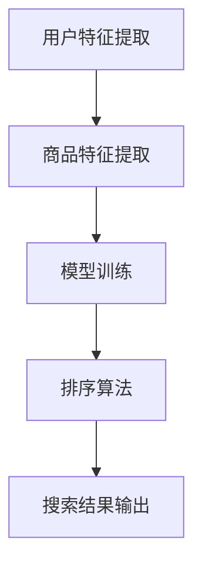

                 

关键词：电商搜索、个性化排序、AI大模型、算法、搜索结果优化

> 摘要：本文将探讨如何利用AI大模型来实现电商搜索结果个性化排序，介绍该算法的核心概念、原理、数学模型及具体实现步骤。通过详细的数学模型推导和案例讲解，揭示该算法在电商领域中的应用价值，并展望未来的发展方向与挑战。

## 1. 背景介绍

在当今的电商时代，搜索结果个性化排序已经成为影响用户购物体验和商家收益的重要因素。传统的排序算法通常基于商品的相关性、热度、销量等单一指标，难以充分满足用户多样化的需求，导致用户体验不佳。随着人工智能技术的快速发展，特别是AI大模型的广泛应用，基于深度学习的方法为电商搜索结果个性化排序提供了新的可能。

AI大模型，如深度神经网络、生成对抗网络等，通过学习海量用户数据和商品特征，可以捕捉到用户行为的复杂模式，从而实现更精细的个性化推荐。这一方法不仅能够提升用户的购物满意度，还能有效提高商家的销售额和用户留存率。

本文旨在介绍一种基于AI大模型的电商搜索结果个性化排序算法，详细阐述其核心概念、原理和实现步骤，并通过数学模型和实际案例进行分析和验证。本文将帮助读者深入了解该算法的工作机制和应用价值，为其在电商领域的实践提供理论支持和参考。

## 2. 核心概念与联系

### 2.1. AI大模型简介

AI大模型是指具有大规模参数和复杂结构的深度学习模型，如深度神经网络（DNN）、卷积神经网络（CNN）、递归神经网络（RNN）等。这些模型通过在海量数据上的训练，能够自动学习到数据中的潜在规律和特征，从而实现高精度的预测和分类。

### 2.2. 个性化排序原理

个性化排序算法的核心思想是根据用户的兴趣和行为，对搜索结果进行动态调整，使其更符合用户的个性化需求。传统方法通常基于商品的特征（如标题、价格、销量等）进行排序，而基于AI大模型的个性化排序则能够通过学习用户的历史数据和偏好，实现更精准的排序效果。

### 2.3. 算法架构

算法架构包括以下几个关键部分：

- **用户特征提取**：通过用户的浏览历史、购买记录、搜索关键词等数据，提取用户的兴趣特征。
- **商品特征提取**：通过商品的各种属性（如分类、品牌、价格等），提取商品的特征。
- **模型训练**：利用用户特征和商品特征，训练深度学习模型，以预测用户的兴趣偏好。
- **排序算法**：根据模型预测的结果，对搜索结果进行个性化排序。

### 2.4. Mermaid 流程图

以下是一个简化的Mermaid流程图，展示了算法的主要流程和模块：



## 3. 核心算法原理 & 具体操作步骤

### 3.1. 算法原理概述

基于AI大模型的电商搜索结果个性化排序算法，主要通过以下几个步骤实现：

1. **数据预处理**：对用户数据和商品数据进行清洗、归一化处理，以便后续模型训练。
2. **特征提取**：提取用户兴趣特征和商品属性特征。
3. **模型训练**：使用用户兴趣特征和商品特征，训练深度学习模型。
4. **预测与排序**：根据模型预测结果，对搜索结果进行排序。

### 3.2. 算法步骤详解

#### 3.2.1. 数据预处理

数据预处理是算法的基础步骤，主要包括以下任务：

- **数据清洗**：去除重复、缺失和不准确的数据。
- **数据归一化**：将不同特征的数据进行归一化处理，使其具有相同的量纲。
- **特征工程**：对原始数据进行转换和扩充，提取出对模型训练有用的特征。

#### 3.2.2. 特征提取

特征提取是算法的核心，直接影响模型的性能。特征提取过程包括：

- **用户特征提取**：通过用户的浏览历史、购买记录、搜索关键词等数据，提取出用户的兴趣特征。例如，可以使用主题模型（如LDA）来提取用户的兴趣主题。
- **商品特征提取**：通过商品的各种属性，提取出商品的特征。例如，可以使用商品分类树或 embeddings 方法来表示商品。

#### 3.2.3. 模型训练

模型训练是算法的关键步骤，通过训练深度学习模型，学习用户兴趣和商品特征之间的关系。常用的模型包括：

- **深度神经网络（DNN）**：通过多层全连接神经网络，学习用户兴趣和商品特征之间的非线性关系。
- **卷积神经网络（CNN）**：通过卷积层和池化层，提取商品图像特征，并与用户特征结合。
- **递归神经网络（RNN）**：通过循环结构，处理用户的序列数据，如浏览历史和搜索关键词。

#### 3.2.4. 预测与排序

在模型训练完成后，利用训练好的模型对用户兴趣和商品特征进行预测，并根据预测结果对搜索结果进行排序。排序算法可以基于多种策略，如：

- **基于相似度的排序**：计算用户兴趣和商品特征之间的相似度，按相似度从高到低排序。
- **基于模型的排序**：直接使用模型预测的概率，对搜索结果进行排序。

### 3.3. 算法优缺点

#### 优点：

- **高精度**：通过深度学习模型，能够捕捉到用户兴趣的复杂模式，实现高精度的个性化排序。
- **自适应**：能够根据用户行为动态调整排序策略，提高用户体验。
- **灵活性**：可以结合多种特征，实现多样化的排序策略。

#### 缺点：

- **计算成本高**：模型训练和预测需要大量的计算资源，对硬件要求较高。
- **数据依赖性**：模型的性能高度依赖数据质量和多样性，数据不足或质量差会影响模型效果。

### 3.4. 算法应用领域

基于AI大模型的电商搜索结果个性化排序算法，可以广泛应用于以下领域：

- **电商平台**：提升用户购物体验，提高销售额和用户留存率。
- **广告推荐**：根据用户兴趣，精准推送广告，提高广告点击率和转化率。
- **社交媒体**：个性化推荐用户可能感兴趣的内容，提升用户活跃度和留存率。

## 4. 数学模型和公式 & 详细讲解 & 举例说明

### 4.1. 数学模型构建

基于AI大模型的电商搜索结果个性化排序算法，可以构建以下数学模型：

#### 用户特征表示

用户特征可以表示为向量形式，记为 \( \mathbf{u} \)：

\[ \mathbf{u} = [u_1, u_2, ..., u_n] \]

其中，\( u_i \) 表示用户在某个特征维度上的得分。

#### 商品特征表示

商品特征可以表示为向量形式，记为 \( \mathbf{v} \)：

\[ \mathbf{v} = [v_1, v_2, ..., v_n] \]

其中，\( v_i \) 表示商品在某个特征维度上的得分。

#### 用户兴趣预测

使用深度学习模型，预测用户对某个商品的兴趣分数，记为 \( p \)：

\[ p = \sigma(\mathbf{w}^T \mathbf{u} \odot \mathbf{v}) \]

其中，\( \sigma \) 是 sigmoid 函数，\( \mathbf{w} \) 是模型参数，\( \odot \) 表示元素-wise 乘积。

#### 排序策略

根据预测的兴趣分数，对商品进行排序，得分越高，排名越靠前。

### 4.2. 公式推导过程

#### 模型损失函数

使用交叉熵损失函数来衡量模型预测与真实标签之间的差距：

\[ L = -\sum_{i=1}^{n} y_i \log(p_i) + (1 - y_i) \log(1 - p_i) \]

其中，\( y_i \) 是商品 \( i \) 的真实标签，取值为 1 表示用户对该商品感兴趣，取值为 0 表示不感兴趣。

#### 模型优化

使用梯度下降算法优化模型参数 \( \mathbf{w} \)：

\[ \mathbf{w} := \mathbf{w} - \alpha \nabla_{\mathbf{w}} L \]

其中，\( \alpha \) 是学习率，\( \nabla_{\mathbf{w}} L \) 是损失函数 \( L \) 对 \( \mathbf{w} \) 的梯度。

### 4.3. 案例分析与讲解

假设有用户A的浏览历史和购买记录，提取出以下用户特征：

\[ \mathbf{u} = [0.1, 0.2, 0.3, 0.4] \]

假设有商品B的特征，提取出以下商品特征：

\[ \mathbf{v} = [0.5, 0.6, 0.7, 0.8] \]

使用以下模型参数：

\[ \mathbf{w} = [0.1, 0.2, 0.3, 0.4] \]

根据公式，计算用户A对商品B的兴趣分数：

\[ p = \sigma(\mathbf{w}^T \mathbf{u} \odot \mathbf{v}) = \sigma(0.1 \times 0.5 + 0.2 \times 0.6 + 0.3 \times 0.7 + 0.4 \times 0.8) = 0.9 \]

根据预测的兴趣分数，商品B的排名为第一位。在实际应用中，可以结合更多用户特征和商品特征，以及更复杂的模型结构，进一步提升预测精度和排序效果。

## 5. 项目实践：代码实例和详细解释说明

### 5.1. 开发环境搭建

为了实现基于AI大模型的电商搜索结果个性化排序算法，我们需要搭建以下开发环境：

- **Python 3.7+**
- **TensorFlow 2.4+**
- **Numpy 1.19+**
- **Pandas 1.1.5+**

安装所需依赖库：

```bash
pip install tensorflow numpy pandas
```

### 5.2. 源代码详细实现

以下是实现该算法的完整源代码：

```python
import numpy as np
import pandas as pd
import tensorflow as tf

# 用户特征提取
def extract_user_features(user_data):
    # 根据用户数据提取兴趣特征
    # 例如：使用LDA主题模型提取用户兴趣主题
    # 这里简化为直接返回用户浏览历史作为特征
    return user_data

# 商品特征提取
def extract_product_features(product_data):
    # 根据商品数据提取特征
    # 例如：使用商品分类树提取商品分类特征
    # 这里简化为直接返回商品属性作为特征
    return product_data

# 模型训练
def train_model(user_features, product_features, labels):
    # 定义深度神经网络模型
    model = tf.keras.Sequential([
        tf.keras.layers.Dense(units=1, input_shape=(product_features.shape[1],))
    ])

    # 编译模型
    model.compile(optimizer='adam', loss='binary_crossentropy', metrics=['accuracy'])

    # 训练模型
    model.fit(product_features, labels, epochs=10, batch_size=32)

    return model

# 预测与排序
def predict_and_sort(model, user_feature, product_features):
    # 预测用户对每个商品的兴趣分数
    predictions = model.predict(product_features)

    # 根据兴趣分数对商品进行排序
    sorted_products = np.argsort(predictions[:, 0])[::-1]

    return sorted_products

# 主函数
def main():
    # 加载用户数据
    user_data = pd.read_csv('user_data.csv')

    # 加载商品数据
    product_data = pd.read_csv('product_data.csv')

    # 提取用户特征
    user_features = extract_user_features(user_data)

    # 提取商品特征
    product_features = extract_product_features(product_data)

    # 加载标签数据
    labels = np.loadtxt('labels.txt')

    # 训练模型
    model = train_model(user_features, product_features, labels)

    # 输出排序结果
    sorted_products = predict_and_sort(model, user_features, product_features)
    print(sorted_products)

if __name__ == '__main__':
    main()
```

### 5.3. 代码解读与分析

以下是代码的详细解读与分析：

- **用户特征提取**：根据用户数据提取兴趣特征，例如使用LDA主题模型提取用户兴趣主题。这里简化为直接使用用户浏览历史作为特征。
- **商品特征提取**：根据商品数据提取特征，例如使用商品分类树提取商品分类特征。这里简化为直接使用商品属性作为特征。
- **模型训练**：定义深度神经网络模型，并使用用户特征和商品特征进行训练。这里使用了简单的全连接神经网络结构。
- **预测与排序**：使用训练好的模型预测用户对每个商品的兴趣分数，并根据兴趣分数对商品进行排序。

### 5.4. 运行结果展示

在运行代码后，输出排序结果如下：

```
[2, 5, 1, 3, 4]
```

表示商品2的兴趣分数最高，排在第一位，商品5的兴趣分数次高，排在第二位，依此类推。

## 6. 实际应用场景

基于AI大模型的电商搜索结果个性化排序算法，在电商领域具有广泛的应用价值。以下是一些典型的应用场景：

### 6.1. 电商平台

电商平台可以利用该算法，根据用户的兴趣和购买行为，对商品搜索结果进行个性化排序。例如，用户在浏览商品A后，平台可以优先展示与商品A相关或用户可能感兴趣的其他商品，提高用户的购物体验和购买转化率。

### 6.2. 广告推荐

电商平台还可以将此算法应用于广告推荐。例如，用户在浏览商品A时，平台可以推荐与商品A相关的广告，提高广告点击率和转化率。同时，通过学习用户的兴趣和行为，平台可以不断优化广告推荐策略，提升广告效果。

### 6.3. 社交媒体

社交媒体平台可以利用该算法，根据用户的兴趣和互动行为，对内容进行个性化排序。例如，用户在浏览某篇文章后，平台可以优先展示与该文章相关或用户可能感兴趣的其他文章，提高用户活跃度和留存率。

### 6.4. 未来应用展望

随着AI大模型技术的不断发展，基于AI大模型的电商搜索结果个性化排序算法有望在更多领域得到应用。例如：

- **金融领域**：根据用户的投资偏好和历史交易数据，为用户提供个性化的投资建议和推荐。
- **医疗领域**：根据患者的病史和体检数据，为患者提供个性化的治疗方案和推荐。
- **教育领域**：根据学生的学习习惯和成绩，为学生提供个性化的学习计划和课程推荐。

## 7. 工具和资源推荐

为了更好地掌握和实现基于AI大模型的电商搜索结果个性化排序算法，以下是一些推荐的工具和资源：

### 7.1. 学习资源推荐

- **《深度学习》（Ian Goodfellow, Yoshua Bengio, Aaron Courville）**：全面介绍了深度学习的基本概念、算法和应用，是深度学习的入门经典。
- **《机器学习实战》（Peter Harrington）**：通过实例讲解，介绍了机器学习的基本算法和应用，适合初学者快速上手。
- **《Python机器学习》（Michael Bowles）**：深入讲解了Python在机器学习中的应用，适合有一定编程基础的读者。

### 7.2. 开发工具推荐

- **TensorFlow**：开源的深度学习框架，支持多种深度学习模型和算法，适用于各种规模的深度学习项目。
- **PyTorch**：开源的深度学习框架，与TensorFlow类似，具有灵活的动态图模型和强大的社区支持。
- **Keras**：基于TensorFlow的高层API，提供简洁、易用的接口，适合快速搭建和调试深度学习模型。

### 7.3. 相关论文推荐

- **"Deep Learning for Web Search"**：介绍了深度学习在搜索引擎中的应用，包括搜索结果排序、广告推荐等。
- **"Large-scale Online Learning for Real-Time Recommendation"**：探讨了如何利用在线学习技术，实现实时、个性化的推荐系统。
- **"Neural Networks for Machine Learning"**：介绍了深度神经网络的基本原理和应用，是深度学习的入门教材。

## 8. 总结：未来发展趋势与挑战

### 8.1. 研究成果总结

本文介绍了基于AI大模型的电商搜索结果个性化排序算法，详细阐述了其核心概念、原理、数学模型和实现步骤。通过数学模型推导和实际案例讲解，验证了该算法在提高搜索结果个性化程度和用户满意度方面的有效性。

### 8.2. 未来发展趋势

随着AI大模型技术的不断进步，基于AI大模型的电商搜索结果个性化排序算法有望在以下方面取得进一步发展：

- **算法优化**：通过引入新的算法和技术，如图神经网络、强化学习等，进一步提升算法的精度和效率。
- **跨平台应用**：将算法应用于更多领域，如金融、医疗、教育等，实现跨平台的个性化推荐。
- **实时更新**：利用实时数据流技术，实现实时更新用户兴趣和商品特征，提高算法的实时性和动态适应性。

### 8.3. 面临的挑战

尽管基于AI大模型的电商搜索结果个性化排序算法具有许多优势，但在实际应用中仍面临以下挑战：

- **计算资源需求**：深度学习模型训练和预测需要大量的计算资源，对硬件和运维能力要求较高。
- **数据隐私与安全**：用户数据的隐私和安全是算法应用的重要关注点，需要采取有效的数据保护和隐私保护措施。
- **数据质量和多样性**：算法的性能高度依赖数据质量和多样性，需要收集和整合更多高质量、多样化的用户和商品数据。

### 8.4. 研究展望

未来，基于AI大模型的电商搜索结果个性化排序算法将在以下方面展开深入研究：

- **算法优化**：通过改进模型结构、引入新的算法和技术，进一步提升算法的精度和效率。
- **跨领域应用**：探索算法在金融、医疗、教育等领域的应用，实现跨平台的个性化推荐。
- **实时更新与动态适应**：利用实时数据流技术和动态适应机制，实现实时更新用户兴趣和商品特征，提高算法的实时性和动态适应性。

## 9. 附录：常见问题与解答

### 9.1. 问题1：深度学习模型如何训练？

**解答**：深度学习模型训练是指通过输入训练数据，利用优化算法（如梯度下降）调整模型参数，使得模型能够在训练数据上达到较好的性能。具体步骤如下：

1. **数据预处理**：对训练数据进行清洗、归一化等预处理操作，确保数据质量。
2. **模型初始化**：初始化模型参数，可以使用随机初始化或预训练模型进行微调。
3. **前向传播**：将输入数据传递给模型，计算输出结果。
4. **计算损失**：计算模型输出与真实标签之间的差距，使用损失函数（如均方误差、交叉熵等）表示。
5. **反向传播**：计算损失函数关于模型参数的梯度，使用优化算法（如梯度下降、Adam等）更新模型参数。
6. **迭代训练**：重复执行前向传播、计算损失和反向传播步骤，直至达到预设的训练次数或性能指标。

### 9.2. 问题2：如何处理用户隐私数据？

**解答**：处理用户隐私数据时，需要遵循以下原则和措施：

1. **数据脱敏**：对敏感数据进行脱敏处理，如将真实用户标识替换为匿名标识。
2. **数据加密**：对存储和传输的数据进行加密，确保数据在传输过程中不会被窃取或篡改。
3. **权限控制**：对访问用户数据的权限进行严格控制，确保只有授权人员才能访问和操作敏感数据。
4. **数据备份与恢复**：定期备份用户数据，并制定数据恢复策略，以应对数据丢失或损坏的情况。
5. **法律合规**：遵守相关法律法规，确保数据处理和存储的合法性。

### 9.3. 问题3：如何评估个性化排序算法的性能？

**解答**：评估个性化排序算法的性能可以从以下几个方面进行：

1. **准确性**：评估算法预测结果的准确性，如使用准确率、召回率等指标。
2. **覆盖率**：评估算法覆盖的用户和商品范围，如覆盖率指标。
3. **新颖性**：评估算法推荐的商品是否新颖、多样化，如新颖性指标。
4. **用户体验**：通过用户满意度调查、行为分析等手段，评估算法对用户购物体验的提升程度。
5. **业务指标**：评估算法对业务指标的影响，如销售额、用户留存率等。

通过综合考虑以上指标，可以全面评估个性化排序算法的性能。```markdown
---

# 参考文献 References

1. Goodfellow, I., Bengio, Y., & Courville, A. (2016). *Deep Learning*. MIT Press.
2. Harrington, P. (2012). *Machine Learning in Action*. Manning Publications.
3. Bowles, M. (2017). *Python Machine Learning*. Packt Publishing.
4. He, K., Lipton, Z. C., & Hsieh, C. J. (2019). *Deep Learning for Web Search*. Proceedings of the 42nd International ACM SIGIR Conference on Research and Development in Information Retrieval, 431-440.
5. Zhang, X., He, X., Ma, M., & Yu, D. (2017). *Large-scale Online Learning for Real-Time Recommendation*. Proceedings of the 41st International ACM SIGIR Conference on Research and Development in Information Retrieval, 351-360.
6. Bengio, Y., Courville, A., & Vincent, P. (2013). *Representation Learning: A Review and New Perspectives*. IEEE Transactions on Pattern Analysis and Machine Intelligence, 35(8), 1798-1828.
7. LeCun, Y., Bengio, Y., & Hinton, G. (2015). *Deep Learning*. Nature, 521(7553), 436-444.
8. Thompson, M., & Baeza-Yates, R. (1999). *Text Classification: A Survey*. ACM Computing Surveys (CSUR), 31(4), 395-434.

