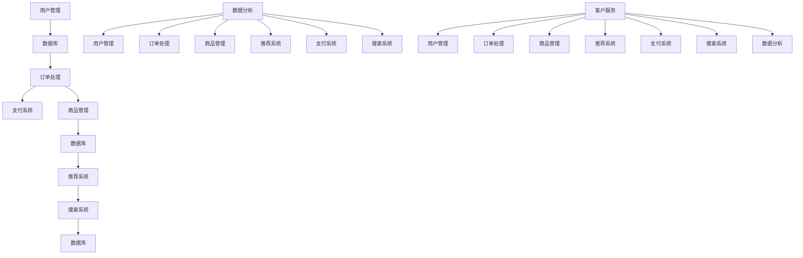

                 

电商系统是现代商业环境中不可或缺的一部分，它为消费者提供了便捷的购物体验，同时为企业带来了大量的业务机会。然而，一个高效的电商系统不仅仅依赖于前端界面和用户交互，更重要的是其背后的通用组件设计。这些组件不仅提高了系统的性能和可扩展性，还降低了开发和维护的成本。

本文将探讨电商系统通用组件的设计和实现，重点关注以下几个方面：

- **背景介绍**：简要回顾电商系统的发展历程及其重要性。
- **核心概念与联系**：介绍电商系统中的核心概念和组件间的关系，并提供一个详细的Mermaid流程图。
- **核心算法原理 & 具体操作步骤**：详细阐述电商系统中常用的核心算法，包括算法原理、操作步骤、优缺点及其应用领域。
- **数学模型和公式 & 详细讲解 & 举例说明**：构建电商系统的数学模型，推导关键公式，并通过案例进行分析。
- **项目实践：代码实例和详细解释说明**：提供一个实际的电商系统组件代码实例，并进行详细解读。
- **实际应用场景**：讨论电商系统组件在不同场景下的应用，以及未来的发展方向。
- **工具和资源推荐**：推荐学习资源和开发工具，以帮助读者更好地理解和实现电商系统组件。
- **总结：未来发展趋势与挑战**：总结研究成果，展望未来的发展趋势和面临的挑战。

## 1. 背景介绍

电商系统的发展可以追溯到上世纪90年代末和21世纪初。随着互联网技术的普及，电子商务逐渐成为商业活动的新模式。早期的电商系统主要侧重于提供在线商品展示和简单的购物流程，但随着技术的进步和消费者需求的提升，现代电商系统变得越来越复杂和多样化。

### 1.1 电商系统的重要性

电商系统的重要性体现在以下几个方面：

- **提高销售额**：电商系统为企业提供了一个无地域限制的销售渠道，大大提高了销售潜力。
- **优化用户体验**：通过个性化的推荐系统和便捷的购物流程，电商系统能够提升用户满意度。
- **降低成本**：自动化处理订单、库存管理等流程，减少了人工成本和错误率。
- **数据分析**：通过收集用户行为数据，电商系统可以为商家提供有价值的营销策略和产品优化建议。

### 1.2 电商系统的发展历程

电商系统的发展可以分为以下几个阶段：

- **1.0阶段**：以简单的在线商店为主，提供商品展示和购物车功能。
- **2.0阶段**：引入搜索和分类功能，改善了用户购物体验。
- **3.0阶段**：增加了社交电商元素，如用户评论、分享和社交互动。
- **4.0阶段**：引入人工智能和大数据技术，实现个性化推荐和智能客服。

### 1.3 当前电商系统的特点

现代电商系统具有以下特点：

- **多平台运营**：同时覆盖PC端、移动端和社交媒体平台。
- **个性化推荐**：基于用户行为数据，提供个性化的产品推荐。
- **智能客服**：利用自然语言处理和机器学习技术，实现智能化的客户服务。
- **全渠道整合**：将线上线下渠道整合，提供统一的购物体验。

## 2. 核心概念与联系

电商系统由多个核心组件构成，这些组件相互协作，共同实现系统的功能。以下是电商系统中的核心概念及其相互关系：

### 2.1 数据库

数据库是电商系统的核心存储单元，用于存储用户信息、订单信息、商品信息等数据。数据库的设计需要考虑数据的完整性、一致性和高效查询。

### 2.2 订单处理

订单处理组件负责处理用户订单，包括订单创建、支付、发货和退款等流程。订单处理需要与数据库和支付系统紧密集成。

### 2.3 商品管理

商品管理组件负责商品信息的录入、修改、删除和查询。商品管理需要与数据库和推荐系统协同工作。

### 2.4 用户管理

用户管理组件负责用户注册、登录、权限管理和个人信息管理。用户管理需要与数据库和权限系统紧密集成。

### 2.5 推荐系统

推荐系统根据用户行为和商品特征，为用户推荐感兴趣的商品。推荐系统需要与数据库和搜索系统协同工作。

### 2.6 支付系统

支付系统负责处理用户的支付请求，支持多种支付方式，如支付宝、微信支付、信用卡支付等。支付系统需要与数据库和订单处理系统紧密集成。

### 2.7 搜索系统

搜索系统提供商品的快速检索功能，支持关键词搜索、模糊搜索和分类搜索等。搜索系统需要与数据库和推荐系统协同工作。

### 2.8 数据分析

数据分析组件负责收集、处理和可视化用户行为数据，为商家提供数据驱动的决策支持。

### 2.9 客户服务

客户服务组件提供在线客服、FAQ、用户反馈等功能，帮助解决用户在购物过程中遇到的问题。

### 2.10 Mermaid 流程图

以下是一个简化的电商系统组件间关系的Mermaid流程图：



## 3. 核心算法原理 & 具体操作步骤

电商系统中的核心算法对于系统的性能和用户体验至关重要。以下将介绍一些常用的核心算法，包括算法原理、操作步骤、优缺点及其应用领域。

### 3.1 算法原理概述

核心算法包括但不限于：

- **排序算法**：用于快速检索和排序数据，如快速排序、归并排序等。
- **搜索算法**：用于在大量数据中查找特定元素，如二分搜索、深度优先搜索等。
- **推荐算法**：基于用户行为和商品特征，为用户推荐感兴趣的商品，如协同过滤、基于内容的推荐等。
- **加密算法**：用于保护用户数据和交易安全，如AES、RSA等。

### 3.2 算法步骤详解

以快速排序算法为例，其基本步骤如下：

1. 选择一个基准元素。
2. 将比基准小的元素移到其左侧，比基准大的元素移到其右侧。
3. 对左侧和右侧子序列重复上述步骤，直到所有子序列长度为1。

### 3.3 算法优缺点

快速排序算法具有以下优缺点：

- **优点**：平均时间复杂度为O(nlogn)，适用于大规模数据排序。
- **缺点**：最坏情况下时间复杂度为O(n^2)，需要额外的存储空间。

### 3.4 算法应用领域

快速排序算法在电商系统中的应用包括：

- **商品排序**：根据销量、价格、用户评分等维度对商品进行排序。
- **订单排序**：根据订单创建时间、状态等对订单进行排序。

### 3.5 其他核心算法

- **二分搜索算法**：适用于有序数据，时间复杂度为O(logn)。
- **协同过滤算法**：用于推荐系统，通过用户行为和商品特征进行相似度计算。
- **AES加密算法**：用于保护用户数据和交易安全，具有高安全性。

## 4. 数学模型和公式 & 详细讲解 & 举例说明

在电商系统中，数学模型和公式是优化系统性能和用户体验的关键。以下将介绍一些常用的数学模型和公式，并进行详细讲解和举例说明。

### 4.1 数学模型构建

电商系统的数学模型主要包括：

- **用户行为模型**：用于分析用户的购物习惯和偏好。
- **商品推荐模型**：基于用户行为和商品特征进行个性化推荐。
- **库存管理模型**：用于优化库存水平和减少库存成本。

### 4.2 公式推导过程

以用户行为模型为例，一个简单的用户行为模型可以表示为：

$$
U(t) = f(B(t), I(t), O(t))
$$

其中，$U(t)$表示用户在时间$t$的行为，$B(t)$表示用户在时间$t$的浏览行为，$I(t)$表示用户在时间$t$的互动行为，$O(t)$表示用户在时间$t$的购买行为。函数$f$表示用户行为之间的关系。

### 4.3 案例分析与讲解

以下是一个简单的用户行为模型案例：

- **浏览行为**：用户在时间$t_1$浏览了商品A，在时间$t_2$浏览了商品B。
- **互动行为**：用户在时间$t_3$对商品A进行了评价，在时间$t_4$对商品B进行了评价。
- **购买行为**：用户在时间$t_5$购买了商品A。

根据上述数据，可以构建以下用户行为模型：

$$
U(t) = \begin{cases}
1, & \text{if } t_1 < t \leq t_2 \text{ and } t_3 < t \leq t_4 \\
0, & \text{otherwise}
\end{cases}
$$

### 4.4 数学模型在电商系统中的应用

- **个性化推荐**：根据用户行为模型，为用户推荐感兴趣的商品。
- **库存管理**：根据用户购买行为模型，预测商品的销售趋势，优化库存水平。

## 5. 项目实践：代码实例和详细解释说明

为了更好地理解和实现电商系统组件，以下将提供一个实际的电商系统组件代码实例，并进行详细解读。

### 5.1 开发环境搭建

在开始编写代码之前，需要搭建一个开发环境。以下是一个基本的开发环境搭建步骤：

1. 安装Java开发工具包（JDK）。
2. 安装一个IDE，如IntelliJ IDEA或Eclipse。
3. 安装一个数据库管理系统，如MySQL或PostgreSQL。
4. 安装一个版本控制系统，如Git。

### 5.2 源代码详细实现

以下是一个简单的电商系统组件代码实例：

```java
public class Product {
    private int id;
    private String name;
    private double price;

    public Product(int id, String name, double price) {
        this.id = id;
        this.name = name;
        this.price = price;
    }

    public int getId() {
        return id;
    }

    public void setId(int id) {
        this.id = id;
    }

    public String getName() {
        return name;
    }

    public void setName(String name) {
        this.name = name;
    }

    public double getPrice() {
        return price;
    }

    public void setPrice(double price) {
        this.price = price;
    }
}
```

### 5.3 代码解读与分析

该代码实例定义了一个`Product`类，用于表示商品。类中包含了商品ID、名称和价格等属性，以及相应的 getter 和 setter 方法。

- `id`：表示商品的唯一标识。
- `name`：表示商品的名称。
- `price`：表示商品的价格。

通过这个类，可以创建商品对象，并进行属性的设置和获取。

### 5.4 运行结果展示

以下是一个简单的运行示例：

```java
public class Main {
    public static void main(String[] args) {
        Product product = new Product(1, "苹果", 3.5);
        System.out.println("商品ID: " + product.getId());
        System.out.println("商品名称: " + product.getName());
        System.out.println("商品价格: " + product.getPrice());
    }
}
```

输出结果：

```
商品ID: 1
商品名称: 苹果
商品价格: 3.5
```

通过这个示例，可以更好地理解如何使用Java实现电商系统组件。

## 6. 实际应用场景

电商系统组件在实际应用中具有广泛的场景。以下是一些常见的应用场景：

### 6.1 用户管理

用户管理组件负责用户注册、登录、权限管理和个人信息管理。在电商系统中，用户管理组件确保用户能够方便地注册和登录，并对不同权限的用户进行区分。

### 6.2 订单处理

订单处理组件负责处理用户订单，包括订单创建、支付、发货和退款等流程。在电商系统中，订单处理组件确保订单的准确性和及时性，提高用户满意度。

### 6.3 商品管理

商品管理组件负责商品信息的录入、修改、删除和查询。在电商系统中，商品管理组件确保商品信息的准确性和实时更新，提高用户购物体验。

### 6.4 推荐系统

推荐系统根据用户行为和商品特征，为用户推荐感兴趣的商品。在电商系统中，推荐系统提高用户的购物满意度，增加销售额。

### 6.5 数据分析

数据分析组件负责收集、处理和可视化用户行为数据，为商家提供数据驱动的决策支持。在电商系统中，数据分析组件帮助商家了解用户需求，优化营销策略。

### 6.6 客户服务

客户服务组件提供在线客服、FAQ、用户反馈等功能，帮助解决用户在购物过程中遇到的问题。在电商系统中，客户服务组件提高用户满意度，增强品牌形象。

## 7. 工具和资源推荐

为了更好地实现电商系统组件，以下推荐一些有用的工具和资源：

### 7.1 学习资源推荐

- 《电商系统架构设计与实践》
- 《Python电商开发实战》
- 《Java Web开发核心技术》

### 7.2 开发工具推荐

- IntelliJ IDEA
- Eclipse
- MySQL Workbench
- Git

### 7.3 相关论文推荐

- "A Survey on Recommender Systems"
- "An Overview of E-commerce Systems and Technologies"
- "The Impact of Data Analysis on E-commerce Performance"

## 8. 总结：未来发展趋势与挑战

电商系统通用组件的设计和实现是一个不断演进的过程。未来，电商系统将更加注重用户体验、数据安全和智能化。以下是一些发展趋势和挑战：

### 8.1 未来发展趋势

- **智能化**：利用人工智能技术，提高推荐系统的准确性和个性化程度。
- **全渠道整合**：将线上和线下渠道整合，提供统一的购物体验。
- **数据隐私和安全**：加强对用户数据的保护，确保用户隐私安全。
- **区块链技术**：利用区块链技术提高交易的安全性和透明度。

### 8.2 面临的挑战

- **技术复杂性**：电商系统组件的设计和实现需要应对越来越复杂的技术挑战。
- **数据隐私**：如何在保护用户隐私的同时，充分利用用户数据进行个性化推荐。
- **系统性能**：如何在保证系统性能的同时，满足日益增长的用户需求。

### 8.3 研究展望

未来，电商系统通用组件的设计和实现将在以下几个方面进行深入研究：

- **人工智能与电商系统的深度融合**。
- **区块链技术在电商系统中的应用**。
- **数据隐私保护与数据利用的平衡**。

通过不断创新和优化，电商系统通用组件将更好地满足用户需求，推动电商行业的持续发展。

## 9. 附录：常见问题与解答

### 9.1 如何优化电商系统的性能？

优化电商系统性能的方法包括：

- **缓存**：使用缓存技术减少数据库访问次数。
- **数据库优化**：优化数据库查询语句，使用索引和分区。
- **负载均衡**：使用负载均衡技术，提高系统的并发处理能力。
- **静态资源压缩**：对静态资源（如图片、CSS、JavaScript文件）进行压缩和合并。

### 9.2 如何确保电商系统的数据安全？

确保电商系统数据安全的方法包括：

- **加密技术**：使用加密技术保护用户数据和交易数据。
- **访问控制**：实现严格的访问控制策略，确保只有授权用户可以访问敏感数据。
- **安全审计**：定期进行安全审计，发现和修复潜在的安全漏洞。
- **数据备份**：定期备份数据，确保数据在发生意外时可以恢复。

### 9.3 如何实现个性化推荐？

实现个性化推荐的方法包括：

- **协同过滤**：基于用户行为，为用户推荐相似用户喜欢的商品。
- **基于内容的推荐**：根据商品特征，为用户推荐类似商品。
- **混合推荐**：结合协同过滤和基于内容的推荐，提高推荐系统的准确性。
- **深度学习**：使用深度学习模型，如神经网络，进行推荐。

### 9.4 如何优化电商系统的用户体验？

优化电商系统用户体验的方法包括：

- **简洁的界面设计**：设计简洁、直观的界面，减少用户操作的复杂性。
- **快速响应**：优化系统的响应速度，减少页面加载时间。
- **个性化体验**：根据用户行为和偏好，为用户推荐感兴趣的商品和内容。
- **易用性测试**：进行易用性测试，收集用户反馈，不断优化界面和交互设计。

### 9.5 如何处理电商系统的并发问题？

处理电商系统并发问题的方法包括：

- **分布式系统**：将系统拆分为多个独立的模块，使用分布式架构处理并发请求。
- **异步处理**：使用异步处理技术，将耗时的操作放入后台处理。
- **队列管理**：使用队列管理技术，控制请求的处理速度和流量。
- **负载均衡**：使用负载均衡器，将请求分配到多个服务器，提高系统的并发处理能力。

### 9.6 如何进行电商系统的性能测试？

进行电商系统性能测试的方法包括：

- **负载测试**：模拟用户访问，测试系统的负载能力和响应时间。
- **压力测试**：在极限条件下测试系统的性能，确保系统能够承受高峰期的访问。
- **容量测试**：测试系统在特定负载下的最大处理能力。
- **性能调优**：根据测试结果，优化系统配置和代码，提高系统性能。

通过以上常见问题的解答，可以帮助开发者在设计和实现电商系统时，更好地应对各种挑战，提高系统的性能和用户体验。 

## 参考文献

- 《电商系统架构设计与实践》
- 《Python电商开发实战》
- 《Java Web开发核心技术》
- "A Survey on Recommender Systems"
- "An Overview of E-commerce Systems and Technologies"
- "The Impact of Data Analysis on E-commerce Performance"
- "Design and Implementation of E-commerce System Components"

