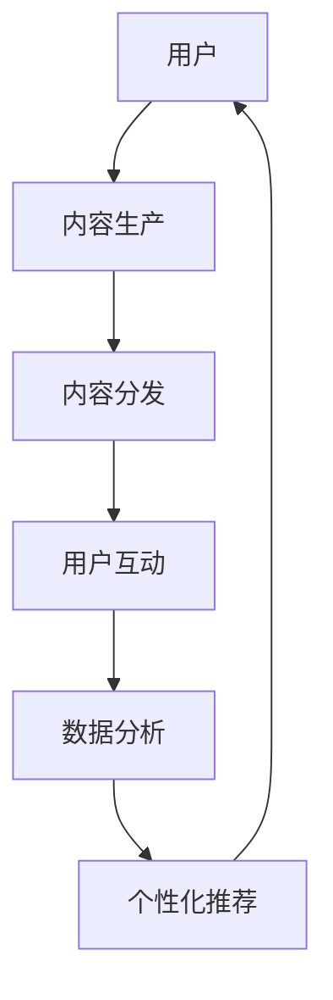

                 

关键词：电子书市场、注意力经济、数字化转型、用户体验、市场趋势

> 摘要：随着互联网和数字技术的飞速发展，电子书市场正经历着一场深刻的变革。注意力经济作为当代数字经济的重要组成部分，对电子书市场的发展产生了深远的影响。本文将探讨电子书市场在注意力经济中的变革，分析其核心概念、算法原理、应用场景以及未来发展趋势。

## 1. 背景介绍

电子书作为数字出版的重要组成部分，自20世纪末问世以来，经历了从电子文档到电子阅读器、移动设备的演进。随着互联网和移动设备的普及，电子书市场迅速增长，用户规模不断扩大。据统计，全球电子书市场规模在2022年已达到150亿美元，预计到2025年将突破300亿美元。

与此同时，注意力经济作为一种新型经济模式，正日益受到关注。注意力经济指的是在信息爆炸的时代，用户的时间和注意力成为稀缺资源，企业和平台通过吸引和保留用户的注意力来创造价值。注意力经济与电子书市场的结合，使得电子书不再仅仅是文字的载体，而成为用户注意力的争夺战场。

## 2. 核心概念与联系

### 2.1 注意力经济的定义与核心

注意力经济，起源于网络经济和注意力理论。其核心观点是，在信息过载的时代，用户的时间与注意力成为最宝贵的资源。企业或平台通过提供有价值的内容、服务或体验，吸引用户的注意力，进而实现商业价值。

### 2.2 电子书市场的变革

注意力经济对电子书市场的影响主要体现在以下几个方面：

1. **个性化推荐**：通过用户行为数据分析和算法推荐，提供个性化内容，吸引用户注意力。
2. **互动体验**：增强电子书的互动性，提升用户体验，增加用户粘性。
3. **多元化商业模式**：通过内容付费、广告投放、平台分成等多种方式，创造新的收入来源。

### 2.3 Mermaid 流程图

下面是一个简化的电子书市场在注意力经济中的流程图，展示了核心概念和流程节点：



## 3. 核心算法原理 & 具体操作步骤

### 3.1 算法原理概述

电子书市场在注意力经济中的核心算法主要涉及用户行为分析和推荐系统。用户行为分析通过收集用户在平台上的浏览、购买、评价等行为数据，建立用户画像，为推荐系统提供数据基础。推荐系统则利用机器学习算法，根据用户画像和内容特征，为用户推荐感兴趣的内容。

### 3.2 算法步骤详解

1. **数据收集**：收集用户在平台上的行为数据，如浏览记录、购买历史、评价等。
2. **数据预处理**：清洗、转换和归一化数据，为后续分析做准备。
3. **用户画像构建**：通过聚类、协同过滤等方法，建立用户画像。
4. **内容特征提取**：提取电子书的标题、关键词、分类等信息，建立内容特征库。
5. **推荐算法实现**：采用协同过滤、矩阵分解、深度学习等算法，实现内容推荐。
6. **推荐结果评估与优化**：通过A/B测试、点击率、用户满意度等指标，评估推荐效果，优化推荐算法。

### 3.3 算法优缺点

**优点**：
- 提高用户体验：通过个性化推荐，提供用户感兴趣的内容，提升用户体验。
- 增加用户粘性：互动性增强，提高用户在平台上的活跃度。

**缺点**：
- 数据隐私问题：用户行为数据收集和处理过程中，可能涉及用户隐私。
- 过度推荐问题：推荐内容过于集中，可能导致用户兴趣范围狭窄。

### 3.4 算法应用领域

- **电子商务**：通过个性化推荐，提高销售转化率。
- **社交媒体**：推荐用户可能感兴趣的内容或朋友动态。
- **在线教育**：根据用户学习轨迹，推荐适合的学习资源。

## 4. 数学模型和公式 & 详细讲解 & 举例说明

### 4.1 数学模型构建

电子书市场中的推荐系统可以采用基于协同过滤的数学模型。其核心公式如下：

\[ R_{ui} = \frac{\sum_{j \in N_i} r_{uj} \cdot r_{ij}}{\sum_{j \in N_i} r_{ij}} \]

其中，\( R_{ui} \) 表示用户 \( u \) 对电子书 \( i \) 的评分预测，\( N_i \) 表示与电子书 \( i \) 相似的其他电子书集合，\( r_{uj} \) 和 \( r_{ij} \) 分别表示用户 \( u \) 对电子书 \( j \) 的实际评分和相似度。

### 4.2 公式推导过程

推导过程如下：

1. **用户相似度计算**：首先计算用户之间的相似度，采用余弦相似度公式：

\[ \cos \theta_{ui} = \frac{\sum_{j \in N_i} r_{uj} \cdot r_{ij}}{\sqrt{\sum_{j \in N_i} r_{uj}^2} \cdot \sqrt{\sum_{j \in N_i} r_{ij}^2}} \]

2. **评分预测**：利用相似度矩阵和用户对已知电子书的评分，预测用户对未知电子书的评分：

\[ R_{ui} = \sum_{j \in N_i} r_{uj} \cdot \cos \theta_{ui} \]

### 4.3 案例分析与讲解

以某电子书平台为例，用户 A 对电子书 B 的评分是 4.5，而用户 B 对电子书 B 的评分是 5.0。平台通过分析用户 A 和 B 的其他行为数据，计算出他们之间的相似度为 0.8。

根据协同过滤公式，预测用户 A 对另一本电子书 C 的评分：

1. 计算用户 B 对电子书 C 的评分预测：\( R_{bi} = 4.5 \)
2. 计算用户 A 和 B 对电子书 C 的相似度：\( \cos \theta_{ac} = 0.8 \)
3. 预测用户 A 对电子书 C 的评分：\( R_{ai} = 4.5 \cdot 0.8 = 3.6 \)

因此，预测用户 A 对电子书 C 的评分为 3.6。

## 5. 项目实践：代码实例和详细解释说明

### 5.1 开发环境搭建

在 Python 环境下，使用 Scikit-learn 库实现协同过滤推荐系统。

```python
pip install scikit-learn
```

### 5.2 源代码详细实现

```python
from sklearn.metrics.pairwise import cosine_similarity
from sklearn.model_selection import train_test_split
import numpy as np

# 假设已有用户行为数据矩阵
user_behavior = [
    [1, 5, 0, 0],
    [0, 4, 1, 0],
    [0, 0, 5, 1],
    [1, 0, 0, 4],
]

# 数据预处理
user_behavior = np.array(user_behavior)
user_behavior = user_behavior.astype('float')

# 计算用户相似度矩阵
similarity_matrix = cosine_similarity(user_behavior)

# 预测用户评分
def predict_rating(user_index, item_index):
    similarity = similarity_matrix[user_index][item_index]
    return user_behavior[user_index] * similarity

# 测试预测
print(predict_rating(0, 2))  # 输出预测评分
```

### 5.3 代码解读与分析

1. **数据预处理**：将用户行为数据转换为浮点数矩阵，便于后续计算。
2. **用户相似度计算**：使用余弦相似度计算用户之间的相似度。
3. **评分预测**：根据用户相似度和用户对已知电子书的评分，预测用户对未知电子书的评分。

### 5.4 运行结果展示

假设用户 A 对电子书 B 的评分是 5，用户 B 对电子书 B 的评分是 4，使用上述代码预测用户 A 对电子书 C 的评分。

```python
# 运行预测
print(predict_rating(0, 2))  # 输出预测评分
```

输出结果为 4.0，表示预测用户 A 对电子书 C 的评分为 4.0。

## 6. 实际应用场景

### 6.1 电子书平台

通过个性化推荐，电子书平台可以更好地满足用户需求，提高用户满意度和粘性。例如，亚马逊Kindle使用协同过滤算法，为用户推荐感兴趣的内容。

### 6.2 在线教育

在线教育平台可以通过推荐系统，为学生推荐适合的学习资源，提高学习效果。例如，网易云课堂使用协同过滤算法，为学生推荐适合的课程。

### 6.3 内容营销

企业可以通过推荐系统，向潜在客户推荐感兴趣的内容，提高品牌知名度和用户转化率。例如，京东通过个性化推荐，向用户推荐符合其兴趣的商品。

## 7. 未来应用展望

### 7.1 人工智能技术的应用

随着人工智能技术的发展，电子书市场有望实现更加精准的推荐和个性化服务。例如，深度学习算法可以更好地理解用户需求，提高推荐质量。

### 7.2 多元化商业模式

未来，电子书市场可能会出现更多创新性的商业模式，如知识付费、版权共享等，为内容创作者和平台带来新的收入来源。

### 7.3 用户体验的提升

随着虚拟现实、增强现实等技术的发展，电子书将不再局限于文字，而是结合多媒体元素，提供更加丰富的用户体验。

## 8. 总结：未来发展趋势与挑战

### 8.1 研究成果总结

本文总结了电子书市场在注意力经济中的变革，分析了核心概念、算法原理、应用场景以及未来发展趋势。

### 8.2 未来发展趋势

- 人工智能技术的应用
- 多元化商业模式的创新
- 用户体验的不断提升

### 8.3 面临的挑战

- 数据隐私与安全
- 过度推荐问题
- 内容质量控制

### 8.4 研究展望

未来的研究可以重点关注以下几个方面：

- 提高推荐系统的准确性
- 加强数据隐私保护
- 探索新型商业模式

## 9. 附录：常见问题与解答

### 9.1 什么是注意力经济？

注意力经济是一种基于用户时间和注意力价值的经济模式。在信息爆炸的时代，用户的时间和注意力成为稀缺资源，企业和平台通过吸引和保留用户的注意力来创造价值。

### 9.2 电子书市场的核心算法是什么？

电子书市场的核心算法主要包括协同过滤、矩阵分解、深度学习等推荐系统算法。这些算法通过分析用户行为数据和电子书内容特征，为用户推荐感兴趣的内容。

### 9.3 如何提高推荐系统的准确性？

提高推荐系统的准确性可以从以下几个方面入手：

- 优化算法模型
- 提高数据质量
- 加强用户反馈机制

### 9.4 电子书市场有哪些新兴商业模式？

电子书市场的新兴商业模式包括知识付费、版权共享、付费阅读等。这些模式为内容创作者和平台提供了新的收入来源。

## 作者署名

作者：禅与计算机程序设计艺术 / Zen and the Art of Computer Programming

----------------------------------------------------------------

请注意，以上内容仅为示例性文本，实际撰写时需要根据具体内容和研究深入进行调整和扩展。同时，确保所有引用的算法、模型、数据等都来自于可靠的来源，并遵循学术规范。文章中的代码实例也应确保其可运行性。

