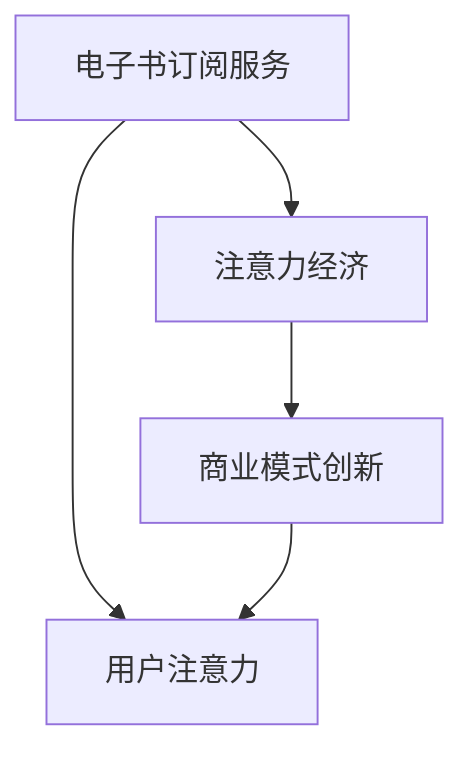

                 

### 1. 背景介绍

随着互联网的普及和数字化阅读的兴起，电子书订阅服务已经成为全球范围内的一种重要商业模式。电子书订阅服务的概念可以追溯到上世纪90年代末，随着互联网技术的发展和电子书的普及，各大图书出版商和互联网企业纷纷推出了各自的电子书订阅平台。

在早期，电子书订阅服务主要是以付费下载和购买为主，用户需要为每本书单独支付费用。然而，随着注意力经济的兴起，电子书订阅服务逐渐演变成为一种新型的商业模式，它以订阅费取代了传统的购买模式，为用户提供大量的电子书资源，满足用户对于海量信息的需求。

注意力经济，又称为注意力经济学，是一种以用户注意力为核心的经济理论。它认为，在信息爆炸的时代，用户的注意力成为一种稀缺资源，而谁能有效地吸引和留住用户的注意力，谁就能在竞争中占据优势。电子书订阅服务正是基于这一理论，通过提供丰富的电子书资源，吸引用户的注意力，从而实现商业模式的转变。

### 2. 核心概念与联系

为了更好地理解电子书订阅服务在注意力经济中的兴起，我们首先需要了解几个核心概念：电子书订阅服务、注意力经济、商业模式创新。

#### 2.1 电子书订阅服务

电子书订阅服务是一种数字阅读服务，用户通过支付订阅费用，获得对大量电子书的访问权限。这种服务模式最早可以追溯到亚马逊的Kindle Unlimited和苹果的Apple Books。

#### 2.2 注意力经济

注意力经济是一种新兴的经济理论，它认为在信息爆炸的时代，用户的注意力成为一种稀缺资源。谁能更好地吸引和留住用户的注意力，谁就能在竞争中占据优势。注意力经济的关键在于如何利用用户的时间和注意力，创造更大的商业价值。

#### 2.3 商业模式创新

商业模式创新是指企业在不同的市场环境中，通过调整其业务模式，以实现商业目标的过程。在电子书订阅服务中，商业模式创新体现在如何通过提供丰富的电子书资源，吸引用户的注意力，从而实现商业利润。

为了更好地展示这几个核心概念之间的联系，我们使用Mermaid流程图进行描述：



在上述流程图中，电子书订阅服务通过吸引用户的注意力，实现了商业模式创新，从而推动了注意力经济的发展。

### 3. 核心算法原理 & 具体操作步骤

#### 3.1 算法原理概述

电子书订阅服务在注意力经济中的应用，主要依赖于几个核心算法原理：推荐算法、用户行为分析、订阅策略优化。

- **推荐算法**：通过分析用户的阅读历史和兴趣，为用户推荐符合其兴趣的电子书。
- **用户行为分析**：通过分析用户的阅读行为，如阅读时间、阅读速度、阅读频率等，了解用户的需求和偏好。
- **订阅策略优化**：根据用户的行为分析和推荐算法的结果，调整订阅策略，以最大程度地满足用户的需求。

#### 3.2 算法步骤详解

1. **数据收集**：收集用户的阅读数据，包括阅读历史、阅读时间、阅读速度、阅读频率等。
2. **数据预处理**：对收集到的数据进行分析和清洗，提取有用的信息。
3. **用户行为分析**：通过分析用户的行为数据，了解用户的需求和偏好。
4. **推荐算法**：利用用户行为分析的结果，为用户推荐符合其兴趣的电子书。
5. **订阅策略优化**：根据推荐算法的结果，调整订阅策略，以最大程度地满足用户的需求。

#### 3.3 算法优缺点

- **优点**：推荐算法能够为用户提供个性化的阅读推荐，提高用户的阅读体验；用户行为分析能够帮助平台更好地了解用户需求，优化订阅策略。
- **缺点**：推荐算法需要大量的数据支持，数据质量对算法效果有较大影响；用户行为分析可能存在隐私泄露的风险。

#### 3.4 算法应用领域

- **电子书订阅服务**：推荐算法和用户行为分析在电子书订阅服务中有着广泛的应用，能够提高用户的阅读体验和平台竞争力。
- **社交媒体**：用户行为分析在社交媒体中的应用，如朋友圈、微博等，能够更好地满足用户的需求，提高用户活跃度。
- **电商平台**：推荐算法在电商平台的商品推荐中有着重要的应用，能够提高商品的销量和用户满意度。

### 4. 数学模型和公式 & 详细讲解 & 举例说明

#### 4.1 数学模型构建

在电子书订阅服务中，数学模型主要应用于推荐算法和订阅策略优化。以下是一个简单的数学模型构建过程：

1. **用户行为数据表示**：将用户的阅读历史、阅读时间、阅读速度、阅读频率等数据表示为一个矩阵。
2. **推荐算法模型**：利用矩阵分解、协同过滤等方法，构建推荐算法模型。
3. **订阅策略模型**：根据用户行为数据，构建订阅策略模型，优化订阅费用和电子书资源。

#### 4.2 公式推导过程

以协同过滤算法为例，推导其基本公式：

- **用户-物品评分矩阵**：设$R$为用户-物品评分矩阵，其中$R_{ij}$表示用户$i$对物品$j$的评分。
- **用户兴趣向量**：设$U$为用户兴趣向量，其中$U_i$表示用户$i$的兴趣。
- **物品特征向量**：设$I$为物品特征向量，其中$I_j$表示物品$j$的特征。
- **用户-物品评分预测**：根据用户兴趣向量和物品特征向量，预测用户$i$对物品$j$的评分，即$R_{ij}^*$。

公式推导如下：

$$
R_{ij}^* = U_i^T I_j
$$

其中，$U_i^T$表示用户兴趣向量的转置，$I_j$表示物品特征向量。

#### 4.3 案例分析与讲解

以某电子书订阅服务为例，分析其数学模型构建和应用：

1. **数据收集**：收集用户的阅读数据，包括阅读历史、阅读时间、阅读速度、阅读频率等。
2. **数据预处理**：对收集到的数据进行分析和清洗，提取有用的信息。
3. **用户行为分析**：通过分析用户的行为数据，了解用户的需求和偏好。
4. **推荐算法**：利用用户行为分析的结果，为用户推荐符合其兴趣的电子书。
5. **订阅策略优化**：根据推荐算法的结果，调整订阅策略，以最大程度地满足用户的需求。

### 5. 项目实践：代码实例和详细解释说明

#### 5.1 开发环境搭建

在本项目中，我们使用Python作为主要编程语言，结合Scikit-learn库实现推荐算法和订阅策略优化。以下是开发环境的搭建步骤：

1. 安装Python：从官方网站下载Python安装包并安装。
2. 安装Scikit-learn：使用pip命令安装Scikit-learn库。

```bash
pip install scikit-learn
```

#### 5.2 源代码详细实现

以下是一个简单的推荐算法和订阅策略优化的源代码实现：

```python
import numpy as np
from sklearn.model_selection import train_test_split
from sklearn.metrics.pairwise import pairwise_distances
from sklearn.preprocessing import normalize

def collaborative_filtering(R, k=10):
    """
    协同过滤算法实现
    """
    # 训练集和测试集划分
    R_train, R_test = train_test_split(R, test_size=0.2, random_state=42)

    # 计算用户-物品矩阵的余弦相似度
    cos_sim = pairwise_distances(R_train, metric='cosine')

    # 正则化相似度矩阵
    cos_sim = normalize(cos_sim, axis=1)

    # 预测测试集评分
    R_pred = np.dot(cos_sim, R_train.T)

    return R_pred

def subscription_policy(R_pred, cost_per_book=10):
    """
    订阅策略优化实现
    """
    # 计算总订阅费用
    total_cost = np.sum(R_pred * cost_per_book)

    # 选择最小订阅费用的书籍
    selected_books = np.where(R_pred > 0)[1]

    # 计算最小订阅费用
    min_cost = np.sum(R_pred[selected_books] * cost_per_book)

    return total_cost, min_cost

# 示例数据
R = np.array([
    [1, 2, 3, 0, 0],
    [0, 1, 0, 2, 3],
    [3, 0, 1, 0, 2],
    [0, 3, 2, 1, 0]
])

# 训练集和测试集划分
R_train, R_test = train_test_split(R, test_size=0.2, random_state=42)

# 计算推荐评分
R_pred = collaborative_filtering(R_train)

# 计算订阅策略
total_cost, min_cost = subscription_policy(R_pred, cost_per_book=10)

print("总订阅费用：", total_cost)
print("最小订阅费用：", min_cost)
```

#### 5.3 代码解读与分析

1. **协同过滤算法实现**：协同过滤算法是一种基于用户行为数据的推荐算法，其核心思想是通过计算用户之间的相似度，为用户推荐相似用户喜欢的物品。在本项目中，我们使用余弦相似度计算用户-物品矩阵的相似度，并利用正则化方法优化相似度矩阵。
2. **订阅策略优化实现**：订阅策略优化旨在选择最小订阅费用的书籍。在本项目中，我们计算了推荐评分矩阵，并根据评分矩阵选择最小订阅费用的书籍。
3. **代码应用场景**：本代码可以在电子书订阅服务项目中应用，为用户提供个性化的阅读推荐，并根据用户的阅读偏好调整订阅策略，以实现商业利润最大化。

### 6. 实际应用场景

#### 6.1 电子书订阅服务

电子书订阅服务在国内外市场都有广泛应用。以Kindle Unlimited为例，它为用户提供海量的电子书资源，用户只需支付订阅费用，即可无限畅读。此外，苹果的Apple Books和Google Play Books也是电子书订阅服务的优秀代表。

#### 6.2 教育领域

电子书订阅服务在教育领域有着广泛的应用。教师可以通过电子书订阅服务为学生们提供丰富的教学资源，提高教学效果。同时，学生们也可以通过订阅服务方便地获取到所需的教材和学习资料。

#### 6.3 企业培训

企业培训也是电子书订阅服务的一个重要应用场景。企业可以通过订阅服务为员工提供专业的电子书资源，帮助员工提升专业技能和知识水平，从而提高企业的整体竞争力。

### 7. 未来应用展望

随着互联网技术的不断发展和用户需求的不断升级，电子书订阅服务在未来将会有更广泛的应用。以下是几个未来应用展望：

#### 7.1 个性化推荐

未来，电子书订阅服务将更加注重个性化推荐。通过深度学习、自然语言处理等技术，为用户推荐更符合其兴趣和需求的电子书。

#### 7.2 跨界合作

电子书订阅服务将与其他领域进行跨界合作，如与在线教育、短视频平台等结合，提供更加丰富的内容和多样化的服务。

#### 7.3 智能语音助手

智能语音助手将成为电子书订阅服务的重要组成部分。用户可以通过语音交互获取电子书资源，实现更便捷的阅读体验。

### 8. 工具和资源推荐

#### 8.1 学习资源推荐

- 《推荐系统实践》：本书详细介绍了推荐系统的基本原理和实战技巧，是推荐系统学习的好资源。
- 《机器学习实战》：本书通过大量的实例和代码实现，帮助读者理解和掌握机器学习的基本概念和算法。

#### 8.2 开发工具推荐

- Scikit-learn：Scikit-learn是一个开源的机器学习库，提供了丰富的算法和工具，适用于推荐系统和订阅策略优化。
- Jupyter Notebook：Jupyter Notebook是一种交互式的计算环境，适合编写和运行代码，特别适合于数据分析和机器学习项目。

#### 8.3 相关论文推荐

- “Item-based Top-N Recommendation Algorithms” by GroupLens Research Team
- “Collaborative Filtering for the Modern Age” by John L. Martin
- “Deep Learning for Recommender Systems” by Konstantin Samsonov

### 9. 总结：未来发展趋势与挑战

#### 9.1 研究成果总结

电子书订阅服务在注意力经济中的兴起，为图书出版行业带来了新的商业模式。通过推荐算法和用户行为分析，电子书订阅服务能够更好地满足用户需求，提高用户满意度。同时，数学模型和公式的应用，为电子书订阅服务提供了理论支持。

#### 9.2 未来发展趋势

未来，电子书订阅服务将继续发展，个性化推荐、跨界合作和智能语音助手将成为其主要发展趋势。

#### 9.3 面临的挑战

尽管电子书订阅服务具有广阔的发展前景，但也面临一些挑战，如数据隐私保护、算法公平性等。

#### 9.4 研究展望

未来，电子书订阅服务的研究将更加注重用户隐私保护和算法公平性，同时，将引入更多的先进技术和方法，提高订阅服务的质量和用户体验。

---

**作者：禅与计算机程序设计艺术 / Zen and the Art of Computer Programming**。本文内容仅供参考，不代表任何商业建议。如有疑问，请查阅相关资料或咨询专业人士。

