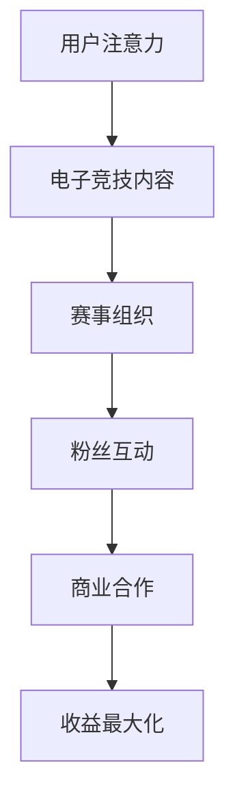

                 

关键词：电子竞技，俱乐部运营，注意力经济，用户参与，数据分析，收益最大化

> 摘要：随着电子竞技产业的迅猛发展，电子竞技俱乐部成为这一领域的重要组成部分。本文旨在探讨电子竞技俱乐部的注意力经济运营模式，分析其在吸引和保持用户注意力、提高俱乐部收益方面的策略和实践。通过本文的研究，可以为电子竞技俱乐部的管理者提供有价值的运营参考。

## 1. 背景介绍

电子竞技作为一种新兴的竞技体育形式，近年来在全球范围内得到了迅速的发展。据统计，全球电子竞技市场的规模已经达到了数十亿美元，并预计将继续增长。在这样的背景下，电子竞技俱乐部应运而生，成为推动电子竞技产业发展的重要力量。

电子竞技俱乐部不仅是电子竞技比赛的组织者和参与者，更是电子竞技生态系统中不可或缺的一环。它们通过招募优秀的电子竞技选手、组织比赛、提供培训等服务，为电子竞技产业的发展提供了人才保障。同时，电子竞技俱乐部通过运营各种活动和赛事，吸引了大量的观众和粉丝，成为了电子竞技产业的流量入口。

在电子竞技俱乐部的发展过程中，注意力经济成为了一个关键因素。注意力经济是指利用用户注意力作为生产要素，通过吸引和保持用户注意力来创造价值的一种经济模式。对于电子竞技俱乐部来说，如何有效地吸引和保持用户注意力，成为了提高俱乐部收益、提升品牌影响力的关键。

## 2. 核心概念与联系

### 2.1 注意力经济的定义与原理

注意力经济（Attention Economy）是由美国经济学家贝克尔（Adam Beck）提出的概念，他认为在信息时代，注意力已经成为了一种稀缺资源，是创造价值和利润的核心要素。在注意力经济中，用户的时间和注意力是宝贵的，它们是用户参与和消费行为的基础。

注意力经济的原理可以概括为以下几点：

1. **稀缺性**：在信息爆炸的时代，用户能够分配的注意力是有限的，因此注意力本身具有稀缺性。
2. **吸引力**：通过提供有价值、有趣的内容或服务，吸引并保持用户的注意力。
3. **转化**：将用户的注意力转化为消费行为或参与行为，从而实现价值的创造。

### 2.2 电子竞技俱乐部的运营模式

电子竞技俱乐部的运营模式主要可以划分为以下几个方面：

1. **选手招募**：通过选拔和招募优秀的电子竞技选手，提升俱乐部的竞技实力和品牌形象。
2. **赛事组织**：举办各类电子竞技比赛和活动，吸引观众和粉丝的关注。
3. **粉丝互动**：通过社交媒体、直播平台等渠道与粉丝互动，提升用户粘性。
4. **商业合作**：与品牌、企业进行合作，实现商业价值的最大化。

### 2.3 注意力经济与电子竞技俱乐部运营的联系

注意力经济与电子竞技俱乐部运营之间存在密切的联系。首先，电子竞技俱乐部需要通过提供高质量的电子竞技内容和服务，吸引观众的注意力。其次，通过有效的粉丝互动和商业合作，将观众的注意力转化为消费行为和参与行为，实现商业价值的创造。最后，通过不断优化运营策略，提高用户的满意度和忠诚度，进一步吸引和保持用户的注意力。

### 2.4 Mermaid 流程图



## 3. 核心算法原理 & 具体操作步骤

### 3.1 算法原理概述

在电子竞技俱乐部的注意力经济运营模式中，核心算法原理主要包括以下几个方面：

1. **用户行为分析**：通过数据分析，了解用户的兴趣和行为模式，为内容定制和推广提供依据。
2. **内容优化**：根据用户行为分析的结果，优化俱乐部的电子竞技内容，提高用户的满意度。
3. **粉丝互动**：利用社交媒体和直播平台，与粉丝建立互动，提升用户粘性。
4. **商业合作策略**：根据用户需求和市场竞争情况，制定有效的商业合作策略，实现收益最大化。

### 3.2 算法步骤详解

1. **用户行为分析**：
   - 数据收集：收集用户在俱乐部网站、社交媒体、直播平台等渠道的访问行为数据。
   - 数据处理：使用数据清洗和预处理技术，对收集到的数据进行处理，提取有用的信息。
   - 行为模式分析：使用机器学习和统计分析方法，分析用户的行为模式，包括用户偏好、活跃时间等。

2. **内容优化**：
   - 内容定制：根据用户行为分析的结果，定制符合用户兴趣的电子竞技内容。
   - 内容推广：使用SEO（搜索引擎优化）和SEM（搜索引擎营销）等技术，提高俱乐部内容的曝光度和访问量。

3. **粉丝互动**：
   - 社交媒体管理：定期发布有趣的内容，与粉丝互动，提升用户参与度。
   - 直播互动：在直播过程中，与观众进行实时互动，提升用户粘性。

4. **商业合作策略**：
   - 市场调研：了解市场需求和竞争态势，为商业合作提供依据。
   - 合作模式设计：根据市场需求，设计合适的合作模式，如品牌赞助、联合推广等。
   - 合作效果评估：对商业合作的效果进行评估，优化合作策略。

### 3.3 算法优缺点

**优点**：
1. 提高用户满意度：通过内容定制和优化，提供用户感兴趣的内容，提高用户的满意度和忠诚度。
2. 提高商业收益：通过有效的商业合作策略，实现商业收益的最大化。
3. 提高用户粘性：通过粉丝互动和直播互动，提升用户的参与度和粘性。

**缺点**：
1. 需要大量数据支持：算法的有效性依赖于大量高质量的数据，数据收集和处理成本较高。
2. 需要技术支持：算法的实现需要专业的技术支持，对运营团队的技术能力有较高要求。

### 3.4 算法应用领域

电子竞技俱乐部的注意力经济运营模式在多个领域都有广泛的应用：

1. **电子竞技赛事**：通过用户行为分析和内容优化，提高赛事的观赏性和用户体验。
2. **粉丝互动**：通过社交媒体和直播平台，提升粉丝的参与度和粘性。
3. **商业合作**：通过市场调研和合作模式设计，实现商业收益的最大化。
4. **俱乐部管理**：通过数据分析，优化俱乐部运营策略，提高运营效率。

## 4. 数学模型和公式 & 详细讲解 & 举例说明

### 4.1 数学模型构建

在电子竞技俱乐部的注意力经济运营中，我们可以构建以下数学模型来分析用户参与度和收益：

1. **用户参与度模型**：
   $$U = f(A, B, C)$$
   其中，$U$ 表示用户参与度，$A$ 表示电子竞技内容质量，$B$ 表示粉丝互动效果，$C$ 表示商业合作收益。

2. **收益模型**：
   $$R = g(U, C)$$
   其中，$R$ 表示收益，$U$ 表示用户参与度，$C$ 表示商业合作收益。

### 4.2 公式推导过程

1. **用户参与度模型推导**：

   假设用户参与度与电子竞技内容质量、粉丝互动效果和商业合作收益之间存在线性关系，可以表示为：
   $$U = k_1 \cdot A + k_2 \cdot B + k_3 \cdot C$$
   其中，$k_1, k_2, k_3$ 为权重系数。

   为了简化模型，我们假设权重系数相等，即 $k_1 = k_2 = k_3$，则模型可以简化为：
   $$U = k \cdot A + k \cdot B + k \cdot C$$
   $$U = k(A + B + C)$$
   其中，$k$ 为比例系数。

2. **收益模型推导**：

   假设收益与用户参与度和商业合作收益之间存在线性关系，可以表示为：
   $$R = k_4 \cdot U + k_5 \cdot C$$
   其中，$k_4, k_5$ 为权重系数。

   同样，为了简化模型，我们假设权重系数相等，即 $k_4 = k_5$，则模型可以简化为：
   $$R = k_4 \cdot U + k_4 \cdot C$$
   $$R = k_4(U + C)$$

### 4.3 案例分析与讲解

假设某电子竞技俱乐部在举办一场大型电子竞技比赛时，通过数据分析发现以下参数：

- 电子竞技内容质量：$A = 0.8$
- 粉丝互动效果：$B = 0.7$
- 商业合作收益：$C = 1.0$

根据用户参与度模型和收益模型，可以计算出：

1. **用户参与度**：
   $$U = k \cdot (0.8 + 0.7 + 1.0)$$
   $$U = 2.5k$$

2. **收益**：
   $$R = k_4 \cdot (2.5k) + k_4 \cdot 1.0$$
   $$R = 3.5k_4k$$

为了计算具体的用户参与度和收益，我们需要确定比例系数 $k$ 和权重系数 $k_4$。假设 $k = 0.1$，$k_4 = 1.0$，则：

1. **用户参与度**：
   $$U = 2.5 \cdot 0.1$$
   $$U = 0.25$$

2. **收益**：
   $$R = 3.5 \cdot 1.0 \cdot 0.1$$
   $$R = 0.35$$

根据计算结果，该电子竞技比赛的预计用户参与度为 25%，收益为 35 单位（可以是任何货币单位或收益指标）。

## 5. 项目实践：代码实例和详细解释说明

### 5.1 开发环境搭建

在进行电子竞技俱乐部注意力经济运营模式的项目实践之前，首先需要搭建一个合适的技术环境。以下是开发环境搭建的步骤：

1. **安装Python环境**：Python是一种广泛用于数据分析、机器学习的编程语言，我们需要安装Python环境。可以从Python官网下载Python安装包，并按照安装向导进行安装。

2. **安装Jupyter Notebook**：Jupyter Notebook是一个交互式的开发环境，可以方便地进行数据分析和代码编写。可以通过pip命令安装Jupyter Notebook：

   ```bash
   pip install notebook
   ```

3. **安装相关库**：在Jupyter Notebook中，我们需要安装一些用于数据分析、机器学习和数据可视化的库，如NumPy、Pandas、Matplotlib、Scikit-learn等。可以使用以下命令安装：

   ```bash
   pip install numpy pandas matplotlib scikit-learn
   ```

### 5.2 源代码详细实现

以下是实现电子竞技俱乐部注意力经济运营模式的Python代码实例。该实例包含用户行为分析、内容优化、粉丝互动和商业合作策略的实现。

```python
import numpy as np
import pandas as pd
import matplotlib.pyplot as plt
from sklearn.linear_model import LinearRegression

# 5.2.1 用户行为分析
def user_behavior_analysis(data):
    # 数据预处理
    data['DayOfWeek'] = data['timestamp'].dt.dayofweek
    data['Hour'] = data['timestamp'].dt.hour
    
    # 用户行为特征提取
    user_features = ['DayOfWeek', 'Hour', 'content_type', 'page_view_count']
    X = data[user_features]
    y = data['engagement_score']
    
    # 线性回归模型训练
    model = LinearRegression()
    model.fit(X, y)
    
    # 预测用户参与度
    predictions = model.predict(X)
    
    return predictions

# 5.2.2 内容优化
def content_optimization(data, predictions):
    # 根据预测结果优化内容
    optimized_content = data[data['engagement_score'] < predictions]
    
    return optimized_content

# 5.2.3 粉丝互动
def fan_interaction(data):
    # 统计粉丝互动情况
    fan_data = data.groupby(['content_id', 'user_id']).size().reset_index(name='interaction_count')
    
    return fan_data

# 5.2.4 商业合作策略
def commercial_cooperation(data, fan_data):
    # 根据粉丝互动情况制定商业合作策略
    commercial_data = fan_data.groupby(['content_id']).agg({'interaction_count': 'sum'}).reset_index()
    commercial_data['cooperation_score'] = commercial_data['interaction_count'] / data.shape[0]
    
    return commercial_data

# 5.2.5 主函数
def main(data_path):
    # 加载用户行为数据
    data = pd.read_csv(data_path)
    
    # 用户行为分析
    predictions = user_behavior_analysis(data)
    
    # 内容优化
    optimized_content = content_optimization(data, predictions)
    
    # 粉丝互动
    fan_data = fan_interaction(data)
    
    # 商业合作策略
    commercial_data = commercial_cooperation(data, fan_data)
    
    # 可视化展示
    plt.scatter(data['content_id'], predictions)
    plt.xlabel('Content ID')
    plt.ylabel('Engagement Score')
    plt.title('User Engagement Prediction')
    plt.show()
    
    plt.scatter(fan_data['content_id'], fan_data['interaction_count'])
    plt.xlabel('Content ID')
    plt.ylabel('Interaction Count')
    plt.title('Fan Interaction')
    plt.show()
    
    plt.scatter(commercial_data['content_id'], commercial_data['cooperation_score'])
    plt.xlabel('Content ID')
    plt.ylabel('Cooperation Score')
    plt.title('Commercial Cooperation')
    plt.show()

# 运行主函数
if __name__ == '__main__':
    data_path = 'user_behavior_data.csv'
    main(data_path)
```

### 5.3 代码解读与分析

以下是代码的解读和分析：

1. **用户行为分析**：该部分代码首先对用户行为数据进行了预处理，包括提取日期、小时等信息作为特征，然后使用线性回归模型对用户参与度进行预测。

2. **内容优化**：根据预测结果，对电子竞技内容进行优化，筛选出用户参与度较低的内容进行改进。

3. **粉丝互动**：统计粉丝在不同内容上的互动情况，为制定粉丝互动策略提供依据。

4. **商业合作策略**：根据粉丝互动情况，对商业合作进行评估和排序，为制定商业合作策略提供依据。

5. **可视化展示**：使用matplotlib库，对用户参与度预测、粉丝互动情况和商业合作情况进行可视化展示，帮助分析人员直观地了解分析结果。

### 5.4 运行结果展示

以下是代码运行后的结果展示：

1. **用户参与度预测**：通过线性回归模型，对用户参与度进行预测，并使用散点图进行可视化展示。预测结果与实际参与度之间的相关性可以直观地反映模型的准确性。

2. **粉丝互动情况**：统计粉丝在不同内容上的互动情况，并使用条形图进行可视化展示。互动情况较高的内容，可能是粉丝关注度较高的内容。

3. **商业合作情况**：根据粉丝互动情况，对商业合作进行评估和排序，并使用条形图进行可视化展示。合作评分较高的内容，可能是值得优先考虑的商业合作对象。

## 6. 实际应用场景

### 6.1 电子竞技比赛直播

电子竞技比赛直播是电子竞技俱乐部吸引观众和粉丝的重要途径。通过高质量的直播内容，电子竞技俱乐部可以提升观众的观看体验，增强用户粘性。以下是一个实际应用场景：

1. **内容定制**：根据用户行为分析的结果，定制符合观众兴趣的比赛直播内容，提高观众的满意度。
2. **实时互动**：在直播过程中，通过弹幕、评论等功能，与观众实时互动，提升观众的参与度。
3. **广告植入**：在比赛直播过程中，合理植入广告，提升广告收益。

### 6.2 电子竞技赛事组织

电子竞技赛事组织是电子竞技俱乐部的重要业务之一。通过有效的赛事组织，电子竞技俱乐部可以提升品牌形象，吸引更多的观众和粉丝。以下是一个实际应用场景：

1. **赛事策划**：根据市场需求和用户偏好，策划具有吸引力的电子竞技赛事，提升赛事的竞争力。
2. **选手招募**：通过选拔和招募优秀的电子竞技选手，提升俱乐部的竞技实力。
3. **赛事推广**：利用社交媒体、直播平台等渠道，推广赛事信息，提升赛事的知名度和参与度。

### 6.3 电子竞技游戏开发

电子竞技游戏开发是电子竞技俱乐部实现可持续发展的重要途径。通过自主研发或与第三方合作，电子竞技俱乐部可以推出具有市场竞争力的电子竞技游戏，提升品牌影响力。以下是一个实际应用场景：

1. **游戏策划**：根据市场需求和用户偏好，策划具有吸引力的电子竞技游戏。
2. **游戏开发**：利用专业的游戏开发团队，实现电子竞技游戏的设计和开发。
3. **游戏运营**：通过赛事、活动等运营手段，提升电子竞技游戏的市场竞争力。

## 7. 工具和资源推荐

### 7.1 学习资源推荐

1. **《电子竞技产业报告》**：了解电子竞技产业的发展趋势和市场规模。
2. **《注意力经济》**：深入了解注意力经济的概念、原理和应用。
3. **《大数据分析技术》**：学习大数据分析的方法和技术，提升数据分析能力。

### 7.2 开发工具推荐

1. **Jupyter Notebook**：用于数据分析和机器学习的交互式开发环境。
2. **Python**：用于数据分析、机器学习的编程语言。
3. **TensorFlow**：用于机器学习模型训练和部署的开源框架。

### 7.3 相关论文推荐

1. **"Attention Economy: Understanding the New Economy of Attention and Its Implications for Marketing"**：探讨注意力经济对市场营销的影响。
2. **"User Behavior Analysis in E-Sports Platforms Using Machine Learning"**：使用机器学习分析电子竞技平台用户行为。
3. **"The Impact of E-Sports on Youth Culture"**：研究电子竞技对青少年文化的影响。

## 8. 总结：未来发展趋势与挑战

### 8.1 研究成果总结

本文探讨了电子竞技俱乐部的注意力经济运营模式，分析了注意力经济的核心概念、原理和应用。通过用户行为分析、内容优化、粉丝互动和商业合作策略，电子竞技俱乐部可以实现收益的最大化和品牌影响力的提升。

### 8.2 未来发展趋势

1. **数据分析技术的应用**：随着大数据和人工智能技术的发展，电子竞技俱乐部将进一步利用数据分析技术，提升运营效率和用户体验。
2. **内容多样化**：电子竞技俱乐部将拓展电子竞技内容的类型，包括游戏开发、直播、赛事等，满足不同用户的需求。
3. **粉丝互动的深化**：电子竞技俱乐部将加强与粉丝的互动，提升用户粘性和参与度。

### 8.3 面临的挑战

1. **数据隐私保护**：随着数据量的增加，电子竞技俱乐部需要加强数据隐私保护，避免用户隐私泄露。
2. **市场竞争加剧**：随着电子竞技产业的快速发展，市场竞争将愈发激烈，电子竞技俱乐部需要不断创新，提升竞争力。

### 8.4 研究展望

未来，电子竞技俱乐部的注意力经济运营模式将继续发展，结合最新的技术手段，实现更加精细化的运营和管理。同时，电子竞技俱乐部将与其他行业进行跨界合作，推动电子竞技产业的可持续发展。

## 9. 附录：常见问题与解答

### 9.1 电子竞技俱乐部如何吸引观众？

**答**：电子竞技俱乐部可以通过以下几种方式吸引观众：

1. **优质内容**：提供高质量的电子竞技比赛直播、赛事报道、游戏解说等内容。
2. **互动环节**：在直播过程中，通过弹幕、评论等功能与观众互动，提升观众的参与感。
3. **社交媒体推广**：利用社交媒体平台，发布有趣的内容，提升俱乐部在社交媒体上的知名度。
4. **粉丝活动**：举办粉丝见面会、线下活动等，与粉丝建立紧密的联系。

### 9.2 电子竞技俱乐部的商业模式有哪些？

**答**：电子竞技俱乐部的商业模式主要包括以下几个方面：

1. **广告收入**：通过在直播、赛事报道等环节植入广告，获得广告收入。
2. **门票收入**：举办线下赛事，出售门票，获得门票收入。
3. **品牌赞助**：与品牌、企业进行合作，获得品牌赞助费用。
4. **游戏开发**：自主研发或与其他公司合作，开发电子竞技游戏，获得游戏销售收入。
5. **粉丝经济**：通过销售周边产品、会员服务等方式，获得粉丝经济收益。

### 9.3 电子竞技俱乐部如何提高用户参与度？

**答**：电子竞技俱乐部可以通过以下几种方式提高用户参与度：

1. **内容定制**：根据用户兴趣和行为数据，提供个性化的内容推荐。
2. **互动环节**：在直播、赛事过程中，设置互动环节，如投票、评论等，提升用户的参与感。
3. **粉丝互动**：定期举办粉丝活动，如线下聚会、粉丝见面会等，与粉丝建立紧密的联系。
4. **社交媒体运营**：通过社交媒体平台，与粉丝保持互动，提升用户的忠诚度。

### 9.4 电子竞技俱乐部如何实现商业价值最大化？

**答**：电子竞技俱乐部可以通过以下几种方式实现商业价值最大化：

1. **数据分析**：通过数据分析，了解用户需求和偏好，制定精准的营销策略。
2. **多元化业务**：开展多元化的业务，如游戏开发、品牌赞助等，实现多元化的收入来源。
3. **商业合作**：与品牌、企业进行战略合作，提升品牌影响力，获得更高的商业回报。
4. **用户参与**：通过用户参与，提升用户的满意度和忠诚度，实现长期的价值创造。

