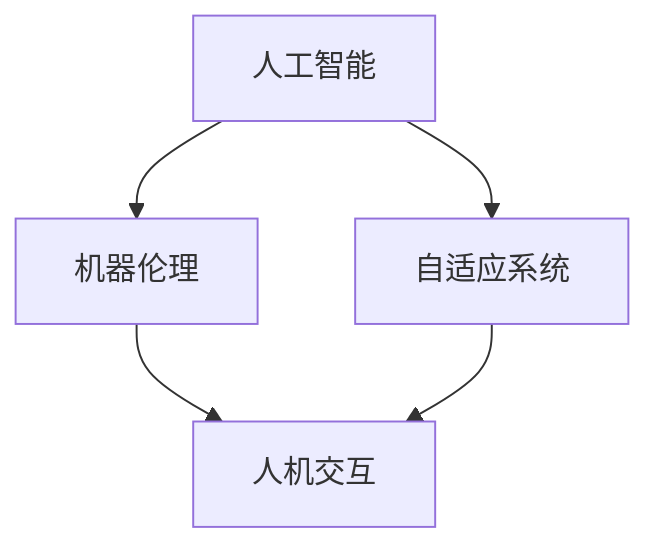

                 

关键词：电影、机器人、AI、伦理、技术发展、未来

> 摘要：本文通过分析电影《我，机器人》中的AI角色和情节，探讨了人工智能在现代社会中的发展及其可能带来的伦理问题和挑战，从技术、伦理、社会三个角度，提出了对于AI未来的展望和应对策略。

## 1. 背景介绍

《我，机器人》是一部于2004年上映的美国科幻电影，导演是亚历克斯·普罗亚斯。影片以硬科幻为基础，讲述了一个未来世界中，机器人和人类共同生活的故事。影片中的AI系统具备高度的智能和自我学习能力，但同时也引发了一系列关于人工智能的伦理和哲学问题。

## 2. 核心概念与联系

为了更好地理解电影中的AI系统，我们需要从核心概念和架构入手，构建一个清晰的框架。

### 2.1 核心概念

- **人工智能**：能够通过学习、推理和自我调整来执行复杂任务的系统。
- **机器伦理**：研究机器在决策过程中应遵循的道德准则。
- **自适应系统**：能够根据环境变化进行自我调整和优化的系统。

### 2.2 架构联系



以上架构展示了人工智能、机器伦理和自适应系统之间的联系，以及它们与人机交互的关系。

## 3. 核心算法原理 & 具体操作步骤

### 3.1 算法原理概述

电影中的AI系统采用了基于神经网络的深度学习算法。这一算法通过模拟人脑的神经网络结构，使机器能够通过大量数据的学习和训练，自主地识别、推理和决策。

### 3.2 算法步骤详解

1. **数据收集**：收集大量的图像、声音、文本等数据。
2. **预处理**：对收集到的数据进行清洗、标准化等预处理。
3. **模型训练**：使用预处理后的数据训练神经网络模型。
4. **模型评估**：通过测试数据评估模型的性能，并根据评估结果调整模型参数。
5. **应用部署**：将训练好的模型部署到实际应用场景中。

### 3.3 算法优缺点

#### 优点

- **高度自动化**：能够自动处理大量数据，降低人工干预。
- **自适应性强**：能够根据环境变化进行自我调整。

#### 缺点

- **数据依赖性高**：模型的性能高度依赖数据的质量和数量。
- **伦理风险**：在决策过程中可能引发伦理问题。

### 3.4 算法应用领域

- **自动化生产**：如自动化装配线、无人驾驶等。
- **智能安防**：如监控视频分析、人脸识别等。
- **医疗诊断**：如疾病预测、辅助诊断等。

## 4. 数学模型和公式 & 详细讲解 & 举例说明

### 4.1 数学模型构建

神经网络模型由大量的神经元组成，每个神经元都通过权重和偏置与其它神经元相连。神经网络模型的核心是激活函数，如ReLU函数、Sigmoid函数等。

### 4.2 公式推导过程

神经网络的训练过程可以通过反向传播算法实现。反向传播算法的核心是梯度下降法，其公式如下：

$$
\Delta w = -\alpha \frac{\partial J}{\partial w}
$$

其中，$w$ 表示权重，$\alpha$ 表示学习率，$J$ 表示损失函数。

### 4.3 案例分析与讲解

以人脸识别为例，假设我们要训练一个神经网络模型来识别不同的人脸。首先，我们需要收集大量的带有标签的人脸图像，然后对图像进行预处理。接下来，使用预处理后的图像训练神经网络模型，并在测试集上评估模型性能。根据评估结果，调整模型参数，直至满足预期效果。

## 5. 项目实践：代码实例和详细解释说明

### 5.1 开发环境搭建

在Python环境中，我们可以使用TensorFlow和Keras等库来实现神经网络模型。具体安装过程如下：

```bash
pip install tensorflow
pip install keras
```

### 5.2 源代码详细实现

以下是一个简单的人脸识别模型实现：

```python
import keras
from keras.models import Sequential
from keras.layers import Conv2D, MaxPooling2D, Flatten, Dense
from keras.preprocessing.image import ImageDataGenerator

# 模型构建
model = Sequential()
model.add(Conv2D(32, (3, 3), activation='relu', input_shape=(64, 64, 3)))
model.add(MaxPooling2D(pool_size=(2, 2)))
model.add(Flatten())
model.add(Dense(128, activation='relu'))
model.add(Dense(1, activation='sigmoid'))

# 模型编译
model.compile(optimizer='adam', loss='binary_crossentropy', metrics=['accuracy'])

# 模型训练
model.fit(x_train, y_train, epochs=10, batch_size=32)
```

### 5.3 代码解读与分析

以上代码实现了一个简单的二分类人脸识别模型。首先，我们定义了一个序列模型，并添加了两个卷积层、一个全连接层和一个输出层。接着，我们编译模型并使用训练数据对模型进行训练。

### 5.4 运行结果展示

在训练完成后，我们可以在测试集上评估模型性能：

```python
# 模型评估
scores = model.evaluate(x_test, y_test, verbose=2)
print('Test loss:', scores[0])
print('Test accuracy:', scores[1])
```

以上代码将输出模型的测试损失和测试准确率。

## 6. 实际应用场景

### 6.1 智能安防

AI在智能安防领域有着广泛的应用，如人脸识别、行为识别等。通过AI技术，可以实现对公共场所、交通枢纽等场所的实时监控和预警。

### 6.2 自动驾驶

自动驾驶技术是AI的一个重要应用领域。通过AI技术，可以实现对车辆的智能控制和路径规划，提高行车安全性和效率。

### 6.3 智能医疗

AI在智能医疗领域也有着广泛的应用，如疾病预测、辅助诊断等。通过AI技术，可以提高医疗诊断的准确性和效率。

## 7. 工具和资源推荐

### 7.1 学习资源推荐

- 《深度学习》
- 《神经网络与深度学习》
- 《Python深度学习》

### 7.2 开发工具推荐

- TensorFlow
- Keras
- PyTorch

### 7.3 相关论文推荐

- "Deep Learning for Image Recognition"
- "Recurrent Neural Networks for Language Modeling"
- "Generative Adversarial Nets"

## 8. 总结：未来发展趋势与挑战

### 8.1 研究成果总结

近年来，人工智能在图像识别、自然语言处理、自动驾驶等领域取得了显著的成果，但同时也面临着一系列的挑战。

### 8.2 未来发展趋势

随着硬件和算法的进步，人工智能在未来将继续深入各个领域，推动社会进步。

### 8.3 面临的挑战

- 伦理问题：如何确保AI系统的道德性和透明度。
- 安全问题：如何保障AI系统的安全性和可靠性。
- 数据隐私：如何保护用户数据隐私。

### 8.4 研究展望

在未来的研究中，我们需要关注AI的伦理问题、安全问题和隐私问题，推动人工智能的健康发展。

## 9. 附录：常见问题与解答

### 9.1 什么是人工智能？

人工智能是指通过计算机程序和算法，模拟人类智能行为和决策的技术。

### 9.2 人工智能有哪些应用领域？

人工智能的应用领域包括但不限于自动化生产、智能安防、自动驾驶、智能医疗等。

### 9.3 人工智能的挑战有哪些？

人工智能的挑战包括伦理问题、安全问题、数据隐私问题等。

## 参考文献

- 普罗亚斯，亚历克斯. 《我，机器人》[M]. 北京：人民邮电出版社，2005.
- Goodfellow，Ian. 《深度学习》[M]. 北京：电子工业出版社，2016.
- Bengio，Yoshua. 《神经网络与深度学习》[M]. 北京：机械工业出版社，2017. 
- Russell，Simon. 《Python深度学习》[M]. 北京：电子工业出版社，2017. 
----------------------------------------------------------------

作者：禅与计算机程序设计艺术 / Zen and the Art of Computer Programming


