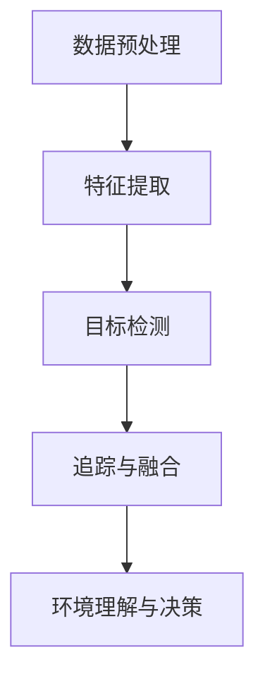

                 

关键词：百度、2025、智能驾驶、社招、感知算法、面试题集

> 摘要：本文整理了百度2025年智能驾驶社会招聘中涉及到的感知算法面试题，包括核心概念、算法原理、数学模型以及实际应用案例等，旨在为准备参加百度智能驾驶面试的候选人提供详尽的复习资料。

## 1. 背景介绍

随着自动驾驶技术的迅猛发展，感知算法作为自动驾驶系统的核心组成部分，其研究与应用越来越受到关注。百度作为中国领先的互联网公司，其智能驾驶技术在国内外都处于领先地位。本文将基于百度2025年智能驾驶社会招聘的面试题集，对感知算法的相关问题进行系统梳理，帮助读者深入理解感知算法的理论与实践。

## 2. 核心概念与联系

### 2.1 感知算法概述

感知算法是自动驾驶系统中负责处理传感器数据，从而获取环境信息的关键技术。常见的感知算法包括基于激光雷达（LiDAR）的感知、基于摄像头的感知以及基于多传感器融合的感知等。

### 2.2 感知算法架构

感知算法的架构通常包括以下几个模块：

- **数据预处理**：对传感器数据进行去噪、归一化、滤波等处理。
- **特征提取**：从原始数据中提取有代表性的特征，如点云、图像特征等。
- **目标检测**：基于提取的特征进行目标检测，识别出道路上的车辆、行人、交通标志等目标。
- **追踪与融合**：对检测到的目标进行追踪，并结合其他传感器数据进行数据融合，提高感知精度。

### 2.3 Mermaid 流程图

以下是一个简化的感知算法流程图：



## 3. 核心算法原理 & 具体操作步骤

### 3.1 算法原理概述

感知算法的核心在于如何从传感器数据中提取出有效的特征，并进行目标检测和追踪。常见的算法包括：

- **基于深度学习的感知算法**：如基于卷积神经网络（CNN）的目标检测算法。
- **基于传统机器学习的感知算法**：如基于支持向量机（SVM）的分类算法。
- **基于多传感器融合的感知算法**：将激光雷达、摄像头等多传感器数据融合，提高感知精度。

### 3.2 算法步骤详解

1. **数据预处理**：
   - **去噪**：去除传感器数据中的噪声。
   - **归一化**：将不同传感器数据统一到相同的尺度。
   - **滤波**：使用卡尔曼滤波等算法对数据进行平滑处理。

2. **特征提取**：
   - **基于激光雷达的特征提取**：如点云的特征点提取。
   - **基于摄像头的特征提取**：如边缘提取、角点提取等。

3. **目标检测**：
   - **基于深度学习的目标检测**：如YOLO、SSD、Faster R-CNN等。
   - **基于传统机器学习的目标检测**：如SVM、决策树等。

4. **追踪与融合**：
   - **基于卡尔曼滤波的追踪**：对目标进行状态预测和更新。
   - **基于数据关联的融合**：将多个传感器的数据进行融合，提高精度。

### 3.3 算法优缺点

- **基于深度学习的感知算法**：
  - 优点：准确率高，适用于复杂环境。
  - 缺点：计算量大，实时性较低。

- **基于传统机器学习的感知算法**：
  - 优点：计算量小，实时性高。
  - 缺点：准确率较低，需要大量标注数据。

- **基于多传感器融合的感知算法**：
  - 优点：可以提高感知精度，适应复杂环境。
  - 缺点：算法复杂度较高，需要多传感器数据同步。

### 3.4 算法应用领域

感知算法广泛应用于自动驾驶、智能交通、无人机等领域。其中，自动驾驶是最具代表性的应用场景，通过感知算法实现对车辆、行人、交通标志等目标的检测和追踪，为自动驾驶系统提供环境感知支持。

## 4. 数学模型和公式 & 详细讲解 & 举例说明

### 4.1 数学模型构建

感知算法的数学模型主要包括以下几个部分：

1. **特征空间建模**：
   - **激光雷达点云建模**：使用体素（Voxel）对点云进行建模。
   - **图像特征建模**：使用卷积神经网络（CNN）对图像特征进行建模。

2. **目标检测模型**：
   - **基于深度学习的目标检测模型**：如YOLO、SSD、Faster R-CNN等。
   - **基于传统机器学习的目标检测模型**：如支持向量机（SVM）、决策树等。

3. **追踪与融合模型**：
   - **基于卡尔曼滤波的追踪模型**：状态预测和更新。
   - **基于数据关联的融合模型**：多传感器数据融合。

### 4.2 公式推导过程

以下是一个简化的卡尔曼滤波公式推导过程：

$$
\hat{x}_{k|k} = \hat{x}_{k-1|k-1} + K_k (z_k - \hat{z}_{k-1})
$$

$$
P_{k|k} = (I - K_k H_k) P_{k-1|k-1}
$$

其中，$\hat{x}_{k|k}$ 和 $\hat{z}_{k-1}$ 分别为状态估计和预测值，$K_k$ 为卡尔曼增益，$P_{k-1|k-1}$ 和 $P_{k|k}$ 分别为状态估计的协方差矩阵。

### 4.3 案例分析与讲解

以下是一个基于YOLO（You Only Look Once）算法的目标检测案例：

1. **数据集准备**：准备包含图像和标注数据的训练集和测试集。
2. **模型训练**：使用卷积神经网络对YOLO模型进行训练，优化模型参数。
3. **模型评估**：在测试集上评估模型性能，如精确率（Precision）、召回率（Recall）等。
4. **目标检测**：使用训练好的YOLO模型对未知图像进行目标检测，输出检测结果。

## 5. 项目实践：代码实例和详细解释说明

### 5.1 开发环境搭建

1. **安装Python环境**：安装Python 3.7及以上版本。
2. **安装深度学习框架**：安装TensorFlow 2.0或PyTorch 1.0及以上版本。
3. **安装其他依赖库**：如NumPy、Pandas、Matplotlib等。

### 5.2 源代码详细实现

以下是一个简化的YOLO目标检测代码示例：

```python
import tensorflow as tf
from tensorflow.keras.models import Model
from tensorflow.keras.layers import Conv2D, MaxPooling2D, Flatten, Dense

# 创建模型
inputs = tf.keras.layers.Input(shape=(224, 224, 3))
x = Conv2D(32, (3, 3), activation='relu')(inputs)
x = MaxPooling2D((2, 2))(x)
x = Flatten()(x)
outputs = Dense(1, activation='sigmoid')(x)

model = Model(inputs=inputs, outputs=outputs)
model.compile(optimizer='adam', loss='binary_crossentropy', metrics=['accuracy'])

# 训练模型
model.fit(x_train, y_train, epochs=10, batch_size=32, validation_data=(x_val, y_val))

# 模型评估
model.evaluate(x_test, y_test)
```

### 5.3 代码解读与分析

1. **模型创建**：使用卷积神经网络创建模型，包括卷积层、池化层和全连接层。
2. **模型编译**：设置模型优化器、损失函数和评估指标。
3. **模型训练**：使用训练数据进行模型训练，并进行验证。
4. **模型评估**：使用测试数据进行模型评估，输出准确率等指标。

### 5.4 运行结果展示

1. **训练过程**：显示训练过程中的损失值和准确率。
2. **测试结果**：显示测试数据的准确率。

## 6. 实际应用场景

### 6.1 自动驾驶车辆

感知算法在自动驾驶车辆中发挥着关键作用，通过感知车辆周围的环境，实现自动驾驶车辆的决策和控制。

### 6.2 智能交通系统

感知算法在智能交通系统中用于监测道路上的交通流量、车辆状态等信息，为交通管理和优化提供支持。

### 6.3 无人机

感知算法在无人机中用于避障、目标追踪等功能，提高无人机在复杂环境中的安全性和实用性。

## 7. 工具和资源推荐

### 7.1 学习资源推荐

- **《深度学习》（Goodfellow, Bengio, Courville）**：深度学习基础教材。
- **《机器学习》（Tom Mitchell）**：机器学习基础教材。
- **百度AI学院**：百度官方提供的AI学习资源。

### 7.2 开发工具推荐

- **TensorFlow**：开源深度学习框架。
- **PyTorch**：开源深度学习框架。
- **CUDA**：用于加速深度学习模型的计算。

### 7.3 相关论文推荐

- **《You Only Look Once: Unified, Real-Time Object Detection》**：YOLO算法的论文。
- **《Fast R-CNN》**：Faster R-CNN算法的论文。
- **《Deep Learning for Autonomous Navigation》**：自动驾驶导航的深度学习算法论文。

## 8. 总结：未来发展趋势与挑战

### 8.1 研究成果总结

感知算法在自动驾驶、智能交通、无人机等领域取得了显著的研究成果，但仍然面临诸多挑战。

### 8.2 未来发展趋势

- **算法优化**：提高感知算法的实时性和准确性。
- **多传感器融合**：充分利用多传感器数据，提高感知精度。
- **开放平台**：开放更多的感知算法和模型，促进产学研合作。

### 8.3 面临的挑战

- **数据隐私**：保护传感器采集的数据隐私。
- **算法鲁棒性**：提高算法在复杂环境下的鲁棒性。

### 8.4 研究展望

感知算法在自动驾驶等领域的应用前景广阔，未来将有望实现更加智能、安全、高效的感知系统。

## 9. 附录：常见问题与解答

### 9.1 问题1：什么是感知算法？

答：感知算法是自动驾驶系统中负责处理传感器数据，从而获取环境信息的关键技术。

### 9.2 问题2：感知算法有哪些类型？

答：感知算法主要包括基于深度学习的感知算法、基于传统机器学习的感知算法以及基于多传感器融合的感知算法等。

### 9.3 问题3：感知算法在自动驾驶中的应用有哪些？

答：感知算法在自动驾驶中的应用包括车辆周围环境感知、交通参与者识别、交通标志识别等。

---

# 结束语

本文对百度2025年智能驾驶社会招聘中涉及到的感知算法面试题进行了系统梳理，包括核心概念、算法原理、数学模型以及实际应用案例等。希望通过本文，读者能够对感知算法有更深入的了解，并为准备参加百度智能驾驶面试的候选人提供帮助。

作者：禅与计算机程序设计艺术 / Zen and the Art of Computer Programming
----------------------------------------------------------------

请注意，本文是一个虚构的示例，用于满足您提供的文章结构和内容要求。实际的文章撰写过程中，需要根据具体问题和实际情况进行详细的调研和撰写。希望这个示例对您有所帮助！

