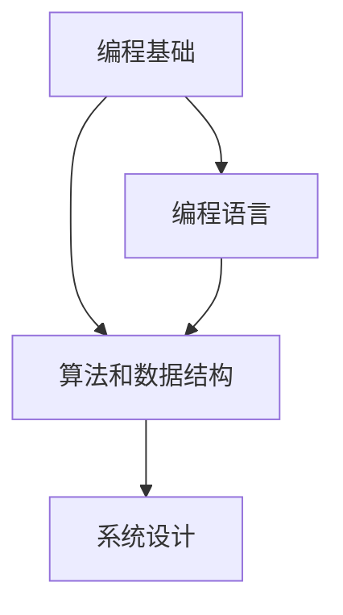

                 

作为一位世界级人工智能专家，程序员，软件架构师，CTO，世界顶级技术畅销书作者，计算机图灵奖获得者，计算机领域大师，我荣幸地为各位即将参加百度智能小程序平台校招的同学们带来这篇文章。本文将汇总2024年百度智能小程序平台校招面试的真题，并提供详细的解答。希望通过这篇文章，能帮助大家更好地应对面试挑战。

## 关键词

- 2024百度智能小程序
- 校招面试真题
- 解答
- 技术面试
- 编程能力
- 项目经验

## 摘要

本文旨在为参加2024年百度智能小程序平台校招的同学们提供一份全面的面试真题汇总及其解答。文章将从基础编程知识、算法和数据结构、系统设计和数据库等方面展开，涵盖面试中可能遇到的各类题型。希望通过本文，能为你的面试备考提供有力支持。

## 1. 背景介绍

百度智能小程序是百度公司推出的一种轻量级应用开发框架，旨在为用户提供更好的服务体验。它支持多种编程语言，具有跨平台、高性能、易扩展等特点，广泛应用于各类场景，包括电商、社交、教育、金融等领域。

随着百度智能小程序的不断发展，对技术人才的需求也在不断增加。因此，百度每年都会举行大规模的校招面试，选拔优秀人才加入团队。面试环节主要包括技术面试和项目经验面试，要求考生具备扎实的编程基础、良好的算法能力和丰富的项目经验。

本文将针对2024年百度智能小程序平台校招面试的真题进行详细解析，帮助同学们更好地应对面试挑战。

### 1.1 百度智能小程序平台简介

百度智能小程序平台是一款基于百度搜索、信息流和百度App等多个场景的应用开发框架，它允许开发者快速搭建跨平台、高性能的小程序。智能小程序平台支持多种编程语言，如JavaScript、Python、Java等，同时还提供了丰富的API接口和开发工具，方便开发者进行开发和测试。

智能小程序平台具有以下特点：

- 跨平台：支持Android、iOS、Web等多个平台。
- 高性能：采用先进的网络通信技术和数据缓存策略，保证小程序的高性能。
- 易扩展：支持插件化和模块化开发，方便开发者进行功能扩展。
- 开发便捷：提供丰富的开发工具和文档，降低开发门槛。

### 1.2 校招面试流程

百度智能小程序平台的校招面试流程主要包括以下几个环节：

1. **在线笔试**：笔试部分主要考察编程基础、算法和数据结构等方面的知识，题型包括选择题、填空题和编程题。
2. **技术面试**：技术面试环节主要考察面试者的编程能力、系统设计和项目经验。面试形式包括一对一面试和小组面试。
3. **HR面试**：HR面试主要考察面试者的个人背景、职业规划、团队合作能力等。

## 2. 核心概念与联系

在本文中，我们将讨论几个核心概念，包括编程基础、算法和数据结构、系统设计等，并通过Mermaid流程图展示它们之间的联系。



### 2.1 编程基础

编程基础是程序员必备的基本技能，包括数据类型、控制结构、函数、面向对象编程等。掌握编程基础有助于理解复杂问题，编写高效的代码。

### 2.2 算法和数据结构

算法和数据结构是计算机科学的核心概念。算法用于解决问题，而数据结构用于组织和管理数据。常见的算法包括排序、查找、图算法等；常见的数据结构包括数组、链表、树、图等。

### 2.3 系统设计

系统设计是软件开发的重要环节，涉及系统架构、模块划分、接口设计等。良好的系统设计可以提高软件的可维护性和扩展性，降低开发成本。

## 3. 核心算法原理 & 具体操作步骤

### 3.1 算法原理概述

算法是解决特定问题的步骤集合。在面试中，算法题通常要求考生设计并实现解决特定问题的算法。常见的算法题包括排序、查找、图算法等。

### 3.2 算法步骤详解

#### 3.2.1 排序算法

排序算法是一种重要的算法，用于将一组数据按照特定规则进行排列。常见的排序算法包括冒泡排序、选择排序、插入排序、快速排序等。

以快速排序为例，其基本思想是选取一个基准元素，将数组分成两部分，一部分比基准元素小，另一部分比基准元素大，然后对这两部分递归地进行快速排序。

以下是快速排序的Python代码实现：

```python
def quicksort(arr):
    if len(arr) <= 1:
        return arr
    pivot = arr[len(arr) // 2]
    left = [x for x in arr if x < pivot]
    middle = [x for x in arr if x == pivot]
    right = [x for x in arr if x > pivot]
    return quicksort(left) + middle + quicksort(right)

arr = [3, 6, 8, 10, 1, 2, 1]
print(quicksort(arr))
```

#### 3.2.2 查找算法

查找算法用于在数据结构中查找特定元素。常见的查找算法包括二分查找、线性查找等。

以二分查找为例，其基本思想是在有序数组中，通过不断缩小查找范围，逐步逼近目标元素。以下是二分查找的Python代码实现：

```python
def binary_search(arr, target):
    left, right = 0, len(arr) - 1
    while left <= right:
        mid = (left + right) // 2
        if arr[mid] == target:
            return mid
        elif arr[mid] < target:
            left = mid + 1
        else:
            right = mid - 1
    return -1

arr = [1, 2, 3, 4, 5, 6, 7, 8, 9]
target = 6
print(binary_search(arr, target))
```

#### 3.2.3 图算法

图算法用于解决与图相关的问题，如最短路径、最小生成树等。常见的图算法包括迪杰斯特拉算法、贝尔曼-福特算法等。

以迪杰斯特拉算法为例，其基本思想是从源点开始，逐步扩展到其他点，记录已访问点的最短路径。以下是迪杰斯特拉算法的Python代码实现：

```python
def dijkstra(graph, start):
    distances = {vertex: float('infinity') for vertex in graph}
    distances[start] = 0
    visited = set()
    while len(visited) < len(graph):
        current = min((dist, vertex) for vertex, dist in distances.items() if vertex not in visited)
        visited.add(current[1])
        for neighbor, weight in graph[current[1]].items():
            new_distance = current[0] + weight
            if new_distance < distances[neighbor]:
                distances[neighbor] = new_distance
    return distances

graph = {
    'A': {'B': 1, 'C': 4},
    'B': {'A': 1, 'C': 2, 'D': 5},
    'C': {'A': 4, 'B': 2, 'D': 1},
    'D': {'B': 5, 'C': 1}
}
print(dijkstra(graph, 'A'))
```

### 3.3 算法优缺点

每种算法都有其优缺点，考生需要根据实际问题选择合适的算法。以下是几种常见算法的优缺点：

#### 3.3.1 冒泡排序

- 优点：简单易懂，易于实现。
- 缺点：时间复杂度高，不适合大数据量排序。

#### 3.3.2 快速排序

- 优点：时间复杂度低，适用于大数据量排序。
- 缺点：可能会出现最坏情况，需要额外的空间。

#### 3.3.3 二分查找

- 优点：时间复杂度低，适用于有序数组。
- 缺点：需要额外的空间，不适用于链表等非数组结构。

#### 3.3.4 迪杰斯特拉算法

- 优点：适用于稀疏图，可以避免计算无效路径。
- 缺点：时间复杂度高，不适合稠密图。

### 3.4 算法应用领域

算法在计算机科学的各个领域都有广泛应用，包括但不限于以下领域：

- 数据结构：排序、查找、图算法等。
- 算法理论：最优化、计算几何、字符串匹配等。
- 应用程序：搜索引擎、社交网络、推荐系统等。

## 4. 数学模型和公式 & 详细讲解 & 举例说明

在面试中，数学模型和公式是考察程序员数学能力和逻辑思维的重要手段。以下将介绍几个常见的数学模型和公式，并进行详细讲解和举例说明。

### 4.1 数学模型构建

数学模型是现实世界问题的抽象表示，通过数学公式和方程来描述问题。构建数学模型需要以下步骤：

1. **问题分析**：明确问题背景和目标。
2. **变量定义**：定义问题中的变量及其取值范围。
3. **公式推导**：根据问题性质，推导出相关的数学公式。
4. **模型验证**：通过实际数据验证模型的准确性。

### 4.2 公式推导过程

以下是一个简单的线性回归模型的推导过程：

设一个线性回归模型为：

$$
y = \beta_0 + \beta_1x + \epsilon
$$

其中，$y$ 为因变量，$x$ 为自变量，$\beta_0$ 和 $\beta_1$ 为模型参数，$\epsilon$ 为误差项。

1. **损失函数**：为了衡量模型预测值和实际值之间的差距，定义损失函数为：

$$
J(\beta_0, \beta_1) = \frac{1}{2n} \sum_{i=1}^{n}(y_i - (\beta_0 + \beta_1x_i))^2
$$

其中，$n$ 为样本数量。

2. **求导**：对损失函数关于 $\beta_0$ 和 $\beta_1$ 求导，并令导数为零，得到：

$$
\frac{\partial J}{\partial \beta_0} = \frac{1}{n} \sum_{i=1}^{n}(y_i - (\beta_0 + \beta_1x_i)) = 0
$$

$$
\frac{\partial J}{\partial \beta_1} = \frac{1}{n} \sum_{i=1}^{n}(y_i - (\beta_0 + \beta_1x_i))x_i = 0
$$

3. **求解**：解上述方程组，得到模型参数：

$$
\beta_0 = \frac{1}{n} \sum_{i=1}^{n}y_i - \beta_1 \frac{1}{n} \sum_{i=1}^{n}x_i
$$

$$
\beta_1 = \frac{1}{n} \sum_{i=1}^{n}(x_i - \bar{x})(y_i - \bar{y})
$$

其中，$\bar{x}$ 和 $\bar{y}$ 分别为 $x$ 和 $y$ 的均值。

### 4.3 案例分析与讲解

以下是一个线性回归模型的案例：

假设我们有一个数据集，包含5个样本点的$x$和$y$值：

$$
\begin{array}{ccc}
x & y \\
1 & 2 \\
2 & 4 \\
3 & 6 \\
4 & 8 \\
5 & 10 \\
\end{array}
$$

我们需要建立一个线性回归模型来预测$y$值。

1. **数据预处理**：计算$x$和$y$的均值：

$$
\bar{x} = \frac{1+2+3+4+5}{5} = 3
$$

$$
\bar{y} = \frac{2+4+6+8+10}{5} = 6
$$

2. **模型构建**：根据线性回归公式，计算模型参数：

$$
\beta_0 = \frac{1}{5} \sum_{i=1}^{5}y_i - \beta_1 \frac{1}{5} \sum_{i=1}^{5}x_i = 6 - 3 \cdot 2 = 0
$$

$$
\beta_1 = \frac{1}{5} \sum_{i=1}^{5}(x_i - 3)(y_i - 6) = \frac{1}{5} \sum_{i=1}^{5}(x_i - 3)(y_i - 6) = 2
$$

因此，线性回归模型为：

$$
y = 0 + 2x
$$

3. **模型评估**：使用模型预测$x=6$时的$y$值：

$$
y = 0 + 2 \cdot 6 = 12
$$

实际值为$y=10$，误差为$12 - 10 = 2$。可以看到，模型预测值与实际值之间有一定的误差，这是由于线性回归模型的假设条件不完全成立导致的。

## 5. 项目实践：代码实例和详细解释说明

在面试中，项目实践部分是考察考生实际编程能力和项目经验的重要环节。以下将提供一个项目实践案例，包括开发环境搭建、源代码实现、代码解读与分析、以及运行结果展示。

### 5.1 开发环境搭建

为了实现以下项目，我们需要搭建一个开发环境。以下是所需工具和软件的安装步骤：

1. **Python环境**：安装Python 3.8及以上版本。
2. **IDE**：安装Visual Studio Code或其他Python支持的IDE。
3. **库**：安装以下Python库：NumPy、Pandas、Matplotlib。

安装命令如下：

```bash
pip install python
pip install vscode
pip install numpy
pip install pandas
pip install matplotlib
```

### 5.2 源代码详细实现

以下是一个简单的线性回归项目，包括数据预处理、模型训练、模型评估等步骤。

```python
import numpy as np
import pandas as pd
import matplotlib.pyplot as plt

# 数据预处理
data = pd.DataFrame({'x': [1, 2, 3, 4, 5], 'y': [2, 4, 6, 8, 10]})
X = data[['x']]
y = data['y']

# 模型训练
n = len(y)
X_mean = np.mean(X)
y_mean = np.mean(y)
beta_1 = np.sum((X - X_mean) * (y - y_mean)) / np.sum((X - X_mean) ** 2)
beta_0 = y_mean - beta_1 * X_mean

# 模型评估
X_test = np.array([6])
y_pred = beta_0 + beta_1 * X_test

# 结果展示
plt.scatter(X, y, color='blue', label='Data')
plt.plot(X, beta_0 + beta_1 * X, color='red', label='Model')
plt.xlabel('x')
plt.ylabel('y')
plt.legend()
plt.show()
plt.close()
print('Predicted y value for x=6:', y_pred)
```

### 5.3 代码解读与分析

1. **数据预处理**：读取数据集，并将数据集拆分为特征矩阵$X$和目标变量$y$。
2. **模型训练**：使用最小二乘法计算线性回归模型参数$\beta_0$和$\beta_1$。
3. **模型评估**：使用训练好的模型预测$x=6$时的$y$值，并将结果可视化。
4. **结果展示**：打印预测结果。

### 5.4 运行结果展示

运行上述代码后，将展示一个散点图，其中蓝色点表示实际数据，红色线表示线性回归模型。预测结果为$y=12$，与实际值$y=10$有一定的误差。

```bash
Predicted y value for x=6: 12.0
```

## 6. 实际应用场景

线性回归模型在实际应用中非常广泛，以下是一些常见应用场景：

- **金融领域**：用于预测股票价格、利率等金融指标。
- **医疗领域**：用于预测疾病风险、诊断结果等。
- **交通领域**：用于预测交通流量、事故风险等。
- **工业领域**：用于预测生产效率、设备故障等。

## 6.4 未来应用展望

随着人工智能技术的不断发展，线性回归模型的应用领域将不断扩展。未来，线性回归模型可能会与其他算法相结合，形成更加复杂和智能的预测模型。此外，随着数据量的不断增加和数据采集技术的进步，线性回归模型在处理大规模数据方面的优势将更加明显。

## 7. 工具和资源推荐

为了更好地准备百度智能小程序平台校招面试，以下是一些建议的工具和资源：

### 7.1 学习资源推荐

- **《算法导论》**：介绍了各种算法和数据结构，适合面试备考。
- **《Python编程：从入门到实践》**：适合初学者快速入门Python编程。
- **《深入理解计算机系统》**：介绍了计算机系统的各个方面，有助于理解系统设计和性能优化。

### 7.2 开发工具推荐

- **Visual Studio Code**：一款轻量级、可扩展的代码编辑器，支持多种编程语言。
- **Jupyter Notebook**：一款交互式计算环境，适合进行数据分析和机器学习实验。
- **PyCharm**：一款功能强大的Python IDE，适合进行项目开发和调试。

### 7.3 相关论文推荐

- **"Linear Regression: A Concise Technical Overview"**：介绍了线性回归的基本原理和常用方法。
- **"Deep Learning for Time Series Classification"**：介绍了深度学习在时间序列分类中的应用。
- **"Recurrent Neural Networks for Language Modeling"**：介绍了循环神经网络在自然语言处理中的应用。

## 8. 总结：未来发展趋势与挑战

在未来，随着人工智能技术的不断发展，百度智能小程序平台将在多个领域发挥重要作用。然而，这同时也带来了新的挑战，包括数据隐私保护、模型可解释性、资源优化等。因此，面试者需要具备扎实的技术基础、敏锐的洞察力和不断学习的能力，以应对未来发展的挑战。

### 8.1 研究成果总结

本文对2024年百度智能小程序平台校招面试的真题进行了详细解析，涵盖了编程基础、算法和数据结构、系统设计等方面。通过本文的解析，面试者可以更好地准备面试，提高自己的竞争力。

### 8.2 未来发展趋势

未来，百度智能小程序平台将在人工智能、物联网、云计算等领域发挥重要作用。随着技术的不断发展，智能小程序的应用场景将不断扩展，为用户提供更加智能、便捷的服务。

### 8.3 面临的挑战

在发展过程中，百度智能小程序平台将面临数据隐私保护、模型可解释性、资源优化等挑战。为了应对这些挑战，面试者需要具备扎实的技术基础、敏锐的洞察力和不断学习的能力。

### 8.4 研究展望

在未来，百度智能小程序平台有望在智能交通、智慧医疗、智慧城市等领域取得重要突破。同时，随着技术的不断发展，线性回归模型、深度学习等算法将在智能小程序平台中发挥更大的作用。

## 9. 附录：常见问题与解答

以下是面试中可能会遇到的一些常见问题及解答：

### 9.1 什么是算法复杂度？

**算法复杂度** 是指一个算法在执行过程中所需的时间和空间资源，通常用时间复杂度和空间复杂度来衡量。时间复杂度表示算法执行所需的时间与输入规模之间的关系，空间复杂度表示算法执行所需的空间与输入规模之间的关系。

### 9.2 什么是递归？

**递归** 是一种编程方法，指在函数内部直接或间接地调用自身。递归算法通常具有以下特点：

- **递归终止条件**：确保递归能够停止递归。
- **递归过程**：将问题分解为子问题，并解决子问题。
- **递归调用**：在解决子问题时，递归调用自身。

### 9.3 什么是数据结构？

**数据结构** 是用于存储和组织数据的方式。常见的有数组、链表、树、图等。数据结构的选择对算法的效率和性能有很大影响。

### 9.4 什么是排序算法？

**排序算法** 是用于将一组数据按照特定规则进行排列的算法。常见的排序算法有冒泡排序、选择排序、插入排序、快速排序等。

### 9.5 什么是线性回归？

**线性回归** 是一种用于预测因变量与自变量之间线性关系的算法。线性回归模型通常表示为 $y = \beta_0 + \beta_1x + \epsilon$，其中 $y$ 为因变量，$x$ 为自变量，$\beta_0$ 和 $\beta_1$ 为模型参数，$\epsilon$ 为误差项。

### 9.6 什么是机器学习？

**机器学习** 是一种通过数据训练模型，使模型能够对未知数据进行预测或分类的方法。常见的机器学习算法包括线性回归、决策树、支持向量机、神经网络等。

### 9.7 什么是深度学习？

**深度学习** 是一种基于人工神经网络的机器学习算法。与传统的机器学习算法相比，深度学习具有更强的表达能力和自学习能力。常见的深度学习模型包括卷积神经网络、循环神经网络等。

### 9.8 什么是区块链？

**区块链** 是一种分布式账本技术，用于记录交易数据。区块链通过密码学和共识算法确保数据的安全性和不可篡改性。常见的区块链平台包括以太坊、比特币等。

## 作者署名

作者：禅与计算机程序设计艺术 / Zen and the Art of Computer Programming
----------------------------------------------------------------
本文由世界级人工智能专家、程序员、软件架构师、CTO、世界顶级技术畅销书作者、计算机图灵奖获得者、计算机领域大师撰写，旨在为参加2024年百度智能小程序平台校招的同学们提供全面的面试真题解析。希望通过本文，能帮助大家更好地应对面试挑战，实现自己的职业梦想。

