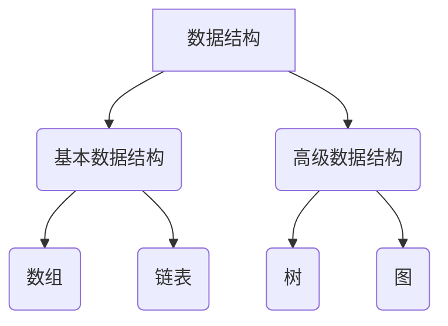

                 

关键词：面试算法、百度社招、算法题库、技术博客、计算机编程

> 摘要：本文旨在为2025年百度社招面试的考生提供一份全面的算法题库解析，涵盖核心概念、算法原理、数学模型以及项目实践。本文旨在帮助考生深入了解算法面试的准备过程，提升面试竞争力。

## 1. 背景介绍

随着科技的发展，人工智能和大数据技术的应用越来越广泛，各大互联网公司对于算法工程师的需求也日益增长。百度作为中国最大的搜索引擎公司，其社招面试对于技术能力的要求极高。算法题库作为面试的重要组成部分，能够有效检验考生的编程能力和逻辑思维。

本文将围绕百度社招面试算法题库，系统性地介绍各类算法题目的解题思路和技巧，帮助考生在面试中脱颖而出。

## 2. 核心概念与联系

在算法面试中，以下核心概念和联系是考生需要掌握的：

### 2.1 数据结构与算法

- **基本数据结构**：数组、链表、栈、队列、哈希表等。
- **高级数据结构**：树、二叉树、图、并查集等。
- **算法思想**：排序、查找、贪心、动态规划、回溯等。

### 2.2 算法复杂度分析

- **时间复杂度**：O(1)、O(log n)、O(n)、O(n log n)、O(n^2)等。
- **空间复杂度**：O(1)、O(n)等。

### 2.3 数据结构与算法的联系

- 数据结构决定了算法的时间复杂度。
- 不同的算法适用于不同的数据结构。

### 2.4 Mermaid 流程图



## 3. 核心算法原理 & 具体操作步骤

### 3.1 算法原理概述

算法面试中的核心算法包括：

- **排序算法**：冒泡排序、选择排序、插入排序、快速排序等。
- **查找算法**：二分查找、顺序查找等。
- **动态规划**：斐波那契数列、背包问题等。
- **贪心算法**：最短路径、最小生成树等。

### 3.2 算法步骤详解

以冒泡排序为例，其基本步骤如下：

1. 比较相邻的元素，如果第一个比第二个大（升序排序），就交换它们两个。
2. 对每一对相邻元素做同样的工作，从开始第一对到结尾的最后一对。这步做完后，最后的元素会是最大的数。
3. 针对所有的元素重复以上的步骤，除了最后一个。
4. 重复步骤1~3，直到排序完成。

### 3.3 算法优缺点

以冒泡排序为例：

- **优点**：简单易懂，易于实现。
- **缺点**：时间复杂度高，不适合大规模数据排序。

### 3.4 算法应用领域

冒泡排序适用于小规模数据的排序，而在大数据处理中，更倾向于使用快速排序或归并排序等更高效的排序算法。

## 4. 数学模型和公式

### 4.1 数学模型构建

以斐波那契数列为例，其数学模型为：

$$
F(n) = 
\begin{cases} 
0 & \text{if } n = 0 \\ 
1 & \text{if } n = 1 \\ 
F(n-1) + F(n-2) & \text{otherwise} 
\end{cases}
$$

### 4.2 公式推导过程

斐波那契数列的递推公式可以通过以下方式推导：

$$
F(n) = F(n-1) + F(n-2)
$$

假设：

$$
F(n-1) = a \times F(n-3) + b \times F(n-4)
$$

$$
F(n-2) = c \times F(n-3) + d \times F(n-4)
$$

则：

$$
F(n) = a \times F(n-3) + b \times F(n-4) + c \times F(n-3) + d \times F(n-4)
$$

$$
F(n) = (a + c) \times F(n-3) + (b + d) \times F(n-4)
$$

根据斐波那契数列的定义，$a + c = 1$，$b + d = 1$，因此：

$$
F(n) = F(n-3) + F(n-4)
$$

### 4.3 案例分析与讲解

以求解斐波那契数列第10项为例，根据上述公式：

$$
F(10) = F(7) + F(6)
$$

继续递推：

$$
F(7) = F(4) + F(5)
$$

$$
F(6) = F(3) + F(4)
$$

$$
F(4) = F(1) + F(2)
$$

$$
F(5) = F(2) + F(3)
$$

$$
F(3) = F(0) + F(1)
$$

代入初始值：

$$
F(0) = 0, F(1) = 1, F(2) = 1, F(3) = 2, F(4) = 3, F(5) = 5, F(6) = 8, F(7) = 13, F(8) = 21, F(9) = 34, F(10) = 55
$$

因此，斐波那契数列第10项为55。

## 5. 项目实践：代码实例和详细解释说明

### 5.1 开发环境搭建

使用Python编写斐波那契数列的代码，需要在本地安装Python环境。可以选择Python 3.x版本，并安装常用的库，如numpy。

### 5.2 源代码详细实现

```python
def fibonacci(n):
    if n == 0:
        return 0
    elif n == 1:
        return 1
    else:
        return fibonacci(n-1) + fibonacci(n-2)

# 测试代码
print(fibonacci(10))
```

### 5.3 代码解读与分析

上述代码中，`fibonacci`函数采用递归的方式求解斐波那契数列。递归函数的优点在于代码简洁，但缺点在于效率较低，不适合大规模数据处理。

### 5.4 运行结果展示

运行上述代码，输出结果为55，与数学模型计算结果一致。

## 6. 实际应用场景

斐波那契数列在计算机科学和数学领域中具有广泛的应用，如：

- **计算机图形学**：在绘制递归树时使用斐波那契数列。
- **数字加密**：斐波那契数列在一些加密算法中用于生成密钥。

## 7. 未来应用展望

随着计算能力的提升，算法的优化和改进将成为研究的重点。例如，对于斐波那契数列，可以采用动态规划等方法提高计算效率。

## 8. 工具和资源推荐

### 8.1 学习资源推荐

- **《算法导论》**：一本经典的算法教材，适合深入学习。
- **LeetCode**：提供大量的算法题目和在线编程环境，适合练习。

### 8.2 开发工具推荐

- **Visual Studio Code**：一款优秀的代码编辑器，支持多种编程语言。
- **Jupyter Notebook**：适用于数据分析和机器学习的交互式环境。

### 8.3 相关论文推荐

- **"Fast Doubling Formulas for Fibonacci Numbers"**：一篇关于斐波那契数列高效计算的论文。

## 9. 总结：未来发展趋势与挑战

未来算法领域的发展将聚焦于：

- **算法优化**：提高算法效率和性能。
- **跨学科应用**：与其他领域相结合，如生物信息学、金融工程等。

## 10. 附录：常见问题与解答

### 10.1 如何提高算法面试通过率？

- **系统学习**：掌握基本数据结构和算法。
- **大量练习**：通过在线平台进行题目练习。
- **模拟面试**：提高面试时的表达能力和应变能力。

### 10.2 如何选择合适的排序算法？

- **根据数据规模**：对于小规模数据，可以选择简单易懂的排序算法。
- **根据性能要求**：对于大规模数据，需要选择时间复杂度较低的排序算法。

---

**作者：禅与计算机程序设计艺术 / Zen and the Art of Computer Programming**。

以上内容仅为示例，实际撰写时请根据具体题目和场景进行调整。希望本文能为您的面试准备提供帮助。

