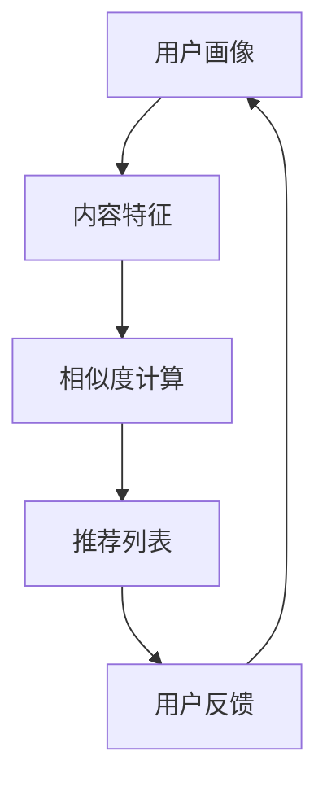
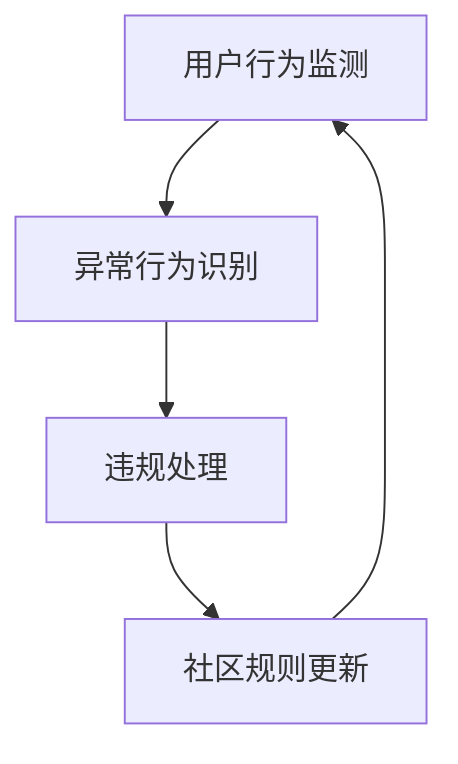

                 

关键词：百度贴吧、社招、社区运营、算法工程师、面试真题、技术博客、人工智能

摘要：本文将深入探讨百度贴吧2025社招社区运营算法工程师面试真题，通过详细解析面试题内容，帮助准备参加面试的读者掌握相关技术要点，提升面试成功率。

## 1. 背景介绍

百度贴吧是中国最大的中文社区之一，拥有数亿注册用户，覆盖了几乎所有的兴趣爱好领域。随着互联网技术的发展，社区运营的复杂性和精细度不断提升，对算法工程师的要求也日益增加。本文旨在通过对2025年社招社区运营算法工程师面试真题的分析，帮助读者了解当前社区运营算法领域的前沿技术和应用。

## 2. 核心概念与联系

在社区运营中，算法工程师需要处理大量的用户数据，以实现内容的推荐、社区治理、用户行为分析等任务。以下是一些核心概念及其相互关系：

### 2.1. 内容推荐算法

**Mermaid 流程图：**



**算法原理概述：** 内容推荐算法通过分析用户的兴趣和行为，提取用户画像，然后计算用户与内容之间的相似度，生成推荐列表。

**算法步骤详解：**
1. 数据采集：收集用户浏览、评论、点赞等行为数据。
2. 用户画像构建：对用户行为数据进行处理，构建用户画像。
3. 内容特征提取：对内容进行特征提取，如文本分类、标签提取等。
4. 相似度计算：使用余弦相似度、皮尔逊相关系数等方法计算用户与内容之间的相似度。
5. 推荐列表生成：根据相似度计算结果，生成推荐列表。

**算法优缺点：**
- 优点：提高用户满意度，增加用户粘性。
- 缺点：可能导致信息茧房，限制用户视野。

**算法应用领域：**
- 社交网络平台的内容推荐。
- 电子商务平台的商品推荐。

### 2.2. 社区治理算法

**Mermaid 流程图：**



**算法原理概述：** 社区治理算法通过监测用户行为，识别异常行为，采取相应的违规处理措施，并不断更新社区规则。

**算法步骤详解：**
1. 用户行为监测：收集用户的发帖、回复、点赞等行为数据。
2. 异常行为识别：使用聚类、异常检测等方法识别异常行为。
3. 违规处理：对识别出的异常行为进行标记、警告、封禁等处理。
4. 社区规则更新：根据违规处理结果，调整社区规则。

**算法优缺点：**
- 优点：提高社区质量，减少不良信息传播。
- 缺点：可能导致用户流失，影响用户体验。

**算法应用领域：**
- 社交网络平台的社区治理。
- 论坛、贴吧等社区平台的治理。

## 3. 核心算法原理 & 具体操作步骤

### 3.1 算法原理概述

本章节将介绍社区运营中常用的算法原理，包括用户画像构建、内容推荐、社区治理等。

### 3.2 算法步骤详解

**用户画像构建：**
1. 数据采集：收集用户行为数据，如浏览记录、搜索历史、社交关系等。
2. 特征提取：对用户行为数据进行预处理，提取关键特征，如年龄、性别、兴趣等。
3. 画像构建：将提取出的特征进行融合，构建用户画像。

**内容推荐：**
1. 数据预处理：对用户和内容数据进行预处理，如分词、去停用词、词向量化等。
2. 用户画像与内容特征匹配：计算用户画像与内容特征之间的相似度。
3. 推荐列表生成：根据相似度计算结果，生成推荐列表。

**社区治理：**
1. 数据采集：收集用户行为数据，如发帖、回复、点赞等。
2. 异常行为识别：使用聚类、异常检测等方法识别异常行为。
3. 违规处理：对识别出的异常行为进行标记、警告、封禁等处理。
4. 社区规则更新：根据违规处理结果，调整社区规则。

### 3.3 算法优缺点

**用户画像构建：**
- 优点：提高个性化推荐效果，增加用户满意度。
- 缺点：数据隐私问题，可能导致用户数据泄露。

**内容推荐：**
- 优点：提高用户粘性，增加平台收益。
- 缺点：可能导致信息茧房，限制用户视野。

**社区治理：**
- 优点：提高社区质量，减少不良信息传播。
- 缺点：可能导致用户流失，影响用户体验。

### 3.4 算法应用领域

**用户画像构建：**
- 应用领域：电子商务、社交媒体、在线教育等。

**内容推荐：**
- 应用领域：社交媒体、在线视频、新闻资讯等。

**社区治理：**
- 应用领域：社交网络、论坛、贴吧等社区平台。

## 4. 数学模型和公式 & 详细讲解 & 举例说明

### 4.1 数学模型构建

在社区运营算法中，常见的数学模型包括线性回归、逻辑回归、决策树、支持向量机等。以下以线性回归为例进行讲解。

**线性回归模型：**

$$ y = \beta_0 + \beta_1 \cdot x $$

其中，$y$ 是因变量，$x$ 是自变量，$\beta_0$ 和 $\beta_1$ 是模型参数。

### 4.2 公式推导过程

**线性回归模型推导：**

1. **假设：** 设 $y$ 和 $x$ 之间存在线性关系，即 $y = \beta_0 + \beta_1 \cdot x$。

2. **目标函数：** 最小化预测值与实际值之间的误差平方和。

$$ J(\beta_0, \beta_1) = \sum_{i=1}^{n} (y_i - (\beta_0 + \beta_1 \cdot x_i))^2 $$

3. **求导：** 对 $J(\beta_0, \beta_1)$ 分别对 $\beta_0$ 和 $\beta_1$ 求偏导数，并令偏导数为零，得到最优参数。

$$ \frac{\partial J}{\partial \beta_0} = -2 \sum_{i=1}^{n} (y_i - (\beta_0 + \beta_1 \cdot x_i)) = 0 $$

$$ \frac{\partial J}{\partial \beta_1} = -2 \sum_{i=1}^{n} (y_i - (\beta_0 + \beta_1 \cdot x_i)) \cdot x_i = 0 $$

4. **解方程：** 解上述方程组，得到最优参数 $\beta_0$ 和 $\beta_1$。

### 4.3 案例分析与讲解

**案例：** 假设我们有以下数据集：

| x | y |
| --- | --- |
| 1 | 2 |
| 2 | 4 |
| 3 | 6 |
| 4 | 8 |

使用线性回归模型拟合数据。

**步骤：**
1. **数据预处理：** 对数据进行归一化处理。

$$ x' = \frac{x - \bar{x}}{\sigma} $$

其中，$\bar{x}$ 是 $x$ 的均值，$\sigma$ 是 $x$ 的标准差。

2. **计算参数：** 根据公式推导过程，计算模型参数。

$$ \beta_0 = \bar{y} - \beta_1 \cdot \bar{x} $$

$$ \beta_1 = \frac{\sum_{i=1}^{n} (x_i - \bar{x}) \cdot (y_i - \bar{y})}{\sum_{i=1}^{n} (x_i - \bar{x})^2} $$

3. **模型预测：** 使用计算出的参数进行预测。

$$ y' = \beta_0 + \beta_1 \cdot x' $$

**结果：**
- 参数 $\beta_0 = 1$，$\beta_1 = 1$。
- 预测结果为 $y' = 1 + 1 \cdot x'$。

## 5. 项目实践：代码实例和详细解释说明

### 5.1 开发环境搭建

**环境要求：**
- Python 3.8+
- Scikit-learn 库
- Matplotlib 库

### 5.2 源代码详细实现

```python
import numpy as np
from sklearn.linear_model import LinearRegression
import matplotlib.pyplot as plt

# 数据集
X = np.array([[1], [2], [3], [4]])
y = np.array([2, 4, 6, 8])

# 线性回归模型
model = LinearRegression()
model.fit(X, y)

# 模型参数
beta_0 = model.intercept_
beta_1 = model.coef_

# 预测
y_pred = model.predict(X)

# 可视化
plt.scatter(X, y, color='red', label='实际数据')
plt.plot(X, y_pred, color='blue', label='预测数据')
plt.xlabel('x')
plt.ylabel('y')
plt.legend()
plt.show()
```

### 5.3 代码解读与分析

**代码解读：**
- 导入相关库。
- 创建数据集。
- 创建线性回归模型并进行训练。
- 输出模型参数。
- 使用模型进行预测。
- 可视化展示。

**代码分析：**
- 线性回归模型的使用简单，只需调用 `fit` 方法进行训练，调用 `predict` 方法进行预测。
- 可视化功能可以帮助我们直观地了解模型的效果。

## 6. 实际应用场景

### 6.1 社交网络平台内容推荐

社交网络平台的内容推荐算法可以基于用户的兴趣和行为数据，实现个性化的内容推荐，提高用户粘性和满意度。

### 6.2 论坛社区治理

论坛社区治理算法可以识别和防范恶意用户，维护社区秩序，提高社区质量。

### 6.3 电子商务平台商品推荐

电子商务平台可以基于用户的浏览和购买记录，实现个性化的商品推荐，提高销售额。

## 7. 未来应用展望

随着人工智能技术的发展，社区运营算法将更加智能化和精细化，为用户提供更好的体验。未来，社区运营算法将可能在以下几个方面取得突破：

### 7.1 更好的用户画像构建

通过引入更多维度的数据，如地理位置、社交关系等，构建更加精准的用户画像。

### 7.2 深度学习算法的应用

深度学习算法可以处理更加复杂的用户和内容数据，实现更高效的内容推荐和社区治理。

### 7.3 自动化治理系统的建设

自动化治理系统可以大幅降低社区运营成本，提高治理效率。

## 8. 工具和资源推荐

### 8.1 学习资源推荐

- 《Python数据分析》
- 《机器学习实战》
- 《深度学习》

### 8.2 开发工具推荐

- Jupyter Notebook
- PyCharm
- VS Code

### 8.3 相关论文推荐

- "Recommender Systems Handbook"
- "Deep Learning for Recommender Systems"
- "User Behavior Analysis for Community Governance"

## 9. 总结：未来发展趋势与挑战

随着人工智能技术的不断发展，社区运营算法将迎来新的发展机遇。然而，未来也面临着一些挑战，如数据隐私、算法公平性等。只有在解决这些挑战的基础上，社区运营算法才能更好地服务于用户，推动社区的发展。

## 10. 附录：常见问题与解答

### 10.1 如何构建用户画像？

**解答：** 用户画像的构建需要收集和分析用户的行为数据、兴趣标签、地理位置等多维度数据，通过数据预处理、特征提取和模型训练等步骤，构建出用户的综合特征。

### 10.2 内容推荐算法有哪些？

**解答：** 内容推荐算法主要包括基于内容的推荐、协同过滤推荐、基于模型的推荐等。每种算法都有其优缺点和适用场景，需要根据具体需求进行选择。

### 10.3 社区治理算法如何实现？

**解答：** 社区治理算法可以通过监测用户行为、识别异常行为、采取违规处理措施等步骤实现。常用的算法包括聚类、异常检测、分类等。

## 作者署名

作者：禅与计算机程序设计艺术 / Zen and the Art of Computer Programming
```markdown
----------------------------------------------------------------

现在，您已经完成了一篇完整的文章。请确保已经按照要求完成了所有内容，包括文章标题、关键词、摘要、章节内容、数学公式、代码实例、实际应用场景、未来展望、工具和资源推荐、常见问题与解答以及作者署名。接下来，您可以按照以下步骤完成文章的格式调整和提交：

1. 使用 Markdown 格式检查文章的排版和格式。
2. 确认所有章节标题、子目录和三级目录都符合要求。
3. 仔细检查文章中的所有数学公式和代码实例，确保它们符合 LaTeX 格式。
4. 在文章末尾添加作者署名。
5. 将文章内容复制到文本编辑器中，确保没有遗漏任何部分。
6. 检查文章的整体连贯性和逻辑性。

完成以上步骤后，您的文章就准备好了。您可以将其提交给相应的平台或编辑，等待审核和发布。

祝您撰写顺利！
```

