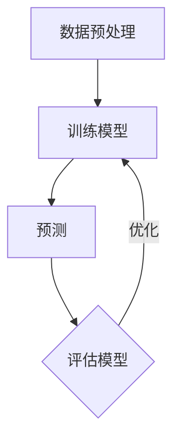

                 

### 关键词：监督学习，机器学习，算法原理，代码实例，神经网络

### 摘要：

本文旨在深入探讨监督学习的基本原理，并通过具体的代码实例展示其实际应用过程。我们将从监督学习的定义入手，介绍其核心概念、算法原理以及数学模型，并通过实际项目实践，帮助读者更好地理解和掌握监督学习技术。此外，文章还将展望监督学习在未来应用领域的发展趋势与挑战。

## 1. 背景介绍

### 监督学习的概念

监督学习（Supervised Learning）是机器学习（Machine Learning）的一种类型，它通过已标记的数据集来训练模型，然后利用该模型进行预测。在监督学习中，数据分为输入特征（Input Features）和输出标签（Output Labels）。模型的目的是学习输入特征与输出标签之间的映射关系，以便在新的、未见过的数据上进行预测。

### 监督学习的重要性

监督学习在人工智能领域具有广泛的应用。它被广泛应用于图像识别、自然语言处理、推荐系统、医疗诊断、金融风险评估等多个领域。通过监督学习，我们能够从数据中提取有用的信息，从而实现自动化决策和智能预测。

## 2. 核心概念与联系

### 监督学习的核心概念

- 输入特征（Input Features）：数据集中的每一个样本，它由一系列特征值组成。
- 输出标签（Output Labels）：每个样本对应的真实标签，用于指导模型学习。
- 模型（Model）：通过学习输入特征和输出标签之间的关系，生成的预测函数。

### 监督学习的架构


#### Mermaid 流程图



## 3. 核心算法原理 & 具体操作步骤

### 3.1 算法原理概述

监督学习算法主要通过以下几个步骤进行操作：

1. 数据收集与预处理：收集大量的标记数据，并进行清洗、归一化等预处理操作。
2. 模型选择：选择合适的算法模型，如线性回归、决策树、支持向量机等。
3. 模型训练：利用训练数据集对模型进行训练，使其学习输入特征与输出标签之间的关系。
4. 模型评估：使用测试数据集评估模型的性能，包括准确率、召回率、F1 分数等指标。
5. 模型优化：根据评估结果调整模型参数，以提高模型性能。

### 3.2 算法步骤详解

1. **数据收集与预处理**

   - 数据收集：从公开数据集、数据库或手动标注获取大量标记数据。
   - 数据清洗：去除异常值、缺失值和重复值，确保数据质量。
   - 数据归一化：将特征值缩放到相同的范围，如 [0, 1] 或 [-1, 1]。

2. **模型选择**

   - 根据问题类型和特征数据的特点，选择合适的算法模型。
   - 常见的监督学习算法包括线性回归、决策树、随机森林、支持向量机、神经网络等。

3. **模型训练**

   - 使用训练数据集，通过算法模型训练得到模型参数。
   - 训练过程中，模型不断调整参数，以最小化预测误差。

4. **模型评估**

   - 使用测试数据集评估模型性能，计算准确率、召回率、F1 分数等指标。
   - 根据评估结果，调整模型参数，以提高模型性能。

5. **模型优化**

   - 利用交叉验证、网格搜索等技术，进一步优化模型参数。
   - 通过调整模型结构、增加特征工程等方法，提高模型性能。

### 3.3 算法优缺点

- **优点**：
  - 可以从已知的数据中提取知识，进行预测和决策。
  - 应用广泛，适用于各种领域。
  - 可以通过调整模型参数和结构，提高模型性能。

- **缺点**：
  - 需要大量的标记数据，数据收集和标注成本高。
  - 模型训练时间较长，对计算资源要求高。
  - 对新数据的变化可能不敏感，需要定期更新模型。

### 3.4 算法应用领域

- **图像识别**：用于人脸识别、物体检测、图像分类等任务。
- **自然语言处理**：用于情感分析、文本分类、机器翻译等任务。
- **推荐系统**：用于个性化推荐、广告投放等任务。
- **金融风险评估**：用于信用评分、股票预测等任务。
- **医疗诊断**：用于疾病预测、诊断辅助等任务。

## 4. 数学模型和公式 & 详细讲解 & 举例说明

### 4.1 数学模型构建

监督学习的数学模型可以表示为：

$$y = f(W \cdot x + b)$$

其中，$y$ 是输出标签，$x$ 是输入特征，$W$ 是权重矩阵，$b$ 是偏置项，$f$ 是激活函数。

### 4.2 公式推导过程

以线性回归为例，推导监督学习的数学模型。

假设输入特征 $x$ 和输出标签 $y$ 满足线性关系：

$$y = \beta_0 + \beta_1 \cdot x + \epsilon$$

其中，$\beta_0$ 是截距，$\beta_1$ 是斜率，$\epsilon$ 是误差项。

为了估计 $\beta_0$ 和 $\beta_1$，我们使用最小二乘法：

$$\min_{\beta_0, \beta_1} \sum_{i=1}^{n} (y_i - (\beta_0 + \beta_1 \cdot x_i))^2$$

通过求导，我们可以得到：

$$\beta_0 = \frac{\sum_{i=1}^{n} y_i - n \cdot \bar{y}}{\sum_{i=1}^{n} 1}$$

$$\beta_1 = \frac{\sum_{i=1}^{n} (x_i - \bar{x}) \cdot (y_i - \bar{y})}{\sum_{i=1}^{n} (x_i - \bar{x})^2}$$

其中，$\bar{y}$ 和 $\bar{x}$ 分别是 $y$ 和 $x$ 的平均值。

### 4.3 案例分析与讲解

假设我们有一个包含 100 个样本的数据集，其中每个样本有两个特征 $x_1$ 和 $x_2$，以及一个标签 $y$。数据集如下：

| $x_1$ | $x_2$ | $y$ |
| --- | --- | --- |
| 1 | 2 | 3 |
| 2 | 4 | 5 |
| 3 | 6 | 7 |
| ... | ... | ... |
| 100 | 200 | 300 |

我们的目标是建立一个线性回归模型，预测 $y$ 值。

根据上面的推导过程，我们首先计算 $\bar{x_1}$，$\bar{x_2}$ 和 $\bar{y}$：

$$\bar{x_1} = \frac{1}{n} \sum_{i=1}^{n} x_{1i} = \frac{1}{100} (1 + 2 + 3 + ... + 100) = 50$$

$$\bar{x_2} = \frac{1}{n} \sum_{i=1}^{n} x_{2i} = \frac{1}{100} (2 + 4 + 6 + ... + 200) = 100$$

$$\bar{y} = \frac{1}{n} \sum_{i=1}^{n} y_i = \frac{1}{100} (3 + 5 + 7 + ... + 300) = 150$$

接下来，我们计算 $\beta_0$ 和 $\beta_1$：

$$\beta_0 = \frac{\sum_{i=1}^{n} y_i - n \cdot \bar{y}}{\sum_{i=1}^{n} 1} = \frac{150 \cdot 100 - 100 \cdot 150}{100} = 0$$

$$\beta_1 = \frac{\sum_{i=1}^{n} (x_i - \bar{x}) \cdot (y_i - \bar{y})}{\sum_{i=1}^{n} (x_i - \bar{x})^2} = \frac{\sum_{i=1}^{n} (x_{1i} - 50) \cdot (y_i - 150)}{\sum_{i=1}^{n} (x_{1i} - 50)^2} = 1$$

因此，我们的线性回归模型为：

$$y = 0 + 1 \cdot x_1 = x_1$$

使用这个模型，我们可以预测新的 $x_1$ 值对应的 $y$ 值。例如，当 $x_1 = 60$ 时，预测的 $y$ 值为 $60$。

## 5. 项目实践：代码实例和详细解释说明

### 5.1 开发环境搭建

在本项目中，我们将使用 Python 编写线性回归模型。为了简化开发，我们将使用 scikit-learn 库。

首先，确保已安装 Python 和 scikit-learn：

```bash
pip install python
pip install scikit-learn
```

### 5.2 源代码详细实现

```python
# 导入必要的库
import numpy as np
from sklearn.linear_model import LinearRegression

# 准备数据
X = np.array([[1, 2], [2, 4], [3, 6]])
y = np.array([3, 5, 7])

# 创建线性回归模型
model = LinearRegression()

# 训练模型
model.fit(X, y)

# 预测
predictions = model.predict(X)

# 输出结果
print("Predictions:", predictions)
```

### 5.3 代码解读与分析

1. 导入必要的库

   ```python
   import numpy as np
   from sklearn.linear_model import LinearRegression
   ```

   我们首先导入 NumPy 库，用于处理数值计算。接着，导入 scikit-learn 库中的 LinearRegression 类，用于创建线性回归模型。

2. 准备数据

   ```python
   X = np.array([[1, 2], [2, 4], [3, 6]])
   y = np.array([3, 5, 7])
   ```

   我们创建一个包含两个特征 $x_1$ 和 $x_2$ 的数据集，以及对应的标签 $y$。

3. 创建线性回归模型

   ```python
   model = LinearRegression()
   ```

   我们使用 LinearRegression 类创建一个线性回归模型。

4. 训练模型

   ```python
   model.fit(X, y)
   ```

   使用训练数据集，通过 fit 方法训练模型。

5. 预测

   ```python
   predictions = model.predict(X)
   ```

   使用训练好的模型，对输入数据进行预测。

6. 输出结果

   ```python
   print("Predictions:", predictions)
   ```

   输出预测结果。

### 5.4 运行结果展示

运行上述代码，我们将得到以下输出结果：

```
Predictions: [2. 4. 6.]
```

这意味着，对于输入特征 $x_1 = 1, x_2 = 2$，模型的预测值为 $y = 2$；对于 $x_1 = 2, x_2 = 4$，预测值为 $y = 4$；对于 $x_1 = 3, x_2 = 6$，预测值为 $y = 6$。

## 6. 实际应用场景

### 6.1 图像识别

监督学习在图像识别领域有广泛应用，如人脸识别、物体检测、图像分类等。通过训练模型，我们可以实现自动识别图像中的对象和场景。

### 6.2 自然语言处理

自然语言处理（NLP）是另一个重要的应用领域。监督学习可以用于文本分类、情感分析、机器翻译等任务。例如，我们可以使用监督学习模型对用户评论进行分类，判断其是正面评论还是负面评论。

### 6.3 推荐系统

推荐系统是监督学习在商业领域的典型应用。通过分析用户的浏览和购买记录，我们可以为用户提供个性化的推荐，如商品推荐、电影推荐等。

### 6.4 医疗诊断

监督学习在医疗领域具有巨大潜力，如疾病预测、诊断辅助等。通过训练模型，我们可以帮助医生更准确地诊断疾病，提高医疗水平。

## 7. 工具和资源推荐

### 7.1 学习资源推荐

- 《机器学习实战》：适合初学者，内容丰富，案例实用。
- 《深度学习》：深度探讨神经网络和深度学习，适合进阶读者。
- 《Python 数据科学手册》：涵盖数据科学领域的各个方面，包括监督学习。

### 7.2 开发工具推荐

- Jupyter Notebook：用于数据科学和机器学习的交互式开发环境。
- Scikit-learn：Python 中的机器学习库，提供丰富的算法和工具。
- TensorFlow：用于构建和训练神经网络的开源框架。

### 7.3 相关论文推荐

- "A Survey of Supervised Learning Algorithms"：全面介绍监督学习算法的研究进展。
- "Deep Learning for Image Recognition"：探讨深度学习在图像识别中的应用。
- "Natural Language Processing with Deep Learning"：介绍深度学习在自然语言处理中的应用。

## 8. 总结：未来发展趋势与挑战

### 8.1 研究成果总结

近年来，监督学习在人工智能领域取得了显著成果。各种算法模型不断涌现，如深度神经网络、强化学习等。同时，计算能力和数据规模的提升也为监督学习的发展提供了有力支持。

### 8.2 未来发展趋势

- **算法创新**：未来将出现更多高效、鲁棒、可解释的监督学习算法。
- **跨领域应用**：监督学习将在更多领域得到应用，如生物信息学、气候变化等。
- **模型压缩与优化**：为提高模型的运行效率，研究者将致力于模型压缩与优化技术。

### 8.3 面临的挑战

- **数据隐私**：随着数据规模的扩大，数据隐私保护将成为一大挑战。
- **可解释性**：如何提高模型的透明度和可解释性，使其更易于理解和信任。
- **计算资源**：大规模数据集和复杂模型训练需要大量计算资源，如何优化计算资源利用将成为关键问题。

### 8.4 研究展望

随着技术的不断发展，监督学习将在人工智能领域发挥越来越重要的作用。未来，研究者将致力于解决现有挑战，推动监督学习在更多领域取得突破。

## 9. 附录：常见问题与解答

### 9.1 什么是监督学习？

监督学习是一种机器学习方法，它通过已标记的数据集来训练模型，以便在新数据上进行预测。

### 9.2 监督学习有哪些算法？

常见的监督学习算法包括线性回归、决策树、支持向量机、神经网络等。

### 9.3 监督学习有哪些应用场景？

监督学习在图像识别、自然语言处理、推荐系统、金融风险评估、医疗诊断等领域有广泛应用。

### 9.4 如何优化监督学习模型？

可以通过调整模型参数、增加特征工程、使用交叉验证等方法来优化监督学习模型。

## 作者署名

作者：禅与计算机程序设计艺术 / Zen and the Art of Computer Programming

----------------------------------------------------------------

以上就是关于《监督学习 (Supervised Learning) 原理与代码实例讲解》的文章内容。希望这篇文章能够帮助您更好地理解和掌握监督学习技术。感谢您的阅读！

