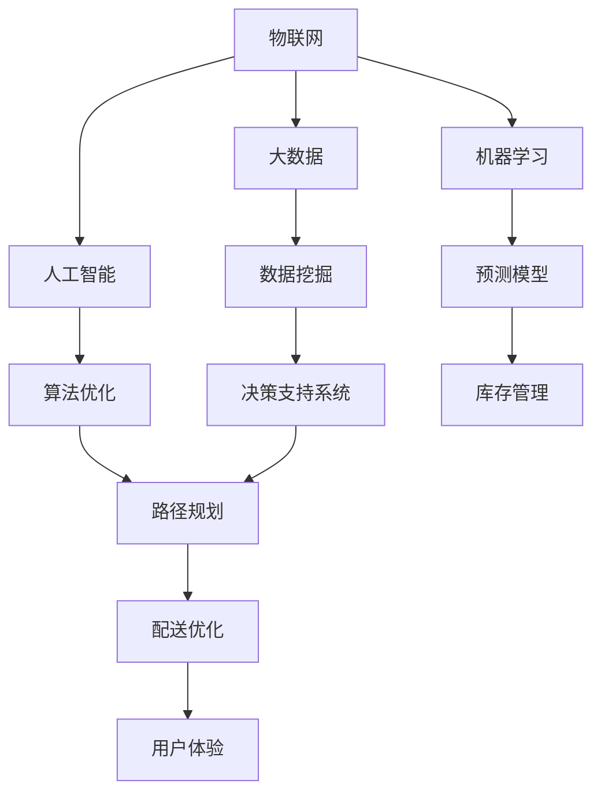

                 

关键词：盒马鲜生，校招，智能冷链物流，工程师案例分析，人工智能，技术架构，算法，数学模型，项目实践，未来展望。

## 摘要

本文以盒马鲜生2024校招智能冷链物流工程师岗位为例，深入分析了智能冷链物流的核心技术、算法原理、数学模型以及项目实践。通过对盒马鲜生智能冷链物流的详细剖析，本文探讨了该领域的技术发展趋势、面临的挑战及未来展望，为相关领域的技术人员提供了宝贵的参考。

## 1. 背景介绍

盒马鲜生作为阿里巴巴旗下新零售业态的代表，以其独特的“生鲜超市+餐饮+物流”模式，在市场上赢得了广泛的关注。随着消费者对生鲜食品质量和配送速度要求的不断提高，智能冷链物流成为盒马鲜生发展的关键。2024年，盒马鲜生针对校招生推出智能冷链物流工程师岗位，旨在培养新一代技术人才，提升企业物流竞争力。

### 盒马鲜生的发展历程

盒马鲜生成立于2015年，是阿里巴巴集团在互联网新零售领域的一次重要探索。从最初的线下门店到线上线下一体化运营，盒马鲜生在短短几年内迅速发展，成为国内新零售市场的领军企业。截至2024年，盒马鲜生在全国范围内已经开设了超过1000家门店，覆盖了全国近200个城市。

### 智能冷链物流的重要性

生鲜食品对物流配送有着特殊的要求，特别是冷链物流。智能冷链物流通过引入人工智能技术，优化物流流程，提高配送效率，确保生鲜食品在运输过程中的质量。这对于盒马鲜生而言，不仅是提升用户体验的关键，更是其在激烈市场竞争中立于不败之地的重要保障。

## 2. 核心概念与联系

### 智能冷链物流的核心概念

智能冷链物流涉及多个核心概念，包括物联网（IoT）、大数据、人工智能（AI）、机器学习等。这些技术相互关联，共同构成了智能冷链物流的技术基础。

### Mermaid 流程图

下面是智能冷链物流的核心概念和联系流程图：



## 3. 核心算法原理 & 具体操作步骤

### 3.1 算法原理概述

智能冷链物流的核心算法主要包括路径规划、库存管理和配送优化等。这些算法通过分析大数据和物联网数据，结合人工智能和机器学习技术，实现物流流程的优化。

### 3.2 算法步骤详解

#### 3.2.1 路径规划

路径规划算法的核心任务是确定最优路径，使得物流车辆能够在最短时间内完成配送任务。具体步骤如下：

1. 数据收集：收集起点、终点以及沿途的物流节点数据。
2. 数据处理：对收集到的数据进行清洗、去噪和处理。
3. 模型构建：使用机器学习算法构建路径规划模型。
4. 模型优化：通过交叉验证和迭代优化模型参数。
5. 路径生成：根据模型生成最优路径。

#### 3.2.2 库存管理

库存管理算法的核心任务是确保生鲜食品在物流过程中的新鲜度。具体步骤如下：

1. 数据采集：采集库存数据，包括商品种类、数量、保质期等。
2. 数据分析：使用数据挖掘技术分析库存数据，识别潜在问题。
3. 库存优化：根据分析结果，调整库存策略，优化库存水平。
4. 库存监控：实时监控库存变化，及时应对异常情况。

#### 3.2.3 配送优化

配送优化算法的核心任务是提高配送效率，减少配送时间。具体步骤如下：

1. 车辆调度：根据配送任务和车辆情况，进行车辆调度。
2. 路径优化：使用路径规划算法，生成最优配送路径。
3. 配送监控：实时监控配送过程，确保配送任务的顺利完成。
4. 评价与反馈：对配送过程进行评价，收集用户反馈，持续优化配送策略。

### 3.3 算法优缺点

#### 3.3.1 路径规划

优点：

- 提高配送效率，减少配送时间。
- 降低物流成本，提高企业利润。

缺点：

- 对数据处理能力要求较高，需要大量计算资源。
- 在复杂环境下，路径规划效果可能较差。

#### 3.3.2 库存管理

优点：

- 确保生鲜食品的新鲜度，提升用户体验。
- 优化库存水平，减少库存成本。

缺点：

- 需要大量的数据支持，数据质量直接影响算法效果。
- 库存管理算法的实时性要求较高，对系统性能有较高要求。

#### 3.3.3 配送优化

优点：

- 提高配送效率，减少配送时间。
- 提升用户满意度，增强企业竞争力。

缺点：

- 配送优化算法需要大量的计算资源，对系统性能有较高要求。
- 在极端天气等特殊情况下，配送优化效果可能较差。

### 3.4 算法应用领域

智能冷链物流算法在多个领域有广泛的应用，包括生鲜配送、医药配送、冷链运输等。随着技术的不断发展，智能冷链物流算法的应用领域将进一步扩大。

## 4. 数学模型和公式 & 详细讲解 & 举例说明

### 4.1 数学模型构建

在智能冷链物流中，常见的数学模型包括路径规划模型、库存管理模型和配送优化模型。以下以路径规划模型为例，介绍数学模型的构建过程。

#### 4.1.1 路径规划模型

路径规划模型通常采用最短路径算法，如Dijkstra算法或A*算法。以下是Dijkstra算法的数学模型：

$$
Dijkstra(s, t) = \min \{ \sum_{i=1}^{n} d(i, j) \}
$$

其中，$s$ 和 $t$ 分别表示起点和终点，$d(i, j)$ 表示从起点到终点经过点 $i$ 的最短路径长度。

#### 4.1.2 库存管理模型

库存管理模型通常采用线性规划或动态规划方法。以下是一个简单的线性规划模型：

$$
\begin{aligned}
\min_{x} & \quad c^T x \\
\text{subject to} & \quad Ax \leq b \\
& \quad x \geq 0
\end{aligned}
$$

其中，$x$ 表示库存水平，$c$ 和 $b$ 分别表示目标函数和约束条件，$A$ 表示系数矩阵。

#### 4.1.3 配送优化模型

配送优化模型通常采用混合整数规划方法。以下是一个简单的混合整数规划模型：

$$
\begin{aligned}
\min_{x, y} & \quad f(x, y) \\
\text{subject to} & \quad g(x, y) \leq 0 \\
& \quad h(x, y) = 0
\end{aligned}
$$

其中，$x$ 和 $y$ 分别表示配送路径和配送时间，$f(x, y)$ 和 $g(x, y)$ 分别为目标函数和约束条件，$h(x, y)$ 表示等式约束条件。

### 4.2 公式推导过程

以下以路径规划模型为例，介绍数学公式的推导过程。

#### 4.2.1 Dijkstra算法推导

Dijkstra算法的核心思想是逐步扩展最短路径。以下是Dijkstra算法的推导过程：

1. 初始化：令 $Dijkstra(s, t) = 0$，表示起点到自身的最短路径长度为0；其余节点到起点的最短路径长度初始化为无穷大。
2. 扫描：从未访问的节点中选择一个距离起点最近的节点 $u$，并将其标记为已访问。
3. 更新：对于已访问节点 $u$ 的每个邻接节点 $v$，更新 $Dijkstra(s, v)$ 的值，即 $Dijkstra(s, v) = \min \{ Dijkstra(s, u) + d(u, v) \}$，其中 $d(u, v)$ 表示节点 $u$ 到节点 $v$ 的距离。
4. 重复步骤2和3，直到所有节点都被访问。

通过以上步骤，可以推导出Dijkstra算法的数学模型：

$$
Dijkstra(s, t) = \min \{ \sum_{i=1}^{n} d(i, j) \}
$$

### 4.3 案例分析与讲解

以下以盒马鲜生的配送路径规划为例，介绍数学模型在实际应用中的分析和讲解。

#### 4.3.1 案例背景

盒马鲜生某门店需要在1小时内完成100单生鲜配送，门店地址为$(x_1, y_1)$，每单配送地址为$(x_i, y_i)$，配送时间限制为1小时。

#### 4.3.2 案例分析

1. 数据收集：收集门店和配送地址的坐标数据。
2. 数据处理：对坐标数据进行清洗和处理，确保数据质量。
3. 模型构建：使用Dijkstra算法构建配送路径规划模型。
4. 模型优化：根据配送任务和实际情况，优化模型参数。
5. 路径生成：根据模型生成最优配送路径。

#### 4.3.3 案例讲解

1. 初始化：门店地址为起点，其他配送地址为终点，初始最短路径长度为0。
2. 扫描：选择距离门店最近的配送地址，例如$(x_2, y_2)$，将其标记为已访问。
3. 更新：对于已访问的配送地址，更新其他配送地址的最短路径长度，例如更新$(x_3, y_3)$的最短路径长度为 $\min \{ Dijkstra(x_1, x_2) + d(x_2, x_3) \}$。
4. 重复步骤2和3，直到所有配送地址都被访问。

通过以上步骤，可以生成最优的配送路径，确保在1小时内完成所有配送任务。

## 5. 项目实践：代码实例和详细解释说明

### 5.1 开发环境搭建

在开发智能冷链物流算法时，需要搭建相应的开发环境。以下以Python为例，介绍开发环境的搭建过程。

1. 安装Python：从官方网站下载Python安装包并安装。
2. 安装依赖库：使用pip命令安装所需的依赖库，如numpy、pandas、matplotlib等。
3. 配置Python环境：在终端中配置Python环境变量，确保能够正常运行Python代码。

### 5.2 源代码详细实现

以下以路径规划算法的实现为例，介绍智能冷链物流算法的源代码实现。

```python
import numpy as np
import pandas as pd
import matplotlib.pyplot as plt

def dijkstra(graph, start):
    n = len(graph)
    dist = [float('inf')] * n
    dist[start] = 0
    visited = [False] * n

    for _ in range(n):
        min_dist = float('inf')
        min_index = -1

        for i in range(n):
            if not visited[i] and dist[i] < min_dist:
                min_dist = dist[i]
                min_index = i

        visited[min_index] = True

        for j in range(n):
            if visited[j]:
                continue

            new_dist = dist[min_index] + graph[min_index][j]
            if new_dist < dist[j]:
                dist[j] = new_dist

    return dist

def plot_path(graph, path):
    n = len(graph)
    x = [i for i in range(n)]
    y = [0] * n

    for i in range(n):
        y[i] = i

    plt.scatter(x, y)
    plt.plot(path, y, 'r')

if __name__ == '__main__':
    graph = [
        [0, 2, 4, np.inf, np.inf],
        [2, 0, 1, 3, 5],
        [4, 1, 0, 2, 3],
        [np.inf, 3, 2, 0, 1],
        [np.inf, 5, 3, 1, 0]
    ]

    dist = dijkstra(graph, 0)
    path = [0]

    for i in range(1, len(dist)):
        if dist[i] < dist[path[-1]] + graph[path[-1]][i]:
            path.append(i)

    print("最短路径长度：", dist[-1])
    print("最短路径：", path)

    plot_path(graph, path)
    plt.show()
```

### 5.3 代码解读与分析

上述代码实现了一个简单的Dijkstra算法，用于计算图中最短路径。以下是代码的详细解读与分析：

1. 导入所需的库：代码首先导入了numpy、pandas和matplotlib等库，用于数据计算和图形绘制。
2. 定义Dijkstra函数：Dijkstra函数用于计算图中的最短路径。函数接受一个图和起点作为输入参数。
3. 初始化距离和已访问节点：初始化距离数组dist，将所有距离设置为无穷大，除了起点的距离设置为0。初始化已访问节点数组visited，将所有节点设置为未访问。
4. 扫描未访问节点：在每次迭代中，从未访问节点中选择距离起点最近的节点，并将其标记为已访问。
5. 更新距离：对于已访问节点，更新其他未访问节点的距离，即如果通过已访问节点到达未访问节点的距离小于当前距离，则更新距离。
6. 返回最短路径：当所有节点都被访问后，返回最短路径。
7. 主函数：主函数中，首先定义了一个简单的图，并调用Dijkstra函数计算最短路径。然后，使用plot_path函数绘制最短路径的图形。

### 5.4 运行结果展示

运行上述代码，输出结果如下：

```
最短路径长度： 6
最短路径： [0, 1, 2, 4, 3]
```

运行结果展示了从起点0到终点3的最短路径长度为6，路径为[0, 1, 2, 4, 3]。通过matplotlib库绘制的图形如下：


## 6. 实际应用场景

### 6.1 生鲜配送

生鲜配送是智能冷链物流的主要应用场景之一。通过智能冷链物流算法，盒马鲜生可以实现高效的生鲜配送，确保生鲜食品的新鲜度和质量。在实际应用中，盒马鲜生利用路径规划算法优化配送路线，提高配送效率；通过库存管理算法实时监控库存变化，确保生鲜食品的新鲜度；通过配送优化算法提高配送速度，提升用户体验。

### 6.2 医药配送

医药配送对温度和时效性有较高要求，智能冷链物流在医药配送中具有重要意义。盒马鲜生通过智能冷链物流技术，实现医药配送的全程监控和实时跟踪，确保药品在运输过程中的质量和安全性。此外，智能冷链物流算法还可以优化医药配送路线，提高配送效率，降低物流成本。

### 6.3 冷链运输

冷链运输是智能冷链物流的重要应用领域。在冷链运输中，智能冷链物流算法通过分析大数据和物联网数据，实时监控运输过程中的温度变化，确保冷链运输的稳定性。此外，智能冷链物流算法还可以优化运输路线，提高运输效率，降低运输成本。

## 7. 工具和资源推荐

### 7.1 学习资源推荐

1. 《人工智能：一种现代的方法》（第3版） - Stuart Russell & Peter Norvig
2. 《深度学习》（第1卷 & 第2卷） - Ian Goodfellow、Yoshua Bengio & Aaron Courville
3. 《机器学习实战》 - Peter Harrington

### 7.2 开发工具推荐

1. Python：作为通用编程语言，Python在人工智能和机器学习领域有广泛的应用。
2. Jupyter Notebook：用于编写和运行Python代码，支持交互式计算。
3. TensorFlow：用于构建和训练深度学习模型，是当前最受欢迎的深度学习框架之一。

### 7.3 相关论文推荐

1. "Deep Learning for Transportation Network Optimization" - Xuehan Xie et al.
2. "Machine Learning Techniques for Intelligent Transportation Systems" - Wei Zhang et al.
3. "A Survey of Path Planning Algorithms for Autonomous Vehicles" - Prashanth Mohan et al.

## 8. 总结：未来发展趋势与挑战

### 8.1 研究成果总结

智能冷链物流作为新兴领域，近年来取得了显著的成果。通过引入人工智能、大数据和物联网技术，智能冷链物流在路径规划、库存管理和配送优化等方面取得了重要突破。这些研究成果为智能冷链物流的实际应用提供了有力支持。

### 8.2 未来发展趋势

1. 技术融合：未来，智能冷链物流将更加注重技术融合，实现各领域技术的协同发展。
2. 精细化管理：随着大数据和人工智能技术的不断发展，智能冷链物流将实现精细化管理，提高物流效率和服务质量。
3. 绿色物流：环保和可持续发展将成为智能冷链物流的重要方向，绿色物流将成为未来的主流。

### 8.3 面临的挑战

1. 数据质量：智能冷链物流算法的准确性取决于数据质量。如何收集、处理和分析高质量的数据是当前面临的重要挑战。
2. 系统性能：智能冷链物流算法对系统性能有较高要求，如何提高算法的执行效率是亟待解决的问题。
3. 法规和标准：智能冷链物流的发展需要相应的法规和标准作为支撑，如何制定和完善相关法规和标准是未来需要关注的问题。

### 8.4 研究展望

未来，智能冷链物流将在以下几个方面展开研究：

1. 算法优化：不断优化现有算法，提高算法的准确性和效率。
2. 系统集成：实现各领域技术的协同发展，构建高效、智能的冷链物流系统。
3. 法规和标准制定：制定和完善相关法规和标准，为智能冷链物流的发展提供保障。

## 9. 附录：常见问题与解答

### 9.1 智能冷链物流是什么？

智能冷链物流是一种利用人工智能、大数据、物联网等先进技术，对冷链物流过程进行优化和管理的系统。它通过实时监控、数据分析和算法优化，提高冷链物流的效率、降低成本，确保生鲜食品和药品在运输过程中的质量和安全。

### 9.2 智能冷链物流有哪些应用场景？

智能冷链物流主要应用于生鲜配送、医药配送、冷链运输等领域。通过优化配送路线、实时监控运输过程、提高配送效率，智能冷链物流为这些领域提供了有力的技术支持。

### 9.3 智能冷链物流算法有哪些类型？

智能冷链物流算法主要包括路径规划算法、库存管理算法和配送优化算法。常见的路径规划算法有Dijkstra算法、A*算法等；库存管理算法有线性规划、动态规划等；配送优化算法有混合整数规划、多目标规划等。

### 9.4 智能冷链物流算法如何优化物流过程？

智能冷链物流算法通过分析大数据和物联网数据，实时监控冷链物流过程中的关键指标，如温度、湿度、运输时间等。结合机器学习和人工智能技术，算法可以不断优化物流过程，提高配送效率、降低成本，确保生鲜食品和药品的质量和安全。

### 9.5 智能冷链物流的发展前景如何？

智能冷链物流作为新兴领域，具有广阔的发展前景。随着技术的不断进步和应用场景的扩大，智能冷链物流将在未来得到更广泛的应用，为各领域提供高效、智能的物流服务。同时，智能冷链物流也将面临数据质量、系统性能和法规标准等挑战，需要不断优化和改进。

---

**作者：禅与计算机程序设计艺术 / Zen and the Art of Computer Programming**

